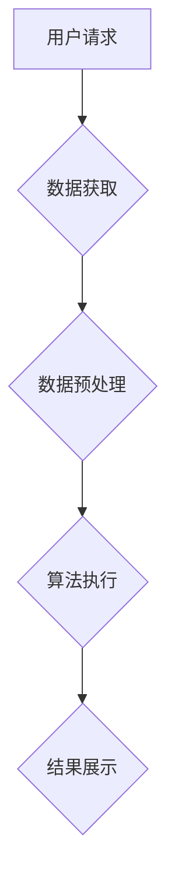

                 

## 知识发现引擎的移动端适配与优化

> 关键词：知识发现引擎、移动端适配、性能优化、算法效率、数据压缩、用户体验

## 1. 背景介绍

随着移动互联网的蓬勃发展，用户对知识获取的需求日益增长。知识发现引擎（KDE）作为一种能够从海量数据中挖掘有价值知识的技术，在移动端应用场景中展现出巨大的潜力。然而，移动设备的资源受限（例如处理能力、内存和电池寿命）对KDE的性能和用户体验提出了严峻挑战。因此，如何有效地将KDE适配到移动端，并对其进行优化，成为一个重要的研究课题。

### 1.1 移动端知识发现需求

移动端用户对知识的需求更加碎片化和即时化。他们希望能够在任何时间、任何地点快速获取所需的信息。例如：

* **个性化推荐:** 用户希望根据自己的兴趣和偏好，获得个性化的知识推荐，例如新闻、文章、视频等。
* **实时搜索:** 用户需要能够快速搜索相关信息，例如查询天气、交通状况、商品价格等。
* **离线知识访问:** 用户希望能够在没有网络连接的情况下访问已下载的知识内容。

### 1.2 移动端KDE面临的挑战

移动端KDE面临着以下挑战：

* **资源限制:** 移动设备的处理能力、内存和电池寿命远低于传统桌面电脑，这限制了KDE的算法复杂度和运行效率。
* **网络环境:** 移动网络的连接质量和稳定性不如固定网络，这可能导致KDE的性能下降。
* **用户体验:** 用户对移动设备的交互体验要求更高，KDE需要提供流畅、便捷的用户界面和操作体验。

## 2. 核心概念与联系

知识发现引擎的核心是利用数据挖掘、机器学习等技术，从海量数据中发现隐藏的模式、趋势和关系。移动端KDE需要根据移动端的特点进行适配和优化，主要涉及以下几个方面：

* **算法选择:** 选择适合移动端运行的轻量级算法，例如基于规则的算法、树模型算法、聚类算法等。
* **数据压缩:** 对数据进行压缩处理，减少数据传输和存储量，提高效率。
* **离线处理:** 尽可能将KDE的处理过程离线化，减少对网络的依赖，提高用户体验。

**Mermaid 流程图:**



## 3. 核心算法原理 & 具体操作步骤

### 3.1 算法原理概述

移动端KDE常用的算法包括：

* **基于规则的算法:** 基于事先定义的规则，对数据进行匹配和分析，例如基于关键词的搜索、基于分类的推荐等。
* **树模型算法:** 利用树结构来表示数据之间的关系，例如决策树、条件随机场等。
* **聚类算法:** 将数据按照相似性进行分组，例如K-means聚类、层次聚类等。

### 3.2 算法步骤详解

以基于规则的算法为例，其具体操作步骤如下：

1. **规则定义:** 根据业务需求，定义一组规则，用于描述数据之间的关系和模式。
2. **数据预处理:** 对获取的数据进行清洗、转换和格式化，使其符合规则匹配的格式。
3. **规则匹配:** 将数据与定义的规则进行匹配，找出符合规则的数据。
4. **结果分析:** 对匹配到的数据进行分析，提取出有价值的知识。

### 3.3 算法优缺点

**基于规则的算法:**

* **优点:** 规则易于理解和维护，算法执行效率高。
* **缺点:** 规则的定义需要人工干预，难以处理复杂的数据关系，缺乏灵活性。

**树模型算法:**

* **优点:** 可以处理复杂的数据关系，具有较高的准确率。
* **缺点:** 算法复杂度较高，训练时间较长，需要大量的训练数据。

**聚类算法:**

* **优点:** 可以发现数据中的隐含结构，适用于无监督学习。
* **缺点:** 聚类结果的解释性较弱，需要根据具体应用场景进行调整。

### 3.4 算法应用领域

移动端KDE的算法可以应用于以下领域：

* **个性化推荐:** 根据用户的兴趣和行为，推荐相关的新闻、文章、商品等。
* **实时搜索:** 快速搜索相关信息，例如查询天气、交通状况、商品价格等。
* **知识问答:** 回答用户的知识性问题，例如历史事件、科学知识、地理位置等。
* **智能助手:** 提供语音识别、自然语言理解等功能，帮助用户完成各种任务。

## 4. 数学模型和公式 & 详细讲解 & 举例说明

### 4.1 数学模型构建

在移动端KDE中，常用的数学模型包括：

* **距离度量:** 用于衡量数据之间的相似性，例如欧氏距离、余弦相似度等。
* **概率模型:** 用于描述数据之间的概率关系，例如贝叶斯网络、隐马尔可夫模型等。
* **机器学习模型:** 用于学习数据之间的模式和关系，例如线性回归、逻辑回归、支持向量机等。

### 4.2 公式推导过程

以欧氏距离为例，其公式如下：

$$
d(x, y) = \sqrt{\sum_{i=1}^{n}(x_i - y_i)^2}
$$

其中：

* $x$ 和 $y$ 是两个数据点。
* $x_i$ 和 $y_i$ 是数据点 $x$ 和 $y$ 的第 $i$ 个特征值。
* $n$ 是数据的维度。

欧氏距离的推导过程是基于几何学的距离概念，即两个数据点之间的直线距离。

### 4.3 案例分析与讲解

假设有两个数据点 $x = (2, 3)$ 和 $y = (5, 7)$，则它们的欧氏距离为：

$$
d(x, y) = \sqrt{(2 - 5)^2 + (3 - 7)^2} = \sqrt{(-3)^2 + (-4)^2} = \sqrt{9 + 16} = \sqrt{25} = 5
$$

## 5. 项目实践：代码实例和详细解释说明

### 5.1 开发环境搭建

* **操作系统:** Android 或 iOS
* **编程语言:** Java 或 Swift
* **开发工具:** Android Studio 或 Xcode

### 5.2 源代码详细实现

以下是一个基于规则的移动端KDE的简单代码示例（Java）：

```java
public class RuleBasedKDE {

    private List<Rule> rules;

    public RuleBasedKDE(List<Rule> rules) {
        this.rules = rules;
    }

    public List<Result> execute(Data data) {
        List<Result> results = new ArrayList<>();
        for (Rule rule : rules) {
            if (rule.match(data)) {
                results.add(rule.apply(data));
            }
        }
        return results;
    }
}
```

**解释:**

* `RuleBasedKDE` 类代表一个基于规则的KDE实例。
* `rules` 属性存储了一组规则。
* `execute` 方法接收数据作为输入，并根据规则进行匹配和应用，返回匹配结果。

### 5.3 代码解读与分析

* 该代码示例展示了基于规则的KDE的基本结构。
* 规则的定义和应用需要根据具体业务需求进行定制。
* 数据的格式和规则的匹配方式需要进行相应的处理。

### 5.4 运行结果展示

运行该代码示例后，会根据规则匹配的数据，返回相应的匹配结果。

## 6. 实际应用场景

### 6.1 个性化新闻推荐

移动端新闻应用可以利用KDE，根据用户的阅读历史、兴趣标签等信息，推荐个性化的新闻内容。

### 6.2 智能购物助手

移动端购物应用可以利用KDE，根据用户的浏览记录、购买历史等信息，推荐相关的商品和优惠活动。

### 6.3 智慧医疗诊断

移动端医疗应用可以利用KDE，分析用户的症状描述、病历信息等，辅助医生进行诊断。

### 6.4 未来应用展望

随着移动设备的普及和人工智能技术的进步，移动端KDE的应用场景将会更加广泛，例如：

* **个性化教育:** 根据学生的学习进度和兴趣，提供个性化的学习内容和辅导。
* **智慧城市:** 利用KDE分析城市数据，提供交通规划、环境监测等服务。
* **智能家居:** 利用KDE控制智能家居设备，提供个性化的家居体验。

## 7. 工具和资源推荐

### 7.1 学习资源推荐

* **书籍:**
    * 《数据挖掘：概念与技术》
    * 《机器学习》
* **在线课程:**
    * Coursera: 数据挖掘和机器学习
    * edX: 人工智能导论

### 7.2 开发工具推荐

* **Android Studio:** Android应用开发工具
* **Xcode:** iOS应用开发工具
* **TensorFlow Lite:** 轻量级机器学习框架

### 7.3 相关论文推荐

* **"A Survey of Knowledge Discovery in Mobile Environments"**
* **"Mobile Knowledge Discovery: Challenges and Opportunities"**

## 8. 总结：未来发展趋势与挑战

### 8.1 研究成果总结

移动端KDE的研究取得了显著进展，在算法、模型、工具等方面积累了丰富的经验。

### 8.2 未来发展趋势

* **算法效率提升:** 开发更轻量级、更高效的算法，适应移动端的资源限制。
* **模型可解释性增强:** 提高KDE模型的解释性，帮助用户理解推荐结果和决策过程。
* **隐私保护:** 关注移动端KDE的隐私安全问题，保护用户数据安全。

### 8.3 面临的挑战

* **数据质量:** 移动端数据往往不完整、不准确，需要进行有效的预处理和清洗。
* **网络环境:** 移动网络的连接质量和稳定性难以保证，需要考虑网络波动对KDE的影响。
* **用户体验:** 移动端KDE需要提供流畅、便捷的用户体验，满足用户的个性化需求。

### 8.4 研究展望

未来移动端KDE的研究将更加注重算法的效率、模型的可解释性和隐私保护，并探索新的应用场景，为用户提供更加智能、便捷的移动体验。

## 9. 附录：常见问题与解答

### 9.1 如何选择合适的KDE算法？

选择合适的KDE算法需要根据具体的应用场景和数据特点进行考虑。例如，如果数据量较小，可以使用基于规则的算法；如果数据量较大，需要考虑使用树模型算法或聚类算法。

### 9.2 如何提高KDE的效率？

可以采用以下方法提高KDE的效率：

* 选择轻量级的算法。
* 对数据进行压缩处理。
* 采用离线处理的方式。
* 利用并行计算技术。

### 9.3 如何保证KDE的隐私安全？

可以采用以下方法保证KDE的隐私安全：

* 对用户数据进行匿名化处理。
* 使用加密技术保护用户数据。
* 遵循数据隐私保护的法律法规。


作者：禅与计算机程序设计艺术 / Zen and the Art of Computer Programming 
<end_of_turn>

