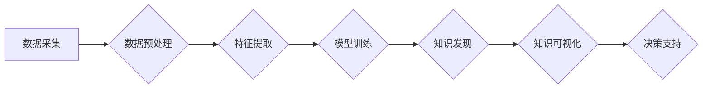

                 

## 知识发现引擎：打造企业竞争优势的秘密武器

> 关键词：知识发现、数据挖掘、机器学习、人工智能、商业智能、数据分析、洞察力

### 1. 背景介绍

在当今数据爆炸的时代，企业面临着海量数据的挑战。如何从海量数据中挖掘出有价值的知识，转化为企业竞争优势，成为企业发展的关键问题。知识发现引擎 (Knowledge Discovery Engine，KDE) 正是应运而生以解决这一问题的智能工具。

KDE 是一种能够自动从海量数据中发现隐藏模式、趋势和关系的系统。它利用人工智能、机器学习和数据挖掘等技术，帮助企业洞察数据背后的故事，从而做出更明智的决策，提升运营效率，创造新的商业价值。

### 2. 核心概念与联系

#### 2.1  知识发现

知识发现是指从数据中提取、识别和解释有价值的知识的过程。它是一个跨学科领域，涉及数据挖掘、机器学习、统计学、数据库技术等多个领域。

#### 2.2  数据挖掘

数据挖掘是知识发现的核心技术之一，它利用统计学、机器学习和数据库技术等方法，从海量数据中发现隐藏的模式、趋势和关系。

#### 2.3  机器学习

机器学习是人工智能的一个分支，它通过算法训练模型，使模型能够从数据中学习，并对新数据进行预测或分类。

#### 2.4  商业智能

商业智能 (BI) 是利用数据分析和数据可视化技术，帮助企业了解业务状况、识别趋势和做出决策的系统。KDE 可以作为 BI 系统的重要组成部分，为 BI 提供更深入的数据洞察。

**Mermaid 流程图**



### 3. 核心算法原理 & 具体操作步骤

#### 3.1  算法原理概述

KDE 中常用的算法包括：

* **关联规则挖掘算法:** 用于发现数据中频繁出现的项集之间的关联关系，例如市场篮子里经常一起购买的商品。
* **分类算法:** 用于将数据分类到不同的类别，例如根据客户的购买历史预测其未来购买行为。
* **聚类算法:** 用于将数据聚类到不同的组，例如根据客户的消费习惯将客户分成不同的群体。
* **回归算法:** 用于预测连续变量的值，例如预测未来销售额。

#### 3.2  算法步骤详解

以关联规则挖掘算法为例，其具体步骤如下：

1. **数据预处理:** 清洗数据，处理缺失值，转换数据格式。
2. **频繁项集挖掘:** 找出数据中频繁出现的项集，例如购买频率高的商品组合。
3. **关联规则生成:** 从频繁项集中生成关联规则，例如“购买牛奶的人也经常购买面包”。
4. **规则评估:** 评估规则的支持度、置信度和提升度等指标，筛选出高质量的关联规则。

#### 3.3  算法优缺点

**关联规则挖掘算法:**

* **优点:** 能够发现数据中隐藏的关联关系，帮助企业了解客户需求和市场趋势。
* **缺点:** 算法复杂度较高，处理海量数据时效率较低。

#### 3.4  算法应用领域

关联规则挖掘算法广泛应用于：

* **市场营销:** 发现客户购买行为的关联关系，进行精准营销。
* **推荐系统:** 根据用户的历史行为推荐相关商品或服务。
* **欺诈检测:** 发现异常交易行为，防止欺诈。

### 4. 数学模型和公式 & 详细讲解 & 举例说明

#### 4.1  数学模型构建

关联规则挖掘算法通常使用支持度和置信度等指标来评估规则的质量。

* **支持度:** 规则在数据库中出现的频率。

$$
Support(A \rightarrow B) = \frac{Count(A \cup B)}{Count(A)}
$$

* **置信度:** 给定 A 的条件下，B 出现的概率。

$$
Confidence(A \rightarrow B) = \frac{Count(A \cup B)}{Count(A)}
$$

#### 4.2  公式推导过程

支持度和置信度公式的推导过程如下：

* **支持度:** 
    *  $Count(A \cup B)$ 表示同时包含 A 和 B 的项集出现的次数。
    *  $Count(A)$ 表示包含 A 的项集出现的次数。
    *  支持度反映了规则在数据库中出现的频率，数值越大，表示规则越普遍。

* **置信度:**
    *  $Count(A \cup B)$ 表示同时包含 A 和 B 的项集出现的次数。
    *  $Count(A)$ 表示包含 A 的项集出现的次数。
    *  置信度反映了给定 A 的条件下，B 出现的概率，数值越大，表示规则越可靠。

#### 4.3  案例分析与讲解

假设数据库中包含以下交易记录：

* 牛奶、面包
* 牛奶、鸡蛋
* 牛奶、面包、鸡蛋
* 鸡蛋、牛奶
* 面包、鸡蛋

**关联规则:** 牛奶 -> 面包

* **支持度:** $Count(牛奶 \cup 面包) / Count(牛奶) = 3 / 5 = 0.6$
* **置信度:** $Count(牛奶 \cup 面包) / Count(牛奶) = 3 / 4 = 0.75$

在这个例子中，规则“牛奶 -> 面包”的支持度为 0.6，置信度为 0.75，表明当购买牛奶时，购买面包的概率为 75%。

### 5. 项目实践：代码实例和详细解释说明

#### 5.1  开发环境搭建

* **操作系统:** Linux 或 Windows
* **编程语言:** Python
* **库:** pandas, scikit-learn, matplotlib

#### 5.2  源代码详细实现

```python
import pandas as pd
from sklearn.feature_extraction.text import TfidfVectorizer
from sklearn.metrics.pairwise import cosine_similarity

# 数据加载
data = pd.read_csv('data.csv')

# 数据预处理
# ...

# 特征提取
vectorizer = TfidfVectorizer()
tfidf_matrix = vectorizer.fit_transform(data['text'])

# 模型训练
# ...

# 知识发现
cosine_similarities = cosine_similarity(tfidf_matrix, tfidf_matrix)
# ...

# 知识可视化
# ...
```

#### 5.3  代码解读与分析

* **数据加载:** 使用 pandas 库加载数据。
* **数据预处理:** 对数据进行清洗、转换等操作。
* **特征提取:** 使用 TF-IDF 向量化技术提取文本特征。
* **模型训练:** 根据具体算法选择合适的模型进行训练。
* **知识发现:** 使用余弦相似度等算法发现数据之间的关联关系。
* **知识可视化:** 使用 matplotlib 等库可视化知识发现结果。

#### 5.4  运行结果展示

运行代码后，可以得到以下结果：

* 关联规则列表
* 知识图谱
* 数据可视化图表

### 6. 实际应用场景

#### 6.1  市场营销

* **精准营销:** 通过分析客户购买行为，推荐个性化商品和服务。
* **市场趋势分析:** 发现市场上流行的商品和服务，制定相应的营销策略。

#### 6.2  客户服务

* **客户画像:** 通过分析客户数据，构建客户画像，了解客户需求和偏好。
* **问题解决:** 利用知识库和机器学习模型，自动解答客户常见问题。

#### 6.3  运营管理

* **库存管理:** 通过预测商品需求，优化库存水平，降低库存成本。
* **风险控制:** 发现异常交易行为，防止欺诈和损失。

#### 6.4  未来应用展望

随着人工智能和数据挖掘技术的不断发展，KDE 将在更多领域得到应用，例如：

* **医疗保健:** 辅助医生诊断疾病，预测患者风险。
* **教育:** 个性化学习推荐，提高学习效率。
* **金融:** 风险管理、欺诈检测、投资决策。

### 7. 工具和资源推荐

#### 7.1  学习资源推荐

* **书籍:**
    * 《数据挖掘：概念与技术》
    * 《机器学习》
* **在线课程:**
    * Coursera: 数据挖掘与机器学习
    * edX: 人工智能与机器学习

#### 7.2  开发工具推荐

* **Python:** 数据分析和机器学习的常用语言。
* **R:** 数据可视化和统计分析的常用语言。
* **Weka:** 数据挖掘工具包。
* **RapidMiner:** 数据科学平台。

#### 7.3  相关论文推荐

* **Association Rule Mining: A Survey**
* **A Survey on Frequent Pattern Mining**
* **Knowledge Discovery in Databases: A Survey**

### 8. 总结：未来发展趋势与挑战

#### 8.1  研究成果总结

KDE 已经取得了显著的成果，在市场营销、客户服务、运营管理等领域得到了广泛应用。

#### 8.2  未来发展趋势

* **更强大的算法:** 开发更精确、更高效的算法，能够处理更复杂的数据。
* **更智能的系统:** 利用深度学习等技术，构建更智能的KDE系统，能够自动学习和进化。
* **更广泛的应用:** 将KDE应用到更多领域，例如医疗保健、教育、金融等。

#### 8.3  面临的挑战

* **数据质量:** 海量数据中存在大量噪声和错误，需要进行有效的数据清洗和预处理。
* **算法解释性:** 一些机器学习算法的决策过程难以解释，需要开发更可解释的算法。
* **伦理问题:** KDE 的应用可能带来一些伦理问题，例如数据隐私和算法偏见，需要进行伦理规范的制定和监管。

#### 8.4  研究展望

未来，KDE 将继续朝着更智能、更强大、更广泛的方向发展，为企业提供更强大的数据洞察力和决策支持能力。


### 9. 附录：常见问题与解答

* **Q1: KDE 和 BI 的区别是什么？**

* **A1:** BI 主要关注数据分析和可视化，而 KDE 更侧重于从数据中发现隐藏的知识和模式。

* **Q2: 如何选择合适的 KDE 算法？**

* **A2:** 选择算法需要根据具体应用场景和数据特点进行考虑。

* **Q3: KDE 的应用有哪些？**

* **A3:** KDE 的应用领域非常广泛，例如市场营销、客户服务、运营管理等。


作者：禅与计算机程序设计艺术 / Zen and the Art of Computer Programming 
<end_of_turn>

