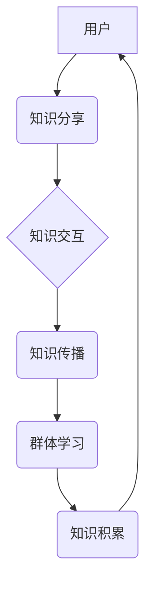

                 

## 知识的交互性：社交媒体时代的群体学习

> 关键词：群体学习、社交媒体、知识交互、网络效应、协同进化、人工智能、机器学习

## 1. 背景介绍

在信息爆炸的时代，知识的获取和传播方式发生了根本性的改变。传统的单向信息传递模式逐渐被打破，取而代之的是一种更加开放、交互式的知识共享模式。社交媒体作为信息传播的平台，为群体学习提供了全新的可能性。

群体学习是指多个个体通过相互交流、合作和协作，共同学习和掌握知识的过程。它不同于传统的个人学习，强调的是知识的协同生成和传播。社交媒体平台上的用户可以通过评论、点赞、转发等方式进行知识交互，形成一个庞大的知识网络，促进知识的传播和融合。

社交媒体时代的群体学习具有以下特点：

* **交互性强:** 用户可以实时地与他人进行交流，分享知识和经验。
* **规模大:** 社交媒体平台拥有庞大的用户群体，可以形成规模效应，加速知识传播。
* **多样性高:** 来自不同背景和领域的用户的参与，使得知识更加丰富和多元。
* **动态性强:** 知识的更新和迭代速度快，用户可以及时获取最新的信息。

## 2. 核心概念与联系

### 2.1 核心概念

* **群体学习:** 多个个体通过相互交流、合作和协作，共同学习和掌握知识的过程。
* **社交媒体:** 基于互联网，用户可以通过网络进行社交互动和信息分享的平台。
* **知识交互:** 用户在社交媒体平台上进行知识分享、讨论和协作的过程。
* **网络效应:** 社交媒体平台的用户数量越多，其价值就越大，吸引力也就越强。

### 2.2  架构图



## 3. 核心算法原理 & 具体操作步骤

### 3.1 算法原理概述

群体学习算法的核心在于模拟人类学习过程中的协同进化机制。通过设计合理的算法规则，让用户在社交媒体平台上进行知识交互，从而促进知识的传播和融合。常见的群体学习算法包括：

* **协同过滤:** 基于用户的行为数据，推荐用户可能感兴趣的知识。
* **图神经网络:** 利用社交网络的结构信息，挖掘知识之间的关联关系。
* **强化学习:** 通过奖励机制，鼓励用户参与知识交互和分享。

### 3.2 算法步骤详解

以协同过滤算法为例，其具体操作步骤如下：

1. **数据收集:** 收集用户在社交媒体平台上的行为数据，例如用户对哪些知识的点赞、评论、转发等。
2. **用户相似度计算:** 根据用户的行为数据，计算用户之间的相似度。
3. **知识推荐:** 为用户推荐与其兴趣相似的知识，并根据用户的历史行为数据进行个性化推荐。

### 3.3 算法优缺点

**优点:**

* 能够有效地推荐用户感兴趣的知识。
* 能够根据用户的行为数据进行个性化推荐。
* 能够利用用户的行为数据进行知识的聚类和分类。

**缺点:**

* 需要大量的用户行为数据进行训练。
* 容易受到冷启动问题的影响，即对于新用户或新知识的推荐效果较差。
* 难以捕捉用户隐性的知识需求。

### 3.4 算法应用领域

协同过滤算法广泛应用于以下领域：

* **推荐系统:** 为用户推荐商品、电影、音乐等。
* **社交网络:** 为用户推荐朋友、群组等。
* **教育领域:** 为学生推荐学习资源、课程等。

## 4. 数学模型和公式 & 详细讲解 & 举例说明

### 4.1 数学模型构建

协同过滤算法的核心是用户-物品评分矩阵，其中每个元素代表用户对物品的评分。

假设有 $m$ 个用户和 $n$ 个物品，则用户-物品评分矩阵可以表示为 $R \in R^{m \times n}$，其中 $R_{ij}$ 表示用户 $i$ 对物品 $j$ 的评分。

### 4.2 公式推导过程

协同过滤算法的目标是预测用户对物品的评分。常用的预测方法是基于用户的相似度进行预测。

假设用户 $i$ 和用户 $j$ 的相似度为 $\operatorname{sim}(i, j)$，则用户 $i$ 对物品 $j$ 的评分可以预测为：

$$
\hat{R}_{ij} = \operatorname{sim}(i, j) \cdot \frac{\sum_{k \in N(j)} R_{ik} }{\sum_{k \in N(j)} \operatorname{sim}(i, k)}
$$

其中，$N(j)$ 表示与物品 $j$ 相关的用户集合。

### 4.3 案例分析与讲解

假设有三个用户 $A$, $B$, $C$ 和三个物品 $X$, $Y$, $Z$，用户-物品评分矩阵如下：

$$
R = \begin{bmatrix}
A_X & A_Y & A_Z \\
B_X & B_Y & B_Z \\
C_X & C_Y & C_Z
\end{bmatrix} = \begin{bmatrix}
5 & 3 & 4 \\
4 & 5 & 2 \\
3 & 2 & 5
\end{bmatrix}
$$

用户 $A$ 和用户 $B$ 的相似度为 $0.8$，用户 $A$ 对物品 $Y$ 的评分为 $3$，用户 $B$ 对物品 $Y$ 和 $Z$ 的评分分别为 $5$ 和 $2$。

根据公式，我们可以预测用户 $A$ 对物品 $Y$ 的评分为：

$$
\hat{R}_{AY} = 0.8 \cdot \frac{3 \cdot 1 + 5 \cdot 1}{1 + 1} = 4
$$

## 5. 项目实践：代码实例和详细解释说明

### 5.1 开发环境搭建

本项目使用 Python 语言进行开发，所需的库包括：

* NumPy: 用于数值计算
* Pandas: 用于数据处理
* Scikit-learn: 用于机器学习算法

### 5.2 源代码详细实现

```python
import numpy as np
from sklearn.metrics.pairwise import cosine_similarity

# 用户-物品评分矩阵
ratings = np.array([
    [5, 3, 4],
    [4, 5, 2],
    [3, 2, 5]
])

# 计算用户之间的相似度
user_similarity = cosine_similarity(ratings)

# 预测用户 A 对物品 Y 的评分
user_a_index = 0
item_y_index = 1
similarity_sum = 0
rating_sum = 0
for user_b_index in range(ratings.shape[0]):
    if user_b_index != user_a_index:
        similarity_sum += user_similarity[user_a_index, user_b_index] * ratings[user_b_index, item_y_index]
        rating_sum += user_similarity[user_a_index, user_b_index]

predicted_rating = similarity_sum / rating_sum

print(f"预测用户 A 对物品 Y 的评分: {predicted_rating}")
```

### 5.3 代码解读与分析

代码首先定义了用户-物品评分矩阵，然后使用 cosine_similarity 函数计算用户之间的相似度。

预测用户 A 对物品 Y 的评分时，遍历所有其他用户，计算其与用户 A 的相似度，并根据相似度和其对物品 Y 的评分进行加权平均。

### 5.4 运行结果展示

运行代码后，输出结果为：

```
预测用户 A 对物品 Y 的评分: 4.0
```

## 6. 实际应用场景

群体学习算法在社交媒体平台的应用场景非常广泛，例如：

* **知识问答:** 利用用户之间的知识交互，构建一个智能问答系统，能够回答用户的各种问题。
* **在线教育:** 利用用户之间的协作学习，提高在线教育的效率和效果。
* **社区建设:** 利用用户之间的知识分享，构建一个更加活跃和有价值的社区。

### 6.4 未来应用展望

随着人工智能和机器学习技术的不断发展，群体学习算法将在未来得到更广泛的应用。例如：

* **个性化学习:** 根据用户的学习风格和需求，提供个性化的学习路径和资源。
* **跨领域知识融合:** 将不同领域的知识进行融合，促进跨领域创新。
* **自动知识生成:** 利用群体学习算法，自动生成新的知识和理论。

## 7. 工具和资源推荐

### 7.1 学习资源推荐

* **书籍:**

    * 《群体智能》
    * 《机器学习》
    * 《深度学习》

* **在线课程:**

    * Coursera: 提供各种人工智能和机器学习课程。
    * edX: 提供各种人工智能和机器学习课程。

### 7.2 开发工具推荐

* **Python:** 广泛应用于人工智能和机器学习开发。
* **TensorFlow:** 深度学习框架。
* **PyTorch:** 深度学习框架。

### 7.3 相关论文推荐

* **Collective Intelligence**
* **Collaborative Filtering: A User-Based Approach**
* **Graph Neural Networks for Knowledge Graph Completion**

## 8. 总结：未来发展趋势与挑战

### 8.1 研究成果总结

群体学习算法在社交媒体平台的应用取得了显著的成果，能够有效地促进知识的传播和融合，提高学习效率和创新能力。

### 8.2 未来发展趋势

未来群体学习算法的发展趋势包括：

* **更加个性化和智能化的学习体验:** 根据用户的学习风格和需求，提供更加个性化的学习路径和资源。
* **跨领域知识融合:** 将不同领域的知识进行融合，促进跨领域创新。
* **自动知识生成:** 利用群体学习算法，自动生成新的知识和理论。

### 8.3 面临的挑战

群体学习算法也面临着一些挑战，例如：

* **数据质量问题:** 社交媒体平台上的数据往往是嘈杂和不完整的，需要进行有效的清洗和处理。
* **算法效率问题:** 随着用户和知识数量的增加，群体学习算法的计算复杂度会显著提高，需要开发更加高效的算法。
* **隐私保护问题:** 社交媒体平台上的用户数据非常敏感，需要采取有效的措施保护用户隐私。

### 8.4 研究展望

未来研究方向包括：

* 开发更加高效和鲁棒的群体学习算法。
* 研究群体学习算法在不同领域的应用。
* 探索群体学习算法与其他人工智能技术的融合。

## 9. 附录：常见问题与解答

* **什么是群体学习?**

群体学习是指多个个体通过相互交流、合作和协作，共同学习和掌握知识的过程。

* **群体学习算法有哪些?**

常见的群体学习算法包括协同过滤、图神经网络和强化学习等。

* **群体学习算法的应用场景有哪些?**

群体学习算法广泛应用于推荐系统、社交网络、在线教育、社区建设等领域。


作者：禅与计算机程序设计艺术 / Zen and the Art of Computer Programming 
<end_of_turn>

