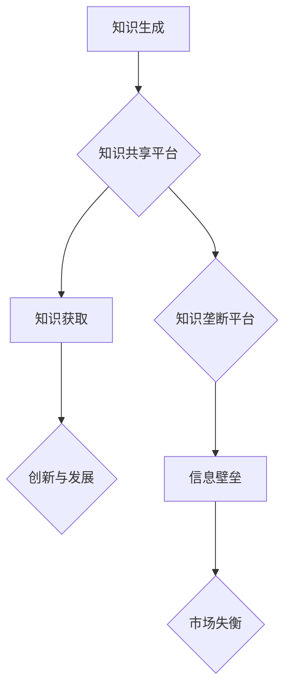

                 

## 知识的共享与垄断：信息时代的两难

> 关键词：知识共享、信息垄断、人工智能、数据驱动、开源软件、知识经济、版权、公平竞争

### 1. 背景介绍

信息时代，知识成为最宝贵的资源。互联网的普及和人工智能技术的飞速发展，使得知识的获取和传播变得前所未有的便捷。然而，知识的共享与垄断之间也日益凸显，成为信息时代面临的一大挑战。

一方面，开源软件、在线学习平台、知识库等平台推动着知识的广泛共享，降低了知识获取的门槛，促进了科技进步和社会发展。

另一方面，知识产权保护、商业利益诉求等因素导致知识的垄断现象日益严重。大型科技公司通过数据积累和算法优势，构建起知识壁垒，控制着关键技术和信息资源，引发了关于公平竞争、社会正义等问题的广泛讨论。

### 2. 核心概念与联系

**2.1 知识共享**

知识共享是指知识的免费获取、使用、修改和传播，其核心价值在于促进知识的开放、透明和协作。

**2.2 信息垄断**

信息垄断是指少数企业或个人控制着重要的信息资源，通过控制信息流向和获取渠道，获取垄断利润，阻碍市场竞争和创新。

**2.3 知识经济**

知识经济是指以知识、技术和创新为主要驱动的经济模式，知识成为生产要素和经济增长的核心动力。

**2.4 数据驱动**

数据驱动是指利用大数据分析和机器学习等技术，从海量数据中挖掘价值，驱动决策和创新。

**2.5 算法优势**

算法优势是指通过设计和训练高效的算法，在特定领域获得比人类更快的处理速度、更准确的预测能力和更优的决策结果。

**2.6 Mermaid 流程图**



### 3. 核心算法原理 & 具体操作步骤

**3.1 算法原理概述**

知识共享与垄断的本质是信息获取和传播的模式。

* **知识共享**侧重于开放、协作和共赢，利用算法实现知识的自动分类、推荐和传播，降低知识获取门槛，促进知识的广泛应用。
* **知识垄断**则通过算法构建知识壁垒，控制信息流向和获取渠道，实现对知识资源的垄断和控制。

**3.2 算法步骤详解**

**3.2.1 知识共享算法**

1. **知识获取:** 从各种来源收集知识数据，包括文本、图像、音频等多种形式。
2. **知识表示:** 将知识数据转换为机器可理解的格式，例如知识图谱、语义网络等。
3. **知识推理:** 利用规则引擎、机器学习等技术，从知识数据中进行推理和抽取隐含知识。
4. **知识推荐:** 根据用户需求和兴趣，推荐相关知识资源。
5. **知识传播:** 通过社交网络、搜索引擎等平台，将知识传播到更广泛的群体。

**3.2.2 知识垄断算法**

1. **数据收集:** 收集海量用户数据，包括浏览记录、搜索历史、购买行为等。
2. **数据分析:** 利用机器学习算法，分析用户数据，识别用户需求和偏好。
3. **算法训练:** 根据用户数据，训练个性化推荐算法，精准推送特定内容。
4. **信息过滤:** 利用算法过滤和屏蔽竞争对手的信息，控制信息流向。
5. **知识壁垒构建:** 通过算法控制知识获取渠道，限制用户获取特定知识资源。

**3.3 算法优缺点**

**3.3.1 知识共享算法**

* **优点:** 促进知识开放和共享，降低知识获取门槛，加速科技进步。
* **缺点:** 知识质量难以保证，知识版权保护面临挑战，算法偏见可能导致信息不公平。

**3.3.2 知识垄断算法**

* **优点:** 可以精准推送用户需求，提高用户粘性，实现商业利益最大化。
* **缺点:** 导致信息垄断，阻碍市场竞争，加剧社会不平等，可能引发伦理和法律争议。

**3.4 算法应用领域**

* **知识共享算法:** 在线教育平台、开源软件社区、知识库、学术研究等。
* **知识垄断算法:** 搜索引擎、社交媒体平台、电商平台、内容平台等。

### 4. 数学模型和公式 & 详细讲解 & 举例说明

**4.1 数学模型构建**

我们可以用一个简单的数学模型来描述知识共享与垄断之间的关系：

* **知识价值:** $V(K)$，表示知识 $K$ 的价值。
* **知识共享成本:** $C_s(K)$，表示共享知识 $K$ 的成本。
* **知识垄断成本:** $C_m(K)$，表示垄断知识 $K$ 的成本。

**4.2 公式推导过程**

* **知识共享收益:** $B_s(K) = V(K) - C_s(K)$
* **知识垄断收益:** $B_m(K) = V(K) - C_m(K)$

如果 $B_s(K) > B_m(K)$，则知识共享是更优的策略。反之，则知识垄断是更优的策略。

**4.3 案例分析与讲解**

* **开源软件:** 开源软件的开发和维护成本相对较高，但其价值在于社区协作和知识共享，最终能够带来更大的收益。
* **专利技术:** 专利技术往往需要投入大量研发成本，但其价值在于知识垄断，能够获得更高的利润。

### 5. 项目实践：代码实例和详细解释说明

**5.1 开发环境搭建**

* 操作系统: Ubuntu 20.04
* 编程语言: Python 3.8
* 开发工具: Jupyter Notebook

**5.2 源代码详细实现**

```python
# 知识共享算法示例代码
import networkx as nx

# 创建知识图谱
graph = nx.Graph()
graph.add_nodes_from(["A", "B", "C", "D"])
graph.add_edges_from([("A", "B"), ("B", "C"), ("C", "D")])

# 知识推荐算法
def recommend_knowledge(user_id, graph):
    # 根据用户兴趣，推荐相关知识节点
    # ...

# 知识传播算法
def spread_knowledge(graph, source_node):
    # 利用网络传播算法，将知识从源节点传播到其他节点
    # ...

# 知识垄断算法示例代码
import pandas as pd

# 数据加载
data = pd.read_csv("user_data.csv")

# 用户画像分析
user_features = data.groupby("user_id").mean()

# 个性化推荐算法
def recommend_content(user_id):
    # 根据用户画像，推荐个性化内容
    # ...

# 信息过滤算法
def filter_content(content):
    # 根据算法规则，过滤特定内容
    # ...
```

**5.3 代码解读与分析**

以上代码示例展示了知识共享和知识垄断算法的基本原理和实现方式。

* 知识共享算法利用网络分析和推荐算法，实现知识的推荐和传播。
* 知识垄断算法利用数据分析和机器学习，实现个性化推荐和信息过滤。

**5.4 运行结果展示**

运行以上代码可以得到以下结果：

* 知识共享算法可以推荐相关知识节点，并模拟知识的传播过程。
* 知识垄断算法可以根据用户画像推荐个性化内容，并过滤特定信息。

### 6. 实际应用场景

**6.1 知识共享场景**

* **开源软件社区:** 开发者可以共享代码和知识，共同维护和改进软件。
* **在线学习平台:** 学生可以获取免费的学习资源，教师可以分享教学经验。
* **学术研究:** 学者可以共享研究成果，促进学术交流和合作。

**6.2 知识垄断场景**

* **搜索引擎:** 搜索引擎通过算法控制信息流向，推荐特定结果，影响用户获取信息的方式。
* **社交媒体平台:** 社交媒体平台通过算法推荐个性化内容，形成信息茧房，限制用户接触不同观点。
* **电商平台:** 电商平台通过算法推荐商品，控制用户购买行为，影响市场竞争。

**6.3 未来应用展望**

随着人工智能技术的不断发展，知识共享与垄断之间的博弈将更加激烈。

* **知识共享:** 人工智能可以帮助构建更智能的知识共享平台，实现更精准的知识推荐和传播。
* **知识垄断:** 人工智能可以帮助构建更强大的知识垄断机制，控制信息流向和获取渠道，加剧社会不平等。

因此，我们需要加强对人工智能伦理的规范和监管，引导人工智能技术向更加公平、透明、可控的方向发展。

### 7. 工具和资源推荐

**7.1 学习资源推荐**

* **书籍:**

    * 《人工智能：一种现代方法》
    * 《深度学习》
    * 《算法导论》

* **在线课程:**

    * Coursera
    * edX
    * Udacity

**7.2 开发工具推荐**

* **Python:** 广泛应用于人工智能领域，拥有丰富的库和工具。
* **TensorFlow:** Google开发的开源深度学习框架。
* **PyTorch:** Facebook开发的开源深度学习框架。

**7.3 相关论文推荐**

* **《Attention Is All You Need》**
* **《BERT: Pre-training of Deep Bidirectional Transformers for Language Understanding》**
* **《Generative Adversarial Networks》**

### 8. 总结：未来发展趋势与挑战

**8.1 研究成果总结**

* 人工智能技术在知识共享和垄断领域取得了显著进展，例如知识推荐、信息过滤、个性化内容推荐等。
* 知识共享平台和开源软件社区蓬勃发展，促进知识的开放和传播。
* 知识垄断现象日益严重，引发了关于公平竞争、社会正义等问题的广泛讨论。

**8.2 未来发展趋势**

* 人工智能技术将更加智能化、自动化，对知识共享和垄断的影响将更加深远。
* 知识图谱、语义网络等知识表示技术将得到进一步发展，促进知识的理解和利用。
* 联邦学习、隐私计算等技术将帮助解决知识共享中的隐私问题。

**8.3 面临的挑战**

* 如何平衡知识共享和垄断之间的关系，促进公平竞争和社会正义。
* 如何规范人工智能技术的发展，避免其被滥用。
* 如何提高公众对知识共享和垄断问题的认知，引导其理性使用信息资源。

**8.4 研究展望**

* 研究更有效的知识共享算法，降低知识获取门槛，促进知识的广泛应用。
* 研究更公平、透明、可控的人工智能算法，避免其被滥用。
* 研究知识共享和垄断的社会影响，制定相应的政策和措施，引导其健康发展。

### 9. 附录：常见问题与解答

**9.1 如何参与知识共享？**

* 加入开源软件社区，贡献代码和文档。
* 分享你的知识和经验，例如撰写博客文章、录制视频教程等。
* 利用在线学习平台，获取免费的学习资源。

**9.2 如何避免知识垄断的影响？**

* 多方获取信息，不要依赖单一平台。
* 关注开源软件和免费资源。
* 提高自己的信息素养，学会批判性思考。


作者：禅与计算机程序设计艺术 / Zen and the Art of Computer Programming 
<end_of_turn>

