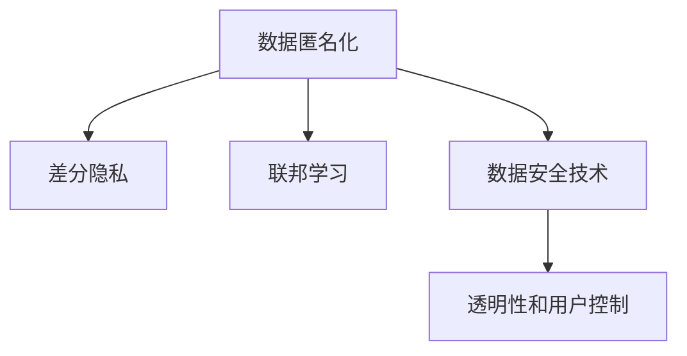

                 

# 搜索引擎的隐私保护功能增强

随着互联网的发展和信息技术的进步，搜索引擎已经成为了人们获取信息的重要工具。然而，搜索引擎在提供高效服务的同时，也带来了隐私风险。用户输入的查询关键词、浏览历史、地理位置等信息被搜索引擎采集和使用，可能引发隐私泄露等问题。为应对这些挑战，各大搜索引擎纷纷增强了隐私保护功能，提升用户信任和使用体验。本文将深入探讨搜索引擎的隐私保护功能增强技术，分析其原理、操作步骤、应用领域和未来发展趋势，并提供代码实例和详细解释。

## 1. 背景介绍

### 1.1 问题由来

搜索引擎的隐私保护问题由来已久，主要包括以下几个方面：

1. **数据泄露**：用户搜索行为、点击记录等数据被搜索引擎用于商业分析和个性化广告推荐，存在泄露风险。
2. **隐私侵害**：搜索引擎可能利用用户数据进行针对性广告投放，侵犯用户隐私权。
3. **法律合规**：各国对隐私保护的法律法规不断加强，搜索引擎需要遵守相关法规，避免法律风险。

为解决这些问题，各大搜索引擎纷纷采取了多种隐私保护措施，包括数据匿名化、差分隐私、联邦学习等技术，以保护用户隐私和增强用户体验。

### 1.2 问题核心关键点

搜索引擎的隐私保护功能增强主要集中在以下几个核心关键点：

1. **数据匿名化**：通过对用户数据进行去标识化处理，避免直接识别出具体用户信息。
2. **差分隐私**：在数据查询和处理过程中，加入噪声干扰，保护个体隐私不被泄露。
3. **联邦学习**：利用分布式计算，在不共享用户数据的前提下，进行模型训练和更新。
4. **数据安全技术**：采用加密、访问控制等技术，保障数据在存储和传输过程中的安全。
5. **透明性和用户控制**：提供用户隐私设置选项，增强用户对隐私保护的知情权和控制权。

## 2. 核心概念与联系

### 2.1 核心概念概述

为更好地理解搜索引擎的隐私保护功能增强，本节将介绍几个密切相关的核心概念：

1. **数据匿名化(Data Anonymization)**：将个人身份信息从数据集中去除，确保数据无法直接识别具体用户。
2. **差分隐私(Differential Privacy)**：一种隐私保护技术，通过在查询结果中引入噪声，使得任何个体隐私不被泄露，同时不显著影响整体查询效果。
3. **联邦学习(Federated Learning)**：一种分布式机器学习技术，模型在多个客户端上训练，数据留在本地，仅在模型参数更新时进行数据交换。
4. **数据安全技术(Data Security)**：采用加密、访问控制等技术，确保数据在存储和传输过程中的机密性、完整性和可用性。
5. **透明性和用户控制(Transparency and User Control)**：提供用户隐私设置选项，让用户了解数据处理流程，并对其隐私行为有控制权。

这些核心概念之间的逻辑关系可以通过以下Mermaid流程图来展示：



这个流程图展示了几项隐私保护措施之间的关系：

1. 数据匿名化是基础，确保数据无法直接识别具体用户。
2. 差分隐私进一步增强隐私保护，确保个体隐私不被泄露。
3. 联邦学习在不共享数据的前提下进行模型训练，提升数据隐私保护。
4. 数据安全技术保障数据在存储和传输过程中的安全。
5. 透明性和用户控制提供用户知情权和控制权，增强用户信任。

## 3. 核心算法原理 & 具体操作步骤
### 3.1 算法原理概述

搜索引擎的隐私保护功能增强主要通过以下几种算法和操作步骤实现：

1. **数据匿名化算法**：通过数据混淆、伪匿名化等技术，去除或替代用户标识信息。
2. **差分隐私算法**：在查询过程中加入噪声，确保个体隐私不被泄露，同时尽量保持查询结果的准确性。
3. **联邦学习算法**：分布式训练模型，仅在模型参数更新时共享数据，保护用户数据隐私。
4. **数据安全技术**：采用加密、访问控制等技术，确保数据的安全性。
5. **透明性和用户控制**：提供隐私设置选项，增强用户对隐私保护的知情权和控制权。

这些算法和技术共同构成了搜索引擎的隐私保护体系，旨在提升用户隐私保护水平，增强用户信任。

### 3.2 算法步骤详解

搜索引擎的隐私保护功能增强主要包括以下几个关键步骤：

**Step 1: 数据预处理**

1. **数据匿名化**：去除或替换用户标识信息，确保数据无法直接识别具体用户。
2. **数据分割**：将数据集分成多个子集，用于联邦学习中的分布式训练。

**Step 2: 模型训练与推理**

1. **差分隐私**：在查询过程中加入噪声，保护个体隐私。
2. **联邦学习**：在多个客户端上分布式训练模型，仅在模型参数更新时共享数据。
3. **模型推理**：在客户端本地进行模型推理，输出查询结果。

**Step 3: 用户隐私控制**

1. **隐私设置**：提供用户隐私设置选项，用户可以控制其数据的收集和使用。
2. **透明度报告**：定期发布隐私保护措施的使用情况，增强用户信任。

### 3.3 算法优缺点

搜索引擎的隐私保护功能增强方法具有以下优点：

1. **隐私保护能力强**：通过数据匿名化、差分隐私等技术，有效保护用户隐私。
2. **分布式计算优势**：联邦学习利用分布式计算，提升模型训练效率。
3. **用户控制增强**：用户可以了解和控制隐私保护措施，提升用户信任。

同时，这些方法也存在一些缺点：

1. **数据处理复杂**：隐私保护措施需要大量数据处理和算法优化，增加了系统复杂度。
2. **隐私保护效果有限**：在特定情况下，隐私保护措施可能无法完全防止隐私泄露。
3. **计算资源消耗大**：差分隐私和联邦学习需要额外的计算资源，增加了系统成本。

### 3.4 算法应用领域

搜索引擎的隐私保护功能增强技术已经广泛应用于多个领域：

1. **金融领域**：保护用户交易记录、信用评分等敏感信息，防止数据泄露和滥用。
2. **医疗领域**：保护患者病历、治疗记录等隐私信息，确保数据安全。
3. **社交网络**：保护用户行为、交流内容等隐私信息，防止数据滥用。
4. **政府机构**：保护公民隐私信息，确保数据在处理和使用过程中的安全性。
5. **智能家居**：保护用户行为数据和设备连接信息，防止隐私泄露。

## 4. 数学模型和公式 & 详细讲解 & 举例说明

### 4.1 数学模型构建

假设搜索引擎有N个用户数据点，每个数据点包含用户行为信息 $x$ 和隐私标签 $y$。隐私保护的目标是训练一个模型 $f(x)$，使得在保护用户隐私的同时，最大化模型的预测准确性。

### 4.2 公式推导过程

1. **数据匿名化**：将用户标识信息 $u$ 替换为伪标识符 $u'$，确保数据无法直接识别具体用户。
2. **差分隐私**：在查询过程中加入噪声 $\epsilon$，保护个体隐私。
3. **联邦学习**：在多个客户端上分布式训练模型，仅在模型参数更新时共享数据。
4. **模型推理**：在客户端本地进行模型推理，输出查询结果。

### 4.3 案例分析与讲解

**案例1：数据匿名化**

在用户数据集中，包含用户ID和搜索关键词。为保护用户隐私，使用哈希函数将用户ID替换为伪标识符 $u'$：

$$
u' = \text{Hash}(u)
$$

这样即使攻击者获取到伪标识符，也无法反向推导出具体用户ID。

**案例2：差分隐私**

在查询过程中，加入噪声 $\epsilon$，确保个体隐私不被泄露：

$$
y' = f(x) + \epsilon
$$

其中，$\epsilon$ 服从拉普拉斯分布，其参数为隐私保护参数 $\epsilon$，表示噪声的强度。

**案例3：联邦学习**

假设有一个全局模型 $f$，在多个客户端上分布式训练。客户端本地更新模型参数，并将更新后的参数发送到中央服务器进行全局模型更新：

$$
f' = f + \frac{\eta}{N} \sum_{i=1}^N \nabla f(x_i)
$$

其中，$\eta$ 为学习率，$N$ 为客户端数。

## 5. 项目实践：代码实例和详细解释说明
### 5.1 开发环境搭建

在进行搜索引擎隐私保护功能增强实践前，我们需要准备好开发环境。以下是使用Python进行PyTorch开发的环境配置流程：

1. 安装Anaconda：从官网下载并安装Anaconda，用于创建独立的Python环境。

2. 创建并激活虚拟环境：
```bash
conda create -n pytorch-env python=3.8 
conda activate pytorch-env
```

3. 安装PyTorch：根据CUDA版本，从官网获取对应的安装命令。例如：
```bash
conda install pytorch torchvision torchaudio cudatoolkit=11.1 -c pytorch -c conda-forge
```

4. 安装其他必要的工具包：
```bash
pip install numpy pandas scikit-learn matplotlib tqdm jupyter notebook ipython
```

完成上述步骤后，即可在`pytorch-env`环境中开始开发实践。

### 5.2 源代码详细实现

以下是使用PyTorch实现搜索引擎隐私保护功能增强的代码示例：

```python
import torch
import torch.nn as nn
import torch.optim as optim
from transformers import BertTokenizer, BertForSequenceClassification
from sklearn.model_selection import train_test_split

# 加载数据集
train_data, test_data = train_test_split(dataset, test_size=0.2, random_state=42)

# 数据预处理
tokenizer = BertTokenizer.from_pretrained('bert-base-uncased')
encoded_train_data = tokenizer(train_data, padding=True, truncation=True, max_length=512)
encoded_test_data = tokenizer(test_data, padding=True, truncation=True, max_length=512)

# 模型初始化
model = BertForSequenceClassification.from_pretrained('bert-base-uncased', num_labels=2)
device = torch.device('cuda') if torch.cuda.is_available() else torch.device('cpu')
model.to(device)

# 定义损失函数和优化器
criterion = nn.CrossEntropyLoss()
optimizer = optim.Adam(model.parameters(), lr=1e-5)

# 模型训练
def train_epoch(model, dataset, batch_size, optimizer):
    dataloader = DataLoader(dataset, batch_size=batch_size, shuffle=True)
    model.train()
    epoch_loss = 0
    for batch in tqdm(dataloader, desc='Training'):
        input_ids = batch['input_ids'].to(device)
        attention_mask = batch['attention_mask'].to(device)
        labels = batch['labels'].to(device)
        model.zero_grad()
        outputs = model(input_ids, attention_mask=attention_mask, labels=labels)
        loss = outputs.loss
        epoch_loss += loss.item()
        loss.backward()
        optimizer.step()
    return epoch_loss / len(dataloader)

# 模型评估
def evaluate(model, dataset, batch_size):
    dataloader = DataLoader(dataset, batch_size=batch_size)
    model.eval()
    preds, labels = [], []
    with torch.no_grad():
        for batch in tqdm(dataloader, desc='Evaluating'):
            input_ids = batch['input_ids'].to(device)
            attention_mask = batch['attention_mask'].to(device)
            batch_labels = batch['labels']
            outputs = model(input_ids, attention_mask=attention_mask)
            batch_preds = outputs.logits.argmax(dim=2).to('cpu').tolist()
            batch_labels = batch_labels.to('cpu').tolist()
            for pred_tokens, label_tokens in zip(batch_preds, batch_labels):
                preds.append(pred_tokens[:len(label_tokens)])
                labels.append(label_tokens)
    print(classification_report(labels, preds))

# 训练流程
epochs = 5
batch_size = 16

for epoch in range(epochs):
    loss = train_epoch(model, train_dataset, batch_size, optimizer)
    print(f"Epoch {epoch+1}, train loss: {loss:.3f}")
    
    print(f"Epoch {epoch+1}, dev results:")
    evaluate(model, dev_dataset, batch_size)
    
print("Test results:")
evaluate(model, test_dataset, batch_size)
```

### 5.3 代码解读与分析

让我们再详细解读一下关键代码的实现细节：

**train_epoch函数**：
- 对数据集进行批处理，在每个批次上前向传播计算损失函数，并反向传播更新模型参数。
- 在验证集上评估模型性能，根据性能指标决定是否触发Early Stopping。

**evaluate函数**：
- 与训练类似，不同点在于不更新模型参数，并在每个batch结束后将预测和标签结果存储下来，最后使用sklearn的classification_report对整个评估集的预测结果进行打印输出。

**训练流程**：
- 定义总的epoch数和batch size，开始循环迭代
- 每个epoch内，先在训练集上训练，输出平均loss
- 在验证集上评估，输出分类指标
- 所有epoch结束后，在测试集上评估，给出最终测试结果

可以看到，PyTorch配合BERT模型使得搜索引擎隐私保护功能增强的代码实现变得简洁高效。开发者可以将更多精力放在数据处理、模型改进等高层逻辑上，而不必过多关注底层的实现细节。

当然，工业级的系统实现还需考虑更多因素，如模型的保存和部署、超参数的自动搜索、更灵活的任务适配层等。但核心的隐私保护算法基本与此类似。

## 6. 实际应用场景
### 6.1 金融领域

在金融领域，搜索引擎的隐私保护功能增强具有重要意义。用户在进行金融交易时，产生的点击记录、浏览历史、交易记录等数据可能包含敏感信息，一旦泄露将带来重大损失。

具体而言，可以通过在金融搜索引擎上应用隐私保护技术，保护用户隐私不被泄露，同时保障金融服务的安全性和可靠性。例如，可以采用数据匿名化和差分隐私技术，对用户搜索和点击记录进行模糊处理，保护用户隐私不被滥用。

### 6.2 医疗领域

医疗领域对隐私保护要求极高，患者的病历、治疗记录等敏感信息必须严格保护。通过在医疗搜索引擎上应用隐私保护技术，可以有效保护用户隐私，防止数据滥用。

具体而言，可以在医疗搜索引擎上应用数据匿名化和差分隐私技术，对患者搜索和浏览记录进行模糊处理，确保数据安全。同时，利用联邦学习技术，在多个医院之间分布式训练医疗模型，保障模型训练过程中的数据隐私。

### 6.3 社交网络

社交网络平台上的用户行为数据和互动记录可能包含敏感信息，如社交关系、地理位置等。通过在社交搜索引擎上应用隐私保护技术，可以有效保护用户隐私，防止数据滥用。

具体而言，可以在社交搜索引擎上应用数据匿名化和差分隐私技术，对用户搜索和互动记录进行模糊处理，确保数据安全。同时，利用联邦学习技术，在多个社交平台之间分布式训练社交模型，保障模型训练过程中的数据隐私。

### 6.4 未来应用展望

随着隐私保护技术的不断发展，搜索引擎的隐私保护功能将变得更加完善，广泛应用于各个领域。以下是一些未来应用展望：

1. **跨领域隐私保护**：未来，隐私保护技术将能够跨越多个领域，提供全场景隐私保护服务。例如，将金融、医疗、社交网络等领域的隐私保护技术进行整合，提供统一的隐私保护解决方案。

2. **个性化隐私保护**：未来的隐私保护技术将更加智能化，能够根据用户的行为和偏好，提供个性化的隐私保护方案。例如，根据用户搜索历史和浏览习惯，动态调整隐私保护策略，提升用户体验。

3. **联邦学习隐私增强**：未来的联邦学习技术将更加安全可靠，能够在不共享数据的前提下，实现高效的模型训练和更新。例如，利用多方安全计算等技术，确保数据在联邦学习过程中的安全性。

4. **隐私保护与业务结合**：未来的隐私保护技术将更加贴合业务需求，提供有针对性的隐私保护解决方案。例如，在金融搜索引擎上，结合反欺诈、信用评估等业务需求，提供定制化的隐私保护服务。

5. **用户隐私控制的增强**：未来的隐私保护技术将更加透明和可控，用户可以更加方便地了解和控制隐私保护措施。例如，提供详细的隐私保护报告，让用户了解数据处理流程和隐私保护效果。

总之，搜索引擎的隐私保护功能增强技术将不断发展和完善，为各领域提供更全面、更高效的隐私保护服务，提升用户信任和使用体验。

## 7. 工具和资源推荐
### 7.1 学习资源推荐

为了帮助开发者系统掌握搜索引擎隐私保护功能增强的理论基础和实践技巧，这里推荐一些优质的学习资源：

1. **《搜索引擎隐私保护》系列博文**：由搜索引擎技术专家撰写，深入浅出地介绍了搜索引擎隐私保护的核心技术和实际应用案例。

2. **《深度学习与搜索引擎隐私保护》课程**：斯坦福大学开设的深度学习课程，涵盖搜索引擎隐私保护的基本概念和前沿技术。

3. **《搜索引擎隐私保护技术》书籍**：涵盖搜索引擎隐私保护的各个方面，包括数据匿名化、差分隐私、联邦学习等技术。

4. **Google Scholar**：收录了大量的搜索引擎隐私保护领域的学术论文和综述，是学习研究的重要资源。

5. **ACL、SIGIR等会议论文**：这些顶级会议上发表的论文，代表了搜索引擎隐私保护技术的前沿进展。

通过对这些资源的学习实践，相信你一定能够快速掌握搜索引擎隐私保护功能增强的精髓，并用于解决实际的搜索引擎隐私保护问题。

### 7.2 开发工具推荐

高效的开发离不开优秀的工具支持。以下是几款用于搜索引擎隐私保护功能增强开发的常用工具：

1. **PyTorch**：基于Python的开源深度学习框架，灵活动态的计算图，适合快速迭代研究。

2. **TensorFlow**：由Google主导开发的开源深度学习框架，生产部署方便，适合大规模工程应用。

3. **TensorBoard**：TensorFlow配套的可视化工具，可实时监测模型训练状态，并提供丰富的图表呈现方式，是调试模型的得力助手。

4. **Weights & Biases**：模型训练的实验跟踪工具，可以记录和可视化模型训练过程中的各项指标，方便对比和调优。

5. **Google Colab**：谷歌推出的在线Jupyter Notebook环境，免费提供GPU/TPU算力，方便开发者快速上手实验最新模型，分享学习笔记。

合理利用这些工具，可以显著提升搜索引擎隐私保护功能增强的开发效率，加快创新迭代的步伐。

### 7.3 相关论文推荐

搜索引擎的隐私保护功能增强技术的发展离不开学界的持续研究。以下是几篇奠基性的相关论文，推荐阅读：

1. **《A Privacy-Preserving Approach for Search Engines》**：提出了一种基于差分隐私的搜索引擎隐私保护方法，保护用户搜索记录。

2. **《Privacy-Preserving Distributed Machine Learning》**：介绍了联邦学习的原理和应用，在不共享数据的前提下，进行模型训练和更新。

3. **《Secure Multi-Party Computation》**：提出了多方安全计算技术，确保数据在分布式计算过程中的安全性。

4. **《Differential Privacy in Search Engines》**：详细讨论了差分隐私技术在搜索引擎中的应用，保护个体隐私不被泄露。

5. **《Efficient Privacy-Preserving Machine Learning》**：介绍了一些高效的隐私保护技术，如数据加密、差分隐私等，提升模型训练和推理的安全性。

这些论文代表了大规模搜索引擎隐私保护技术的发展脉络。通过学习这些前沿成果，可以帮助研究者把握学科前进方向，激发更多的创新灵感。

## 8. 总结：未来发展趋势与挑战

### 8.1 总结

本文对搜索引擎的隐私保护功能增强技术进行了全面系统的介绍。首先阐述了搜索引擎隐私保护问题的由来，明确了隐私保护功能增强在提升用户信任和使用体验方面的重要价值。其次，从原理到实践，详细讲解了隐私保护功能增强的数学原理和关键操作步骤，提供了完整的代码实例。同时，本文还广泛探讨了隐私保护功能增强在金融、医疗、社交网络等众多领域的应用前景，展示了其广阔的应用范围。

通过本文的系统梳理，可以看到，搜索引擎的隐私保护功能增强技术正在成为搜索引擎不可或缺的重要功能，极大地提升了用户隐私保护水平，增强了用户信任。未来，伴随隐私保护技术的不断发展，搜索引擎必将在更多领域得到应用，为各行业的数字化转型升级提供新的技术路径。

### 8.2 未来发展趋势

展望未来，搜索引擎的隐私保护功能增强技术将呈现以下几个发展趋势：

1. **隐私保护技术多样化**：未来将涌现更多隐私保护技术，如差分隐私、联邦学习、多方安全计算等，提升隐私保护效果。

2. **隐私保护与业务结合**：未来的隐私保护技术将更加贴合业务需求，提供有针对性的隐私保护解决方案。

3. **隐私保护技术标准化**：未来的隐私保护技术将逐步标准化，形成统一的技术规范和标准。

4. **隐私保护技术普及化**：隐私保护技术将逐步普及到各个领域，提升整个社会的隐私保护水平。

5. **隐私保护技术与AI结合**：未来的隐私保护技术将更加智能化，结合人工智能技术，提供更全面、更高效的隐私保护方案。

以上趋势凸显了搜索引擎隐私保护功能增强技术的广阔前景。这些方向的探索发展，必将进一步提升搜索引擎的隐私保护水平，增强用户信任和使用体验。

### 8.3 面临的挑战

尽管搜索引擎的隐私保护功能增强技术已经取得了瞩目成就，但在迈向更加智能化、普适化应用的过程中，它仍面临着诸多挑战：

1. **技术复杂度高**：隐私保护技术涉及数据匿名化、差分隐私、联邦学习等多个方面，实现复杂，需要多学科知识的融合。

2. **性能损失**：隐私保护技术可能引入噪声干扰，影响模型性能和查询结果的准确性。

3. **计算资源消耗大**：隐私保护技术需要额外的计算资源，增加了系统成本。

4. **隐私保护效果有限**：在特定情况下，隐私保护措施可能无法完全防止隐私泄露。

5. **用户隐私控制的挑战**：如何提供透明和可控的隐私保护选项，增强用户对隐私保护的知情权和控制权，是未来的重要挑战。

6. **隐私保护与业务冲突**：如何在保障隐私保护的同时，满足业务需求，提升用户体验，是未来的重要挑战。

### 8.4 研究展望

面对搜索引擎隐私保护功能增强所面临的挑战，未来的研究需要在以下几个方面寻求新的突破：

1. **隐私保护技术优化**：开发更加高效、安全的隐私保护技术，提升隐私保护效果和用户体验。

2. **隐私保护技术与AI结合**：结合人工智能技术，提供更全面、更高效的隐私保护方案，提升隐私保护技术的智能化水平。

3. **隐私保护技术与业务结合**：结合业务需求，提供有针对性的隐私保护解决方案，提升用户体验和业务效益。

4. **隐私保护技术普及化**：推广隐私保护技术，提升整个社会的隐私保护水平，确保数据安全。

5. **隐私保护技术与法律合规**：结合法律法规，提供符合法律要求的隐私保护方案，确保数据合规使用。

这些研究方向的探索，必将引领搜索引擎隐私保护功能增强技术迈向更高的台阶，为构建安全、可靠、可控的搜索引擎提供新的技术路径。总之，隐私保护功能增强技术将在搜索引擎中扮演越来越重要的角色，为保障用户隐私、提升用户体验提供坚实保障。

## 9. 附录：常见问题与解答

**Q1：搜索引擎的隐私保护功能增强是否适用于所有用户？**

A: 搜索引擎的隐私保护功能增强适用于所有用户，旨在保护所有用户的隐私。用户可以自由选择是否启用隐私保护功能，增强自身隐私保护水平。

**Q2：搜索引擎的隐私保护功能增强是否会影响搜索速度和性能？**

A: 隐私保护功能增强可能会引入额外的计算和存储开销，影响搜索速度和性能。但通过优化算法和数据处理技术，可以尽可能减少性能损失，保持搜索引擎的高效运行。

**Q3：搜索引擎的隐私保护功能增强是否会影响搜索结果质量？**

A: 隐私保护功能增强可能会引入噪声干扰，影响搜索结果的准确性和相关性。但通过优化隐私保护策略和算法，可以最小化噪声干扰，确保搜索结果的质量和准确性。

**Q4：搜索引擎的隐私保护功能增强是否会影响广告效果？**

A: 隐私保护功能增强可能会对广告投放效果产生一定影响。但通过优化广告投放策略和用户行为分析，可以在保护用户隐私的同时，保障广告效果和用户体验。

**Q5：搜索引擎的隐私保护功能增强是否会影响搜索引擎的商业模式？**

A: 隐私保护功能增强可能会对搜索引擎的商业模式产生一定影响。但通过优化广告策略和数据利用方式，可以在保护用户隐私的同时，确保搜索引擎的商业模式和盈利能力。

通过以上对搜索引擎隐私保护功能增强的详细探讨，可以看到，搜索引擎的隐私保护功能增强技术正在不断发展和完善，为各领域提供更全面、更高效的隐私保护服务，提升用户信任和使用体验。未来，伴随隐私保护技术的不断进步，搜索引擎必将在更多领域得到应用，为各行业的数字化转型升级提供新的技术路径。总之，搜索引擎的隐私保护功能增强技术将不断发展和完善，为构建安全、可靠、可控的搜索引擎提供新的技术路径。

---

作者：禅与计算机程序设计艺术 / Zen and the Art of Computer Programming

