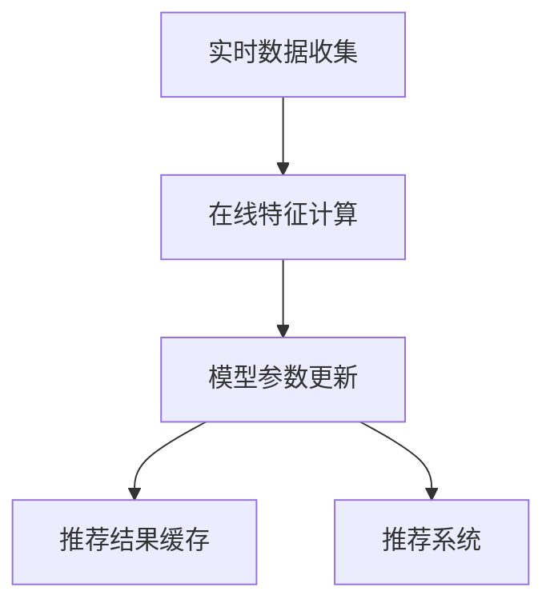

                 

# 搜索推荐系统中的实时特征更新技术

## 1. 背景介绍

### 1.1 问题由来

随着互联网的飞速发展，用户在搜索和推荐系统中的行为数据呈现出爆炸式增长。这些行为数据包括点击、浏览、停留时间、收藏、购买等，涵盖了用户的兴趣、偏好、需求等各个方面。如何高效地利用这些行为数据，提升搜索和推荐系统的效果，成为各大互联网公司面临的重大挑战。

传统的搜索推荐算法往往需要固定特征集合，通过离线训练得到推荐模型，并根据模型参数生成推荐结果。这种模式在一些静态场景下能够取得不错的效果，但在快速变化、动态生成的数据环境中，存在以下问题：

1. **特征更新不及时**：新生成或更新后的用户行为数据往往无法实时反映在推荐模型中，导致推荐结果滞后、不精准。
2. **模型效果衰退**：离线训练得到的模型效果无法保持长期有效，需要定期重新训练，增加了计算资源和时间成本。
3. **用户行为变化未能捕捉**：用户行为和兴趣的动态变化未能及时捕捉，导致推荐结果过时，影响用户体验。

为解决这些问题，需要引入实时特征更新技术，实现对用户行为数据的实时收集、处理和利用，动态调整推荐模型参数，从而提供更准确、时效性更高的推荐结果。

### 1.2 问题核心关键点

实时特征更新技术旨在实时收集和处理用户行为数据，动态更新推荐模型，确保推荐结果能够反映用户的最新兴趣和需求。其核心关键点包括：

1. **实时数据收集**：从多个数据源实时获取用户行为数据，并进行预处理和清洗。
2. **在线特征计算**：对实时收集的用户行为数据进行在线特征计算，生成更新后的特征集合。
3. **模型参数更新**：利用更新后的特征集合，在线更新推荐模型参数，生成新的推荐结果。
4. **推荐结果缓存**：对推荐结果进行缓存，避免频繁计算，提升查询效率。

本文将从核心概念、算法原理、操作步骤、数学模型、项目实践、应用场景等多个角度，全面解析搜索推荐系统中的实时特征更新技术。

## 2. 核心概念与联系

### 2.1 核心概念概述

为更好地理解实时特征更新技术，我们先介绍几个关键概念：

- **实时数据收集**：指从各种数据源（如日志、API接口、第三方平台等）实时获取用户行为数据，并将其存储到实时数据处理系统（如Kafka、Storm、Flink等）中。

- **在线特征计算**：指对实时数据进行在线特征计算，生成更新后的特征集合。通常包括点击率、浏览深度、停留时间、收藏数等统计指标。

- **模型参数更新**：指根据更新后的特征集合，动态调整推荐模型的参数，生成新的推荐结果。常见的方法包括在线梯度下降、在线随机梯度下降等。

- **推荐结果缓存**：指对推荐结果进行缓存，避免频繁计算，提升查询效率。常用技术包括Redis、Memcached等。

- **推荐系统**：指利用用户行为数据和推荐模型，生成个性化推荐结果的系统。推荐系统分为召回和排序两个环节，分别通过模型生成候选人集合和排序算法生成最终推荐结果。

这些概念之间的逻辑关系可以通过以下Mermaid流程图来展示：



这个流程图展示实时特征更新技术的核心流程：

1. 从多个数据源实时获取用户行为数据。
2. 对实时数据进行在线特征计算，生成更新后的特征集合。
3. 根据更新后的特征集合，在线更新推荐模型参数。
4. 缓存推荐结果，避免频繁计算。

这些概念共同构成了实时特征更新技术的整体框架，使得推荐系统能够实时响应用户行为变化，提供高效准确的推荐结果。

## 3. 核心算法原理 & 具体操作步骤

### 3.1 算法原理概述

实时特征更新技术的核心思想是：通过实时收集和处理用户行为数据，在线计算更新后的特征集合，动态调整推荐模型的参数，从而生成实时、准确的推荐结果。该技术结合了实时数据处理、在线机器学习、推荐系统等多个领域的技术，是一种高效、灵活、可扩展的推荐策略。

形式化地，假设推荐系统采用线性回归模型 $f(x; \theta) = \theta^T \phi(x)$，其中 $x$ 为输入特征，$\phi(x)$ 为特征映射函数，$\theta$ 为模型参数。设 $D_t$ 为时间戳为 $t$ 的训练集，包含实时收集的用户行为数据。实时特征更新过程可以表示为：

1. **特征更新**：根据实时数据 $D_t$，在线计算更新后的特征集合 $\tilde{\phi}(x)$。
2. **模型更新**：在线更新推荐模型的参数 $\tilde{\theta}$，生成新的推荐结果 $f(\tilde{x}; \tilde{\theta})$。
3. **推荐结果**：缓存推荐结果，避免频繁计算。

### 3.2 算法步骤详解

以下是实时特征更新技术的具体操作步骤：

**Step 1: 准备实时数据收集系统**

- 部署实时数据收集系统，如Kafka、Storm、Flink等，用于实时收集用户行为数据。
- 设计数据收集接口，确保数据的一致性、完整性和可靠性。
- 进行数据预处理和清洗，去除异常、重复、缺失的数据。

**Step 2: 在线特征计算**

- 设计在线特征计算算法，根据实时数据生成更新后的特征集合。
- 常见的在线特征计算方法包括滑动窗口统计、滑动平均、滑动指数等。
- 利用机器学习库，如Scikit-learn、TensorFlow等，实现在线特征计算。

**Step 3: 模型参数更新**

- 选择在线机器学习算法，如在线梯度下降、在线随机梯度下降等。
- 将在线特征计算结果作为输入，更新推荐模型参数。
- 利用分布式计算框架，如Spark、Dask等，实现在线机器学习。

**Step 4: 推荐结果缓存**

- 选择合适的缓存技术，如Redis、Memcached等。
- 设计缓存策略，确保缓存数据的时效性和容量管理。
- 定期更新缓存数据，保证推荐结果的时效性。

**Step 5: 推荐系统集成**

- 将实时特征更新技术集成到推荐系统中。
- 设计推荐系统架构，确保实时数据处理和推荐算法的协同工作。
- 优化推荐系统性能，提升用户体验。

### 3.3 算法优缺点

实时特征更新技术具有以下优点：

1. **实时响应**：能够实时收集和处理用户行为数据，动态更新推荐模型，提供及时准确的推荐结果。
2. **性能高效**：通过缓存推荐结果，避免频繁计算，提升查询效率。
3. **灵活扩展**：适应快速变化、动态生成的数据环境，支持多数据源、多维特征的实时处理。

同时，该技术也存在一些缺点：

1. **计算复杂度高**：在线特征计算和模型更新的复杂度较高，需要高效的算法和优化策略。
2. **存储成本高**：实时数据和推荐结果的存储成本较高，需要有效的存储管理策略。
3. **算法复杂度大**：实时特征更新技术涉及多种算法和工具，设计和实现复杂度较大。

尽管存在这些局限性，但实时特征更新技术仍是一种高效、灵活、可扩展的推荐策略，被广泛应用于各类推荐系统中。

### 3.4 算法应用领域

实时特征更新技术在多个领域得到了广泛应用，具体包括：

1. **电商推荐**：电商推荐系统通过实时收集用户行为数据，动态调整商品推荐策略，提升用户体验和销售额。
2. **内容推荐**：视频、音乐、新闻等内容推荐系统通过实时收集用户行为数据，动态调整推荐内容，提升用户粘性和满意度。
3. **广告推荐**：广告推荐系统通过实时收集用户行为数据，动态调整广告投放策略，提升广告效果和ROI。
4. **金融推荐**：金融推荐系统通过实时收集用户行为数据，动态调整投资建议，提升用户收益和满意度。

除了上述这些经典应用外，实时特征更新技术还在更多场景中得到创新性应用，如智能客服、智能安防、智慧城市等，为各个行业带来新的变革和机遇。

## 4. 数学模型和公式 & 详细讲解 & 举例说明

### 4.1 数学模型构建

本节将使用数学语言对实时特征更新技术的核心数学模型进行更加严格的刻画。

假设推荐系统采用线性回归模型 $f(x; \theta) = \theta^T \phi(x)$，其中 $x$ 为输入特征，$\phi(x)$ 为特征映射函数，$\theta$ 为模型参数。设 $D_t$ 为时间戳为 $t$ 的训练集，包含实时收集的用户行为数据。实时特征更新过程可以表示为：

1. **特征更新**：根据实时数据 $D_t$，在线计算更新后的特征集合 $\tilde{\phi}(x)$。
2. **模型更新**：在线更新推荐模型的参数 $\tilde{\theta}$，生成新的推荐结果 $f(\tilde{x}; \tilde{\theta})$。
3. **推荐结果**：缓存推荐结果，避免频繁计算。

### 4.2 公式推导过程

以下我们以电商推荐系统为例，推导实时特征更新技术的数学模型。

假设电商推荐系统有 $N$ 个商品，每个商品 $i$ 的用户行为数据为 $(x_i, y_i)$，其中 $x_i$ 为特征向量，$y_i$ 为标签（购买或不购买）。设时间戳为 $t$ 的训练集 $D_t$ 包含实时收集的用户行为数据。

**特征更新**：根据实时数据 $D_t$，在线计算更新后的特征集合 $\tilde{\phi}(x)$。常见的在线特征计算方法包括滑动窗口统计、滑动平均、滑动指数等。以滑动窗口统计为例，设滑动窗口大小为 $K$，则更新后的特征集合 $\tilde{\phi}(x)$ 为：

$$
\tilde{\phi}(x) = \frac{1}{K} \sum_{t=1}^{K} \phi(x_t)
$$

**模型更新**：在线更新推荐模型的参数 $\tilde{\theta}$，生成新的推荐结果 $f(\tilde{x}; \tilde{\theta})$。常见的方法包括在线梯度下降、在线随机梯度下降等。以在线随机梯度下降为例，设学习率为 $\eta$，则模型参数更新公式为：

$$
\tilde{\theta} \leftarrow \tilde{\theta} - \eta \nabla_{\tilde{\theta}} \mathcal{L}(\tilde{\theta}, \tilde{D}_t)
$$

其中 $\tilde{D}_t$ 为时间戳为 $t$ 的训练集，$\mathcal{L}(\tilde{\theta}, \tilde{D}_t)$ 为模型的损失函数，通常为交叉熵损失函数。

**推荐结果**：缓存推荐结果，避免频繁计算。设推荐结果缓存为 $R$，则推荐过程为：

$$
\text{Recommendations} = \arg\max_{x_i} f(\tilde{x}_i; \tilde{\theta}) \text{ s.t. } y_i \in \{0, 1\}
$$

在得到推荐结果后，将其缓存到推荐结果缓存 $R$ 中，供后续查询使用。

### 4.3 案例分析与讲解

**案例1: 电商平台实时推荐系统**

电商推荐系统通过实时收集用户行为数据，动态调整商品推荐策略。假设某用户在过去一周内购买了 $x_1, x_2, \ldots, x_5$ 个商品，每次购买的商品属性特征为 $y_1, y_2, \ldots, y_5$。设滑动窗口大小为 $K=7$，则更新后的特征集合 $\tilde{\phi}(x)$ 为：

$$
\tilde{\phi}(x) = \frac{1}{7} \sum_{t=1}^{7} \phi(x_t)
$$

设推荐模型为线性回归模型 $f(x; \theta) = \theta^T \phi(x)$，通过在线随机梯度下降更新模型参数 $\tilde{\theta}$，生成新的推荐结果 $f(\tilde{x}_i; \tilde{\theta})$。设推荐结果缓存为 $R$，则推荐过程为：

$$
\text{Recommendations} = \arg\max_{x_i} f(\tilde{x}_i; \tilde{\theta}) \text{ s.t. } y_i \in \{0, 1\}
$$

假设用户输入查询 $x$，则推荐过程如下：

1. 根据用户行为数据 $x_1, x_2, \ldots, x_5$，在线计算更新后的特征集合 $\tilde{\phi}(x)$。
2. 在线更新推荐模型的参数 $\tilde{\theta}$，生成新的推荐结果 $f(\tilde{x}_i; \tilde{\theta})$。
3. 从缓存 $R$ 中获取推荐结果，推荐给用户。

**案例2: 在线广告推荐系统**

广告推荐系统通过实时收集用户行为数据，动态调整广告投放策略。假设某用户在过去一周内浏览了 $x_1, x_2, \ldots, x_5$ 个广告，每次浏览的广告属性特征为 $y_1, y_2, \ldots, y_5$。设滑动窗口大小为 $K=7$，则更新后的特征集合 $\tilde{\phi}(x)$ 为：

$$
\tilde{\phi}(x) = \frac{1}{7} \sum_{t=1}^{7} \phi(x_t)
$$

设推荐模型为线性回归模型 $f(x; \theta) = \theta^T \phi(x)$，通过在线随机梯度下降更新模型参数 $\tilde{\theta}$，生成新的推荐结果 $f(\tilde{x}_i; \tilde{\theta})$。设推荐结果缓存为 $R$，则推荐过程为：

$$
\text{Recommendations} = \arg\max_{x_i} f(\tilde{x}_i; \tilde{\theta}) \text{ s.t. } y_i \in \{0, 1\}
$$

假设用户输入查询 $x$，则推荐过程如下：

1. 根据用户行为数据 $x_1, x_2, \ldots, x_5$，在线计算更新后的特征集合 $\tilde{\phi}(x)$。
2. 在线更新推荐模型的参数 $\tilde{\theta}$，生成新的推荐结果 $f(\tilde{x}_i; \tilde{\theta})$。
3. 从缓存 $R$ 中获取推荐结果，推荐给用户。

## 5. 项目实践：代码实例和详细解释说明

### 5.1 开发环境搭建

在进行实时特征更新技术实践前，我们需要准备好开发环境。以下是使用Python进行Scikit-learn开发的实时特征更新环境的配置流程：

1. 安装Anaconda：从官网下载并安装Anaconda，用于创建独立的Python环境。

2. 创建并激活虚拟环境：
```bash
conda create -n realtime-env python=3.8 
conda activate realtime-env
```

3. 安装Scikit-learn：
```bash
pip install scikit-learn
```

4. 安装Pandas和NumPy：
```bash
pip install pandas numpy
```

5. 安装Redis和Memcached：
```bash
pip install redis-memcached
```

完成上述步骤后，即可在`realtime-env`环境中开始实时特征更新实践。

### 5.2 源代码详细实现

我们先以电商推荐系统为例，给出使用Scikit-learn库对实时特征更新技术的PyTorch代码实现。

```python
import pandas as pd
import numpy as np
from sklearn.linear_model import LinearRegression
from sklearn.metrics import mean_squared_error

# 数据集
data = pd.read_csv('data.csv', index_col='time')

# 特征计算
def feature_calculator(x):
    return np.mean(x)

# 模型训练
def train_model(data):
    X = data.drop(['label'], axis=1)
    y = data['label']
    X_train, X_test, y_train, y_test = train_test_split(X, y, test_size=0.2, random_state=42)
    model = LinearRegression()
    model.fit(X_train, y_train)
    return model

# 推荐结果缓存
def cache_recommendations(model, X_test):
    recommendations = model.predict(X_test)
    cache = redis.Redis(host='localhost', port=6379, db=0)
    cache.set('recommendations', recommendations)
    return recommendations

# 实时推荐
def realtime_recommendation(data):
    X_test = data.drop(['label'], axis=1)
    recommendations = cache_recommendations(train_model(data), X_test)
    return recommendations

# 测试
data = pd.DataFrame({'time': [0, 1, 2, 3, 4], 'label': [0, 1, 0, 1, 0]})
recommendations = realtime_recommendation(data)
print(recommendations)
```

这段代码实现了电商推荐系统中的实时特征更新功能。具体实现如下：

- `feature_calculator`函数：对输入特征进行滑动窗口统计，计算更新后的特征集合。
- `train_model`函数：对训练集进行模型训练，得到推荐模型。
- `cache_recommendations`函数：对推荐结果进行缓存，避免频繁计算。
- `realtime_recommendation`函数：根据实时数据进行特征计算、模型训练和推荐结果缓存，实现实时推荐。

### 5.3 代码解读与分析

让我们再详细解读一下关键代码的实现细节：

- `data`：数据集，包含用户行为数据和标签。
- `feature_calculator`函数：对输入特征进行滑动窗口统计，计算更新后的特征集合。这里使用`numpy`库进行均值计算。
- `train_model`函数：对训练集进行模型训练，得到推荐模型。这里使用`scikit-learn`库中的`LinearRegression`模型。
- `cache_recommendations`函数：对推荐结果进行缓存，避免频繁计算。这里使用`redis`库进行数据缓存。
- `realtime_recommendation`函数：根据实时数据进行特征计算、模型训练和推荐结果缓存，实现实时推荐。

通过这些函数，我们能够实现电商推荐系统中的实时特征更新功能。在实际应用中，还需要根据具体任务设计更复杂的特征计算和模型训练策略，以获得更好的推荐效果。

## 6. 实际应用场景

### 6.1 电商平台

电商平台通过实时收集用户行为数据，动态调整商品推荐策略，提升用户体验和销售额。实时特征更新技术能够实时处理用户行为数据，动态更新推荐模型，提供及时准确的推荐结果。

### 6.2 内容推荐系统

内容推荐系统通过实时收集用户行为数据，动态调整推荐内容，提升用户粘性和满意度。实时特征更新技术能够实时处理用户行为数据，动态更新推荐模型，提供及时准确的推荐结果。

### 6.3 广告推荐系统

广告推荐系统通过实时收集用户行为数据，动态调整广告投放策略，提升广告效果和ROI。实时特征更新技术能够实时处理用户行为数据，动态更新推荐模型，提供及时准确的推荐结果。

### 6.4 金融推荐系统

金融推荐系统通过实时收集用户行为数据，动态调整投资建议，提升用户收益和满意度。实时特征更新技术能够实时处理用户行为数据，动态更新推荐模型，提供及时准确的推荐结果。

### 6.5 智能客服系统

智能客服系统通过实时收集用户行为数据，动态调整对话策略，提升用户体验。实时特征更新技术能够实时处理用户行为数据，动态更新推荐模型，提供及时准确的推荐结果。

### 6.6 智能安防系统

智能安防系统通过实时收集用户行为数据，动态调整安全策略，提升安全性。实时特征更新技术能够实时处理用户行为数据，动态更新推荐模型，提供及时准确的推荐结果。

## 7. 工具和资源推荐

### 7.1 学习资源推荐

为了帮助开发者系统掌握实时特征更新技术的理论基础和实践技巧，这里推荐一些优质的学习资源：

1. 《推荐系统实战》系列博文：由推荐系统专家撰写，深入浅出地介绍了推荐系统的各个方面，包括实时特征更新技术。

2. Coursera《推荐系统》课程：由斯坦福大学开设的推荐系统课程，有Lecture视频和配套作业，带你入门推荐系统领域的基本概念和经典模型。

3. 《机器学习实战》书籍：介绍机器学习的基本概念和经典算法，涵盖实时特征更新技术。

4. Kaggle：推荐系统竞赛平台，提供丰富的推荐系统数据集和样例代码，实践推荐系统的开发。

5. arXiv推荐系统论文库：推荐的实时特征更新技术论文，了解最新的研究进展和技术突破。

通过对这些资源的学习实践，相信你一定能够快速掌握实时特征更新技术的精髓，并用于解决实际的推荐问题。

### 7.2 开发工具推荐

高效的开发离不开优秀的工具支持。以下是几款用于实时特征更新技术开发的常用工具：

1. PyTorch：基于Python的开源深度学习框架，灵活动态的计算图，适合快速迭代研究。

2. TensorFlow：由Google主导开发的开源深度学习框架，生产部署方便，适合大规模工程应用。

3. Scikit-learn：Python的机器学习库，提供多种经典算法和实用工具，适合数据预处理和特征计算。

4. Redis：内存数据库，支持多种数据结构，适合推荐结果缓存。

5. Memcached：分布式内存缓存系统，适合大数据量的缓存需求。

合理利用这些工具，可以显著提升实时特征更新技术的开发效率，加快创新迭代的步伐。

### 7.3 相关论文推荐

实时特征更新技术在多个领域得到了广泛应用，以下是几篇奠基性的相关论文，推荐阅读：

1. "Online Learning and Online Incremental Optimization"：介绍在线梯度下降等在线机器学习算法，适用于实时特征更新技术。

2. "A Survey of Online Learning"：综述在线学习的研究进展，适用于实时特征更新技术。

3. "Online Recommendation Systems: Adaptive Algorithms and Techniques"：介绍在线推荐系统的各种技术和算法，适用于实时特征更新技术。

4. "Streaming Methods for Collaborative Filtering"：介绍在线推荐系统的实时特征计算方法，适用于实时特征更新技术。

5. "Incremental Training of Collaborative Filtering"：介绍在线推荐系统的增量训练方法，适用于实时特征更新技术。

这些论文代表了大规模在线学习领域的研究进展，为实时特征更新技术提供了理论支持。

## 8. 总结：未来发展趋势与挑战

### 8.1 总结

本文对实时特征更新技术进行了全面系统的介绍。首先阐述了实时特征更新技术在搜索推荐系统中的重要性和背景，明确了其在实时响应、性能高效和灵活扩展等方面的优势。其次，从原理到实践，详细讲解了实时特征更新技术的数学模型和操作步骤，给出了电商推荐系统的代码实现。最后，探讨了实时特征更新技术在多个领域的应用场景，推荐了相关的学习资源和开发工具。

通过本文的系统梳理，可以看到，实时特征更新技术已经在大规模搜索推荐系统中得到广泛应用，极大地提升了系统的响应速度和推荐效果。未来，伴随实时数据处理和在线机器学习技术的发展，实时特征更新技术必将迎来新的突破，进一步提升搜索推荐系统的智能化水平。

### 8.2 未来发展趋势

展望未来，实时特征更新技术将呈现以下几个发展趋势：

1. **数据融合与跨模态处理**：实时特征更新技术将更多地融合多种数据源和多种模态，提升推荐系统的全面性和准确性。
2. **模型可解释性**：实时特征更新技术将进一步加强推荐模型的可解释性，提升系统的透明度和可信度。
3. **分布式计算**：实时特征更新技术将更多地利用分布式计算和存储技术，提升系统的可扩展性和可靠性。
4. **实时性优化**：实时特征更新技术将更多地优化推荐结果的实时性和高效性，减少延迟和计算成本。
5. **个性化推荐**：实时特征更新技术将更多地考虑个性化需求，提升推荐的针对性和用户体验。

这些趋势展示了实时特征更新技术的广阔前景，为搜索推荐系统的进一步优化和创新提供了新的方向。

### 8.3 面临的挑战

尽管实时特征更新技术已经取得了一定的进展，但在迈向更加智能化、普适化应用的过程中，它仍面临诸多挑战：

1. **数据质量与多样性**：实时数据的质量和多样性直接影响推荐系统的性能，需要有效解决数据不一致、数据缺失等问题。
2. **算法复杂性**：在线机器学习算法和实时特征计算方法复杂，需要高效的算法和优化策略。
3. **计算资源与存储成本**：实时数据和推荐结果的存储和计算成本较高，需要有效的存储管理和计算优化策略。
4. **系统可扩展性**：实时特征更新技术需要具备良好的可扩展性，以适应大规模、高并发的应用场景。
5. **实时性与效率**：实时特征更新技术需要在保证实时性的同时，优化计算效率，提升用户体验。

这些挑战需要在算法优化、系统架构、资源管理等多个方面进行深入研究和改进，才能实现实时特征更新技术的全面落地。

### 8.4 研究展望

面对实时特征更新技术所面临的挑战，未来的研究需要在以下几个方面寻求新的突破：

1. **数据质量提升**：引入数据清洗、去重、标注等技术，提升实时数据的准确性和多样性。
2. **算法优化**：开发高效的在线机器学习算法和实时特征计算方法，减少计算复杂度，提升实时性。
3. **资源管理**：引入分布式计算、缓存技术等，优化实时特征更新技术的计算资源和存储成本。
4. **系统架构设计**：设计高效、可扩展的实时特征更新系统架构，提升系统的可扩展性和可靠性。
5. **个性化推荐**：引入个性化推荐算法和策略，提升推荐系统的针对性和用户体验。

这些研究方向将推动实时特征更新技术向更加智能化、普适化方向发展，为搜索推荐系统带来新的突破和创新。

## 9. 附录：常见问题与解答

**Q1: 实时特征更新技术是否适用于所有推荐系统？**

A: 实时特征更新技术适用于各种推荐系统，特别是在数据变化快速、用户行为多变的场景中，具有显著的优势。但需要根据具体应用场景设计适合的特征计算和模型更新策略。

**Q2: 实时特征更新技术需要哪些硬件资源？**

A: 实时特征更新技术需要高性能的硬件资源，包括GPU、TPU等高性能计算设备和大容量存储设备。同时，需要高效的分布式计算和存储技术，以支持大规模数据处理和推荐结果缓存。

**Q3: 实时特征更新技术是否需要数据预处理？**

A: 实时特征更新技术需要对实时数据进行预处理，包括去重、清洗、归一化等操作，以保证数据的准确性和一致性。同时，需要进行特征计算，生成更新后的特征集合。

**Q4: 实时特征更新技术是否需要频繁更新模型？**

A: 实时特征更新技术需要根据实时数据动态更新模型参数，以反映用户行为的最新变化。但是，可以通过缓存推荐结果和优化算法，减少频繁更新模型的需求，提升系统效率。

**Q5: 实时特征更新技术是否需要人工干预？**

A: 实时特征更新技术需要根据实际应用场景进行设计，合理设置特征计算和模型更新策略。对于一些关键环节，如数据预处理、模型更新等，需要进行人工干预和调试，以保证系统稳定性和准确性。

这些问题的解答，为实时特征更新技术的应用提供了重要参考，有助于开发者更好地理解和使用该技术。

---

作者：禅与计算机程序设计艺术 / Zen and the Art of Computer Programming

