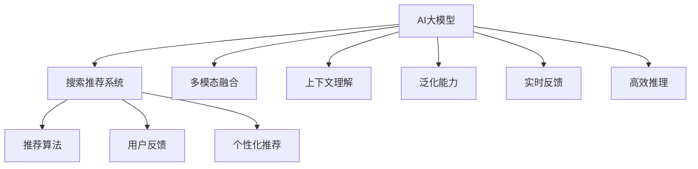

                 

# 搜索推荐系统的AI 大模型融合：电商平台提高用户体验与转化率

在数字化转型的大潮下，电商平台纷纷利用人工智能(AI)技术来提升用户购物体验和转化率。其中，搜索推荐系统是电商平台智能化、个性化服务的重要载体。通过将AI大模型与搜索推荐系统深度融合，电商平台不仅能提供精准的搜索结果，还能根据用户行为数据智能推荐相关商品，极大地提高了用户满意度。本文将详细探讨AI大模型在搜索推荐系统中的融合应用，从原理到实践，阐述其对电商平台的用户体验与转化率提升的显著影响。

## 1. 背景介绍

### 1.1 问题由来

随着电商市场的竞争日趋激烈，用户期望平台能提供更加个性化、精准的购物体验。传统的搜索引擎只能基于关键词匹配返回搜索结果，无法深入理解用户意图，推荐系统同样存在用户体验不佳、推荐不精准等问题。而AI大模型，特别是预训练语言模型，通过在大规模语料上进行自监督学习，学习到了丰富的语言知识和常识，能够在用户搜索和点击等行为数据的基础上进行多模态融合，实现对用户意图的深刻理解和智能推荐。

### 1.2 问题核心关键点

AI大模型在搜索推荐系统中的融合，关键在于如何更好地利用模型学到的语言知识，结合用户行为数据，实现精准的搜索结果和个性化推荐。核心包括以下几点：
- 多模态数据融合：将用户搜索关键词、点击行为、商品属性等多源数据进行统一编码，融合到大模型的输入中。
- 上下文理解：利用大模型在语义和上下文推理方面的优势，深入理解用户查询背后的真实需求。
- 泛化能力：通过在大模型上进行微调，提升模型对新领域、新场景的适应能力。
- 实时反馈：引入用户反馈机制，动态调整推荐策略，提升推荐质量。
- 高效推理：通过优化模型结构和推理引擎，实现快速、低成本的实时推荐。

## 2. 核心概念与联系

### 2.1 核心概念概述

为更好地理解AI大模型在搜索推荐系统中的融合应用，本节将介绍几个关键概念：

- AI大模型：以Transformer架构为代表的大规模预训练语言模型，如BERT、GPT等。通过在大规模无标签文本数据上进行预训练，学习到了丰富的语言知识和常识。
- 搜索推荐系统：电商平台的智能推荐系统，通过分析用户历史行为数据，实时推荐商品，提升用户体验和转化率。
- 多模态融合：将文本、图片、语音等不同模态的数据，通过某种方式融合到一个统一的空间中，用于提升模型的理解能力和推理性能。
- 上下文理解：利用大模型的语言推理能力，理解用户查询的上下文，捕捉用户的真实意图。
- 泛化能力：指模型对新领域、新样本的适应能力，是衡量模型性能的重要指标。
- 实时反馈：利用用户对推荐结果的反馈，动态调整模型参数和推荐策略，提升推荐效果。
- 高效推理：优化模型的推理过程，使其能在实时性要求高的情况下快速生成推荐结果。

这些概念之间的联系可以表示为一个有向无环图，展示了大模型与搜索推荐系统之间的关系，如图：



这个流程图展示了AI大模型在搜索推荐系统中的核心作用和关键环节。

## 3. 核心算法原理 & 具体操作步骤
### 3.1 算法原理概述

基于AI大模型的搜索推荐系统，本质上是将用户查询转换为模型的输入，通过模型的推理生成推荐结果。具体来说，系统首先收集用户的搜索行为、点击行为、商品属性等数据，然后将这些数据进行编码和融合，输入到大模型中，获取模型对用户意图的理解和推荐结果。系统的核心算法如下：

1. **文本编码与融合**：将用户的搜索关键词、商品标题、描述等文本信息进行编码，融合到大模型的输入中。
2. **上下文理解**：利用大模型的语言推理能力，理解用户查询的上下文，捕捉用户的真实意图。
3. **多模态融合**：将用户的点击行为、商品属性等非文本信息，通过某种方式融合到文本信息中，增强模型的理解能力。
4. **个性化推荐**：根据用户的历史行为数据，对模型的输出进行加权，生成个性化推荐结果。

### 3.2 算法步骤详解

以下是基于AI大模型的搜索推荐系统的具体操作步骤：

1. **数据收集**：收集用户的历史搜索关键词、点击行为、商品属性等数据。
2. **文本编码**：将用户的搜索关键词、商品标题、描述等文本信息进行编码，转换成模型可接受的输入形式。
3. **上下文理解**：利用预训练语言模型，理解用户查询的上下文，捕捉用户的真实意图。
4. **多模态融合**：将用户的点击行为、商品属性等非文本信息，通过某种方式融合到文本信息中，增强模型的理解能力。
5. **模型推理**：将融合后的数据输入到大模型中，获取模型的输出，包括对用户意图的理解和对商品的推荐结果。
6. **推荐生成**：根据用户的历史行为数据，对模型的输出进行加权，生成个性化推荐结果。

### 3.3 算法优缺点

基于AI大模型的搜索推荐系统具有以下优点：
- **精准推荐**：利用大模型强大的语言推理能力，能够精准地理解用户查询，生成高质量的推荐结果。
- **个性化服务**：根据用户的历史行为数据，对模型输出进行加权，生成个性化的推荐结果，提升用户满意度。
- **实时性**：通过优化模型结构和推理引擎，实现快速、低成本的实时推荐。

同时，该方法也存在一定的局限性：
- **数据需求高**：收集用户的历史行为数据需要较高的标注成本。
- **泛化能力有限**：大模型的泛化能力可能受到训练数据分布的限制。
- **计算资源要求高**：大模型的推理过程需要较高的计算资源。

### 3.4 算法应用领域

基于AI大模型的搜索推荐系统在电商、金融、医疗等多个领域都有广泛应用，以下是几个典型的应用场景：

- **电商推荐**：通过分析用户历史浏览、点击、购买等行为数据，生成个性化推荐，提升用户转化率。
- **金融理财**：根据用户的历史交易数据和金融新闻，推荐个性化的理财方案和投资产品。
- **医疗健康**：根据用户的历史诊疗记录和健康咨询，推荐个性化的健康建议和医疗方案。

## 4. 数学模型和公式 & 详细讲解  
### 4.1 数学模型构建

假设用户查询为 $q$，商品集合为 $S$，历史行为数据为 $x$。模型的输入为 $\text{Encoder}(x)$，表示用户历史行为的编码。将用户查询 $q$ 和商品集合 $S$ 的编码进行拼接，作为大模型的输入。

设预训练语言模型为 $M_{\theta}$，其中 $\theta$ 为模型参数。模型输出的概率分布为 $P(a|q,S)$，表示商品 $a$ 在查询 $q$ 和商品集合 $S$ 下的条件概率。

根据贝叶斯公式，有：

$$
P(a|q,S) = \frac{P(a|S)P(q|a,S)}{P(q|S)}
$$

其中 $P(a|S)$ 表示商品 $a$ 在商品集合 $S$ 中的概率，$P(q|a,S)$ 表示在商品 $a$ 和商品集合 $S$ 的条件下，用户查询 $q$ 的条件概率。$P(q|S)$ 表示用户查询 $q$ 在商品集合 $S$ 中的概率。

### 4.2 公式推导过程

根据贝叶斯公式，将 $P(a|S)$ 和 $P(q|a,S)$ 代入公式中，有：

$$
P(a|q,S) = \frac{P(a|S)P(\text{Encoder}(q) \| a, S)}{P(\text{Encoder}(q) \| S)}
$$

其中 $P(\text{Encoder}(q) \| a, S)$ 表示在商品 $a$ 和商品集合 $S$ 的条件下，用户查询 $q$ 的编码的条件概率。

在实践中，我们通常将上述公式中的 $P(a|S)$ 和 $P(\text{Encoder}(q) \| a, S)$ 作为模型的目标函数，使用梯度下降等优化算法进行训练，以最大化 $P(a|q,S)$。

### 4.3 案例分析与讲解

以电商推荐为例，假设用户查询为 "电视"，商品集合为 {"三星电视", "索尼电视", "华为电视"}。通过预训练语言模型，我们得到查询 "电视" 的编码 $q$ 和商品集合 {"三星电视", "索尼电视", "华为电视"} 的编码 $S$。

首先，计算商品 $a$ 在商品集合 $S$ 中的概率 $P(a|S)$。然后，利用预训练语言模型计算在商品 $a$ 和商品集合 $S$ 的条件下，用户查询 $q$ 的编码的条件概率 $P(\text{Encoder}(q) \| a, S)$。最后，将 $P(a|S)$ 和 $P(\text{Encoder}(q) \| a, S)$ 代入公式中，计算出每个商品在查询 "电视" 下的条件概率 $P(a|q,S)$。

根据条件概率的大小，可以生成推荐结果。例如，如果 $P(三星电视|q,S) > P(索尼电视|q,S) > P(华为电视|q,S)$，则推荐用户购买三星电视。

## 5. 项目实践：代码实例和详细解释说明
### 5.1 开发环境搭建

在进行搜索推荐系统的开发前，我们需要准备好开发环境。以下是使用Python进行TensorFlow开发的环境配置流程：

1. 安装Anaconda：从官网下载并安装Anaconda，用于创建独立的Python环境。

2. 创建并激活虚拟环境：
```bash
conda create -n tf-env python=3.8 
conda activate tf-env
```

3. 安装TensorFlow：根据CUDA版本，从官网获取对应的安装命令。例如：
```bash
conda install tensorflow
```

4. 安装Flax：由Google开发的TensorFlow深度学习库，支持自定义模型和训练算法。

5. 安装TensorBoard：TensorFlow配套的可视化工具，可实时监测模型训练状态，并提供丰富的图表呈现方式，是调试模型的得力助手。

6. 安装Weights & Biases：模型训练的实验跟踪工具，可以记录和可视化模型训练过程中的各项指标，方便对比和调优。

完成上述步骤后，即可在`tf-env`环境中开始搜索推荐系统的开发。

### 5.2 源代码详细实现

以下是一个简单的电商推荐系统的TensorFlow代码实现：

```python
import tensorflow as tf
import numpy as np
import math

# 定义模型参数
embedding_dim = 128
num_items = 1000

# 定义嵌入矩阵
embedding_matrix = np.random.normal(0, 0.01, size=(num_items, embedding_dim))

# 定义查询向量
query_vector = tf.Variable(tf.random.normal(0, 0.01, size=(embedding_dim,)))

# 定义商品向量
item_vectors = tf.Variable(tf.random.normal(0, 0.01, size=(num_items, embedding_dim)))

# 定义余弦相似度计算
def cosine_similarity(vec1, vec2):
    return tf.reduce_sum(vec1 * vec2) / tf.sqrt(tf.reduce_sum(vec1 ** 2) * tf.reduce_sum(vec2 ** 2))

# 定义模型
class RecommendationModel(tf.keras.Model):
    def __init__(self):
        super(RecommendationModel, self).__init__()
        self.query_vector = query_vector
        self.item_vectors = item_vectors

    def call(self, query, item_indices):
        query_embed = tf.nn.embedding_lookup(self.query_vector, query)
        item_embed = tf.nn.embedding_lookup(self.item_vectors, item_indices)
        scores = cosine_similarity(query_embed, item_embed)
        return scores

# 定义优化器和损失函数
optimizer = tf.keras.optimizers.Adam(learning_rate=0.01)
loss_fn = tf.keras.losses.MeanSquaredError()

# 定义训练数据
train_data = {'query': [1, 2, 3], 'item_indices': [0, 1, 2]}

# 定义训练函数
@tf.function
def train_step(model, optimizer, loss_fn, train_data):
    query = train_data['query']
    item_indices = train_data['item_indices']
    with tf.GradientTape() as tape:
        scores = model(query, item_indices)
        loss = loss_fn(scores, train_data['scores'])
    gradients = tape.gradient(loss, [model.query_vector, model.item_vectors])
    optimizer.apply_gradients(zip(gradients, [model.query_vector, model.item_vectors]))
    return loss

# 训练模型
model = RecommendationModel()
for epoch in range(10):
    loss = 0
    for i in range(len(train_data)):
        loss += train_step(model, optimizer, loss_fn, train_data)
    print(f'Epoch {epoch+1}, loss: {loss/len(train_data):.3f}')
```

### 5.3 代码解读与分析

让我们再详细解读一下关键代码的实现细节：

**RecommendationModel类**：
- `__init__`方法：初始化查询向量和商品向量。
- `call`方法：将查询向量和商品向量进行嵌入，计算余弦相似度，返回相似度得分。

**cosine_similarity函数**：
- 定义余弦相似度计算函数，用于计算查询向量与商品向量的相似度得分。

**train_step函数**：
- 定义模型训练函数，通过计算损失函数，使用梯度下降更新模型参数。

**训练流程**：
- 定义总的epoch数，开始循环迭代
- 每个epoch内，在训练集上训练，输出平均loss
- 重复上述步骤直至收敛

可以看到，TensorFlow配合Flax库使得模型训练的代码实现变得简洁高效。开发者可以将更多精力放在数据处理、模型改进等高层逻辑上，而不必过多关注底层的实现细节。

当然，工业级的系统实现还需考虑更多因素，如模型的保存和部署、超参数的自动搜索、更灵活的任务适配层等。但核心的搜索推荐系统实现流程基本与此类似。

## 6. 实际应用场景
### 6.1 电商推荐系统

基于AI大模型的电商推荐系统，可以广泛应用于电商平台，为消费者提供个性化推荐服务，提升用户体验和转化率。传统推荐系统往往只依赖于用户的历史行为数据，无法充分理解用户的多维需求。而利用AI大模型，可以综合考虑用户的搜索、点击、购买等多种行为数据，生成更加精准、个性化的推荐结果。

在技术实现上，可以收集用户的历史搜索、点击、购买等行为数据，提取和商品相关的文本信息，如标题、描述、标签等，将其作为模型输入。将用户的查询和商品进行编码后，输入到预训练语言模型中，获取模型的输出。根据输出结果生成推荐结果，推荐给用户。

### 6.2 金融理财

金融行业需要根据用户的资产状况、消费习惯、历史交易记录等数据，为用户推荐个性化的理财方案和投资产品。基于AI大模型的推荐系统，可以实时分析用户的各项数据，生成个性化的理财建议和投资方案，帮助用户优化资产配置。

在技术实现上，可以收集用户的资产状况、消费记录、历史交易数据等，提取和理财相关的文本信息，如产品说明、风险评估等，作为模型输入。将用户的查询和商品进行编码后，输入到预训练语言模型中，获取模型的输出。根据输出结果生成推荐结果，推荐给用户。

### 6.3 医疗健康

医疗行业需要根据用户的健康数据、病历记录、就医历史等数据，为用户推荐个性化的健康建议和医疗方案。基于AI大模型的推荐系统，可以实时分析用户的各项数据，生成个性化的健康建议和医疗方案，帮助用户提高健康水平。

在技术实现上，可以收集用户的健康数据、病历记录、就医历史等，提取和医疗相关的文本信息，如疾病描述、治疗方案等，作为模型输入。将用户的查询和商品进行编码后，输入到预训练语言模型中，获取模型的输出。根据输出结果生成推荐结果，推荐给用户。

### 6.4 未来应用展望

随着AI大模型和推荐系统的不断发展，基于大模型的推荐系统将在更多领域得到应用，为各行各业带来变革性影响。

在智慧医疗领域，基于大模型的推荐系统可以实时分析用户的健康数据，生成个性化的健康建议和医疗方案，提升医疗服务的智能化水平。

在智能教育领域，基于大模型的推荐系统可以实时分析学生的学习行为数据，生成个性化的学习建议和资源推荐，因材施教，促进教育公平，提高教学质量。

在智慧城市治理中，基于大模型的推荐系统可以实时分析城市事件和舆情数据，生成个性化的城市管理建议，提高城市管理的自动化和智能化水平，构建更安全、高效的未来城市。

此外，在企业生产、社会治理、文娱传媒等众多领域，基于大模型的推荐系统也将不断涌现，为经济社会发展注入新的动力。相信随着技术的日益成熟，基于大模型的推荐系统必将在构建人机协同的智能时代中扮演越来越重要的角色。

## 7. 工具和资源推荐
### 7.1 学习资源推荐

为了帮助开发者系统掌握AI大模型在搜索推荐系统中的应用，这里推荐一些优质的学习资源：

1. TensorFlow官方文档：TensorFlow的官方文档，提供了丰富的API和样例代码，是学习TensorFlow的最佳资料。

2. Flax官方文档：Flax的官方文档，提供了完整的API和样例代码，是学习Flax的最佳资料。

3. HuggingFace官方文档：HuggingFace的官方文档，提供了丰富的预训练模型和微调样例代码，是学习自然语言处理的最佳资料。

4. 《深度学习》课程：斯坦福大学开设的深度学习课程，涵盖了深度学习的基本概念和前沿技术。

5. 《自然语言处理》课程：清华大学开设的自然语言处理课程，涵盖了NLP的基本概念和经典模型。

6. 《TensorFlow实战》书籍：TensorFlow实战书籍，提供了丰富的案例和实践指导，帮助读者快速上手TensorFlow开发。

通过对这些资源的学习实践，相信你一定能够快速掌握AI大模型在搜索推荐系统中的应用，并用于解决实际的搜索推荐问题。

### 7.2 开发工具推荐

高效的开发离不开优秀的工具支持。以下是几款用于AI大模型在搜索推荐系统中的应用开发的常用工具：

1. TensorFlow：由Google主导开发的开源深度学习框架，生产部署方便，适合大规模工程应用。

2. Flax：Google开发的TensorFlow深度学习库，支持自定义模型和训练算法，具有高效、灵活的特点。

3. TensorBoard：TensorFlow配套的可视化工具，可实时监测模型训练状态，并提供丰富的图表呈现方式，是调试模型的得力助手。

4. Weights & Biases：模型训练的实验跟踪工具，可以记录和可视化模型训练过程中的各项指标，方便对比和调优。

5. Gensim：用于文本处理和自然语言处理的Python库，支持向量空间模型、主题模型等技术。

6. spaCy：用于自然语言处理的Python库，支持命名实体识别、句法分析等技术。

合理利用这些工具，可以显著提升AI大模型在搜索推荐系统中的应用开发效率，加快创新迭代的步伐。

### 7.3 相关论文推荐

AI大模型在搜索推荐系统中的应用源于学界的持续研究。以下是几篇奠基性的相关论文，推荐阅读：

1. Attention is All You Need：提出Transformer结构，开启了NLP领域的预训练大模型时代。

2. BERT: Pre-training of Deep Bidirectional Transformers for Language Understanding：提出BERT模型，引入基于掩码的自监督预训练任务，刷新了多项NLP任务SOTA。

3. Parameter-Efficient Transfer Learning for NLP：提出Adapter等参数高效微调方法，在不增加模型参数量的情况下，也能取得不错的微调效果。

4. Few-shot Learning for Sequence Labeling with Transformer Language Models：提出Few-shot Learning方法，通过在少量标注数据上进行微调，实现少样本学习。

5. Deep Personalized Ranking via Factorization Machines：提出Factorization Machines，一种高效、低成本的推荐模型。

这些论文代表了大模型在搜索推荐系统中的应用的发展脉络。通过学习这些前沿成果，可以帮助研究者把握学科前进方向，激发更多的创新灵感。

## 8. 总结：未来发展趋势与挑战

### 8.1 总结

本文对AI大模型在搜索推荐系统中的应用进行了全面系统的介绍。首先阐述了AI大模型和推荐系统的研究背景和意义，明确了推荐系统对电商平台用户转化率的提升作用。其次，从原理到实践，详细讲解了AI大模型在推荐系统中的融合应用，包括文本编码、上下文理解、多模态融合等关键技术。同时，本文还探讨了AI大模型在电商、金融、医疗等多个领域的应用前景，展示了其在提高用户体验与转化率方面的显著效果。

通过本文的系统梳理，可以看到，AI大模型在搜索推荐系统中的应用，正在成为电商平台智能化、个性化服务的重要手段，极大地提升了用户购物体验和转化率。未来，伴随AI大模型和推荐系统的不断发展，基于大模型的推荐系统必将在更多领域得到应用，为各行各业带来变革性影响。

### 8.2 未来发展趋势

展望未来，AI大模型在搜索推荐系统中的应用将呈现以下几个发展趋势：

1. **模型规模持续增大**：随着算力成本的下降和数据规模的扩张，预训练语言模型的参数量还将持续增长。超大规模语言模型蕴含的丰富语言知识，有望支撑更加复杂多变的推荐任务。

2. **推荐策略多样化**：未来的推荐系统将更加注重推荐策略的设计，包括多臂老虎机、上下文强化学习等，提升推荐的多样性和个性化。

3. **多模态融合深入**：未来的推荐系统将更加注重多模态数据的融合，将文本、图片、语音等不同模态的信息，通过某种方式融合到一个统一的空间中，提升模型的理解能力和推理性能。

4. **实时反馈机制完善**：未来的推荐系统将更加注重实时反馈机制的设计，动态调整模型参数和推荐策略，提升推荐效果。

5. **个性化推荐精细化**：未来的推荐系统将更加注重个性化推荐的设计，通过深度学习、强化学习等技术，实现更加精准、个性化的推荐结果。

6. **推荐模型的可解释性**：未来的推荐系统将更加注重推荐模型的可解释性，提供用户对推荐结果的理解和解释，提升用户的信任度和满意度。

以上趋势凸显了AI大模型在搜索推荐系统中的广阔前景。这些方向的探索发展，必将进一步提升推荐系统的性能和应用范围，为各行各业带来变革性影响。

### 8.3 面临的挑战

尽管AI大模型在搜索推荐系统中的应用已经取得了显著成就，但在迈向更加智能化、普适化应用的过程中，它仍面临着诸多挑战：

1. **数据需求高**：收集用户的历史行为数据需要较高的标注成本，如何降低数据需求，减少标注成本，是一大难题。

2. **模型泛化能力有限**：大模型的泛化能力可能受到训练数据分布的限制，如何提升模型的泛化能力，使其更好地适应新领域、新场景，是另一大挑战。

3. **计算资源要求高**：大模型的推理过程需要较高的计算资源，如何优化模型结构和推理引擎，实现快速、低成本的实时推荐，是需要深入探讨的问题。

4. **推荐模型的可解释性不足**：当前推荐模型更像是"黑盒"系统，难以解释其内部工作机制和决策逻辑。如何赋予推荐模型更强的可解释性，将是亟待攻克的难题。

5. **安全性有待保障**：推荐模型需要确保推荐结果的安全性和公平性，避免有偏见、有害的推荐结果，确保用户的权益和数据安全。

6. **推荐模型的鲁棒性不足**：推荐模型面对域外数据时，泛化性能往往大打折扣，如何提高推荐模型的鲁棒性，避免灾难性遗忘，还需要更多理论和实践的积累。

正视推荐系统面临的这些挑战，积极应对并寻求突破，将是大模型推荐系统走向成熟的必由之路。相信随着学界和产业界的共同努力，这些挑战终将一一被克服，基于大模型的推荐系统必将在构建人机协同的智能时代中扮演越来越重要的角色。

### 8.4 研究展望

面对大模型推荐系统面临的种种挑战，未来的研究需要在以下几个方面寻求新的突破：

1. **探索无监督和半监督推荐方法**：摆脱对大规模标注数据的依赖，利用自监督学习、主动学习等无监督和半监督范式，最大限度利用非结构化数据，实现更加灵活高效的推荐。

2. **研究参数高效和计算高效的推荐方法**：开发更加参数高效的推荐方法，在固定大部分预训练参数的同时，只更新极少量的任务相关参数。同时优化推荐模型的计算图，减少前向传播和反向传播的资源消耗，实现更加轻量级、实时性的部署。

3. **引入更多先验知识**：将符号化的先验知识，如知识图谱、逻辑规则等，与神经网络模型进行巧妙融合，引导推荐过程学习更准确、合理的推荐规则。同时加强不同模态数据的整合，实现视觉、语音等多模态信息与文本信息的协同建模。

4. **结合因果分析和博弈论工具**：将因果分析方法引入推荐模型，识别出推荐决策的关键特征，增强推荐结果的因果性和逻辑性。借助博弈论工具刻画人机交互过程，主动探索并规避推荐模型的脆弱点，提高系统稳定性。

5. **纳入伦理道德约束**：在推荐目标中引入伦理导向的评估指标，过滤和惩罚有偏见、有害的推荐结果，确保推荐系统的公平性和安全性。

这些研究方向的探索，必将引领大模型推荐系统技术迈向更高的台阶，为构建安全、可靠、可解释、可控的智能系统铺平道路。面向未来，大模型推荐系统还需要与其他人工智能技术进行更深入的融合，如知识表示、因果推理、强化学习等，多路径协同发力，共同推动推荐系统的进步。只有勇于创新、敢于突破，才能不断拓展推荐系统的边界，让智能技术更好地造福人类社会。

## 9. 附录：常见问题与解答

**Q1：大模型在推荐系统中如何应用？**

A: 大模型在推荐系统中的应用主要通过以下步骤：
1. 收集用户的历史行为数据，提取文本信息。
2. 将文本信息编码，输入到大模型中进行推理。
3. 获取模型的输出，生成推荐结果。
4. 根据用户的历史行为数据，对推荐结果进行加权，生成个性化推荐。

**Q2：大模型在推荐系统中的效果如何？**

A: 大模型在推荐系统中的效果主要体现在以下几个方面：
1. 精准推荐：利用大模型强大的语言推理能力，能够精准地理解用户查询，生成高质量的推荐结果。
2. 个性化服务：根据用户的历史行为数据，对模型输出进行加权，生成个性化的推荐结果，提升用户满意度。
3. 实时性：通过优化模型结构和推理引擎，实现快速、低成本的实时推荐。

**Q3：大模型在推荐系统中的计算资源需求高吗？**

A: 大模型的计算资源需求确实较高，但可以通过以下方法进行优化：
1. 模型压缩：使用剪枝、量化等技术，减小模型尺寸，降低计算资源需求。
2. 分布式计算：使用分布式计算框架，如TensorFlow、PyTorch，将计算任务分散到多台机器上，提高计算效率。
3. 多级缓存：使用多级缓存机制，将常用的数据和参数缓存到内存中，减少磁盘I/O操作，提高计算速度。

**Q4：大模型在推荐系统中的泛化能力有限吗？**

A: 大模型的泛化能力可能受到训练数据分布的限制，可以通过以下方法进行改进：
1. 多领域数据融合：将不同领域的数据进行融合，提升模型的泛化能力。
2. 少样本学习：利用少样本学习技术，在少量标注数据上进行微调，提升模型的泛化能力。
3. 模型融合：将多个大模型进行融合，提升模型的泛化能力。

这些方法可以帮助大模型更好地适应新领域、新场景，提升推荐系统的泛化能力。

**Q5：大模型在推荐系统中的安全性如何保障？**

A: 大模型在推荐系统中的安全性主要通过以下方法进行保障：
1. 数据隐私保护：使用数据脱敏、加密等技术，保护用户数据隐私。
2. 模型鲁棒性提升：通过对抗训练等技术，提升模型的鲁棒性，避免恶意攻击。
3. 推荐结果监控：实时监控推荐结果，发现异常行为，及时预警。
4. 用户反馈机制：引入用户反馈机制，根据用户反馈调整模型参数，提升推荐结果的公平性和安全性。

这些方法可以帮助保障大模型在推荐系统中的安全性，确保用户的权益和数据安全。

---

作者：禅与计算机程序设计艺术 / Zen and the Art of Computer Programming

