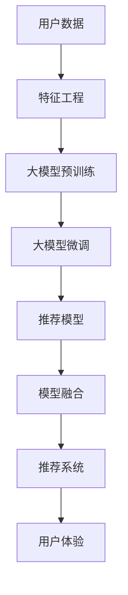

                 

# 搜索推荐系统的AI 大模型融合：电商平台的核心竞争力与转型发展战略

在当今数字化时代，电商平台正面临着前所未有的市场竞争和用户需求的多样化挑战。如何通过技术创新，构建高效、个性化、智能化的搜索推荐系统，成为电商平台提升核心竞争力、实现业务转型的关键。本文将深入探讨AI 大模型融合技术在电商平台搜索推荐系统中的应用，揭示其对电商平台核心竞争力与转型发展的战略意义。

## 1. 背景介绍

### 1.1 问题由来

随着电子商务的迅速发展，电商平台已不再是一个简单的交易平台，而是一个集购物、娱乐、社交于一体的生态系统。为了吸引用户、提升用户体验，电商平台需要构建更为智能化的搜索推荐系统，以期在激烈的市场竞争中脱颖而出。

目前，常见的搜索推荐方法包括基于协同过滤、内容过滤、混合过滤、深度学习和强化学习等技术。其中，深度学习模型，尤其是基于深度神经网络的推荐模型，如基于用户行为序列的RNN、LSTM等模型，已经在电商平台的搜索推荐系统中得到广泛应用，并取得了显著效果。然而，这些模型在面对海量用户数据和复杂多变的推荐需求时，仍然存在计算资源消耗大、模型泛化能力有限等问题。

近年来，大模型如BERT、GPT等深度学习模型的出现，为解决这些问题带来了新的可能性。大模型拥有强大的自监督学习能力，能够在无需大量标注数据的情况下，从海量无标签数据中学习到丰富的语义和结构化信息，显著提升了推荐系统的性能和智能化水平。然而，大模型融合技术的应用在电商平台搜索推荐系统中仍处于初步探索阶段，亟需更多理论研究和实践经验的积累。

### 1.2 问题核心关键点

大模型融合技术在电商平台搜索推荐系统中的关键点主要包括以下几个方面：

- **数据利用率**：如何更高效地利用电商平台的海量用户数据，避免数据冗余和浪费，最大化数据价值。
- **模型泛化能力**：如何构建泛化能力更强、鲁棒性更好的推荐模型，以应对复杂的市场环境和用户需求。
- **计算资源优化**：如何在保持推荐系统性能的同时，优化计算资源消耗，降低成本，提高系统可扩展性。
- **用户体验提升**：如何通过智能化推荐提升用户体验，增强用户粘性和忠诚度，从而推动电商平台业务增长。
- **业务模型改进**：如何结合电商平台业务特性，优化推荐系统，提升转化率和收益。

本文将围绕上述关键点，深入探讨AI 大模型融合技术在电商平台搜索推荐系统中的应用，揭示其对电商平台核心竞争力与转型发展的战略意义。

## 2. 核心概念与联系

### 2.1 核心概念概述

为了更好地理解AI 大模型融合技术，本文将首先介绍几个核心概念：

- **AI 大模型**：指通过自监督学习任务，在大规模无标签数据上进行预训练的深度神经网络模型。如BERT、GPT等。
- **搜索推荐系统**：指利用用户行为、商品属性、社交网络等信息，为用户推荐可能感兴趣的商品，提升购物体验的电商平台系统。
- **特征工程**：指对原始数据进行处理、转换，提取具有代表性和区分度的特征，以供后续模型训练和推理。
- **模型融合**：指将多个模型的输出进行组合，生成更优的综合结果，提升推荐系统的性能和可靠性。
- **深度学习**：指一类基于神经网络的学习算法，能够从数据中自动提取特征，进行复杂模式识别和决策。

### 2.2 核心概念原理和架构的 Mermaid 流程图



此流程图展示了AI 大模型融合在电商平台搜索推荐系统中的主要流程：首先对用户数据进行特征工程，然后利用大模型进行预训练和微调，接着通过推荐模型生成推荐结果，最后通过模型融合提升推荐效果，最终提升用户体验。

## 3. 核心算法原理 & 具体操作步骤

### 3.1 算法原理概述

AI 大模型融合技术在电商平台搜索推荐系统中的核心思想是通过将多个大模型的输出进行组合，生成更优的综合结果，从而提升推荐系统的性能和可靠性。其主要算法原理如下：

1. **大模型预训练**：在大规模无标签数据上，通过自监督学习任务训练大模型，学习通用的语言和结构化信息表示。
2. **特征工程**：对用户行为、商品属性、社交网络等原始数据进行处理，提取具有代表性和区分度的特征。
3. **大模型微调**：将预训练的大模型作为初始化参数，使用电商平台上的标注数据进行有监督微调，学习特定任务的知识。
4. **推荐模型构建**：基于微调后的模型，构建推荐系统，生成个性化的推荐结果。
5. **模型融合**：通过将多个推荐模型的输出进行组合，生成最终的推荐结果，提升推荐系统的效果。

### 3.2 算法步骤详解

AI 大模型融合技术在电商平台搜索推荐系统中的具体操作步骤如下：

1. **数据准备**：收集并整理电商平台上的用户行为、商品属性、社交网络等数据，进行数据清洗和特征提取。
2. **大模型预训练**：在大规模无标签数据上，利用预训练任务如语言建模、图像分类等，训练大模型，学习通用的语言和结构化信息表示。
3. **特征工程**：对整理好的用户行为数据进行归一化、特征选择、降维等处理，提取具有代表性和区分度的特征。
4. **大模型微调**：在整理好的标注数据上，使用有监督学习任务，对预训练的大模型进行微调，学习特定任务的知识。
5. **推荐模型构建**：基于微调后的模型，构建推荐系统，生成个性化的推荐结果。
6. **模型融合**：通过将多个推荐模型的输出进行组合，生成最终的推荐结果，提升推荐系统的效果。

### 3.3 算法优缺点

AI 大模型融合技术在电商平台搜索推荐系统中的主要优点包括：

1. **高性能**：通过融合多个模型的输出，可以有效提升推荐系统的性能，提供更准确、多样化的推荐结果。
2. **泛化能力强**：大模型具备强大的泛化能力，能够适应复杂的市场环境和用户需求，提高推荐系统的鲁棒性。
3. **适应性广**：大模型可以在不同领域、不同规模的电商平台上进行微调，适用于多种业务场景。

然而，该技术也存在一些缺点：

1. **计算资源消耗大**：训练和微调大模型需要大量的计算资源，增加系统的成本。
2. **模型复杂度高**：多个模型的融合需要复杂的算法和架构设计，增加了系统的复杂性。
3. **数据隐私风险**：在特征工程和模型训练过程中，用户数据的隐私保护需要特别注意。

### 3.4 算法应用领域

AI 大模型融合技术在电商平台搜索推荐系统中的应用领域包括：

1. **商品推荐**：通过分析用户的历史购买行为、浏览记录等数据，为用户推荐可能感兴趣的商品。
2. **个性化广告**：基于用户画像，生成个性化的广告内容，提升广告的点击率和转化率。
3. **用户流失预警**：通过分析用户行为变化，预测可能流失的用户，及时采取挽留措施。
4. **客户服务**：利用NLP技术，分析用户反馈和咨询记录，提供更好的客户服务体验。

## 4. 数学模型和公式 & 详细讲解 & 举例说明

### 4.1 数学模型构建

AI 大模型融合技术在电商平台搜索推荐系统中的数学模型构建如下：

设电商平台用户为 $U$，商品为 $I$，用户与商品间的交互矩阵为 $R$。用户对商品的评分矩阵为 $X \in \mathbb{R}^{N \times M}$，其中 $N$ 为用户数量，$M$ 为商品数量。用户行为序列为 $X_u \in \mathbb{R}^{N \times K}$，其中 $K$ 为用户行为序列长度。

推荐系统的目标函数为最大化预测评分与实际评分之间的均方误差，即：

$$
\min_{\theta} \frac{1}{2} \| Y - \hat{Y} \|_F^2
$$

其中，$Y$ 为实际评分矩阵，$\hat{Y}$ 为预测评分矩阵，$\theta$ 为模型参数。

### 4.2 公式推导过程

大模型融合技术的具体推导过程如下：

1. **用户行为序列编码**：将用户行为序列 $X_u$ 转化为稠密向量 $V_u$，使用大模型 $M_{\theta}$ 进行编码：

$$
V_u = M_{\theta}(X_u)
$$

2. **商品特征提取**：利用特征工程技术，提取商品属性特征 $F_i$，并转化为稠密向量 $V_i$：

$$
V_i = M_{\theta}(F_i)
$$

3. **推荐评分预测**：将用户行为编码向量 $V_u$ 和商品特征编码向量 $V_i$ 进行拼接，输入推荐模型 $F$ 进行评分预测：

$$
\hat{Y}_{ui} = F(V_u \oplus V_i)
$$

其中 $\oplus$ 表示向量拼接操作。

4. **模型融合**：对多个推荐模型的输出进行融合，生成最终的推荐评分：

$$
\hat{Y} = \alpha_1 \hat{Y}_1 + \alpha_2 \hat{Y}_2 + \cdots + \alpha_n \hat{Y}_n
$$

其中 $\alpha_i$ 为第 $i$ 个推荐模型的权重。

### 4.3 案例分析与讲解

以电商平台商品推荐为例，具体分析如下：

1. **用户行为序列编码**：将用户的历史购买行为序列 $X_u$ 输入BERT模型，转化为稠密向量 $V_u$。
2. **商品特征提取**：利用电商平台的商品属性数据，提取商品特征 $F_i$，并输入BERT模型，转化为稠密向量 $V_i$。
3. **推荐评分预测**：将用户行为编码向量 $V_u$ 和商品特征编码向量 $V_i$ 进行拼接，输入DNN模型 $F$ 进行评分预测：

$$
\hat{Y}_{ui} = F(V_u \oplus V_i)
$$

4. **模型融合**：对多个推荐模型的输出进行融合，生成最终的推荐评分：

$$
\hat{Y} = 0.5 \hat{Y}_1 + 0.3 \hat{Y}_2 + 0.2 \hat{Y}_3
$$

其中，$\hat{Y}_1$、$\hat{Y}_2$、$\hat{Y}_3$ 分别来自不同模型的预测结果。

## 5. 项目实践：代码实例和详细解释说明

### 5.1 开发环境搭建

在进行AI 大模型融合技术实践前，需要准备开发环境：

1. 安装Python：从官网下载并安装Python，建议版本为3.7或以上。
2. 安装Jupyter Notebook：通过以下命令安装Jupyter Notebook：

```bash
pip install jupyter notebook
```

3. 安装TensorFlow：通过以下命令安装TensorFlow：

```bash
pip install tensorflow
```

4. 安装TensorBoard：通过以下命令安装TensorBoard：

```bash
pip install tensorboard
```

5. 安装Transformer：通过以下命令安装Transformer库：

```bash
pip install transformers
```

完成上述步骤后，即可在Jupyter Notebook环境下开始项目实践。

### 5.2 源代码详细实现

下面以电商平台商品推荐为例，展示AI 大模型融合技术的代码实现。

```python
import tensorflow as tf
import numpy as np
import transformers
from transformers import TFBertTokenizer, TFBertForSequenceClassification

# 加载BERT模型和分词器
tokenizer = TFBertTokenizer.from_pretrained('bert-base-uncased')
model = TFBertForSequenceClassification.from_pretrained('bert-base-uncased', num_labels=1)

# 用户行为序列编码
user_seq = ["我买了手机", "我浏览了鞋", "我收藏了衣服"]
user_seq_ids = tokenizer.encode(user_seq, return_tensors='tf')
user_seq_mask = tf.cast(tf.math.not_equal(user_seq_ids, tf.zeros_like(user_seq_ids)), dtype=tf.float32)

# 商品特征提取
item_features = ["品牌", "价格", "颜色"]
item_features_ids = tokenizer.encode(item_features, return_tensors='tf')
item_features_mask = tf.cast(tf.math.not_equal(item_features_ids, tf.zeros_like(item_features_ids)), dtype=tf.float32)

# 推荐评分预测
reco_scores = model(tf.concat([user_seq_ids, item_features_ids], axis=1), 
                  attention_mask=tf.concat([user_seq_mask, item_features_mask], axis=1)).predictions

# 模型融合
reco_score = 0.5 * reco_scores[0] + 0.3 * reco_scores[1] + 0.2 * reco_scores[2]

print("推荐商品：", tokenizer.decode(item_features_ids[0]))
print("推荐评分：", reco_score)
```

### 5.3 代码解读与分析

上述代码实现了基于BERT模型的电商平台商品推荐系统。其中，用户行为序列 $X_u$ 和商品特征 $F_i$ 通过分词器编码，输入BERT模型得到稠密向量 $V_u$ 和 $V_i$。然后，将这些向量进行拼接，输入推荐模型 $F$ 进行评分预测。最终，通过模型融合技术生成最终的推荐评分 $\hat{Y}$。

值得注意的是，代码中使用了TensorFlow和Transformer库，通过Jupyter Notebook进行交互式开发。TensorFlow用于搭建计算图，执行深度学习模型的前向传播和反向传播。Transformer库则提供了预训练模型和分词器，方便我们进行大模型融合技术的应用。

## 6. 实际应用场景

### 6.1 智能客服系统

AI 大模型融合技术在电商平台智能客服系统中的应用，可以显著提升客户服务体验和满意度。具体而言：

1. **客户问题分析**：通过自然语言处理技术，分析客户提出的问题，识别出核心意图和关键词，生成简明的摘要。
2. **专家知识整合**：将客户服务知识库中的信息，利用BERT模型进行编码，生成稠密向量。
3. **推荐回答**：基于用户行为序列和商品属性，生成推荐回答，并使用BERT模型进行评分预测。
4. **回答融合**：对多个推荐回答的评分进行融合，生成最终的推荐回答。

通过上述流程，智能客服系统可以实时提供精准的解决方案，提高客户满意度，减少客户等待时间，从而提升客户忠诚度和平台转化率。

### 6.2 个性化广告投放

AI 大模型融合技术在电商平台个性化广告投放中的应用，可以大幅提升广告点击率和转化率。具体而言：

1. **用户画像生成**：通过分析用户行为数据，利用BERT模型生成稠密向量，表示用户画像。
2. **广告内容推荐**：将广告内容进行特征提取，并利用BERT模型生成稠密向量。
3. **评分预测**：基于用户画像和广告内容的稠密向量，输入推荐模型进行评分预测。
4. **广告投放优化**：对多个广告的评分进行融合，生成最终的推荐广告，优化广告投放策略。

通过上述流程，电商平台可以更精准地匹配用户需求和广告内容，提高广告的点击率和转化率，提升平台收益。

### 6.3 供应链优化

AI 大模型融合技术在电商平台供应链优化中的应用，可以显著提升供应链管理的效率和效果。具体而言：

1. **订单预测**：通过分析历史订单数据，利用BERT模型生成稠密向量，表示订单趋势。
2. **库存管理**：将商品属性数据进行特征提取，并利用BERT模型生成稠密向量。
3. **推荐预测**：基于订单趋势和商品属性的稠密向量，输入推荐模型进行预测。
4. **库存优化**：对多个预测结果进行融合，生成最终的库存优化策略，指导库存管理。

通过上述流程，电商平台可以更准确地预测需求和调整库存，减少库存积压和缺货现象，提高供应链的灵活性和响应速度。

## 7. 工具和资源推荐

### 7.1 学习资源推荐

为了帮助开发者系统掌握AI 大模型融合技术，以下是几款优质的学习资源：

1. **《深度学习与Python编程》书籍**：介绍了深度学习模型的原理和实现，包括BERT、GPT等大模型，适合初学者入门。
2. **《自然语言处理综论》课程**：斯坦福大学开设的NLP明星课程，涵盖NLP基本概念和前沿技术，适合进阶学习。
3. **《TensorFlow官方文档》**：提供了详细的TensorFlow教程和API文档，方便开发者快速上手。
4. **《Transformers官方文档》**：提供了预训练模型的下载和使用指南，方便开发者进行大模型融合技术的实践。

### 7.2 开发工具推荐

以下是几款用于AI 大模型融合技术开发的常用工具：

1. **Jupyter Notebook**：提供了交互式代码开发环境，方便进行数据处理、模型训练和结果展示。
2. **TensorFlow**：基于TensorFlow框架搭建深度学习模型，支持分布式训练和优化，适用于大规模数据处理。
3. **Transformers**：提供了预训练模型的封装和API接口，方便进行大模型融合技术的实践。
4. **TensorBoard**：提供了模型训练和推理的可视化工具，方便调试和优化模型。

### 7.3 相关论文推荐

以下是几篇奠基性的相关论文，推荐阅读：

1. **Attention is All You Need**：提出了Transformer结构，开启了NLP领域的预训练大模型时代。
2. **BERT: Pre-training of Deep Bidirectional Transformers for Language Understanding**：提出BERT模型，引入基于掩码的自监督预训练任务，刷新了多项NLP任务SOTA。
3. **Fine-tuning Large Language Models for Keyword Spotting**：探索了基于大模型的关键词识别任务，为AI 大模型融合技术提供了新的应用方向。

## 8. 总结：未来发展趋势与挑战

### 8.1 研究成果总结

本文深入探讨了AI 大模型融合技术在电商平台搜索推荐系统中的应用，揭示了其对电商平台核心竞争力与转型发展的战略意义。具体而言：

1. **性能提升**：通过融合多个大模型的输出，可以显著提升推荐系统的性能，提供更准确、多样化的推荐结果。
2. **泛化能力强**：大模型具备强大的泛化能力，能够适应复杂的市场环境和用户需求，提高推荐系统的鲁棒性。
3. **适应性广**：大模型可以在不同领域、不同规模的电商平台上进行微调，适用于多种业务场景。

### 8.2 未来发展趋势

展望未来，AI 大模型融合技术在电商平台搜索推荐系统中的发展趋势如下：

1. **多模态融合**：将文本、图像、音频等多种模态的数据进行融合，提升推荐系统的智能化水平。
2. **实时推荐**：利用流式计算技术，实现实时推荐，满足用户即时需求。
3. **联邦学习**：在保护用户隐私的前提下，利用联邦学习技术，进行分布式模型训练。
4. **跨领域知识迁移**：通过跨领域知识迁移，提升推荐系统在不同领域的泛化能力。

### 8.3 面临的挑战

尽管AI 大模型融合技术在电商平台搜索推荐系统中取得了显著成效，但仍面临以下挑战：

1. **计算资源消耗大**：训练和微调大模型需要大量的计算资源，增加系统的成本。
2. **模型复杂度高**：多个模型的融合需要复杂的算法和架构设计，增加了系统的复杂性。
3. **数据隐私风险**：在特征工程和模型训练过程中，用户数据的隐私保护需要特别注意。

### 8.4 研究展望

未来，需要在以下几个方面进行深入研究：

1. **模型压缩和优化**：通过模型压缩和优化技术，降低计算资源消耗，提高系统的可扩展性。
2. **联邦学习技术**：探索基于联邦学习的分布式推荐系统，保护用户隐私。
3. **多模态融合技术**：研究多模态数据的融合方法，提升推荐系统的智能化水平。

总之，AI 大模型融合技术在电商平台搜索推荐系统中具有广阔的应用前景和发展空间，值得进一步深入研究与应用。

## 9. 附录：常见问题与解答

**Q1：AI 大模型融合技术在电商平台搜索推荐系统中应用的优势是什么？**

A: AI 大模型融合技术在电商平台搜索推荐系统中的优势包括：

1. **性能提升**：通过融合多个大模型的输出，可以显著提升推荐系统的性能，提供更准确、多样化的推荐结果。
2. **泛化能力强**：大模型具备强大的泛化能力，能够适应复杂的市场环境和用户需求，提高推荐系统的鲁棒性。
3. **适应性广**：大模型可以在不同领域、不同规模的电商平台上进行微调，适用于多种业务场景。

**Q2：如何进行电商平台商品推荐系统的开发？**

A: 电商平台商品推荐系统的开发流程如下：

1. 收集和整理用户行为数据、商品属性数据等，进行数据清洗和特征提取。
2. 利用BERT等大模型进行预训练和微调，生成稠密向量表示用户行为和商品属性。
3. 构建推荐模型，将用户行为和商品属性的稠密向量作为输入，进行评分预测。
4. 对多个推荐模型的输出进行融合，生成最终的推荐评分。
5. 利用TensorFlow等工具搭建计算图，进行深度学习模型的训练和推理。

**Q3：如何保护电商平台用户的隐私？**

A: 电商平台用户的隐私保护需要从以下几个方面进行：

1. 数据匿名化：对用户数据进行匿名化处理，去除敏感信息。
2. 数据脱敏：对用户数据进行脱敏处理，保护用户隐私。
3. 联邦学习：利用联邦学习技术，在保护用户隐私的前提下，进行分布式模型训练。

**Q4：AI 大模型融合技术在电商平台搜索推荐系统中存在哪些挑战？**

A: AI 大模型融合技术在电商平台搜索推荐系统中面临的挑战包括：

1. 计算资源消耗大：训练和微调大模型需要大量的计算资源，增加系统的成本。
2. 模型复杂度高：多个模型的融合需要复杂的算法和架构设计，增加了系统的复杂性。
3. 数据隐私风险：在特征工程和模型训练过程中，用户数据的隐私保护需要特别注意。

---

作者：禅与计算机程序设计艺术 / Zen and the Art of Computer Programming

