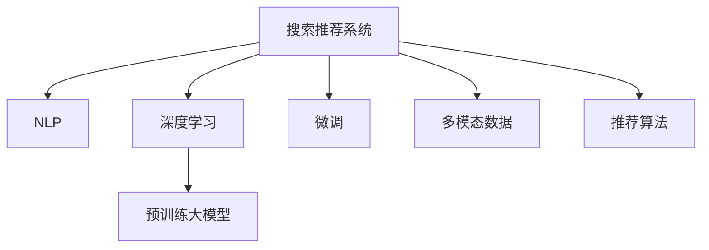

                 

# 搜索推荐系统的AI 大模型融合：电商平台的核心竞争力与转型战略

## 1. 背景介绍

### 1.1 问题由来
近年来，随着电子商务的迅猛发展，电商平台在用户规模、商品种类和交易量方面取得了前所未有的增长。然而，海量商品和复杂用户需求，使得搜索推荐系统的设计和优化变得愈发重要。传统推荐系统依赖规则和浅层机器学习模型，难以捕捉用户隐性偏好和商品关联关系，缺乏可解释性和个性化能力。而基于深度学习和AI大模型的推荐系统，则可以弥补这些缺陷，成为电商平台的核心竞争力。

大模型通常指通过大规模预训练获得语言或图像表示能力，如BERT、GPT等自然语言处理模型，以及CLIP、DALL-E等图像生成模型。这些模型在预训练时通常使用大规模无标签数据，学习到了丰富的通用知识和表示能力。在电商平台中，这些知识可以通过微调等方法，转化为搜索推荐系统的推荐能力。

### 1.2 问题核心关键点
电商平台的大模型融合主要涉及以下几个核心关键点：

- 大模型预训练：利用大规模无标签数据进行自监督学习，学习到丰富的语言和图像知识。
- 搜索推荐系统微调：在预训练大模型的基础上，针对电商平台的任务进行微调，提升推荐性能。
- 融合多模态数据：将文本、图像、行为数据等多种数据源融合，提升推荐系统的准确性和多样性。
- 推荐算法创新：开发新的推荐算法，结合大模型的智能和规则的灵活，构建更智能的推荐系统。
- 数据隐私保护：在获取和使用用户数据时，确保数据安全和隐私保护。

这些关键点共同构成了电商平台搜索推荐系统在大模型融合方面的重要考量。

## 2. 核心概念与联系

### 2.1 核心概念概述

为更好地理解电商平台搜索推荐系统的大模型融合方法，本节将介绍几个密切相关的核心概念：

- 搜索推荐系统(Recommendation System)：通过分析用户行为和偏好，为特定用户推荐个性化商品的系统。搜索推荐系统主要包括搜索结果推荐、商品推荐、用户画像生成等功能模块。

- 自然语言处理(Natural Language Processing, NLP)：研究如何让计算机处理和理解人类语言的技术，包括文本分类、情感分析、语义匹配等任务。

- 深度学习(Deep Learning)：一类基于多层神经网络的机器学习算法，通过反向传播优化权重，可以自动学习复杂特征表示，广泛应用于图像、文本、语音等数据处理任务。

- 预训练大模型(Pre-trained Large Model)：如BERT、GPT等通过大规模无标签数据进行预训练，获得丰富的语言表示能力的模型。

- 微调(Fine-Tuning)：在预训练模型的基础上，使用特定任务的数据进行有监督学习，优化模型性能的过程。

- 多模态数据(Multimodal Data)：指文本、图像、声音等多种类型的数据。

- 推荐算法(Recommendation Algorithm)：搜索推荐系统采用的算法，如协同过滤、基于内容的推荐、深度学习推荐等。

这些核心概念之间的逻辑关系可以通过以下Mermaid流程图来展示：



这个流程图展示了大模型融合搜索推荐系统的核心概念及其之间的关系：

1. 搜索推荐系统通过NLP技术处理文本数据，并使用深度学习模型进行特征提取和模式识别。
2. 预训练大模型提供了强大的语言表示能力，可以提升NLP任务的性能。
3. 微调过程利用特定任务的标注数据，优化模型在推荐系统中的应用效果。
4. 多模态数据源融合，进一步提升推荐系统的准确性和丰富性。
5. 推荐算法作为实际落地的关键，需要在模型基础上进行精心设计。

这些概念共同构成了电商平台搜索推荐系统在大模型融合方面的工作框架，使其能够在各种场景下发挥强大的推荐能力。

## 3. 核心算法原理 & 具体操作步骤
### 3.1 算法原理概述

电商平台搜索推荐系统的大模型融合，本质上是通过预训练大模型的智能能力，结合深度学习算法，优化推荐结果的过程。其核心思想是：将预训练大模型视作一个智能的"特征提取器"，通过微调等方法，学习到更符合电商平台的推荐规律，从而提升推荐系统的性能。

形式化地，假设预训练大模型为 $M_{\theta}$，其中 $\theta$ 为预训练得到的模型参数。给定电商平台推荐系统任务 $T$ 的标注数据集 $D=\{(x_i,y_i)\}_{i=1}^N$，微调的目标是找到新的模型参数 $\hat{\theta}$，使得：

$$
\hat{\theta}=\mathop{\arg\min}_{\theta} \mathcal{L}(M_{\theta},D)
$$

其中 $\mathcal{L}$ 为针对任务 $T$ 设计的损失函数，用于衡量模型预测输出与真实标签之间的差异。常见的损失函数包括交叉熵损失、均方误差损失等。

通过梯度下降等优化算法，微调过程不断更新模型参数 $\theta$，最小化损失函数 $\mathcal{L}$，使得模型输出逼近真实标签。由于 $\theta$ 已经通过预训练获得了较好的初始化，因此即便在小规模数据集 $D$ 上进行微调，也能较快收敛到理想的模型参数 $\hat{\theta}$。

### 3.2 算法步骤详解

电商平台搜索推荐系统的大模型融合一般包括以下几个关键步骤：

**Step 1: 准备预训练模型和数据集**
- 选择合适的预训练大模型 $M_{\theta}$ 作为初始化参数，如 BERT、GPT、DALL-E等。
- 准备电商平台推荐系统任务 $T$ 的标注数据集 $D$，划分为训练集、验证集和测试集。

**Step 2: 设计任务适配层**
- 根据推荐系统任务类型，在预训练大模型顶层设计合适的输出层和损失函数。
- 对于分类任务，通常在顶层添加线性分类器和交叉熵损失函数。
- 对于回归任务，使用均方误差损失函数。
- 对于多模态数据，使用联合训练或多任务学习框架，整合不同类型的数据。

**Step 3: 设置微调超参数**
- 选择合适的优化算法及其参数，如 AdamW、SGD 等，设置学习率、批大小、迭代轮数等。
- 设置正则化技术及强度，包括权重衰减、Dropout、Early Stopping 等。
- 确定冻结预训练参数的策略，如仅微调顶层，或全部参数都参与微调。

**Step 4: 执行梯度训练**
- 将训练集数据分批次输入模型，前向传播计算损失函数。
- 反向传播计算参数梯度，根据设定的优化算法和学习率更新模型参数。
- 周期性在验证集上评估模型性能，根据性能指标决定是否触发 Early Stopping。
- 重复上述步骤直到满足预设的迭代轮数或 Early Stopping 条件。

**Step 5: 测试和部署**
- 在测试集上评估微调后模型 $M_{\hat{\theta}}$ 的性能，对比微调前后的精度提升。
- 使用微调后的模型对新商品进行推荐，集成到实际的应用系统中。
- 持续收集新的数据，定期重新微调模型，以适应数据分布的变化。

以上是电商平台搜索推荐系统大模型融合的一般流程。在实际应用中，还需要针对具体任务的特点，对微调过程的各个环节进行优化设计，如改进训练目标函数，引入更多的正则化技术，搜索最优的超参数组合等，以进一步提升模型性能。

### 3.3 算法优缺点

电商平台搜索推荐系统的大模型融合方法具有以下优点：
1. 简单高效。只需准备少量标注数据，即可对预训练模型进行快速适配，获得较大的性能提升。
2. 通用适用。适用于各种电商推荐任务，包括商品推荐、用户画像生成、搜索结果推荐等，设计简单的任务适配层即可实现微调。
3. 参数高效。利用参数高效微调技术，在固定大部分预训练权重不变的情况下，仍可取得不错的提升。
4. 效果显著。在学术界和工业界的诸多任务上，基于大模型的微调方法已经刷新了最先进的性能指标。

同时，该方法也存在一定的局限性：
1. 依赖标注数据。微调的效果很大程度上取决于标注数据的质量和数量，获取高质量标注数据的成本较高。
2. 迁移能力有限。当目标任务与预训练数据的分布差异较大时，微调的性能提升有限。
3. 负面效果传递。预训练模型的固有偏见、有害信息等，可能通过微调传递到下游任务，造成负面影响。
4. 可解释性不足。微调模型的决策过程通常缺乏可解释性，难以对其推理逻辑进行分析和调试。

尽管存在这些局限性，但就目前而言，大模型融合搜索推荐系统的方法仍然是大模型应用的最主流范式。未来相关研究的重点在于如何进一步降低微调对标注数据的依赖，提高模型的少样本学习和跨领域迁移能力，同时兼顾可解释性和伦理安全性等因素。

### 3.4 算法应用领域

大模型融合搜索推荐系统的方法已经在电商平台的多个应用场景中得到了广泛的应用，例如：

- 商品推荐：通过用户浏览历史、购买记录、评价反馈等数据，为每个用户推荐最相关的商品。
- 用户画像生成：通过对用户行为数据的分析和建模，生成用户的兴趣偏好、消费能力、历史评价等特征。
- 搜索结果排序：对用户的搜索关键词和商品标题进行语义匹配，对相关商品进行排序。
- 个性化广告推荐：根据用户行为数据和广告内容，精准推送个性化广告。
- 内容生成：利用大模型生成商品描述、广告文案等文本内容，提升用户体验。

除了上述这些经典应用外，大模型融合搜索推荐系统也被创新性地应用到更多场景中，如智能客服、产品设计、市场分析等，为电商平台的数字化转型升级提供了新的技术路径。随着大模型和推荐算法的发展，相信基于大模型融合的搜索推荐系统将在更多领域大放异彩。

## 4. 数学模型和公式 & 详细讲解 & 举例说明
### 4.1 数学模型构建

本节将使用数学语言对电商平台搜索推荐系统的大模型融合过程进行更加严格的刻画。

记预训练大模型为 $M_{\theta}$，其中 $\theta$ 为模型参数。假设推荐系统任务 $T$ 的训练集为 $D=\{(x_i,y_i)\}_{i=1}^N, x_i \in \mathcal{X}, y_i \in \mathcal{Y}$，其中 $\mathcal{X}$ 为输入空间，$\mathcal{Y}$ 为输出空间。

定义模型 $M_{\theta}$ 在数据样本 $(x,y)$ 上的损失函数为 $\ell(M_{\theta}(x),y)$，则在数据集 $D$ 上的经验风险为：

$$
\mathcal{L}(\theta) = \frac{1}{N} \sum_{i=1}^N \ell(M_{\theta}(x_i),y_i)
$$

微调的优化目标是最小化经验风险，即找到最优参数：

$$
\theta^* = \mathop{\arg\min}_{\theta} \mathcal{L}(\theta)
$$

在实践中，我们通常使用基于梯度的优化算法（如SGD、Adam等）来近似求解上述最优化问题。设 $\eta$ 为学习率，$\lambda$ 为正则化系数，则参数的更新公式为：

$$
\theta \leftarrow \theta - \eta \nabla_{\theta}\mathcal{L}(\theta) - \eta\lambda\theta
$$

其中 $\nabla_{\theta}\mathcal{L}(\theta)$ 为损失函数对参数 $\theta$ 的梯度，可通过反向传播算法高效计算。

### 4.2 公式推导过程

以下我们以用户行为预测任务为例，推导交叉熵损失函数及其梯度的计算公式。

假设模型 $M_{\theta}$ 在输入 $x$ 上的输出为 $\hat{y}=M_{\theta}(x) \in [0,1]$，表示用户点击商品的概率。真实标签 $y \in \{0,1\}$。则二分类交叉熵损失函数定义为：

$$
\ell(M_{\theta}(x),y) = -[y\log \hat{y} + (1-y)\log (1-\hat{y})]
$$

将其代入经验风险公式，得：

$$
\mathcal{L}(\theta) = -\frac{1}{N}\sum_{i=1}^N [y_i\log M_{\theta}(x_i)+(1-y_i)\log(1-M_{\theta}(x_i))]
$$

根据链式法则，损失函数对参数 $\theta_k$ 的梯度为：

$$
\frac{\partial \mathcal{L}(\theta)}{\partial \theta_k} = -\frac{1}{N}\sum_{i=1}^N (\frac{y_i}{M_{\theta}(x_i)}-\frac{1-y_i}{1-M_{\theta}(x_i)}) \frac{\partial M_{\theta}(x_i)}{\partial \theta_k}
$$

其中 $\frac{\partial M_{\theta}(x_i)}{\partial \theta_k}$ 可进一步递归展开，利用自动微分技术完成计算。

在得到损失函数的梯度后，即可带入参数更新公式，完成模型的迭代优化。重复上述过程直至收敛，最终得到适应电商平台推荐系统任务的最优模型参数 $\theta^*$。

## 5. 项目实践：代码实例和详细解释说明
### 5.1 开发环境搭建

在进行微调实践前，我们需要准备好开发环境。以下是使用Python进行PyTorch开发的环境配置流程：

1. 安装Anaconda：从官网下载并安装Anaconda，用于创建独立的Python环境。

2. 创建并激活虚拟环境：
```bash
conda create -n pytorch-env python=3.8 
conda activate pytorch-env
```

3. 安装PyTorch：根据CUDA版本，从官网获取对应的安装命令。例如：
```bash
conda install pytorch torchvision torchaudio cudatoolkit=11.1 -c pytorch -c conda-forge
```

4. 安装Transformers库：
```bash
pip install transformers
```

5. 安装各类工具包：
```bash
pip install numpy pandas scikit-learn matplotlib tqdm jupyter notebook ipython
```

完成上述步骤后，即可在`pytorch-env`环境中开始微调实践。

### 5.2 源代码详细实现

这里我们以电商平台商品推荐系统为例，给出使用Transformers库对BERT模型进行微调的PyTorch代码实现。

首先，定义商品推荐任务的数据处理函数：

```python
from transformers import BertTokenizer
from torch.utils.data import Dataset
import torch

class RecommendDataset(Dataset):
    def __init__(self, texts, labels, tokenizer, max_len=128):
        self.texts = texts
        self.labels = labels
        self.tokenizer = tokenizer
        self.max_len = max_len
        
    def __len__(self):
        return len(self.texts)
    
    def __getitem__(self, item):
        text = self.texts[item]
        label = self.labels[item]
        
        encoding = self.tokenizer(text, return_tensors='pt', max_length=self.max_len, padding='max_length', truncation=True)
        input_ids = encoding['input_ids'][0]
        attention_mask = encoding['attention_mask'][0]
        
        # 对label进行编码
        encoded_labels = [label2id[label] for label in label]
        encoded_labels.extend([label2id['O']] * (self.max_len - len(encoded_labels)))
        labels = torch.tensor(encoded_labels, dtype=torch.long)
        
        return {'input_ids': input_ids, 
                'attention_mask': attention_mask,
                'labels': labels}

# 标签与id的映射
label2id = {'O': 0, 'P': 1} # 只考虑购买标签
id2label = {v: k for k, v in label2id.items()}

# 创建dataset
tokenizer = BertTokenizer.from_pretrained('bert-base-cased')

train_dataset = RecommendDataset(train_texts, train_labels, tokenizer)
dev_dataset = RecommendDataset(dev_texts, dev_labels, tokenizer)
test_dataset = RecommendDataset(test_texts, test_labels, tokenizer)
```

然后，定义模型和优化器：

```python
from transformers import BertForTokenClassification, AdamW

model = BertForTokenClassification.from_pretrained('bert-base-cased', num_labels=len(label2id))

optimizer = AdamW(model.parameters(), lr=2e-5)
```

接着，定义训练和评估函数：

```python
from torch.utils.data import DataLoader
from tqdm import tqdm
from sklearn.metrics import accuracy_score

device = torch.device('cuda') if torch.cuda.is_available() else torch.device('cpu')
model.to(device)

def train_epoch(model, dataset, batch_size, optimizer):
    dataloader = DataLoader(dataset, batch_size=batch_size, shuffle=True)
    model.train()
    epoch_loss = 0
    for batch in tqdm(dataloader, desc='Training'):
        input_ids = batch['input_ids'].to(device)
        attention_mask = batch['attention_mask'].to(device)
        labels = batch['labels'].to(device)
        model.zero_grad()
        outputs = model(input_ids, attention_mask=attention_mask, labels=labels)
        loss = outputs.loss
        epoch_loss += loss.item()
        loss.backward()
        optimizer.step()
    return epoch_loss / len(dataloader)

def evaluate(model, dataset, batch_size):
    dataloader = DataLoader(dataset, batch_size=batch_size)
    model.eval()
    preds, labels = [], []
    with torch.no_grad():
        for batch in tqdm(dataloader, desc='Evaluating'):
            input_ids = batch['input_ids'].to(device)
            attention_mask = batch['attention_mask'].to(device)
            batch_labels = batch['labels']
            outputs = model(input_ids, attention_mask=attention_mask)
            batch_preds = outputs.logits.argmax(dim=2).to('cpu').tolist()
            batch_labels = batch_labels.to('cpu').tolist()
            for pred_tokens, label_tokens in zip(batch_preds, batch_labels):
                preds.append(pred_tokens[:len(label_tokens)])
                labels.append(label_tokens)
                
    print(accuracy_score(labels, preds))
```

最后，启动训练流程并在测试集上评估：

```python
epochs = 5
batch_size = 16

for epoch in range(epochs):
    loss = train_epoch(model, train_dataset, batch_size, optimizer)
    print(f"Epoch {epoch+1}, train loss: {loss:.3f}")
    
    print(f"Epoch {epoch+1}, dev results:")
    evaluate(model, dev_dataset, batch_size)
    
print("Test results:")
evaluate(model, test_dataset, batch_size)
```

以上就是使用PyTorch对BERT进行电商平台商品推荐系统微调的完整代码实现。可以看到，得益于Transformers库的强大封装，我们可以用相对简洁的代码完成BERT模型的加载和微调。

### 5.3 代码解读与分析

让我们再详细解读一下关键代码的实现细节：

**RecommendDataset类**：
- `__init__`方法：初始化文本、标签、分词器等关键组件。
- `__len__`方法：返回数据集的样本数量。
- `__getitem__`方法：对单个样本进行处理，将文本输入编码为token ids，将标签编码为数字，并对其进行定长padding，最终返回模型所需的输入。

**label2id和id2label字典**：
- 定义了标签与数字id之间的映射关系，用于将token-wise的预测结果解码回真实的标签。

**训练和评估函数**：
- 使用PyTorch的DataLoader对数据集进行批次化加载，供模型训练和推理使用。
- 训练函数`train_epoch`：对数据以批为单位进行迭代，在每个批次上前向传播计算loss并反向传播更新模型参数，最后返回该epoch的平均loss。
- 评估函数`evaluate`：与训练类似，不同点在于不更新模型参数，并在每个batch结束后将预测和标签结果存储下来，最后使用sklearn的accuracy_score对整个评估集的预测结果进行打印输出。

**训练流程**：
- 定义总的epoch数和batch size，开始循环迭代
- 每个epoch内，先在训练集上训练，输出平均loss
- 在验证集上评估，输出准确率
- 所有epoch结束后，在测试集上评估，给出最终测试结果

可以看到，PyTorch配合Transformers库使得BERT微调的代码实现变得简洁高效。开发者可以将更多精力放在数据处理、模型改进等高层逻辑上，而不必过多关注底层的实现细节。

当然，工业级的系统实现还需考虑更多因素，如模型的保存和部署、超参数的自动搜索、更灵活的任务适配层等。但核心的微调范式基本与此类似。

## 6. 实际应用场景
### 6.1 智能客服系统

基于大模型融合的搜索推荐系统，可以广泛应用于智能客服系统的构建。传统客服往往需要配备大量人力，高峰期响应缓慢，且一致性和专业性难以保证。而使用融合大模型的搜索推荐系统，可以7x24小时不间断服务，快速响应客户咨询，用自然流畅的语言解答各类常见问题。

在技术实现上，可以收集企业内部的历史客服对话记录，将问题和最佳答复构建成监督数据，在此基础上对预训练大模型进行微调。微调后的搜索推荐系统能够自动理解用户意图，匹配最合适的答案模板进行回复。对于客户提出的新问题，还可以接入检索系统实时搜索相关内容，动态组织生成回答。如此构建的智能客服系统，能大幅提升客户咨询体验和问题解决效率。

### 6.2 金融舆情监测

金融机构需要实时监测市场舆论动向，以便及时应对负面信息传播，规避金融风险。传统的人工监测方式成本高、效率低，难以应对网络时代海量信息爆发的挑战。基于大模型融合的文本分类和情感分析技术，为金融舆情监测提供了新的解决方案。

具体而言，可以收集金融领域相关的新闻、报道、评论等文本数据，并对其进行主题标注和情感标注。在此基础上对预训练大模型进行微调，使其能够自动判断文本属于何种主题，情感倾向是正面、中性还是负面。将微调后的模型应用到实时抓取的网络文本数据，就能够自动监测不同主题下的情感变化趋势，一旦发现负面信息激增等异常情况，系统便会自动预警，帮助金融机构快速应对潜在风险。

### 6.3 个性化推荐系统

当前的推荐系统往往只依赖用户的历史行为数据进行物品推荐，无法深入理解用户的真实兴趣偏好。基于大模型融合的个性化推荐系统，可以更好地挖掘用户行为背后的语义信息，从而提供更精准、多样的推荐内容。

在实践中，可以收集用户浏览、点击、评论、分享等行为数据，提取和用户交互的物品标题、描述、标签等文本内容。将文本内容作为模型输入，用户的后续行为（如是否点击、购买等）作为监督信号，在此基础上微调预训练大模型。微调后的模型能够从文本内容中准确把握用户的兴趣点。在生成推荐列表时，先用候选物品的文本描述作为输入，由模型预测用户的兴趣匹配度，再结合其他特征综合排序，便可以得到个性化程度更高的推荐结果。

### 6.4 未来应用展望

随着大模型和推荐算法的发展，基于大模型融合的搜索推荐系统将在更多领域得到应用，为传统行业带来变革性影响。

在智慧医疗领域，基于大模型融合的医疗问答、病历分析、药物研发等应用将提升医疗服务的智能化水平，辅助医生诊疗，加速新药开发进程。

在智能教育领域，融合大模型的个性化推荐系统可应用于作业批改、学情分析、知识推荐等方面，因材施教，促进教育公平，提高教学质量。

在智慧城市治理中，融合大模型的智能推荐系统可应用于城市事件监测、舆情分析、应急指挥等环节，提高城市管理的自动化和智能化水平，构建更安全、高效的未来城市。

此外，在企业生产、社会治理、文娱传媒等众多领域，基于大模型融合的搜索推荐系统也将不断涌现，为经济社会发展注入新的动力。相信随着技术的日益成熟，大模型融合搜索推荐系统必将在构建人机协同的智能时代中扮演越来越重要的角色。

## 7. 工具和资源推荐
### 7.1 学习资源推荐

为了帮助开发者系统掌握大模型融合搜索推荐系统的理论基础和实践技巧，这里推荐一些优质的学习资源：

1. 《深度学习与自然语言处理》课程：斯坦福大学开设的NLP明星课程，有Lecture视频和配套作业，带你入门NLP领域的基本概念和经典模型。

2. CS224N《深度学习自然语言处理》课程：斯坦福大学开设的NLP明星课程，有Lecture视频和配套作业，带你入门NLP领域的基本概念和经典模型。

3. 《Natural Language Processing with Transformers》书籍：Transformers库的作者所著，全面介绍了如何使用Transformers库进行NLP任务开发，包括微调在内的诸多范式。

4. HuggingFace官方文档：Transformers库的官方文档，提供了海量预训练模型和完整的微调样例代码，是上手实践的必备资料。

5. 《深度学习与推荐系统》书籍：介绍了深度学习在推荐系统中的应用，涵盖基于矩阵分解、神经网络等方法的推荐算法。

通过对这些资源的学习实践，相信你一定能够快速掌握大模型融合搜索推荐系统的精髓，并用于解决实际的推荐问题。
### 7.2 开发工具推荐

高效的开发离不开优秀的工具支持。以下是几款用于大模型融合搜索推荐系统开发的常用工具：

1. PyTorch：基于Python的开源深度学习框架，灵活动态的计算图，适合快速迭代研究。大部分预训练语言模型都有PyTorch版本的实现。

2. TensorFlow：由Google主导开发的开源深度学习框架，生产部署方便，适合大规模工程应用。同样有丰富的预训练语言模型资源。

3. Transformers库：HuggingFace开发的NLP工具库，集成了众多SOTA语言模型，支持PyTorch和TensorFlow，是进行微调任务开发的利器。

4. Weights & Biases：模型训练的实验跟踪工具，可以记录和可视化模型训练过程中的各项指标，方便对比和调优。与主流深度学习框架无缝集成。

5. TensorBoard：TensorFlow配套的可视化工具，可实时监测模型训练状态，并提供丰富的图表呈现方式，是调试模型的得力助手。

6. Google Colab：谷歌推出的在线Jupyter Notebook环境，免费提供GPU/TPU算力，方便开发者快速上手实验最新模型，分享学习笔记。

合理利用这些工具，可以显著提升大模型融合搜索推荐系统任务的开发效率，加快创新迭代的步伐。

### 7.3 相关论文推荐

大模型融合搜索推荐系统的发展源于学界的持续研究。以下是几篇奠基性的相关论文，推荐阅读：

1. Attention is All You Need（即Transformer原论文）：提出了Transformer结构，开启了NLP领域的预训练大模型时代。

2. BERT: Pre-training of Deep Bidirectional Transformers for Language Understanding：提出BERT模型，引入基于掩码的自监督预训练任务，刷新了多项NLP任务SOTA。

3. Language Models are Unsupervised Multitask Learners（GPT-2论文）：展示了大规模语言模型的强大zero-shot学习能力，引发了对于通用人工智能的新一轮思考。

4. Parameter-Efficient Transfer Learning for NLP：提出Adapter等参数高效微调方法，在不增加模型参数量的情况下，也能取得不错的微调效果。

5. Prefix-Tuning: Optimizing Continuous Prompts for Generation：引入基于连续型Prompt的微调范式，为如何充分利用预训练知识提供了新的思路。

6. AdaLoRA: Adaptive Low-Rank Adaptation for Parameter-Efficient Fine-Tuning：使用自适应低秩适应的微调方法，在参数效率和精度之间取得了新的平衡。

这些论文代表了大模型融合搜索推荐系统的发展脉络。通过学习这些前沿成果，可以帮助研究者把握学科前进方向，激发更多的创新灵感。

## 8. 总结：未来发展趋势与挑战
### 8.1 总结

本文对基于大模型融合的电商平台搜索推荐系统进行了全面系统的介绍。首先阐述了搜索推荐系统在大模型融合方面的研究背景和意义，明确了融合大模型在提升推荐性能、拓展推荐边界等方面的独特价值。其次，从原理到实践，详细讲解了大模型融合的数学原理和关键步骤，给出了微调任务开发的完整代码实例。同时，本文还广泛探讨了融合大模型在智能客服、金融舆情、个性化推荐等多个行业领域的应用前景，展示了融合大模型的巨大潜力。此外，本文精选了融合大模型的各类学习资源，力求为读者提供全方位的技术指引。

通过本文的系统梳理，可以看到，基于大模型融合的电商平台搜索推荐系统，正在成为推荐系统设计的核心竞争力。融合大模型使得推荐系统不仅具备强大的智能能力，还能应对复杂多变的电商场景，提升用户体验。未来，伴随大模型和推荐算法的发展，融合大模型必将在更多领域得到应用，为行业带来变革性影响。

### 8.2 未来发展趋势

展望未来，基于大模型融合的搜索推荐系统将呈现以下几个发展趋势：

1. 模型规模持续增大。随着算力成本的下降和数据规模的扩张，预训练语言模型的参数量还将持续增长。超大规模语言模型蕴含的丰富语言知识，有望支撑更加复杂多变的推荐系统。

2. 融合多模态数据成为常态。当前的推荐系统主要聚焦于文本数据，未来会进一步拓展到图像、视频、语音等多模态数据微调。多模态信息的融合，将显著提升推荐系统的准确性和多样性。

3. 推荐算法创新不断涌现。结合大模型的智能和规则的灵活，未来的推荐算法将更加多样和高效，如基于图神经网络的推荐、基于知识图谱的推荐等。

4. 少样本学习和跨领域迁移能力提升。在标注数据不足或领域差异较大的情况下，大模型融合的推荐系统仍能通过零样本或少样本学习，获取较好的推荐效果。

5. 可解释性和鲁棒性增强。未来的推荐系统不仅要具备高精度，还要具备可解释性和鲁棒性，使得用户能够理解和信任推荐结果。同时，推荐系统需要在不同场景下表现出较好的稳定性和鲁棒性。

6. 实时性和资源优化成为关键。随着实时推荐需求的增加，推荐系统需要在短时间内快速计算并生成推荐结果。同时，需要在有限的计算资源下，实现高效的推荐。

以上趋势凸显了大模型融合搜索推荐系统的广阔前景。这些方向的探索发展，必将进一步提升推荐系统的性能和应用范围，为电商平台的数字化转型升级带来新的动能。

### 8.3 面临的挑战

尽管基于大模型融合的搜索推荐系统已经取得了瞩目成就，但在迈向更加智能化、普适化应用的过程中，它仍面临诸多挑战：

1. 数据质量和分布差异。推荐系统需要高质量的标注数据，但获取标注数据往往成本高、周期长。不同用户和商品间的分布差异，也可能影响推荐模型的泛化性能。

2. 计算资源需求高。大模型融合推荐系统需要庞大的计算资源支持，包括GPU/TPU、大规模分布式训练等，这对硬件设备和算力基础设施提出了较高的要求。

3. 可解释性不足。尽管大模型能够提高推荐准确性，但其内部工作机制和决策过程缺乏可解释性，难以满足合规和透明性的要求。

4. 冷启动问题。新用户和未标注商品带来冷启动问题，导致推荐系统在初期无法给出准确推荐。

5. 数据隐私和安全。推荐系统需要收集和分析用户行为数据，如何保护用户隐私、防止数据滥用，是重要的研究方向。

尽管存在这些挑战，但随着学界和产业界的共同努力，这些问题终将逐步得到解决，大模型融合搜索推荐系统必将在构建人机协同的智能时代中扮演越来越重要的角色。相信随着技术的不断成熟和完善，基于大模型融合的推荐系统将更加智能、高效、可靠，为电商平台的数字化转型注入新的动力。

### 8.4 研究展望

面向未来，基于大模型融合的搜索推荐系统需要在以下几个方面寻求新的突破：

1. 探索无监督和半监督推荐方法。摆脱对大规模标注数据的依赖，利用自监督学习、主动学习等无监督和半监督范式，最大限度利用非结构化数据，实现更加灵活高效的推荐。

2. 研究少样本学习和跨领域迁移能力。开发能够适应冷启动场景和跨领域推荐的推荐算法，增强推荐系统在不同用户和商品之间的泛化能力。

3. 融合因果学习和博弈论工具。通过引入因果推断和博弈论思想，增强推荐系统的稳定性和公平性，提高推荐结果的可解释性。

4. 加强数据隐私保护。设计安全的数据收集和存储机制，确保用户隐私和数据安全，增强推荐系统的透明度和可审计性。

5. 集成多种信息源。将专家知识、社交网络、地理信息等多源信息，与推荐系统进行协同融合，提高推荐的综合性和准确性。

这些研究方向的探索，必将引领基于大模型融合的搜索推荐系统迈向更高的台阶，为构建安全、可靠、可解释、可控的智能推荐系统铺平道路。面向未来，搜索推荐系统需要不断创新技术、优化算法、提升性能，才能适应不断变化的市场需求和用户期望，真正实现智能化推荐。

## 9. 附录：常见问题与解答

**Q1：如何选择合适的预训练模型？**

A: 选择预训练模型时需要考虑以下因素：
1. 模型规模：规模越大，学习到的语言知识越丰富。但规模过大也可能导致计算成本高。
2. 预训练任务：不同的预训练任务针对不同的语言特性，如BERT针对语言理解，GPT针对语言生成。
3. 领域适配性：某些预训练模型在特定领域表现更佳，如BERT在法律、医学等专业领域效果更好。
4. 参数数量：根据推荐系统任务需求，选择合适的模型参数规模。

**Q2：微调时如何控制学习率？**

A: 学习率的选择对微调效果至关重要。建议从较小的学习率开始调参，逐步增加。常用的学习率调度策略包括warmup和cyclical learning rates，可以有效防止过拟合。

**Q3：如何选择微调超参数？**

A: 微调超参数包括学习率、批大小、迭代轮数等。这些参数的选择需要根据具体任务和数据集进行调整。一般通过网格搜索或随机搜索等方法，找到最优的超参数组合。

**Q4：微调过程中如何进行正则化？**

A: 正则化技术可以有效防止过拟合。常用的正则化方法包括L2正则、Dropout、Early Stopping等。在微调过程中，结合正则化技术，可以提升模型的泛化能力，避免过拟合。

**Q5：如何处理冷启动问题？**

A: 冷启动问题可以通过以下方法解决：
1. 利用用户的历史行为数据进行推荐。
2. 采用协同过滤算法，推荐与新用户相似的其他用户喜欢的商品。
3. 引入新的用户行为，逐步优化推荐结果。

这些方法可以帮助推荐系统在初期快速生成推荐结果，提升用户体验。

