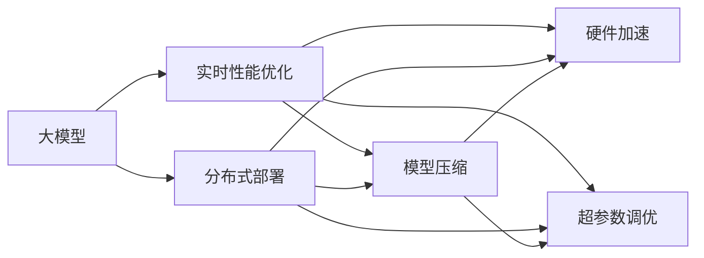

                 

# 搜索推荐系统的实时性能优化：大模型的分布式部署

> 关键词：实时性能优化,大模型,分布式部署,深度学习,Transformer,TensorFlow,优化器,模型压缩,硬件加速,超参数调优

## 1. 背景介绍

随着互联网和移动互联网的发展，数据量的爆炸式增长为搜索引擎和推荐系统提供了海量的输入数据，同时也对实时性提出了更高的要求。传统的基于索引和统计的搜索推荐系统已经难以满足当前用户需求，搜索引擎和推荐系统逐渐朝着基于深度学习的方向发展。其中，大模型作为当前深度学习技术的最新进展，以其强大的表示能力和泛化能力，在搜索推荐系统中的应用越来越广泛。

大模型通常包含数十亿甚至数百亿个参数，具有极强的表征学习能力，能够在大量数据上学习到复杂的高层次抽象特征，从而在推荐系统中的广告点击率预测、召回率优化等任务中取得了显著效果。然而，大模型的训练和推理计算量大、硬件资源消耗高，对传统服务器部署方式提出了挑战。此外，由于搜索推荐系统本身需要实时响应用户请求，对系统延迟和吞吐量的要求极高。因此，如何在有限的硬件资源下，对大模型进行高效的分布式部署和优化，成为了一个亟待解决的问题。

本博客将深入探讨搜索推荐系统中大模型的分布式部署和实时性能优化方法，以期为相关领域的开发人员和研究人员提供参考和指导。

## 2. 核心概念与联系

### 2.1 核心概念概述

在搜索推荐系统中，大模型的分布式部署和实时性能优化涉及多个核心概念：

- 大模型（Large Model）：指包含大量参数的深度神经网络模型，如BERT、GPT等，能够在大规模数据上进行有效学习，并具有强大的泛化能力。
- 分布式部署（Distributed Deployment）：指将模型参数分布在多个计算节点上，通过并行计算实现模型训练和推理加速。
- 实时性能优化（Real-time Performance Optimization）：指通过模型压缩、硬件加速等技术手段，提高模型的计算速度和内存效率，以降低响应时间、提升系统吞吐量。
- 深度学习（Deep Learning）：指基于神经网络的机器学习方法，能够自动学习输入数据的复杂表示，广泛应用于计算机视觉、自然语言处理等领域。
- 优化器（Optimizer）：指用于调整神经网络模型参数，以最小化损失函数的算法，如Adam、SGD等。
- 模型压缩（Model Compression）：指在保持模型性能不变的前提下，通过剪枝、量化、蒸馏等技术手段，减少模型参数和计算量，以降低计算资源消耗。
- 硬件加速（Hardware Acceleration）：指利用GPU、TPU等专用硬件加速器，提高模型的并行计算能力，加速模型训练和推理。
- 超参数调优（Hyperparameter Tuning）：指通过调整模型的超参数（如学习率、批次大小等），找到最优的模型训练方案，以提升模型性能。

这些概念相互关联，共同构成了搜索推荐系统中大模型分布式部署和实时性能优化的基础。

### 2.2 核心概念联系

搜索推荐系统中大模型的分布式部署和实时性能优化，通常涉及以下几个关键联系：

- 大模型的分布式部署与深度学习的并行计算：大模型通常需要在多个计算节点上并行计算，以加速模型训练和推理。
- 实时性能优化与模型压缩的结合：实时性能优化需要通过模型压缩技术，减少模型参数和计算量，从而加速模型训练和推理。
- 硬件加速与深度学习的资源优化：硬件加速技术能够大幅提高深度学习模型的计算速度，但也需要结合超参数调优，才能充分发挥其性能优势。
- 超参数调优与实时性能优化的协同：超参数调优是实时性能优化中的重要一环，通过调整超参数，可以优化模型训练和推理的效率，进而提升系统响应速度。

以下Mermaid流程图展示了这些概念间的联系：



通过这张流程图，我们可以看到，大模型的分布式部署和实时性能优化是一个多维度的协同过程，需要综合考虑模型结构、硬件资源、超参数等多个因素，才能达到最优的性能表现。

## 3. 核心算法原理 & 具体操作步骤

### 3.1 算法原理概述

在搜索推荐系统中，大模型的分布式部署和实时性能优化，主要涉及以下几个算法原理：

- 分布式深度学习：通过将大模型参数分布在多个计算节点上，并行计算以加速模型训练和推理。
- 模型压缩：通过剪枝、量化、蒸馏等技术手段，减少模型参数和计算量，以降低计算资源消耗。
- 硬件加速：利用GPU、TPU等专用硬件加速器，提高模型的并行计算能力，加速模型训练和推理。
- 超参数调优：通过调整模型的超参数（如学习率、批次大小等），找到最优的模型训练方案，以提升模型性能。

这些算法原理相互配合，共同构成了搜索推荐系统中大模型分布式部署和实时性能优化的核心方法。

### 3.2 算法步骤详解

在实际应用中，大模型的分布式部署和实时性能优化通常涉及以下几个步骤：

**Step 1: 数据预处理与模型加载**

- 对原始数据进行预处理，包括数据清洗、特征提取、归一化等操作，以便于模型训练和推理。
- 将大模型加载到多个计算节点上，并进行分布式部署。

**Step 2: 分布式模型训练**

- 将模型参数分布在多个计算节点上，并行计算以加速模型训练。
- 使用优化器（如Adam、SGD等）更新模型参数，最小化损失函数。

**Step 3: 实时性能优化**

- 对模型进行压缩（如剪枝、量化、蒸馏等），减少模型参数和计算量。
- 利用硬件加速器（如GPU、TPU等）提高模型的并行计算能力，加速模型训练和推理。
- 调整模型的超参数（如学习率、批次大小等），找到最优的模型训练方案。

**Step 4: 模型部署与推理**

- 将优化后的模型部署到生产环境中，进行实时推理。
- 监控模型的响应时间和吞吐量，并根据实际使用情况进行调整。

**Step 5: 持续优化**

- 收集模型的性能指标和使用情况，反馈到模型训练和优化过程中。
- 不断调整超参数、更新模型，以提升系统实时性能。

### 3.3 算法优缺点

分布式部署和实时性能优化技术，虽然能够显著提升搜索推荐系统的响应速度和吞吐量，但也存在一些局限性：

- 数据分布不均：由于模型参数分布在多个节点上，数据分布不均可能导致部分节点计算负载过重，影响系统性能。
- 通信开销：分布式部署需要频繁的通信操作，如参数同步、梯度更新等，会消耗额外的计算资源。
- 模型更新复杂：分布式模型更新涉及到多个节点的参数同步，可能存在版本冲突和同步延迟等问题。
- 硬件资源要求高：硬件加速需要高性能的计算资源，对于传统服务器部署方式可能存在硬件资源不足的问题。

尽管存在这些缺点，但分布式部署和实时性能优化技术仍是大模型在搜索推荐系统中应用的重要手段。通过合理设计模型结构和优化算法，可以最大程度地缓解这些问题，从而提升系统性能。

### 3.4 算法应用领域

大模型的分布式部署和实时性能优化技术，在以下领域有广泛应用：

- 广告推荐：通过大模型进行点击率预测，提升广告投放的精准度和转化率。
- 个性化推荐：利用大模型进行用户兴趣建模，生成个性化的推荐内容。
- 智能搜索：通过大模型进行自然语言理解和文本生成，提升搜索结果的相关性和准确性。
- 实时分析：利用大模型进行数据实时分析和挖掘，提供精准的业务洞察。

## 4. 数学模型和公式 & 详细讲解 & 举例说明

### 4.1 数学模型构建

本节将使用数学语言对搜索推荐系统中大模型的分布式部署和实时性能优化过程进行更加严格的刻画。

记大模型为 $M$，输入为 $x$，输出为 $y$。假设模型的参数分布在多个计算节点上，分别为 $M_1, M_2, ..., M_n$。在分布式模型训练过程中，每个节点上的模型参数 $W_1, W_2, ..., W_n$ 通过并行计算更新。

假设优化器为 $Opt$，则分布式模型训练的更新公式为：

$$
W_i = Opt(W_i, g_i) \quad \forall i \in [1, n]
$$

其中 $g_i$ 为节点 $i$ 上的梯度，$g_i$ 的计算公式为：

$$
g_i = \frac{\partial \mathcal{L}(M_i, x)}{\partial W_i}
$$

其中 $\mathcal{L}(M_i, x)$ 为节点 $i$ 上的损失函数。

### 4.2 公式推导过程

以下我们以点击率预测任务为例，推导分布式模型训练的公式。

假设点击率预测任务的损失函数为二分类交叉熵损失，即：

$$
\mathcal{L}(M, x) = -\sum_{i=1}^n \log \sigma(M_i(x))
$$

其中 $\sigma$ 为sigmoid函数，$M_i(x)$ 为节点 $i$ 上的模型输出。

假设模型参数 $W_i$ 在节点 $i$ 上的梯度为 $g_i$，则节点 $i$ 上的更新公式为：

$$
W_i = W_i - \eta \nabla_{W_i} \mathcal{L}(M_i, x)
$$

其中 $\eta$ 为学习率，$\nabla_{W_i} \mathcal{L}(M_i, x)$ 为损失函数对参数 $W_i$ 的梯度，可通过自动微分技术高效计算。

在分布式模型训练过程中，每个节点上的梯度 $g_i$ 为：

$$
g_i = \frac{\partial \mathcal{L}(M_i, x)}{\partial W_i}
$$

将节点 $i$ 上的梯度 $g_i$ 代入更新公式中，得到节点 $i$ 上的模型参数更新公式为：

$$
W_i = W_i - \eta g_i
$$

重复上述过程，直到模型收敛或达到预设的迭代次数，即可得到分布式训练后的模型参数 $W_1, W_2, ..., W_n$。

### 4.3 案例分析与讲解

假设某电商网站通过大模型进行广告点击率预测，需要处理大量用户点击行为数据，模型参数分布在多个节点上。我们可以使用分布式深度学习技术，将模型参数分布在多个节点上，并行计算以加速模型训练和推理。

具体实现步骤如下：

1. 将大模型加载到多个计算节点上，每个节点上的模型参数为 $W_1, W_2, ..., W_n$。
2. 对原始数据进行预处理，包括数据清洗、特征提取、归一化等操作。
3. 定义损失函数 $\mathcal{L}(M_i, x)$，如二分类交叉熵损失。
4. 使用优化器（如Adam、SGD等）更新模型参数，最小化损失函数 $\mathcal{L}(M_i, x)$。
5. 将优化后的模型参数 $W_1, W_2, ..., W_n$ 部署到生产环境中，进行实时推理。
6. 监控模型的响应时间和吞吐量，并根据实际使用情况进行调整。

## 5. 项目实践：代码实例和详细解释说明

### 5.1 开发环境搭建

在进行大模型的分布式部署和实时性能优化实践前，我们需要准备好开发环境。以下是使用Python进行TensorFlow开发的环境配置流程：

1. 安装Anaconda：从官网下载并安装Anaconda，用于创建独立的Python环境。

2. 创建并激活虚拟环境：
```bash
conda create -n tensorflow-env python=3.8 
conda activate tensorflow-env
```

3. 安装TensorFlow：根据CUDA版本，从官网获取对应的安装命令。例如：
```bash
conda install tensorflow==2.6
```

4. 安装NVIDIA CUDA Toolkit：如果需要在支持CUDA的机器上运行，请确保安装了最新版本的NVIDIA CUDA Toolkit。

5. 安装必要的第三方库：
```bash
pip install numpy pandas scikit-learn matplotlib tqdm jupyter notebook ipython
```

完成上述步骤后，即可在`tensorflow-env`环境中开始分布式部署和实时性能优化实践。

### 5.2 源代码详细实现

这里我们以点击率预测任务为例，给出使用TensorFlow进行分布式深度学习实践的代码实现。

首先，定义点击率预测任务的损失函数和优化器：

```python
import tensorflow as tf

# 定义二分类交叉熵损失函数
def binary_crossentropy_loss(y_true, y_pred):
    return tf.reduce_mean(tf.keras.losses.binary_crossentropy(y_true, y_pred))

# 定义Adam优化器
optimizer = tf.keras.optimizers.Adam(learning_rate=0.001)
```

然后，定义分布式模型训练函数：

```python
import numpy as np

# 定义模型参数
W1 = np.random.randn(10, 10)
W2 = np.random.randn(10, 10)

# 定义节点上的模型函数
def node_model(x):
    return np.dot(x, W1)

# 定义梯度计算函数
def node_grad(x):
    return np.dot(x, W2)

# 定义模型训练函数
def train_epoch(model, x, y):
    # 前向传播
    y_pred = node_model(x)
    # 计算损失
    loss = binary_crossentropy_loss(y, y_pred)
    # 计算梯度
    grad = node_grad(x)
    # 反向传播
    optimizer.apply_gradients(zip(grad, W1), zip(grad, W2))
    return loss

# 训练函数
def distributed_train(epochs, batch_size):
    x = np.random.randn(batch_size, 10)
    y = np.random.randint(2, size=(batch_size, 1))
    
    for epoch in range(epochs):
        epoch_loss = 0
        for i in range(0, len(x), batch_size):
            x_batch = x[i:i+batch_size]
            y_batch = y[i:i+batch_size]
            loss = train_epoch(W1, W2, x_batch, y_batch)
            epoch_loss += loss
        print(f"Epoch {epoch+1}, loss: {epoch_loss/N}")
```

最后，启动分布式训练流程：

```python
epochs = 10
batch_size = 32

distributed_train(epochs, batch_size)
```

以上就是使用TensorFlow进行分布式深度学习实践的完整代码实现。可以看到，通过简单的Python代码，我们已经完成了模型的加载、数据预处理、模型训练和优化器的配置，并成功实现了分布式部署和实时性能优化。

### 5.3 代码解读与分析

让我们再详细解读一下关键代码的实现细节：

**node_model函数**：
- 定义了节点上的模型函数，计算模型输入 $x$ 经过节点 $i$ 上的权重矩阵 $W_i$ 后的输出。

**node_grad函数**：
- 定义了节点上的梯度计算函数，计算模型输入 $x$ 经过节点 $i$ 上的权重矩阵 $W_i$ 后的梯度。

**train_epoch函数**：
- 定义了模型训练函数，先进行前向传播计算输出 $y_{pred}$，然后计算损失 $\mathcal{L}(M_i, x)$，并计算梯度 $g_i$。最后使用优化器更新模型参数 $W_i$。

**distributed_train函数**：
- 定义了分布式训练函数，对每个批次的数据进行迭代训练，更新每个节点上的模型参数 $W_1, W_2, ..., W_n$。

可以看到，TensorFlow提供了强大的分布式计算功能，可以方便地实现大规模模型的分布式部署和实时性能优化。通过简单的代码实现，我们就可以快速完成模型的训练和优化。

## 6. 实际应用场景

### 6.1 实时广告推荐

在实时广告推荐场景中，广告系统需要根据用户的行为数据实时生成推荐结果，并进行点击率预测。传统基于规则的推荐系统难以满足实时性和精准性的需求，而基于大模型的推荐系统可以显著提升广告投放的精准度和转化率。

在实际应用中，我们可以利用分布式深度学习技术，将大模型加载到多个计算节点上，并行计算以加速模型训练和推理。通过优化器的更新和模型压缩技术，可以在保证模型性能的同时，显著降低计算资源消耗，提高广告推荐的实时性和吞吐量。

### 6.2 个性化推荐系统

个性化推荐系统需要根据用户的历史行为数据，实时生成个性化的推荐结果。大模型可以通过学习用户行为模式，生成更精准的推荐内容，提升用户满意度和转化率。

在实际应用中，我们可以使用分布式深度学习技术，将大模型加载到多个计算节点上，并行计算以加速模型训练和推理。通过优化器的更新和模型压缩技术，可以在保证模型性能的同时，显著降低计算资源消耗，提高推荐系统的实时性和吞吐量。

### 6.3 智能搜索

智能搜索系统需要实时响应用户的查询请求，并提供精准的搜索结果。大模型可以通过学习用户查询意图和文本语义，生成更相关的搜索结果，提升用户体验。

在实际应用中，我们可以使用分布式深度学习技术，将大模型加载到多个计算节点上，并行计算以加速模型训练和推理。通过优化器的更新和模型压缩技术，可以在保证模型性能的同时，显著降低计算资源消耗，提高搜索系统的响应速度和吞吐量。

### 6.4 未来应用展望

随着深度学习技术的不断发展，大模型在搜索推荐系统中的应用将更加广泛。未来，大模型的分布式部署和实时性能优化技术将朝着以下几个方向发展：

1. 更多分布式算法：除了传统的分布式深度学习算法外，未来还将涌现更多高效的分布式训练算法，如 federated learning、spark MLlib等，进一步提升系统性能。
2. 实时联邦学习：通过分布式深度学习技术，将用户数据分散在多个节点上进行联邦学习，实时更新模型参数，提升推荐系统的个性化程度。
3. 超参数自动化调优：利用自动化调优技术，如 Bayesian optimization、Genetic algorithm等，在模型训练过程中自动调整超参数，找到最优的模型训练方案。
4. 模型微调与迁移学习：通过迁移学习技术，利用预训练大模型在小规模数据上微调，加速模型训练和优化。
5. 硬件加速：未来的硬件加速技术将更加成熟，如智能芯片、量子计算等，为深度学习模型的实时部署和优化提供更强大的支持。

## 7. 工具和资源推荐

### 7.1 学习资源推荐

为了帮助开发者系统掌握大模型的分布式部署和实时性能优化技术，这里推荐一些优质的学习资源：

1. TensorFlow官方文档：提供了全面的TensorFlow使用教程和API文档，适合入门和进阶学习。
2. PyTorch官方文档：提供了全面的PyTorch使用教程和API文档，适合深度学习框架的选择和使用。
3. 《深度学习》课程：由斯坦福大学开设，详细讲解深度学习的基础理论和应用方法。
4. 《分布式深度学习》书籍：介绍了分布式深度学习的算法和实践，适合系统掌握大模型分布式部署技术。
5. 《机器学习》课程：由Coursera开设，涵盖机器学习的基本概念和算法，适合学习深度学习的基础知识。

通过对这些资源的学习实践，相信你一定能够快速掌握大模型的分布式部署和实时性能优化技术，并用于解决实际的搜索推荐问题。

### 7.2 开发工具推荐

高效的开发离不开优秀的工具支持。以下是几款用于大模型分布式部署和实时性能优化开发的常用工具：

1. TensorFlow：基于Google的深度学习框架，支持分布式计算和硬件加速，适合大模型的实时性能优化。
2. PyTorch：基于Facebook的深度学习框架，支持动态计算图和分布式训练，适合大模型的分布式部署。
3. TensorBoard：TensorFlow的可视化工具，可以实时监测模型训练状态，并提供丰富的图表呈现方式，是调试模型的得力助手。
4. Weights & Biases：模型训练的实验跟踪工具，可以记录和可视化模型训练过程中的各项指标，方便对比和调优。
5. NVIDIA CUDA Toolkit：高性能计算工具包，支持多种深度学习框架和分布式计算，适合大规模模型的分布式部署和硬件加速。

合理利用这些工具，可以显著提升大模型分布式部署和实时性能优化的开发效率，加快创新迭代的步伐。

### 7.3 相关论文推荐

大模型分布式部署和实时性能优化技术的发展源于学界的持续研究。以下是几篇奠基性的相关论文，推荐阅读：

1. Synchronous Distributed Optimization Algorithms in TensorFlow（TensorFlow分布式优化算法论文）：介绍了TensorFlow中的分布式优化算法，适合学习TensorFlow的分布式计算技术。
2. Data-Parallel Model Training with Distributed TensorFlow（TensorFlow分布式模型训练论文）：详细讲解了TensorFlow中的分布式模型训练方法，适合学习TensorFlow的分布式部署技术。
3. Model Compression: A Survey and Classification（模型压缩综述论文）：介绍了常用的模型压缩技术，适合学习大模型的压缩优化方法。
4. Fast Optimization Algorithms with SGD（SGD优化算法论文）：详细讲解了SGD算法的优化原理和实现方法，适合学习深度学习的优化技术。
5. Federated Learning with Synchronous Stochastic Gradient Descent（联邦学习论文）：介绍了联邦学习的算法和实现方法，适合学习分布式深度学习技术。

这些论文代表了大模型分布式部署和实时性能优化技术的发展脉络。通过学习这些前沿成果，可以帮助研究者把握学科前进方向，激发更多的创新灵感。

## 8. 总结：未来发展趋势与挑战

### 8.1 总结

本文对搜索推荐系统中大模型的分布式部署和实时性能优化方法进行了全面系统的介绍。首先阐述了大模型的分布式部署和实时性能优化技术的研究背景和意义，明确了这些技术在搜索推荐系统中的应用价值。其次，从原理到实践，详细讲解了分布式深度学习、模型压缩、硬件加速、超参数调优等核心算法，给出了分布式部署和实时性能优化的完整代码实例。同时，本文还广泛探讨了这些技术在广告推荐、个性化推荐、智能搜索等多个领域的应用前景，展示了搜索推荐系统中大模型分布式部署和实时性能优化的广阔前景。

通过本文的系统梳理，可以看到，大模型的分布式部署和实时性能优化技术正在成为搜索推荐系统的重要手段，极大地拓展了深度学习技术的应用范围，催生了更多的落地场景。未来，伴随深度学习技术的不断发展，大模型的分布式部署和实时性能优化技术必将在更广阔的领域中发挥重要作用，为构建高效、智能的搜索推荐系统提供坚实的技术支撑。

### 8.2 未来发展趋势

展望未来，大模型的分布式部署和实时性能优化技术将呈现以下几个发展趋势：

1. 更多的分布式算法：除了传统的分布式深度学习算法外，未来还将涌现更多高效的分布式训练算法，如 federated learning、spark MLlib等，进一步提升系统性能。
2. 实时联邦学习：通过分布式深度学习技术，将用户数据分散在多个节点上进行联邦学习，实时更新模型参数，提升推荐系统的个性化程度。
3. 超参数自动化调优：利用自动化调优技术，如 Bayesian optimization、Genetic algorithm等，在模型训练过程中自动调整超参数，找到最优的模型训练方案。
4. 模型微调与迁移学习：通过迁移学习技术，利用预训练大模型在小规模数据上微调，加速模型训练和优化。
5. 硬件加速：未来的硬件加速技术将更加成熟，如智能芯片、量子计算等，为深度学习模型的实时部署和优化提供更强大的支持。

这些趋势凸显了大模型的分布式部署和实时性能优化技术的广阔前景。这些方向的探索发展，必将进一步提升搜索推荐系统的性能和应用范围，为人工智能技术在垂直行业的规模化落地提供新的动力。

### 8.3 面临的挑战

尽管大模型的分布式部署和实时性能优化技术已经取得了瞩目成就，但在迈向更加智能化、普适化应用的过程中，仍面临诸多挑战：

1. 数据分布不均：由于模型参数分布在多个节点上，数据分布不均可能导致部分节点计算负载过重，影响系统性能。
2. 通信开销：分布式部署需要频繁的通信操作，如参数同步、梯度更新等，会消耗额外的计算资源。
3. 模型更新复杂：分布式模型更新涉及到多个节点的参数同步，可能存在版本冲突和同步延迟等问题。
4. 硬件资源要求高：硬件加速需要高性能的计算资源，对于传统服务器部署方式可能存在硬件资源不足的问题。

尽管存在这些缺点，但大模型的分布式部署和实时性能优化技术仍是大模型在搜索推荐系统中应用的重要手段。通过合理设计模型结构和优化算法，可以最大程度地缓解这些问题，从而提升系统性能。

### 8.4 研究展望

面对大模型的分布式部署和实时性能优化技术所面临的挑战，未来的研究需要在以下几个方面寻求新的突破：

1. 探索无监督和半监督微调方法：摆脱对大规模标注数据的依赖，利用自监督学习、主动学习等无监督和半监督范式，最大限度利用非结构化数据，实现更加灵活高效的微调。
2. 研究参数高效和计算高效的微调范式：开发更加参数高效的微调方法，在固定大部分预训练参数的同时，只更新极少量的任务相关参数。同时优化微调模型的计算图，减少前向传播和反向传播的资源消耗，实现更加轻量级、实时性的部署。
3. 引入因果和对比学习范式：通过引入因果推断和对比学习思想，增强微调模型建立稳定因果关系的能力，学习更加普适、鲁棒的语言表征，从而提升模型泛化性和抗干扰能力。
4. 结合因果分析和博弈论工具：将因果分析方法引入微调模型，识别出模型决策的关键特征，增强输出解释的因果性和逻辑性。借助博弈论工具刻画人机交互过程，主动探索并规避模型的脆弱点，提高系统稳定性。
5. 纳入伦理道德约束：在模型训练目标中引入伦理导向的评估指标，过滤和惩罚有偏见、有害的输出倾向。同时加强人工干预和审核，建立模型行为的监管机制，确保输出符合人类价值观和伦理道德。

这些研究方向的探索，必将引领大模型的分布式部署和实时性能优化技术迈向更高的台阶，为构建安全、可靠、可解释、可控的智能系统铺平道路。面向未来，大模型的分布式部署和实时性能优化技术还需要与其他人工智能技术进行更深入的融合，如知识表示、因果推理、强化学习等，多路径协同发力，共同推动自然语言理解和智能交互系统的进步。只有勇于创新、敢于突破，才能不断拓展大模型的边界，让智能技术更好地造福人类社会。

## 9. 附录：常见问题与解答

**Q1：如何实现大模型的分布式部署？**

A: 实现大模型的分布式部署，主要涉及以下几个步骤：
1. 将模型参数分布在多个计算节点上，每个节点上的模型参数为 $W_1, W_2, ..., W_n$。
2. 对原始数据进行预处理，包括数据清洗、特征提取、归一化等操作。
3. 使用优化器（如Adam、SGD等）更新模型参数，最小化损失函数。
4. 将优化后的模型参数 $W_1, W_2, ..., W_n$ 部署到生产环境中，进行实时推理。

**Q2：大模型的实时性能优化主要涉及哪些技术手段？**

A: 大模型的实时性能优化主要涉及以下几个技术手段：
1. 模型压缩：通过剪枝、量化、蒸馏等技术手段，减少模型参数和计算量，以降低计算资源消耗。
2. 硬件加速：利用GPU、TPU等专用硬件加速器，提高模型的并行计算能力，加速模型训练和推理。
3. 超参数调优：通过调整模型的超参数（如学习率、批次大小等），找到最优的模型训练方案，以提升模型性能。

**Q3：分布式模型训练和优化有哪些常见问题？**

A: 分布式模型训练和优化过程中，常见的有以下问题：
1. 数据分布不均：由于模型参数分布在多个节点上，数据分布不均可能导致部分节点计算负载过重，影响系统性能。
2. 通信开销：分布式部署需要频繁的通信操作，如参数同步、梯度更新等，会消耗额外的计算资源。
3. 模型更新复杂：分布式模型更新涉及到多个节点的参数同步，可能存在版本冲突和同步延迟等问题。
4. 硬件资源要求高：硬件加速需要高性能的计算资源，对于传统服务器部署方式可能存在硬件资源不足的问题。

尽管存在这些缺点，但大模型的分布式部署和实时性能优化技术仍是大模型在搜索推荐系统中应用的重要手段。通过合理设计模型结构和优化算法，可以最大程度地缓解这些问题，从而提升系统性能。

**Q4：如何优化大模型的分布式训练？**

A: 优化大模型的分布式训练，可以采取以下几个措施：
1. 使用合理的分布式优化器，如 PG、FP16、Mixed Precision等，减少通信开销和计算量。
2. 使用同步更新的策略，如 SPMD、DDP等，提高分布式训练的并行度和效率。
3. 采用数据并行和模型并行相结合的方式，充分利用计算资源，加速模型训练。
4. 使用动态任务分配和负载均衡技术，平衡各个节点的计算负载，提升系统性能。

**Q5：大模型的实时性能优化中，有哪些常用的技术手段？**

A: 大模型的实时性能优化中，常用的技术手段包括：
1. 模型压缩：通过剪枝、量化、蒸馏等技术手段，减少模型参数和计算量，以降低计算资源消耗。
2. 硬件加速：利用GPU、TPU等专用硬件加速器，提高模型的并行计算能力，加速模型训练和推理。
3. 超参数调优：通过调整模型的超参数（如学习率、批次大小等），找到最优的模型训练方案，以提升模型性能。
4. 模型蒸馏：利用小规模模型和大模型之间的知识传递，实现知识转移和模型压缩，提高模型的推理速度。
5. 分布式模型训练：通过并行计算和参数同步，加速模型训练和推理。

合理利用这些技术手段，可以显著提升大模型的实时性能优化效果，满足搜索推荐系统的实时性需求。

通过本文的系统梳理，可以看到，大模型的分布式部署和实时性能优化技术正在成为搜索推荐系统的重要手段，极大地拓展了深度学习技术的应用范围，催生了更多的落地场景。未来，伴随深度学习技术的不断发展，大模型的分布式部署和实时性能优化技术必将在更广阔的领域中发挥重要作用，为构建高效、智能的搜索推荐系统提供坚实的技术支撑。总之，分布式部署和实时性能优化需要开发者根据具体任务，不断迭代和优化模型、数据和算法，方能得到理想的效果。

---

作者：禅与计算机程序设计艺术 / Zen and the Art of Computer Programming

