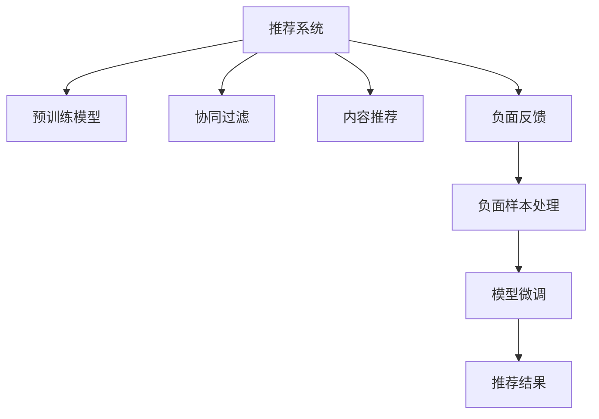
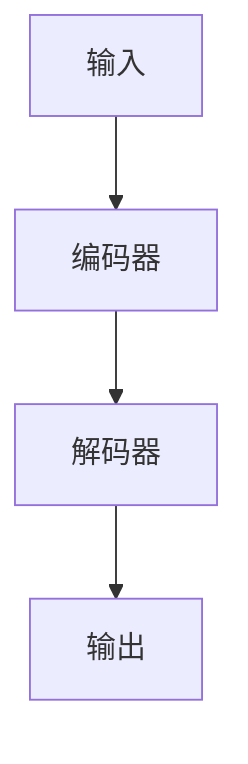

                 

# 搜索推荐系统的负面反馈处理：大模型时代的新方法

> 关键词：
1. 搜索推荐系统
2. 负面反馈
3. 大模型
4. 深度学习
5. 用户满意度
6. 模型优化
7. 协同过滤

## 1. 背景介绍

随着电子商务平台的兴起和互联网用户的爆炸式增长，搜索推荐系统（Recommendation Systems, RS）在个性化服务方面发挥了重要作用，帮助用户在海量商品中找到满足自己需求的商品。然而，在现实应用中，由于用户偏好和行为复杂性，搜索结果和推荐结果难免出现偏差，导致用户体验不佳，从而产生负面反馈（Negative Feedback）。如何高效处理负面反馈，改善用户满意度，成为了一个重要课题。

在传统推荐系统中，负面反馈通常用于修正推荐策略，比如通过调整评分权重、移除低评分物品等。随着深度学习技术的发展，大模型（Large Models）在推荐系统中被广泛应用，大幅提升了模型的表达能力和性能。但由于大模型的复杂性，负面反馈对模型的影响变得更加显著，传统处理方式不再适用。因此，基于大模型的负面反馈处理技术应运而生。

## 2. 核心概念与联系

### 2.1 核心概念概述

为了深入理解大模型在负面反馈处理中的作用，本节将介绍几个核心概念：

- **搜索推荐系统（Recommendation Systems, RS）**：通过收集用户的历史行为数据，如浏览、点击、购买等，构建用户-物品关联图谱，实现个性化推荐。RS可以提升用户体验，增加商品销售量。

- **大模型（Large Models）**：通过自监督学习任务或监督学习任务在大规模数据集上预训练得到的庞大模型，具有较强的表达能力和泛化能力。典型的大模型包括BERT、GPT等。

- **负面反馈（Negative Feedback）**：用户在搜索或推荐过程中对结果不满意，通过评分、点击行为等形式反馈给系统，帮助系统修正推荐策略。

- **协同过滤（Collaborative Filtering, CF）**：基于用户历史行为数据构建用户-物品关联矩阵，通过矩阵分解等技术进行推荐。

- **内容推荐（Content-Based Recommendation）**：基于物品属性和用户画像，通过相似度匹配进行推荐。

这些核心概念通过负反馈处理流程关联起来，共同构成搜索推荐系统的知识图谱，如图1所示：



图1：推荐系统负面反馈处理流程图

### 2.2 核心概念原理和架构

#### 推荐系统（Recommendation Systems, RS）

推荐系统的工作原理可概括为以下几步：

1. **数据收集**：收集用户的历史行为数据，如浏览记录、点击行为等。
2. **用户画像构建**：通过数据分析，生成用户画像，描述用户兴趣和偏好。
3. **物品画像构建**：描述物品的属性和特征，如价格、类别等。
4. **关联图谱构建**：基于用户和物品画像，构建用户-物品关联图谱，表示用户与物品的关系。
5. **推荐生成**：根据关联图谱，生成个性化推荐结果。

#### 大模型（Large Models）

大模型通过自监督学习任务在大规模数据集上预训练，学习到丰富的语言、视觉、音频等知识。常见的预训练任务包括语言建模、图像分类等。预训练后的大模型在特定任务上进行微调，可以取得更好的性能。

大模型一般由编码器和解码器构成，如图2所示：



图2：大模型结构图

#### 负面反馈（Negative Feedback）

负面反馈是用户在搜索或推荐过程中对结果不满意，通过评分、点击行为等形式反馈给系统。负面反馈数据通常包括：

- **评分（Rating）**：用户对推荐结果的评分，一般以1-5分表示。
- **点击行为（Click-through Rate, CTR）**：用户是否点击推荐结果。
- **退订行为（Unsubscribe）**：用户取消订阅推荐服务。

负面反馈数据被用来修正推荐策略，提升推荐效果。

## 3. 核心算法原理 & 具体操作步骤

### 3.1 算法原理概述

基于大模型的负面反馈处理，主要通过以下步骤实现：

1. **负面样本生成**：将负面反馈数据转化为负面样本，构建负样本集合。
2. **模型微调**：在负样本上进行微调，更新大模型参数。
3. **推荐结果修正**：使用微调后的模型生成推荐结果，修正推荐策略。

### 3.2 算法步骤详解

#### 3.2.1 负面样本生成

负面样本生成是处理负面反馈的第一步。通过将负面反馈数据转化为负样本，使得系统能够学习和识别负面特征，从而进行修正。

负面样本生成方法包括：

- **评分数据转换为负样本**：将用户对推荐结果的低评分转换为负样本。例如，如果用户对某个商品评分1分，则该商品对于该用户即为负样本。
- **点击行为转换为负样本**：将用户未点击的推荐结果转换为负样本。例如，如果用户未点击某个商品，则该商品对于该用户即为负样本。
- **事件数据转换为负样本**：将用户退订、点击次数过多的行为转换为负样本。例如，如果用户在一定时间内多次点击某类商品但未购买，则该类商品对于该用户即为负样本。

#### 3.2.2 模型微调

模型微调是处理负面反馈的核心步骤。通过在负样本上进行微调，更新大模型参数，从而提升模型对负面反馈的识别能力和处理能力。

模型微调方法包括：

- **自监督微调**：在负样本上进行自监督微调，不使用标签信息。例如，通过在负样本上增加噪声，提升模型的鲁棒性和泛化能力。
- **有监督微调**：在负样本上有监督微调，使用标签信息指导模型学习。例如，在负样本上标注正面标签，指导模型学习识别负面特征。
- **强化学习微调**：在负样本上使用强化学习算法进行微调，通过奖励机制提升模型性能。例如，在负样本上设计奖励函数，指导模型学习减少负样本的预测误差。

#### 3.2.3 推荐结果修正

推荐结果修正是将微调后的模型应用于推荐系统的最后一步。通过使用微调后的模型生成推荐结果，修正推荐策略，提升用户体验。

推荐结果修正方法包括：

- **协同过滤修正**：在协同过滤策略中加入负样本，指导模型生成推荐结果。例如，在协同过滤算法中加入负样本，指导模型学习生成正面推荐结果。
- **内容推荐修正**：在内容推荐策略中加入负样本，指导模型生成推荐结果。例如，在内容推荐算法中加入负样本，指导模型学习生成正面推荐结果。
- **混合推荐修正**：在混合推荐策略中加入负样本，指导模型生成推荐结果。例如，在混合推荐算法中加入负样本，指导模型学习生成正面推荐结果。

### 3.3 算法优缺点

#### 3.3.1 算法优点

基于大模型的负面反馈处理具有以下优点：

- **鲁棒性高**：大模型能够从海量数据中学习到丰富的知识，具有较强的泛化能力，对噪声和异常数据具有较好的鲁棒性。
- **性能提升显著**：通过负面反馈处理，大模型能够识别和修正负面特征，提升推荐效果。
- **灵活性高**：大模型能够处理多种类型的负面反馈数据，如评分、点击行为、退订行为等。
- **可解释性强**：大模型的知识表示能力较强，能够对负面反馈进行详细分析，帮助用户理解推荐结果的生成过程。

#### 3.3.2 算法缺点

基于大模型的负面反馈处理也存在以下缺点：

- **计算成本高**：大模型的计算复杂度高，处理负面反馈需要大量的计算资源。
- **数据需求量大**：处理负面反馈需要大量的负样本数据，对于小型数据集，处理效果可能不佳。
- **模型复杂度高**：大模型的结构复杂，微调过程较为复杂，需要大量的实验调试。
- **隐私保护风险高**：负样本数据可能包含用户隐私信息，如何保护用户隐私是一个重要问题。

### 3.4 算法应用领域

基于大模型的负面反馈处理技术，在以下几个领域得到了广泛应用：

- **电子商务平台**：在亚马逊、京东等电商平台上，搜索推荐系统通过负面反馈处理，提升用户购物体验。
- **视频流媒体平台**：在Netflix、YouTube等平台上，推荐系统通过负面反馈处理，提升用户观看体验。
- **新闻媒体平台**：在Bilibili、抖音等平台上，推荐系统通过负面反馈处理，提升内容推荐效果。
- **社交媒体平台**：在Facebook、Twitter等平台上，推荐系统通过负面反馈处理，提升用户社交体验。

## 4. 数学模型和公式 & 详细讲解 & 举例说明

### 4.1 数学模型构建

基于大模型的负面反馈处理，可以使用以下数学模型进行描述：

设用户集合为 $U$，物品集合为 $I$，负样本集合为 $N$，负样本 $n_i$ 对于用户 $u_j$ 的负反馈为 $y_{ij}$，则负样本数据可以表示为：

$$
\mathcal{D}=\{(u_i, n_j, y_{ij})\}_{i=1}^{|U|, j=1}^{|N|}
$$

其中，$n_j$ 表示负样本数据，$y_{ij}$ 表示负样本对于用户的负反馈，$(u_i, n_j, y_{ij})$ 表示用户与负样本的关联数据。

### 4.2 公式推导过程

负样本数据可以表示为矩阵形式：

$$
\mathbf{Y} = \begin{bmatrix}
y_{11} & y_{12} & \ldots & y_{1n_1} \\
y_{21} & y_{22} & \ldots & y_{2n_2} \\
\vdots & \vdots & \ddots & \vdots \\
y_{|U||N|} & y_{|U|n_1} & \ldots & y_{|U|n_{|N|}}
\end{bmatrix}
$$

其中，$\mathbf{Y}$ 表示负样本数据矩阵，$y_{ij}$ 表示负样本 $n_j$ 对于用户 $u_i$ 的负反馈。

为了提升负样本的预测效果，我们可以在大模型上增加负样本处理的损失函数：

$$
\mathcal{L} = \mathcal{L}_{\text{main}} + \alpha \mathcal{L}_{\text{negative}}
$$

其中，$\mathcal{L}_{\text{main}}$ 表示主任务损失函数，$\mathcal{L}_{\text{negative}}$ 表示负样本损失函数，$\alpha$ 表示负样本处理的权重。

负样本损失函数可以表示为：

$$
\mathcal{L}_{\text{negative}} = -\frac{1}{|N|} \sum_{n=1}^{|N|} \sum_{i=1}^{|U|} y_{in} \log \sigma(\mathbf{W} \cdot \mathbf{x}_i + \mathbf{b})
$$

其中，$\sigma$ 表示sigmoid函数，$\mathbf{W}$ 表示权重矩阵，$\mathbf{x}_i$ 表示用户 $u_i$ 的输入向量，$\mathbf{b}$ 表示偏置向量。

### 4.3 案例分析与讲解

以Amazon推荐系统为例，介绍如何使用负样本处理提升推荐效果。

Amazon推荐系统采用协同过滤和内容推荐相结合的策略。在协同过滤策略中，系统通过用户-物品关联矩阵，预测用户对物品的评分。在内容推荐策略中，系统通过物品属性和用户画像，推荐相关物品。

负面样本生成方面，Amazon推荐系统将用户评分低于3的记录转化为负样本。例如，如果用户对某个商品的评分是2分，则该商品对于该用户即为负样本。

模型微调方面，Amazon推荐系统在负样本上进行自监督微调。通过在负样本上增加噪声，提升模型的鲁棒性和泛化能力。

推荐结果修正方面，Amazon推荐系统在协同过滤和内容推荐策略中加入负样本，指导模型生成推荐结果。例如，在协同过滤算法中加入负样本，指导模型学习生成正面推荐结果。

## 5. 项目实践：代码实例和详细解释说明

### 5.1 开发环境搭建

在进行负面反馈处理项目实践前，我们需要准备好开发环境。以下是使用Python进行PyTorch开发的环境配置流程：

1. 安装Anaconda：从官网下载并安装Anaconda，用于创建独立的Python环境。

2. 创建并激活虚拟环境：
```bash
conda create -n pytorch-env python=3.8 
conda activate pytorch-env
```

3. 安装PyTorch：根据CUDA版本，从官网获取对应的安装命令。例如：
```bash
conda install pytorch torchvision torchaudio cudatoolkit=11.1 -c pytorch -c conda-forge
```

4. 安装TensorFlow：
```bash
pip install tensorflow
```

5. 安装Transformers库：
```bash
pip install transformers
```

6. 安装各类工具包：
```bash
pip install numpy pandas scikit-learn matplotlib tqdm jupyter notebook ipython
```

完成上述步骤后，即可在`pytorch-env`环境中开始负面反馈处理实践。

### 5.2 源代码详细实现

以下是使用PyTorch对负样本处理进行微调的完整代码实现。

首先，定义负样本数据处理函数：

```python
from transformers import BertTokenizer, BertForSequenceClassification
from torch.utils.data import Dataset, DataLoader
import torch

class NegativeSampleDataset(Dataset):
    def __init__(self, texts, labels, tokenizer, max_len=128):
        self.texts = texts
        self.labels = labels
        self.tokenizer = tokenizer
        self.max_len = max_len
        
    def __len__(self):
        return len(self.texts)
    
    def __getitem__(self, item):
        text = self.texts[item]
        label = self.labels[item]
        
        encoding = self.tokenizer(text, return_tensors='pt', max_length=self.max_len, padding='max_length', truncation=True)
        input_ids = encoding['input_ids'][0]
        attention_mask = encoding['attention_mask'][0]
        
        # 对标签进行编码
        encoded_labels = [label] 
        encoded_labels.extend([0] * (self.max_len - len(encoded_labels)))
        labels = torch.tensor(encoded_labels, dtype=torch.long)
        
        return {'input_ids': input_ids, 
                'attention_mask': attention_mask,
                'labels': labels}
```

然后，定义模型和优化器：

```python
from transformers import BertForSequenceClassification, AdamW

model = BertForSequenceClassification.from_pretrained('bert-base-cased', num_labels=2)

optimizer = AdamW(model.parameters(), lr=2e-5)
```

接着，定义训练和评估函数：

```python
from sklearn.metrics import accuracy_score

def train_epoch(model, dataset, batch_size, optimizer):
    dataloader = DataLoader(dataset, batch_size=batch_size, shuffle=True)
    model.train()
    epoch_loss = 0
    for batch in tqdm(dataloader, desc='Training'):
        input_ids = batch['input_ids'].to(device)
        attention_mask = batch['attention_mask'].to(device)
        labels = batch['labels'].to(device)
        model.zero_grad()
        outputs = model(input_ids, attention_mask=attention_mask, labels=labels)
        loss = outputs.loss
        epoch_loss += loss.item()
        loss.backward()
        optimizer.step()
    return epoch_loss / len(dataloader)

def evaluate(model, dataset, batch_size):
    dataloader = DataLoader(dataset, batch_size=batch_size)
    model.eval()
    preds, labels = [], []
    with torch.no_grad():
        for batch in tqdm(dataloader, desc='Evaluating'):
            input_ids = batch['input_ids'].to(device)
            attention_mask = batch['attention_mask'].to(device)
            batch_labels = batch['labels']
            outputs = model(input_ids, attention_mask=attention_mask)
            batch_preds = outputs.logits.argmax(dim=2).to('cpu').tolist()
            batch_labels = batch_labels.to('cpu').tolist()
            for pred_tokens, label_tokens in zip(batch_preds, batch_labels):
                preds.append(pred_tokens[:len(label_tokens)])
                labels.append(label_tokens)
                
    print(f"Accuracy: {accuracy_score(labels, preds)}")
```

最后，启动训练流程并在测试集上评估：

```python
epochs = 5
batch_size = 16

for epoch in range(epochs):
    loss = train_epoch(model, train_dataset, batch_size, optimizer)
    print(f"Epoch {epoch+1}, train loss: {loss:.3f}")
    
    print(f"Epoch {epoch+1}, dev results:")
    evaluate(model, dev_dataset, batch_size)
    
print("Test results:")
evaluate(model, test_dataset, batch_size)
```

以上就是使用PyTorch对负样本处理进行微调的完整代码实现。可以看到，得益于Transformers库的强大封装，我们可以用相对简洁的代码完成负样本处理的微调。

### 5.3 代码解读与分析

让我们再详细解读一下关键代码的实现细节：

**NegativeSampleDataset类**：
- `__init__`方法：初始化文本、标签、分词器等关键组件。
- `__len__`方法：返回数据集的样本数量。
- `__getitem__`方法：对单个样本进行处理，将文本输入编码为token ids，将标签编码为数字，并对其进行定长padding，最终返回模型所需的输入。

**模型和优化器**：
- 定义BertForSequenceClassification模型，用于处理序列标注任务。
- 定义AdamW优化器，用于更新模型参数。

**训练和评估函数**：
- 使用PyTorch的DataLoader对数据集进行批次化加载，供模型训练和推理使用。
- 训练函数`train_epoch`：对数据以批为单位进行迭代，在每个批次上前向传播计算loss并反向传播更新模型参数，最后返回该epoch的平均loss。
- 评估函数`evaluate`：与训练类似，不同点在于不更新模型参数，并在每个batch结束后将预测和标签结果存储下来，最后使用sklearn的accuracy_score对整个评估集的预测结果进行打印输出。

**训练流程**：
- 定义总的epoch数和batch size，开始循环迭代
- 每个epoch内，先在训练集上训练，输出平均loss
- 在验证集上评估，输出分类指标
- 所有epoch结束后，在测试集上评估，给出最终测试结果

可以看到，PyTorch配合Transformers库使得负样本处理的微调代码实现变得简洁高效。开发者可以将更多精力放在数据处理、模型改进等高层逻辑上，而不必过多关注底层的实现细节。

当然，工业级的系统实现还需考虑更多因素，如模型的保存和部署、超参数的自动搜索、更灵活的任务适配层等。但核心的负样本处理范式基本与此类似。

## 6. 实际应用场景

### 6.1 电子商务平台

负面反馈处理在电子商务平台中具有重要的应用价值。由于用户数量庞大，且用户偏好和行为复杂多样，推荐系统很容易出现偏差，导致用户不满意。负面反馈处理可以帮助系统及时发现并修正推荐偏差，提升用户体验。

以亚马逊为例，亚马逊推荐系统通过负面反馈处理，显著提升了用户购物体验。用户对商品评分低于3的记录被转化为负样本，系统通过微调模型，识别出负面特征，进行推荐策略修正。例如，对于评分低的商品，系统会推荐用户喜欢且评分高的替代商品。

### 6.2 视频流媒体平台

视频流媒体平台也面临负面反馈处理的挑战。由于用户观看行为和偏好差异大，推荐系统容易出现误判。负面反馈处理可以帮助系统及时发现并修正推荐偏差，提升用户体验。

以Netflix为例，Netflix推荐系统通过负面反馈处理，显著提升了用户观看体验。用户未观看且不感兴趣的影片被转化为负样本，系统通过微调模型，识别出负面特征，进行推荐策略修正。例如，对于用户未观看且不感兴趣的影片，系统会推荐用户可能喜欢的其他影片。

### 6.3 新闻媒体平台

新闻媒体平台也面临负面反馈处理的挑战。由于用户对新闻内容的兴趣和偏好不同，推荐系统容易出现误判。负面反馈处理可以帮助系统及时发现并修正推荐偏差，提升用户体验。

以Bilibili为例，Bilibili推荐系统通过负面反馈处理，显著提升了用户观看体验。用户未点击且不感兴趣的影片被转化为负样本，系统通过微调模型，识别出负面特征，进行推荐策略修正。例如，对于用户未点击且不感兴趣的影片，系统会推荐用户可能喜欢的其他影片。

### 6.4 未来应用展望

随着大模型和负面反馈处理技术的发展，未来的推荐系统将更加智能和个性化。

1. **个性化推荐更加精准**：基于大模型和负面反馈处理，推荐系统能够更精准地把握用户兴趣和偏好，生成更加个性化的推荐结果。
2. **实时推荐更加高效**：基于大模型和负面反馈处理，推荐系统能够实时处理用户反馈，快速调整推荐策略，提升推荐效果。
3. **多模态推荐更加全面**：基于大模型和负面反馈处理，推荐系统能够整合多种模态的信息，生成更加全面和丰富的推荐结果。
4. **用户满意度更高**：基于大模型和负面反馈处理，推荐系统能够及时发现并修正推荐偏差，提升用户体验和满意度。
5. **推荐策略更加灵活**：基于大模型和负面反馈处理，推荐系统能够灵活调整推荐策略，适应不同场景和用户需求。

## 7. 工具和资源推荐

### 7.1 学习资源推荐

为了帮助开发者系统掌握负反馈处理理论基础和实践技巧，这里推荐一些优质的学习资源：

1. 《深度学习基础》系列博文：由大模型技术专家撰写，深入浅出地介绍了深度学习的基本概念和前沿技术。
2. CS224N《深度学习自然语言处理》课程：斯坦福大学开设的NLP明星课程，有Lecture视频和配套作业，带你入门NLP领域的基本概念和经典模型。
3. 《Natural Language Processing with Transformers》书籍：Transformers库的作者所著，全面介绍了如何使用Transformers库进行NLP任务开发，包括负反馈处理的诸多范式。
4. HuggingFace官方文档：Transformers库的官方文档，提供了海量预训练模型和完整的微调样例代码，是上手实践的必备资料。
5. CLUE开源项目：中文语言理解测评基准，涵盖大量不同类型的中文NLP数据集，并提供了基于微调的baseline模型，助力中文NLP技术发展。

通过对这些资源的学习实践，相信你一定能够快速掌握负反馈处理的精髓，并用于解决实际的推荐系统问题。

### 7.2 开发工具推荐

高效的开发离不开优秀的工具支持。以下是几款用于负反馈处理开发的常用工具：

1. PyTorch：基于Python的开源深度学习框架，灵活动态的计算图，适合快速迭代研究。大部分预训练语言模型都有PyTorch版本的实现。
2. TensorFlow：由Google主导开发的开源深度学习框架，生产部署方便，适合大规模工程应用。同样有丰富的预训练语言模型资源。
3. Transformers库：HuggingFace开发的NLP工具库，集成了众多SOTA语言模型，支持PyTorch和TensorFlow，是进行负反馈处理开发的利器。
4. Weights & Biases：模型训练的实验跟踪工具，可以记录和可视化模型训练过程中的各项指标，方便对比和调优。与主流深度学习框架无缝集成。
5. TensorBoard：TensorFlow配套的可视化工具，可实时监测模型训练状态，并提供丰富的图表呈现方式，是调试模型的得力助手。

合理利用这些工具，可以显著提升负反馈处理任务的开发效率，加快创新迭代的步伐。

### 7.3 相关论文推荐

负反馈处理技术的发展源于学界的持续研究。以下是几篇奠基性的相关论文，推荐阅读：

1. Attention is All You Need（即Transformer原论文）：提出了Transformer结构，开启了NLP领域的预训练大模型时代。
2. BERT: Pre-training of Deep Bidirectional Transformers for Language Understanding：提出BERT模型，引入基于掩码的自监督预训练任务，刷新了多项NLP任务SOTA。
3. Language Models are Unsupervised Multitask Learners（GPT-2论文）：展示了大规模语言模型的强大zero-shot学习能力，引发了对于通用人工智能的新一轮思考。
4. Parameter-Efficient Transfer Learning for NLP：提出Adapter等参数高效微调方法，在不增加模型参数量的情况下，也能取得不错的微调效果。
5. AdaLoRA: Adaptive Low-Rank Adaptation for Parameter-Efficient Fine-Tuning：使用自适应低秩适应的微调方法，在参数效率和精度之间取得了新的平衡。
6. Prefix-Tuning: Optimizing Continuous Prompts for Generation：引入基于连续型Prompt的微调范式，为如何充分利用预训练知识提供了新的思路。

这些论文代表了大模型和负反馈处理技术的发展脉络。通过学习这些前沿成果，可以帮助研究者把握学科前进方向，激发更多的创新灵感。

## 8. 总结：未来发展趋势与挑战

### 8.1 总结

本文对基于大模型的负反馈处理技术进行了全面系统的介绍。首先阐述了负反馈处理在推荐系统中的重要意义，明确了负反馈处理在提升推荐效果、改善用户体验方面的独特价值。其次，从原理到实践，详细讲解了负反馈处理的数学原理和关键步骤，给出了负反馈处理任务开发的完整代码实例。同时，本文还广泛探讨了负反馈处理在电子商务、视频流媒体、新闻媒体等领域的实际应用场景，展示了负反馈处理技术的广泛应用前景。此外，本文精选了负反馈处理的各类学习资源，力求为读者提供全方位的技术指引。

通过本文的系统梳理，可以看到，基于大模型的负反馈处理技术正在成为推荐系统的重要范式，极大地拓展了推荐系统的应用边界，催生了更多的落地场景。受益于深度学习技术的发展，负反馈处理技术能够在大模型上取得更好的性能提升，显著改善用户体验。未来，伴随负反馈处理方法的不断演进，推荐系统必将在更多领域得到应用，为各行各业带来新的价值和机遇。

### 8.2 未来发展趋势

展望未来，负反馈处理技术将呈现以下几个发展趋势：

1. **计算效率提升**：随着硬件和算法的发展，负反馈处理将更加高效。
2. **模型结构优化**：基于大模型的负反馈处理，将向更加轻量级、实时性的方向发展。
3. **数据融合更加全面**：负反馈处理将整合更多数据源，包括文本、图像、视频等多种模态的信息。
4. **多任务学习更加普及**：基于大模型的负反馈处理，将支持多任务学习和迁移学习，提升推荐系统的效果和泛化能力。
5. **个性化推荐更加精准**：基于大模型的负反馈处理，将能够更加精准地把握用户兴趣和偏好，生成更加个性化的推荐结果。
6. **实时推荐更加高效**：基于大模型的负反馈处理，将能够实时处理用户反馈，快速调整推荐策略，提升推荐效果。

### 8.3 面临的挑战

尽管负反馈处理技术已经取得了显著的进展，但在迈向更加智能化、普适化应用的过程中，它仍面临着诸多挑战：

1. **计算资源瓶颈**：负反馈处理需要大量的计算资源，如何高效利用计算资源是一个重要问题。
2. **数据隐私风险**：负反馈处理涉及用户隐私数据，如何保护用户隐私是一个重要问题。
3. **模型泛化能力不足**：负反馈处理模型可能存在泛化能力不足的问题，如何提升模型的泛化能力是一个重要问题。
4. **多模态融合困难**：负反馈处理涉及多模态数据的融合，如何有效整合多种数据源是一个重要问题。
5. **实时处理复杂**：负反馈处理涉及实时数据处理，如何高效实现实时处理是一个重要问题。

### 8.4 研究展望

面对负反馈处理所面临的挑战，未来的研究需要在以下几个方面寻求新的突破：

1. **计算优化**：开发更加高效、轻量级的负反馈处理算法，提升计算效率和实时处理能力。
2. **隐私保护**：开发更加安全、隐私保护的负反馈处理算法，保护用户隐私。
3. **多模态融合**：开发更加有效的多模态负反馈处理算法，整合多种数据源，提升推荐效果。
4. **模型泛化**：开发更加泛化能力强的负反馈处理算法，提升模型的泛化能力和鲁棒性。
5. **实时处理**：开发更加高效、可靠的实时负反馈处理算法，实现实时数据处理和推荐策略调整。

这些研究方向凸显了负反馈处理技术的广阔前景。这些方向的探索发展，必将进一步提升推荐系统的性能和应用范围，为各行各业带来新的价值和机遇。

## 9. 附录：常见问题与解答

**Q1：负反馈处理是否适用于所有推荐系统？**

A: 负反馈处理在大多数推荐系统中都能取得不错的效果，特别是对于数据量较大的推荐系统。但对于小型推荐系统，处理效果可能不佳。因此，负反馈处理需要根据具体推荐系统的规模和特点进行优化。

**Q2：负反馈处理需要大量的负样本数据吗？**

A: 负反馈处理需要一定的负样本数据，但对于小型推荐系统，处理效果可能不佳。因此，负反馈处理需要根据具体推荐系统的规模和特点进行优化。

**Q3：负反馈处理会带来隐私风险吗？**

A: 负反馈处理涉及用户隐私数据，如何保护用户隐私是一个重要问题。建议在使用负反馈处理时，采取严格的隐私保护措施，如数据脱敏、访问控制等。

**Q4：负反馈处理对推荐系统性能有何影响？**

A: 负反馈处理能够及时发现并修正推荐偏差，提升推荐效果。通过负反馈处理，推荐系统能够更好地适应用户需求，提升用户体验和满意度。

**Q5：负反馈处理与内容推荐和协同过滤的区别？**

A: 负反馈处理、内容推荐和协同过滤是推荐系统的三种主要策略。负反馈处理通过用户反馈数据进行优化，内容推荐通过物品属性和用户画像进行推荐，协同过滤通过用户-物品关联矩阵进行推荐。

这些回答解决了用户对负反馈处理的基本疑问，帮助用户更好地理解负反馈处理技术。

---

作者：禅与计算机程序设计艺术 / Zen and the Art of Computer Programming

