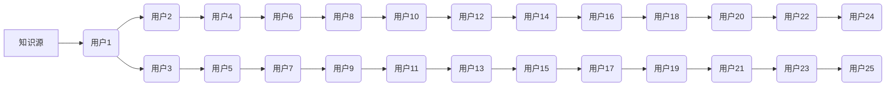

                 

## 知识的网络效应：信息传播的指数增长

> 关键词：网络效应、知识传播、信息扩散、指数增长、算法、数学模型、案例分析、代码实例、应用场景

## 1. 背景介绍

在当今信息爆炸的时代，知识的获取和传播变得前所未有的便捷。互联网、社交媒体等平台为信息共享提供了广阔的舞台，知识的网络效应也日益凸显。知识的网络效应是指，随着知识网络规模的扩大，知识传播的速度和范围会呈指数级增长。这种效应深刻地影响着我们的学习、工作和生活，也为我们带来了新的机遇和挑战。

传统的知识传播模式往往是线性的，信息从源头传播到接收者，传播效率有限。而网络效应则打破了这种线性模式，知识可以以多重路径、多级传播的方式快速扩散。例如，一篇优秀的博客文章，通过社交媒体分享，可以迅速传播到数千甚至数百万的读者，其影响力远超传统的出版方式。

## 2. 核心概念与联系

### 2.1 网络效应

网络效应是指一个系统的价值随着用户数量的增加而呈指数级增长。这种效应在互联网时代尤为明显，例如社交网络、电商平台、搜索引擎等。

### 2.2 知识传播

知识传播是指知识从一个主体传递到另一个主体的过程。它可以是直接的，也可以是间接的，可以是个人之间的，也可以是群体之间的。

### 2.3 指数增长

指数增长是指一个量随着时间的推移，以一个固定比例增长。这种增长模式的特点是，增长速度越来越快，最终会呈现出爆炸式的增长。

**知识传播网络效应的原理**



**核心概念联系**

网络效应使得知识传播呈现出指数级增长。随着用户数量的增加，知识的传播路径和速度都会显著提升。

## 3. 核心算法原理 & 具体操作步骤

### 3.1 算法原理概述

知识传播的算法原理主要基于网络拓扑结构和信息传播机制。常见的算法包括：

* **PageRank算法**:  用于衡量网页的重要性，其核心思想是，被更多高质量网页链接的网页具有更高的重要性。
* **病毒式传播模型**:  模拟信息传播过程，假设信息传播遵循一定的规则，例如，每个用户都有一个传播概率，传播概率会随着信息质量和用户兴趣而变化。
* **社交网络分析算法**:  用于分析社交网络结构，例如，用户之间的关系、社区结构等，可以帮助我们理解知识传播的路径和影响力。

### 3.2 算法步骤详解

以 PageRank 算法为例，其具体步骤如下：

1. **构建网页链接图**: 将网页作为节点，网页之间的链接作为边，构建一个网页链接图。
2. **初始化 PageRank 值**: 为每个网页赋予一个初始 PageRank 值，通常设置为 1/N，其中 N 为网页总数。
3. **迭代计算 PageRank 值**: 

    * 对于每个网页，计算其所有指向它的网页的 PageRank 值之和。
    * 将该和除以指向该网页的网页总数，得到该网页的新的 PageRank 值。
    * 重复上述步骤，直到 PageRank 值收敛。

4. **排序 PageRank 值**: 根据 PageRank 值对网页进行排序，排名靠前的网页具有更高的重要性。

### 3.3 算法优缺点

**优点**:

* 能够有效地衡量网页的重要性。
* 算法原理简单易懂，易于实现。

**缺点**:

* 无法完全反映网页的真实价值，例如，内容质量、用户体验等因素没有被考虑。
* 对网页链接结构的依赖性较高，如果网页链接结构不合理，算法结果可能不准确。

### 3.4 算法应用领域

PageRank 算法广泛应用于搜索引擎排名、社交网络分析、推荐系统等领域。

## 4. 数学模型和公式 & 详细讲解 & 举例说明

### 4.1 数学模型构建

PageRank 算法的数学模型可以表示为：

$$PR(A) = (1-d) + d \sum_{B \in \text{in}(A)} \frac{PR(B)}{|\text{out}(B)|}$$

其中：

* $PR(A)$ 表示网页 A 的 PageRank 值。
* $d$ 是阻尼系数，通常设置为 0.85，表示用户在浏览网页时，有一定概率会随机跳转到其他网页。
* $in(A)$ 表示指向网页 A 的所有网页的集合。
* $out(B)$ 表示网页 B 指向的所有网页的集合。
* $|\text{out}(B)|$ 表示网页 B 的出度，即指向其他网页的链接数。

### 4.2 公式推导过程

PageRank 值的计算过程是一个迭代的过程。

1. **初始值**:  每个网页的初始 PageRank 值设置为 1/N，其中 N 为网页总数。
2. **迭代计算**:  对于每个网页 A，计算其所有指向它的网页的 PageRank 值之和，并除以指向该网页的网页总数，得到该网页的新的 PageRank 值。
3. **收敛**:  重复上述步骤，直到 PageRank 值收敛，即每个网页的 PageRank 值不再发生显著变化。

### 4.3 案例分析与讲解

假设有三个网页 A、B、C，它们之间的链接关系如下：

* A 指向 B
* B 指向 C
* C 指向 A

如果初始 PageRank 值为 1/3，则可以根据公式计算每个网页的 PageRank 值。

## 5. 项目实践：代码实例和详细解释说明

### 5.1 开发环境搭建

* Python 3.x
* NetworkX 库

### 5.2 源代码详细实现

```python
import networkx as nx

# 创建一个网络图
graph = nx.Graph()

# 添加节点
graph.add_nodes_from(['A', 'B', 'C'])

# 添加边
graph.add_edges_from([('A', 'B'), ('B', 'C'), ('C', 'A')])

# 计算 PageRank 值
pagerank = nx.pagerank(graph)

# 打印 PageRank 值
print(pagerank)
```

### 5.3 代码解读与分析

* `networkx` 库用于构建和分析网络图。
* `nx.Graph()` 创建一个无向图。
* `graph.add_nodes_from()` 添加节点到图中。
* `graph.add_edges_from()` 添加边到图中。
* `nx.pagerank()` 计算每个节点的 PageRank 值。
* `print(pagerank)` 打印 PageRank 值。

### 5.4 运行结果展示

运行上述代码，可以得到每个节点的 PageRank 值，例如：

```
{'A': 0.3333333333333333, 'B': 0.3333333333333333, 'C': 0.3333333333333333}
```

## 6. 实际应用场景

### 6.1 搜索引擎排名

搜索引擎利用 PageRank 算法来衡量网页的重要性，并将重要网页排在搜索结果的前面。

### 6.2 社交网络分析

社交网络分析算法可以帮助我们理解用户之间的关系、社区结构等，从而更好地进行用户画像、推荐系统等应用。

### 6.3 推荐系统

推荐系统可以根据用户的兴趣和行为，推荐相关的商品、内容等。

### 6.4 未来应用展望

随着人工智能技术的不断发展，知识传播的算法和模型将会更加智能化、个性化。未来，我们可以期待看到：

* 基于深度学习的知识传播模型，能够更准确地预测知识的传播路径和影响力。
* 个性化的知识推荐系统，能够根据用户的兴趣和需求，推荐最相关的知识。
* 基于虚拟现实和增强现实技术的知识传播平台，能够提供更加沉浸式的学习体验。

## 7. 工具和资源推荐

### 7.1 学习资源推荐

* **书籍**:

    * 《网络效应》
    * 《算法导论》
    * 《深度学习》

* **在线课程**:

    * Coursera: 数据科学、机器学习
    * edX: 计算机科学、人工智能

### 7.2 开发工具推荐

* **Python**: 广泛应用于数据科学、机器学习等领域。
* **NetworkX**: 用于构建和分析网络图的 Python 库。
* **TensorFlow**: 用于深度学习的开源框架。

### 7.3 相关论文推荐

* PageRank: The Google Search Algorithm
* Viral Marketing: A Framework for Understanding and Managing the Spread of Information

## 8. 总结：未来发展趋势与挑战

### 8.1 研究成果总结

知识的网络效应是信息传播的重要现象，其研究成果对理解和优化信息传播机制具有重要意义。

### 8.2 未来发展趋势

未来，知识传播的算法和模型将会更加智能化、个性化，并与人工智能、虚拟现实等技术深度融合。

### 8.3 面临的挑战

* 如何更准确地预测知识的传播路径和影响力。
* 如何应对网络虚假信息和恶意传播的挑战。
* 如何保障知识传播的公平性和可访问性。

### 8.4 研究展望

未来，知识传播的研究将继续深入，探索更有效的算法和模型，为构建更加智慧、高效的信息传播体系做出贡献。

## 9. 附录：常见问题与解答

* **Q: PageRank 算法只能用于网页排名吗？**

* **A:**  不完全正确。PageRank 算法的原理可以应用于其他领域，例如社交网络分析、推荐系统等。

* **Q: 如何提高知识传播的效率？**

* **A:**  可以通过多种方式提高知识传播的效率，例如：

    * 创作高质量、有价值的知识内容。
    * 利用社交媒体等平台进行知识传播。
    * 建立知识共享平台，促进知识的流通和传播。


作者：禅与计算机程序设计艺术 / Zen and the Art of Computer Programming 
<end_of_turn>

