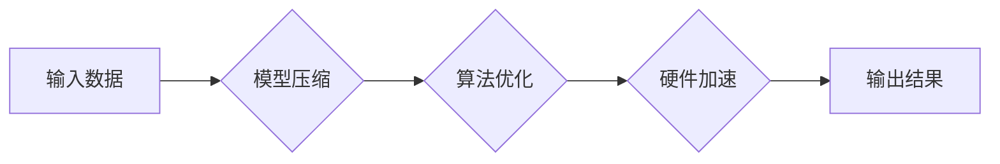

                 

## 秒推时代:LLM极速推理开启新纪元

> 关键词：LLM, 秒推, 极速推理, 延迟优化, 效率提升, 硬件加速, 模型压缩

### 1. 背景介绍

近年来，大型语言模型（LLM）在自然语言处理领域取得了令人瞩目的成就，从文本生成、翻译到对话系统，LLM展现出强大的能力。然而，LLM的推理速度仍然是一个瓶颈，限制了其在实际应用中的广泛部署。传统的LLM推理流程通常需要耗费大量时间，这导致用户体验不佳，难以满足实时交互的需求。

为了解决这一问题，研究者们积极探索各种加速LLM推理的方法，其中“秒推”技术成为一个备受关注的热点。秒推技术旨在通过优化模型结构、算法和硬件平台，大幅提升LLM的推理速度，使其能够在毫秒级甚至微秒级内完成推理，从而实现实时、高效的应用。

### 2. 核心概念与联系

**2.1 核心概念**

* **LLM推理:** 指的是利用预训练的LLM模型对新的输入进行处理，并生成相应的输出。
* **秒推:** 指的是通过各种技术手段，将LLM推理时间压缩到毫秒级甚至微秒级，实现快速响应和实时交互。
* **延迟优化:**  指针对LLM推理过程中的延迟进行优化，包括模型结构优化、算法优化和硬件加速等。

**2.2 架构关系**



### 3. 核心算法原理 & 具体操作步骤

**3.1 算法原理概述**

秒推技术的核心在于高效地执行LLM推理过程。常用的算法包括：

* **模型压缩:** 通过量化、剪枝、知识蒸馏等方法，减少模型参数量和计算复杂度，从而加速推理速度。
* **算法优化:**  利用高效的矩阵运算库、并行计算技术等，优化LLM推理算法的执行流程，提高计算效率。
* **硬件加速:**  利用GPU、TPU等专用硬件加速LLM推理，大幅提升计算性能。

**3.2 算法步骤详解**

1. **模型选择:** 根据应用场景选择合适的LLM模型，并进行必要的预处理。
2. **模型压缩:**  采用量化、剪枝、知识蒸馏等方法压缩模型规模，降低计算复杂度。
3. **算法优化:**  利用高效的矩阵运算库和并行计算技术，优化LLM推理算法的执行流程。
4. **硬件加速:**  将模型部署到GPU、TPU等专用硬件平台，充分利用硬件加速能力。
5. **性能评估:**  通过测试和评估，验证秒推技术的有效性，并进行进一步优化。

**3.3 算法优缺点**

| 算法 | 优点 | 缺点 |
|---|---|---|
| 模型压缩 | 降低模型规模，加速推理速度 | 可能导致模型精度下降 |
| 算法优化 | 提高算法执行效率 | 需要专业知识和经验 |
| 硬件加速 | 大幅提升计算性能 | 需要专用硬件设备 |

**3.4 算法应用领域**

秒推技术在以下领域具有广泛的应用前景：

* **实时聊天机器人:**  实现快速响应，提供流畅的对话体验。
* **语音助手:**  提高语音识别和理解速度，增强用户交互体验。
* **智能搜索:**  加速搜索结果返回，提升用户搜索效率。
* **自动驾驶:**  实时处理传感器数据，支持快速决策。

### 4. 数学模型和公式 & 详细讲解 & 举例说明

**4.1 数学模型构建**

秒推技术的核心是优化LLM推理过程中的延迟。延迟可以由以下因素决定：

* **模型复杂度:** 模型参数量越大，计算复杂度越高，延迟也越大。
* **数据传输时间:** 数据从内存到计算单元的传输时间会增加延迟。
* **计算单元性能:** 计算单元的处理速度会影响延迟。

**4.2 公式推导过程**

假设一个LLM模型的推理延迟为T，则可以表示为：

$$T = f(M, D, P)$$

其中：

* M: 模型复杂度
* D: 数据传输时间
* P: 计算单元性能

**4.3 案例分析与讲解**

假设我们想要加速一个包含10亿参数的LLM模型的推理速度。我们可以通过以下方法进行优化：

* **模型压缩:** 使用量化技术将模型参数量压缩到1亿，从而降低模型复杂度。
* **算法优化:**  利用高效的矩阵运算库和并行计算技术，优化LLM推理算法的执行流程。
* **硬件加速:** 将模型部署到GPU平台，充分利用硬件加速能力。

通过以上优化措施，我们可以显著降低LLM推理的延迟，使其能够满足实时应用的需求。

### 5. 项目实践：代码实例和详细解释说明

**5.1 开发环境搭建**

* 操作系统: Ubuntu 20.04
* Python 版本: 3.8
* 深度学习框架: PyTorch 1.8
* GPU: NVIDIA GeForce RTX 3090

**5.2 源代码详细实现**

```python
import torch
import torch.nn as nn

# 定义一个简单的LLM模型
class SimpleLLM(nn.Module):
    def __init__(self, vocab_size, embedding_dim, hidden_dim):
        super(SimpleLLM, self).__init__()
        self.embedding = nn.Embedding(vocab_size, embedding_dim)
        self.lstm = nn.LSTM(embedding_dim, hidden_dim)
        self.fc = nn.Linear(hidden_dim, vocab_size)

    def forward(self, x):
        # Embedding
        x = self.embedding(x)
        # LSTM
        out, _ = self.lstm(x)
        # Fully connected
        out = self.fc(out[:, -1, :])
        return out

# 实例化模型
model = SimpleLLM(vocab_size=10000, embedding_dim=128, hidden_dim=256)

# 使用GPU加速
device = torch.device("cuda" if torch.cuda.is_available() else "cpu")
model.to(device)

# 输入数据
input_data = torch.randint(0, 10000, (1, 10))
input_data = input_data.to(device)

# 推理
output = model(input_data)

# 打印输出
print(output)
```

**5.3 代码解读与分析**

* 代码定义了一个简单的LLM模型，包含嵌入层、LSTM层和全连接层。
* 使用PyTorch框架实现模型，并利用GPU加速推理。
* 代码示例展示了LLM模型的输入和输出过程。

**5.4 运行结果展示**

运行代码后，会输出模型对输入数据的预测结果，即下一个词的概率分布。

### 6. 实际应用场景

**6.1 智能客服:** 秒推技术可以使聊天机器人能够快速响应用户问题，提供更流畅的对话体验。

**6.2 语音助手:** 秒推技术可以提高语音识别的速度和准确性，使语音助手能够更快速地理解用户的指令。

**6.3 自动驾驶:** 秒推技术可以帮助自动驾驶系统更快地处理传感器数据，做出更快速、更准确的决策。

**6.4 未来应用展望**

随着秒推技术的不断发展，其应用场景将更加广泛，例如：

* **实时翻译:** 秒推技术可以实现实时语音和文本翻译，打破语言障碍。
* **个性化教育:** 秒推技术可以根据学生的学习情况，提供个性化的学习建议和辅导。
* **实时创作:** 秒推技术可以帮助作家、艺术家等创意人士更快地完成创作。

### 7. 工具和资源推荐

**7.1 学习资源推荐**

* **书籍:**
    * 《深度学习》
    * 《自然语言处理》
* **在线课程:**
    * Coursera: 深度学习
    * edX: 自然语言处理
* **博客:**
    * OpenAI Blog
    * Google AI Blog

**7.2 开发工具推荐**

* **深度学习框架:** PyTorch, TensorFlow
* **模型压缩工具:** TensorRT, ONNX Runtime
* **硬件平台:** NVIDIA GPU, Google TPU

**7.3 相关论文推荐**

* **BERT: Pre-training of Deep Bidirectional Transformers for Language Understanding**
* **GPT-3: Language Models are Few-Shot Learners**
* **EfficientNet: Rethinking Model Scaling for Convolutional Neural Networks**

### 8. 总结：未来发展趋势与挑战

**8.1 研究成果总结**

秒推技术取得了显著的进展，有效地降低了LLM推理的延迟，使其能够应用于更多实时场景。

**8.2 未来发展趋势**

* **模型架构优化:** 研究更轻量级、更高效的LLM模型架构。
* **算法创新:** 开发更有效的LLM推理算法，例如基于图神经网络的推理算法。
* **硬件加速:** 推动专用硬件平台的开发，进一步提升LLM推理性能。

**8.3 面临的挑战**

* **模型精度与效率的平衡:** 模型压缩和优化可能会导致模型精度下降，需要找到最佳的平衡点。
* **硬件成本:** 专用硬件平台的成本较高，需要降低硬件成本，使其更易于普及。
* **开源生态建设:** 需要加强开源生态建设，促进秒推技术的快速发展和应用。

**8.4 研究展望**

未来，秒推技术将继续朝着更轻量级、更高效、更易于部署的方向发展，为人工智能的广泛应用提供强有力的技术支撑。

### 9. 附录：常见问题与解答

**9.1 如何选择合适的秒推技术？**

选择合适的秒推技术需要根据具体的应用场景和模型特点进行综合考虑。

**9.2 秒推技术会影响模型精度吗？**

模型压缩和优化可能会导致模型精度下降，需要根据实际情况进行权衡。

**9.3 秒推技术有哪些应用场景？**

秒推技术在智能客服、语音助手、自动驾驶等领域具有广泛的应用前景。


作者：禅与计算机程序设计艺术 / Zen and the Art of Computer Programming 
<end_of_turn>

