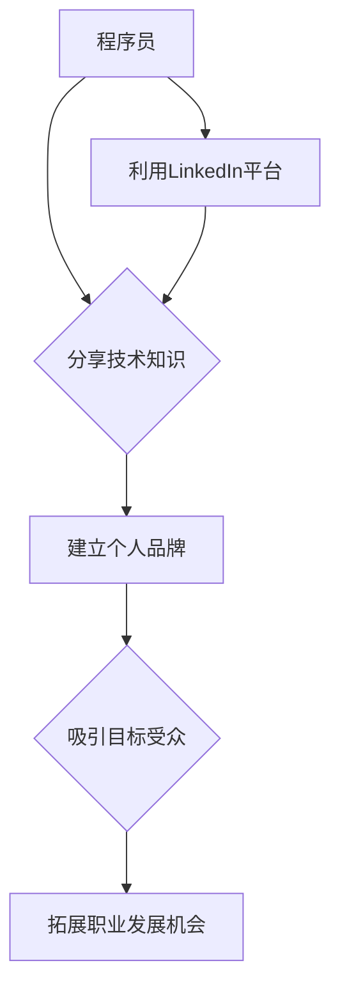

                 

## 程序员如何利用LinkedIn进行知识营销

> 关键词：LinkedIn, 知识营销, 程序员, 个人品牌, 技术社区, 网络效应, 内容创作, 职业发展

## 1. 背景介绍

在当今数字化时代，技术人才的竞争日益激烈。程序员们需要不断提升自身技能，建立个人品牌，并积极参与技术社区，才能在激烈的市场竞争中脱颖而出。LinkedIn作为全球最大的职业社交平台，为程序员提供了绝佳的平台进行知识营销，提升个人影响力，拓展职业发展机会。

传统的求职方式已经不再有效，程序员们需要主动出击，通过分享自己的技术经验和见解，建立个人品牌，吸引潜在雇主和合作伙伴的关注。LinkedIn为程序员提供了丰富的工具和资源，帮助他们实现知识营销的目标。

## 2. 核心概念与联系

### 2.1 知识营销

知识营销是指通过分享专业知识和洞察力，建立个人品牌，并吸引目标受众的营销策略。对于程序员而言，知识营销意味着分享自己的编程经验、技术技能、项目案例等，并与其他技术人员进行交流互动。

### 2.2 LinkedIn

LinkedIn是一个全球性的职业社交平台，拥有超过8亿注册用户，其中包括大量的技术人才。程序员可以通过LinkedIn建立个人档案，连接其他专业人士，加入技术社群，分享内容，并寻找工作机会。

### 2.3 网络效应

网络效应是指随着平台用户数量的增加，平台价值不断提升的现象。LinkedIn拥有庞大的用户群体，这意味着程序员可以接触到更广泛的受众，并通过网络效应提升自己的个人品牌影响力。

**核心概念与联系流程图**



## 3. 核心算法原理 & 具体操作步骤

### 3.1 算法原理概述

LinkedIn的推荐算法基于用户的行为数据，例如浏览历史、点赞、评论、分享等，并通过机器学习模型预测用户可能感兴趣的内容。程序员可以通过理解和利用这些算法原理，优化自己的内容创作和发布策略，提高内容曝光率和影响力。

### 3.2 算法步骤详解

1. **数据收集:** LinkedIn收集用户的行为数据，包括浏览历史、点赞、评论、分享等。
2. **特征提取:** 从行为数据中提取用户兴趣、专业领域、社交关系等特征。
3. **模型训练:** 利用机器学习算法训练推荐模型，预测用户可能感兴趣的内容。
4. **内容推荐:** 根据用户的特征和模型预测，推荐相关内容。

### 3.3 算法优缺点

**优点:**

* **精准推荐:** 基于用户行为数据，推荐内容更精准，用户体验更好。
* **个性化推荐:** 每个用户的推荐内容都不同，满足个性化需求。
* **持续优化:** 随着用户行为数据的积累，推荐算法不断优化，推荐效果越来越好。

**缺点:**

* **算法黑盒:** 算法的内部机制复杂，难以完全理解。
* **数据偏差:** 数据收集和处理过程中可能存在偏差，影响推荐结果的准确性。
* **过滤泡:** 用户只看到自己感兴趣的内容，可能会导致信息茧房现象。

### 3.4 算法应用领域

* **内容推荐:** 推荐用户可能感兴趣的文章、视频、帖子等。
* **人才招聘:** 推荐符合职位要求的候选人。
* **广告投放:** 将广告精准投放到目标用户面前。

## 4. 数学模型和公式 & 详细讲解 & 举例说明

### 4.1 数学模型构建

LinkedIn的推荐算法通常基于协同过滤模型，例如用户-物品协同过滤模型。该模型假设用户对物品的评分与其他用户对相同物品的评分相关。

**用户-物品协同过滤模型**

$$
r_{ui} = \mu + b_u + b_i + \epsilon_{ui}
$$

其中：

* $r_{ui}$ 表示用户 $u$ 对物品 $i$ 的评分。
* $\mu$ 表示全局平均评分。
* $b_u$ 表示用户 $u$ 的偏差。
* $b_i$ 表示物品 $i$ 的偏差。
* $\epsilon_{ui}$ 表示评分误差。

### 4.2 公式推导过程

该模型通过最小化评分误差的平方和来学习用户和物品的偏差。

$$
\min \sum_{u,i} (r_{ui} - \mu - b_u - b_i)^2
$$

### 4.3 案例分析与讲解

假设用户 $A$ 对编程语言 Python 的评分为 5，用户 $B$ 对 Python 的评分为 4，用户 $A$ 对 Java 的评分为 3，用户 $B$ 对 Java 的评分为 4。

通过用户-物品协同过滤模型，可以学习到用户 $A$ 对 Python 的偏好度较高，用户 $B$ 对 Python 的偏好度中等，并预测用户 $A$ 对其他编程语言的评分。

## 5. 项目实践：代码实例和详细解释说明

### 5.1 开发环境搭建

* Python 3.x
* Pandas
* Scikit-learn

### 5.2 源代码详细实现

```python
import pandas as pd
from sklearn.metrics.pairwise import cosine_similarity

# 数据加载
data = pd.read_csv('user_item_ratings.csv')

# 数据预处理
user_item_matrix = data.pivot_table(index='user_id', columns='item_id', values='rating')

# 计算余弦相似度
user_similarity = cosine_similarity(user_item_matrix)

# 推荐算法
def recommend_items(user_id, top_n=5):
    # 获取用户相似用户
    similar_users = user_similarity[user_id].argsort()[:-top_n-1:-1]
    # 获取相似用户喜欢的物品
    recommended_items = set()
    for similar_user in similar_users:
        recommended_items.update(user_item_matrix.loc[similar_user].index[user_item_matrix.loc[similar_user] > 0])
    # 去除用户已评分的物品
    recommended_items = recommended_items - set(user_item_matrix.loc[user_id].index[user_item_matrix.loc[user_id] > 0])
    return recommended_items

# 推荐示例
user_id = 1
recommendations = recommend_items(user_id)
print(f'推荐给用户 {user_id} 的物品: {recommendations}')
```

### 5.3 代码解读与分析

该代码实现了一个简单的基于余弦相似度的推荐算法。

1. 数据加载和预处理：加载用户评分数据，并将其转换为用户-物品评分矩阵。
2. 计算用户相似度：使用余弦相似度计算用户之间的相似度。
3. 推荐算法：根据用户相似度，推荐用户可能感兴趣的物品。

### 5.4 运行结果展示

运行代码后，将输出用户 1 可能感兴趣的物品列表。

## 6. 实际应用场景

### 6.1 个人品牌建设

程序员可以通过在LinkedIn上分享技术文章、项目案例、个人见解等内容，建立个人品牌，提升专业形象，吸引潜在雇主和合作伙伴的关注。

### 6.2 技术社区参与

程序员可以通过加入技术社群，参与讨论，分享经验，并与其他技术人员建立联系，拓展人脉，获取行业资讯。

### 6.3 职业发展机会

LinkedIn上的招聘信息和求职者信息丰富，程序员可以通过平台寻找工作机会，并与招聘人员进行交流。

### 6.4 未来应用展望

随着人工智能技术的不断发展，LinkedIn的推荐算法将更加精准，程序员可以通过更有效的知识营销策略，提升个人影响力，拓展职业发展机会。

## 7. 工具和资源推荐

### 7.1 学习资源推荐

* **LinkedIn Learning:** 提供丰富的技术课程和培训资源。
* **Coursera:** 提供来自世界知名大学的在线课程。
* **Udacity:** 提供以项目为中心的在线课程，专注于技术领域。

### 7.2 开发工具推荐

* **GitHub:** 代码托管平台，用于存储和分享代码。
* **Stack Overflow:** 技术问答社区，可以解答编程问题。
* **Visual Studio Code:** 代码编辑器，支持多种编程语言。

### 7.3 相关论文推荐

* **Collaborative Filtering for Implicit Feedback Datasets**
* **Matrix Factorization Techniques for Recommender Systems**
* **Deep Learning for Recommender Systems**

## 8. 总结：未来发展趋势与挑战

### 8.1 研究成果总结

本文介绍了程序员如何利用LinkedIn进行知识营销，并分析了LinkedIn的推荐算法原理和应用场景。

### 8.2 未来发展趋势

* **个性化推荐:** 推荐算法将更加精准，根据用户的兴趣和需求提供个性化的内容推荐。
* **人工智能驱动:** 人工智能技术将被更加广泛地应用于推荐算法，提升推荐效果。
* **跨平台整合:** LinkedIn将与其他平台进行整合，提供更全面的服务。

### 8.3 面临的挑战

* **数据隐私:** 数据收集和使用需要考虑用户隐私问题。
* **算法公平性:** 算法需要避免歧视和偏见，确保公平性。
* **内容质量:** 需要鼓励高质量内容的创作和分享，避免信息污染。

### 8.4 研究展望

未来研究将重点关注推荐算法的公平性、透明度和可解释性，并探索新的技术手段，提升知识营销的效率和效果。

## 9. 附录：常见问题与解答

**Q1: 如何在LinkedIn上建立个人品牌？**

A1: 建立个人品牌需要持续输出高质量内容，例如技术文章、项目案例、个人见解等，并积极参与技术社群，与其他专业人士进行交流互动。

**Q2: 如何提高LinkedIn内容的曝光率？**

A2: 可以使用合适的关键词，发布吸引人的标题，并定期更新内容，并与其他用户互动，例如点赞、评论、分享等。

**Q3: 如何利用LinkedIn寻找工作机会？**

A3: 可以关注招聘信息，主动联系招聘人员，并优化自己的个人档案，突出自己的技能和经验。


作者：禅与计算机程序设计艺术 / Zen and the Art of Computer Programming 
<end_of_turn>

