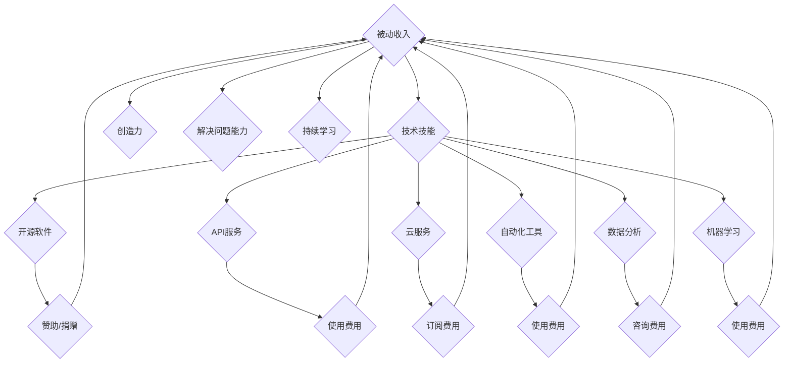

                 

## 程序员如何打造被动收入流

> 关键词：被动收入、程序员、开源软件、API、云服务、自动化、数据分析、机器学习

### 1. 背景介绍

在当今科技飞速发展的时代，程序员作为数字时代的核心力量，拥有着独特的技能和资源，可以利用这些优势创造出持续的被动收入流。被动收入是指无需持续投入时间和精力就能获得的收入，它可以为程序员提供财务自由和生活弹性。

传统的程序员工作模式通常是按项目计费或按时薪计算，收入与工作时间成正比。然而，随着人工智能、自动化和云计算技术的不断发展，程序员可以利用这些技术构建出能够持续产生收入的系统，从而实现被动收入的目标。

### 2. 核心概念与联系

**2.1  被动收入的本质**

被动收入的核心概念是“一次投入，多次收益”。程序员可以通过开发软件、构建平台、提供服务等方式，在初始投入时间和精力后，获得持续的收入回报。

**2.2  程序员的优势**

程序员拥有以下优势，可以帮助他们打造被动收入流：

* **技术技能:** 程序员精通编程语言、软件开发工具和技术架构，能够构建复杂系统和应用程序。
* **创造力:** 程序员能够将创意转化为实际产品，开发出具有独特价值的软件解决方案。
* **解决问题的能力:** 程序员能够分析问题、设计解决方案并将其转化为可执行的代码。
* **持续学习:** 程序员需要不断学习新技术和知识，保持竞争力，这有助于他们适应不断变化的技术环境。

**2.3  构建被动收入的路径**

程序员可以利用其优势，通过以下路径构建被动收入流：

* **开源软件:** 开发开源软件并通过赞助、捐赠或商业支持获得收入。
* **API服务:** 提供API接口，允许其他开发者使用其软件或数据，并收取使用费用。
* **云服务:** 提供云计算服务，例如服务器托管、数据存储、应用程序部署等，并收取订阅费用。
* **自动化工具:** 开发自动化工具，帮助用户完成重复性任务，并收取使用费用。
* **数据分析:** 利用数据分析技术，为企业提供数据洞察和决策支持，并收取咨询费用。
* **机器学习:** 开发机器学习模型，提供预测、分类、识别等服务，并收取使用费用。

**2.4  核心概念架构**



### 3. 核心算法原理 & 具体操作步骤

**3.1  算法原理概述**

被动收入的构建本质上是利用算法和自动化技术，将一次性投入转化为持续的收益。

* **数据驱动:** 大多数被动收入模式都依赖于数据，例如用户行为数据、市场趋势数据等。程序员需要了解数据分析和机器学习算法，才能有效地利用数据创造价值。
* **自动化:** 自动化是构建被动收入的关键要素。程序员可以使用脚本、自动化工具和云服务，将重复性任务自动化，节省时间和精力。
* **持续优化:** 为了保持被动收入的持续性，程序员需要不断优化算法、系统和流程，提高效率和收益。

**3.2  算法步骤详解**

1. **确定目标市场和需求:** 首先，程序员需要确定目标市场和用户需求，了解哪些问题需要解决，哪些价值可以提供。
2. **设计算法和系统架构:** 根据目标市场和需求，程序员需要设计算法和系统架构，确定数据来源、处理流程、输出结果等。
3. **开发和测试:** 程序员需要开发软件、构建系统并进行测试，确保其稳定性和可靠性。
4. **部署和维护:** 将系统部署到云平台或服务器上，并进行持续维护，及时修复bug和更新功能。
5. **推广和营销:** 程序员需要推广和营销其产品或服务，吸引用户使用并产生收入。

**3.3  算法优缺点**

* **优点:**
    * **可持续性:** 一旦系统搭建完成，可以持续产生收入，无需持续投入时间和精力。
    * **规模化:** 可以通过自动化和云计算技术，轻松扩展系统规模，提高收益。
    * **财务自由:** 可以获得稳定的被动收入，实现财务自由和生活弹性。

* **缺点:**
    * **前期投入:** 构建被动收入系统需要前期投入时间、精力和资金。
    * **技术门槛:** 需要一定的编程和系统架构知识，才能构建出高效的系统。
    * **市场竞争:** 需要面对市场竞争，不断优化产品和服务才能保持竞争力。

**3.4  算法应用领域**

* **开源软件:** 开发开源软件并通过赞助、捐赠或商业支持获得收入。
* **API服务:** 提供API接口，允许其他开发者使用其软件或数据，并收取使用费用。
* **云服务:** 提供云计算服务，例如服务器托管、数据存储、应用程序部署等，并收取订阅费用。
* **自动化工具:** 开发自动化工具，帮助用户完成重复性任务，并收取使用费用。
* **数据分析:** 利用数据分析技术，为企业提供数据洞察和决策支持，并收取咨询费用。
* **机器学习:** 开发机器学习模型，提供预测、分类、识别等服务，并收取使用费用。

### 4. 数学模型和公式 & 详细讲解 & 举例说明

**4.1  数学模型构建**

被动收入的数学模型可以简单地表示为：

$$
Passive Income = Revenue - Cost
$$

其中：

* **Passive Income:** 被动收入
* **Revenue:** 收入
* **Cost:** 成本

**4.2  公式推导过程**

被动收入的计算公式可以根据具体的业务模式进行调整。例如，如果程序员开发了开源软件并通过赞助获得收入，则公式可以表示为：

$$
Passive Income = Sponsorship Revenue - Development Cost
$$

其中：

* **Sponsorship Revenue:** 赞助收入
* **Development Cost:** 开发成本

**4.3  案例分析与讲解**

假设程序员开发了一个开源的图像识别工具，并通过赞助获得 10,000 美元的收入，开发成本为 5,000 美元，则其被动收入为：

$$
Passive Income = 10,000 - 5,000 = 5,000
$$

因此，程序员可以通过开发开源软件并获得赞助，实现 5,000 美元的被动收入。

### 5. 项目实践：代码实例和详细解释说明

**5.1  开发环境搭建**

程序员需要根据项目的具体需求搭建开发环境，例如：

* **操作系统:** Linux、macOS 或 Windows
* **编程语言:** Python、Java、C++ 等
* **开发工具:** IDE、文本编辑器、版本控制系统等
* **云平台:** AWS、Azure、GCP 等

**5.2  源代码详细实现**

由于文章篇幅有限，无法提供完整的源代码示例。但可以提供一些代码片段，例如：

* **Python 代码示例:**

```python
def calculate_passive_income(revenue, cost):
  """
  计算被动收入
  """
  return revenue - cost

# 示例用法
revenue = 10000
cost = 5000
passive_income = calculate_passive_income(revenue, cost)
print(f"被动收入: {passive_income}")
```

* **Java 代码示例:**

```java
public class PassiveIncomeCalculator {
  public static double calculatePassiveIncome(double revenue, double cost) {
    return revenue - cost;
  }

  public static void main(String[] args) {
    double revenue = 10000;
    double cost = 5000;
    double passiveIncome = calculatePassiveIncome(revenue, cost);
    System.out.println("被动收入: " + passiveIncome);
  }
}
```

**5.3  代码解读与分析**

以上代码示例演示了如何计算被动收入。程序员可以根据实际需求修改代码，例如添加数据源、算法逻辑等。

**5.4  运行结果展示**

运行以上代码示例，输出结果为：

```
被动收入: 5000
```

### 6. 实际应用场景

**6.1  开源软件赞助**

程序员可以开发开源软件，并通过赞助、捐赠或商业支持获得收入。例如，开发一个受欢迎的编程库或工具，并提供付费支持服务。

**6.2  API服务收费**

程序员可以开发API接口，允许其他开发者使用其软件或数据，并收取使用费用。例如，开发一个天气预报API，并提供不同级别的收费套餐。

**6.3  云服务订阅**

程序员可以提供云计算服务，例如服务器托管、数据存储、应用程序部署等，并收取订阅费用。例如，开发一个云平台，提供虚拟机、数据库和网络服务。

**6.4  自动化工具收费**

程序员可以开发自动化工具，帮助用户完成重复性任务，并收取使用费用。例如，开发一个代码生成工具，自动生成代码模板或代码片段。

**6.5  数据分析咨询**

程序员可以利用数据分析技术，为企业提供数据洞察和决策支持，并收取咨询费用。例如，分析用户行为数据，帮助企业优化营销策略。

**6.6  机器学习模型服务**

程序员可以开发机器学习模型，提供预测、分类、识别等服务，并收取使用费用。例如，开发一个图像识别模型，帮助企业自动识别产品或物体。

**6.7  未来应用展望**

随着人工智能、自动化和云计算技术的不断发展，程序员可以构建出更多创新的被动收入模式。例如：

* **个性化内容推荐:** 利用机器学习算法，为用户推荐个性化的内容，并通过广告收入或订阅费用获得收益。
* **虚拟助手:** 开发虚拟助手，帮助用户完成日常任务，并通过广告收入或订阅费用获得收益。
* **区块链应用:** 利用区块链技术，开发去中心化的应用程序，并通过代币或交易费用获得收益。

### 7. 工具和资源推荐

**7.1  学习资源推荐**

* **在线课程:** Coursera、edX、Udemy 等平台提供丰富的编程和数据科学课程。
* **书籍:** 《Python编程从入门到实践》、《机器学习实战》等书籍可以帮助程序员学习相关技术。
* **博客和论坛:** Hacker News、Stack Overflow 等网站可以帮助程序员获取技术资讯和解决问题。

**7.2  开发工具推荐**

* **IDE:** Visual Studio Code、IntelliJ IDEA、Eclipse 等 IDE 可以提高程序员的开发效率。
* **版本控制系统:** Git 是常用的版本控制系统，可以帮助程序员管理代码和协作开发。
* **云平台:** AWS、Azure、GCP 等云平台提供丰富的服务，可以帮助程序员部署和管理应用程序。

**7.3  相关论文推荐**

* **机器学习:** 《深度学习》
* **数据分析:** 《数据挖掘导论》
* **云计算:** 《云计算架构》

### 8. 总结：未来发展趋势与挑战

**8.1  研究成果总结**

本文介绍了程序员如何打造被动收入流的理论和实践方法，包括核心概念、算法原理、代码实例和实际应用场景。

**8.2  未来发展趋势**

随着人工智能、自动化和云计算技术的不断发展，程序员可以构建出更多创新的被动收入模式，例如个性化内容推荐、虚拟助手和区块链应用。

**8.3  面临的挑战**

程序员打造被动收入流也面临着一些挑战，例如：

* **技术门槛:** 需要掌握一定的编程和系统架构知识。
* **市场竞争:** 需要面对市场竞争，不断优化产品和服务才能保持竞争力。
* **维护成本:** 需要持续维护系统，修复bug和更新功能。

**8.4  研究展望**

未来，研究人员可以继续探索新的被动收入模式，并开发更智能、更便捷的工具和平台，帮助程序员更轻松地打造被动收入流。

### 9. 附录：常见问题与解答

**9.1  如何确定目标市场和需求？**

程序员可以进行市场调研，了解用户需求和痛点，并分析竞争对手的产品和服务。

**9.2  如何设计高效的算法和系统架构？**

程序员需要了解算法设计和系统架构的知识，并根据目标市场和需求进行设计。

**9.3  如何推广和营销被动收入产品或服务？**

程序员可以利用社交媒体、内容营销、付费广告等方式推广和营销其产品或服务。


作者：禅与计算机程序设计艺术 / Zen and the Art of Computer Programming 
<end_of_turn>

