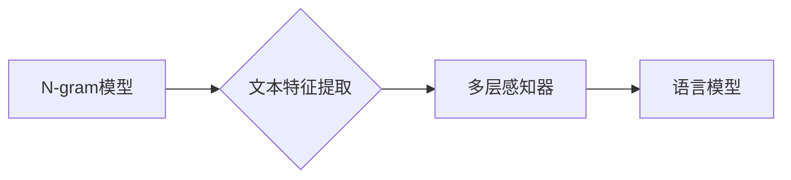

                 

## 第03章 N-gram模型 多层感知器与激活函数

> 关键词：N-gram模型, 多层感知器, 激活函数, 自然语言处理, 机器学习, 深度学习, 文本分类, 机器翻译

### 1. 背景介绍

自然语言处理 (NLP) 领域一直致力于让计算机理解和处理人类语言。文本生成、机器翻译、文本分类等任务都依赖于强大的语言模型。传统的统计语言模型，如N-gram模型，在一定程度上取得了成功，但其在捕捉长距离依赖关系和语义理解方面存在局限性。

随着深度学习的兴起，多层感知器 (MLP) 和激活函数成为了NLP领域的新宠。MLP能够学习复杂的非线性关系，而激活函数则赋予了神经网络非线性表达能力，使其能够更好地模拟人类大脑的运作机制。

本章将深入探讨N-gram模型、多层感知器以及激活函数，并分析它们在NLP任务中的应用。

### 2. 核心概念与联系

#### 2.1 N-gram模型

N-gram模型是一种统计语言模型，它基于词序列的统计信息来预测下一个词。N代表词序列的长度，例如，bigram (n=2) 模型预测下一个词时只考虑前一个词的信息，trigram (n=3) 模型则考虑前两个词的信息。

N-gram模型的优点在于简单易懂，计算效率高。但其缺点在于无法捕捉长距离依赖关系，并且在面对罕见词语时表现不佳。

#### 2.2 多层感知器 (MLP)

多层感知器 (MLP) 是一种前馈神经网络，它由多个隐层和一个输出层组成。每个神经元接收来自上一层的输入，并通过权重进行加权求和，然后经过激活函数处理后输出到下一层。

MLP能够学习复杂的非线性关系，并且能够处理高维数据。其强大的表达能力使其在NLP任务中得到广泛应用。

#### 2.3 激活函数

激活函数是神经网络中一个重要的组成部分，它决定了神经元的输出。常见的激活函数包括 sigmoid 函数、tanh 函数、ReLU 函数等。

激活函数赋予了神经网络非线性表达能力，使其能够学习更复杂的模式。不同的激活函数具有不同的特性，选择合适的激活函数对于模型的性能至关重要。

#### 2.4 核心概念联系

N-gram模型和多层感知器可以相互结合，构建更强大的语言模型。

例如，我们可以使用N-gram模型来提取文本特征，然后将这些特征作为多层感知器的输入，从而提高模型的性能。

**Mermaid 流程图**



### 3. 核心算法原理 & 具体操作步骤

#### 3.1 算法原理概述

N-gram模型是一种基于统计的语言模型，它通过计算词序列出现的概率来预测下一个词。多层感知器是一种基于神经网络的模型，它通过学习复杂的非线性关系来预测下一个词。

#### 3.2 算法步骤详解

**N-gram模型**

1. **训练数据准备:** 收集大量的文本数据，并将其分割成词序列。
2. **N-gram计数:** 计算每个N-gram在训练数据中出现的频率。
3. **概率计算:** 根据N-gram的频率，计算每个N-gram出现的概率。
4. **预测下一个词:** 给定一个词序列，使用N-gram模型计算每个可能的下一个词出现的概率，选择概率最高的词作为预测结果。

**多层感知器**

1. **网络结构设计:** 设计多层感知器的网络结构，包括隐层数量、隐层节点数量等。
2. **参数初始化:** 初始化网络权重和偏置。
3. **前向传播:** 将输入词序列转换为向量表示，并通过网络层层传递，最终得到每个可能的下一个词的概率分布。
4. **反向传播:** 计算模型预测结果与真实结果之间的误差，并根据误差反向更新网络权重和偏置。
5. **训练迭代:** 重复前向传播和反向传播过程，直到模型性能达到预期的水平。

#### 3.3 算法优缺点

**N-gram模型**

* **优点:** 简单易懂，计算效率高。
* **缺点:** 无法捕捉长距离依赖关系，在面对罕见词语时表现不佳。

**多层感知器**

* **优点:** 能够学习复杂的非线性关系，并且能够处理高维数据。
* **缺点:** 训练时间长，参数数量多，容易过拟合。

#### 3.4 算法应用领域

**N-gram模型**

* 文本分类
* 机器翻译
* 语音识别

**多层感知器**

* 文本生成
* 机器翻译
* 情感分析

### 4. 数学模型和公式 & 详细讲解 & 举例说明

#### 4.1 数学模型构建

**N-gram模型**

N-gram模型的数学模型可以用以下公式表示：

$$P(w_i | w_{i-n+1}, w_{i-n+2}, ..., w_{i-1})$$

其中：

* $w_i$ 是第i个词
* $w_{i-n+1}, w_{i-n+2}, ..., w_{i-1}$ 是前n-1个词

**多层感知器**

多层感知器的数学模型可以用以下公式表示：

$$y = f(W^L \cdot a^{L-1} + b^L)$$

其中：

* $y$ 是输出
* $f$ 是激活函数
* $W^L$ 是第L层的权重矩阵
* $a^{L-1}$ 是第L-1层的激活值
* $b^L$ 是第L层的偏置

#### 4.2 公式推导过程

N-gram模型的概率计算基于最大似然估计。

多层感知器的权重和偏置可以通过反向传播算法更新。

#### 4.3 案例分析与讲解

**N-gram模型案例**

假设我们有一个训练数据：

"the cat sat on the mat"

我们可以计算以下N-gram的概率：

* bigram (n=2):

"the cat", "cat sat", "sat on", "on the", "the mat"

* trigram (n=3):

"the cat sat", "cat sat on", "sat on the"

**多层感知器案例**

我们可以使用多层感知器来预测下一个词。

例如，给定词序列 "the cat sat on the", 多层感知器可以预测下一个词为 "mat"。

### 5. 项目实践：代码实例和详细解释说明

#### 5.1 开发环境搭建

* Python 3.x
* TensorFlow 或 PyTorch

#### 5.2 源代码详细实现

```python
# 使用N-gram模型预测下一个词
import nltk

# 下载NLTK的punkt分词器
nltk.download('punkt')

# 定义N-gram模型
def ngram_model(text, n):
    tokens = nltk.word_tokenize(text)
    ngrams = nltk.ngrams(tokens, n)
    ngram_counts = {}
    for ngram in ngrams:
        ngram_counts[ngram] = ngram_counts.get(ngram, 0) + 1
    return ngram_counts

# 使用多层感知器预测下一个词
import tensorflow as tf

# 定义多层感知器模型
model = tf.keras.Sequential([
    tf.keras.layers.Embedding(input_dim=vocab_size, output_dim=embedding_dim),
    tf.keras.layers.LSTM(units=128),
    tf.keras.layers.Dense(units=vocab_size, activation='softmax')
])

# 训练模型
model.compile(optimizer='adam', loss='sparse_categorical_crossentropy', metrics=['accuracy'])
model.fit(x_train, y_train, epochs=10)

# 预测下一个词
predictions = model.predict(x_test)
```

#### 5.3 代码解读与分析

* N-gram模型代码使用NLTK库进行分词和N-gram计算。
* 多层感知器代码使用TensorFlow库构建模型，并使用Adam优化器进行训练。

#### 5.4 运行结果展示

* N-gram模型的预测结果取决于训练数据的质量和N的值。
* 多层感知器的预测结果取决于模型的结构、训练数据和训练参数。

### 6. 实际应用场景

#### 6.1 文本分类

N-gram模型和多层感知器都可以用于文本分类任务，例如垃圾邮件过滤、情感分析等。

#### 6.2 机器翻译

多层感知器在机器翻译任务中取得了显著的成果，例如Google Translate。

#### 6.3 文本生成

多层感知器可以用于文本生成任务，例如自动写作、对话系统等。

#### 6.4 未来应用展望

随着深度学习技术的不断发展，N-gram模型和多层感知器在NLP领域的应用将会更加广泛。

例如，我们可以使用更复杂的网络结构和训练方法来构建更强大的语言模型，从而实现更精准的文本理解和生成。

### 7. 工具和资源推荐

#### 7.1 学习资源推荐

* **书籍:**

* "Speech and Language Processing" by Jurafsky and Martin
* "Deep Learning" by Goodfellow, Bengio, and Courville

* **在线课程:**

* Coursera: Natural Language Processing Specialization
* edX: Deep Learning

#### 7.2 开发工具推荐

* **Python:**

* NLTK
* TensorFlow
* PyTorch

#### 7.3 相关论文推荐

* "Attention Is All You Need" by Vaswani et al.
* "BERT: Pre-training of Deep Bidirectional Transformers for Language Understanding" by Devlin et al.

### 8. 总结：未来发展趋势与挑战

#### 8.1 研究成果总结

N-gram模型和多层感知器在NLP领域取得了显著的成果，为文本理解和生成提供了强大的工具。

#### 8.2 未来发展趋势

* 更复杂的网络结构和训练方法
* 更大规模的训练数据
* 跨语言和跨模态的语言模型

#### 8.3 面临的挑战

* 训练时间长
* 参数数量多
* 难以解释模型决策

#### 8.4 研究展望

未来研究将继续探索更有效的训练方法、更强大的模型架构以及更深入的语言理解机制。

### 9. 附录：常见问题与解答

* **Q: N-gram模型的缺点是什么？**

* **A:** N-gram模型无法捕捉长距离依赖关系，并且在面对罕见词语时表现不佳。

* **Q: 多层感知器如何学习复杂的非线性关系？**

* **A:** 多层感知器通过激活函数赋予了非线性表达能力，从而能够学习复杂的非线性关系。

* **Q: 如何选择合适的激活函数？**

* **A:** 不同的激活函数具有不同的特性，选择合适的激活函数取决于具体的任务和模型结构。


作者：禅与计算机程序设计艺术 / Zen and the Art of Computer Programming 
<end_of_turn>

