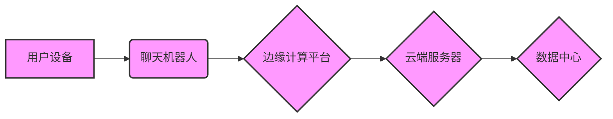

                 

## 聊天机器人5G 和边缘计算：高速和低延迟

> 关键词：聊天机器人、5G、边缘计算、低延迟、自然语言处理、人工智能、云计算、网络架构

## 1. 背景介绍

随着5G网络的快速普及和人工智能技术的飞速发展，聊天机器人正迎来前所未有的发展机遇。聊天机器人作为一种新型的人机交互方式，能够提供快速、便捷、个性化的服务，在各个领域都展现出巨大的应用潜力。然而，传统的云端部署模式在处理实时交互时存在着延迟问题，难以满足用户对低延迟交互的需求。

边缘计算技术的出现为解决这一问题提供了新的解决方案。边缘计算将计算资源和数据存储部署到网络边缘，靠近用户设备，能够有效降低数据传输延迟，提升交互体验。将聊天机器人部署到边缘计算平台，可以实现更快速、更流畅的交互，为用户提供更沉浸式的体验。

## 2. 核心概念与联系

### 2.1 聊天机器人

聊天机器人是一种能够通过自然语言与用户进行对话的智能系统。它通常基于自然语言处理（NLP）技术，能够理解用户的意图，并生成相应的回复。

### 2.2 5G 网络

5G是第五代移动通信技术，相比于4G网络，5G具有更高的带宽、更低的延迟和更强的连接能力。这些特性为聊天机器人提供了一个高速、低延迟的通信环境。

### 2.3 边缘计算

边缘计算是指将计算资源和数据存储部署到网络边缘，靠近数据产生地，以降低数据传输延迟和提高计算效率。

**核心概念与联系流程图**



## 3. 核心算法原理 & 具体操作步骤

### 3.1 算法原理概述

聊天机器人通常采用基于规则或机器学习的算法进行对话处理。

* **基于规则的算法:** 这种算法依赖于预先定义的一系列规则，根据用户的输入匹配相应的规则，并生成相应的回复。

* **基于机器学习的算法:** 这种算法利用大量的训练数据，训练一个模型，能够自动学习用户的意图和语义，并生成更自然、更符合语境的回复。

### 3.2 算法步骤详解

**基于机器学习的聊天机器人算法步骤:**

1. **数据收集和预处理:** 收集大量的对话数据，并进行清洗、标注和格式化处理。
2. **特征提取:** 从对话数据中提取特征，例如单词、词性、语法结构等。
3. **模型训练:** 利用训练数据和提取的特征，训练一个机器学习模型，例如循环神经网络（RNN）或Transformer。
4. **模型评估:** 使用测试数据评估模型的性能，并进行调优。
5. **对话系统部署:** 将训练好的模型部署到聊天机器人平台，实现与用户的交互。

### 3.3 算法优缺点

**基于规则的算法:**

* **优点:** 规则易于定义和维护，能够处理特定场景的对话。
* **缺点:** 难以处理复杂、开放式的对话场景，回复缺乏自然性和灵活性。

**基于机器学习的算法:**

* **优点:** 能够处理复杂、开放式的对话场景，回复更自然、更符合语境。
* **缺点:** 需要大量的训练数据，训练过程复杂，模型部署成本较高。

### 3.4 算法应用领域

聊天机器人算法广泛应用于各个领域，例如：

* **客服服务:** 自动回复用户常见问题，提高客服效率。
* **教育培训:** 提供个性化的学习辅导，帮助学生提高学习效果。
* **娱乐休闲:** 提供游戏、聊天等娱乐服务，丰富用户体验。
* **医疗保健:** 提供医疗咨询、预约挂号等服务，方便患者就医。

## 4. 数学模型和公式 & 详细讲解 & 举例说明

### 4.1 数学模型构建

在聊天机器人领域，常用的数学模型包括：

* **词向量模型:** 将单词映射到一个低维向量空间，捕捉单词之间的语义关系。例如Word2Vec和GloVe模型。

* **序列模型:** 用于处理顺序数据，例如文本序列。例如RNN和Transformer模型。

* **概率模型:** 用于计算事件发生的概率，例如隐马尔可夫模型（HMM）和条件随机场（CRF）。

### 4.2 公式推导过程

**词向量模型的训练目标:**

最大化目标函数：

$$
J(\theta) = \sum_{i=1}^{N} \log p(w_i | context(w_i))
$$

其中：

* $\theta$ 是词向量模型的参数。
* $N$ 是训练语料库中单词的数量。
* $w_i$ 是第 $i$ 个单词。
* $context(w_i)$ 是 $w_i$ 的上下文单词。

### 4.3 案例分析与讲解

**Word2Vec模型:**

Word2Vec模型是一种常用的词向量模型，它通过训练一个神经网络来学习单词的词向量表示。

Word2Vec模型有两种训练方式：

* **CBOW (Continuous Bag-of-Words):** 预测中心词，根据上下文词预测中心词。
* **Skip-gram:** 预测上下文词，根据中心词预测上下文词。

**举例说明:**

假设我们有一个训练语料库：

* "The cat sat on the mat."

使用CBOW模型，我们可以训练一个词向量模型，使得 "cat" 的词向量与 "sat" 和 "on" 的词向量相近。

## 5. 项目实践：代码实例和详细解释说明

### 5.1 开发环境搭建

* **操作系统:** Ubuntu 20.04 LTS
* **编程语言:** Python 3.8
* **深度学习框架:** TensorFlow 2.0
* **其他工具:** Git, Docker

### 5.2 源代码详细实现

```python
# 导入必要的库
import tensorflow as tf

# 定义聊天机器人模型
class ChatBotModel(tf.keras.Model):
    def __init__(self, vocab_size, embedding_dim, hidden_dim):
        super(ChatBotModel, self).__init__()
        self.embedding = tf.keras.layers.Embedding(vocab_size, embedding_dim)
        self.lstm = tf.keras.layers.LSTM(hidden_dim)
        self.dense = tf.keras.layers.Dense(vocab_size, activation='softmax')

    def call(self, inputs):
        x = self.embedding(inputs)
        x = self.lstm(x)
        outputs = self.dense(x)
        return outputs

# 构建模型
model = ChatBotModel(vocab_size=10000, embedding_dim=128, hidden_dim=64)

# 编译模型
model.compile(optimizer='adam', loss='sparse_categorical_crossentropy', metrics=['accuracy'])

# 训练模型
model.fit(x_train, y_train, epochs=10)

# 预测
predictions = model.predict(x_test)
```

### 5.3 代码解读与分析

* **模型定义:** 聊天机器人模型是一个基于RNN的序列模型，包含嵌入层、LSTM层和全连接层。
* **嵌入层:** 将单词映射到一个低维向量空间。
* **LSTM层:** 用于处理顺序数据，捕捉文本序列中的上下文信息。
* **全连接层:** 将LSTM层的输出映射到词汇表的大小，预测下一个单词。
* **模型编译:** 使用Adam优化器、交叉熵损失函数和准确率作为评估指标。
* **模型训练:** 使用训练数据训练模型，训练 epochs 个周期。
* **模型预测:** 使用测试数据预测下一个单词。

### 5.4 运行结果展示

训练完成后，可以使用测试数据评估模型的性能，例如准确率、BLEU分数等。

## 6. 实际应用场景

### 6.1 智能客服

聊天机器人可以作为智能客服，自动回复用户常见问题，例如订单查询、退换货流程等，提高客服效率，降低人工成本。

### 6.2 个性化推荐

聊天机器人可以根据用户的聊天历史和偏好，提供个性化的商品或服务推荐，提升用户体验。

### 6.3 教育辅助

聊天机器人可以作为教育辅助工具，提供个性化的学习辅导，帮助学生理解知识点，提高学习效率。

### 6.4 医疗咨询

聊天机器人可以提供基本的医疗咨询服务，例如症状查询、疾病科普等，方便患者获取医疗信息。

## 7. 工具和资源推荐

### 7.1 学习资源推荐

* **书籍:**
    * 《深度学习》 by Ian Goodfellow, Yoshua Bengio, and Aaron Courville
    * 《自然语言处理》 by Dan Jurafsky and James H. Martin
* **在线课程:**
    * Coursera: Natural Language Processing Specialization
    * Udacity: Deep Learning Nanodegree

### 7.2 开发工具推荐

* **TensorFlow:** 开源深度学习框架
* **PyTorch:** 开源深度学习框架
* **Rasa:** 开源对话平台

### 7.3 相关论文推荐

* **Attention Is All You Need:** https://arxiv.org/abs/1706.03762
* **BERT: Pre-training of Deep Bidirectional Transformers for Language Understanding:** https://arxiv.org/abs/1810.04805

## 8. 总结：未来发展趋势与挑战

### 8.1 研究成果总结

近年来，聊天机器人技术取得了长足的进步，特别是深度学习技术的应用，使得聊天机器人的对话能力和自然度得到了显著提升。

### 8.2 未来发展趋势

* **更自然、更智能的对话:** 未来聊天机器人将更加注重自然语言理解和生成，能够进行更流畅、更自然的对话。
* **多模态交互:** 聊天机器人将不再局限于文本交互，将融合语音、图像、视频等多模态信息，提供更丰富的交互体验。
* **个性化定制:** 聊天机器人将更加注重用户个性化需求，能够根据用户的喜好和习惯，提供定制化的服务。
* **边缘计算部署:** 随着5G网络的普及，聊天机器人将更多地部署到边缘计算平台，实现更快速、更低延迟的交互。

### 8.3 面临的挑战

* **数据标注:** 训练高质量的聊天机器人模型需要大量的标注数据，数据标注成本高昂，且标注质量难以保证。
* **模型解释性:** 深度学习模型的决策过程难以解释，这使得聊天机器人的可靠性和安全性难以保证。
* **伦理问题:** 聊天机器人可能会被用于传播虚假信息、进行欺诈等恶意行为，需要解决相关的伦理问题。

### 8.4 研究展望

未来，聊天机器人技术将继续朝着更智能、更安全、更可靠的方向发展。研究者将致力于解决数据标注、模型解释性和伦理问题，推动聊天机器人技术在各个领域的应用。

## 9. 附录：常见问题与解答

### 9.1 如何选择合适的聊天机器人平台？

选择聊天机器人平台需要考虑以下因素：

* **功能需求:** 不同的平台提供不同的功能，例如对话管理、知识库、语音识别等。
* **部署方式:** 不同的平台支持不同的部署方式，例如云端部署、本地部署等。
* **价格:** 不同的平台价格不同，需要根据预算选择合适的平台。

### 9.2 如何训练一个高质量的聊天机器人模型？

训练高质量的聊天机器人模型需要以下步骤：

* **数据收集和预处理:** 收集大量的对话数据，并进行清洗、标注和格式化处理。
* **模型选择:** 选择合适的聊天机器人模型，例如RNN、Transformer等。
* **模型训练:** 使用训练数据训练模型，并进行调优。
* **模型评估:** 使用测试数据评估模型的性能，例如准确率、BLEU分数等。

### 9.3 聊天机器人有哪些应用场景？

聊天机器人广泛应用于各个领域，例如：

* **客服服务**
* **个性化推荐**
* **教育辅助**
* **医疗咨询**
* **娱乐休闲**


作者：禅与计算机程序设计艺术 / Zen and the Art of Computer Programming 
<end_of_turn>

