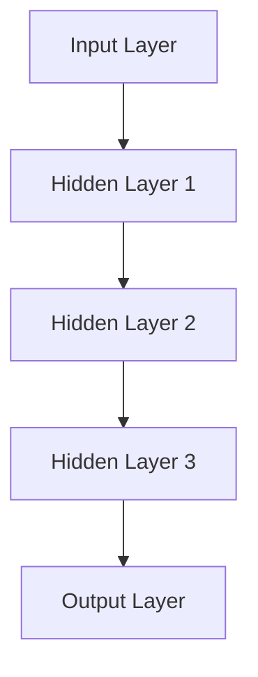

                 

### 文章标题：AI 大模型创业：如何利用社会优势？

#### 摘要：
本文将探讨在 AI 大模型领域创业的挑战与机遇，并重点分析如何利用社会优势来实现成功。我们将探讨大模型的技术原理、创业过程中的关键因素，以及如何通过合作、市场定位和社会网络来提升竞争力。

关键词：AI 大模型、创业、社会优势、技术原理、市场定位、合作

-----------------------

#### 1. 背景介绍（Background Introduction）

人工智能（AI）已成为当前科技发展的热门领域，特别是在深度学习和自然语言处理方面。大模型（Large Models）如 GPT-3、BERT 和 BERT-LG 等的出现，彻底改变了 AI 的研究与应用场景。这些模型具有数十亿甚至数万亿个参数，可以处理复杂的任务，从语言翻译到图像识别，再到自动驾驶。随着 AI 技术的成熟，越来越多的创业者投身于大模型领域，希望利用这一技术实现商业成功。

然而，AI 大模型创业并非易事。一方面，技术门槛高，需要深厚的专业知识；另一方面，市场环境复杂，竞争激烈。在这篇文章中，我们将讨论如何利用社会优势，即通过合作、市场定位和社会网络等手段，来提升创业项目的成功概率。

-----------------------

#### 2. 核心概念与联系（Core Concepts and Connections）

**2.1 大模型的技术原理**

大模型的核心是深度神经网络（Deep Neural Networks），它们通过多层非线性变换来学习数据中的特征和模式。以下是一个简化的 Mermaid 流程图，展示了大模型的基本架构：



**2.2 社会优势的重要性**

社会优势包括以下几个方面：

- **合作**：通过与其他企业、研究机构或开发者合作，可以共享资源、知识和技术，提高整个项目的成功率。
- **市场定位**：准确的市场定位可以帮助企业找到目标用户，并提供有针对性的解决方案。
- **社会网络**：构建强大的社会网络可以帮助企业获得资源、信息和支持，加快产品开发进程。

-----------------------

#### 3. 核心算法原理 & 具体操作步骤（Core Algorithm Principles and Specific Operational Steps）

**3.1 数据收集与预处理**

在构建大模型之前，首先需要收集大量数据。这些数据可以是文本、图像、声音等多种形式。数据收集后，需要进行预处理，如去除噪声、标准化、分词等，以便模型能够更好地学习。

**3.2 模型选择与训练**

选择合适的模型架构是关键。常见的架构有 Transformer、GAN 等。训练模型需要大量的计算资源，通常会使用分布式计算框架，如 TensorFlow、PyTorch 等。

**3.3 模型评估与优化**

训练完成后，需要对模型进行评估，以确定其性能。评估指标包括准确率、召回率、F1 分数等。根据评估结果，可以进一步优化模型。

-----------------------

#### 4. 数学模型和公式 & 详细讲解 & 举例说明（Detailed Explanation and Examples of Mathematical Models and Formulas）

**4.1 深度学习基础**

深度学习中的关键数学模型包括激活函数、损失函数和优化算法。以下是一些常见的公式：

- **激活函数**：$f(x) = \text{ReLU}(x) = \max(0, x)$
- **损失函数**：$L(\theta) = -\frac{1}{m}\sum_{i=1}^{m}y^{(i)}\log(a^{(i)}) + (1 - y^{(i)})\log(1 - a^{(i)})$
- **优化算法**：梯度下降（Gradient Descent）

**4.2 社会网络分析**

社会网络分析中的关键公式包括：

- **度分布**：$P(k) \propto k^{\gamma}$
- **平均路径长度**：$\langle L \rangle = \frac{1}{N}\sum_{i<j} d(i, j)$
- **聚类系数**：$C = \frac{2m}{N}\langle k \rangle$

-----------------------

#### 5. 项目实践：代码实例和详细解释说明（Project Practice: Code Examples and Detailed Explanations）

**5.1 开发环境搭建**

在开始项目之前，需要搭建合适的开发环境。以 TensorFlow 为例，可以按照以下步骤进行：

1. 安装 TensorFlow：`pip install tensorflow`
2. 安装相关依赖：`pip install numpy scipy matplotlib`
3. 搭建计算集群：使用 Docker 或 Kubernetes 等工具搭建分布式计算环境

**5.2 源代码详细实现**

以下是一个简化的 TensorFlow 源代码示例，用于训练一个简单的神经网络：

```python
import tensorflow as tf

# 定义模型
model = tf.keras.Sequential([
    tf.keras.layers.Dense(128, activation='relu', input_shape=(784,)),
    tf.keras.layers.Dense(10, activation='softmax')
])

# 编译模型
model.compile(optimizer='adam',
              loss='categorical_crossentropy',
              metrics=['accuracy'])

# 训练模型
model.fit(x_train, y_train, epochs=5)
```

**5.3 代码解读与分析**

这个示例中，我们定义了一个简单的神经网络，包含一个 128 个神经元的隐藏层和一个 10 个神经元的输出层。使用 ReLU 作为激活函数，并使用 softmax 函数进行分类。使用 Adam 优化器和交叉熵损失函数进行编译和训练。

-----------------------

#### 6. 实际应用场景（Practical Application Scenarios）

AI 大模型在许多领域都有广泛的应用，如：

- **自然语言处理**：文本生成、翻译、问答系统等。
- **计算机视觉**：图像识别、物体检测、图像生成等。
- **推荐系统**：个性化推荐、广告投放等。
- **游戏开发**：智能角色、游戏 AI 等。

在创业过程中，选择合适的应用场景非常重要。例如，自然语言处理领域中的问答系统是一个具有广泛应用前景的领域，可以通过构建一个智能客服系统来实现商业化。

-----------------------

#### 7. 工具和资源推荐（Tools and Resources Recommendations）

**7.1 学习资源推荐**

- **书籍**：《深度学习》、《Python 编程：从入门到实践》
- **论文**：NLP 领域的经典论文，如 BERT、GPT 系列。
- **博客**：TensorFlow、PyTorch 官方博客，以及各大技术社区的博客。

**7.2 开发工具框架推荐**

- **深度学习框架**：TensorFlow、PyTorch、Keras。
- **分布式计算框架**：Docker、Kubernetes。
- **版本控制系统**：Git。

**7.3 相关论文著作推荐**

- **论文**：《大规模神经网络训练的新方法》、《基于 Transformer 的文本生成模型》。
- **著作**：《自然语言处理综合教程》、《深度学习教程》。

-----------------------

#### 8. 总结：未来发展趋势与挑战（Summary: Future Development Trends and Challenges）

AI 大模型创业的前景广阔，但也面临诸多挑战。未来发展趋势包括：

- **模型规模与计算能力**：随着计算资源的提升，大模型将变得更加普及。
- **多模态学习**：结合文本、图像、声音等多种数据，实现更智能的应用。
- **应用场景多样化**：从自然语言处理到计算机视觉，再到医疗、金融等领域的广泛应用。

挑战包括：

- **数据隐私与伦理**：如何确保数据隐私和遵守伦理规范。
- **算法透明性与可解释性**：如何提高算法的透明性和可解释性。
- **技术竞争与市场垄断**：如何在激烈的市场竞争中保持竞争力。

-----------------------

#### 9. 附录：常见问题与解答（Appendix: Frequently Asked Questions and Answers）

**Q：AI 大模型创业需要哪些技术背景？**

A：AI 大模型创业需要具备深度学习、计算机视觉、自然语言处理等领域的专业知识。熟悉常用的深度学习框架（如 TensorFlow、PyTorch）和分布式计算技术是基本要求。

**Q：创业过程中如何寻找合作伙伴？**

A：可以通过参加技术会议、加入技术社区、发布技术博客等方式来寻找合作伙伴。此外，还可以考虑与高校、研究机构和企业合作，共同推动项目的发展。

**Q：如何进行市场定位？**

A：首先需要了解目标市场的需求和痛点，然后分析竞争对手，最后确定自己的核心竞争力。通过市场调研和用户反馈，不断调整和优化市场定位策略。

-----------------------

#### 10. 扩展阅读 & 参考资料（Extended Reading & Reference Materials）

- **论文**：BERT、GPT 系列、Transformer 等经典论文。
- **书籍**：《深度学习》、《自然语言处理综合教程》、《深度学习教程》。
- **网站**：TensorFlow、PyTorch 官方网站，以及各大技术社区的网站。

### 作者署名

作者：禅与计算机程序设计艺术 / Zen and the Art of Computer Programming

