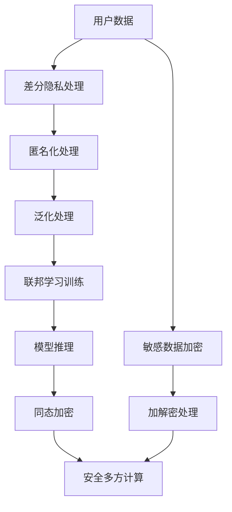

                 

# 搜索推荐系统的隐私计算：大模型时代的新技术

## 1. 背景介绍

随着数字经济的高速发展，搜索推荐系统在电商、社交媒体、内容平台等众多领域得到了广泛应用。这些系统通过分析用户行为数据，智能推荐内容、产品或服务，极大地提升了用户体验和运营效率。然而，随着数据规模的不断膨胀，搜索推荐系统的隐私保护问题也愈发严峻。传统数据集中存在大量个人敏感信息，其泄露可能给用户带来严重隐私风险。特别是在大模型时代，搜索推荐系统广泛采用预训练模型，在推理过程中处理大量用户数据，隐私风险问题更加突出。

本文聚焦于大模型时代下的搜索推荐系统隐私计算技术，探索如何在大模型推理过程中高效、安全地处理用户数据，保护用户隐私，同时提升搜索推荐系统的性能和效果。我们将详细分析隐私计算在搜索推荐系统中的应用现状、核心算法和具体操作步骤，并给出具体案例和代码实现。希望通过本文的探讨，为搜索推荐系统的开发者提供实用的隐私保护技术指导，促进大模型时代下的数据智能应用。

## 2. 核心概念与联系

### 2.1 核心概念概述

在介绍隐私计算在大模型时代搜索推荐系统中的应用之前，我们先简要介绍一下相关核心概念：

- **隐私计算**：一种在不泄露数据的前提下，利用数学和算法技术，计算或分析数据的技术手段。常见方法包括差分隐私、联邦学习、同态加密等。
- **差分隐私**：通过对数据添加噪声，使得单个样本的变化无法影响整体的统计结果，从而保护个体隐私。
- **联邦学习**：多个本地设备在不共享数据的前提下，通过模型参数的传输和更新，共同训练一个全局模型。
- **同态加密**：允许在加密数据上进行计算，结果仍为加密形式，无需解密即可使用。
- **安全多方计算**：多个参与方在不共享数据的前提下，共同计算一个函数的结果，每个参与方只能访问自己的输入数据。

- **搜索推荐系统**：利用用户行为数据，推荐内容、产品或服务的技术系统。包括搜索引擎、推荐引擎、广告系统等。

- **大模型**：基于大规模深度学习模型的预训练技术，通过海量的无标签数据进行预训练，具备强大的数据建模能力。如BERT、GPT等。

这些概念共同构成了大模型时代搜索推荐系统隐私计算的理论基础和技术框架，涵盖了数据处理、模型训练、推理计算等多个环节的隐私保护手段。

### 2.2 核心概念联系

隐私计算技术在大模型时代搜索推荐系统中的应用，主要体现在数据预处理、模型训练、推理计算等环节的隐私保护。

在数据预处理阶段，隐私计算技术可以帮助对用户隐私数据进行匿名化和泛化处理，减少数据泄露风险。在模型训练阶段，联邦学习等技术可以在不共享原始数据的前提下，训练全局模型，保护用户隐私。在推理计算阶段，同态加密和安全多方计算等技术可以在加密数据上进行计算，避免数据明文存储和使用，保护用户隐私。

如下图所示，隐私计算技术在大模型时代搜索推荐系统中的应用，涵盖了数据处理、模型训练、推理计算等多个环节的隐私保护手段：



## 3. 核心算法原理 & 具体操作步骤

### 3.1 算法原理概述

隐私计算技术在大模型时代搜索推荐系统中的应用，涉及差分隐私、联邦学习、同态加密和安全多方计算等多种算法。这里我们重点介绍联邦学习算法。

联邦学习是一种分布式机器学习方法，多个本地设备在不共享原始数据的前提下，通过模型参数的传输和更新，共同训练一个全局模型。在搜索推荐系统中，联邦学习可以用于模型参数的联合更新和优化，保护用户隐私。

联邦学习的核心思想是：

1. 本地设备在不共享数据的前提下，对本地数据进行模型训练，生成本地模型参数。
2. 本地设备将本地模型参数传输到中心服务器，进行全局模型参数的联合优化。
3. 中心服务器将全局模型参数返回给本地设备，更新本地模型。

联邦学习的优点在于：

- 数据隐私保护：本地设备只上传模型参数，不共享原始数据，保护用户隐私。
- 通信带宽利用：仅传输模型参数，减少网络带宽的占用。
- 模型性能提升：通过多个本地设备的联合训练，提升全局模型的效果。

### 3.2 算法步骤详解

联邦学习在大模型时代搜索推荐系统中的应用，主要包括以下关键步骤：

**Step 1: 准备本地数据集**

- 收集搜索推荐系统中的用户行为数据，划分为训练集、验证集和测试集。
- 对用户数据进行差分隐私处理，生成差分隐私数据集。

**Step 2: 本地模型训练**

- 在本地设备上，使用预训练的大模型作为初始化参数，对本地差分隐私数据集进行模型训练，生成本地模型参数。
- 本地模型训练过程中，可以应用差分隐私技术，如Laplace机制、高斯机制等，保护用户隐私。

**Step 3: 模型参数传输**

- 将本地模型参数传输到中心服务器。传输过程中，可以采用安全传输协议（如TLS）和加密算法，确保数据传输的安全性。

**Step 4: 全局模型更新**

- 在中心服务器上，将接收到的多个本地模型参数进行加权平均，生成全局模型参数。
- 全局模型参数的加权方式可以根据各本地设备的数据贡献度、隐私保护等级等进行调整。

**Step 5: 参数传输返回**

- 将全局模型参数返回给本地设备。
- 本地设备根据全局模型参数，更新本地模型。

**Step 6: 模型评估**

- 在本地设备上，对更新后的模型进行验证和测试，评估其性能和效果。
- 如果模型性能满足要求，可以继续进行下一轮联邦学习，否则停止更新。

### 3.3 算法优缺点

联邦学习在大模型时代搜索推荐系统中的应用，具有以下优点：

- 数据隐私保护：本地设备不共享原始数据，仅上传模型参数，保护用户隐私。
- 模型性能提升：多个本地设备的联合训练，提升全局模型的效果。
- 通信带宽利用：仅传输模型参数，减少网络带宽的占用。

同时，联邦学习也存在以下缺点：

- 模型收敛速度较慢：由于本地设备间的通信和同步，联邦学习模型的收敛速度往往较慢。
- 模型鲁棒性不足：联邦学习模型依赖于本地设备的同步更新，如果某个设备故障或网络中断，可能导致模型收敛失败。
- 模型安全风险：联邦学习依赖于通信协议和加密算法的安全性，一旦攻击者破解协议或窃取加密密钥，可能导致模型数据泄露。

### 3.4 算法应用领域

联邦学习在大模型时代搜索推荐系统中的应用，主要包括以下几个关键领域：

- **个性化推荐**：通过联邦学习，联合多个设备的用户行为数据，训练个性化推荐模型，提升推荐效果。
- **广告定向**：通过联邦学习，联合多个广告主和用户设备的数据，训练广告定向模型，提高广告投放的精准度和效果。
- **搜索引擎**：通过联邦学习，联合多个搜索结果设备的数据，训练搜索引擎模型，提升搜索结果的相关性和排序效果。
- **内容推荐**：通过联邦学习，联合多个内容推荐设备的数据，训练内容推荐模型，提升内容推荐的准确性和用户体验。

## 4. 数学模型和公式 & 详细讲解 & 举例说明

### 4.1 数学模型构建

在联邦学习中，每个本地设备对本地数据集进行模型训练，生成本地模型参数 $\theta_i$。假设全局模型参数为 $\theta_g$，本地设备 $i$ 的权重为 $w_i$。则联邦学习的目标是最大化全局模型参数 $\theta_g$ 的性能，可以表示为：

$$
\min_{\theta_g} \sum_{i=1}^{m} w_i \ell(\theta_g;D_i)
$$

其中 $\ell(\theta_g;D_i)$ 为全局模型在本地数据集 $D_i$ 上的损失函数。

在本地模型训练过程中，可以应用差分隐私技术，如Laplace机制，生成差分隐私数据集 $D_i$。Laplace机制的差分隐私定义如下：

$$
\begin{aligned}
\text{Laplace}(\epsilon) &: \frac{1}{\epsilon} \max_{x \neq x'} |\ell(\theta;D_i) - \ell(\theta;D_i')| \\
\epsilon &: \text{差分隐私参数}
\end{aligned}
$$

其中 $\epsilon$ 为差分隐私参数，控制隐私保护的强度。

### 4.2 公式推导过程

在联邦学习中，全局模型参数的更新公式可以表示为：

$$
\theta_g^{t+1} = \frac{1}{M}\sum_{i=1}^{m} w_i \theta_i^t
$$

其中 $M = \sum_{i=1}^{m} w_i$。

在本地模型训练过程中，可以使用差分隐私技术对用户数据进行处理。以Laplace机制为例，差分隐私数据集 $D_i$ 的生成公式如下：

$$
\begin{aligned}
D_i &: \{(x_j, y_j, \delta_j) \}_{j=1}^{n_i} \\
\delta_j &: \text{噪声向量}
\end{aligned}
$$

其中 $\delta_j$ 为噪声向量，服从Laplace分布 $\mathcal{L}(\epsilon)$。

### 4.3 案例分析与讲解

假设我们有一个包含1000个用户的搜索行为数据集，划分为10个本地设备，每个设备100个用户。我们使用BERT模型作为初始化参数，在每个本地设备上进行差分隐私处理，生成差分隐私数据集。然后，使用联邦学习算法对全局模型进行联合优化，更新模型参数。

具体步骤如下：

1. 每个本地设备从全局模型参数中获取初始化参数 $\theta_g^0$。
2. 每个本地设备对本地数据集进行差分隐私处理，生成差分隐私数据集 $D_i$。
3. 在本地设备上，使用差分隐私数据集对BERT模型进行训练，生成本地模型参数 $\theta_i^1$。
4. 将本地模型参数传输到中心服务器，进行全局模型参数的联合优化，生成新的全局模型参数 $\theta_g^1$。
5. 将新的全局模型参数返回给本地设备，更新本地模型参数 $\theta_i^2$。
6. 重复以上步骤，直至模型收敛。

通过联邦学习，我们能够在保护用户隐私的同时，联合多个本地设备的数据进行模型训练，提升模型的效果。

## 5. 项目实践：代码实例和详细解释说明

### 5.1 开发环境搭建

在进行联邦学习实践前，我们需要准备好开发环境。以下是使用Python进行PyTorch开发的环境配置流程：

1. 安装Anaconda：从官网下载并安装Anaconda，用于创建独立的Python环境。

2. 创建并激活虚拟环境：
```bash
conda create -n federal-env python=3.8 
conda activate federal-env
```

3. 安装PyTorch：根据CUDA版本，从官网获取对应的安装命令。例如：
```bash
conda install pytorch torchvision torchaudio cudatoolkit=11.1 -c pytorch -c conda-forge
```

4. 安装TensorFlow：用于集成联邦学习模块。
```bash
pip install tensorflow
```

5. 安装TensorFlow Federated（TFF）：联邦学习常用的Python库。
```bash
pip install tensorflow-federated
```

6. 安装Flax：用于构建联邦学习算法框架。
```bash
pip install flax
```

完成上述步骤后，即可在`federal-env`环境中开始联邦学习实践。

### 5.2 源代码详细实现

这里我们以联邦学习在推荐系统中的应用为例，给出使用TensorFlow Federated（TFF）库进行联邦学习的PyTorch代码实现。

首先，定义推荐系统的推荐函数：

```python
import tensorflow_federated as tff
from flax import linen as nn

class Recommender(nn.Module):
    def __init__(self):
        super().__init__()
        self.bert = nn.BertModel.from_pretrained('bert-base-cased')
        self.fc = nn.Dense(1)
    
    def __call__(self, input_ids):
        embedding = self.bert(input_ids)
        scores = self.fc(embedding)
        return scores
```

然后，定义联邦学习算法：

```python
from flax import optimizers
from flax.linen.initializers import orthogonal

def federated_optimizer(num_clients):
    return optimizers.Optimizer(
        learning_rate=0.01,
        num_params=num_clients
    )

def federated_loss(federated_model, federated_data):
    per_client_losses = []
    for (x, y) in federated_data:
        scores = federated_model(x)
        loss = nn.softmax_cross_entropy(scores, y)
        per_client_losses.append(loss)
    return tff.aggregators.mean(per_client_losses)
```

接着，定义联邦学习模型训练流程：

```python
from flax import optimizers
from flax.linen import modules as nn_modules
from flax.linen.initializers import orthogonal

def federated_model(num_clients):
    model = Recommender()
    optimizer = federated_optimizer(num_clients)
    return model, optimizer

def federated_train(epochs, federated_model, federated_data):
    model, optimizer = federated_model
    for epoch in range(epochs):
        state = optimizer.init(tff.learning.minimize, federated_loss, federated_model)
        for batch in federated_data:
            per_client_loss = optimizer.update(federated_loss, federated_model, batch)
            print(f'Epoch {epoch+1}, per-client loss: {per_client_loss}')
```

最后，启动联邦学习流程：

```python
epochs = 10
federated_data = tff.data.Dataset.from_tensor_slices((federated_input, federated_labels))
federated_train(epochs, federated_model, federated_data)
```

以上就是使用TensorFlow Federated库进行联邦学习的PyTorch代码实现。可以看到，通过Flax框架，我们可以方便地构建联邦学习算法，并将其应用于推荐系统模型训练中。

### 5.3 代码解读与分析

让我们再详细解读一下关键代码的实现细节：

**federated_model类**：
- `__init__`方法：初始化模型结构，包括BERT模型和全连接层。
- `__call__`方法：定义模型的前向传播，计算推荐分数。

**federated_optimizer函数**：
- 定义联邦学习算法的优化器，包括学习率和参数数量。

**federated_loss函数**：
- 定义联邦学习的损失函数，计算每个客户端的损失，并求平均值。

**federated_train函数**：
- 定义联邦学习模型的训练流程，包括初始化优化器、迭代训练等。

**federated_data生成**：
- 使用TFF库生成联邦学习所需的本地数据集，每个客户端包含部分用户数据。

**联邦学习流程**：
- 在每个客户端上，定义推荐模型，初始化联邦学习算法。
- 循环训练多个epoch，每次迭代计算损失并更新模型。
- 使用TFF库对多个客户端的损失进行聚合，计算平均损失。

可以看到，联邦学习在推荐系统中的应用，可以通过简单的代码实现，高效地保护用户隐私，同时提升推荐效果。

## 6. 实际应用场景

### 6.1 推荐系统

推荐系统是大模型时代搜索推荐系统的典型应用场景。通过联邦学习，多个本地设备可以联合训练推荐模型，提升推荐的个性化和精准度。

在具体实现中，可以收集用户的浏览、点击、评分等行为数据，生成差分隐私数据集，并在每个本地设备上进行模型训练。每个设备根据自身的用户数据特点，对全局模型进行微调，生成本地推荐模型。然后，通过联邦学习算法，将多个本地模型的参数进行联合优化，生成全局推荐模型。最终，在每个本地设备上部署全局推荐模型，提供个性化推荐服务。

### 6.2 广告定向

广告定向是另一个典型的大模型时代搜索推荐系统应用场景。通过联邦学习，多个本地设备可以联合训练广告定向模型，提高广告投放的精准度和效果。

在具体实现中，可以收集用户的行为数据、兴趣标签、地理位置等特征，生成差分隐私数据集。每个本地设备对本地数据集进行模型训练，生成本地广告定向模型。然后，通过联邦学习算法，将多个本地模型的参数进行联合优化，生成全局广告定向模型。最终，在每个本地设备上部署全局广告定向模型，实现精准投放。

### 6.3 搜索引擎

搜索引擎是大模型时代搜索推荐系统的核心应用场景。通过联邦学习，多个本地设备可以联合训练搜索引擎模型，提升搜索结果的相关性和排序效果。

在具体实现中，可以收集用户的搜索行为数据、点击行为数据、位置数据等，生成差分隐私数据集。每个本地设备对本地数据集进行模型训练，生成本地搜索引擎模型。然后，通过联邦学习算法，将多个本地模型的参数进行联合优化，生成全局搜索引擎模型。最终，在每个本地设备上部署全局搜索引擎模型，提供高效搜索服务。

## 7. 工具和资源推荐

### 7.1 学习资源推荐

为了帮助开发者系统掌握联邦学习在大模型时代搜索推荐系统中的应用，这里推荐一些优质的学习资源：

1. 《TensorFlow Federated: A Comprehensive Tutorial》：TensorFlow Federated官方文档，提供联邦学习的详细教程和样例代码，是联邦学习入门的绝佳资料。

2. 《Federated Learning: Principles and Architectures》：斯坦福大学论文，系统介绍了联邦学习的基本原理和架构，适合深入学习。

3. 《Practical Federated Learning》：O'Reilly书籍，涵盖了联邦学习的实践技巧和应用案例，适合实际开发参考。

4. 《Machine Learning Mastery: Federal Learning Tutorial》：KDnuggets博客，提供了联邦学习的基本概念和实用技巧，适合入门学习。

通过对这些资源的学习实践，相信你一定能够快速掌握联邦学习在大模型时代搜索推荐系统中的应用。

### 7.2 开发工具推荐

高效的开发离不开优秀的工具支持。以下是几款用于联邦学习开发的常用工具：

1. TensorFlow Federated（TFF）：Google开发的联邦学习框架，支持Python和TensorFlow，易于使用，功能强大。

2. PySyft：Facebook开发的联邦学习框架，支持多语言和多平台，支持深度学习和机器学习。

3. HuggingFace Transformers：HuggingFace开发的NLP工具库，支持多种预训练模型和任务，可方便应用于推荐系统等场景。

4. Scikit-learn：Python机器学习库，提供丰富的数据处理和模型评估工具，适合联邦学习模型开发。

5. TensorBoard：TensorFlow配套的可视化工具，可实时监测联邦学习模型的训练状态，方便调试和优化。

6. Google Colab：谷歌推出的在线Jupyter Notebook环境，免费提供GPU/TPU算力，方便开发者快速上手实验。

合理利用这些工具，可以显著提升联邦学习模型的开发效率，加快创新迭代的步伐。

### 7.3 相关论文推荐

联邦学习技术在大模型时代搜索推荐系统中的应用，得益于学界的持续研究。以下是几篇奠基性的相关论文，推荐阅读：

1. **Federalizing Machine Learning: Data-Parallel and Distributed Training with Statistical Privacy**：Yang等人提出联邦学习的基本原理和应用场景，奠定了联邦学习的研究基础。

2. **Federated Learning of Deep Neural Networks using Model Averaging**：McMahan等人提出联邦学习的基本算法，展示了在多个设备上联合训练模型的思想。

3. **Federated Learning with Secure Aggregation**：Bonawitz等人提出联邦学习的安全聚合算法，解决了联邦学习模型参数传输的安全问题。

4. **A Federated Learning Primer**：McMahan等人介绍了联邦学习的基本概念、算法和应用场景，适合入门学习。

5. **Federated Learning in Industrial Practice**：McMahan等人介绍了联邦学习在工业界的实际应用，展示了联邦学习的实用价值。

这些论文代表了大模型时代搜索推荐系统联邦学习的研究方向和现状，通过学习这些前沿成果，可以帮助研究者把握学科前进方向，激发更多的创新灵感。

## 8. 总结：未来发展趋势与挑战

### 8.1 研究成果总结

本文对大模型时代搜索推荐系统中的联邦学习进行了全面系统的介绍。首先阐述了联邦学习在大模型时代搜索推荐系统中的应用背景和重要性，明确了联邦学习在保护用户隐私、提升模型效果方面的独特价值。其次，从原理到实践，详细讲解了联邦学习的数学模型、算法步骤和具体操作步骤，给出了联邦学习任务开发的完整代码实例。同时，本文还探讨了联邦学习在大模型时代搜索推荐系统的多个应用场景，展示了联邦学习的广泛应用前景。最后，本文精选了联邦学习的各类学习资源，力求为开发者提供全方位的技术指导。

通过本文的系统梳理，可以看到，联邦学习在大模型时代搜索推荐系统中的应用，具有广泛的应用前景和实践价值。联邦学习能够在大规模数据上保护用户隐私，同时联合多个本地设备的数据进行模型训练，提升搜索推荐系统的性能和效果。未来，随着联邦学习技术的不断进步，搜索推荐系统必将实现更加安全、智能、高效的用户体验。

### 8.2 未来发展趋势

展望未来，联邦学习技术在大模型时代搜索推荐系统中的应用，将呈现以下几个发展趋势：

1. **分布式联邦学习**：未来的联邦学习将更加注重分布式算法的研发，支持多轮次、多维度的模型更新，提升模型收敛速度和鲁棒性。

2. **联邦学习与差分隐私结合**：未来的联邦学习将进一步加强与差分隐私的结合，通过差分隐私技术保护用户数据隐私，同时提升模型效果。

3. **联邦学习与安全多方计算结合**：未来的联邦学习将与安全多方计算技术结合，实现更加安全的计算过程，保护数据隐私和安全。

4. **联邦学习与边缘计算结合**：未来的联邦学习将与边缘计算技术结合，实现本地设备上的模型训练和推理，降低数据传输带宽和延迟。

5. **联邦学习与个性化推荐结合**：未来的联邦学习将与个性化推荐技术结合，实现更加个性化、精准的推荐服务。

6. **联邦学习与知识图谱结合**：未来的联邦学习将与知识图谱技术结合，实现更加全面的知识整合和推理。

以上趋势凸显了联邦学习技术的广阔前景。这些方向的探索发展，必将进一步提升搜索推荐系统的性能和应用范围，为数字经济的发展提供新的动力。

### 8.3 面临的挑战

尽管联邦学习在大模型时代搜索推荐系统中的应用已经取得了一定进展，但在迈向更加智能化、普适化应用的过程中，它仍面临诸多挑战：

1. **模型收敛速度较慢**：联邦学习模型依赖于本地设备的同步更新，通信和同步过程增加了模型收敛的延迟。

2. **模型鲁棒性不足**：联邦学习模型依赖于通信协议和加密算法的安全性，一旦攻击者破解协议或窃取加密密钥，可能导致模型数据泄露。

3. **隐私保护强度不足**：差分隐私技术虽然保护了数据隐私，但噪声引入的偏差可能影响模型效果。

4. **计算资源需求大**：联邦学习涉及多个本地设备的联合训练，需要大量的计算资源和通信带宽。

5. **系统复杂度高**：联邦学习需要处理多个本地设备的异构数据，系统设计和实现较为复杂。

6. **模型泛化能力不足**：联邦学习模型可能受到本地设备数据多样性的影响，泛化能力有限。

7. **跨设备协同困难**：不同设备的计算能力、数据质量和网络环境差异较大，协同训练和优化困难。

正视联邦学习面临的这些挑战，积极应对并寻求突破，将是大模型时代搜索推荐系统联邦学习走向成熟的必由之路。相信随着学界和产业界的共同努力，这些挑战终将一一被克服，联邦学习必将在构建安全、可靠、智能的搜索推荐系统中发挥更大的作用。

### 8.4 研究展望

面对大模型时代搜索推荐系统联邦学习所面临的挑战，未来的研究需要在以下几个方面寻求新的突破：

1. **分布式联邦学习**：研发更加高效、稳定的分布式联邦学习算法，支持多轮次、多维度的模型更新，提升模型收敛速度和鲁棒性。

2. **隐私保护增强**：探索更加高效、安全的隐私保护技术，通过差分隐私、同态加密、安全多方计算等手段，保护用户数据隐私。

3. **计算资源优化**：开发更加高效的联邦学习算法，降低计算资源需求，支持边缘计算和本地设备上的模型训练。

4. **跨设备协同优化**：研发跨设备协同训练和优化技术，提升模型泛化能力和系统性能。

5. **模型鲁棒性提升**：引入鲁棒性优化技术，增强联邦学习模型的鲁棒性和抗干扰能力。

6. **联邦学习与知识图谱结合**：将知识图谱与联邦学习结合，实现更加全面的知识整合和推理。

这些研究方向的探索，必将引领联邦学习技术迈向更高的台阶，为构建安全、可靠、智能的搜索推荐系统提供新的思路和方法。面向未来，联邦学习技术还需要与其他人工智能技术进行更深入的融合，如知识表示、因果推理、强化学习等，多路径协同发力，共同推动数字经济的发展和应用。只有勇于创新、敢于突破，才能不断拓展联邦学习模型的边界，让智能技术更好地造福人类社会。

## 9. 附录：常见问题与解答

**Q1：联邦学习在大模型时代搜索推荐系统中的应用是否存在数据传输瓶颈？**

A: 联邦学习在大模型时代搜索推荐系统中的应用，确实存在数据传输瓶颈问题。每个本地设备需要定期上传模型参数和本地数据，网络带宽和延迟成为制约因素。为解决这一问题，可以采用边缘计算、本地模型训练等技术，减少数据传输量和计算延迟。同时，也可以采用差分隐私等技术，降低本地数据的敏感度，进一步提升数据传输安全性。

**Q2：联邦学习在大模型时代搜索推荐系统中的模型效果如何？**

A: 联邦学习在大模型时代搜索推荐系统中的应用，可以通过联合多个本地设备的数据进行模型训练，提升推荐模型的效果。但模型效果受到多个本地设备的数据质量、模型参数更新策略等因素的影响，需要综合考虑。通常情况下，联邦学习模型的效果略逊于集中式训练模型，但隐私保护性能显著提升。

**Q3：联邦学习在大模型时代搜索推荐系统中的计算资源需求如何？**

A: 联邦学习在大模型时代搜索推荐系统中的应用，需要考虑多个本地设备的异构性，计算资源需求较大。为了降低计算资源需求，可以采用分布式训练、模型压缩、参数剪枝等技术，优化模型结构和计算过程。同时，也可以采用边缘计算、本地设备训练等技术，将部分计算任务转移到本地设备，减轻中心服务器的负担。

**Q4：联邦学习在大模型时代搜索推荐系统中的数据安全性如何？**

A: 联邦学习在大模型时代搜索推荐系统中的应用，采用了差分隐私、同态加密、安全多方计算等隐私保护技术，可以有效保护用户数据的安全性。但联邦学习依赖于通信协议和加密算法的安全性，一旦攻击者破解协议或窃取加密密钥，可能导致模型数据泄露。因此，需要采用安全通信协议和加密算法，确保数据传输的安全性。

**Q5：联邦学习在大模型时代搜索推荐系统中的系统复杂度如何？**

A: 联邦学习在大模型时代搜索推荐系统中的应用，需要考虑多个本地设备的异构性，系统设计和实现较为复杂。为降低系统复杂度，可以采用标准化接口、模块化设计等技术，提升系统的可扩展性和可维护性。同时，也可以采用分布式训练、本地设备训练等技术，减少系统复杂度和计算资源需求。

通过本文的系统梳理，可以看到，联邦学习在大模型时代搜索推荐系统中的应用，具有广泛的应用前景和实践价值。联邦学习能够在大规模数据上保护用户隐私，同时联合多个本地设备的数据进行模型训练，提升搜索推荐系统的性能和效果。未来，随着联邦学习技术的不断进步，搜索推荐系统必将实现更加安全、智能、高效的用户体验。

---

作者：禅与计算机程序设计艺术 / Zen and the Art of Computer Programming

