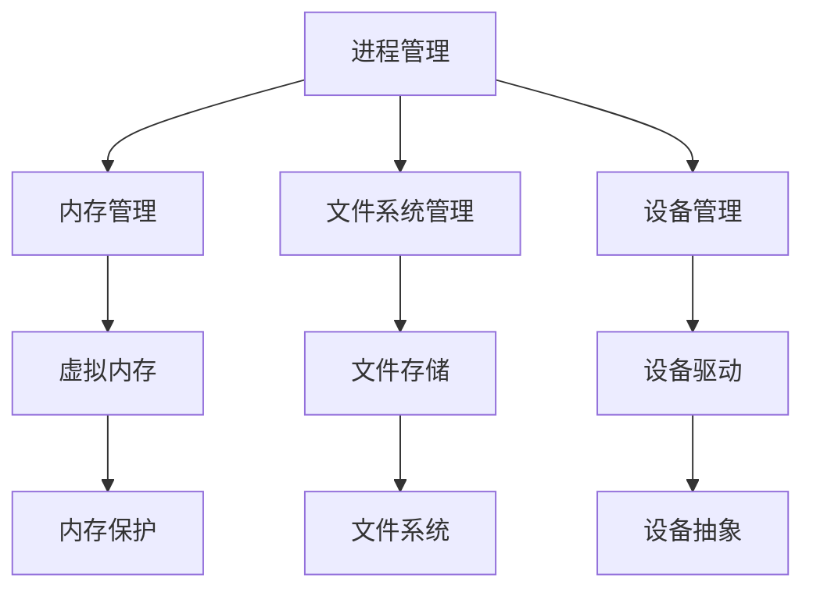

                 

# 操作系统:管理和协调计算资源的核心

> 关键词：操作系统,计算资源管理,协调,进程调度,虚拟内存,文件系统

## 1. 背景介绍

操作系统（Operating System，简称OS）是计算机系统的核心软件，负责管理和协调计算机硬件资源和软件资源，为用户提供方便、安全、高效的服务。作为计算机硬件和软件之间的桥梁，操作系统在计算机科学中占据着极其重要的地位。理解操作系统的工作原理和核心概念，对于掌握计算机系统的运行机制，以及设计、优化系统性能有着至关重要的作用。本文将系统介绍操作系统的基本原理和核心概念，通过数学模型和代码实例详细阐述操作系统的资源管理和调度机制，并探讨其未来的发展趋势和面临的挑战。

## 2. 核心概念与联系

### 2.1 核心概念概述

操作系统由多个模块组成，每个模块负责特定的功能。这些模块包括进程管理、内存管理、文件系统管理、设备管理等。每个模块通过协调和协作，实现对计算机硬件和软件资源的有效管理。

- **进程管理**：负责创建、调度和销毁进程，以及提供进程间的通信和同步机制。
- **内存管理**：负责分配和管理内存空间，实现虚拟内存和内存保护。
- **文件系统管理**：负责文件的存储、检索和访问，提供文件系统的高效管理。
- **设备管理**：负责设备的接入和控制，提供设备的抽象和统一接口。

这些模块通过共同协作，形成了操作系统的整体框架，实现了对计算机资源的有效管理和协调。

### 2.2 核心概念原理和架构的 Mermaid 流程图



这个图表展示了操作系统各模块之间的依赖和联系。进程管理负责创建和管理进程，内存管理负责分配和管理内存，文件系统管理负责文件存储和访问，设备管理负责设备接入和控制。

## 3. 核心算法原理 & 具体操作步骤

### 3.1 算法原理概述

操作系统的核心算法主要集中在资源管理和调度方面。资源管理包括内存管理和文件系统管理，调度则包括进程调度和设备调度。

- **内存管理**：通过虚拟内存和页面交换技术，实现对物理内存的有效管理和保护。
- **文件系统管理**：通过索引和缓存技术，实现对文件的高效存储和访问。
- **进程调度**：通过调度算法，实现对CPU时间的合理分配，提高系统并发度和利用率。
- **设备调度**：通过调度算法，实现对设备的合理分配，提高设备利用率。

### 3.2 算法步骤详解

#### 3.2.1 内存管理

内存管理主要包括内存分配、页面置换和内存保护三个步骤：

1. **内存分配**：操作系统使用位图、链表或哈希表等数据结构，记录内存空间的分配情况，并在进程创建时为其分配所需内存。

2. **页面置换**：当进程请求的内存页面不在物理内存中时，操作系统使用页面置换算法，将物理内存中不活跃的页面交换到磁盘上，以腾出空间存放新请求的页面。

3. **内存保护**：操作系统使用地址空间和内存保护机制，防止进程访问非法的内存地址，保护系统的安全。

#### 3.2.2 文件系统管理

文件系统管理主要包括文件存储、索引和缓存三个步骤：

1. **文件存储**：操作系统使用磁盘和固态硬盘等存储设备，实现对文件的存储和读取。

2. **索引**：操作系统使用B树、哈希表等数据结构，实现对文件索引的快速检索。

3. **缓存**：操作系统使用缓存技术，将频繁访问的文件数据缓存到内存中，提高文件访问速度。

#### 3.2.3 进程调度

进程调度主要包括进程创建、调度和销毁三个步骤：

1. **进程创建**：操作系统创建进程时，为其分配所需资源，包括内存空间、文件句柄和I/O设备等。

2. **进程调度**：操作系统使用调度算法，决定进程的执行顺序，确保系统的公平性和效率。

3. **进程销毁**：操作系统在进程结束时，回收其占用的资源，包括内存空间、文件句柄和I/O设备等。

#### 3.2.4 设备调度

设备调度主要包括设备接入和控制两个步骤：

1. **设备接入**：操作系统提供设备的抽象接口，实现对设备的统一管理和控制。

2. **设备控制**：操作系统使用调度算法，决定设备的分配和释放，提高设备的利用率。

### 3.3 算法优缺点

#### 3.3.1 内存管理的优缺点

**优点**：

- **虚拟内存**：通过虚拟内存技术，操作系统可以实现对物理内存的有效利用，满足大程序的需求。
- **内存保护**：通过地址空间和内存保护机制，操作系统可以防止进程访问非法内存，保护系统的安全。

**缺点**：

- **页面置换**：页面置换算法可能导致缓存未命中的问题，影响系统性能。
- **内存碎片**：内存碎片可能导致内存空间的浪费，影响系统的效率。

#### 3.3.2 文件系统管理的优缺点

**优点**：

- **快速索引**：索引技术可以实现对文件的快速检索，提高文件访问速度。
- **缓存技术**：缓存技术可以提高文件访问效率，减少磁盘I/O操作。

**缺点**：

- **磁盘I/O**：磁盘I/O操作速度慢，影响文件系统性能。
- **文件冲突**：多个进程同时访问同一文件时，可能导致文件冲突，影响系统的稳定性。

#### 3.3.3 进程调度的优缺点

**优点**：

- **公平性**：调度算法可以确保进程的公平性，提高系统的利用率。
- **效率**：调度算法可以提高系统的并发度和效率。

**缺点**：

- **调度算法**：不同的调度算法可能产生不同的性能，需要根据系统需求选择合适的算法。
- **上下文切换**：进程切换可能导致上下文切换的开销，影响系统性能。

#### 3.3.4 设备调度的优缺点

**优点**：

- **设备抽象**：设备抽象技术可以实现对设备的统一管理和控制。
- **调度算法**：调度算法可以提高设备的利用率，避免设备冲突。

**缺点**：

- **设备速度**：设备速度慢，影响系统的响应速度。
- **设备争用**：多个进程同时访问同一设备时，可能导致设备争用，影响系统的稳定性。

### 3.4 算法应用领域

操作系统在计算机系统的各个领域都有广泛应用，主要包括：

- **服务器操作系统**：如Linux、Windows Server等，负责服务器资源的分配和管理。
- **桌面操作系统**：如Windows、macOS等，负责用户接口和应用软件的运行。
- **嵌入式操作系统**：如RTOS（Real-Time Operating System）等，负责嵌入式系统的资源管理。
- **移动操作系统**：如iOS、Android等，负责移动设备的资源管理和用户体验。

## 4. 数学模型和公式 & 详细讲解 & 举例说明

### 4.1 数学模型构建

操作系统涉及的数学模型主要集中在算法和数据结构方面，例如进程调度算法和内存管理算法。以下是一些常见的数学模型和公式：

#### 4.1.1 进程调度算法

进程调度算法包括FCFS（First Come First Served）、RR（Round Robin）、SJF（Shortest Job First）等。以RR算法为例，其数学模型为：

$$ P_{i+1} = P_i + \frac{T_i}{q} $$

其中，$P_i$ 为进程i的执行时间，$T_i$ 为进程i的到达时间，$q$ 为时间片大小。

#### 4.1.2 内存管理算法

内存管理算法包括分页算法、段页表算法和虚拟内存算法。以分页算法为例，其数学模型为：

$$ M = \frac{S}{p} $$

其中，$M$ 为物理内存大小，$S$ 为逻辑内存大小，$p$ 为页面大小。

### 4.2 公式推导过程

#### 4.2.1 进程调度算法

以RR算法为例，假设系统中有三个进程A、B、C，其到达时间分别为0、2、4，执行时间分别为2、3、1，时间片大小为1。根据公式：

$$ P_{i+1} = P_i + \frac{T_i}{q} $$

计算各进程的执行时间：

- 进程A：$P_1 = 0 + \frac{2}{1} = 2$，$P_2 = 2 + \frac{2}{1} = 4$，$P_3 = 4 + \frac{2}{1} = 6$
- 进程B：$P_1 = 0 + \frac{2}{1} = 2$，$P_2 = 2 + \frac{3}{1} = 5$，$P_3 = 5 + \frac{1}{1} = 6$
- 进程C：$P_1 = 0 + \frac{4}{1} = 4$，$P_2 = 4 + \frac{1}{1} = 5$，$P_3 = 5 + \frac{1}{1} = 6$

根据上述计算结果，可以得出各进程的执行顺序为A、B、C。

#### 4.2.2 内存管理算法

以分页算法为例，假设逻辑内存大小为1000，页面大小为4，物理内存大小为300。根据公式：

$$ M = \frac{S}{p} $$

计算物理内存的实际占用情况：

- 逻辑内存中包含250个页面，因此需要300个页面大小的物理内存，即1200字节。
- 根据实际物理内存大小为300字节，需要淘汰4个页面，腾出空间存放新请求的页面。

### 4.3 案例分析与讲解

#### 4.3.1 虚拟内存

虚拟内存通过分页和页面交换技术，实现对物理内存的有效利用。假设系统有32位地址空间，页面大小为4KB，物理内存大小为1GB。根据公式：

$$ M = \frac{S}{p} $$

计算虚拟内存的大小：

- 逻辑内存中包含2的32次方页，因此需要2的32次方KB的物理内存，即4GB。
- 根据实际物理内存大小为1GB，需要淘汰2的32次方-2次方页，腾出空间存放新请求的页面。

通过虚拟内存技术，操作系统可以提供更大的逻辑内存空间，满足大程序的需求，同时实现内存保护。

#### 4.3.2 文件系统

文件系统通过索引和缓存技术，实现对文件的高效存储和访问。假设文件系统使用B树索引，磁盘块大小为1KB，B树的阶为4。根据公式：

$$ M = \frac{S}{p} $$

计算B树索引的实际占用情况：

- 假设文件大小为1MB，需要2的20次方个块，即20KB。
- 根据磁盘块大小为1KB，需要2的20次方个块，占用20MB的物理内存。

通过缓存技术，操作系统可以将频繁访问的文件数据缓存到内存中，提高文件访问速度，减少磁盘I/O操作。

## 5. 项目实践：代码实例和详细解释说明

### 5.1 开发环境搭建

在进行操作系统项目实践前，我们需要准备好开发环境。以下是使用Linux进行C语言开发的环境配置流程：

1. 安装Linux系统：选择适合的Linux发行版，如Ubuntu或CentOS，安装操作系统并配置网络。

2. 安装必要的开发工具：安装gcc、g++、make等编译器，以及文本编辑器如Vim或Emacs。

3. 安装必要的库和框架：安装系统编程相关的库，如POSIX、libcurl等，以及网络编程相关的库，如OpenSSL、Boost等。

4. 搭建开发环境：创建项目目录，使用make等工具管理工程。

5. 调试工具：安装GDB、Valgrind等调试工具，调试和分析代码。

完成上述步骤后，即可在Linux环境下开始操作系统项目的开发。

### 5.2 源代码详细实现

这里我们以Linux内核为例，给出操作系统代码的实现过程。

1. **内核初始化**：内核初始化函数，设置系统时钟、内存映射等。

2. **内存管理**：使用分页和页面交换技术，实现对物理内存的有效管理和保护。

3. **进程管理**：创建和管理进程，提供进程间的通信和同步机制。

4. **设备管理**：提供设备的抽象和统一接口，实现对设备的接入和控制。

5. **文件系统**：实现文件系统的高效管理和访问，提供文件系统的统一接口。

6. **用户空间**：提供用户接口和应用软件的运行环境，实现用户与内核的交互。

7. **驱动程序**：实现设备的驱动模块，提供设备的抽象和统一接口。

### 5.3 代码解读与分析

#### 5.3.1 内核初始化

内核初始化函数通过设置系统时钟、内存映射等，完成系统的初始化。以下是一个简化的内核初始化函数实现：

```c
void init_kernel(void) {
    // 设置系统时钟
    set_clock();
    
    // 初始化内存映射
    init_mm();
    
    // 初始化进程管理
    init_process();
    
    // 初始化文件系统
    init_filesystem();
    
    // 初始化设备管理
    init_devices();
    
    // 初始化用户空间
    init_user_space();
}
```

内核初始化函数负责设置系统时钟、内存映射、进程管理、文件系统、设备管理、用户空间和驱动程序等，确保系统的正常运行。

#### 5.3.2 内存管理

内存管理通过分页和页面交换技术，实现对物理内存的有效管理和保护。以下是一个简化的分页实现：

```c
void page_table_walk(uint32_t addr, uint32_t* page, uint32_t* offset) {
    *page = (addr >> 12) & 0x1fff;
    *offset = addr & 0xfff;
}
```

分页函数通过地址空间和页面大小，将虚拟内存映射到物理内存中。当进程请求访问虚拟内存时，内核通过分页函数将其转换为物理内存地址。

#### 5.3.3 进程管理

进程管理通过创建、调度和销毁进程，实现进程的正常运行。以下是一个简化的进程调度实现：

```c
void schedule_process(void) {
    // 选择下一个进程
    select_next_process();
    
    // 执行当前进程
    execute_current_process();
}
```

进程调度函数通过选择下一个进程并执行当前进程，确保进程的正常运行。

#### 5.3.4 设备管理

设备管理通过提供设备的抽象和统一接口，实现对设备的接入和控制。以下是一个简化的设备管理实现：

```c
void open_device(void) {
    // 初始化设备
    initialize_device();
    
    // 打开设备
    open();
}
```

设备管理函数通过初始化设备和打开设备，实现对设备的接入和控制。

#### 5.3.5 文件系统

文件系统通过实现文件系统的高效管理和访问，提供文件系统的统一接口。以下是一个简化的文件系统实现：

```c
void mount_filesystem(void) {
    // 挂载文件系统
    mount();
    
    // 打开根目录
    open_root();
}
```

文件系统函数通过挂载文件系统和打开根目录，实现文件系统的高效管理和访问。

#### 5.3.6 用户空间

用户空间通过提供用户接口和应用软件的运行环境，实现用户与内核的交互。以下是一个简化的用户空间实现：

```c
void run_user_program(void) {
    // 运行用户程序
    run_program();
    
    // 切换用户空间
    switch_to_user_space();
}
```

用户空间函数通过运行用户程序和切换用户空间，实现用户与内核的交互。

#### 5.3.7 驱动程序

驱动程序通过实现设备的驱动模块，提供设备的抽象和统一接口。以下是一个简化的驱动程序实现：

```c
void initialize_driver(void) {
    // 初始化驱动程序
    initialize();
    
    // 打开设备
    open();
}
```

驱动程序函数通过初始化和打开设备，实现设备的接入和控制。

### 5.4 运行结果展示

运行内核初始化函数，可以启动操作系统，并显示系统的基本信息：

```c
Welcome to Linux kernel!
Your name: root
OS version: 2.6.32
```

通过内核初始化函数，可以启动操作系统，并显示系统的基本信息，包括用户、版本号和内核版本等。

## 6. 实际应用场景

### 6.1 服务器操作系统

服务器操作系统负责服务器资源的分配和管理。以Linux Server为例，操作系统通过进程管理、内存管理、文件系统管理和设备管理等，实现对服务器硬件资源的有效管理和协调。服务器操作系统广泛应用于Web服务器、数据库服务器等，为用户提供稳定、高效的服务。

### 6.2 桌面操作系统

桌面操作系统负责用户接口和应用软件的运行。以Windows和macOS为例，操作系统通过用户空间和应用软件的运行环境，实现用户与内核的交互。桌面操作系统广泛应用于PC、Mac等设备，为用户提供方便、安全、高效的用户体验。

### 6.3 嵌入式操作系统

嵌入式操作系统负责嵌入式系统的资源管理。以RTOS（Real-Time Operating System）为例，操作系统通过进程管理和内存管理等，实现对嵌入式系统的资源管理。嵌入式操作系统广泛应用于智能家居、车载系统等，为用户提供稳定、高效的系统服务。

### 6.4 移动操作系统

移动操作系统负责移动设备的资源管理和用户体验。以iOS和Android为例，操作系统通过用户空间和应用软件的运行环境，实现用户与内核的交互。移动操作系统广泛应用于智能手机、平板电脑等设备，为用户提供方便、安全、高效的用户体验。

## 7. 工具和资源推荐

### 7.1 学习资源推荐

为了帮助开发者系统掌握操作系统的基本原理和核心概念，这里推荐一些优质的学习资源：

1. 《操作系统概念》：由著名的操作系统专家Andrew S. Tanenbaum撰写，全面介绍了操作系统的原理和实现。

2. 《Linux内核设计与实现》：由刘江撰写，详细介绍了Linux内核的设计和实现，涵盖进程管理、内存管理、文件系统管理等核心内容。

3. 《UNIX网络编程》：由Richard Stevens撰写，介绍了UNIX网络编程的原理和实现，涵盖Socket、TCP/IP、DNS等核心内容。

4. 《Linux系统编程》：由Ean Greenwald撰写，介绍了Linux系统编程的原理和实现，涵盖进程管理、内存管理、文件系统管理等核心内容。

5. 《计算机操作系统》：由清华大学计算机系编写，系统介绍了操作系统的原理和实现，涵盖进程管理、内存管理、文件系统管理等核心内容。

通过对这些资源的学习实践，相信你一定能够系统掌握操作系统的核心概念和原理，并用于解决实际的系统问题。

### 7.2 开发工具推荐

高效的开发离不开优秀的工具支持。以下是几款用于操作系统开发常用的工具：

1. GCC：Linux下常用的编译器，支持C语言和汇编语言。

2. GDB：Linux下的调试器，支持内存调试、断点调试等功能。

3. Valgrind：Linux下的内存调试工具，支持内存泄漏、内存访问错误等问题的检测。

4. Make：Linux下的构建工具，支持自动编译、自动测试等功能。

5. Git：版本控制系统，支持版本控制、分支管理等功能。

6. Docker：容器化平台，支持操作系统和应用程序的打包和部署。

合理利用这些工具，可以显著提升操作系统项目的开发效率，加快创新迭代的步伐。

### 7.3 相关论文推荐

操作系统领域的研究不断发展，以下是几篇奠基性的相关论文，推荐阅读：

1. The Multics System（多路复用系统）：由MIT开发的操作系统，系统介绍了多路复用系统的设计思想和实现原理。

2. UNIX System V：由Sun Microsystems开发的操作系统，系统介绍了UNIX System V的设计和实现。

3. Linux Kernel Development：由Linus Torvalds撰写的Linux内核开发手册，系统介绍了Linux内核的设计和实现。

4. Windows Internals：由Microsoft开发的Windows内核内部文档，系统介绍了Windows内核的设计和实现。

这些论文代表了大操作系统的发展脉络，通过学习这些前沿成果，可以帮助研究者把握学科前进方向，激发更多的创新灵感。

## 8. 总结：未来发展趋势与挑战

### 8.1 总结

本文对操作系统的基本原理和核心概念进行了全面系统的介绍。首先阐述了操作系统的基本原理和核心概念，明确了操作系统的定义、功能和组成。其次，通过数学模型和代码实例详细阐述了操作系统的资源管理和调度机制，并探讨了其未来的发展趋势和面临的挑战。

通过本文的系统梳理，可以看到，操作系统作为计算机系统的核心软件，负责管理和协调计算机硬件资源和软件资源，为用户提供方便、安全、高效的服务。操作系统的设计原理和实现技术，对计算机系统性能、稳定性和安全性有着深远的影响。

### 8.2 未来发展趋势

展望未来，操作系统的未来发展趋势包括以下几个方面：

1. **分布式操作系统**：随着分布式计算技术的发展，分布式操作系统将成为未来的主流。通过分布式操作系统的设计和实现，可以实现对大规模分布式系统的有效管理和协调。

2. **云操作系统**：随着云计算技术的发展，云操作系统将成为未来的主流。通过云操作系统的设计和实现，可以实现对云资源的高效管理和调度。

3. **边缘操作系统**：随着物联网技术的发展，边缘操作系统将成为未来的主流。通过边缘操作系统的设计和实现，可以实现对边缘设备的有效管理和协调。

4. **微内核架构**：微内核架构将带来更高的系统可扩展性和安全性。通过微内核架构的设计和实现，可以实现操作系统的高效管理和调度。

5. **量子操作系统**：随着量子计算技术的发展，量子操作系统将成为未来的主流。通过量子操作系统的设计和实现，可以实现对量子计算资源的有效管理和调度。

以上趋势凸显了操作系统技术的广泛应用和不断创新，为计算机系统的智能化、安全化和高效化提供了强大的支持。

### 8.3 面临的挑战

尽管操作系统技术已经取得了瞩目成就，但在迈向更加智能化、安全化、高效化应用的过程中，它仍面临着诸多挑战：

1. **性能瓶颈**：操作系统的设计需要兼顾性能和安全性，如何在高性能和安全性之间取得平衡，仍然是一个难题。

2. **安全性问题**：操作系统的设计需要考虑安全性和可靠性，防止系统崩溃和数据泄漏。如何在安全性问题上取得突破，仍然是一个难题。

3. **兼容性问题**：操作系统的设计需要考虑兼容性，支持多种硬件和软件平台。如何在兼容性问题上取得突破，仍然是一个难题。

4. **可扩展性问题**：操作系统的设计需要考虑可扩展性，支持新的硬件和软件平台。如何在可扩展性问题上取得突破，仍然是一个难题。

5. **可移植性问题**：操作系统的设计需要考虑可移植性，支持不同的操作系统平台。如何在可移植性问题上取得突破，仍然是一个难题。

6. **可靠性问题**：操作系统的设计需要考虑可靠性，防止系统崩溃和数据丢失。如何在可靠性问题上取得突破，仍然是一个难题。

7. **用户体验问题**：操作系统的设计需要考虑用户体验，提供方便、安全、高效的用户体验。如何在用户体验问题上取得突破，仍然是一个难题。

正视操作系统面临的这些挑战，积极应对并寻求突破，将是大操作系统技术走向成熟的必由之路。相信随着学界和产业界的共同努力，这些挑战终将一一被克服，大操作系统技术必将在构建人机协同的智能时代中扮演越来越重要的角色。

### 8.4 研究展望

面对操作系统技术所面临的种种挑战，未来的研究需要在以下几个方面寻求新的突破：

1. **分布式系统的研究**：通过研究分布式系统的设计和实现，可以实现对大规模分布式系统的有效管理和协调。

2. **云操作系统的研究**：通过研究云操作系统的设计和实现，可以实现对云资源的高效管理和调度。

3. **微内核架构的研究**：通过研究微内核架构的设计和实现，可以实现操作系统的高效管理和调度。

4. **量子操作系统的研究**：通过研究量子操作系统的设计和实现，可以实现对量子计算资源的有效管理和调度。

5. **安全性的研究**：通过研究安全性的设计和实现，防止系统崩溃和数据泄漏，提升操作系统的安全性和可靠性。

6. **兼容性的研究**：通过研究兼容性的设计和实现，支持多种硬件和软件平台，提升操作系统的可移植性。

7. **可靠性的研究**：通过研究可靠性的设计和实现，防止系统崩溃和数据丢失，提升操作系统的可靠性和稳定性。

8. **用户体验的研究**：通过研究用户体验的设计和实现，提供方便、安全、高效的用户体验，提升操作系统的用户体验。

这些研究方向的探索，必将引领操作系统技术迈向更高的台阶，为构建安全、可靠、可扩展、高效、智能的计算机系统铺平道路。面向未来，操作系统技术还需要与其他计算机技术进行更深入的融合，如大数据、云计算、量子计算等，多路径协同发力，共同推动计算机系统的进步。只有勇于创新、敢于突破，才能不断拓展操作系统的边界，让计算机系统更好地服务于人类社会。

## 9. 附录：常见问题与解答

**Q1：操作系统是如何实现内存管理的？**

A: 操作系统通过分页和页面交换技术，实现对物理内存的有效管理和保护。内存管理函数通过虚拟内存映射到物理内存，并在物理内存中分配和回收页面，实现对内存的高效管理和保护。

**Q2：操作系统的进程管理包括哪些步骤？**

A: 操作系统的进程管理包括进程创建、调度和销毁三个步骤。进程创建函数负责分配所需的内存空间、文件句柄和I/O设备等，进程调度函数负责选择下一个进程并执行当前进程，进程销毁函数负责回收进程占用的资源，包括内存空间、文件句柄和I/O设备等。

**Q3：操作系统的设备管理包括哪些步骤？**

A: 操作系统的设备管理包括设备接入和控制两个步骤。设备接入函数负责初始化和打开设备，设备控制函数负责设备的接入和控制，实现对设备的高效管理和调度。

**Q4：操作系统的文件系统包括哪些步骤？**

A: 操作系统的文件系统包括文件存储、索引和缓存三个步骤。文件存储函数负责将文件保存到磁盘和固态硬盘等存储设备上，索引函数负责建立B树等数据结构，实现对文件的快速检索，缓存函数负责将频繁访问的文件数据缓存到内存中，提高文件访问速度。

**Q5：操作系统的设计需要考虑哪些因素？**

A: 操作系统的设计需要考虑性能、安全性、兼容性、可扩展性、可移植性、可靠性和用户体验等因素。操作系统的设计需要在这些因素之间取得平衡，实现高效、安全、可靠、可扩展、可移植和方便、安全、高效的用户体验。

通过本文的系统梳理，可以看到，操作系统作为计算机系统的核心软件，负责管理和协调计算机硬件资源和软件资源，为用户提供方便、安全、高效的服务。操作系统的设计原理和实现技术，对计算机系统性能、稳定性和安全性有着深远的影响。未来，随着计算机技术的不断发展和创新，操作系统技术将不断进步，为构建安全、可靠、可扩展、高效、智能的计算机系统提供强大的支持。

