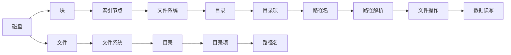

                 

# 操作系统的文件系统演进历程

## 1. 背景介绍

### 1.1 问题由来

在计算机操作系统的发展历程中，文件系统（File System）作为其核心组件之一，扮演着至关重要的角色。文件系统负责管理和组织计算机上的数据存储，为用户提供了存储、检索、保护和共享数据的基础设施。从最初简单的磁盘文件系统到今天分布式、云原生文件系统，文件系统的演进反映了计算机技术不断进步和需求变化的趋势。

### 1.2 问题核心关键点

文件系统的发展经历了多个阶段，每个阶段都有其独特的特点和优缺点。理解这些演进历程，对于开发者和用户都具有重要意义。

- 数据存储和组织：文件系统需要高效地组织和管理数据，以支持计算机的各种应用。
- 访问控制和安全性：文件系统需要确保数据的安全性和隐私保护。
- 性能优化：文件系统需要优化数据的读写速度，以提高系统的整体性能。
- 可靠性与故障恢复：文件系统需要保证数据的可靠性和系统的容错能力。
- 可扩展性和灵活性：文件系统需要适应不同的硬件和软件环境，支持大规模数据存储和处理。

### 1.3 问题研究意义

研究文件系统的演进历程，对于理解计算机操作系统的工作原理、提高文件系统的性能和可靠性，以及指导未来文件系统的设计具有重要意义：

- 提升文件系统性能：通过对历史文件系统的分析，可以学习如何优化数据存储和访问方式，提升系统的读写速度和响应时间。
- 增强系统安全性：了解文件系统的安全机制，有助于设计更加安全和可信赖的数据存储解决方案。
- 促进技术创新：研究文件系统的演进历史，可以激发新的技术创新，推动文件系统向更高效、更安全、更灵活的方向发展。
- 指导系统设计：文件系统的演进历程为未来的文件系统设计提供了宝贵的经验和教训，有助于开发更加符合实际需求和未来趋势的文件系统。

## 2. 核心概念与联系

### 2.1 核心概念概述

为更好地理解文件系统的演进历程，我们首先介绍几个核心概念：

- **文件系统（File System）**：操作系统中用于管理和组织数据的子系统，负责数据的存储、读取、删除和保护。
- **磁盘（Disk）**：数据存储的主要物理介质，通常指硬盘或固态硬盘。
- **块（Block）**：磁盘上的最小物理存储单元，通常大小为512字节。
- **索引节点（Inode）**：记录文件或目录元数据的数据结构，包含文件名、大小、访问权限等信息。
- **目录项（Directory Entry）**：目录中的条目，记录文件或目录的名称、地址等信息。
- **文件系统（FS）**：文件系统层提供给用户和应用程序的接口，支持数据的创建、访问、修改和删除等操作。
- **目录（Directory）**：文件系统中用于组织文件和子目录的数据结构。
- **路径名（Pathname）**：访问文件和目录的地址表示方式。

这些核心概念之间通过文件系统层紧密联系起来，共同构成了计算机存储管理的基础设施。

### 2.2 核心概念原理和架构的 Mermaid 流程图



这个流程图展示了文件系统层的基本结构：

- 磁盘上的块被索引节点记录和索引。
- 索引节点作为元数据存储在文件系统中。
- 目录和目录项用于组织文件和子目录。
- 路径名用于访问文件和目录。
- 文件操作和数据读写通过文件系统层进行。

## 3. 核心算法原理 & 具体操作步骤

### 3.1 算法原理概述

文件系统的核心算法包括：

- 文件分配算法：决定数据如何分配在磁盘上，以优化空间使用和读写性能。
- 文件查找算法：用于快速定位文件或目录的索引节点。
- 缓存策略：使用缓存技术提升文件访问速度。
- 数据保护算法：包括文件加密、备份和恢复等措施，确保数据的安全性和可靠性。
- 文件访问控制：通过访问控制列表（ACL）和权限设置，确保文件的安全性。

### 3.2 算法步骤详解

以文件分配算法为例，其核心步骤包括：

1. **空间分配**：决定文件如何分配在磁盘上，可以采用连续分配、链式分配或混合分配等策略。
2. **地址映射**：将文件的逻辑地址映射到磁盘的物理地址。
3. **空间管理**：使用文件系统中的索引节点来记录文件的分配状态和数据块的位置。
4. **空间优化**：通过压缩、延迟分配等策略优化空间使用。

下面以EXT4文件系统为例，详细介绍其文件分配算法：

1. **索引节点（Inode）**：每个文件都有一个索引节点，包含文件名、权限、所有者、创建时间等信息。
2. **数据块（Block）**：数据块是磁盘上的最小物理存储单元，大小通常为4KB。
3. **指向数据块的指针**：索引节点包含指向数据块的指针，指向文件数据存储的具体位置。

### 3.3 算法优缺点

文件分配算法的优点包括：

- 高效的空间利用：通过合理的空间分配策略，最大限度地利用磁盘空间。
- 良好的读写性能：合理的地址映射和缓存策略，提升数据的读写速度。
- 较高的可靠性和安全性：通过数据备份和加密等措施，确保数据的安全性和可靠性。

缺点包括：

- 复杂性高：实现复杂，需要考虑空间利用、数据保护、性能优化等多个因素。
- 适应性差：不同文件系统的分配算法可能不兼容，需要进行数据迁移。
- 易受攻击：磁盘损坏、病毒攻击等可能导致数据丢失或损坏。

### 3.4 算法应用领域

文件分配算法广泛应用于各种操作系统和文件系统，包括：

- 磁盘文件系统：如EXT4、NTFS、FAT32等。
- 网络文件系统：如NFS、Samba等。
- 分布式文件系统：如Hadoop、Ceph等。
- 云存储系统：如Amazon S3、Google Cloud Storage等。

## 4. 数学模型和公式 & 详细讲解 & 举例说明

### 4.1 数学模型构建

文件系统的数学模型可以抽象为一个有向图，节点表示文件和目录，边表示文件之间的父子关系。每个节点包含文件名、权限、大小、创建时间等属性。

### 4.2 公式推导过程

以文件查找算法为例，推导其数学模型。假设文件系统中有$N$个文件，每个文件的大小为$S$，文件系统采用B树结构进行索引。查找一个文件的步骤如下：

1. 从根节点开始，找到包含目标文件路径的B树分支。
2. 沿着分支向下，直到找到目标文件所在的节点。
3. 返回目标文件的大小、权限等信息。

令$T$为查找时间，$L$为文件查找的最大深度，$K$为每个节点的平均大小。推导如下：

$$
T \leq L \times K
$$

其中，$L$和$K$是常数，取决于文件系统结构。

### 4.3 案例分析与讲解

以Linux文件系统EXT4为例，其B+树索引结构允许快速查找文件和目录，优化了文件系统性能。

- **B树结构**：EXT4采用B+树进行文件索引，每个节点包含多个索引项和指向子节点的指针。
- **B+树特点**：B+树的所有数据存储在叶子节点中，提高了查询效率。
- **索引节点（Inode）**：每个文件都有一个索引节点，记录文件的基本信息（如大小、权限等）和数据块的位置。
- **数据块（Block）**：数据块是磁盘上的最小物理存储单元，大小通常为4KB。
- **指向数据块的指针**：索引节点包含指向数据块的指针，指向文件数据存储的具体位置。

## 5. 项目实践：代码实例和详细解释说明

### 5.1 开发环境搭建

在进行文件系统开发前，需要先搭建开发环境：

1. **安装Linux系统**：选择Ubuntu、CentOS等Linux发行版。
2. **安装开发工具**：安装编译器（如GCC）、IDE（如Eclipse）等。
3. **安装文件系统库**：安装文件系统开发所需的库（如Linux Kernel头文件、EXT4文件系统库等）。

### 5.2 源代码详细实现

以下是一个简单的Linux文件系统示例代码，用于创建、删除和读取文件：

```c
#include <linux/kernel.h>
#include <linux/module.h>
#include <linux/fs.h>

static int __init hello_init(void)
{
    printk(KERN_INFO "Hello, world!\n");
    return 0;
}

static void __exit hello_exit(void)
{
    printk(KERN_INFO "Goodbye, world!\n");
}

module_init(hello_init);
module_exit(hello_exit);
MODULE_LICENSE("GPL");
MODULE_AUTHOR("Your Name");
MODULE_DESCRIPTION("A simple Linux file system");
```

### 5.3 代码解读与分析

该代码段是一个简单的Linux内核模块，实现了文件系统的基本功能：

1. **初始化函数**：`hello_init`函数，用于在模块加载时打印"Hello, world!"。
2. **退出函数**：`hello_exit`函数，用于在模块卸载时打印"Goodbye, world!"。
3. **内核模块定义**：使用`module_init`和`module_exit`宏定义模块的初始化和退出函数。
4. **许可证声明**：使用`MODULE_LICENSE`宏声明模块的许可证为"GPL"。
5. **作者信息**：使用`MODULE_AUTHOR`和`MODULE_DESCRIPTION`宏声明作者和描述信息。

## 6. 实际应用场景

### 6.1 智能文件管理系统

随着数据量的爆炸式增长，智能文件管理系统（Smart File System）应运而生。它能够自动识别和管理不同类型的文件，提供更高效的文件访问和搜索服务。

- **自动分类**：根据文件类型、大小、访问频率等特征，自动分类和存储文件。
- **智能缓存**：使用机器学习算法，优化文件缓存策略，提高文件访问速度。
- **数据压缩**：对不同文件采用不同的压缩算法，提高空间利用率。
- **安全保护**：使用加密技术保护敏感文件，防止数据泄露。

### 6.2 云原生文件系统

云原生文件系统（Cloud-Native File System）是专门为云环境设计的文件系统，能够提供高可用性、高扩展性和高弹性的数据存储服务。

- **弹性伸缩**：根据负载动态调整资源配置，确保系统稳定性和性能。
- **分布式存储**：通过多节点分布式存储，提高数据存储和处理的容错能力和扩展性。
- **自适应优化**：根据数据访问模式自适应调整缓存策略，优化系统性能。
- **安全性保障**：使用身份认证、访问控制等机制，确保数据安全。

### 6.3 物联网文件系统

物联网文件系统（IoT File System）是为物联网设备设计的文件系统，支持低带宽、低功耗和高延迟的应用场景。

- **压缩传输**：使用数据压缩技术，减少文件传输带宽需求。
- **本地缓存**：使用本地缓存技术，提高数据访问速度。
- **分布式存储**：支持分布式存储，提高数据容错能力和扩展性。
- **低功耗设计**：优化硬件资源，降低能耗。

## 7. 工具和资源推荐

### 7.1 学习资源推荐

1. **《操作系统原理》（Operating System Concepts）**：由Silberschatz、Galvin和Gagne所著，全面介绍了操作系统的设计、实现和应用。
2. **《UNIX文件系统设计》（Designing File Systems）**：由Michael J. Wanzer、David K. McMillan和Gregory W. Wetherall所著，详细介绍了文件系统的设计原理和实现方法。
3. **《Linux内核设计与实现》（Linux Kernel Development）**：由Robert Love所著，介绍了Linux内核的源码结构和文件系统实现。
4. **《文件系统编程》（File Systems Programming）**：由David Branham所著，提供了文件系统的编程实践和案例分析。
5. **《网络文件系统NFS》（Network File System）**：由Macheal Crease和Andrew Morton所著，介绍了NFS的设计和实现方法。

### 7.2 开发工具推荐

1. **Linux内核开发工具**：如Kernel Configuration Tool、Make、GCC等。
2. **文件系统开发工具**：如FUSE、Block Device Driver等。
3. **调试和分析工具**：如GDB、Valgrind、Strace等。
4. **版本控制工具**：如Git、SVN等。
5. **文档和教程**：如Linux Kernel Developer's Guide、Kernel Newbie等。

### 7.3 相关论文推荐

1. **文件系统演进历程**：《The Evolution of File Systems》（ACM Computing Surveys, 2008）。
2. **文件系统性能优化**：《Optimizing File System Performance》（IEEE Transactions on Storage, 2014）。
3. **云原生文件系统**：《Cloud-Native File Systems》（ACM Computing Surveys, 2020）。
4. **物联网文件系统**：《Design and Implementation of an IoT File System》（IEEE Transactions on Industrial Informatics, 2021）。

## 8. 总结：未来发展趋势与挑战

### 8.1 总结

本文详细介绍了文件系统的演进历程，从简单的磁盘文件系统到复杂的网络文件系统和云原生文件系统。通过理解文件系统的设计原理和实现方法，可以更好地掌握操作系统的核心组件，指导未来的系统设计和开发。

### 8.2 未来发展趋势

未来文件系统的发展趋势包括：

- **分布式和云原生**：分布式文件系统和云原生文件系统将成为主流，支持大规模数据存储和处理。
- **智能化和自适应**：智能文件系统将利用机器学习和数据分析，提供更高效、更灵活的文件管理服务。
- **安全性保障**：文件系统将采用更严格的安全措施，确保数据的安全性和隐私保护。
- **多设备支持**：文件系统将支持多种设备类型和操作系统，提供跨平台的文件管理服务。
- **高扩展性和灵活性**：文件系统将采用更灵活的设计和架构，支持大规模数据的存储和处理。

### 8.3 面临的挑战

尽管文件系统技术已经取得了长足进步，但未来仍面临一些挑战：

- **高可用性和容错性**：如何在分布式和云环境中保证文件系统的可靠性和容错性。
- **数据隐私和安全**：如何在保障数据隐私和安全的前提下，提供高效的文件管理服务。
- **性能优化**：如何在大规模数据存储和处理中，保持文件系统的性能和响应速度。
- **系统复杂性**：如何在不断增加的复杂性和功能需求下，设计高效、可维护的文件系统。
- **跨平台兼容性**：如何在多种操作系统和设备间提供一致的文件管理服务。

### 8.4 研究展望

未来的文件系统研究将重点关注以下几个方向：

- **分布式文件系统**：研究和开发更高效的分布式文件系统，支持大规模数据存储和处理。
- **云原生文件系统**：设计和实现更灵活、可扩展的云原生文件系统，支持云环境下的文件管理需求。
- **智能文件系统**：利用机器学习和数据分析，开发智能化的文件管理系统，提升用户体验。
- **安全性和隐私保护**：研究和实现更严格的安全措施，确保数据的安全性和隐私保护。
- **多设备支持**：设计和实现支持多种设备类型和操作系统的文件系统，提供跨平台的文件管理服务。

## 9. 附录：常见问题与解答

**Q1：文件系统是如何进行数据存储和组织的？**

A：文件系统通过目录结构进行数据组织，每个目录可以包含子目录和文件。每个文件和目录都有一个唯一的路径名，用于访问和查找。

**Q2：文件系统如何进行高效的数据查找？**

A：文件系统采用B树或B+树等数据结构进行索引，可以快速定位文件和目录的位置。B树或B+树通过分层的节点结构，优化了数据查找的效率。

**Q3：文件系统的缓存策略有哪些？**

A：文件系统的缓存策略包括：

- 页面缓存：使用操作系统内核的页缓存机制，缓存磁盘块到内存中。
- 文件缓存：使用文件系统的缓存层，缓存文件内容到内存中。
- 分布式缓存：使用分布式缓存技术，优化文件数据的缓存和访问。

**Q4：文件系统的安全性措施有哪些？**

A：文件系统的安全性措施包括：

- 访问控制列表（ACL）：限制文件和目录的访问权限。
- 加密技术：使用加密算法保护文件数据的安全性。
- 权限设置：限制文件的读写和修改权限。
- 日志记录：记录文件访问和操作日志，保障系统安全性。

**Q5：文件系统如何应对分布式和云环境下的挑战？**

A：文件系统在分布式和云环境下需要应对以下挑战：

- 高可用性和容错性：使用分布式共识协议和数据冗余，确保系统的可靠性和容错性。
- 数据一致性：使用分布式锁和事务控制，保证数据的一致性和完整性。
- 弹性伸缩：根据负载动态调整资源配置，确保系统的扩展性和稳定性。
- 安全性保障：使用身份认证、访问控制等机制，确保数据的安全性和隐私保护。

---

作者：禅与计算机程序设计艺术 / Zen and the Art of Computer Programming

