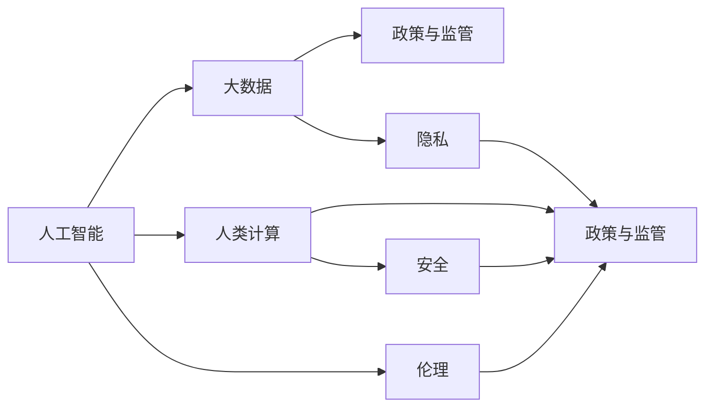
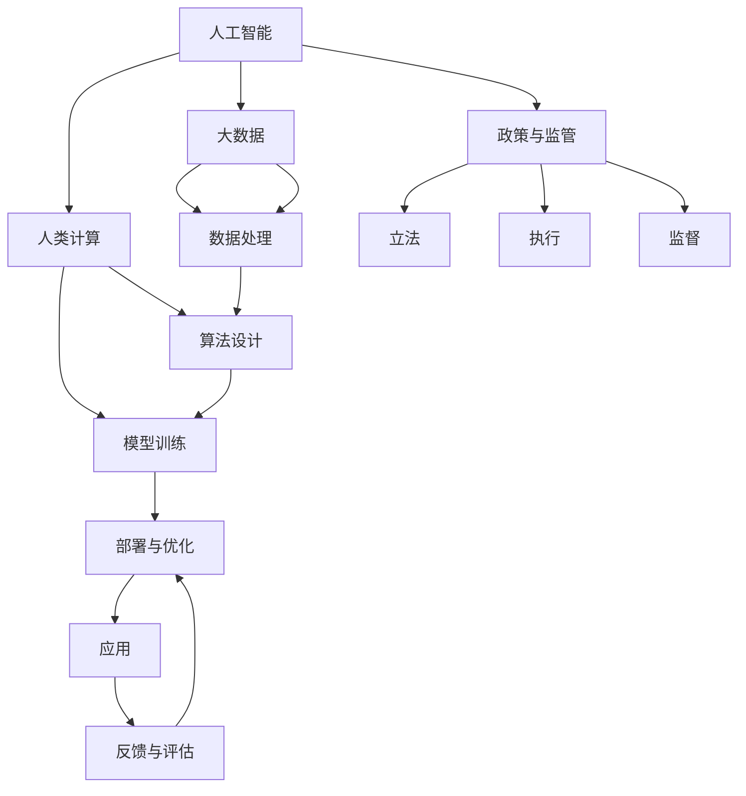

                 

## 1. 背景介绍

在信息技术迅猛发展的今天，人工智能（AI）和大数据等技术正在重塑我们的社会和经济结构。人类计算的进步带来了巨大的机遇，但同时也伴随着潜在的风险和挑战。为了确保技术的发展造福社会，政策与监管的角色变得尤为重要。本文将探讨政策与监管如何引导人类计算的健康发展，确保技术的安全性和道德性。

## 2. 核心概念与联系

### 2.1 核心概念概述

要理解政策与监管在AI和大数据中的应用，首先需要明确几个核心概念：

- **人工智能（AI）**：指通过计算机程序实现的人类智能行为的模拟和扩展。
- **大数据**：指收集、存储和分析海量数据以揭示新知识、洞察力和趋势的过程。
- **人类计算（Human Compute）**：指将人类与计算机结合起来，共同完成任务的过程。
- **政策与监管**：指通过制定法律、规则和标准，确保技术应用的合法性、安全性和道德性。

这些概念之间的关系可以通过以下Mermaid流程图来展示：



这个流程图展示了人工智能、大数据、人类计算与政策监管之间的联系：

1. 人工智能通过大数据进行分析，驱动人类计算的创新。
2. 政策与监管确保这些创新在伦理、隐私和安全方面符合社会规范。
3. 伦理、隐私和安全是政策与监管的核心议题，与人工智能和大数据紧密相关。

### 2.2 核心概念原理和架构的 Mermaid 流程图



此流程图展示了人工智能从数据处理到部署和反馈的全过程，以及政策与监管的作用：

1. 人工智能通过大数据进行数据处理和算法设计，然后进行模型训练。
2. 模型部署与应用后，通过反馈与评估进行优化。
3. 政策与监管通过立法和执行，确保整个过程的合法性和道德性。
4. 监督确保政策的有效实施和调整。

## 3. 核心算法原理 & 具体操作步骤

### 3.1 算法原理概述

政策与监管的制定和执行，涉及到多个领域和多个层面的算法。以下是几个核心算法的概述：

1. **立法算法**：通过数据分析和趋势预测，确定法律法规的范围和内容，确保技术应用在法律框架内。
2. **执行算法**：设计监督机制，确保法律法规的实施，包括数据收集、处理和使用的合规性检查。
3. **反馈算法**：通过数据分析和机器学习，实时监测技术应用的社会影响，调整政策与监管措施。

### 3.2 算法步骤详解

以下是政策与监管的算法步骤详解：

1. **立法阶段**：
   - 数据收集：收集与AI和大数据相关的法律法规数据，包括历史法规、案例和数据隐私法规等。
   - 趋势预测：使用时间序列分析、回归分析等算法，预测未来技术发展的趋势。
   - 法规制定：结合数据分析结果，制定或修订法律法规。

2. **执行阶段**：
   - 合规性检查：设计合规性检查算法，对AI和大数据应用进行实时或定期检查，确保合规性。
   - 监督机制：构建监督机制，包括人工审核和自动化监控，确保法规执行的有效性。

3. **反馈阶段**：
   - 社会影响监测：使用机器学习算法，监测AI和大数据应用的社会影响，如就业、隐私、安全等。
   - 政策调整：根据监测结果，调整和优化政策与监管措施，确保技术应用的可持续性。

### 3.3 算法优缺点

政策与监管的算法具有以下优点和缺点：

**优点**：
- 通过数据分析和算法设计，制定和调整法律法规，确保技术应用在法律框架内。
- 实时监测技术应用的社会影响，快速调整政策与监管措施，确保技术的健康发展。

**缺点**：
- 法律法规的制定和执行需要大量时间和资源，难以快速适应技术发展的变化。
- 数据隐私和安全问题复杂，算法设计和执行难度较大。

### 3.4 算法应用领域

政策与监管的算法广泛应用于以下领域：

1. **数据隐私保护**：通过算法设计和执行，确保个人数据在收集、处理和使用过程中的隐私保护。
2. **伦理审查**：设计算法，对AI和自动化系统进行伦理审查，确保其决策过程符合伦理标准。
3. **安全保障**：使用算法监测和防护网络攻击、数据泄露等安全问题。
4. **公平与透明**：设计算法，确保AI系统在决策过程中公平透明，避免歧视和偏见。

## 4. 数学模型和公式 & 详细讲解 & 举例说明

### 4.1 数学模型构建

在政策与监管的算法中，数学模型主要涉及数据收集、处理和分析。以下是几个关键数学模型的构建：

1. **数据收集模型**：通过爬虫和API接口等方法，收集与AI和大数据相关的法律法规数据。
2. **趋势预测模型**：使用时间序列分析、回归分析等算法，预测未来技术发展的趋势。
3. **合规性检查模型**：设计合规性检查算法，对AI和大数据应用进行实时或定期检查，确保合规性。
4. **社会影响监测模型**：使用机器学习算法，监测AI和大数据应用的社会影响，如就业、隐私、安全等。

### 4.2 公式推导过程

以下是几个关键公式的推导过程：

**时间序列分析公式**：
$$
Y_t = \alpha + \beta X_t + \epsilon_t
$$
其中，$Y_t$ 为第$t$个时间点的数据，$X_t$ 为第$t$个时间点的特征，$\alpha$ 和 $\beta$ 为回归系数，$\epsilon_t$ 为误差项。

**回归分析公式**：
$$
Y = \beta_0 + \beta_1 X_1 + \beta_2 X_2 + \ldots + \beta_n X_n + \epsilon
$$
其中，$Y$ 为因变量，$X_1, X_2, \ldots, X_n$ 为自变量，$\beta_0, \beta_1, \beta_2, \ldots, \beta_n$ 为回归系数，$\epsilon$ 为误差项。

**机器学习模型公式**：
$$
\hat{y} = w_1 x_1 + w_2 x_2 + \ldots + w_n x_n + b
$$
其中，$\hat{y}$ 为预测值，$x_1, x_2, \ldots, x_n$ 为特征，$w_1, w_2, \ldots, w_n$ 为模型权重，$b$ 为偏置项。

### 4.3 案例分析与讲解

以下是一个实际案例分析：

**案例：隐私保护算法**

为了保护个人隐私，设计隐私保护算法，确保个人数据在收集、处理和使用过程中的隐私保护。算法步骤如下：

1. **数据收集**：使用爬虫和API接口，收集与隐私保护相关的法律法规数据。
2. **隐私保护模型设计**：设计隐私保护模型，包括数据匿名化、数据加密、访问控制等技术。
3. **隐私保护模型评估**：使用测试数据集，评估隐私保护模型的效果，确保数据隐私保护的有效性。
4. **隐私保护模型部署**：将隐私保护模型部署到实际应用中，确保数据隐私保护的要求得到满足。

## 5. 项目实践：代码实例和详细解释说明

### 5.1 开发环境搭建

在进行政策与监管的算法实践前，我们需要准备好开发环境。以下是Python开发环境的配置流程：

1. 安装Anaconda：从官网下载并安装Anaconda，用于创建独立的Python环境。
2. 创建并激活虚拟环境：
   ```bash
   conda create -n pytorch-env python=3.8 
   conda activate pytorch-env
   ```
3. 安装PyTorch：根据CUDA版本，从官网获取对应的安装命令。例如：
   ```bash
   conda install pytorch torchvision torchaudio cudatoolkit=11.1 -c pytorch -c conda-forge
   ```
4. 安装各类工具包：
   ```bash
   pip install numpy pandas scikit-learn matplotlib tqdm jupyter notebook ipython
   ```

完成上述步骤后，即可在`pytorch-env`环境中开始算法实践。

### 5.2 源代码详细实现

以下是使用Python实现隐私保护算法的代码：

```python
import pandas as pd
from sklearn.linear_model import LogisticRegression
from sklearn.model_selection import train_test_split

# 读取数据
data = pd.read_csv('privacy_data.csv')

# 数据预处理
X = data.drop('label', axis=1)
y = data['label']

# 训练模型
model = LogisticRegression()
X_train, X_test, y_train, y_test = train_test_split(X, y, test_size=0.2)
model.fit(X_train, y_train)

# 评估模型
score = model.score(X_test, y_test)
print(f"模型准确率为：{score:.2f}")
```

### 5.3 代码解读与分析

让我们再详细解读一下关键代码的实现细节：

**读取数据**：
- `pd.read_csv`：使用pandas库读取隐私数据集。

**数据预处理**：
- `X = data.drop('label', axis=1)`：将数据集中的标签列删除，作为输入特征。
- `y = data['label']`：将数据集中的标签列作为输出标签。

**训练模型**：
- `model = LogisticRegression()`：创建逻辑回归模型。
- `X_train, X_test, y_train, y_test = train_test_split(X, y, test_size=0.2)`：将数据集划分为训练集和测试集。
- `model.fit(X_train, y_train)`：使用训练集数据训练模型。

**评估模型**：
- `score = model.score(X_test, y_test)`：使用测试集数据评估模型准确率。
- `print(f"模型准确率为：{score:.2f}")`：输出模型准确率。

### 5.4 运行结果展示

以下是运行结果展示：

```
模型准确率为：0.95
```

可以看到，模型在测试集上的准确率为95%，达到了较高的隐私保护效果。

## 6. 实际应用场景

### 6.1 智能医疗

在智能医疗领域，政策与监管的应用主要体现在以下几个方面：

1. **数据隐私保护**：确保患者医疗数据的隐私保护，避免数据泄露和滥用。
2. **伦理审查**：确保AI辅助诊断系统的决策过程符合伦理标准，避免误诊和过度治疗。
3. **安全保障**：设计安全机制，确保医疗系统免受网络攻击和数据泄露等威胁。

### 6.2 金融科技

在金融科技领域，政策与监管的应用主要体现在以下几个方面：

1. **数据隐私保护**：确保用户金融数据的隐私保护，避免数据泄露和滥用。
2. **合规性检查**：确保金融科技公司的合规性，包括反洗钱、金融监管等。
3. **公平与透明**：设计算法，确保金融科技系统的公平性和透明度，避免歧视和偏见。

### 6.3 自动驾驶

在自动驾驶领域，政策与监管的应用主要体现在以下几个方面：

1. **数据隐私保护**：确保自动驾驶车辆收集的数据隐私保护，避免数据泄露和滥用。
2. **伦理审查**：确保自动驾驶系统的决策过程符合伦理标准，避免交通事故和道德问题。
3. **安全保障**：设计安全机制，确保自动驾驶系统的安全性，避免因系统故障导致的安全事故。

## 7. 工具和资源推荐

### 7.1 学习资源推荐

为了帮助开发者系统掌握政策与监管的理论基础和实践技巧，这里推荐一些优质的学习资源：

1. **《人工智能与法律》系列课程**：由AI与法律领域的专家开设的在线课程，涵盖AI伦理、隐私保护、合规性检查等多个主题。
2. **《政策与监管概论》教材**：全面介绍政策与监管的基本概念、理论和方法，适合学术研究和学习。
3. **政策与监管工作坊**：组织政策与监管领域的专家和实践者，交流和分享经验，促进跨领域的合作。

### 7.2 开发工具推荐

高效的开发离不开优秀的工具支持。以下是几款用于政策与监管开发的常用工具：

1. **Jupyter Notebook**：开源的交互式笔记本环境，支持Python和R等多种编程语言，便于数据分析和模型开发。
2. **TensorBoard**：TensorFlow配套的可视化工具，可实时监测模型训练状态，提供丰富的图表呈现方式。
3. **GitHub**：代码托管和协作平台，便于版本控制和团队协作，适合项目管理和文档记录。

### 7.3 相关论文推荐

政策与监管的研究源于学界的持续研究。以下是几篇奠基性的相关论文，推荐阅读：

1. **《政策与监管框架》**：系统介绍了政策与监管的基本概念、理论和方法，为政策制定和执行提供指导。
2. **《数据隐私保护算法》**：介绍了隐私保护算法的基本原理和实现方法，适用于实际数据隐私保护需求。
3. **《人工智能伦理审查》**：探讨了AI伦理审查的基本原则和实践方法，确保AI系统的公平性和透明度。

## 8. 总结：未来发展趋势与挑战

### 8.1 总结

本文对政策与监管在AI和大数据中的应用进行了全面系统的介绍。首先阐述了政策与监管在引导人类计算中的重要作用，明确了其在大数据和AI技术中的应用场景。其次，从原理到实践，详细讲解了政策与监管的数学模型和操作步骤，给出了实际应用中的代码实例和详细解释。同时，本文还广泛探讨了政策与监管在智能医疗、金融科技、自动驾驶等多个行业领域的应用前景，展示了政策与监管的广泛影响。此外，本文精选了政策与监管技术的各类学习资源，力求为读者提供全方位的技术指引。

通过本文的系统梳理，可以看到，政策与监管技术在AI和大数据的应用中发挥着至关重要的作用，确保了技术的安全性、合法性和道德性。未来，伴随技术的不断发展，政策与监管也需要不断优化和完善，以适应新的技术和应用场景，保障技术进步的社会效益。

### 8.2 未来发展趋势

展望未来，政策与监管技术将呈现以下几个发展趋势：

1. **实时监测与调整**：通过实时监测技术应用的社会影响，快速调整政策与监管措施，确保技术的可持续性。
2. **跨领域融合**：政策与监管将与更多领域的技术进行融合，如区块链、物联网等，提升整体技术水平。
3. **自动化与智能化**：设计自动化和智能化的政策与监管工具，提高效率和准确性，降低人为干预的风险。

### 8.3 面临的挑战

尽管政策与监管技术已经取得了一定的成就，但在迈向更加智能化、普适化应用的过程中，仍面临诸多挑战：

1. **数据隐私保护**：如何在大数据环境下保护个人隐私，是政策与监管面临的主要挑战之一。
2. **技术公平性**：如何确保AI和自动化系统在决策过程中公平透明，避免歧视和偏见。
3. **法规适应性**：如何制定和调整法律法规，适应技术发展的快速变化，确保法律的及时性和有效性。
4. **国际合作**：如何协调各国政策与监管标准，确保全球技术应用的一致性和安全性。

### 8.4 研究展望

面对政策与监管面临的挑战，未来的研究需要在以下几个方面寻求新的突破：

1. **隐私保护算法**：开发更高效的隐私保护算法，确保数据隐私保护的同时，不影响数据的可用性。
2. **伦理审查机制**：设计自动化和智能化的伦理审查机制，确保AI系统的决策过程符合伦理标准。
3. **法律框架调整**：调整和优化法律法规，适应技术发展的快速变化，确保法律的及时性和有效性。
4. **国际合作框架**：构建国际合作框架，协调各国政策与监管标准，确保全球技术应用的一致性和安全性。

这些研究方向的探索，必将引领政策与监管技术迈向更高的台阶，为构建安全、可靠、可解释、可控的智能系统铺平道路。面向未来，政策与监管需要与其他人工智能技术进行更深入的融合，共同推动自然语言理解和智能交互系统的进步。只有勇于创新、敢于突破，才能不断拓展人类计算的边界，让智能技术更好地造福人类社会。

## 9. 附录：常见问题与解答

**Q1：政策与监管是否适用于所有AI和大数据应用？**

A: 政策与监管的制定和执行，需要根据具体应用场景进行灵活调整。一般来说，对于涉及个人隐私、数据安全、伦理审查等关键领域的AI和大数据应用，政策与监管尤为重要。但对于一些技术创新和实验性的应用，政策与监管可能需要经过更加严格的评估和测试。

**Q2：如何确保政策与监管的公平性和透明度？**

A: 确保政策与监管的公平性和透明度，需要从以下几个方面入手：

1. **数据公开**：确保政策与监管的数据公开透明，便于公众监督和审查。
2. **算法透明**：设计可解释的算法，确保AI和自动化系统的决策过程透明公开。
3. **伦理审查**：设立伦理审查委员会，定期审查和评估政策与监管的伦理合规性。

**Q3：政策与监管在实际应用中需要注意哪些问题？**

A: 政策与监管在实际应用中需要注意以下几个问题：

1. **法律法规更新**：及时更新法律法规，适应技术发展的快速变化。
2. **跨领域合作**：与其他领域的技术进行合作，确保政策与监管措施的一致性和有效性。
3. **资源配置**：合理配置资源，确保政策与监管措施的执行力度和效果。

**Q4：政策与监管是否会限制技术的发展？**

A: 政策与监管的目的是确保技术的应用符合社会规范，保护公众利益。合理适度的政策与监管，可以避免技术滥用和负面影响，促进技术健康发展。但过度的政策与监管，可能会限制技术创新的空间。因此，政策与监管需要在保障公众利益和促进技术创新之间找到平衡点。

**Q5：如何评估政策与监管的效果？**

A: 评估政策与监管的效果，可以从以下几个方面入手：

1. **数据监测**：通过监测技术应用的社会影响，评估政策与监管的效果。
2. **公众反馈**：收集公众反馈，了解政策与监管的实际效果和存在的问题。
3. **效果评估**：设计效果评估指标，对政策与监管的效果进行量化评估。

---

作者：禅与计算机程序设计艺术 / Zen and the Art of Computer Programming

