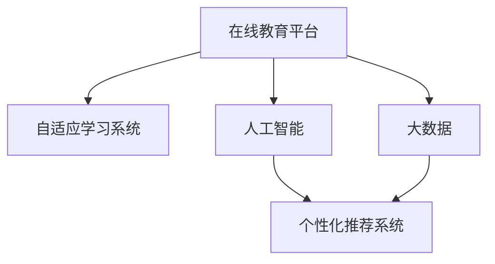

                 

# 教育科技创业：知识传播的新范式

> 关键词：教育科技,知识传播,人工智能,自适应学习,个性化推荐,教育大数据,在线教育,创新教育

## 1. 背景介绍

### 1.1 问题由来
随着信息时代的到来，知识传播的方式已经发生了深刻变革。传统的教室讲授、纸质教材等形式正在逐步被数字化、智能化手段所取代。在线教育、智能辅导系统、个性化推荐等新兴技术，正在改变教育行业的游戏规则。

然而，尽管技术进步带来了诸多便利，知识传播的效率和质量仍存在较大提升空间。特别是对于广大学生群体，传统教育方式往往难以满足他们多样化的学习需求。在这种背景下，教育科技创业应运而生，利用人工智能、大数据等前沿技术，探索知识传播的新范式，为学生提供更加个性化、高效、互动的学习体验。

### 1.2 问题核心关键点
教育科技创业的核心在于将最新的人工智能和大数据技术，应用到知识传播过程中，提升教学效率和质量，满足不同学生的学习需求。以下是几个核心关键点：

- **个性化学习**：通过数据分析和机器学习，为每个学生量身定制学习路径，提供个性化的教育资源。
- **自适应学习**：根据学生的学习进度和掌握情况，动态调整学习内容和难度，实现智能化的个性化辅导。
- **在线教育平台**：构建高效、稳定、互动的在线学习环境，覆盖更广泛的受众。
- **教育大数据**：利用大数据技术分析学生行为和反馈，优化教学策略和课程设计。

### 1.3 问题研究意义
教育科技创业具有深远的社会意义：

- **促进教育公平**：通过提供优质的在线教育资源，帮助偏远地区和弱势群体获得公平的教育机会。
- **提升教学质量**：利用智能技术，帮助教师优化教学方法，提高教学效果。
- **激发学习兴趣**：通过互动式学习、游戏化教育等方式，激发学生的学习兴趣，提高学习效率。
- **推动教育创新**：探索前沿科技在教育领域的应用，促进教育模式的创新和变革。

## 2. 核心概念与联系

### 2.1 核心概念概述

为了更好地理解教育科技创业的原理和应用，本节将介绍几个关键概念：

- **在线教育平台(Online Education Platform)**：利用互联网和云计算技术，构建的在线学习环境。涵盖课程设计、内容呈现、互动交流等各方面。
- **自适应学习系统(Adaptive Learning System)**：通过智能算法和数据分析，动态调整学习内容和难度，实现个性化辅导。
- **人工智能(Artificial Intelligence)**：通过机器学习、深度学习等技术，模拟人类智能行为，实现自动化的决策和学习。
- **大数据(Big Data)**：大规模、高速度、多样化的数据集，通过分析挖掘，揭示隐藏的模式和规律，优化教育决策。
- **个性化推荐系统(Personalized Recommendation System)**：利用协同过滤、内容推荐等技术，根据用户行为和兴趣，推荐个性化的学习资源。

这些概念之间的逻辑关系可以通过以下Mermaid流程图来展示：



这个流程图展示了几大关键概念之间的联系：

1. 在线教育平台是知识传播的主要载体，涵盖自适应学习、人工智能和大数据的应用。
2. 自适应学习系统利用人工智能和大数据技术，实现个性化的学习路径设计。
3. 人工智能在自适应学习系统和大数据基础上，实现智能决策和学习。
4. 大数据提供海量的学习数据，支持人工智能和自适应学习系统的优化和改进。
5. 个性化推荐系统利用人工智能和大数据技术，提供符合用户兴趣的学习资源。

这些概念共同构成了教育科技创业的基础框架，为其在教育领域的应用提供了强有力的技术支撑。

## 3. 核心算法原理 & 具体操作步骤
### 3.1 算法原理概述

教育科技创业的核心算法原理主要包括以下几个方面：

1. **自适应学习算法**：通过分析学生的学习数据，动态调整学习内容和难度，实现个性化辅导。常见的算法包括基于规则的适应性算法、基于模型的适应性算法和基于协同过滤的推荐算法。
2. **机器学习推荐算法**：利用协同过滤、内容推荐等技术，根据学生行为和兴趣，推荐个性化的学习资源。常见的算法包括基于矩阵分解的推荐算法、基于深度学习的推荐算法等。
3. **自然语言处理(NLP)**：通过文本分析、情感分析等技术，理解和分析学生在学习过程中产生的文本数据，如作业、笔记、讨论等，为个性化学习提供依据。
4. **图像识别和视频分析**：利用计算机视觉技术，分析学习过程中产生的图像和视频数据，如解题过程、实验操作等，提供实时反馈和指导。
5. **数据分析与挖掘**：利用大数据技术，分析学习行为、成绩数据等，挖掘学习规律和趋势，优化教学策略和课程设计。

### 3.2 算法步骤详解

教育科技创业的核心算法步骤主要包括以下几个方面：

**Step 1: 数据收集与预处理**

1. **数据收集**：从在线教育平台、学习管理系统(LMS)等渠道，收集学生的学习数据，如成绩、行为、互动记录等。
2. **数据清洗**：去除缺失、异常值等无效数据，进行数据标准化和归一化处理。
3. **特征工程**：提取与学习效果相关的特征，如学习时间、做题难度、互动频次等。

**Step 2: 个性化学习路径设计**

1. **学生模型构建**：利用机器学习算法，构建学生的学习模型，包括学习风格、知识掌握情况等。
2. **学习路径设计**：根据学生的学习模型，设计个性化的学习路径，涵盖课程、模块、知识点等。
3. **学习进度调整**：根据学生的学习进度和反馈，动态调整学习内容和难度，实现自适应学习。

**Step 3: 个性化推荐**

1. **推荐算法选择**：选择合适的推荐算法，如协同过滤、内容推荐等。
2. **用户画像构建**：根据学生的行为和兴趣，构建用户画像，用于个性化推荐。
3. **推荐系统实现**：利用推荐算法和用户画像，实现个性化推荐系统，向学生推荐学习资源。

**Step 4: 实时反馈与优化**

1. **实时反馈**：利用NLP和图像识别技术，对学生的作业、解题过程进行实时反馈和指导。
2. **学习效果评估**：利用数据分析技术，评估学生的学习效果，如成绩提升、知识点掌握等。
3. **教学策略优化**：根据学习效果评估结果，优化教学策略和课程设计，提升教学质量。

### 3.3 算法优缺点

教育科技创业的算法具有以下优点：

- **高效性**：通过数据分析和机器学习，实现智能化的个性化学习路径设计，大幅提升学习效率。
- **适应性**：根据学生的学习进度和反馈，动态调整学习内容和难度，实现自适应学习。
- **个性化**：利用个性化推荐系统，提供符合学生兴趣和需求的学习资源，提升学习体验。
- **互动性**：通过实时反馈和互动交流，增强学习互动，激发学生学习兴趣。

同时，该算法也存在一定的局限性：

- **数据依赖**：个性化学习路径设计和推荐系统的效果依赖于高质量的数据，获取数据成本较高。
- **复杂性**：算法模型较为复杂，需要多学科知识的综合应用，实现难度较大。
- **隐私风险**：学习数据涉及学生隐私，数据安全和隐私保护成为重要问题。
- **技术门槛**：算法实施需要较高技术门槛，中小型企业难以独立实现。

尽管存在这些局限性，但就目前而言，个性化学习、自适应学习等基于数据的教学方法，已经展现出巨大的应用潜力，成为教育科技创业的主流方向。

### 3.4 算法应用领域

教育科技创业的算法已经在诸多领域得到了广泛应用，例如：

- **在线教育平台**：通过个性化学习路径设计和推荐系统，提供丰富多样的在线课程和资源。
- **智能辅导系统**：利用自适应学习算法，实现实时反馈和个性化辅导。
- **作业批改系统**：通过图像识别和NLP技术，实现作业自动批改和反馈。
- **考试系统**：利用数据分析和图像识别技术，实现自动化命题、评分和分析。
- **学生管理平台**：通过大数据和机器学习，优化学生管理流程，提升管理效率。

除了上述这些经典应用外，教育科技创业的算法还被创新性地应用到更多场景中，如知识图谱构建、学科知识图谱、教育数据可视化等，为教育行业带来了新的突破。

## 4. 数学模型和公式 & 详细讲解 & 举例说明

### 4.1 数学模型构建

教育科技创业的核心数学模型主要包括以下几个方面：

- **自适应学习模型**：通过分析学生学习数据，构建学生模型，动态调整学习内容和难度。常见的模型包括基于规则的适应性算法、基于模型的适应性算法等。
- **推荐系统模型**：利用协同过滤、内容推荐等技术，构建推荐系统，向学生推荐学习资源。常见的模型包括基于矩阵分解的推荐算法、基于深度学习的推荐算法等。
- **数据分析模型**：利用统计学和大数据分析技术，构建数据分析模型，挖掘学习规律和趋势。常见的模型包括回归模型、聚类模型等。

### 4.2 公式推导过程

以下我们以推荐系统为例，推导协同过滤算法的计算公式。

设用户集合为 $U=\{u_1, u_2, ..., u_m\}$，物品集合为 $I=\{i_1, i_2, ..., i_n\}$，用户-物品评分矩阵为 $R \in \mathbb{R}^{m \times n}$，用户 $u_i$ 对物品 $i_j$ 的评分表示为 $R_{i_j}$。协同过滤的目标是通过已知评分预测未知评分，常见的协同过滤算法包括基于用户的协同过滤和基于物品的协同过滤。

**基于用户的协同过滤算法**：对于用户 $u_i$，通过计算其与所有其他用户的相似度，推荐相似用户喜欢的物品。

$$
S_{i,k} = \frac{\sum_{j=1}^n (R_{i,j} - \bar{R}_i)(R_{k,j} - \bar{R}_k)}{\sqrt{\sum_{j=1}^n (R_{i,j} - \bar{R}_i)^2}\sqrt{\sum_{j=1}^n (R_{k,j} - \bar{R}_k)^2}}
$$

其中 $S_{i,k}$ 表示用户 $i$ 和用户 $k$ 的相似度，$\bar{R}_i$ 和 $\bar{R}_k$ 分别是用户 $i$ 和 $k$ 的平均评分。

基于相似度的物品推荐公式为：

$$
\hat{R}_{i,j} = \bar{R}_i + \sum_{k=1}^m S_{i,k}(R_{k,j} - \bar{R}_k)
$$

其中 $\hat{R}_{i,j}$ 表示预测用户 $i$ 对物品 $j$ 的评分。

**基于物品的协同过滤算法**：对于物品 $i_j$，通过计算其与所有其他物品的相似度，推荐相似物品。

$$
S_{j,k} = \frac{\sum_{i=1}^m (R_{i,j} - \bar{R}_j)(R_{i,k} - \bar{R}_i)}{\sqrt{\sum_{i=1}^m (R_{i,j} - \bar{R}_j)^2}\sqrt{\sum_{i=1}^m (R_{i,k} - \bar{R}_i)^2}}
$$

基于相似度的物品推荐公式为：

$$
\hat{R}_{j,k} = \bar{R}_j + \sum_{i=1}^m S_{j,i}(R_{i,k} - \bar{R}_i)
$$

其中 $\hat{R}_{j,k}$ 表示预测物品 $j$ 对用户 $k$ 的评分。

通过以上公式，协同过滤算法可以高效地计算用户或物品之间的相似度，从而实现个性化推荐。

### 4.3 案例分析与讲解

以在线教育平台为例，介绍基于协同过滤的个性化推荐系统。

假设某在线教育平台有 $m=1000$ 名学生和 $n=1000$ 门课程，学生对课程的评分矩阵为 $R \in \mathbb{R}^{1000 \times 1000}$。平台通过协同过滤算法，为每位学生推荐喜欢的课程。

1. **数据准备**：收集学生对课程的评分数据，构建用户-课程评分矩阵 $R$。
2. **相似度计算**：根据评分矩阵 $R$，计算学生与学生、课程与课程之间的相似度。
3. **推荐计算**：根据相似度计算结果，计算每位学生对课程的预测评分，选择评分最高的 $k$ 门课程进行推荐。

实际应用中，还需对推荐结果进行筛选和排序，确保推荐的课程既符合学生兴趣，又具有较高的教学质量。此外，平台还需引入内容推荐算法，如基于矩阵分解的算法，进一步优化推荐结果。

## 5. 项目实践：代码实例和详细解释说明

### 5.1 开发环境搭建

在进行教育科技创业的项目实践前，我们需要准备好开发环境。以下是使用Python进行PyTorch开发的环境配置流程：

1. 安装Anaconda：从官网下载并安装Anaconda，用于创建独立的Python环境。

2. 创建并激活虚拟环境：
```bash
conda create -n edutech-env python=3.8 
conda activate edutech-env
```

3. 安装PyTorch：根据CUDA版本，从官网获取对应的安装命令。例如：
```bash
conda install pytorch torchvision torchaudio cudatoolkit=11.1 -c pytorch -c conda-forge
```

4. 安装TensorFlow：
```bash
pip install tensorflow
```

5. 安装各类工具包：
```bash
pip install numpy pandas scikit-learn matplotlib tqdm jupyter notebook ipython
```

完成上述步骤后，即可在`edutech-env`环境中开始教育科技创业的实践。

### 5.2 源代码详细实现

这里我们以推荐系统为例，给出使用TensorFlow实现协同过滤算法的PyTorch代码实现。

首先，定义评分矩阵和用户-物品相似度计算函数：

```python
import tensorflow as tf
import numpy as np

# 评分矩阵
R = np.random.rand(1000, 1000)

def similarity_matrix(R):
    R = np.reshape(R, (1000, 1000, 1))
    R_mean = np.mean(R, axis=2, keepdims=True)
    R_centered = R - R_mean
    dot_product = tf.reduce_sum(R_centered * R_centered, axis=2, keepdims=True)
    norms = tf.sqrt(tf.reduce_sum(R_centered * R_centered, axis=2, keepdims=True))
    return dot_product / (norms * norms)
```

然后，定义推荐函数：

```python
def collaborative_filtering(R, k=5):
    S = similarity_matrix(R)
    R_hat = tf.reduce_sum(S, axis=1, keepdims=True) + R
    idx = tf.argsort(R_hat, axis=1, reverse=True)
    return tf.gather(R_hat, idx, axis=1)[:k]
```

最后，调用推荐函数进行推荐：

```python
tf.random.set_seed(0)
R_hat = collaborative_filtering(R, k=5)
print(R_hat.numpy())
```

以上就是使用TensorFlow实现协同过滤算法的代码实现。可以看到，TensorFlow提供的高效计算能力，使得协同过滤算法的实现变得简洁高效。

### 5.3 代码解读与分析

让我们再详细解读一下关键代码的实现细节：

**similarity_matrix函数**：
- 定义评分矩阵 $R$，进行中心化和归一化处理。
- 计算中心化评分矩阵的协方差矩阵。
- 计算协方差矩阵的平方根，得到用户-用户相似度矩阵 $S$。

**collaborative_filtering函数**：
- 根据相似度矩阵 $S$，计算预测评分矩阵 $R_{hat}$。
- 对预测评分矩阵进行排序，获取推荐项 $R_{hat}$。

在实际应用中，还需要引入更多功能，如评分矩阵的初始化、推荐结果的筛选和排序、用户画像的构建等，才能实现完整的推荐系统。

## 6. 实际应用场景

### 6.1 在线教育平台

在线教育平台是教育科技创业的核心应用场景之一。通过个性化推荐和自适应学习，平台能够提供丰富的课程资源和个性化辅导，提升学生的学习体验和效果。

具体实现方式包括：

- **推荐系统**：利用协同过滤、内容推荐等算法，为学生推荐适合的课程和资料。
- **自适应学习**：根据学生的学习数据，动态调整学习路径和难度，实现个性化辅导。
- **实时反馈**：利用NLP和图像识别技术，实时分析学生的作业和解题过程，提供及时反馈和指导。

### 6.2 智能辅导系统

智能辅导系统利用人工智能和大数据技术，提供实时、个性化的辅导服务。系统通过分析学生的学习数据，识别知识盲点和错误点，及时给予针对性的辅导和指导。

具体实现方式包括：

- **智能问答**：利用自然语言处理技术，解答学生提出的问题，提供准确的答案和解释。
- **智能批改**：利用图像识别和NLP技术，自动批改学生的作业和解题过程，并提供详细的反馈。
- **学习路径设计**：根据学生的学习数据，动态调整学习路径和难度，实现自适应学习。

### 6.3 作业批改系统

作业批改系统利用图像识别和NLP技术，自动批改学生的作业，并生成详细的反馈。系统通过分析学生的作业情况，识别出错误点和知识点掌握情况，提供个性化的辅导和建议。

具体实现方式包括：

- **图像识别**：利用OCR技术，识别学生的手写答案。
- **NLP批改**：利用自然语言处理技术，分析学生的解题过程，判断正误。
- **反馈生成**：根据批改结果，生成详细的反馈和建议，帮助学生改正错误。

### 6.4 考试系统

考试系统利用数据分析和图像识别技术，实现自动化命题、评分和分析。系统通过分析学生的答题情况，评估学生的知识掌握情况，并提供个性化的复习建议。

具体实现方式包括：

- **命题系统**：利用数据分析技术，生成符合学生水平和兴趣的考试题目。
- **自动评分**：利用OCR技术和NLP技术，自动批改学生的答案，生成分数。
- **分析报告**：利用数据分析技术，分析学生的答题情况，生成详细的分析报告。

## 7. 工具和资源推荐

### 7.1 学习资源推荐

为了帮助开发者系统掌握教育科技创业的理论基础和实践技巧，这里推荐一些优质的学习资源：

1. **《教育科技创业实战指南》**：一本系统介绍教育科技创业理论和实践的书籍，涵盖在线教育、智能辅导、作业批改等热门应用。
2. **Coursera《机器学习》课程**：由斯坦福大学开设的机器学习课程，讲解常见的机器学习算法和应用，适合系统学习。
3. **Kaggle教育科技竞赛**：Kaggle平台定期举办教育科技相关的竞赛，可以实践和验证学习成果。
4. **HuggingFace官方文档**：Transformers库的官方文档，提供丰富的教育科技创业样例代码，方便上手实践。
5. **CLUE开源项目**：中文语言理解测评基准，涵盖大量不同类型的中文教育数据集，并提供了基于微调的baseline模型，助力中文教育技术发展。

通过对这些资源的学习实践，相信你一定能够快速掌握教育科技创业的理论基础和实践技巧，并用于解决实际的教育问题。

### 7.2 开发工具推荐

高效的开发离不开优秀的工具支持。以下是几款用于教育科技创业开发的常用工具：

1. **PyTorch**：基于Python的开源深度学习框架，灵活动态的计算图，适合快速迭代研究。大部分预训练语言模型都有PyTorch版本的实现。
2. **TensorFlow**：由Google主导开发的开源深度学习框架，生产部署方便，适合大规模工程应用。同样有丰富的预训练语言模型资源。
3. **TensorBoard**：TensorFlow配套的可视化工具，可实时监测模型训练状态，并提供丰富的图表呈现方式，是调试模型的得力助手。
4. **Keras**：基于Python的高层次深度学习框架，支持多种模型构建方式，适合快速原型设计和实验。
5. **Jupyter Notebook**：开源的交互式编程环境，支持代码、文本、图像等多种格式，方便开发者记录和分享学习笔记。

合理利用这些工具，可以显著提升教育科技创业的开发效率，加快创新迭代的步伐。

### 7.3 相关论文推荐

教育科技创业的研究源于学界的持续研究。以下是几篇奠基性的相关论文，推荐阅读：

1. **《在线学习推荐系统的研究综述》**：详细介绍了在线学习推荐系统的架构和算法，涵盖协同过滤、深度学习等内容。
2. **《基于深度学习的自适应学习算法》**：介绍基于深度学习的自适应学习算法，通过神经网络动态调整学习路径和难度。
3. **《教育大数据分析与可视化》**：研究教育大数据的采集、存储、分析和可视化技术，提升教育决策的科学性。
4. **《自适应学习系统的设计与实现》**：介绍自适应学习系统的设计思路和实现方法，涵盖自适应算法、个性化学习路径设计等内容。
5. **《教育科技创业的现状与展望》**：系统回顾教育科技创业的现状和未来发展趋势，为未来的研究提供方向。

这些论文代表了大教育科技创业的研究脉络。通过学习这些前沿成果，可以帮助研究者把握学科前进方向，激发更多的创新灵感。

## 8. 总结：未来发展趋势与挑战

### 8.1 总结

本文对教育科技创业的理论基础和实践技巧进行了全面系统的介绍。首先，阐述了教育科技创业在知识传播中的应用背景和重要意义，明确了其核心概念和关键技术。其次，从算法原理到项目实践，详细讲解了教育科技创业的核心算法步骤和代码实现。同时，本文还广泛探讨了教育科技创业在在线教育、智能辅导、作业批改等多个行业领域的应用前景，展示了其巨大的应用潜力。此外，本文精选了教育科技创业的学习资源、开发工具和相关论文，力求为读者提供全方位的技术指引。

通过本文的系统梳理，可以看到，教育科技创业利用最新的人工智能和大数据技术，推动了知识传播的变革，提升了教育质量和效率。未来，伴随技术的不断进步和应用领域的拓展，教育科技创业必将在教育行业中发挥更大的作用，推动教育模式的创新和变革。

### 8.2 未来发展趋势

展望未来，教育科技创业将呈现以下几个发展趋势：

1. **技术融合与创新**：教育科技创业将与其他前沿技术进行更深入的融合，如人工智能、大数据、区块链等，推动教育模式的全面创新。
2. **个性化和自适应学习**：通过更智能的算法和数据分析，实现更高精度的个性化学习路径设计，提升学习效果。
3. **实时互动与反馈**：利用实时互动和反馈技术，增强学生的学习体验和参与度，提升学习效率。
4. **多模态学习**：引入图像、视频等多模态信息，丰富学习内容和形式，提升学习效果。
5. **知识图谱与内容推荐**：构建学科知识图谱，实现更准确的推荐系统，提供符合学生兴趣和需求的学习资源。

这些趋势展示了教育科技创业的广阔前景，也为未来的研究提供了新的方向。

### 8.3 面临的挑战

尽管教育科技创业已经取得了一定的进展，但在迈向更加智能化、普适化应用的过程中，它仍面临着诸多挑战：

1. **数据隐私与安全性**：教育数据涉及学生隐私，数据安全和隐私保护成为重要问题。如何在保障隐私的前提下，进行有效的数据处理和分析，是亟待解决的关键问题。
2. **技术标准与规范**：教育科技创业需要与现有教育体系进行充分整合，制定统一的技术标准和规范，才能实现标准化和互操作性。
3. **技术与应用的平衡**：在追求技术创新的同时，如何平衡技术复杂度和应用效果，是教育科技创业面临的重要挑战。
4. **教师与学生的接受度**：新技术的应用需要教师和学生的广泛接受和支持，如何引导和培训相关群体，是技术推广的关键。
5. **公平性与普惠性**：如何确保教育科技创业惠及所有学生，避免技术鸿沟和资源不均，是未来发展的难点。

正视教育科技创业面临的这些挑战，积极应对并寻求突破，将是大教育科技创业迈向成熟的必由之路。相信随着学界和产业界的共同努力，这些挑战终将一一被克服，教育科技创业必将在构建公平、高效、互动的教育体系中扮演越来越重要的角色。

### 8.4 研究展望

面对教育科技创业所面临的挑战，未来的研究需要在以下几个方面寻求新的突破：

1. **隐私保护与数据安全**：开发更安全的隐私保护算法，确保教育数据的隐私性和安全性。
2. **标准化与互操作性**：制定统一的技术标准和规范，推动教育科技创业的规模化应用。
3. **技术推广与培训**：设计易于理解和技术推广的方案，帮助教师和学生更好地应用新技术。
4. **普惠教育与公平性**：通过技术手段，缩小教育资源的不均等，推动教育公平。
5. **多学科融合**：将教育科技创业与心理学、社会学、经济学等学科结合，推动多学科协同创新。

这些研究方向的探索，必将引领教育科技创业技术迈向更高的台阶，为教育行业带来新的突破，推动教育模式的创新和变革。面向未来，教育科技创业需要从技术、教育、社会等多角度协同发力，共同推动教育模式的进步和革新。只有勇于创新、敢于突破，才能不断拓展教育科技创业的边界，为构建更加公平、高效、互动的教育体系提供新动力。

## 9. 附录：常见问题与解答

**Q1：教育科技创业是否适用于所有教育场景？**

A: 教育科技创业在多种教育场景中都有广泛应用，如在线教育、智能辅导、作业批改等。但对于某些特定的教育场景，如实验课程、艺术教育等，传统教育方式仍具有不可替代的优势。因此，教育科技创业需要在具体场景中结合传统教育方式，才能取得最佳效果。

**Q2：如何平衡个性化学习和教育公平性？**

A: 个性化学习虽然能够提供量身定制的教育资源，但可能会加剧教育资源的不均衡。为了平衡个性化学习和教育公平性，可以采用以下方法：
1. 在个性化学习路径设计中，考虑通用性和普适性，提供多样化的学习资源和路径。
2. 引入公平性评估机制，确保个性化学习资源能够惠及所有学生。
3. 设计社区学习平台，鼓励学生之间的互助与交流，提升学习效果。

**Q3：教育科技创业如何应对技术复杂性？**

A: 教育科技创业需要面对技术复杂性，可以采取以下策略：
1. 采用模块化和组件化的设计思路，逐步构建和完善系统。
2. 引入开源工具和框架，降低技术实现的难度和成本。
3. 引入跨学科团队，综合运用不同学科的知识和经验。
4. 采用云计算和大数据技术，提升系统的扩展性和可靠性。

这些方法可以有效应对技术复杂性，提升教育科技创业的可行性和可扩展性。

**Q4：如何确保教育科技创业的效果？**

A: 确保教育科技创业的效果，需要从多个方面进行综合考虑：
1. 通过数据分析和反馈，不断优化个性化学习路径和推荐系统。
2. 引入多维度的评估指标，如学生的学习效果、课程的覆盖率、知识点的掌握情况等。
3. 定期进行效果评估和改进，确保教育科技创业能够持续提升教育质量。

通过这些方法，可以全面评估教育科技创业的效果，确保其能够真正提升教育质量和效率。

**Q5：教育科技创业的未来发展方向是什么？**

A: 教育科技创业的未来发展方向主要包括以下几个方面：
1. 技术与教育的深度融合：通过教育大数据和智能算法，提供更加个性化和自适应的学习体验。
2. 多模态学习资源的开发：引入图像、视频、音频等多模态学习资源，丰富学习内容和形式。
3. 智能教育生态的构建：建立智能教育生态，推动教育技术的广泛应用和普及。
4. 教育公平与普惠性的实现：通过技术手段，缩小教育资源的不均等，推动教育公平。
5. 人机协作与智能辅助：通过人机协作，提升教师的教学效率和学生的学习效果。

这些方向展示了教育科技创业的广阔前景，也为未来的研究提供了新的方向。

---

作者：禅与计算机程序设计艺术 / Zen and the Art of Computer Programming

