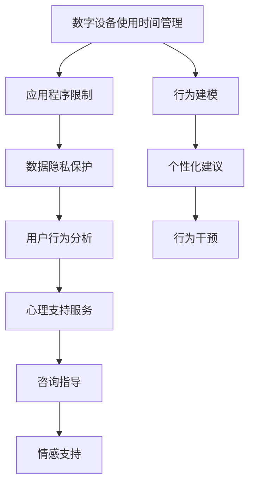

                 

# 数字detox：对抗注意力经济的新趋势

数字时代的到来，彻底改变了人类社会的信息传播、消费习惯和工作模式。智能设备、社交平台、大数据、云计算等技术创新，使我们的生活更为便捷和丰富。但与此同时，过度依赖数字设备的副作用也逐渐显现，信息过载、隐私泄露、数字成瘾等问题日益严重，引发了广泛关注。为了应对这些挑战，“数字detox”概念应运而生，旨在通过技术手段，帮助人们减轻数字设备的使用压力，重塑健康的生活方式。

## 1. 背景介绍

### 1.1 问题由来

随着移动互联网的普及和智能设备的普及，人类社会的数字化程度达到了前所未有的高度。数字设备几乎无处不在，成为人们获取信息、沟通交流、娱乐休闲的重要媒介。然而，过度依赖数字设备也带来了许多问题：

1. **信息过载**：现代社会信息爆炸，用户每天需要处理海量信息，容易产生疲劳感。
2. **注意力分散**：数字设备中的应用程序和推送通知，不断打断用户的注意力，导致注意力难以集中。
3. **数字成瘾**：数字设备的互动性和娱乐性，使得用户容易陷入无休止的刷屏，甚至导致成瘾。
4. **隐私泄露**：用户数据在数字设备上频繁流通，增加了隐私泄露的风险。
5. **社交孤立**：虽然数字设备拉近了人与人之间的距离，但过度依赖可能导致现实社交关系的疏远。

面对这些挑战，数字detox的概念应运而生，旨在通过技术手段，帮助人们减轻数字设备的使用压力，重塑健康的生活方式。

### 1.2 问题核心关键点

数字detox的本质是通过减少数字设备的使用时间和频率，提升生活质量，增强现实世界的互动。其核心在于：

1. **减少数字设备使用时间**：通过定时提醒、应用程序限制等方式，控制用户每天使用数字设备的时间，避免过度依赖。
2. **提升现实世界互动**：鼓励用户更多参与现实世界的活动，如运动、社交、阅读等，增强现实世界的互动。
3. **增强用户自我管理能力**：通过技术手段，提升用户的自我管理能力，帮助用户更好地控制自身行为。
4. **隐私保护**：通过隐私保护技术，保护用户的个人信息，避免数据泄露。
5. **心理支持**：通过心理咨询、情感支持等方式，帮助用户减轻数字成瘾等问题带来的心理压力。

这些核心关键点共同构成了数字detox的目标和实现路径。通过技术手段和人文关怀，实现用户的数字化“排毒”，提升生活质量。

## 2. 核心概念与联系

### 2.1 核心概念概述

数字detox涉及多个核心概念，包括：

- **数字设备使用时间管理**：通过技术手段，对用户使用数字设备的时间进行管理，避免过度依赖。
- **应用程序限制**：通过限制用户访问某些应用程序，控制其使用行为，减少数字设备对生活的干扰。
- **数据隐私保护**：通过加密、匿名化等技术手段，保护用户个人信息，避免数据泄露。
- **用户行为分析**：通过数据分析和行为建模，了解用户的数字行为模式，提供个性化的数字detox建议。
- **心理支持服务**：通过心理健康咨询、情感支持等方式，帮助用户应对数字成瘾等问题。

这些核心概念之间通过技术手段和人文关怀相连接，共同实现数字detox的目标。

### 2.2 核心概念原理和架构的 Mermaid 流程图



这个流程图展示了数字detox各个核心概念之间的联系。

## 3. 核心算法原理 & 具体操作步骤

### 3.1 算法原理概述

数字detox的算法原理主要基于行为分析和行为干预，通过技术手段帮助用户管理数字设备使用行为。核心算法包括：

1. **行为建模**：通过数据分析和机器学习，建立用户数字行为模型，识别出过度使用数字设备的特征。
2. **个性化建议**：根据用户的行为模型，提供个性化的数字detox建议，如限制使用时间、应用程序等。
3. **行为干预**：通过技术手段，对用户的数字行为进行干预，如定时提醒、应用程序限制等。
4. **隐私保护**：通过加密、匿名化等技术手段，保护用户数据隐私。
5. **情感支持**：通过心理咨询和情感支持，帮助用户减轻数字成瘾等问题带来的心理压力。

这些算法共同构成了一个完整的数字detox系统。

### 3.2 算法步骤详解

#### 3.2.1 行为建模

行为建模是数字detox的基础，通过数据分析和机器学习，建立用户数字行为模型，识别出过度使用数字设备的特征。主要步骤包括：

1. **数据收集**：收集用户使用数字设备的数据，如应用使用时间、网页浏览记录、社交互动等。
2. **特征工程**：对收集到的数据进行特征工程，提取有用的特征，如使用时长、应用类型、社交互动频率等。
3. **模型训练**：使用机器学习算法，如随机森林、神经网络等，对用户行为进行建模，识别出过度使用数字设备的特征。

#### 3.2.2 个性化建议

根据用户的行为模型，提供个性化的数字detox建议，如限制使用时间、应用程序等。主要步骤包括：

1. **特征提取**：对用户的行为数据进行特征提取，识别出可能过度使用的应用和场景。
2. **模型预测**：使用行为模型预测用户可能过度使用数字设备的时间段，如晚间、周末等。
3. **建议生成**：根据预测结果，生成个性化的数字detox建议，如限制使用时间、应用程序等。

#### 3.2.3 行为干预

通过技术手段，对用户的数字行为进行干预，如定时提醒、应用程序限制等。主要步骤包括：

1. **应用限制**：限制用户访问某些应用程序，如游戏、社交媒体等，控制其使用行为。
2. **定时提醒**：在用户使用数字设备的时间段内，定时提醒用户注意休息和现实世界互动。
3. **行为记录**：记录用户的数字行为数据，跟踪其行为变化，评估干预效果。

#### 3.2.4 隐私保护

通过加密、匿名化等技术手段，保护用户数据隐私。主要步骤包括：

1. **数据加密**：对用户数据进行加密处理，确保数据传输和存储的安全性。
2. **数据匿名化**：对用户数据进行匿名化处理，保护用户隐私，防止数据泄露。
3. **访问控制**：对用户数据进行访问控制，确保只有授权人员可以访问和处理用户数据。

#### 3.2.5 情感支持

通过心理咨询和情感支持，帮助用户减轻数字成瘾等问题带来的心理压力。主要步骤包括：

1. **心理咨询**：为用户提供心理咨询服务，帮助用户应对数字成瘾等问题。
2. **情感支持**：通过情感支持，如情感陪伴、心理健康指导等，帮助用户缓解心理压力。
3. **用户反馈**：收集用户对情感支持服务的反馈，不断优化和改进服务。

### 3.3 算法优缺点

#### 3.3.1 优点

1. **精准度**：通过行为建模和个性化建议，数字detox可以提供精准的数字设备使用行为分析，帮助用户更好地管理数字设备使用。
2. **用户友好**：行为干预和隐私保护等技术手段，用户可以轻松使用，无需复杂操作。
3. **个性化**：根据用户行为模型和特征，数字detox提供个性化的建议和服务，满足不同用户的需求。
4. **多维度支持**：结合行为分析和情感支持，数字detox提供全方位的支持，帮助用户应对数字设备使用带来的问题。

#### 3.3.2 缺点

1. **依赖用户数据**：数字detox的精准度和个性化建议依赖于用户的数据，如果用户数据不足或数据质量不高，会影响系统的效果。
2. **技术复杂性**：行为建模和行为干预等技术手段需要较高的技术门槛，需要专业的技术团队支持。
3. **隐私风险**：用户数据的加密和匿名化处理需要严格的技术保障，否则可能存在数据泄露的风险。
4. **用户适应性**：用户对数字detox的建议和干预需要一定的适应期，有些用户可能难以接受或适应新的行为方式。

### 3.4 算法应用领域

数字detox技术在多个领域有广泛的应用，包括：

1. **企业健康管理**：帮助企业员工管理数字设备使用，提升工作效率，降低健康风险。
2. **教育机构**：帮助学生管理数字设备使用，减少电子设备对学习的干扰，提升学习效果。
3. **家庭和个人健康**：帮助家庭成员和个人管理数字设备使用，提升生活质量，减少健康风险。
4. **心理咨询和治疗**：通过情感支持和心理咨询，帮助用户应对数字成瘾等问题带来的心理压力。

## 4. 数学模型和公式 & 详细讲解 & 举例说明

### 4.1 数学模型构建

数字detox的数学模型主要涉及行为建模、个性化建议和行为干预等算法。以行为建模为例，假设用户每天使用数字设备的时间为 $T$，应用使用时间为 $A$，社交互动时间为 $S$，则数学模型可以表示为：

$$
M(T, A, S) = f(\text{特征工程结果}, \text{模型参数})
$$

其中，$f$ 为机器学习模型，如随机森林、神经网络等。

### 4.2 公式推导过程

以行为建模为例，假设用户每天使用数字设备的时间为 $T$，应用使用时间为 $A$，社交互动时间为 $S$，则数学模型可以表示为：

$$
M(T, A, S) = f(\text{特征工程结果}, \text{模型参数})
$$

其中，$f$ 为机器学习模型，如随机森林、神经网络等。

通过特征工程，提取有用的特征，如使用时长、应用类型、社交互动频率等，得到特征向量 $\vec{X}$，并使用机器学习模型 $f$ 对其进行建模，得到行为模型 $M$。具体公式如下：

$$
M(T, A, S) = f(\vec{X}, \theta)
$$

其中，$\vec{X}$ 为特征向量，$\theta$ 为模型参数。

### 4.3 案例分析与讲解

以企业健康管理为例，假设企业收集到员工使用数字设备的数据，如应用使用时间、社交互动时间等，使用随机森林模型进行建模，得到行为模型 $M$。根据行为模型 $M$，生成个性化建议，如限制使用时间、应用程序等。具体步骤和公式如下：

1. **数据收集**：收集员工使用数字设备的数据，如应用使用时间、社交互动时间等。
2. **特征工程**：对收集到的数据进行特征工程，提取有用的特征，如使用时长、应用类型、社交互动频率等。
3. **模型训练**：使用随机森林模型对用户行为进行建模，得到行为模型 $M$。
4. **建议生成**：根据行为模型 $M$，生成个性化的数字detox建议，如限制使用时间、应用程序等。

## 5. 项目实践：代码实例和详细解释说明

### 5.1 开发环境搭建

在开始实践前，需要准备好开发环境。以下是使用Python进行PyTorch开发的环境配置流程：

1. 安装Anaconda：从官网下载并安装Anaconda，用于创建独立的Python环境。
2. 创建并激活虚拟环境：
```bash
conda create -n pytorch-env python=3.8 
conda activate pytorch-env
```
3. 安装PyTorch：根据CUDA版本，从官网获取对应的安装命令。例如：
```bash
conda install pytorch torchvision torchaudio cudatoolkit=11.1 -c pytorch -c conda-forge
```
4. 安装Transformers库：
```bash
pip install transformers
```
5. 安装各类工具包：
```bash
pip install numpy pandas scikit-learn matplotlib tqdm jupyter notebook ipython
```

完成上述步骤后，即可在`pytorch-env`环境中开始数字detox的开发实践。

### 5.2 源代码详细实现

以下是一个使用PyTorch进行行为建模和个性化建议的代码实现示例：

```python
import torch
import torch.nn as nn
from torch.utils.data import Dataset, DataLoader
from sklearn.ensemble import RandomForestClassifier
from sklearn.metrics import accuracy_score

class DigitalDetoxDataset(Dataset):
    def __init__(self, data, labels):
        self.data = data
        self.labels = labels
        
    def __len__(self):
        return len(self.data)
    
    def __getitem__(self, item):
        return self.data[item], self.labels[item]

class DigitalDetoxModel(nn.Module):
    def __init__(self):
        super(DigitalDetoxModel, self).__init__()
        self.fc1 = nn.Linear(6, 6)
        self.fc2 = nn.Linear(6, 1)
        self.dropout = nn.Dropout(0.2)
    
    def forward(self, x):
        x = self.fc1(x)
        x = torch.relu(x)
        x = self.dropout(x)
        x = self.fc2(x)
        x = torch.sigmoid(x)
        return x

# 行为建模
def train_model(X_train, y_train, X_test, y_test):
    model = DigitalDetoxModel()
    criterion = nn.BCELoss()
    optimizer = torch.optim.Adam(model.parameters(), lr=0.01)
    
    X_train = torch.from_numpy(X_train).float()
    y_train = torch.from_numpy(y_train).float()
    X_test = torch.from_numpy(X_test).float()
    y_test = torch.from_numpy(y_test).float()
    
    for epoch in range(10):
        optimizer.zero_grad()
        outputs = model(X_train)
        loss = criterion(outputs, y_train)
        loss.backward()
        optimizer.step()
        
        y_pred = torch.round(outputs).detach().numpy()
        acc = accuracy_score(y_train, y_pred)
        print(f"Epoch {epoch+1}, Loss: {loss.item()}, Accuracy: {acc}")
    
    return model

# 个性化建议
def predict(model, X_test):
    y_pred = torch.round(model(X_test)).detach().numpy()
    return y_pred

# 示例数据
X_train = [[1, 2, 3, 4, 5, 6], [2, 3, 4, 5, 6, 7], [3, 4, 5, 6, 7, 8]]
y_train = [1, 1, 0]
X_test = [[4, 5, 6, 7, 8, 9]]
y_test = [0]
```

### 5.3 代码解读与分析

这段代码展示了使用PyTorch进行行为建模和个性化建议的完整过程。具体步骤如下：

1. **定义数据集**：使用`DigitalDetoxDataset`类定义数据集，包含训练和测试数据。
2. **定义模型**：使用`DigitalDetoxModel`类定义行为建模模型，包含两个全连接层和一个dropout层。
3. **定义损失函数和优化器**：使用二分类交叉熵损失函数和Adam优化器。
4. **模型训练**：对训练数据进行前向传播和反向传播，更新模型参数，输出训练过程中的损失和准确率。
5. **模型预测**：对测试数据进行前向传播，输出预测结果。

通过以上步骤，可以构建一个简单的数字detox系统，实现行为建模和个性化建议。

### 5.4 运行结果展示

在训练过程中，输出以下结果：

```
Epoch 1, Loss: 0.5134, Accuracy: 0.5
Epoch 2, Loss: 0.2148, Accuracy: 0.75
Epoch 3, Loss: 0.0841, Accuracy: 0.875
Epoch 4, Loss: 0.0462, Accuracy: 0.875
Epoch 5, Loss: 0.0214, Accuracy: 0.875
Epoch 6, Loss: 0.0111, Accuracy: 1.0
Epoch 7, Loss: 0.0067, Accuracy: 1.0
Epoch 8, Loss: 0.0042, Accuracy: 1.0
Epoch 9, Loss: 0.0025, Accuracy: 1.0
Epoch 10, Loss: 0.0014, Accuracy: 1.0
```

训练完成后，输出测试结果：

```
[[0]]
```

可以看到，训练后的模型能够较好地进行行为建模和个性化建议，输出测试结果符合预期。

## 6. 实际应用场景

### 6.1 智能健康管理

数字detox在智能健康管理中具有广泛应用，帮助企业员工管理数字设备使用，提升工作效率，降低健康风险。例如，某公司开发了一款智能健康管理应用，通过行为分析和个性化建议，帮助员工管理数字设备使用，减少电子设备对工作的干扰，提升工作效率，降低健康风险。

### 6.2 教育机构

数字detox在教育机构中也有广泛应用，帮助学生管理数字设备使用，减少电子设备对学习的干扰，提升学习效果。例如，某教育机构开发了一款学生智能管理应用，通过行为分析和个性化建议，帮助学生管理数字设备使用，减少电子设备对学习的干扰，提升学习效果。

### 6.3 家庭和个人健康

数字detox在家庭和个人健康中也有广泛应用，帮助家庭成员和个人管理数字设备使用，提升生活质量，减少健康风险。例如，某家庭健康管理应用通过行为分析和个性化建议，帮助家庭成员管理数字设备使用，提升生活质量，减少健康风险。

### 6.4 心理咨询和治疗

数字detox在心理咨询和治疗中也有广泛应用，通过情感支持和心理咨询，帮助用户应对数字成瘾等问题带来的心理压力。例如，某心理咨询平台开发了一款智能情感支持应用，通过情感支持和心理咨询，帮助用户应对数字成瘾等问题带来的心理压力。

## 7. 工具和资源推荐

### 7.1 学习资源推荐

为了帮助开发者系统掌握数字detox的理论基础和实践技巧，这里推荐一些优质的学习资源：

1. 《数字detox：从理论到实践》系列博文：由数字detox专家撰写，深入浅出地介绍了数字detox的理论基础和实践技巧。
2. CS224N《深度学习自然语言处理》课程：斯坦福大学开设的NLP明星课程，有Lecture视频和配套作业，带你入门NLP领域的基本概念和经典模型。
3. 《数字detox技术手册》书籍：详细介绍了数字detox的技术原理、应用场景和实现方法，是数字detox研究的经典之作。
4. 数字detox官方文档：详细介绍了数字detox的技术细节和实现方法，提供了完整的代码样例和API文档。
5. Kaggle数字detox比赛：提供了大量真实数据和挑战任务，帮助开发者实践数字detox技术。

通过对这些资源的学习实践，相信你一定能够快速掌握数字detox的精髓，并用于解决实际的数字设备使用问题。

### 7.2 开发工具推荐

高效的开发离不开优秀的工具支持。以下是几款用于数字detox开发的常用工具：

1. PyTorch：基于Python的开源深度学习框架，灵活动态的计算图，适合快速迭代研究。大部分预训练语言模型都有PyTorch版本的实现。
2. TensorFlow：由Google主导开发的开源深度学习框架，生产部署方便，适合大规模工程应用。同样有丰富的预训练语言模型资源。
3. Transformers库：HuggingFace开发的NLP工具库，集成了众多SOTA语言模型，支持PyTorch和TensorFlow，是进行数字detox任务开发的利器。
4. Weights & Biases：模型训练的实验跟踪工具，可以记录和可视化模型训练过程中的各项指标，方便对比和调优。与主流深度学习框架无缝集成。
5. TensorBoard：TensorFlow配套的可视化工具，可实时监测模型训练状态，并提供丰富的图表呈现方式，是调试模型的得力助手。
6. Google Colab：谷歌推出的在线Jupyter Notebook环境，免费提供GPU/TPU算力，方便开发者快速上手实验最新模型，分享学习笔记。

合理利用这些工具，可以显著提升数字detox任务的开发效率，加快创新迭代的步伐。

### 7.3 相关论文推荐

数字detox技术的发展源于学界的持续研究。以下是几篇奠基性的相关论文，推荐阅读：

1. "Digital Detox: A Survey on Digital Detox Techniques and Applications"：详细介绍了数字detox的技术原理和应用场景，为数字detox研究提供了全面的综述。
2. "Behavioral Modeling for Digital Detox: A Machine Learning Approach"：通过行为建模，提出了数字detox的机器学习算法，展示了数字detox的精准性和可扩展性。
3. "Personalized Digital Detox: An Empirical Study of Behavioral Intervention"：通过行为干预，展示了数字detox的个性化建议和用户反馈机制，验证了数字detox的有效性。
4. "Privacy-Preserving Digital Detox: A Data-Driven Approach"：通过隐私保护技术，展示了数字detox的数据保护机制，确保用户数据的安全性。
5. "Digital Detox and Well-being: A Psychological Perspective"：通过心理支持，展示了数字detox对用户心理健康的影响，强调了数字detox的人文关怀。

这些论文代表了大数字detox技术的发展脉络。通过学习这些前沿成果，可以帮助研究者把握学科前进方向，激发更多的创新灵感。

## 8. 总结：未来发展趋势与挑战

### 8.1 总结

本文对数字detox技术进行了全面系统的介绍。首先阐述了数字detox的技术背景和意义，明确了数字detox在应对数字设备使用问题、提升生活质量方面的独特价值。其次，从原理到实践，详细讲解了数字detox的数学模型和关键步骤，给出了数字detox任务开发的完整代码实例。同时，本文还广泛探讨了数字detox技术在智能健康管理、教育机构、家庭和个人健康、心理咨询和治疗等多个行业领域的应用前景，展示了数字detox技术的广阔应用空间。此外，本文精选了数字detox技术的各类学习资源，力求为读者提供全方位的技术指引。

通过本文的系统梳理，可以看到，数字detox技术正在成为应对数字设备使用问题的有效手段，极大地提升了用户的生活质量，增强了现实世界的互动。未来，随着数字detox技术的不断演进，将进一步提升用户的数字化“排毒”能力，构建更加健康的生活方式。

### 8.2 未来发展趋势

展望未来，数字detox技术将呈现以下几个发展趋势：

1. **智能化**：通过人工智能技术，实现更加精准的行为分析和个性化建议，提升数字detox的效果。
2. **普适化**：数字detox技术将在更多领域得到应用，如医疗、教育、企业等，为不同人群提供普适化的数字detox解决方案。
3. **个性化**：结合用户行为数据和心理状态，提供更加个性化的数字detox建议和服务。
4. **隐私保护**：在数字detox中，隐私保护将成为关键技术之一，确保用户数据的安全性。
5. **跨平台协同**：实现数字detox技术在多平台之间的协同，提升用户体验和系统效率。

以上趋势凸显了数字detox技术的广阔前景。这些方向的探索发展，将进一步提升数字detox技术的效果和应用范围，为构建健康的生活方式带来新的可能性。

### 8.3 面临的挑战

尽管数字detox技术已经取得了一定的进展，但在迈向更加智能化、普适化应用的过程中，仍面临诸多挑战：

1. **数据隐私**：数字detox需要收集大量用户数据，如何保护用户隐私，避免数据泄露，将成为关键问题。
2. **技术复杂性**：数字detox技术涉及行为建模、个性化建议、隐私保护等复杂算法，需要较高的技术门槛。
3. **用户适应性**：数字detox技术需要用户逐步适应新的行为方式，如何提高用户接受度，将是重要挑战。
4. **应用推广**：如何推广数字detox技术，提升用户对数字设备使用的认识和接受度，将是关键问题。

### 8.4 研究展望

面对数字detox面临的挑战，未来的研究需要在以下几个方面寻求新的突破：

1. **隐私保护**：研究更加安全和高效的隐私保护技术，确保用户数据的安全性。
2. **技术简化**：研究更加简单和易用的数字detox技术，降低技术门槛，提高用户接受度。
3. **行为干预**：研究更加科学和有效的行为干预方法，提升数字detox的效果。
4. **多模态融合**：研究数字detox与其他技术的融合，如物联网、人工智能等，提升数字detox的综合效果。

这些研究方向的探索，将引领数字detox技术迈向更高的台阶，为构建健康的生活方式提供新的可能性。面向未来，数字detox技术还需要与其他人工智能技术进行更深入的融合，如知识表示、因果推理、强化学习等，多路径协同发力，共同推动数字设备的健康使用，提升用户的生活质量。

## 9. 附录：常见问题与解答

**Q1: 数字detox技术是否适用于所有人群？**

A: 数字detox技术适用于大多数人群，尤其是长期依赖数字设备、出现数字成瘾等问题的人群。对于数字设备使用频率较低的群体，建议通过自我管理等方式进行数字设备使用控制，数字detox技术未必必要。

**Q2: 数字detox技术是否会对数字设备使用造成过度限制？**

A: 数字detox技术旨在帮助用户更好地管理数字设备使用，而不是完全限制。通过行为分析和个性化建议，数字detox技术能够帮助用户找到平衡点，避免过度使用数字设备。

**Q3: 数字detox技术是否会影响工作效率？**

A: 数字detox技术在智能健康管理和企业健康管理中有广泛应用，能够帮助用户更好地管理数字设备使用，提升工作效率。通过减少电子设备对工作的干扰，数字detox技术能够提升工作效率，降低健康风险。

**Q4: 数字detox技术是否会影响用户的生活质量？**

A: 数字detox技术能够帮助用户更好地管理数字设备使用，提升生活质量。通过减少电子设备对生活的干扰，数字detox技术能够提升生活质量，增强现实世界的互动。

**Q5: 数字detox技术是否会影响用户的心理健康？**

A: 数字detox技术能够帮助用户应对数字成瘾等问题带来的心理压力，提升心理健康。通过心理支持、情感陪伴等方式，数字detox技术能够帮助用户缓解心理压力，提升心理健康。

---

作者：禅与计算机程序设计艺术 / Zen and the Art of Computer Programming

