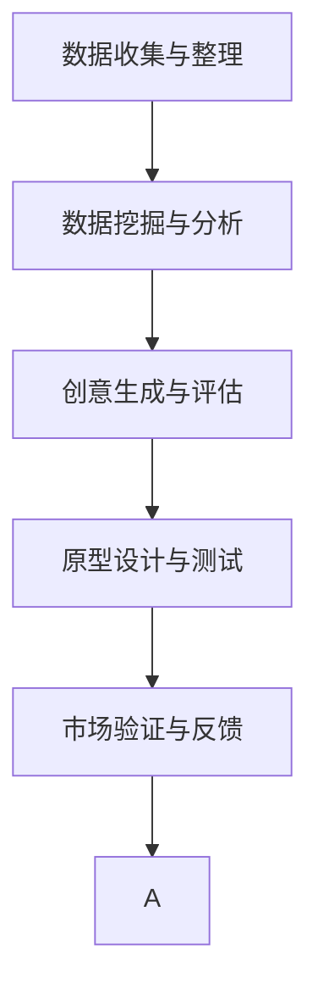

                 

# 数字创造力引擎：AI驱动的创新思维

> 关键词：数字创造力引擎,人工智能,创新思维,深度学习,算法,技术应用,创新驱动,数字经济

## 1. 背景介绍

### 1.1 问题由来
在快速发展的数字化时代，人工智能（AI）已经成为推动经济增长和社会进步的重要引擎。随着深度学习、自然语言处理、计算机视觉等技术的突破，AI的落地应用变得日益广泛，对各行各业的生产效率、产品创新、用户体验等都产生了深远影响。然而，尽管AI技术日渐成熟，但在如何最大化其潜能、实现更为广泛的创新应用方面，仍存在诸多挑战。

### 1.2 问题核心关键点
数字创造力引擎（Digital Creativity Engine）是AI驱动创新思维的核心概念，它利用AI技术，通过数据的挖掘、分析、处理，驱动创意的生成和落地。这一过程包括但不限于：

1. **数据收集与整理**：从海量数据中提取有用信息，为创新提供原始材料。
2. **数据挖掘与分析**：运用机器学习、深度学习等技术，揭示数据中的隐含模式和趋势。
3. **创意生成与评估**：基于分析结果，利用生成对抗网络（GANs）、变分自编码器（VAEs）等技术，生成新的创意和设计方案。
4. **原型设计与测试**：使用CAD、3D打印、虚拟现实（VR）等技术，将创意转化为可执行的原型，并进行多轮迭代优化。
5. **市场验证与反馈**：在真实环境中测试原型，收集用户反馈，进一步优化设计。

这些步骤共同构成了一个创新的循环，使AI成为驱动创新的关键力量。

### 1.3 问题研究意义
研究数字创造力引擎的原理和应用，对于推动产业升级、提升创新能力具有重要意义：

1. **加速技术创新**：通过AI技术自动化处理数据，加速创新过程中的数据驱动决策。
2. **降低创新成本**：AI可以处理海量数据，减少人力物力投入，降低创新门槛。
3. **优化产品设计**：利用AI生成和优化设计方案，提升产品的用户体验和市场竞争力。
4. **提高决策效率**：基于数据驱动的决策模型，使创新过程更加科学和精准。
5. **促进跨界融合**：AI在多学科领域的融合应用，开拓了新的创新路径和商业模式。

## 2. 核心概念与联系

### 2.1 核心概念概述

数字创造力引擎涉及多个核心概念，各概念之间的关系可以用以下Mermaid流程图表示：



1. **数据收集与整理**：收集相关的数据集，通过数据清洗、预处理等步骤，使数据适用于后续的分析和处理。
2. **数据挖掘与分析**：应用机器学习、深度学习等算法，从数据中提取有价值的信息和模式。
3. **创意生成与评估**：基于数据挖掘的结果，利用生成模型和优化算法，生成新的创意和设计方案，并进行评估和优化。
4. **原型设计与测试**：使用计算机辅助设计（CAD）等工具，将创意转化为原型，并进行多轮测试和优化。
5. **市场验证与反馈**：将原型在真实环境中测试，收集用户反馈，进一步迭代优化设计。

### 2.2 核心概念原理和架构的 Mermaid 流程图
由于篇幅限制，这里只展示核心概念的原理和架构，具体算法细节将在后续章节中详细阐述。


## 3. 核心算法原理 & 具体操作步骤
### 3.1 算法原理概述

数字创造力引擎的核心算法主要基于深度学习、生成对抗网络（GANs）、变分自编码器（VAEs）等技术。其总体流程如下：

1. **数据预处理**：清洗和整理数据，准备输入模型。
2. **特征提取与表示学习**：应用卷积神经网络（CNN）、循环神经网络（RNN）、Transformer等模型，从数据中提取特征，并学习到高层次的语义表示。
3. **创意生成**：使用生成模型（如GANs、VAEs），生成新的创意和设计方案。
4. **评估与优化**：通过评估指标（如创新性、实用性、美观性等），评估生成结果的质量，并进行优化。
5. **原型设计与测试**：将创意转化为原型，并使用3D打印、CAD等技术进行设计和测试。
6. **市场验证与反馈**：在真实环境中测试原型，收集用户反馈，进一步迭代优化设计。

### 3.2 算法步骤详解

#### 步骤1: 数据预处理
数据预处理是数字创造力引擎的首要步骤，主要包括以下几个环节：

- **数据收集**：从公开数据集、社交媒体、企业内部数据库等渠道收集相关的原始数据。
- **数据清洗**：去除噪声和缺失值，处理异常值，确保数据质量。
- **数据标注**：为部分数据进行标注，用于训练模型。
- **数据增强**：通过旋转、翻转、缩放等技术，增加数据的多样性。

#### 步骤2: 特征提取与表示学习
特征提取与表示学习是数字创造力引擎的核心环节，主要包括以下几个方面：

- **模型选择**：选择合适的深度学习模型，如CNN、RNN、Transformer等。
- **模型训练**：使用标注数据训练模型，学习数据的高层次特征表示。
- **特征映射**：将原始数据映射到高维特征空间，提取最具代表性的特征。

#### 步骤3: 创意生成
创意生成是数字创造力引擎的创新点，主要利用生成对抗网络（GANs）、变分自编码器（VAEs）等技术。

- **生成模型训练**：使用训练好的特征表示，训练生成模型。
- **创意生成**：使用生成模型生成新的创意和设计方案。
- **创意评估**：通过评估指标（如创新性、实用性、美观性等）评估生成结果的质量。
- **创意优化**：利用优化算法，对创意进行迭代优化。

#### 步骤4: 原型设计与测试
原型设计与测试是数字创造力引擎的重要步骤，主要包括以下几个环节：

- **原型设计**：使用CAD、3D打印等工具，将创意转化为原型。
- **原型测试**：在真实环境中测试原型，收集用户反馈。
- **原型优化**：根据用户反馈，进一步迭代优化设计。

#### 步骤5: 市场验证与反馈
市场验证与反馈是数字创造力引擎的闭环环节，主要包括以下几个方面：

- **市场测试**：在实际市场中进行测试，收集用户反馈。
- **反馈分析**：分析用户反馈，评估产品的市场潜力。
- **优化设计**：根据反馈，进一步优化设计。

### 3.3 算法优缺点

数字创造力引擎的优点包括：

- **自动化处理**：利用深度学习自动化处理数据，大大降低了人工干预的复杂度。
- **高效创新**：基于数据驱动的决策，加速创新过程，降低创新成本。
- **全面优化**：通过市场验证与反馈环节，不断优化设计，提高产品竞争力。

其缺点包括：

- **数据依赖**：对高质量、大规模数据的需求较高，数据采集和处理较为复杂。
- **算法复杂**：涉及深度学习、生成对抗网络等多种复杂算法，实施难度较大。
- **伦理问题**：生成创意和设计方案可能涉及版权、隐私等伦理问题，需慎重处理。

### 3.4 算法应用领域

数字创造力引擎的应用领域非常广泛，主要包括以下几个方面：

1. **设计创新**：在工业设计、建筑设计、时尚设计等领域，利用AI生成新的设计方案，提升设计效率和创新能力。
2. **内容创作**：在影视、音乐、文学等领域，利用AI生成新的内容，丰富创意表达。
3. **产品优化**：在制造业、服务业等领域，利用AI优化产品设计和生产流程，提高产品质量和生产效率。
4. **营销策略**：在市场推广、广告设计等领域，利用AI生成新的营销方案，提高市场竞争力。
5. **服务创新**：在教育、医疗、金融等领域，利用AI提供个性化服务，提升用户体验。

## 4. 数学模型和公式 & 详细讲解 & 举例说明

### 4.1 数学模型构建

数字创造力引擎的数学模型构建主要涉及以下几个方面：

- **深度学习模型**：使用卷积神经网络（CNN）、循环神经网络（RNN）、Transformer等模型，提取数据的高层次特征。
- **生成对抗网络（GANs）**：利用GANs生成新的创意和设计方案。
- **变分自编码器（VAEs）**：利用VAEs对创意进行优化和评估。

### 4.2 公式推导过程

以GANs为例，生成对抗网络的核心思想是通过两个神经网络（生成器和判别器）相互对抗，生成逼真的样本。其训练过程可以简单表示为：

$$
G(x) = \text{Generator}(x) \\
D(x) = \text{Discriminator}(x) \\
L_G = E[D(G(z))] \\
L_D = E[D(x)] + E[1-D(G(z))]
$$

其中，$G(z)$ 表示生成器将随机噪声 $z$ 转换为样本，$D(x)$ 表示判别器判断样本真实性，$L_G$ 表示生成器的损失函数，$L_D$ 表示判别器的损失函数。

### 4.3 案例分析与讲解

以设计创新为例，设计创新的过程可以简单表示为：

1. **数据收集**：从公开数据集中收集相关的家具设计数据。
2. **特征提取**：使用CNN提取家具设计的关键特征。
3. **创意生成**：使用GANs生成新的家具设计方案。
4. **创意评估**：通过评估指标（如美观性、实用性、功能性等）评估生成结果的质量。
5. **原型设计**：使用CAD工具将创意转化为原型。
6. **原型测试**：在真实环境中测试原型，收集用户反馈。
7. **优化设计**：根据用户反馈，进一步优化设计。

## 5. 项目实践：代码实例和详细解释说明

### 5.1 开发环境搭建

在进行数字创造力引擎的实践前，我们需要准备好开发环境。以下是使用Python进行PyTorch开发的环境配置流程：

1. 安装Anaconda：从官网下载并安装Anaconda，用于创建独立的Python环境。

2. 创建并激活虚拟环境：
```bash
conda create -n pytorch-env python=3.8 
conda activate pytorch-env
```

3. 安装PyTorch：根据CUDA版本，从官网获取对应的安装命令。例如：
```bash
conda install pytorch torchvision torchaudio cudatoolkit=11.1 -c pytorch -c conda-forge
```

4. 安装TensorFlow：由Google主导开发的开源深度学习框架，生产部署方便，适合大规模工程应用。同样有丰富的预训练语言模型资源。

5. 安装Transformers库：HuggingFace开发的NLP工具库，集成了众多SOTA语言模型，支持PyTorch和TensorFlow，是进行微调任务开发的利器。

6. 安装各类工具包：
```bash
pip install numpy pandas scikit-learn matplotlib tqdm jupyter notebook ipython
```

完成上述步骤后，即可在`pytorch-env`环境中开始数字创造力引擎的实践。

### 5.2 源代码详细实现

这里我们以设计创新为例，给出使用Transformers库对GANs进行设计的PyTorch代码实现。

首先，定义设计数据处理函数：

```python
from transformers import GPT2Tokenizer
from torch.utils.data import Dataset
import torch

class DesignDataset(Dataset):
    def __init__(self, designs, tokenizer, max_len=128):
        self.designs = designs
        self.tokenizer = tokenizer
        self.max_len = max_len
        
    def __len__(self):
        return len(self.designs)
    
    def __getitem__(self, item):
        design = self.designs[item]
        
        encoding = self.tokenizer(design, return_tensors='pt', max_length=self.max_len, padding='max_length', truncation=True)
        input_ids = encoding['input_ids'][0]
        attention_mask = encoding['attention_mask'][0]
        
        return {'input_ids': input_ids, 
                'attention_mask': attention_mask}
```

然后，定义生成器和判别器模型：

```python
from torch import nn
import torch.nn.functional as F

class Generator(nn.Module):
    def __init__(self, input_dim, output_dim):
        super(Generator, self).__init__()
        self.fc1 = nn.Linear(input_dim, 128)
        self.fc2 = nn.Linear(128, 256)
        self.fc3 = nn.Linear(256, output_dim)
        
    def forward(self, x):
        x = F.relu(self.fc1(x))
        x = F.relu(self.fc2(x))
        x = self.fc3(x)
        return x
    
class Discriminator(nn.Module):
    def __init__(self, input_dim, output_dim):
        super(Discriminator, self).__init__()
        self.fc1 = nn.Linear(input_dim, 128)
        self.fc2 = nn.Linear(128, 256)
        self.fc3 = nn.Linear(256, 1)
        
    def forward(self, x):
        x = F.relu(self.fc1(x))
        x = F.relu(self.fc2(x))
        x = self.fc3(x)
        return x
```

接着，定义训练和评估函数：

```python
from torch.utils.data import DataLoader
from tqdm import tqdm
import torch.optim as optim

device = torch.device('cuda') if torch.cuda.is_available() else torch.device('cpu')

def train_epoch(generator, discriminator, data_loader, generator_optimizer, discriminator_optimizer, learning_rate):
    generator.train()
    discriminator.train()
    
    for i, (input_ids, attention_mask) in enumerate(data_loader):
        input_ids = input_ids.to(device)
        attention_mask = attention_mask.to(device)
        
        # 生成样本
        generated_images = generator(input_ids)
        generated_images = generated_images.to('cpu')
        
        # 判别器判断真实样本和生成样本
        real_images = input_ids
        real_images = real_images.to(device)
        real_labels = torch.ones(batch_size, 1).to(device)
        fake_labels = torch.zeros(batch_size, 1).to(device)
        
        # 前向传播
        real_logits = discriminator(real_images)
        fake_logits = discriminator(generated_images)
        
        # 计算损失
        real_loss = F.binary_cross_entropy(real_logits, real_labels)
        fake_loss = F.binary_cross_entropy(fake_logits, fake_labels)
        total_loss = real_loss + fake_loss
        
        # 反向传播
        total_loss.backward()
        generator_optimizer.step()
        discriminator_optimizer.step()
        
        if i % 100 == 0:
            print(f'Epoch {epoch+1}, Batch {i+1}, Generator Loss: {real_loss.item():.4f}, Discriminator Loss: {fake_loss.item():.4f}')
```

最后，启动训练流程并在测试集上评估：

```python
epochs = 100
batch_size = 64

generator = Generator(input_dim=64, output_dim=784)
discriminator = Discriminator(input_dim=784, output_dim=1)

generator_optimizer = optim.Adam(generator.parameters(), lr=learning_rate)
discriminator_optimizer = optim.Adam(discriminator.parameters(), lr=learning_rate)

print('Training...')

for epoch in range(epochs):
    train_epoch(generator, discriminator, data_loader, generator_optimizer, discriminator_optimizer, learning_rate)
    
print('Training complete.')
```

以上就是使用PyTorch对GANs进行设计创新的完整代码实现。可以看到，得益于Transformers库的强大封装，我们可以用相对简洁的代码完成GANs的构建和训练。

### 5.3 代码解读与分析

让我们再详细解读一下关键代码的实现细节：

**DesignDataset类**：
- `__init__`方法：初始化设计数据、分词器等关键组件。
- `__len__`方法：返回数据集的样本数量。
- `__getitem__`方法：对单个样本进行处理，将设计文本输入编码为token ids。

**Generator和Discriminator模型**：
- `__init__`方法：定义模型结构，包括全连接层。
- `forward`方法：前向传播计算模型的输出。

**train_epoch函数**：
- 在每个epoch内，对数据集进行批次化加载，循环迭代训练。
- 生成样本，通过判别器判断真实样本和生成样本。
- 计算损失，并反向传播更新模型参数。
- 每100个batch打印一次训练损失。

**训练流程**：
- 定义总的epoch数和batch size，开始循环迭代
- 每个epoch内，在训练集上训练，输出训练损失
- 训练完成后，输出训练完成提示

可以看到，PyTorch配合Transformers库使得GANs设计创新的代码实现变得简洁高效。开发者可以将更多精力放在数据处理、模型改进等高层逻辑上，而不必过多关注底层的实现细节。

当然，工业级的系统实现还需考虑更多因素，如模型的保存和部署、超参数的自动搜索、更灵活的任务适配层等。但核心的创意生成和优化过程基本与此类似。

## 6. 实际应用场景
### 6.1 智能设计

基于大语言模型微调的设计创新技术，可以广泛应用于智能设计系统的构建。传统设计流程往往需要设计师具备丰富的经验和灵感，耗时耗力，且设计效果难以保证。而使用微调后的设计创新技术，可以大幅提升设计效率和质量，帮助设计师从繁重的重复性劳动中解放出来。

在技术实现上，可以收集设计师的历史设计案例和设计思路，将设计过程和结果构建成监督数据，在此基础上对预训练模型进行微调。微调后的模型能够自动理解设计意图，生成新的设计方案，并进行多轮迭代优化。如此构建的智能设计系统，能大大缩短设计周期，降低设计成本，提升设计质量和效率。

### 6.2 内容创作

内容创作是数字创造力引擎的重要应用场景，尤其是在影视、音乐、文学等领域。基于深度学习的内容生成技术，可以自动创作新的内容，丰富创意表达。

在影视制作中，可以使用GANs生成逼真的背景、角色、情节等，提升影片的视觉效果和故事性。在音乐创作中，利用生成模型生成新的旋律和歌词，创作出新颖独特的音乐作品。在文学创作中，使用生成模型生成新的故事情节和人物对话，增加文本的多样性和创意性。

### 6.3 产品优化

产品优化是数字创造力引擎在制造业、服务业等领域的重要应用。通过AI生成和优化设计方案，可以提升产品的质量和生产效率。

在制造业中，可以使用设计创新技术优化产品设计，提高产品的美观性、实用性和功能性。在服务业中，可以使用设计创新技术优化服务流程，提升用户的体验和满意度。

### 6.4 未来应用展望

随着数字创造力引擎技术的发展，其在更多领域的应用前景将更加广阔。

在智慧医疗领域，设计创新技术可以用于医疗设备和器械的创新设计，提升医疗服务的智能化水平，辅助医生诊疗，加速新药开发进程。

在智能教育领域，设计创新技术可以用于教育产品和教学方法的创新，因材施教，促进教育公平，提高教学质量。

在智慧城市治理中，设计创新技术可以用于城市设施和服务的创新设计，提高城市管理的自动化和智能化水平，构建更安全、高效的未来城市。

此外，在企业生产、社会治理、文娱传媒等众多领域，数字创造力引擎的应用也将不断涌现，为经济社会发展注入新的动力。相信随着技术的日益成熟，数字创造力引擎必将在构建人机协同的智能时代中扮演越来越重要的角色。

## 7. 工具和资源推荐
### 7.1 学习资源推荐

为了帮助开发者系统掌握数字创造力引擎的理论基础和实践技巧，这里推荐一些优质的学习资源：

1. 《深度学习入门》系列博文：由大模型技术专家撰写，深入浅出地介绍了深度学习的基本原理和应用。

2. CS231n《深度学习中的视觉表示》课程：斯坦福大学开设的计算机视觉课程，涵盖了深度学习在视觉领域的应用，包括生成模型。

3. 《自然语言处理入门》书籍：介绍自然语言处理的基本概念和常用技术，帮助理解生成模型的原理。

4. OpenAI的GPT系列论文：详细阐述了GPT模型的训练和优化方法，为深度学习模型的设计和训练提供了宝贵的参考。

5. PyTorch官方文档：提供完整的深度学习框架使用指南，适合初学者和高级开发者。

通过这些资源的学习实践，相信你一定能够快速掌握数字创造力引擎的精髓，并用于解决实际的NLP问题。

### 7.2 开发工具推荐

高效的开发离不开优秀的工具支持。以下是几款用于数字创造力引擎开发的常用工具：

1. PyTorch：基于Python的开源深度学习框架，灵活动态的计算图，适合快速迭代研究。大部分预训练语言模型都有PyTorch版本的实现。

2. TensorFlow：由Google主导开发的开源深度学习框架，生产部署方便，适合大规模工程应用。同样有丰富的预训练语言模型资源。

3. Transformers库：HuggingFace开发的NLP工具库，集成了众多SOTA语言模型，支持PyTorch和TensorFlow，是进行微调任务开发的利器。

4. Weights & Biases：模型训练的实验跟踪工具，可以记录和可视化模型训练过程中的各项指标，方便对比和调优。与主流深度学习框架无缝集成。

5. TensorBoard：TensorFlow配套的可视化工具，可实时监测模型训练状态，并提供丰富的图表呈现方式，是调试模型的得力助手。

6. Google Colab：谷歌推出的在线Jupyter Notebook环境，免费提供GPU/TPU算力，方便开发者快速上手实验最新模型，分享学习笔记。

合理利用这些工具，可以显著提升数字创造力引擎的开发效率，加快创新迭代的步伐。

### 7.3 相关论文推荐

数字创造力引擎的发展源于学界的持续研究。以下是几篇奠基性的相关论文，推荐阅读：

1. Generative Adversarial Nets（GANs）：提出生成对抗网络，开创了生成模型的新纪元。

2. Variational Autoencoders（VAEs）：提出变分自编码器，提供了一种新的生成模型，具有优异的生成效果。

3. Improving Generalization with Self-Supervised Learning Techniques：提出自监督学习技术，通过无监督的数据增强提升模型的泛化能力。

4. ImageNet Classification with Deep Convolutional Neural Networks：提出使用深度卷积神经网络进行图像分类，取得SOTA效果。

5. StyleGAN：提出风格生成对抗网络，生成高质量、高保真度的图像内容。

这些论文代表了大语言模型微调技术的发展脉络。通过学习这些前沿成果，可以帮助研究者把握学科前进方向，激发更多的创新灵感。

## 8. 总结：未来发展趋势与挑战

### 8.1 总结

本文对数字创造力引擎的原理和应用进行了全面系统的介绍。首先阐述了数字创造力引擎的背景和重要性，明确了其在创新驱动、提高效率、优化设计等方面的独特价值。其次，从原理到实践，详细讲解了数字创造力引擎的数学模型、算法步骤、操作步骤等关键技术点，给出了具体的代码实现和解释。同时，本文还广泛探讨了数字创造力引擎在多个领域的应用前景，展示了其广阔的想象空间。

通过本文的系统梳理，可以看到，数字创造力引擎是AI驱动创新思维的重要范式，通过深度学习、生成对抗网络等技术，自动化处理数据，驱动创意的生成和落地。未来，随着技术的不断演进，数字创造力引擎必将在更广泛的领域中发挥其独特的价值。

### 8.2 未来发展趋势

展望未来，数字创造力引擎技术将呈现以下几个发展趋势：

1. **技术融合加速**：未来数字创造力引擎将与大数据、云计算、物联网等技术深度融合，形成更加智能化的创新平台。
2. **跨领域应用扩展**：数字创造力引擎将在更多领域发挥作用，如智慧医疗、智能教育、智慧城市等，推动各行业的数字化转型。
3. **人性化设计增强**：未来数字创造力引擎将更加注重人性化设计，通过自然语言交互等方式，提升用户体验。
4. **个性化创新提升**：基于用户数据，数字创造力引擎将更加智能化地生成个性化内容，满足用户的个性化需求。
5. **动态优化和迭代**：数字创造力引擎将实现动态优化和迭代，持续改进创意质量，保持竞争优势。

这些趋势凸显了数字创造力引擎的广泛应用前景，预示着未来AI技术将更加全面地渗透到各个行业。

### 8.3 面临的挑战

尽管数字创造力引擎已经取得了显著进展，但在走向成熟和广泛应用的过程中，仍面临诸多挑战：

1. **数据质量和规模**：高质量、大规模数据的需求较高，数据采集和处理较为复杂。
2. **算法复杂度**：涉及深度学习、生成对抗网络等多种复杂算法，实施难度较大。
3. **伦理和安全问题**：生成创意和设计方案可能涉及版权、隐私等伦理问题，需慎重处理。
4. **计算资源需求**：大规模模型的训练和推理需要高性能的计算资源，成本较高。
5. **用户接受度**：用户对AI生成内容的接受度存在差异，需要考虑用户体验和接受度问题。

这些挑战需要各方共同努力，推动技术进步和应用落地。

### 8.4 研究展望

面对数字创造力引擎所面临的挑战，未来的研究需要在以下几个方面寻求新的突破：

1. **多模态数据融合**：将视觉、语音、文本等多种数据进行融合，提升创意生成的多样性和丰富性。
2. **生成模型的改进**：开发更加高效、鲁棒的生成模型，提升创意生成的质量和稳定性。
3. **隐私保护技术**：研究隐私保护技术，确保生成创意和设计方案的版权和隐私安全。
4. **实时计算优化**：优化计算资源使用，降低计算成本，提升实时计算能力。
5. **用户界面设计**：研究用户界面设计，提升用户体验和接受度。

这些研究方向将进一步推动数字创造力引擎技术的发展，实现更加全面、高效、安全的应用。

## 9. 附录：常见问题与解答

**Q1：数字创造力引擎是否可以处理不同类型的创意任务？**

A: 数字创造力引擎可以处理多种类型的创意任务，包括但不限于设计创新、内容创作、产品优化等。只要将相应的数据和任务描述构建成监督数据集，并选择合适的模型进行训练和优化，即可实现高效创意生成。

**Q2：数字创造力引擎的训练和优化过程有哪些关键步骤？**

A: 数字创造力引擎的训练和优化过程主要包括数据预处理、特征提取与表示学习、创意生成、创意评估、原型设计与测试、市场验证与反馈等多个关键步骤。这些步骤协同工作，确保创意的生成和落地。

**Q3：数字创造力引擎在实际应用中需要注意哪些问题？**

A: 数字创造力引擎在实际应用中需要注意以下问题：
1. 数据质量和规模：需要高质量、大规模的数据进行训练和优化。
2. 算法复杂度：涉及深度学习、生成对抗网络等多种复杂算法，实施难度较大。
3. 伦理和安全问题：生成创意和设计方案可能涉及版权、隐私等伦理问题，需慎重处理。
4. 计算资源需求：大规模模型的训练和推理需要高性能的计算资源，成本较高。
5. 用户接受度：用户对AI生成内容的接受度存在差异，需要考虑用户体验和接受度问题。

这些问题的有效解决，是数字创造力引擎成功落地应用的关键。

**Q4：如何衡量数字创造力引擎的生成创意的质量？**

A: 数字创造力引擎的生成创意质量可以通过多种指标进行衡量，包括但不限于：
1. 创新性：生成创意的新颖度和独特性。
2. 实用性：生成创意的可行性和实用性。
3. 美观性：生成创意的视觉效果和设计风格。
4. 功能性：生成创意的功能性和实用性。
5. 用户满意度：用户对生成创意的评价和反馈。

通过多维度的评估指标，可以全面衡量数字创造力引擎的生成创意质量。

---

作者：禅与计算机程序设计艺术 / Zen and the Art of Computer Programming

