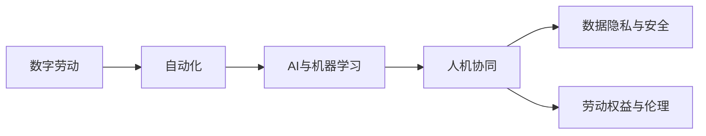

                 

# 数字劳动与未来工作：人类计算的社会影响

在当今数字化时代，人工智能(AI)和自动化技术正在重塑工作环境，深刻影响着劳动方式、就业结构和社会动态。本文将深入探讨数字劳动的概念及其在未来工作中的作用，分析这些变化对人类计算的社会影响，并展望未来可能的发展趋势和挑战。

## 1. 背景介绍

### 1.1 问题由来
随着信息技术的发展，自动化、AI和大数据技术的广泛应用，数字劳动已经逐渐成为一种新的工作形态。数字劳动涵盖了从数据收集、处理到分析和决策的各个环节，其本质是将人类劳动转化为可量化的数据输入，由机器和算法进行自动化处理和优化。这种劳动方式不仅改变了传统的生产方式，也引发了关于就业、劳动权益和社会治理的诸多讨论。

### 1.2 问题核心关键点
数字劳动的核心关键点包括：
- **数据与算法**：数字劳动依赖于海量的数据和复杂的算法进行决策和优化，数据质量与算法性能直接影响劳动效率和结果。
- **人机协同**：人机协同是数字劳动的核心，机器负责自动化处理数据，而人类负责监督和优化算法，确保结果的合理性和可解释性。
- **劳动权益**：数字劳动背景下，如何保障劳动者的权益，如隐私保护、数据安全、劳动报酬和福利等，成为亟待解决的问题。
- **社会治理**：数字劳动对就业市场、收入分配和社会治理结构产生深远影响，需要制定新的政策框架和监管措施。

## 2. 核心概念与联系

### 2.1 核心概念概述

为更好地理解数字劳动的概念及其影响，本文将介绍几个关键概念：

- **数字劳动**：一种依赖于数据和算法的劳动形态，通过自动化技术进行数据处理和决策，提高劳动效率和准确性。
- **自动化**：通过机器和算法自动完成重复性、标准化任务，减少人力投入，提高生产效率。
- **AI与机器学习**：利用人工智能和大数据技术，从数据中提取知识和模式，指导决策和优化。
- **人机协同**：人机互动，机器辅助人类完成复杂任务，同时人类监督和优化机器决策。
- **数据隐私与安全**：数据在使用和处理过程中，如何保护个人隐私和数据安全，避免滥用和泄露。
- **劳动权益与伦理**：在数字劳动背景下，如何保障劳动者的权益，如合理报酬、工作保障和公平待遇。

这些概念之间通过自动化、AI和算法技术紧密联系，共同构成了数字劳动的基本框架。

### 2.2 核心概念原理和架构的 Mermaid 流程图



该流程图展示了数字劳动的核心概念及其相互关系。自动化和AI技术是数字劳动的基础，通过算法和人机协同完成数据处理和决策。数据隐私和安全是人机协同中必须考虑的因素，而劳动权益和伦理则关注于如何保障劳动者在数字劳动环境中的利益。

## 3. 核心算法原理 & 具体操作步骤

### 3.1 算法原理概述

数字劳动的核心算法原理包括自动化、AI和算法优化。其基本流程如下：

1. **数据采集**：通过传感器、网络、社交媒体等渠道收集数据。
2. **数据处理**：使用自动化技术清洗、整理和筛选数据，确保数据质量。
3. **算法训练**：利用AI和机器学习技术，训练模型从数据中提取知识和模式。
4. **决策与优化**：基于训练好的模型，进行决策和优化，指导实际工作。
5. **反馈与改进**：对决策结果进行评估和反馈，优化算法和模型。

### 3.2 算法步骤详解

以下是数字劳动算法的详细步骤：

**Step 1: 数据收集与预处理**
- 使用API、爬虫等手段获取数据。
- 对数据进行清洗、去重、标准化处理。
- 数据划分训练集和测试集。

**Step 2: 算法模型选择与训练**
- 选择合适的算法模型，如决策树、神经网络、支持向量机等。
- 设置模型参数，如学习率、迭代次数等。
- 在训练集上训练模型，调整参数以最小化损失函数。

**Step 3: 决策与预测**
- 使用训练好的模型进行预测和决策。
- 根据预测结果采取相应措施，如自动化执行、人工审核等。

**Step 4: 结果评估与反馈**
- 在测试集上评估模型性能，如准确率、召回率等。
- 根据评估结果调整模型和算法，进行迭代改进。

### 3.3 算法优缺点

数字劳动算法具有以下优点：
1. **高效性**：自动化和AI技术可以大幅提高数据处理和决策效率。
2. **准确性**：通过算法优化，可以提升决策的准确性和可靠性。
3. **可扩展性**：算法模型可以应用于多种场景，具有较好的通用性和可扩展性。
4. **数据驱动**：基于数据的决策和优化，使得结果更加客观和科学。

同时，数字劳动算法也存在以下缺点：
1. **数据依赖**：依赖于高质量的数据，数据质量差可能影响决策结果。
2. **算法偏见**：算法可能继承数据中的偏见，导致不公平或歧视性决策。
3. **技术门槛**：需要专业知识和技能，普通人难以理解和操作。
4. **隐私与安全**：数据在处理和存储过程中可能面临隐私泄露和数据安全问题。

### 3.4 算法应用领域

数字劳动算法已经在多个领域得到广泛应用，例如：

- **金融风控**：使用AI算法进行信用评估、欺诈检测等。
- **医疗诊断**：利用机器学习模型进行疾病诊断和个性化治疗。
- **交通管理**：通过数据分析优化交通流量，提高交通安全。
- **智能制造**：通过自动化和算法优化，提高生产效率和产品质量。
- **智慧城市**：利用大数据和算法进行城市规划、能源管理、环境监测等。

这些领域的应用展示了数字劳动的强大潜力和广泛前景。

## 4. 数学模型和公式 & 详细讲解 & 举例说明

### 4.1 数学模型构建

数字劳动的数学模型通常涉及分类、回归、聚类等基本问题。以下以回归问题为例，构建数学模型。

设数据集 $D=\{(x_i,y_i)\}_{i=1}^N$，其中 $x_i \in \mathbb{R}^d$ 为输入，$y_i \in \mathbb{R}$ 为输出。假设使用线性回归模型 $y = \theta^T x + b$ 进行预测，其中 $\theta \in \mathbb{R}^d$ 为模型参数，$b \in \mathbb{R}$ 为偏置。模型的目标是最小化均方误差损失函数：

$$
\mathcal{L}(\theta) = \frac{1}{N} \sum_{i=1}^N (y_i - \theta^T x_i - b)^2
$$

### 4.2 公式推导过程

对上述损失函数求导，得到：

$$
\nabla_{\theta}\mathcal{L}(\theta) = \frac{2}{N} \sum_{i=1}^N (y_i - \theta^T x_i - b)x_i
$$

使用梯度下降算法进行模型训练：

$$
\theta \leftarrow \theta - \eta \nabla_{\theta}\mathcal{L}(\theta)
$$

其中 $\eta$ 为学习率，用于控制参数更新步长。

### 4.3 案例分析与讲解

以智能制造中的质量检测为例，使用线性回归模型进行预测：

1. **数据收集**：从生产线上采集加工后的产品尺寸、温度、压力等数据。
2. **数据预处理**：对数据进行清洗、标准化处理。
3. **模型训练**：使用历史数据训练线性回归模型，优化参数 $\theta$ 和偏置 $b$。
4. **预测与验证**：使用训练好的模型对新数据进行预测，并在验证集上评估模型性能。
5. **结果应用**：根据预测结果，对生产过程进行调整优化，提高产品质量。

## 5. 项目实践：代码实例和详细解释说明

### 5.1 开发环境搭建

在开始数字劳动项目实践前，需要先准备好开发环境。以下是使用Python进行Scikit-learn开发的准备工作：

1. 安装Anaconda：从官网下载并安装Anaconda，用于创建独立的Python环境。
2. 创建并激活虚拟环境：
```bash
conda create -n pytorch-env python=3.8 
conda activate pytorch-env
```
3. 安装Scikit-learn：
```bash
pip install scikit-learn
```
4. 安装各类工具包：
```bash
pip install numpy pandas scikit-learn matplotlib tqdm jupyter notebook ipython
```

完成上述步骤后，即可在`pytorch-env`环境中开始项目开发。

### 5.2 源代码详细实现

下面以智能制造中的质量检测为例，使用Scikit-learn库进行线性回归模型的实现。

首先，定义数据集和模型：

```python
import pandas as pd
from sklearn.model_selection import train_test_split
from sklearn.linear_model import LinearRegression

# 加载数据
data = pd.read_csv('product_dimensions.csv')

# 数据预处理
X = data[['temperature', 'pressure', 'humidity']]
y = data['quality_score']

# 数据划分
X_train, X_test, y_train, y_test = train_test_split(X, y, test_size=0.2, random_state=42)

# 定义模型
model = LinearRegression()
```

然后，进行模型训练和评估：

```python
# 训练模型
model.fit(X_train, y_train)

# 评估模型
train_score = model.score(X_train, y_train)
test_score = model.score(X_test, y_test)

print(f"训练集得分: {train_score:.3f}, 测试集得分: {test_score:.3f}")
```

最后，对新数据进行预测：

```python
# 预测新数据
new_data = pd.DataFrame({'temperature': [30, 25, 28], 'pressure': [0.9, 0.95, 0.95], 'humidity': [50, 55, 60]})
predictions = model.predict(new_data)

print(f"新数据预测结果: {predictions}")
```

以上就是使用Scikit-learn进行数字劳动项目实践的完整代码实现。可以看到，通过Scikit-learn库，我们可以用简洁的代码实现线性回归模型，快速完成数据处理和预测任务。

### 5.3 代码解读与分析

让我们再详细解读一下关键代码的实现细节：

**数据处理**：
- 使用Pandas库加载数据，并进行基本处理，如读取、清洗和标准化。

**模型定义与训练**：
- 使用Scikit-learn库定义线性回归模型，并在训练集上进行拟合训练。

**模型评估**：
- 使用训练集和测试集评估模型的性能，输出回归系数和截距，以及训练和测试得分。

**新数据预测**：
- 使用训练好的模型对新数据进行预测，并输出预测结果。

可以看到，Scikit-learn库为数字劳动项目的实现提供了强大的支持和工具，使得项目开发过程更加高效和便捷。

## 6. 实际应用场景

### 6.1 智能制造

在智能制造中，数字劳动已经广泛应用于产品质量检测、设备维护、生产调度等领域。使用AI和算法技术，可以实时监控生产过程中的各项参数，预测产品缺陷，优化生产流程，提高生产效率和产品质量。

以质量检测为例，将传感器数据输入模型，通过训练好的算法模型进行预测，判断产品质量是否合格。在预测结果不满足要求时，自动调整生产参数，确保产品质量。

### 6.2 智能医疗

智能医疗是数字劳动的另一个重要应用领域。通过AI技术，可以从海量的医疗数据中提取知识和模式，辅助医生进行诊断和治疗。

以疾病诊断为例，使用机器学习模型对病人的病历数据进行分析，提取特征并进行分类，预测病人可能患有的疾病。在预测结果出来后，医生可以结合实际病情进行综合诊断，提高诊断准确性和效率。

### 6.3 智能交通

智能交通是数字劳动在城市管理中的重要应用。通过数据分析和AI技术，可以优化交通流量，提高交通安全和通行效率。

以交通流量预测为例，使用算法模型对交通数据进行分析，预测未来交通流量，优化信号灯控制和交通规划。在高峰期，提前调整交通信号，减少拥堵，提高通行效率。

### 6.4 未来应用展望

未来，数字劳动将在更多领域得到应用，为社会带来新的变革：

1. **智能农业**：使用AI技术优化农作物的生长条件，提高产量和质量。通过传感器收集土壤、气候等数据，进行智能决策和优化。
2. **智慧城市**：利用大数据和算法技术，优化城市资源配置，提高城市管理效率和居民生活质量。
3. **智能制造**：通过自动化和算法优化，实现智能制造的可持续发展。
4. **智能金融**：使用AI和机器学习技术，进行信用评估、风险控制、智能投顾等。
5. **智慧教育**：通过AI技术，实现个性化教育、智能辅导和学习推荐。

## 7. 工具和资源推荐

### 7.1 学习资源推荐

为了帮助开发者系统掌握数字劳动的理论基础和实践技巧，这里推荐一些优质的学习资源：

1. **《机器学习实战》书籍**：通过实际案例，系统讲解机器学习和数据处理的基本原理和算法。
2. **Coursera《机器学习》课程**：由斯坦福大学Andrew Ng教授主讲，全面介绍机器学习的基本概念和应用。
3. **Kaggle平台**：提供大量的机器学习和数据科学竞赛，是实践和提高数据处理和算法能力的好地方。
4. **DeepLearning.ai平台**：提供多门深度学习课程，涵盖计算机视觉、自然语言处理等多个领域。
5. **GitHub**：存储了大量开源项目和代码，是学习数字劳动算法和项目开发的优秀资源库。

通过这些资源的学习实践，相信你一定能够快速掌握数字劳动的精髓，并用于解决实际的NLP问题。

### 7.2 开发工具推荐

高效的开发离不开优秀的工具支持。以下是几款用于数字劳动开发的常用工具：

1. **Scikit-learn**：Python机器学习库，提供了丰富的算法和模型，适用于各种数据处理和机器学习任务。
2. **TensorFlow**：Google开源的深度学习框架，支持多种机器学习算法和模型，适用于复杂的数据处理任务。
3. **Jupyter Notebook**：交互式编程环境，支持Python、R等多种语言，方便开发者进行代码调试和数据分析。
4. **PyTorch**：Facebook开源的深度学习框架，适用于动态计算图和神经网络模型的构建和训练。
5. **Keras**：高层次的深度学习API，简单易用，适用于快速搭建和训练神经网络模型。

合理利用这些工具，可以显著提升数字劳动任务的开发效率，加快创新迭代的步伐。

### 7.3 相关论文推荐

数字劳动技术的发展源于学界的持续研究。以下是几篇奠基性的相关论文，推荐阅读：

1. **《机器学习：一种算法导论》**：Tom Mitchell所著，全面介绍了机器学习的基本概念和算法。
2. **《深度学习》**：Ian Goodfellow、Yoshua Bengio和Aaron Courville所著，系统讲解深度学习的基本原理和应用。
3. **《人工智能：一种现代方法》**：Stuart Russell和Peter Norvig所著，介绍了人工智能的基本概念、算法和应用。
4. **《机器学习实战》**：Peter Harrington所著，通过实际案例，介绍了机器学习和数据处理的基本原理和算法。
5. **《自然语言处理综论》**：Daniel Jurafsky和James H. Martin所著，介绍了自然语言处理的基本概念和应用。

这些论文代表了大数据和人工智能技术的发展脉络。通过学习这些前沿成果，可以帮助研究者把握学科前进方向，激发更多的创新灵感。

## 8. 总结：未来发展趋势与挑战

### 8.1 研究成果总结

数字劳动技术在各个领域的应用已经取得了显著进展，展示了强大的潜力。然而，数字劳动也面临着诸多挑战，需要进一步的研究和优化：

1. **数据质量与多样性**：高质量的数据是数字劳动的基础，如何获取和处理多样化的数据，提升数据质量，是一个重要问题。
2. **算法透明性与可解释性**：算法的透明性和可解释性是保障数字劳动公平性和公正性的关键，需要通过更多的研究实现。
3. **隐私与安全**：数据在处理和存储过程中可能面临隐私泄露和数据安全问题，需要加强数据保护和隐私管理。
4. **跨领域应用**：数字劳动技术在不同领域的应用中，需要考虑领域特定的需求和约束，进行针对性的设计和优化。
5. **人机协同与自动化**：如何更好地实现人机协同，提高自动化水平，同时避免机器取代人类工作，是一个需要深入研究的问题。

### 8.2 未来发展趋势

展望未来，数字劳动技术将在更多领域得到应用，带来新的变革：

1. **跨领域融合**：数字劳动技术将在不同领域进行融合，形成更加智能和高效的系统。
2. **自动化水平提升**：随着技术的不断进步，自动化水平将进一步提升，实现更高效、更可靠的数据处理和决策。
3. **数据驱动决策**：基于大数据和算法技术的决策将更加科学和客观，提升决策的准确性和可靠性。
4. **人机协同优化**：人机协同将更加高效，机器辅助人类完成复杂任务，同时人类监督和优化机器决策。
5. **智能系统普及**：数字劳动技术将在更多场景中得到应用，推动智能系统的普及和落地。

### 8.3 面临的挑战

尽管数字劳动技术已经取得了一定的进展，但在迈向更加智能化、普适化应用的过程中，仍面临着诸多挑战：

1. **数据依赖**：数字劳动高度依赖于数据，如何获取和处理高质量数据，是一个重要的挑战。
2. **算法偏见**：算法可能继承数据中的偏见，导致不公平或歧视性决策。
3. **技术门槛**：数字劳动技术需要专业知识和技能，普通人难以理解和操作。
4. **隐私与安全**：数据在处理和存储过程中可能面临隐私泄露和数据安全问题。
5. **社会接受度**：数字劳动技术的应用可能引起社会对就业和劳动权益的担忧，需要加强公众教育和技术普及。

### 8.4 研究展望

未来，数字劳动技术的研究方向包括：

1. **无监督与半监督学习**：探索无监督和半监督学习技术，降低对标注数据的依赖，提升数据利用效率。
2. **跨模态学习**：研究跨模态数据融合技术，提高数字劳动的通用性和适应性。
3. **隐私保护与伦理**：研究隐私保护和伦理约束技术，确保数据安全和使用公正。
4. **人机协同优化**：研究人机协同与自动化技术，提升系统效率和用户体验。
5. **智能决策与优化**：研究智能决策和优化技术，提高决策的科学性和可靠性。

## 9. 附录：常见问题与解答

**Q1: 什么是数字劳动？**

A: 数字劳动是一种依赖于数据和算法的劳动形态，通过自动化和算法技术，从数据中提取知识和模式，指导决策和优化。

**Q2: 数字劳动与传统劳动有什么区别？**

A: 数字劳动与传统劳动的主要区别在于工作方式和工具。传统劳动主要依赖人力手工操作，而数字劳动则通过自动化和算法技术，实现数据驱动的决策和优化。

**Q3: 数字劳动技术的应用场景有哪些？**

A: 数字劳动技术已经在多个领域得到广泛应用，如金融风控、医疗诊断、智能制造、智慧城市等。

**Q4: 数字劳动技术面临哪些挑战？**

A: 数字劳动技术面临的主要挑战包括数据依赖、算法偏见、技术门槛、隐私安全、社会接受度等。

**Q5: 如何提高数字劳动技术的可靠性？**

A: 提高数字劳动技术的可靠性，需要从数据质量、算法透明性、隐私保护等方面进行综合优化，确保算法的公正性和公平性。

本文从数字劳动的概念、算法原理、项目实践和未来展望等方面进行了全面系统的介绍，希望为读者提供关于数字劳动的全面理解和技术指导。通过深入研究和实践，我们相信数字劳动技术将为未来的工作方式带来深刻变革，推动社会的全面进步。

