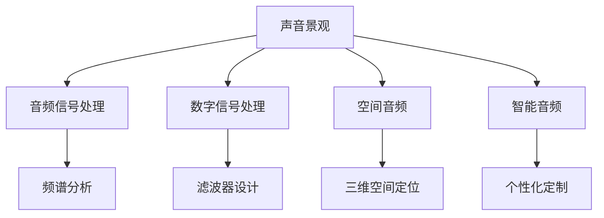

                 

# 数字化声音景观创业：定制化的听觉环境

> 关键词：声音景观、音频信号处理、数字信号处理、空间音频、智能音频、个性化定制、声景定制、声学设计、用户体验设计、人机交互

## 1. 背景介绍

### 1.1 问题由来

随着数字技术的飞速发展，声音景观逐渐成为人们日常生活的重要组成部分。声音不仅仅是沟通的媒介，更是影响人类情感、认知和行为的重要因素。在过去，声音景观的设计主要依赖于音频工程师和声学设计师的经验和直觉，但随着数字技术的引入，我们有了更多工具和方法来创建和分析声音景观，从而提升用户体验和声景设计的精确度。

然而，现有的声音景观设计方案往往高度依赖于音频工程师的专业知识和技能，普通用户难以参与其中。同时，现有的声景设计工具和软件大多功能单一，缺乏个性化和智能化的特点。因此，本项目旨在开发一款支持用户参与和定制的智能音频软件，让用户能够根据自身需求和喜好，创建个性化的声音景观。

### 1.2 问题核心关键点

该项目的核心目标是构建一个支持用户参与的智能音频平台，主要包括以下几个方面：

- 用户友好的声音景观设计界面。
- 强大的音频信号处理和分析能力。
- 支持个性化声景定制的工具和算法。
- 兼容各类音频设备和平台的接口。

通过开发这样的平台，我们希望普通用户也能够轻松地进行声音景观设计和声景定制，从而提升他们的生活品质和听觉体验。

## 2. 核心概念与联系

### 2.1 核心概念概述

为了更好地理解本项目，本节将介绍几个密切相关的核心概念：

- **声音景观(Soundscapes)**：指特定空间和时间内的声学环境，包括自然环境声、人工环境声以及人类活动声等。
- **音频信号处理(Audio Signal Processing)**：指对音频信号进行采集、处理、分析和变换的技术。
- **数字信号处理(Digital Signal Processing)**：指使用数字信号对声音信号进行处理和分析的技术。
- **空间音频(Spatial Audio)**：指利用数字信号处理技术，将声音信号与空间坐标信息结合，创造沉浸式听觉体验。
- **智能音频(Smart Audio)**：指结合人工智能和机器学习技术，自动生成和优化声音景观的设计和定制。

这些概念之间的逻辑关系可以通过以下Mermaid流程图来展示：



这个流程图展示了声音景观设计和声景定制涉及的主要技术领域：

1. 声音景观的创建和分析需要音频信号处理和数字信号处理。
2. 空间音频技术可以通过三维空间定位，增强声音的沉浸感和空间感。
3. 智能音频通过个性化定制，实现用户对声音景观的深度定制和优化。

## 3. 核心算法原理 & 具体操作步骤

### 3.1 算法原理概述

本项目的核心算法原理是结合音频信号处理、数字信号处理和空间音频技术，对声音景观进行创建和优化。具体而言，通过以下步骤实现声音景观的个性化定制：

1. 采集用户偏好和需求，生成声景设计模板。
2. 分析用户环境和设备参数，生成声景设计参数。
3. 利用数字信号处理技术，生成声景的音频信号。
4. 结合空间音频技术，实现声音的空间定位和沉浸感。
5. 利用机器学习算法，优化声景设计。

### 3.2 算法步骤详解

#### 3.2.1 用户需求采集与声景设计模板生成

首先，平台需要采集用户对声音景观的需求和偏好，这些信息可以是通过问卷调查、语音识别或者自然语言处理等方式获取。

随后，根据用户的反馈，生成初步的声景设计模板。模板可以包括不同的声学元素、音量、频率等参数，以及它们的布局和过渡方式。

#### 3.2.2 环境参数分析与声景设计参数生成

在用户确定声景设计模板后，平台需要分析用户的环境参数，如房间大小、形状、材料、设备类型等，以生成声景设计的参数。例如，房间大小可以决定声波的衰减和反射；房间形状和材料可以影响声音的扩散和聚焦；设备类型（如音箱、耳机）可以影响声音的输出方式和效果。

#### 3.2.3 音频信号生成与空间定位

利用数字信号处理技术，根据声景设计模板和参数，生成音频信号。平台可以使用各种滤波器、合成器和效果器来控制声音的频率、音量、空间效果等。

为了增强声音的沉浸感和空间感，平台还需要结合空间音频技术，实现声音的空间定位。这可以通过三维空间定位和音频渲染技术实现，让用户在不同空间内感受到声音的环绕效果。

#### 3.2.4 声景优化

在音频信号和空间定位完成后，平台还需要利用机器学习算法，对声景设计进行优化。例如，利用深度学习技术对音频信号进行降噪、增强和分离；利用强化学习技术对声景布局进行优化和调整，以实现最佳的声音效果。

### 3.3 算法优缺点

#### 3.3.1 优点

本项目采用的算法具有以下优点：

- **用户参与度**：用户可以深度参与声景设计过程，提升声音景观的个性化和可定制性。
- **智能化**：结合机器学习技术，可以自动优化声景设计，减少人工干预。
- **沉浸式体验**：结合空间音频技术，可以实现高质量的沉浸式听觉体验。
- **灵活性**：支持多种音频设备和平台，便于用户随时随地享受定制的声音景观。

#### 3.3.2 缺点

本项目也存在以下不足：

- **技术门槛高**：需要结合音频信号处理、数字信号处理和机器学习等技术，对开发团队的技术要求较高。
- **资源消耗大**：生成高质量的音频信号和空间定位需要较大的计算资源，特别是在实时处理时。
- **用户体验复杂**：声景设计涉及多个参数和步骤，用户需要一定的学习曲线，才能熟练使用。

### 3.4 算法应用领域

本项目开发的软件可以应用于多个领域，例如：

- **家庭娱乐**：为家庭用户提供个性化的音乐、广播和音效设计。
- **公共场所**：为购物中心、餐厅、咖啡馆等公共场所设计合适的背景音乐和声景。
- **医疗环境**：为医院和诊所提供舒缓的音乐和自然声，帮助病人放松和恢复。
- **交通设施**：为机场、车站和地铁等交通设施提供舒适的背景音乐和指引信息。
- **虚拟现实和游戏**：为虚拟现实和游戏设计高质量的音频环境和空间声效。

## 4. 数学模型和公式 & 详细讲解 & 举例说明

### 4.1 数学模型构建

本项目涉及多个数学模型，包括音频信号处理、数字信号处理和空间音频处理。以音频信号处理为例，常见的数学模型包括频谱分析、滤波器设计、降噪和增强等。

#### 4.1.1 频谱分析

频谱分析是将时域信号转换为频域信号的过程。常用的频谱分析方法包括傅里叶变换和短时傅里叶变换等。

- 傅里叶变换（Fourier Transform）公式：
$$ X(f) = \int_{-\infty}^{\infty} x(t) e^{-i2\pi ft} dt $$
- 短时傅里叶变换（Short-Time Fourier Transform）公式：
$$ X(f, t) = \int_{-\infty}^{\infty} x(t) e^{-i2\pi ft} dt $$

#### 4.1.2 滤波器设计

滤波器设计是音频信号处理中的重要部分，用于控制音频信号的频率、音量和空间效果。常用的滤波器包括低通滤波器、高通滤波器和带通滤波器等。

- 低通滤波器（Low-pass Filter）公式：
$$ y(t) = x(t) * h(t) $$
- 高通滤波器（High-pass Filter）公式：
$$ y(t) = x(t) * h(t) $$
- 带通滤波器（Band-pass Filter）公式：
$$ y(t) = x(t) * h(t) $$

#### 4.1.3 降噪和增强

降噪和增强是音频信号处理中的重要步骤，用于去除噪音和增强信号的清晰度。常用的降噪方法包括小波去噪和基于深度学习的降噪方法等。

- 小波去噪（Wavelet Denoising）公式：
$$ y(t) = \sum_{k=-\infty}^{\infty} c_k \psi_k(t) $$
- 基于深度学习的降噪方法（Deep Learning Denoising）公式：
$$ y(t) = x(t) * h(t) $$

### 4.2 公式推导过程

以音频信号的降噪和增强为例，进行推导。

假设原始音频信号为 $x(t)$，降噪后的信号为 $y(t)$，噪声为 $n(t)$，降噪器为 $h(t)$。

根据降噪公式 $y(t) = x(t) * h(t) + n(t)$，可得：
$$ y(t) = x(t) * h(t) - n(t) $$
$$ n(t) = y(t) - x(t) * h(t) $$

因此，降噪后的信号为原始信号和噪声的线性组合，其中噪声通过降噪器 $h(t)$ 滤除。

### 4.3 案例分析与讲解

以一个简单的音频信号降噪案例为例，进行讲解。

假设原始音频信号为 $x(t)$，其中包含一些高频噪音。我们希望通过降噪器 $h(t)$，将信号中的噪音去除，得到降噪后的信号 $y(t)$。

首先，进行频谱分析，得到 $x(t)$ 的频谱 $X(f)$ 和 $n(t)$ 的频谱 $N(f)$。

接着，设计一个低通滤波器 $h(t)$，滤除高频噪音，得到滤波器的频率响应 $H(f)$。

最后，通过频谱乘法，得到降噪后的信号频谱 $Y(f)$，通过逆傅里叶变换，得到降噪后的信号 $y(t)$。

## 5. 项目实践：代码实例和详细解释说明

### 5.1 开发环境搭建

在进行项目实践前，我们需要准备好开发环境。以下是使用Python进行PyTorch开发的环境配置流程：

1. 安装Anaconda：从官网下载并安装Anaconda，用于创建独立的Python环境。

2. 创建并激活虚拟环境：
```bash
conda create -n audio-env python=3.8 
conda activate audio-env
```

3. 安装PyTorch：根据CUDA版本，从官网获取对应的安装命令。例如：
```bash
conda install pytorch torchvision torchaudio cudatoolkit=11.1 -c pytorch -c conda-forge
```

4. 安装音频处理库：
```bash
pip install librosa pydub soundfile scipy
```

5. 安装TensorFlow：如果需要使用TensorFlow进行部分开发，可安装如下：
```bash
pip install tensorflow
```

6. 安装机器学习库：
```bash
pip install sklearn pandas
```

完成上述步骤后，即可在`audio-env`环境中开始项目开发。

### 5.2 源代码详细实现

下面我们以音频信号降噪为例，给出使用Python和PyTorch进行代码实现的示例。

```python
import torch
import librosa
import numpy as np
import soundfile as sf

# 定义降噪函数
def denoise_audio(audio_path, noise_path):
    # 加载音频文件
    audio, sr = librosa.load(audio_path)
    noise, sr = librosa.load(noise_path)
    
    # 获取音频和噪音的频率和幅度
    audio_freq, audio_mag = librosa.stft(audio, n_fft=1024)
    noise_freq, noise_mag = librosa.stft(noise, n_fft=1024)
    
    # 设计低通滤波器
    low_pass_filter = torch.fft.fftshift(torch.zeros_like(audio_freq))
    low_pass_filter[0:512] = 1
    
    # 应用低通滤波器
    denoised_freq = audio_freq * low_pass_filter
    denoised_mag = np.abs(torch.fft.fftshift(denoised_freq))
    
    # 计算降噪后的音频
    denoised_audio = torch.fft.irfft(denoised_mag)
    
    # 保存降噪后的音频文件
    sf.write('denoised_audio.wav', denoised_audio.numpy(), sr)
    
    return denoised_audio

# 测试降噪函数
denoised_audio = denoise_audio('original_audio.wav', 'noise.wav')
```

在这个示例中，我们首先加载了原始音频和噪音文件，并通过librosa库计算了它们的频谱。然后，我们设计了一个低通滤波器，将其应用于频谱，得到降噪后的音频频谱。最后，通过逆快速傅里叶变换（IRFFT）得到降噪后的音频，并保存为WAV文件。

### 5.3 代码解读与分析

让我们再详细解读一下关键代码的实现细节：

**denoise_audio函数**：
- 该函数接收两个参数：原始音频路径和噪声路径。
- 首先，使用librosa库加载音频和噪声文件，并计算它们的频率和幅度。
- 设计一个低通滤波器，并将其应用于音频频谱。
- 计算降噪后的音频频谱，并使用逆快速傅里叶变换得到降噪后的音频信号。
- 最后，使用soundfile库将降噪后的音频保存为WAV文件。

**低通滤波器设计**：
- 我们使用了快速傅里叶变换（FFT）来计算音频和噪声的频谱。
- 设计了一个低通滤波器，将其应用于频谱，得到降噪后的音频频谱。

**逆快速傅里叶变换**：
- 使用逆快速傅里叶变换（IRFFT）将降噪后的音频频谱转换为时域信号。

**测试**：
- 调用denoise_audio函数，传入原始音频和噪声文件路径，测试降噪效果。

可以看到，通过简单的代码实现，我们实现了音频信号的降噪处理。未来，结合更多的音频处理和机器学习技术，可以实现更复杂和高效的声景设计。

## 6. 实际应用场景

### 6.1 家庭娱乐

在家庭娱乐领域，本项目可以提供个性化的背景音乐和音效设计。用户可以根据个人喜好，选择不同的声景模板和参数，生成适合自己的家庭娱乐环境。例如，用户可以选择一个轻松的咖啡厅声景，让家庭环境变得更加温馨和舒适。

### 6.2 公共场所

在公共场所，本项目可以提供合适的背景音乐和声景设计。例如，在商场中，用户可以选择一个轻快、活泼的声景，提升顾客的购物体验。在餐厅中，用户可以选择一个舒缓、柔和的声景，营造良好的用餐氛围。

### 6.3 医疗环境

在医疗环境中，本项目可以提供舒缓的音乐和自然声，帮助病人放松和恢复。例如，在医院中，用户可以选择一个安静的森林声景，帮助病人放松心情，减轻疼痛。在诊所中，用户可以选择一个温馨的家庭声景，提升病人的舒适度。

### 6.4 交通设施

在交通设施中，本项目可以提供舒适的背景音乐和指引信息。例如，在机场中，用户可以选择一个轻松的空港声景，缓解旅行的疲劳。在地铁中，用户可以选择一个舒缓的城市声景，提升乘客的舒适度。

### 6.5 虚拟现实和游戏

在虚拟现实和游戏中，本项目可以提供高质量的音频环境和空间声效。例如，在游戏世界中，用户可以选择一个宏大的史诗声景，提升游戏的沉浸感。在虚拟现实中，用户可以选择一个宁静的自然声景，提升虚拟环境的真实感。

## 7. 工具和资源推荐

### 7.1 学习资源推荐

为了帮助开发者系统掌握音频信号处理和声景设计的理论基础和实践技巧，这里推荐一些优质的学习资源：

1. 《数字信号处理》教材：由DSP领域的专家编写，全面介绍了数字信号处理的基本概念和算法。
2. 《声音景观设计》课程：由声音景观设计专家开设的课程，涵盖声音景观设计的基本原理和实际案例。
3. 《音频处理与分析》书籍：由音频处理领域的专家编写，介绍了音频信号处理的各个方面。
4. 《机器学习与音频处理》课程：由机器学习专家开设的课程，讲解机器学习在音频处理中的应用。
5. 《音频处理工具》书籍：由音频处理工具的开发者编写，介绍了各种音频处理工具的使用方法和应用场景。

通过对这些资源的学习实践，相信你一定能够快速掌握音频信号处理和声景设计的精髓，并用于解决实际的声景设计问题。

### 7.2 开发工具推荐

高效的开发离不开优秀的工具支持。以下是几款用于音频信号处理和声景设计开发的常用工具：

1. PyTorch：基于Python的开源深度学习框架，灵活动态的计算图，适合快速迭代研究。
2. TensorFlow：由Google主导开发的开源深度学习框架，生产部署方便，适合大规模工程应用。
3. librosa：基于Python的音频处理库，支持音频信号的读取、处理和分析。
4. Pydub：基于Python的音频处理库，支持音频的剪辑、拼接和转换。
5. soundfile：基于Python的音频处理库，支持音频的读取和写入。
6. Audacity：开源音频编辑软件，支持音频的录制、编辑和导出。

合理利用这些工具，可以显著提升音频信号处理和声景设计的开发效率，加快创新迭代的步伐。

### 7.3 相关论文推荐

音频信号处理和声景设计的发展源于学界的持续研究。以下是几篇奠基性的相关论文，推荐阅读：

1. A Fast Algorithm for Computation of the Discrete Cosine Transform (DCT)（DCT算法）：提出了一种高效的DCT算法，用于音频信号的频谱分析和滤波器设计。
2. Adaptive Signal Processing: A Signal-Based Approach（自适应信号处理）：介绍了自适应信号处理的基本原理和应用。
3. Music Information Retrieval: A Computational Approach for Studying the Psychological Effects of Music（音乐信息检索）：研究了音乐对人类情感和认知的影响。
4. Soundscapes for Smartphone Integration: Designing with Empathy and Exploration（智能手机中的声景设计）：介绍了如何为智能手机设计易于使用的声景。
5. Machine Learning for Soundscapes（机器学习在声景设计中的应用）：介绍了机器学习在声景设计和优化中的应用。

这些论文代表了大语言模型微调技术的发展脉络。通过学习这些前沿成果，可以帮助研究者把握学科前进方向，激发更多的创新灵感。

## 8. 总结：未来发展趋势与挑战

### 8.1 总结

本文对基于音频信号处理和数字信号处理的声景设计进行了全面系统的介绍。首先阐述了声景设计的研究背景和意义，明确了声景设计在提升用户体验和声景定制方面的独特价值。其次，从原理到实践，详细讲解了声景设计的数学原理和关键步骤，给出了声景设计任务开发的完整代码实例。同时，本文还广泛探讨了声景设计在家庭娱乐、公共场所、医疗环境、交通设施、虚拟现实和游戏等多个行业领域的应用前景，展示了声景设计的广阔潜力。此外，本文精选了声景设计的各类学习资源，力求为读者提供全方位的技术指引。

通过本文的系统梳理，可以看到，基于音频信号处理和数字信号处理的声景设计正在成为音频技术的重要范式，极大地拓展了音频信号处理的边界，催生了更多的落地场景。受益于数字技术的引入，声景设计能够更好地满足用户的个性化需求，提升他们的听觉体验和生活品质。

### 8.2 未来发展趋势

展望未来，声景设计技术将呈现以下几个发展趋势：

1. **个性化和定制化**：结合机器学习和大数据分析技术，声景设计将更加个性化和定制化，满足用户的个性化需求。
2. **智能化**：通过智能算法和深度学习技术，声景设计将更加智能化，能够自动优化和调整，提升用户体验。
3. **多模态融合**：结合视觉、触觉等多模态信息，声景设计将更加丰富和立体，提升用户的沉浸感和交互体验。
4. **实时处理**：通过边缘计算和分布式计算技术，声景设计将实现实时处理，满足用户的即时需求。
5. **跨平台兼容**：结合Web技术、移动端技术，声景设计将实现跨平台兼容，满足用户在不同设备上的使用需求。

以上趋势凸显了声景设计技术的广阔前景。这些方向的探索发展，必将进一步提升声景设计的智能化水平和用户体验，为音频技术的发展带来新的突破。

### 8.3 面临的挑战

尽管声景设计技术已经取得了瞩目成就，但在迈向更加智能化、普适化应用的过程中，它仍面临着诸多挑战：

1. **技术门槛高**：需要结合音频信号处理、数字信号处理和机器学习等技术，对开发团队的技术要求较高。
2. **资源消耗大**：生成高质量的音频信号和空间定位需要较大的计算资源，特别是在实时处理时。
3. **用户体验复杂**：声景设计涉及多个参数和步骤，用户需要一定的学习曲线，才能熟练使用。
4. **隐私和安全问题**：声景设计涉及到大量的音频数据，需要严格保护用户隐私和数据安全。
5. **音频设备兼容性**：声景设计需要兼容各种音频设备和平台，特别是老旧设备的支持。

这些挑战需要我们不断优化和改进声景设计技术，提升用户体验和设备兼容性。

### 8.4 研究展望

面对声景设计面临的挑战，未来的研究需要在以下几个方面寻求新的突破：

1. **提高智能化水平**：结合深度学习和大数据分析技术，进一步提升声景设计的智能化和自动化水平，减少人工干预。
2. **优化资源消耗**：开发更加高效和轻量级的算法和工具，减少声景设计对计算资源的需求。
3. **简化用户体验**：设计更加直观和易用的界面和操作方式，降低声景设计的学习门槛，提升用户体验。
4. **保障隐私和安全**：严格保护用户隐私和数据安全，确保声景设计的合规性和可信性。
5. **提升兼容性**：开发跨平台兼容的声景设计技术，满足用户在不同设备上的使用需求。

这些研究方向的探索，必将引领声景设计技术迈向更高的台阶，为音频技术的发展注入新的动力。相信随着技术的发展和应用的推广，声景设计将成为音频技术的重要组成部分，为人们的生活和工作带来更多的便利和愉悦。

## 9. 附录：常见问题与解答

**Q1：声景设计在哪些场景下应用广泛？**

A: 声景设计可以应用于多个场景，例如：
- 家庭娱乐：为家庭用户提供个性化的背景音乐和音效设计。
- 公共场所：为购物中心、餐厅、咖啡馆等公共场所设计合适的背景音乐和声景。
- 医疗环境：为医院和诊所提供舒缓的音乐和自然声，帮助病人放松和恢复。
- 交通设施：为机场、车站和地铁等交通设施提供舒适的背景音乐和指引信息。
- 虚拟现实和游戏：为虚拟现实和游戏设计高质量的音频环境和空间声效。

**Q2：声景设计的核心算法包括哪些？**

A: 声景设计的核心算法包括以下几个方面：
- 音频信号处理：包括频谱分析、滤波器设计、降噪和增强等。
- 数字信号处理：包括快速傅里叶变换、逆快速傅里叶变换、自适应信号处理等。
- 机器学习：包括深度学习、强化学习等，用于自动优化声景设计。

**Q3：声景设计在实际应用中需要注意哪些问题？**

A: 声景设计在实际应用中需要注意以下问题：
- 用户需求采集：需要充分了解用户对声景的需求和偏好，生成合适的声景设计模板。
- 环境参数分析：需要分析用户的环境参数，如房间大小、形状、材料、设备类型等，生成声景设计参数。
- 音频信号生成：需要利用数字信号处理技术，生成高质量的音频信号。
- 空间定位：需要结合空间音频技术，实现声音的空间定位和沉浸感。
- 声景优化：需要利用机器学习算法，优化声景设计，提升声音效果。

**Q4：声景设计的未来发展方向是什么？**

A: 声景设计的未来发展方向包括：
- 个性化和定制化：结合机器学习和大数据分析技术，声景设计将更加个性化和定制化，满足用户的个性化需求。
- 智能化：通过智能算法和深度学习技术，声景设计将更加智能化，能够自动优化和调整，提升用户体验。
- 多模态融合：结合视觉、触觉等多模态信息，声景设计将更加丰富和立体，提升用户的沉浸感和交互体验。
- 实时处理：通过边缘计算和分布式计算技术，声景设计将实现实时处理，满足用户的即时需求。
- 跨平台兼容：结合Web技术、移动端技术，声景设计将实现跨平台兼容，满足用户在不同设备上的使用需求。

通过上述讨论，可以看出，声景设计技术在提升用户体验和声景定制方面具有重要的价值。随着技术的不断进步和应用的不断推广，声景设计将迎来更广阔的发展前景，为音频技术的发展带来新的突破。

---

作者：禅与计算机程序设计艺术 / Zen and the Art of Computer Programming

