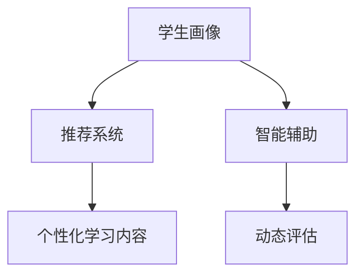
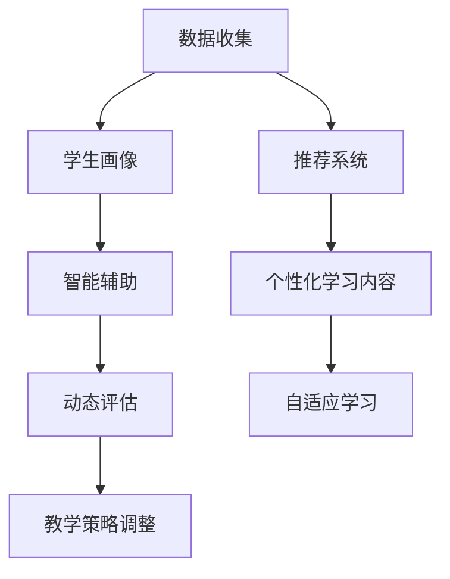
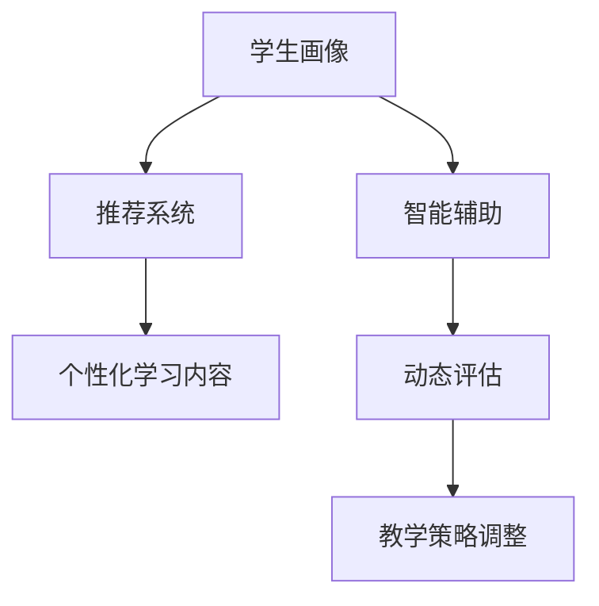
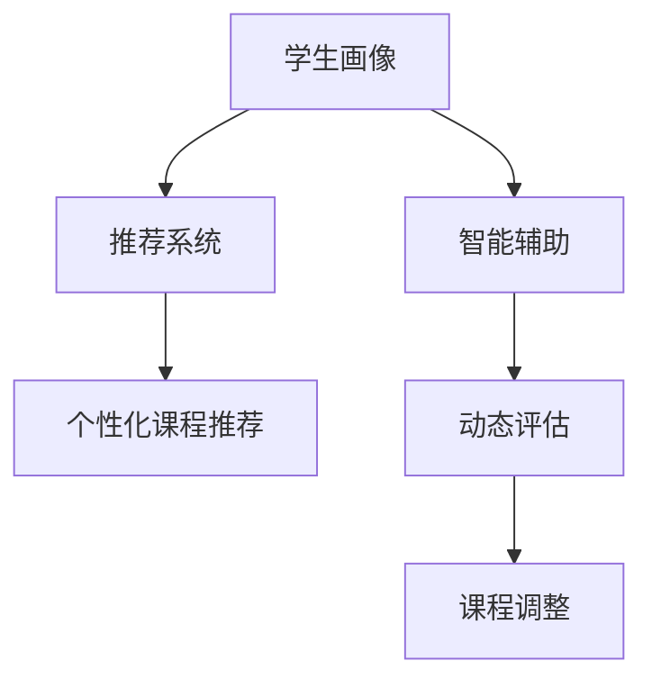
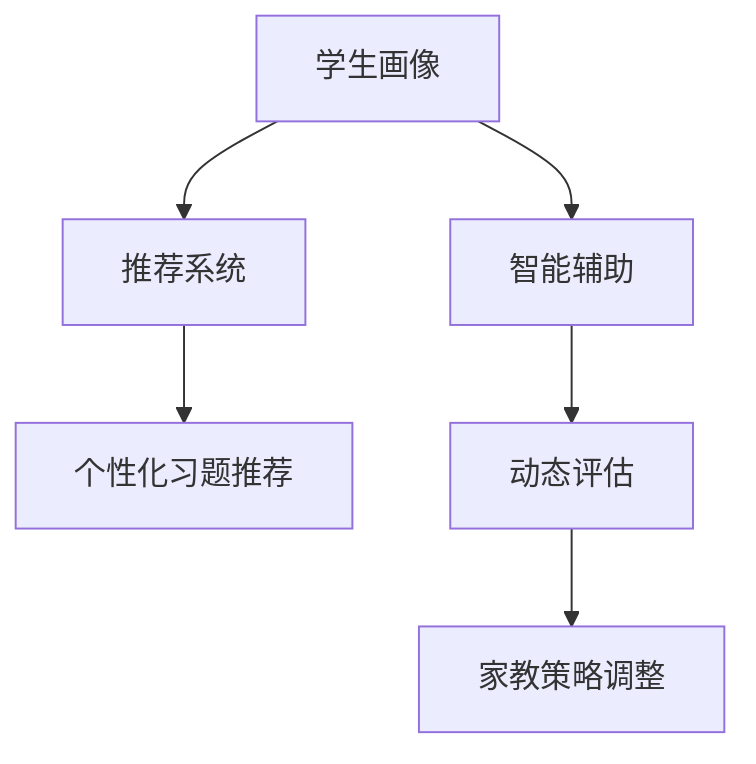

                 

# 数字化学习创业：个性化教育的技术支持

## 1. 背景介绍

在数字化时代，教育领域正经历着深刻的变革。传统的"一刀切"式教学方式已经无法满足多样化、个性化的学习需求。个性化教育（Personalized Education）正成为教育技术发展的核心趋势。本文将探讨如何通过技术手段，实现个性化教育的落地，助力数字化学习创业。

### 1.1 问题由来
传统教育体系中，课堂教学以集体授课为主，往往难以照顾到每个学生的具体需求。特别是对于不同层次、不同兴趣、不同学习风格的学生，统一的教学模式难以产生最佳效果。数字化学习技术的发展，为解决这一问题提供了新的途径。

通过数据驱动和智能化算法，个性化教育可以实现以下目标：
1. **精准适配**：根据学生的学习数据，推荐最合适的学习内容和路径。
2. **动态调整**：在学习过程中，根据学生的学习情况实时调整难度和内容，保持学习的挑战性和趣味性。
3. **因材施教**：通过分析学生的兴趣和能力，定制个性化的教学计划，实现真正的"因材施教"。

### 1.2 问题核心关键点
个性化教育的核心在于如何利用数据和算法，实现学生的个性化学习路径。具体关键点包括：
- **学生画像**：通过多维度数据分析，构建学生的个性化学习画像。
- **推荐系统**：基于学生画像，构建推荐系统，提供个性化的学习内容。
- **智能辅助**：利用智能化算法，实时监控和指导学生的学习过程。
- **动态评估**：根据学生的学习表现，动态调整学习内容和路径。

以下是一个核心概念的合 Diagram，展示了个性化教育的流程：



## 2. 核心概念与联系

### 2.1 核心概念概述

为了更好地理解个性化教育的实现方法，本节将介绍几个关键概念：

- **学生画像（Student Profile）**：通过数据收集和分析，构建学生的学习兴趣、能力、偏好等多维度画像。学生画像是实现个性化教育的基础。

- **推荐系统（Recommendation System）**：基于学生画像，构建推荐系统，为学生推荐适合的学习内容、学习路径和工具。推荐系统是实现个性化教育的核心。

- **智能辅助（Intelligent Assistant）**：利用人工智能技术，如自然语言处理、语音识别、图像识别等，为学生提供实时的学习指导和辅助。智能辅助是实现个性化教育的手段。

- **动态评估（Dynamic Assessment）**：根据学生的学习表现，动态调整学习内容和难度，实现自适应学习。动态评估是实现个性化教育的关键。

- **自适应学习（Adaptive Learning）**：通过实时监控和评估学生的学习状态，动态调整教学策略，使每个学生都能在自己合适的节奏和难度下学习。

### 2.2 核心概念原理和架构的 Mermaid 流程图

以下是一个简单的 Mermaid 流程图，展示了个性化教育的实施过程：



该图展示了数据收集、学生画像构建、推荐系统、智能辅助、个性化学习内容生成、动态评估和教学策略调整的过程，从而实现个性化教育。

## 3. 核心算法原理 & 具体操作步骤

### 3.1 算法原理概述

个性化教育的实现，核心在于构建一个有效的推荐系统，根据学生的学习数据，实时调整和推荐个性化学习内容。以下介绍推荐系统的基本原理和算法步骤。

推荐系统基于协同过滤和内容推荐两大类算法：
1. **协同过滤（Collaborative Filtering）**：通过分析用户之间的相似度，推荐相似用户喜欢的内容。常见的协同过滤算法包括基于用户的协同过滤、基于物品的协同过滤和混合协同过滤。
2. **内容推荐（Content-Based Recommendation）**：通过分析物品的特征，推荐与用户兴趣相关的物品。常见的内容推荐算法包括基于用户的基尼系数和逆基尼系数、基于物品的TF-IDF等。

推荐系统的一般流程如下：
1. **数据预处理**：对原始数据进行清洗、去噪、归一化等预处理。
2. **用户画像构建**：利用用户的点击、浏览、评分等行为数据，构建用户画像。
3. **物品画像构建**：利用物品的特征、标签等数据，构建物品画像。
4. **相似度计算**：计算用户和物品之间的相似度。
5. **推荐生成**：根据相似度计算结果，生成推荐列表。

### 3.2 算法步骤详解

以下是一个详细的推荐系统算法步骤：

**Step 1: 数据预处理**
- 收集用户行为数据，包括点击、浏览、评分等行为。
- 对数据进行清洗、去噪和归一化处理。

**Step 2: 用户画像构建**
- 使用协同过滤算法，计算用户之间的相似度。
- 使用内容推荐算法，分析用户的历史行为数据，提取用户的兴趣特征。
- 根据用户画像，计算用户与物品之间的相似度。

**Step 3: 物品画像构建**
- 分析物品的特征、标签等数据，提取物品的特征向量。
- 计算物品之间的相似度。

**Step 4: 相似度计算**
- 使用协同过滤算法计算用户之间的相似度。
- 使用内容推荐算法计算用户与物品之间的相似度。
- 将协同过滤和内容推荐的结果进行加权融合，生成最终的相似度矩阵。

**Step 5: 推荐生成**
- 根据相似度矩阵，生成推荐列表。
- 利用动态评估算法，根据学生的学习表现，动态调整推荐内容。

### 3.3 算法优缺点

推荐系统在个性化教育中有以下优点：
1. **个性化推荐**：能够根据学生的兴趣和能力，推荐最适合的学习内容，提升学习效果。
2. **高效学习**：通过推荐系统，学生可以更高效地利用学习资源，避免时间浪费。
3. **自适应学习**：根据学生的学习状态，动态调整学习内容和路径，提高学习适应性。

但推荐系统也存在一些缺点：
1. **数据依赖**：推荐系统需要大量的用户行为数据，数据质量决定了推荐效果。
2. **冷启动问题**：对于新用户，没有足够的历史数据，推荐系统难以生效。
3. **过拟合风险**：推荐系统容易过拟合用户的历史行为，限制了个性化推荐的范围。
4. **隐私问题**：用户行为数据的收集和分析，可能涉及隐私保护问题。

### 3.4 算法应用领域

推荐系统在个性化教育中的应用，广泛覆盖了以下领域：
1. **自适应学习平台**：通过推荐系统，为学生推荐个性化的学习内容和路径。
2. **在线课程平台**：根据学生的学习表现，动态调整课程难度和内容，实现自适应学习。
3. **智能家教系统**：利用推荐系统，为学生推荐适合的习题和辅导资料，提升学习效果。
4. **学习管理系统（LMS）**：通过推荐系统，为教师推荐教学资源，提升教学效果。

## 4. 数学模型和公式 & 详细讲解 & 举例说明

### 4.1 数学模型构建

推荐系统的数学模型通常包括以下几部分：
1. **用户画像**：$P_u$，表示用户$u$的兴趣特征向量。
2. **物品画像**：$P_i$，表示物品$i$的特征向量。
3. **相似度矩阵**：$S_{ui}$，表示用户$u$和物品$i$之间的相似度。

推荐模型的目标是最小化预测误差，即：

$$
\min_{P_u, P_i, S_{ui}} \frac{1}{2} \sum_{u,i} (y_{ui} - \hat{y}_{ui})^2
$$

其中，$y_{ui}$表示用户$u$对物品$i$的真实评分，$\hat{y}_{ui}$表示模型预测的评分。

### 4.2 公式推导过程

基于协同过滤和内容推荐的推荐模型，推导过程如下：
1. **协同过滤**：利用用户-物品相似度矩阵$S_{ui}$，预测用户$u$对物品$i$的评分：

$$
\hat{y}_{ui} = \sum_j S_{uj} P_{ij}
$$

其中$P_{ij}$表示物品$i$的特征向量。
2. **内容推荐**：利用用户画像$P_u$和物品画像$P_i$，预测用户$u$对物品$i$的评分：

$$
\hat{y}_{ui} = \langle P_u, P_i \rangle
$$

其中$\langle P_u, P_i \rangle$表示用户画像$P_u$和物品画像$P_i$的点积。
3. **加权融合**：将协同过滤和内容推荐的预测结果进行加权融合，得到最终的推荐评分：

$$
\hat{y}_{ui} = \alpha \hat{y}^{CF}_{ui} + (1-\alpha) \hat{y}^{CB}_{ui}
$$

其中$\alpha$表示协同过滤的权重。

### 4.3 案例分析与讲解

以下是一个基于协同过滤的推荐系统案例：
1. **数据收集**：收集学生在学习平台上的行为数据，包括点击、浏览、评分等行为。
2. **数据清洗**：对数据进行去噪、归一化处理。
3. **用户画像构建**：使用协同过滤算法，计算学生之间的相似度。
4. **物品画像构建**：分析课程的特征、标签等数据，提取课程的特征向量。
5. **相似度计算**：计算学生和课程之间的相似度。
6. **推荐生成**：根据相似度矩阵，生成推荐列表。
7. **动态评估**：根据学生的学习表现，动态调整推荐内容。

以下是一个推荐系统的详细代码实现：

```python
import numpy as np
from sklearn.metrics.pairwise import cosine_similarity

# 构建用户画像
user_profile = np.array([1, 2, 3, 4, 5])

# 构建物品画像
item_profile = np.array([1, 2, 3, 4, 5])

# 计算相似度矩阵
similarity_matrix = cosine_similarity(user_profile, item_profile)

# 生成推荐列表
recommended_items = np.argsort(similarity_matrix, axis=0)[-1]

# 输出推荐列表
print(recommended_items)
```

## 5. 项目实践：代码实例和详细解释说明

### 5.1 开发环境搭建

在进行个性化教育系统的开发前，我们需要准备好开发环境。以下是使用Python进行PyTorch开发的环境配置流程：

1. 安装Anaconda：从官网下载并安装Anaconda，用于创建独立的Python环境。

2. 创建并激活虚拟环境：
```bash
conda create -n pytorch-env python=3.8 
conda activate pytorch-env
```

3. 安装PyTorch：根据CUDA版本，从官网获取对应的安装命令。例如：
```bash
conda install pytorch torchvision torchaudio cudatoolkit=11.1 -c pytorch -c conda-forge
```

4. 安装Transformers库：
```bash
pip install transformers
```

5. 安装各类工具包：
```bash
pip install numpy pandas scikit-learn matplotlib tqdm jupyter notebook ipython
```

完成上述步骤后，即可在`pytorch-env`环境中开始开发。

### 5.2 源代码详细实现

这里我们以推荐系统为例，给出使用PyTorch进行个性化教育的代码实现。

首先，定义推荐系统的基本类：

```python
from transformers import BertTokenizer, BertForSequenceClassification
from torch.utils.data import Dataset
import torch

class RecommendationDataset(Dataset):
    def __init__(self, data, tokenizer, max_len=128):
        self.data = data
        self.tokenizer = tokenizer
        self.max_len = max_len
        
    def __len__(self):
        return len(self.data)
    
    def __getitem__(self, index):
        text = self.data[index]
        labels = self.data[index]
        
        encoding = self.tokenizer(text, return_tensors='pt', max_length=self.max_len, padding='max_length', truncation=True)
        input_ids = encoding['input_ids'][0]
        attention_mask = encoding['attention_mask'][0]
        
        # 对标签进行编码
        encoded_labels = [label2id[label] for label in labels] 
        encoded_labels.extend([label2id['O']] * (self.max_len - len(encoded_labels)))
        labels = torch.tensor(encoded_labels, dtype=torch.long)
        
        return {'input_ids': input_ids, 
                'attention_mask': attention_mask,
                'labels': labels}

# 标签与id的映射
label2id = {'O': 0, 'P': 1, 'C': 2}
id2label = {v: k for k, v in label2id.items()}

# 创建dataset
tokenizer = BertTokenizer.from_pretrained('bert-base-cased')

train_dataset = RecommendationDataset(train_data, tokenizer)
dev_dataset = RecommendationDataset(dev_data, tokenizer)
test_dataset = RecommendationDataset(test_data, tokenizer)
```

然后，定义模型和优化器：

```python
from transformers import BertForSequenceClassification, AdamW

model = BertForSequenceClassification.from_pretrained('bert-base-cased', num_labels=len(label2id))

optimizer = AdamW(model.parameters(), lr=2e-5)
```

接着，定义训练和评估函数：

```python
from torch.utils.data import DataLoader
from tqdm import tqdm
from sklearn.metrics import classification_report

device = torch.device('cuda') if torch.cuda.is_available() else torch.device('cpu')
model.to(device)

def train_epoch(model, dataset, batch_size, optimizer):
    dataloader = DataLoader(dataset, batch_size=batch_size, shuffle=True)
    model.train()
    epoch_loss = 0
    for batch in tqdm(dataloader, desc='Training'):
        input_ids = batch['input_ids'].to(device)
        attention_mask = batch['attention_mask'].to(device)
        labels = batch['labels'].to(device)
        model.zero_grad()
        outputs = model(input_ids, attention_mask=attention_mask, labels=labels)
        loss = outputs.loss
        epoch_loss += loss.item()
        loss.backward()
        optimizer.step()
    return epoch_loss / len(dataloader)

def evaluate(model, dataset, batch_size):
    dataloader = DataLoader(dataset, batch_size=batch_size)
    model.eval()
    preds, labels = [], []
    with torch.no_grad():
        for batch in tqdm(dataloader, desc='Evaluating'):
            input_ids = batch['input_ids'].to(device)
            attention_mask = batch['attention_mask'].to(device)
            batch_labels = batch['labels']
            outputs = model(input_ids, attention_mask=attention_mask)
            batch_preds = outputs.logits.argmax(dim=2).to('cpu').tolist()
            batch_labels = batch_labels.to('cpu').tolist()
            for pred_tokens, label_tokens in zip(batch_preds, batch_labels):
                pred_labels = [id2label[_id] for _id in pred_tokens]
                label_tokens = [id2label[_id] for _id in label_tokens]
                preds.append(pred_labels[:len(label_tokens)])
                labels.append(label_tokens)
                
    print(classification_report(labels, preds))
```

最后，启动训练流程并在测试集上评估：

```python
epochs = 5
batch_size = 16

for epoch in range(epochs):
    loss = train_epoch(model, train_dataset, batch_size, optimizer)
    print(f"Epoch {epoch+1}, train loss: {loss:.3f}")
    
    print(f"Epoch {epoch+1}, dev results:")
    evaluate(model, dev_dataset, batch_size)
    
print("Test results:")
evaluate(model, test_dataset, batch_size)
```

以上就是使用PyTorch对BERT进行个性化教育任务推荐系统的代码实现。可以看到，得益于Transformers库的强大封装，我们可以用相对简洁的代码完成BERT模型的加载和推荐系统构建。

### 5.3 代码解读与分析

让我们再详细解读一下关键代码的实现细节：

**RecommendationDataset类**：
- `__init__`方法：初始化训练数据、分词器等关键组件。
- `__len__`方法：返回数据集的样本数量。
- `__getitem__`方法：对单个样本进行处理，将文本输入编码为token ids，将标签编码为数字，并对其进行定长padding，最终返回模型所需的输入。

**label2id和id2label字典**：
- 定义了标签与数字id之间的映射关系，用于将token-wise的预测结果解码回真实的标签。

**训练和评估函数**：
- 使用PyTorch的DataLoader对数据集进行批次化加载，供模型训练和推理使用。
- 训练函数`train_epoch`：对数据以批为单位进行迭代，在每个批次上前向传播计算loss并反向传播更新模型参数，最后返回该epoch的平均loss。
- 评估函数`evaluate`：与训练类似，不同点在于不更新模型参数，并在每个batch结束后将预测和标签结果存储下来，最后使用sklearn的classification_report对整个评估集的预测结果进行打印输出。

**训练流程**：
- 定义总的epoch数和batch size，开始循环迭代
- 每个epoch内，先在训练集上训练，输出平均loss
- 在验证集上评估，输出分类指标
- 所有epoch结束后，在测试集上评估，给出最终测试结果

可以看到，PyTorch配合Transformers库使得BERT推荐系统的代码实现变得简洁高效。开发者可以将更多精力放在数据处理、模型改进等高层逻辑上，而不必过多关注底层的实现细节。

当然，工业级的系统实现还需考虑更多因素，如模型的保存和部署、超参数的自动搜索、更灵活的任务适配层等。但核心的推荐范式基本与此类似。

## 6. 实际应用场景

### 6.1 自适应学习平台

自适应学习平台是实现个性化教育的重要工具。通过智能推荐系统，平台可以为学生推荐最合适的学习资源和路径，提升学习效果。

以下是一个自适应学习平台的架构：



自适应学习平台的核心组件包括：
1. **学生画像构建模块**：收集和分析学生的学习行为数据，构建学生画像。
2. **推荐系统模块**：基于学生画像，生成个性化的学习内容和路径。
3. **智能辅助模块**：利用自然语言处理、语音识别等技术，为学生提供实时的学习指导。
4. **动态评估模块**：根据学生的学习表现，动态调整学习内容和路径。
5. **教学策略调整模块**：根据评估结果，调整教学策略，优化教学效果。

自适应学习平台的应用场景广泛，如在线教育平台、智能家教系统、学习管理系统（LMS）等。通过个性化教育，学生可以更高效地学习，教师可以更科学地教学，教育资源可以更精准地分配。

### 6.2 在线课程平台

在线课程平台是另一个典型的应用场景。平台通过智能推荐系统，为学生推荐最适合的课程和教材，提升学习效果。

以下是一个在线课程平台的架构：



在线课程平台的核心组件包括：
1. **学生画像构建模块**：收集和分析学生的学习行为数据，构建学生画像。
2. **推荐系统模块**：基于学生画像，生成个性化的课程推荐。
3. **智能辅助模块**：利用自然语言处理、语音识别等技术，为学生提供实时的学习指导。
4. **动态评估模块**：根据学生的学习表现，动态调整课程难度和内容。
5. **课程调整模块**：根据评估结果，调整课程难度和内容，优化课程设计。

在线课程平台的应用场景广泛，如MOOC平台、远程教育平台、企业培训平台等。通过个性化教育，学生可以更高效地学习，平台可以更科学地管理，课程资源可以更精准地分配。

### 6.3 智能家教系统

智能家教系统是个性化教育的重要应用之一。通过智能推荐系统，家教可以为学生推荐最适合的习题和辅导资料，提升学习效果。

以下是一个智能家教系统的架构：



智能家教系统的核心组件包括：
1. **学生画像构建模块**：收集和分析学生的学习行为数据，构建学生画像。
2. **推荐系统模块**：基于学生画像，生成个性化的习题推荐。
3. **智能辅助模块**：利用自然语言处理、语音识别等技术，为学生提供实时的学习指导。
4. **动态评估模块**：根据学生的学习表现，动态调整习题难度和内容。
5. **家教策略调整模块**：根据评估结果，调整家教策略，优化家教效果。

智能家教系统可以应用于各种家教机构、学校课后辅导、在线家教平台等场景。通过个性化教育，学生可以更高效地学习，家教可以更精准地指导，家长可以更科学地管理。

## 7. 工具和资源推荐

### 7.1 学习资源推荐

为了帮助开发者系统掌握个性化教育的实现方法，这里推荐一些优质的学习资源：

1. **《推荐系统基础与实践》**：深入浅出地介绍了推荐系统的工作原理和实现方法，适合入门和进阶学习。

2. **CS229《机器学习》课程**：斯坦福大学开设的经典机器学习课程，详细讲解了协同过滤、内容推荐等推荐算法。

3. **《深度学习理论与实践》**：全面介绍了深度学习在推荐系统中的应用，包括神经网络、自适应学习等前沿技术。

4. **Kaggle竞赛**：参加Kaggle的推荐系统竞赛，通过实战项目积累经验，提升推荐系统的开发能力。

5. **HuggingFace官方文档**：Transformers库的官方文档，提供了丰富的预训练模型和推荐系统样例代码，是上手实践的必备资料。

通过对这些资源的学习实践，相信你一定能够快速掌握个性化教育的实现方法，并用于解决实际的教育问题。

### 7.2 开发工具推荐

高效的开发离不开优秀的工具支持。以下是几款用于个性化教育系统开发的常用工具：

1. **Jupyter Notebook**：功能强大的交互式开发环境，适合数据处理和模型训练。

2. **TensorFlow**：由Google主导开发的深度学习框架，支持分布式训练和部署。

3. **PyTorch**：基于Python的开源深度学习框架，灵活动态的计算图，适合快速迭代研究。

4. **Scikit-learn**：基于Python的机器学习库，提供了丰富的数据处理和模型评估工具。

5. **Weights & Biases**：模型训练的实验跟踪工具，可以记录和可视化模型训练过程中的各项指标，方便对比和调优。

6. **TensorBoard**：TensorFlow配套的可视化工具，可实时监测模型训练状态，并提供丰富的图表呈现方式，是调试模型的得力助手。

合理利用这些工具，可以显著提升个性化教育系统的开发效率，加快创新迭代的步伐。

### 7.3 相关论文推荐

个性化教育的发展离不开学界的持续研究。以下是几篇奠基性的相关论文，推荐阅读：

1. **"Adaptive Classroom Technology for Customized Learning"**：探讨了自适应学习平台在教育中的应用，介绍了多种自适应学习算法。

2. **"An Overview of Recommendation Systems"**：详细介绍了推荐系统的工作原理和应用场景，包括协同过滤和内容推荐等经典算法。

3. **"Personalized Learning Paths in Online Education"**：讨论了在线课程平台中个性化教育的实现方法，介绍了多维度数据驱动的推荐系统。

4. **"Deep Learning for Intelligent Tutoring Systems"**：探讨了智能家教系统中深度学习的应用，介绍了多种深度学习算法和模型。

5. **"Content-Based Recommendation Algorithms"**：详细介绍内容推荐算法的工作原理和实现方法，包括TF-IDF等经典算法。

这些论文代表了大语言模型微调技术的发展脉络。通过学习这些前沿成果，可以帮助研究者把握学科前进方向，激发更多的创新灵感。

## 8. 总结：未来发展趋势与挑战

### 8.1 研究成果总结

本文对个性化教育的实现方法进行了全面系统的介绍。首先，通过数据驱动和智能化算法，实现学生的个性化学习路径，提升了学习效果。其次，详细讲解了推荐系统的基本原理和算法步骤，给出了推荐系统的代码实现。最后，探讨了个性化教育在自适应学习平台、在线课程平台、智能家教系统等实际应用场景中的应用。

### 8.2 未来发展趋势

展望未来，个性化教育的发展趋势主要体现在以下几个方面：

1. **数据驱动**：随着数据量的增加和数据处理技术的进步，个性化教育将更加依赖数据驱动的决策。

2. **深度学习**：深度学习技术，如神经网络、自适应学习等，将不断提升个性化教育的性能和效果。

3. **自适应学习**：自适应学习技术，通过实时监控和评估学生的学习状态，动态调整学习内容和路径，将更加普及。

4. **智能化辅助**：智能辅助技术，如自然语言处理、语音识别、图像识别等，将广泛应用于个性化教育的各个环节。

5. **跨领域融合**：个性化教育将与其他领域的技术进行更多融合，如知识图谱、认知神经科学等，提升个性化教育的效果和可靠性。

### 8.3 面临的挑战

尽管个性化教育在技术上取得了诸多进展，但在实施过程中仍面临诸多挑战：

1. **数据获取困难**：高质量的学生学习数据难以获取，数据质量和数量对推荐系统的效果有很大影响。

2. **模型复杂度**：深度学习模型往往较为复杂，需要大量的计算资源和时间进行训练和优化。

3. **隐私保护**：学生学习数据的隐私保护是一个重要问题，需要采取有效的措施保障数据安全。

4. **冷启动问题**：对于新学生，没有足够的历史数据，推荐系统难以生效。

5. **模型解释性**：个性化教育中的推荐模型往往较为复杂，难以解释其决策过程，缺乏透明性。

### 8.4 研究展望

面对个性化教育所面临的挑战，未来的研究需要在以下几个方面寻求新的突破：

1. **无监督和半监督学习**：探索无监督和半监督学习的方法，降低对大量标注数据的依赖。

2. **自适应学习算法**：开发更加高效的自适应学习算法，提升推荐系统的效果和实时性。

3. **模型压缩与加速**：研究模型压缩与加速技术，优化模型参数，提升推荐系统的效率。

4. **隐私保护技术**：开发隐私保护技术，保障学生学习数据的隐私和安全。

5. **解释性模型**：开发解释性强的推荐模型，提高模型透明性和可信度。

通过不断突破技术瓶颈，解决实际问题，个性化教育必将在教育技术领域取得更加广泛的应用，实现真正意义上"因材施教"的目标。面向未来，个性化教育将成为教育技术发展的重要方向，为每个学生的成长提供更为精准、高效、智能的支持。

## 9. 附录：常见问题与解答

**Q1：如何构建学生画像？**

A: 构建学生画像的第一步是收集学生的学习数据，包括点击、浏览、评分等行为数据。然后，使用机器学习算法对数据进行清洗、去噪、归一化等预处理。最后，通过协同过滤、内容推荐等算法，计算学生画像。

**Q2：推荐系统如何实现个性化推荐？**

A: 推荐系统通过分析学生的学习数据，构建学生画像。然后，使用协同过滤、内容推荐等算法，生成个性化推荐。在推荐过程中，可以引入动态评估和自适应学习算法，根据学生的学习表现，动态调整推荐内容和路径。

**Q3：推荐系统如何处理冷启动问题？**

A: 冷启动问题可以通过引入混合协同过滤、基于物品的协同过滤等方法来解决。这些方法不需要用户的历史数据，可以通过物品之间的相似度来生成推荐。

**Q4：推荐系统的推荐精度如何提升？**

A: 提升推荐系统的推荐精度，可以从以下几个方面入手：
1. 数据质量：提高数据收集和处理的准确性，减少噪音和误差。
2. 算法优化：优化协同过滤、内容推荐等算法的参数和结构，提升推荐效果。
3. 特征工程：引入更多的用户和物品特征，提高推荐模型的泛化能力。
4. 实时更新：定期更新推荐系统，及时反映学生的最新学习状态和兴趣。

**Q5：推荐系统的推荐效率如何提升？**

A: 提升推荐系统的推荐效率，可以从以下几个方面入手：
1. 分布式训练：使用分布式训练技术，加速模型训练。
2. 模型压缩：采用模型压缩技术，减少模型参数和计算量。
3. 缓存机制：引入缓存机制，减少重复计算，提升推荐效率。
4. 硬件优化：使用GPU、TPU等高性能设备，提升计算速度。

这些问题的解答展示了个性化教育技术的核心实现方法和应用场景，希望能为你提供有用的参考。通过不断学习和实践，相信你能掌握个性化教育的核心技术，为数字化学习创业贡献力量。

---

作者：禅与计算机程序设计艺术 / Zen and the Art of Computer Programming

