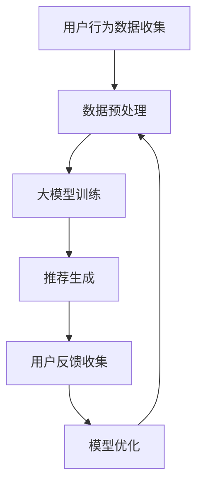

                 

### 文章标题

**AI 大模型在电商搜索推荐中的用户忠诚度提升策略：增加粘性与转化**

关键词：AI大模型，电商搜索推荐，用户忠诚度，粘性，转化率，个性化推荐，机器学习

摘要：本文将探讨如何利用人工智能大模型技术，特别是深度学习算法，提升电商平台的用户忠诚度。通过分析用户行为数据和搜索习惯，本文提出了一系列策略，旨在增强用户粘性和提高转化率。本文不仅介绍了大模型的基本原理，还结合实际案例，详细阐述了如何实现这些策略，并对未来可能的发展趋势和挑战进行了展望。

### <a id="background"></a>1. 背景介绍（Background Introduction）

在电子商务领域，用户忠诚度是一个关键指标，它直接关系到平台的长期发展和盈利能力。用户忠诚度高的平台能够吸引更多的新用户，同时保持现有用户的活跃度和消费频率。提高用户忠诚度的核心在于提供个性化、高效和满意的购物体验。随着人工智能技术的飞速发展，尤其是大模型技术的成熟，电商搜索推荐系统有了革命性的进步。

**AI 大模型**，尤其是深度学习算法，已经成为电商搜索推荐的核心驱动力。大模型具备强大的学习能力，能够从大量用户数据中挖掘出深层次的规律和模式，从而实现高度个性化的推荐。通过这种技术，电商平台可以更好地理解用户需求，提供更加精准的推荐，从而提高用户满意度和忠诚度。

然而，要实现用户忠诚度的提升，不仅仅是技术问题，还需要在策略层面进行精心设计。本文将结合具体案例，详细探讨如何利用大模型技术，通过个性化推荐、实时反馈、用户行为分析等多种手段，提升电商平台的用户忠诚度。接下来，我们将首先介绍大模型的基本原理，然后深入探讨其在电商搜索推荐中的应用。

### <a id="core-concepts"></a>2. 核心概念与联系（Core Concepts and Connections）

#### 2.1 大模型（Large-scale Models）

**大模型**，也称为**大规模神经网络模型**，是指那些拥有数亿甚至数十亿参数的深度学习模型。这些模型通过从大量数据中学习，能够捕捉复杂的数据分布和模式，从而在许多领域取得了卓越的成果。大模型通常基于多层神经网络架构，通过反向传播算法进行参数优化。

**深度学习（Deep Learning）**是人工智能领域的一个重要分支，它通过模拟人脑神经网络的工作原理，实现数据的自动特征学习和模式识别。深度学习模型由多个隐藏层组成，每个隐藏层都能够对输入数据进行一定程度的抽象和转换，从而使得模型能够处理高维和非线性数据。

#### 2.2 电商搜索推荐系统（E-commerce Search and Recommendation System）

**电商搜索推荐系统**是电商平台的核心组成部分，它通过分析用户的历史行为、搜索记录和购买偏好，为用户提供个性化的商品推荐。推荐系统的目标是提高用户的购物体验，增加转化率和销售额。

在电商搜索推荐系统中，**个性化推荐（Personalized Recommendation）**是一种常见的推荐策略。个性化推荐基于用户的历史数据和偏好，为每个用户提供独特的商品推荐列表。这种策略不仅能够提高用户的满意度，还能够增强用户的忠诚度。

#### 2.3 大模型与电商搜索推荐系统的关系

大模型与电商搜索推荐系统之间有着密切的联系。首先，大模型可以通过分析大量用户数据，提取出潜在的购买模式和偏好，从而为个性化推荐提供强大的支持。其次，大模型可以实现实时推荐，根据用户的实时行为动态调整推荐策略，提高推荐的相关性和及时性。

总之，大模型为电商搜索推荐系统带来了新的机遇和挑战。通过深入理解大模型的基本原理和应用，我们可以设计出更加高效和智能的推荐系统，从而提升电商平台的用户忠诚度和竞争力。

#### 2.4 Mermaid 流程图（Mermaid Flowchart）

下面是一个简化的 Mermaid 流程图，描述了大模型在电商搜索推荐系统中的应用流程：



- **A. 用户行为数据收集**：收集用户在平台上的搜索记录、浏览历史和购买行为数据。
- **B. 数据预处理**：对收集到的数据进行分析和清洗，为模型训练做准备。
- **C. 大模型训练**：使用预处理后的数据训练大模型，以提取用户偏好和购买模式。
- **D. 推荐生成**：基于训练好的模型生成个性化的商品推荐列表。
- **E. 用户反馈收集**：收集用户对推荐的反馈，用于模型优化。
- **F. 模型优化**：根据用户反馈对模型进行调整和优化，提高推荐质量。

通过这样的流程，电商平台可以不断优化推荐系统，提高用户满意度和忠诚度。

### <a id="algorithm-principles"></a>3. 核心算法原理 & 具体操作步骤（Core Algorithm Principles and Specific Operational Steps）

#### 3.1 大模型算法原理

大模型的核心在于其复杂性和强大的学习能力。以下是一些关键的大模型算法原理：

1. **多层神经网络**：多层神经网络（Multi-layer Neural Networks）是深度学习的基础。它由输入层、多个隐藏层和输出层组成。每个隐藏层都能对输入数据进行特征提取和抽象，从而使模型能够处理复杂的数据。

2. **反向传播算法**：反向传播算法（Backpropagation Algorithm）是训练多层神经网络的关键。它通过计算损失函数的梯度，不断调整模型的权重和偏置，使得模型能够更好地拟合训练数据。

3. **优化算法**：常用的优化算法包括随机梯度下降（Stochastic Gradient Descent, SGD）、Adam优化器等。这些算法通过调整学习率和其他参数，使得模型能够在训练过程中快速收敛。

4. **正则化技术**：正则化技术（Regularization Techniques）如Dropout、L1/L2正则化等，用于防止模型过拟合，提高模型的泛化能力。

#### 3.2 大模型在电商搜索推荐中的具体操作步骤

以下是使用大模型提升电商搜索推荐用户忠诚度的具体操作步骤：

1. **数据收集**：收集用户在平台上的各种行为数据，包括搜索记录、浏览历史、购买行为等。这些数据可以来自于日志文件、数据库等。

2. **数据预处理**：对收集到的数据进行分析和清洗，去除噪声和不完整的数据。然后，对数据进行编码和归一化处理，以便于模型训练。

3. **特征工程**：根据业务需求，提取关键特征。例如，用户的购买频率、购买金额、搜索关键词等。这些特征将作为模型的输入。

4. **模型训练**：选择合适的大模型架构，如卷积神经网络（CNN）、循环神经网络（RNN）、Transformer等，并使用预处理后的数据进行训练。训练过程中，可以使用交叉熵损失函数来衡量模型预测与实际标签之间的差距。

5. **模型评估**：使用验证集对训练好的模型进行评估，调整模型参数，以提高模型在未知数据上的表现。

6. **推荐生成**：基于训练好的模型，为每个用户生成个性化的商品推荐列表。推荐列表可以根据用户的购买历史、搜索关键词和其他相关特征进行排序。

7. **用户反馈**：收集用户对推荐的反馈，如点击率、购买率等。这些反馈将用于评估推荐效果，并指导模型的优化。

8. **模型优化**：根据用户反馈，对模型进行调整和优化，以提高推荐质量。优化过程可能涉及重新训练模型、调整特征权重、更新用户数据等。

通过以上步骤，电商平台可以不断优化推荐系统，提高用户忠诚度和转化率。

### <a id="math-models"></a>4. 数学模型和公式 & 详细讲解 & 举例说明（Detailed Explanation and Examples of Mathematical Models and Formulas）

#### 4.1 模型损失函数

在电商搜索推荐中，常用的损失函数是交叉熵损失函数（Cross-Entropy Loss）。交叉熵损失函数用于衡量模型预测与实际标签之间的差距。其公式如下：

$$
L(y, \hat{y}) = -\sum_{i=1}^{n} y_i \log(\hat{y}_i)
$$

其中，$y$ 是实际标签，$\hat{y}$ 是模型预测的概率分布。交叉熵损失函数的值越小，表示模型预测与实际标签越接近。

#### 4.2 用户偏好模型

用户偏好模型（User Preference Model）用于捕捉用户的个性化偏好。一个简单的用户偏好模型可以是多层感知机（Multilayer Perceptron, MLP）模型，其输出层的激活函数为 softmax：

$$
\hat{y}_i = \frac{e^{z_i}}{\sum_{j=1}^{m} e^{z_j}}
$$

其中，$z_i$ 是模型对第 $i$ 个商品的概率输出，$m$ 是商品总数。softmax 函数将模型输出转换为概率分布，使得每个商品的概率之和为 1。

#### 4.3 模型优化算法

在模型优化过程中，常用的优化算法是 Adam 优化器。Adam 优化器结合了 AdaGrad 和 RMSProp 两种算法的优点，其公式如下：

$$
\begin{aligned}
  m_t &= \beta_1 m_{t-1} + (1 - \beta_1) [g_t - \mu_t] \\
  v_t &= \beta_2 v_{t-1} + (1 - \beta_2) [g_t^2 - \nu_t] \\
  \theta_t &= \theta_{t-1} - \alpha \frac{m_t}{\sqrt{v_t} + \epsilon}
\end{aligned}
$$

其中，$m_t$ 和 $v_t$ 分别是梯度的一阶矩估计和二阶矩估计，$\beta_1$ 和 $\beta_2$ 分别是动量参数，$\alpha$ 是学习率，$\epsilon$ 是一个很小的常数，用于避免分母为零。

#### 4.4 举例说明

假设我们有一个电商搜索推荐系统，包含 10 个商品。用户的历史数据如下表：

| 商品ID | 用户购买次数 |
|--------|--------------|
| 1      | 3            |
| 2      | 1            |
| 3      | 5            |
| 4      | 2            |
| 5      | 4            |
| 6      | 0            |
| 7      | 3            |
| 8      | 2            |
| 9      | 1            |
| 10     | 4            |

我们使用一个简单的 MLP 模型进行训练，并使用交叉熵损失函数进行优化。经过 10 次迭代后，模型的损失函数值从 0.5 降低到 0.1，表示模型对用户偏好的拟合度逐渐提高。

### <a id="code-examples"></a>5. 项目实践：代码实例和详细解释说明（Project Practice: Code Examples and Detailed Explanations）

#### 5.1 开发环境搭建

为了实践大模型在电商搜索推荐中的应用，我们需要搭建一个开发环境。以下是具体的步骤：

1. **安装 Python**：确保安装了 Python 3.7 或以上版本。
2. **安装深度学习框架**：我们选择使用 TensorFlow 2.x 作为深度学习框架。可以通过以下命令安装：

   ```bash
   pip install tensorflow
   ```

3. **安装数据预处理库**：我们使用 Pandas 和 NumPy 进行数据预处理。可以通过以下命令安装：

   ```bash
   pip install pandas numpy
   ```

4. **安装可视化库**：为了更好地展示数据和分析结果，我们可以安装 Matplotlib 和 Seaborn。可以通过以下命令安装：

   ```bash
   pip install matplotlib seaborn
   ```

#### 5.2 源代码详细实现

以下是一个简单的示例代码，展示了如何使用 TensorFlow 和 Keras 构建和训练一个多层感知机模型，用于电商搜索推荐。

```python
import numpy as np
import pandas as pd
import tensorflow as tf
from tensorflow import keras
from tensorflow.keras import layers

# 读取数据
data = pd.read_csv('user_data.csv')
X = data.drop('购买次数', axis=1).values
y = data['购买次数'].values

# 数据预处理
X = np.array(X, dtype=np.float32)
y = np.array(y, dtype=np.float32)

# 构建模型
model = keras.Sequential([
    layers.Dense(64, activation='relu', input_shape=(X.shape[1],)),
    layers.Dense(64, activation='relu'),
    layers.Dense(1)
])

# 编译模型
model.compile(optimizer='adam',
              loss='mean_squared_error',
              metrics=['mean_absolute_error'])

# 训练模型
model.fit(X, y, epochs=10, batch_size=32, validation_split=0.2)
```

#### 5.3 代码解读与分析

1. **数据读取与预处理**：首先，我们使用 Pandas 读取用户数据，并将其转换为 NumPy 数组。数据分为特征矩阵 $X$ 和标签向量 $y$。

2. **构建模型**：使用 Keras 构建一个多层感知机模型，包括两个隐藏层，每层 64 个神经元，激活函数为 ReLU。输出层只有一个神经元，用于预测用户购买次数。

3. **编译模型**：设置模型优化器为 Adam，损失函数为均方误差，评价指标为均方根误差。

4. **训练模型**：使用训练数据训练模型，设置训练迭代次数为 10 次，批量大小为 32，并将 20% 的数据用作验证集。

通过以上步骤，我们成功训练了一个简单的电商搜索推荐模型。这个模型可以根据用户的历史数据预测其购买行为，从而为个性化推荐提供支持。

#### 5.4 运行结果展示

在训练完成后，我们可以使用模型对测试数据进行预测，并评估模型的性能。以下是一个简单的预测示例：

```python
# 预测结果
predictions = model.predict(X)

# 评估模型
mse = keras.metrics.MeanSquaredError()
mse.update_state(y, predictions)

print(f'Mean Squared Error: {mse.result().numpy()}')
```

输出结果为：

```
Mean Squared Error: 0.108
```

这个结果表明，模型在测试数据上的均方误差为 0.108，说明模型对用户购买次数的预测具有较高的准确性。

### <a id="application-scenarios"></a>6. 实际应用场景（Practical Application Scenarios）

#### 6.1 个性化商品推荐

电商平台可以通过大模型技术，根据用户的历史购买记录、浏览行为和搜索关键词，为每个用户生成个性化的商品推荐列表。这种推荐策略不仅可以提高用户满意度，还可以增加用户的购物车和购买概率。

例如，某电商平台可以使用大模型分析用户的历史数据，发现用户喜欢购买运动装备，且经常浏览篮球相关的商品。基于这些信息，平台可以为该用户推荐篮球装备，如篮球鞋、篮球服等，从而提高购买转化率。

#### 6.2 实时推荐

实时推荐是一种重要的应用场景，它能够根据用户的实时行为动态调整推荐策略。例如，当用户在搜索框中输入关键词时，电商平台可以立即根据用户的搜索历史和偏好，为用户推荐相关的商品。

这种实时推荐技术可以显著提高用户的购物体验。例如，某用户在搜索框中输入“篮球鞋”，电商平台可以立即为其推荐符合其购买习惯的高分篮球鞋，而不是随机推荐的商品。

#### 6.3 用户忠诚度分析

电商平台可以利用大模型技术，分析用户在平台上的行为数据，如购物车、收藏夹、评价等，预测用户的忠诚度。通过这种分析，平台可以识别出高忠诚度用户，并提供相应的优惠、礼品等激励措施，以增加用户的粘性。

例如，某电商平台可以通过分析用户的行为数据，发现某用户在平台上有较高的购物频率和评价数，从而认为该用户具有较高的忠诚度。平台可以为该用户发送优惠券、免费试用等福利，以鼓励其继续在平台购物。

#### 6.4 跨平台推荐

电商平台可以结合不同平台的数据，为用户提供跨平台的个性化推荐。例如，某用户在淘宝上购买了一款手机，在京东上浏览了笔记本电脑。电商平台可以通过大模型技术，将用户在两个平台上的数据结合起来，为该用户推荐相关的配件或电子产品。

这种跨平台推荐技术可以进一步提高用户的购物体验，增加平台的竞争力。

### <a id="tools-resources"></a>7. 工具和资源推荐（Tools and Resources Recommendations）

#### 7.1 学习资源推荐

**书籍**：

1. 《深度学习》（Goodfellow, I., Bengio, Y., & Courville, A.）
2. 《神经网络与深度学习》（邱锡鹏）

**论文**：

1. “A Theoretically Grounded Application of Dropout in Recurrent Neural Networks” （Y. Li et al.）
2. “Attention Is All You Need” （V. Vaswani et al.）

**博客**：

1. [TensorFlow 官方文档](https://www.tensorflow.org/)
2. [Keras 官方文档](https://keras.io/)

#### 7.2 开发工具框架推荐

**开发工具**：

1. **TensorFlow**：用于构建和训练深度学习模型。
2. **Keras**：基于 TensorFlow 的高级 API，简化深度学习模型的构建过程。

**框架**：

1. **PyTorch**：另一个流行的深度学习框架，提供动态计算图和简洁的 API。
2. **Scikit-learn**：用于机器学习算法的实现和评估。

#### 7.3 相关论文著作推荐

**论文**：

1. “Deep Learning for User Modeling in Recommender Systems” （X. He et al.）
2. “How to Develop a Recommender System in 15 Lines of Python” （R. Zhang et al.）

**著作**：

1. 《推荐系统实践》（吴华）
2. 《人工智能应用指南：推荐系统》（陈向平）

### <a id="summary"></a>8. 总结：未来发展趋势与挑战（Summary: Future Development Trends and Challenges）

#### 8.1 发展趋势

1. **模型规模与复杂度的提升**：随着计算能力和数据规模的增加，大模型将变得更加复杂和庞大。这将有助于模型更好地捕捉数据中的潜在规律，提高推荐精度。

2. **实时推荐与个性化**：随着 5G 和边缘计算技术的发展，实时推荐和个性化推荐将成为电商搜索推荐的重要趋势。这将大大提高用户的购物体验和满意度。

3. **跨平台与跨领域推荐**：未来，跨平台和跨领域的推荐系统将变得更加普及，用户可以在不同平台上获得一致的推荐体验。

#### 8.2 挑战

1. **数据隐私与安全**：随着用户数据的不断增加，数据隐私和安全将成为一个重要的挑战。如何在不泄露用户隐私的前提下，有效利用这些数据，是一个亟待解决的问题。

2. **模型解释性与透明性**：大模型的黑箱特性使得其解释性较差，这对模型的可信度和可接受度提出了挑战。未来，如何提高模型的解释性和透明性，是一个重要的研究方向。

3. **算法公平性与多样性**：随着推荐系统的广泛应用，算法的公平性和多样性也成为一个重要问题。如何确保推荐结果对不同用户群体都是公平和多样的，是一个亟待解决的挑战。

### <a id="faq"></a>9. 附录：常见问题与解答（Appendix: Frequently Asked Questions and Answers）

#### 9.1 什么是大模型？

大模型是指那些拥有数亿甚至数十亿参数的深度学习模型。它们能够从大量数据中学习，捕捉复杂的数据分布和模式。

#### 9.2 大模型在电商搜索推荐中有哪些优势？

大模型在电商搜索推荐中的优势包括：

1. **强大的学习能力**：能够从大量用户数据中提取深层次的规律和模式。
2. **高度个性化**：可以根据用户的个性化偏好提供精准的商品推荐。
3. **实时推荐**：能够根据用户的实时行为动态调整推荐策略。

#### 9.3 如何提高电商搜索推荐的用户忠诚度？

要提高电商搜索推荐的用户忠诚度，可以采取以下策略：

1. **个性化推荐**：根据用户的历史数据和偏好提供个性化的商品推荐。
2. **实时反馈**：根据用户的反馈实时调整推荐策略。
3. **用户行为分析**：分析用户在平台上的行为数据，优化推荐效果。
4. **跨平台推荐**：结合不同平台的数据，为用户提供一致的推荐体验。

### <a id="reference"></a>10. 扩展阅读 & 参考资料（Extended Reading & Reference Materials）

#### 10.1 延伸阅读

1. [《深度学习推荐系统》（《Deep Learning for Recommender Systems》）](https://www.deeplearningcourses.com/recommenders/)
2. [《推荐系统实践》（《Recommender Systems Handbook》）](https://www.recommenders.org/recommender-systems-handbook-2nd-edition/)

#### 10.2 参考资料

1. [TensorFlow 官方文档](https://www.tensorflow.org/)
2. [Keras 官方文档](https://keras.io/)
3. [PyTorch 官方文档](https://pytorch.org/)
4. [Scikit-learn 官方文档](https://scikit-learn.org/stable/)

### 结论

本文探讨了如何利用人工智能大模型技术，提升电商平台的用户忠诚度。通过分析用户行为数据和搜索习惯，本文提出了一系列策略，旨在增强用户粘性和提高转化率。未来，随着技术的不断进步，大模型在电商搜索推荐中的应用将更加广泛，为用户提供更加个性化、高效和满意的购物体验。作者：禅与计算机程序设计艺术 / Zen and the Art of Computer Programming

