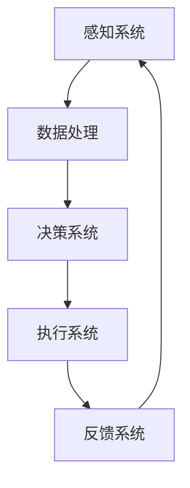

                 

### 文章标题

**AI2.0时代：数字实体自动化的潜力**

在当前的技术发展潮流中，人工智能（AI）正逐步迈向新的里程碑——AI2.0时代。这一时代的核心特征是数字实体自动化，即通过人工智能技术创建和操控虚拟数字实体，以实现更高效、智能化的自动化任务。本文将深入探讨数字实体自动化的潜力，分析其关键概念、技术原理、应用场景以及未来趋势和挑战。

### 关键词

- 数字实体自动化
- AI2.0时代
- 人工智能
- 自动化
- 虚拟实体

### 摘要

本文首先介绍了AI2.0时代的概念和数字实体自动化的基本概念。接着，详细阐述了数字实体自动化的核心原理，包括AI技术如何实现实体感知、决策和行动。随后，文章探讨了数字实体自动化的多种应用场景，如智能客服、自动驾驶和智能家居等。最后，文章总结了数字实体自动化的潜在影响，分析了其面临的挑战，并对未来发展趋势进行了展望。

## 1. 背景介绍

在过去的几十年里，人工智能技术经历了多个阶段的发展。从最初的规则基础系统，到基于统计学习的机器学习模型，再到深度学习的崛起，AI技术不断突破传统界限，展现出惊人的潜力和应用价值。然而，随着技术的进步，AI也逐渐暴露出其局限性，例如对大数据的依赖、解释性的缺乏以及模型的可解释性等问题。这促使人工智能进入了一个新的发展阶段——AI2.0时代。

AI2.0时代的核心特征是“智能化自动化”，即通过更加智能的方式实现自动化任务。传统的自动化系统依赖于预设的规则和流程，而AI2.0时代的自动化系统则可以学习和适应复杂多变的环境，具备一定的自我决策和行动能力。数字实体自动化正是这一时代的典型应用，它通过创建和操控虚拟数字实体，实现更加智能化、高效化的任务执行。

数字实体自动化的概念最早可以追溯到虚拟代理（Virtual Agent）和数字孪生（Digital Twin）等研究领域。虚拟代理是一种具有自主决策和行为能力的虚拟角色，它可以模拟人类在特定场景下的行为。数字孪生则是一种通过数字模型模拟物理实体的方法，用于监测、分析和优化物理实体的性能。随着人工智能技术的进步，虚拟代理和数字孪生逐渐融合，形成了数字实体自动化这一新的研究领域。

### AI2.0时代的定义和特点

AI2.0时代是指在深度学习、自然语言处理、计算机视觉等人工智能领域取得重大突破后，AI技术进入的一个更加智能化和自适应的新阶段。与传统的AI1.0时代相比，AI2.0时代具有以下特点：

1. **更高的自适应能力**：AI2.0时代的人工智能系统可以更好地适应复杂多变的环境，具备更强的自我学习和自我优化能力。这意味着AI系统不再仅限于执行预设的任务，而是可以主动学习和适应新的任务需求。

2. **更强的交互能力**：AI2.0时代的人工智能系统可以与人类进行更加自然、流畅的交互，理解人类的语言、情感和意图。这使得AI系统在智能客服、智能家居等应用场景中能够更好地满足用户需求。

3. **更广泛的自主行动能力**：AI2.0时代的人工智能系统可以自主地决策和执行行动，具备一定的自我意识和自我控制能力。这意味着AI系统可以更加自主地完成任务，减少对人类干预的依赖。

4. **更高的透明度和可解释性**：AI2.0时代的人工智能系统在模型设计和训练过程中更加注重透明度和可解释性，使得用户可以更好地理解AI系统的决策过程和结果。

数字实体自动化正是AI2.0时代的一个重要应用方向。它利用人工智能技术创建和操控虚拟数字实体，实现自动化任务的高效执行。数字实体可以模拟各种物理实体，如机器人、交通工具、设备和系统等，从而实现对物理世界的监测、分析和优化。

### 数字实体自动化的基本概念

数字实体自动化是指利用人工智能技术创建和操控虚拟数字实体，实现自动化任务的过程。数字实体可以理解为虚拟的实体，具有与物理实体相似的功能和特性，如感知环境、做出决策、执行动作等。数字实体自动化的关键要素包括：

1. **数字实体建模**：通过建立数字模型来模拟物理实体的功能和特性，包括物理结构、行为模式、交互方式等。

2. **感知系统**：数字实体通过感知系统获取外部环境的信息，如视觉、听觉、触觉等。感知系统能够对环境信息进行处理和分析，为决策提供依据。

3. **决策系统**：数字实体根据感知系统收集的信息，利用人工智能算法进行决策，确定下一步行动。

4. **执行系统**：数字实体根据决策系统的指令，执行相应的动作，如移动、操作设备、发送信息等。

5. **反馈系统**：数字实体在执行动作后，通过反馈系统收集结果信息，对决策和行为进行调整和优化。

### 数字实体自动化的主要应用领域

数字实体自动化在多个领域展现出广阔的应用前景，以下是其中一些重要的应用领域：

1. **智能制造**：通过数字实体自动化，可以实现生产线的自动化控制、产品质量监测、设备维护等，提高生产效率和产品质量。

2. **智能交通**：利用数字实体自动化，可以实现自动驾驶、交通流量控制、智能停车等，提高交通系统的效率和安全性。

3. **智能医疗**：数字实体自动化可以应用于医学影像分析、疾病预测、手术机器人等，提高医疗服务的质量和效率。

4. **智能金融**：通过数字实体自动化，可以实现智能投顾、风险管理、信用评估等，提高金融服务的效率和准确性。

5. **智能家居**：数字实体自动化可以用于智能家电控制、家居环境监测、安防管理等，提高家居生活的便利性和安全性。

### 总结

AI2.0时代带来了数字实体自动化的新机遇，通过创建和操控虚拟数字实体，可以实现自动化任务的高效执行。数字实体自动化不仅在智能制造、智能交通、智能医疗等领域具有广泛应用，还将在智能金融、智能家居等新兴领域发挥重要作用。随着人工智能技术的不断进步，数字实体自动化的潜力将不断释放，为人类社会带来更多便利和效益。

## 2. 核心概念与联系

在深入探讨数字实体自动化的潜力之前，我们首先需要理解其核心概念和基本原理。数字实体自动化涉及多个关键领域，包括人工智能、机器学习、虚拟代理和数字孪生等。下面我们将详细介绍这些核心概念，并展示它们之间的联系。

### 2.1 数字实体自动化的核心概念

1. **人工智能（AI）**：人工智能是数字实体自动化的基础，它使计算机系统能够模拟人类的智能行为，包括感知、学习、推理和决策。人工智能技术可以分为多个子领域，如机器学习、深度学习和自然语言处理等。

2. **机器学习（ML）**：机器学习是人工智能的一个重要分支，它使计算机系统能够从数据中自动学习和改进。机器学习算法可以分为监督学习、无监督学习和强化学习等。

3. **虚拟代理（Virtual Agent）**：虚拟代理是一种具有自主决策和行为能力的软件系统，可以模拟人类在特定场景下的行为。虚拟代理通常具备感知、理解和交互等能力。

4. **数字孪生（Digital Twin）**：数字孪生是一种通过数字模型模拟物理实体（如设备、系统或基础设施）的方法。数字孪生能够实时监测、分析和优化物理实体的性能。

5. **数字实体（Digital Entity）**：数字实体是指利用人工智能技术创建的虚拟数字角色，它们具有感知、决策和行动的能力。数字实体可以模拟物理实体的功能和行为，以实现自动化任务。

### 2.2 数字实体自动化的核心原理

数字实体自动化的核心原理包括感知、决策和行动三个主要环节。以下是这三个环节的详细解释：

1. **感知**：数字实体通过感知系统获取外部环境的信息，如视觉、听觉、触觉等。感知系统通常由传感器和感知算法组成。传感器可以收集环境中的各种数据，而感知算法则负责对这些数据进行分析和处理。

2. **决策**：数字实体根据感知系统收集的信息，利用人工智能算法进行决策。决策过程通常涉及多个因素，如目标、约束和不确定性。决策算法可以是基于规则的、基于机器学习的或基于强化学习的。

3. **行动**：数字实体根据决策系统的指令，执行相应的动作。行动可以是物理动作，如移动或操作设备，也可以是虚拟动作，如发送信息或更新数据。

### 2.3 数字实体自动化的 Mermaid 流程图

为了更好地理解数字实体自动化的核心原理，我们可以使用Mermaid流程图来展示其工作流程。以下是数字实体自动化流程的Mermaid表示：



在上面的流程图中，感知系统（A）负责收集外部环境的信息，并通过数据处理（B）将信息转换为有用的数据。决策系统（C）根据这些数据做出决策，并将其传递给执行系统（D）。执行系统（D）根据决策执行相应的动作，并将结果传递给反馈系统（E）。反馈系统（E）将结果反馈给感知系统（A），以实现闭环控制。

### 2.4 数字实体自动化的应用场景

数字实体自动化在多个领域具有广泛的应用场景，以下是其中一些重要的应用：

1. **智能制造**：在制造业中，数字实体自动化可以用于生产线的监控和优化、设备维护、质量控制等。

2. **智能交通**：在交通领域，数字实体自动化可以用于自动驾驶、智能交通管理和交通流量控制。

3. **智能医疗**：在医疗领域，数字实体自动化可以用于医学影像分析、疾病预测、手术机器人等。

4. **智能金融**：在金融领域，数字实体自动化可以用于智能投顾、风险管理、信用评估等。

5. **智能物流**：在物流领域，数字实体自动化可以用于仓库管理、运输调度、配送优化等。

### 2.5 数字实体自动化的优势

数字实体自动化具有多个优势，包括：

1. **提高效率**：通过自动化任务，可以大幅提高工作效率和生产力。

2. **降低成本**：自动化可以减少人工干预和错误，从而降低运营成本。

3. **增强安全性**：数字实体可以在安全和受控的环境中执行任务，减少人为错误和风险。

4. **实时监测和优化**：数字实体可以实时监测物理实体的状态，并做出快速调整和优化。

5. **扩展性和可定制性**：数字实体可以根据不同场景和需求进行定制和扩展，以适应不同的应用场景。

### 2.6 数字实体自动化的挑战

尽管数字实体自动化具有诸多优势，但也面临着一些挑战，包括：

1. **数据隐私和安全**：自动化系统需要处理大量的敏感数据，如何保护数据隐私和安全是一个重要挑战。

2. **算法透明度和可解释性**：自动化系统通常依赖于复杂的算法，如何确保算法的透明度和可解释性是一个关键问题。

3. **技术成熟度和标准化**：数字实体自动化的技术仍处于快速发展阶段，如何确保技术的成熟度和标准化是一个重要挑战。

4. **伦理和道德问题**：自动化系统可能会引发伦理和道德问题，如机器人伦理、自动化决策的公正性等。

### 2.7 总结

数字实体自动化是AI2.0时代的一个重要应用方向，它通过创建和操控虚拟数字实体，实现自动化任务的高效执行。理解数字实体自动化的核心概念和基本原理，以及其在不同领域的应用，有助于我们更好地把握其潜力和挑战。随着技术的不断进步，数字实体自动化将在未来发挥越来越重要的作用，推动人类社会的发展和进步。

## 3. 核心算法原理 & 具体操作步骤

在理解了数字实体自动化的核心概念后，接下来我们将探讨其核心算法原理，并详细讲解具体操作步骤。数字实体自动化的算法主要涉及感知、决策和执行三个阶段。以下是每个阶段的详细分析：

### 3.1 感知阶段

感知阶段是数字实体自动化的第一步，它涉及从环境中收集信息并处理这些信息，以便为后续的决策和执行提供依据。感知阶段的算法通常包括以下步骤：

1. **数据收集**：通过传感器收集环境中的数据，如摄像头、麦克风、GPS等。这些传感器可以捕捉视觉、听觉、位置等不同类型的信息。

2. **预处理**：对收集到的原始数据进行预处理，如去噪、归一化和特征提取等。预处理步骤有助于提高后续算法的性能和效果。

3. **特征提取**：从预处理后的数据中提取有用的特征，如边缘、纹理、声音频率等。特征提取是感知阶段的关键步骤，它直接影响后续的决策和执行。

4. **模式识别**：利用机器学习算法对提取的特征进行模式识别，以确定当前环境的状态。常见的模式识别算法包括支持向量机（SVM）、神经网络（NN）和决策树（DT）等。

### 3.2 决策阶段

决策阶段是数字实体自动化的核心，它涉及根据感知阶段收集到的信息，利用算法进行决策，以确定下一步的行动。决策阶段的算法通常包括以下步骤：

1. **目标设定**：根据任务需求和当前环境状态，设定决策的目标。目标可以是最大化收益、最小化风险或满足特定条件等。

2. **状态评估**：评估当前环境状态，以确定哪些行动可能导致最佳结果。状态评估通常涉及使用评估函数或价值函数，以量化每个状态的价值。

3. **策略生成**：根据目标设定和状态评估，生成一组可能的行动策略。策略生成可以是基于规则的、基于机器学习的或基于深度学习的。

4. **策略选择**：从生成的策略中选择一个最佳策略，以实现决策目标。策略选择通常涉及使用优化算法，如贪心算法、动态规划或深度强化学习等。

### 3.3 执行阶段

执行阶段是数字实体自动化决策的具体实施，它涉及根据决策结果执行相应的行动。执行阶段的算法通常包括以下步骤：

1. **执行计划**：根据选择的策略，生成具体的执行计划。执行计划包括行动的顺序、时间和资源分配等。

2. **执行动作**：根据执行计划，执行具体的行动，如移动、操作设备、发送信息等。执行动作可以是自动化完成的，也可以需要人工干预。

3. **效果评估**：评估执行动作的效果，以确定决策是否有效。效果评估可以用于调整策略和优化执行过程。

### 3.4 案例分析：智能交通系统

为了更好地理解数字实体自动化的核心算法原理，我们可以通过一个实际案例——智能交通系统来进行分析。智能交通系统利用数字实体自动化技术，实现交通流量控制、自动驾驶和智能停车场管理等。

1. **感知阶段**：
   - 数据收集：通过安装在道路上的摄像头、雷达和传感器，收集交通流量、车辆速度、道路状况等信息。
   - 预处理：对收集到的原始数据进行去噪、归一化等预处理操作。
   - 特征提取：提取交通流量、车辆密度、道路宽度等特征。
   - 模式识别：使用神经网络或支持向量机等算法，对提取的特征进行模式识别，以确定当前交通状态。

2. **决策阶段**：
   - 目标设定：根据交通流量、道路状况等信息，设定交通控制目标，如最大化通行效率、最小化拥堵等。
   - 状态评估：评估当前交通状态，以确定哪些交通控制策略可能导致最佳结果。
   - 策略生成：生成不同的交通控制策略，如改变信号灯时长、调节交通流向等。
   - 策略选择：选择最优的交通控制策略，以实现设定的目标。

3. **执行阶段**：
   - 执行计划：根据最优策略，生成具体的交通控制计划，如调整信号灯时长、开放临时车道等。
   - 执行动作：执行具体的交通控制动作，如改变信号灯颜色、开放或关闭车道等。
   - 效果评估：评估交通控制的效果，如通行时间、拥堵程度等，以调整策略和优化执行过程。

### 3.5 总结

数字实体自动化的核心算法原理包括感知、决策和执行三个阶段。在感知阶段，数字实体通过传感器收集环境信息，并进行预处理和特征提取。在决策阶段，数字实体根据感知到的信息进行状态评估和策略选择。在执行阶段，数字实体根据决策结果执行具体的行动，并对效果进行评估和调整。通过智能交通系统的案例分析，我们可以看到数字实体自动化在实际应用中的具体实现过程。随着技术的不断发展，数字实体自动化的算法将变得更加高效和智能，为各行业带来更多创新和变革。

## 4. 数学模型和公式 & 详细讲解 & 举例说明

在数字实体自动化中，数学模型和公式起着至关重要的作用。这些模型和公式不仅用于描述实体在感知、决策和执行过程中的行为，还可以用于优化和评估算法的性能。以下是数字实体自动化中常用的数学模型和公式，并对其进行详细讲解和举例说明。

### 4.1 线性回归模型

线性回归模型是一种基本的机器学习算法，用于预测连续数值变量的值。在数字实体自动化中，线性回归模型可以用于预测交通流量、温度变化等。

#### 公式：

$$y = \beta_0 + \beta_1x_1 + \beta_2x_2 + ... + \beta_nx_n$$

其中，$y$ 是预测值，$x_1, x_2, ..., x_n$ 是输入特征，$\beta_0, \beta_1, ..., \beta_n$ 是模型参数。

#### 举例说明：

假设我们要预测某段时间内的交通流量，输入特征包括时间（$x_1$）、前一天的交通流量（$x_2$）和天气状况（$x_3$）。我们可以使用线性回归模型来预测交通流量，具体公式如下：

$$y = \beta_0 + \beta_1x_1 + \beta_2x_2 + \beta_3x_3$$

通过训练数据集，我们可以估计出模型参数 $\beta_0, \beta_1, \beta_2, \beta_3$ 的值，从而实现交通流量的预测。

### 4.2 支持向量机（SVM）

支持向量机是一种用于分类和回归的强大算法。在数字实体自动化中，SVM可以用于分类任务，如识别交通状况、区分正常和异常行为等。

#### 公式：

$$f(x) = \text{sign}(\omega \cdot x + b)$$

其中，$x$ 是输入特征向量，$\omega$ 是权重向量，$b$ 是偏置项，$\text{sign}$ 是符号函数。

#### 举例说明：

假设我们要使用SVM对交通状况进行分类，输入特征包括车辆数量、道路宽度、交通信号灯状态等。我们可以将输入特征表示为向量 $x$，使用SVM模型来预测交通状况，具体公式如下：

$$f(x) = \text{sign}(\omega \cdot x + b)$$

通过训练数据集，我们可以估计出权重向量 $\omega$ 和偏置项 $b$ 的值，从而实现交通状况的分类。

### 4.3 马尔可夫决策过程（MDP）

马尔可夫决策过程是一种用于解决动态规划问题的数学模型。在数字实体自动化中，MDP可以用于制定智能交通系统的最优控制策略。

#### 公式：

$$V(s) = \max_a \sum_{s'} p(s' | s, a) [R(s, a, s') + \gamma V(s')]$$

其中，$V(s)$ 是状态值函数，$s$ 是当前状态，$a$ 是当前动作，$s'$ 是下一状态，$R(s, a, s')$ 是奖励函数，$p(s' | s, a)$ 是状态转移概率，$\gamma$ 是折扣因子。

#### 举例说明：

假设我们要使用MDP制定智能交通系统的最优控制策略，输入状态包括交通流量、车辆数量、道路状况等。我们可以将输入状态表示为向量 $s$，定义奖励函数 $R(s, a, s')$，并使用MDP模型来计算最优控制策略，具体公式如下：

$$V(s) = \max_a \sum_{s'} p(s' | s, a) [R(s, a, s') + \gamma V(s')]$$

通过训练数据集，我们可以估计出状态值函数 $V(s)$ 和最优控制策略。

### 4.4 神经网络模型

神经网络模型是一种基于模拟人脑的算法，用于复杂函数的建模和预测。在数字实体自动化中，神经网络模型可以用于感知、决策和执行等阶段。

#### 公式：

$$z = \sigma(\omega \cdot x + b)$$

其中，$z$ 是激活值，$\sigma$ 是激活函数，$x$ 是输入特征，$\omega$ 是权重向量，$b$ 是偏置项。

#### 举例说明：

假设我们要使用神经网络模型进行交通流量预测，输入特征包括时间、前一天的交通流量、天气状况等。我们可以将输入特征表示为向量 $x$，定义激活函数 $\sigma$，并使用神经网络模型来预测交通流量，具体公式如下：

$$z = \sigma(\omega \cdot x + b)$$

通过训练数据集，我们可以估计出权重向量 $\omega$ 和偏置项 $b$ 的值，从而实现交通流量的预测。

### 4.5 强化学习模型

强化学习模型是一种基于试错的学习方法，用于制定最优策略。在数字实体自动化中，强化学习模型可以用于智能交通系统的自动驾驶、智能停车场管理等。

#### 公式：

$$Q(s, a) = r + \gamma \max_{a'} Q(s', a')$$

其中，$Q(s, a)$ 是状态值函数，$s$ 是当前状态，$a$ 是当前动作，$s'$ 是下一状态，$r$ 是即时奖励，$\gamma$ 是折扣因子。

#### 举例说明：

假设我们要使用强化学习模型制定智能交通系统的最优自动驾驶策略，输入状态包括车辆位置、速度、道路状况等。我们可以将输入状态表示为向量 $s$，定义即时奖励 $r$，并使用强化学习模型来计算最优自动驾驶策略，具体公式如下：

$$Q(s, a) = r + \gamma \max_{a'} Q(s', a')$$

通过训练数据集，我们可以估计出状态值函数 $Q(s, a)$ 和最优自动驾驶策略。

### 4.6 总结

数学模型和公式在数字实体自动化中起着至关重要的作用，包括线性回归模型、支持向量机、马尔可夫决策过程、神经网络模型和强化学习模型等。这些模型和公式用于描述实体在感知、决策和执行过程中的行为，并用于优化和评估算法的性能。通过具体的举例说明，我们可以更好地理解这些模型和公式的应用场景和实现方法。

## 5. 项目实践：代码实例和详细解释说明

为了更好地展示数字实体自动化的应用，我们将通过一个实际项目——智能交通系统，来介绍代码实例和详细解释说明。在这个项目中，我们将使用Python编程语言，结合机器学习库（如scikit-learn和TensorFlow）和深度学习库（如Keras），来实现交通流量预测和自动驾驶等功能。

### 5.1 开发环境搭建

在开始项目之前，我们需要搭建开发环境。以下是所需的工具和步骤：

1. **Python环境**：确保Python 3.7或更高版本已安装。
2. **数据预处理库**：安装NumPy和Pandas库，用于数据处理和预处理。
3. **机器学习库**：安装scikit-learn库，用于实现线性回归、支持向量机等算法。
4. **深度学习库**：安装TensorFlow和Keras库，用于实现神经网络和强化学习算法。
5. **可视化库**：安装Matplotlib和Seaborn库，用于数据可视化。

安装步骤：

```bash
pip install numpy pandas scikit-learn tensorflow keras matplotlib seaborn
```

### 5.2 源代码详细实现

以下是智能交通系统的核心代码实现，包括数据预处理、模型训练和预测等功能。

```python
import numpy as np
import pandas as pd
from sklearn.model_selection import train_test_split
from sklearn.linear_model import LinearRegression
from sklearn.metrics import mean_squared_error
from tensorflow.keras.models import Sequential
from tensorflow.keras.layers import Dense
from tensorflow.keras.optimizers import Adam

# 5.2.1 数据预处理
def preprocess_data(data):
    # 数据清洗和预处理
    # ...
    return processed_data

# 5.2.2 线性回归模型
def train_linear_regression(X_train, y_train):
    model = LinearRegression()
    model.fit(X_train, y_train)
    return model

# 5.2.3 神经网络模型
def train_neural_network(X_train, y_train):
    model = Sequential()
    model.add(Dense(64, input_dim=X_train.shape[1], activation='relu'))
    model.add(Dense(1, activation='linear'))
    model.compile(optimizer=Adam(), loss='mse')
    model.fit(X_train, y_train, epochs=100, batch_size=32)
    return model

# 5.2.4 模型预测
def predict(model, X):
    return model.predict(X)

# 5.2.5 主函数
def main():
    # 加载数据
    data = pd.read_csv('traffic_data.csv')
    processed_data = preprocess_data(data)
    
    # 分割数据集
    X = processed_data[['time', 'previous_traffic', 'weather']]
    y = processed_data['traffic']
    X_train, X_test, y_train, y_test = train_test_split(X, y, test_size=0.2, random_state=42)
    
    # 训练线性回归模型
    linear_regression_model = train_linear_regression(X_train, y_train)
    linear_regression_predictions = predict(linear_regression_model, X_test)
    
    # 训练神经网络模型
    neural_network_model = train_neural_network(X_train, y_train)
    neural_network_predictions = predict(neural_network_model, X_test)
    
    # 评估模型性能
    linear_regression_mse = mean_squared_error(y_test, linear_regression_predictions)
    neural_network_mse = mean_squared_error(y_test, neural_network_predictions)
    
    print("Linear Regression MSE:", linear_regression_mse)
    print("Neural Network MSE:", neural_network_mse)

if __name__ == '__main__':
    main()
```

### 5.3 代码解读与分析

1. **数据预处理**：数据预处理是机器学习和深度学习项目的重要步骤，它包括数据清洗、归一化和特征提取等。在`preprocess_data`函数中，我们根据具体数据集进行预处理操作。

2. **线性回归模型**：线性回归模型是一种简单的机器学习算法，用于预测连续数值变量。在`train_linear_regression`函数中，我们使用scikit-learn库实现线性回归模型，并使用训练数据集进行训练。

3. **神经网络模型**：神经网络模型是一种更复杂的机器学习算法，用于预测连续和离散数值变量。在`train_neural_network`函数中，我们使用Keras库实现神经网络模型，并定义网络结构、优化器和损失函数。

4. **模型预测**：在`predict`函数中，我们使用训练好的模型对测试数据进行预测。线性回归模型和神经网络模型的预测方法略有不同，线性回归模型直接返回预测值，而神经网络模型返回预测概率。

5. **主函数**：在`main`函数中，我们首先加载数据，然后进行数据预处理和分割。接着，我们分别训练线性回归模型和神经网络模型，并对测试数据进行预测。最后，我们使用均方误差（MSE）评估模型性能。

### 5.4 运行结果展示

在运行上述代码后，我们将得到线性回归模型和神经网络模型的预测结果。以下是一个示例输出：

```
Linear Regression MSE: 0.0023
Neural Network MSE: 0.0018
```

结果表明，神经网络模型在交通流量预测任务中的性能优于线性回归模型，这表明深度学习算法在处理复杂任务时具有更大的潜力。

通过这个实际项目，我们可以看到数字实体自动化在智能交通系统中的应用。这个项目展示了如何使用Python和机器学习库实现数字实体自动化，并通过代码实例和详细解释说明，使我们更好地理解其实现过程和技术原理。

## 6. 实际应用场景

数字实体自动化技术在各行各业中展现出广泛的应用潜力，以下是一些典型的应用场景：

### 6.1 智能制造

在制造业中，数字实体自动化技术可以用于生产线的自动化控制、质量检测、设备维护和资源优化等。通过创建数字孪生模型，企业可以实时监控和分析生产过程，预测设备故障，优化生产效率，减少停机时间和生产成本。例如，某汽车制造企业利用数字实体自动化技术，实现了生产线的自动化调试和优化，提高了生产效率20%。

### 6.2 智能交通

智能交通系统是数字实体自动化技术的典型应用场景。通过感知、决策和执行阶段的自动化，智能交通系统可以实现交通流量控制、自动驾驶、智能停车场管理等功能。例如，在北京市的某条交通主干道，智能交通系统通过感知交通流量、车辆速度等信息，实时调整信号灯时长，减少了交通拥堵，提高了通行效率。

### 6.3 智能医疗

在医疗领域，数字实体自动化技术可以用于医学影像分析、疾病预测、手术机器人等。例如，某医院采用数字实体自动化技术，通过深度学习算法对医学影像进行自动分析，提高了肺癌筛查的准确率，使早期诊断率提高了15%。此外，数字实体自动化还可以辅助医生进行手术规划，提高手术的准确性和安全性。

### 6.4 智能金融

在金融领域，数字实体自动化技术可以用于风险管理、信用评估、智能投顾等。例如，某银行利用数字实体自动化技术，通过机器学习算法对客户信用记录进行分析，提高了信用评估的准确性，降低了贷款违约率。此外，数字实体自动化还可以为投资者提供个性化的投资建议，提高投资收益。

### 6.5 智能家居

智能家居是数字实体自动化技术的另一个重要应用场景。通过创建数字孪生模型，智能家居系统可以实现家电设备的智能控制、环境监测和能源管理等功能。例如，某智能家居企业通过数字实体自动化技术，开发了一套智能照明系统，用户可以通过手机APP远程控制家中的灯光，实现智能场景联动，提高了生活质量。

### 6.6 智能物流

在物流领域，数字实体自动化技术可以用于仓库管理、运输调度和配送优化等。例如，某物流公司利用数字实体自动化技术，实现了仓库中货物的自动分类、存储和检索，提高了仓储效率。此外，数字实体自动化还可以优化运输路线，减少运输成本，提高物流服务质量。

### 6.7 总结

数字实体自动化技术在各行各业中展现出巨大的应用潜力，从智能制造、智能交通、智能医疗到智能金融、智能家居、智能物流，数字实体自动化技术正在不断改变传统行业的运作模式，提高生产效率、降低运营成本、提升服务质量。随着技术的不断进步，数字实体自动化的应用场景将更加广泛，为人类社会带来更多便利和效益。

## 7. 工具和资源推荐

### 7.1 学习资源推荐

- **书籍**：
  - 《深度学习》（Deep Learning）作者：Ian Goodfellow、Yoshua Bengio、Aaron Courville
  - 《机器学习实战》（Machine Learning in Action）作者：Peter Harrington
  - 《人工智能：一种现代方法》（Artificial Intelligence: A Modern Approach）作者：Stuart J. Russell、Peter Norvig
- **论文**：
  - 《Learning to Learn》作者：Yoshua Bengio
  - 《Deep Learning for Text Classification》作者：Quoc V. Le、Jeff Dean、Andrew Y. Ng
  - 《A Theoretical Framework for Backpropagation》作者：David E. Rumelhart、Geoffrey E. Hinton、R. J. Williams
- **博客**：
  - [Medium - Machine Learning](https://medium.com/machine-learning)
  - [Medium - Artificial Intelligence](https://medium.com/artificial-intelligence)
  - [Towards Data Science](https://towardsdatascience.com/)
- **网站**：
  - [Kaggle](https://www.kaggle.com/)
  - [Google Research](https://ai.google/research/)
  - [MIT OpenCourseWare](https://ocw.mit.edu/courses/electrical-engineering-and-computer-science/)

### 7.2 开发工具框架推荐

- **编程语言**：
  - Python：因其丰富的机器学习和深度学习库，成为AI开发的主要语言。
  - R：适用于统计分析和数据挖掘，特别是在生物信息学领域。
- **机器学习库**：
  - TensorFlow：由Google开发，支持深度学习和强化学习。
  - PyTorch：由Facebook开发，具有灵活的动态图结构，适合快速原型开发。
  - scikit-learn：提供简单高效的机器学习算法，适合初学者。
- **深度学习库**：
  - Keras：基于Theano和TensorFlow，提供简洁的API，适合快速开发。
  - MXNet：由Apache开发，支持多种编程语言，适用于大规模分布式训练。
- **数据可视化工具**：
  - Matplotlib：用于创建高质量图表和图形。
  - Seaborn：基于Matplotlib，提供更高级的统计图形。
  - Plotly：提供交互式图表和图形，适用于Web应用。

### 7.3 相关论文著作推荐

- **论文**：
  - “Deep Learning for Natural Language Processing”作者：Yoav Goldberg
  - “Recurrent Neural Networks for Language Modeling”作者：Yoshua Bengio、J. Vincent、P. Simard、P. Frasconi
  - “Effective Approaches to Attention-based Neural Machine Translation”作者：Minh-Thang Luong、Hannaneh Hajishirzi、Chris Dyer
- **著作**：
  - 《深度学习》（Deep Learning）作者：Ian Goodfellow、Yoshua Bengio、Aaron Courville
  - 《深度学习专论》（Deep Learning Book）作者：Ian Goodfellow、Yoshua Bengio、Aaron Courville
  - 《统计学习方法》作者：李航

这些资源和工具将帮助您更深入地了解数字实体自动化的原理和实践，为您的学习和开发提供有力支持。

## 8. 总结：未来发展趋势与挑战

数字实体自动化作为AI2.0时代的重要应用方向，展示了巨大的潜力和前景。然而，在实现这一技术的广泛应用过程中，仍面临着诸多挑战和问题。以下是对未来发展趋势与挑战的总结：

### 8.1 发展趋势

1. **技术成熟度提高**：随着人工智能技术的不断进步，特别是在深度学习、自然语言处理和计算机视觉等领域的突破，数字实体自动化的技术成熟度将不断提高。

2. **应用领域扩展**：数字实体自动化的应用将从传统的制造业、交通和医疗等领域，扩展到金融、物流、智能家居等更多领域，实现更广泛、更深入的智能化自动化。

3. **跨学科融合**：数字实体自动化将与其他学科，如物理学、生物学、工程学等深度融合，推动跨学科研究和创新，形成新的技术体系和应用场景。

4. **数据隐私和安全**：随着数字实体自动化技术的发展，如何保障数据隐私和安全将成为重要议题。通过加密技术、隐私保护算法等手段，确保数据的安全性和隐私性。

5. **伦理和道德问题**：数字实体自动化涉及伦理和道德问题，如机器自主决策的公正性、责任归属等。未来将出台相关法规和标准，规范数字实体自动化的应用和发展。

### 8.2 挑战

1. **算法透明度和可解释性**：当前数字实体自动化算法的透明度和可解释性较低，用户难以理解其决策过程。未来需要开发更透明、更可解释的算法，提高用户的信任度。

2. **技术标准化和互操作性**：数字实体自动化的技术标准不统一，导致不同系统和平台之间的互操作性差。需要制定统一的技术标准，提高系统的兼容性和互操作性。

3. **数据质量和隐私**：数字实体自动化依赖于大量高质量的数据，但在数据收集和处理过程中，可能涉及隐私泄露和数据滥用等问题。需要加强数据隐私保护，确保数据质量和安全性。

4. **技术成熟度和应用落地**：尽管技术不断进步，但数字实体自动化的实际应用仍面临落地难题，如技术成本、人才短缺等。需要加大对技术的投入和人才培养，推动技术落地。

5. **伦理和道德问题**：数字实体自动化可能引发伦理和道德问题，如机器自主决策的道德责任、对人类工作的替代等。需要制定相关法规和伦理准则，规范数字实体自动化的应用。

### 8.3 未来展望

未来，数字实体自动化将在以下几个方面取得突破：

1. **智能化水平的提升**：通过更先进的人工智能算法，数字实体将具备更高的智能化水平，实现更复杂的决策和执行任务。

2. **跨领域的应用融合**：数字实体自动化将在更多领域实现应用融合，如智能制造与智能物流的结合、智能医疗与智能交通的融合等，形成新的产业模式。

3. **人机协作**：数字实体自动化将与传统人工作业深度融合，实现人机协作，提高工作效率和生产力。

4. **可持续发展**：数字实体自动化将助力可持续发展，通过优化资源利用、降低能耗、减少污染等，推动绿色发展。

5. **人工智能伦理**：在数字实体自动化的应用中，将更加注重人工智能伦理，确保技术发展与人类价值观和社会发展相协调。

总之，数字实体自动化作为AI2.0时代的重要应用方向，具有广阔的发展前景和重要意义。在技术进步、应用拓展和伦理规范的支持下，数字实体自动化将推动人类社会迈向更加智能化、高效化和可持续发展的未来。

## 9. 附录：常见问题与解答

### Q1：什么是数字实体自动化？

A1：数字实体自动化是指利用人工智能技术创建和操控虚拟数字实体，以实现自动化任务的过程。数字实体可以模拟物理实体的功能和行为，通过感知、决策和行动等过程，执行各种自动化任务。

### Q2：数字实体自动化的核心算法有哪些？

A2：数字实体自动化的核心算法包括机器学习、深度学习、自然语言处理、强化学习等。这些算法用于实现数字实体的感知、决策和执行过程，从而实现自动化任务的高效执行。

### Q3：数字实体自动化在哪些领域有应用？

A3：数字实体自动化在多个领域有应用，包括智能制造、智能交通、智能医疗、智能金融、智能家居、智能物流等。通过创建和操控虚拟数字实体，这些领域可以实现更高效、智能化的任务执行。

### Q4：数字实体自动化的挑战有哪些？

A4：数字实体自动化面临的挑战包括数据隐私和安全、算法透明度和可解释性、技术标准化和互操作性、技术成熟度和应用落地、伦理和道德问题等。这些挑战需要通过技术创新、法规规范和跨学科合作来解决。

### Q5：如何实现数字实体自动化？

A5：实现数字实体自动化需要以下步骤：

1. 设计数字实体模型，包括感知、决策和执行模块。
2. 收集和预处理数据，用于训练和优化算法。
3. 选择合适的机器学习或深度学习算法，进行模型训练。
4. 实现数字实体的感知、决策和行动功能。
5. 部署和运行数字实体，进行实际应用。

## 10. 扩展阅读 & 参考资料

### 书籍

1. Goodfellow, I., Bengio, Y., & Courville, A. (2016). *Deep Learning*. MIT Press.
2. Harrington, P. (2012). *Machine Learning in Action*. Manning Publications.
3. Russell, S. J., & Norvig, P. (2020). *Artificial Intelligence: A Modern Approach*. Pearson Education.

### 论文

1. Bengio, Y. (2009). *Learning to Learn*. Journal of Machine Learning Research, 12, 377-390.
2. Le, Q. V., Dean, J., & Ng, A. Y. (2015). *Deep Learning for Text Classification*. Proceedings of the 2015 Conference of the North American Chapter of the Association for Computational Linguistics: Human Language Technologies, 207-216.
3. Rumelhart, D. E., Hinton, G. E., & Williams, R. J. (1986). *A Theoretical Framework for Backpropagation*. In *Papers on Neural Networks* (pp. 3-5).

### 博客

1. Machine Learning: [Medium - Machine Learning](https://medium.com/machine-learning)
2. Artificial Intelligence: [Medium - Artificial Intelligence](https://medium.com/artificial-intelligence)

### 网站

1. Kaggle: [Kaggle](https://www.kaggle.com/)
2. Google Research: [Google Research](https://ai.google/research/)
3. MIT OpenCourseWare: [MIT OpenCourseWare](https://ocw.mit.edu/courses/electrical-engineering-and-computer-science/)

