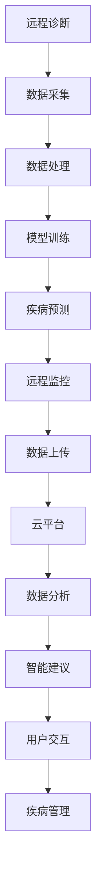

                 

# 数字化宠物医疗创业：远程诊断和监控

## 1. 背景介绍

随着人们生活水平的提高和家庭宠物数量的增加，宠物健康问题也变得越来越受到重视。传统的宠物医疗服务存在诸多限制，如地理距离、时间成本、费用昂贵等。数字化宠物医疗的兴起，为宠物主人提供了更加便捷、高效、经济的健康管理方式。其中，远程诊断和监控技术，作为数字化宠物医疗的重要组成部分，通过互联网连接医生和宠物主人，为宠物的日常健康监测提供了新的可能。

本文将从背景介绍、核心概念与联系、核心算法原理与具体操作步骤、数学模型和公式、项目实践、实际应用场景、工具和资源推荐、总结等多个角度，深入探讨数字化宠物医疗中的远程诊断和监控技术。通过理论分析与实践案例相结合的方式，为读者呈现一个全面、系统的认知框架。

## 2. 核心概念与联系

### 2.1 核心概念概述

在数字化宠物医疗的远程诊断和监控中，涉及的核心概念包括：

- **远程诊断**：医生通过互联网平台，对宠物进行远程的初步诊断，收集病史、症状等信息，初步判断疾病类型和可能原因。
- **远程监控**：宠物主人通过智能设备，实时监测宠物的健康状况，如心率、体温、血氧等指标，并将数据上传到医生或专业平台进行分析和处理。
- **云平台**：提供远程诊断和监控服务的云平台，通常包含数据库、数据处理引擎、通讯模块等，实现数据的存储、处理和传输。
- **智能设备**：如可穿戴设备、智能秤、摄像头等，用于收集宠物健康数据，实现实时监控。
- **算法与模型**：包括机器学习、深度学习等算法，用于数据分析、疾病预测和模型优化。

这些核心概念通过互联网技术、大数据、人工智能等手段，形成了一个有机整体，为宠物的健康管理和疾病预防提供了有力支持。

### 2.2 核心概念原理和架构的 Mermaid 流程图



这个流程图展示了远程诊断和监控的基本流程：

1. 宠物主人通过可穿戴设备或智能秤采集宠物健康数据，上传到云平台。
2. 云平台进行数据处理，包括去噪、清洗、归一化等。
3. 利用机器学习或深度学习模型对数据进行分析，进行疾病预测。
4. 根据预测结果，向宠物主人提供智能建议。
5. 宠物主人根据建议，对宠物进行相应的管理措施。

## 3. 核心算法原理 & 具体操作步骤

### 3.1 算法原理概述

远程诊断和监控的算法原理主要基于数据处理和机器学习。其中，数据处理包括数据清洗、归一化、特征提取等步骤，旨在提高数据质量，减少噪声，为后续的机器学习算法提供可靠的输入。机器学习算法则利用历史数据和当前数据，进行疾病预测和智能建议的生成。

具体来说，远程诊断和监控涉及以下关键步骤：

- **数据采集**：通过智能设备，如智能秤、摄像头、可穿戴设备等，收集宠物的健康数据。
- **数据处理**：对采集的数据进行预处理，包括去噪、归一化、特征提取等。
- **模型训练**：使用历史数据训练机器学习模型，如分类模型、回归模型等。
- **疾病预测**：对新采集的数据进行预测，判断宠物是否存在健康问题。
- **智能建议**：根据预测结果，生成相应的智能建议，指导宠物主人采取相应措施。
- **远程监控**：通过云平台，将预测结果和智能建议实时反馈给宠物主人，实现远程监控。

### 3.2 算法步骤详解

#### 3.2.1 数据采集

数据采集是远程诊断和监控的第一步。常用的智能设备包括：

- **智能秤**：用于测量宠物体重，分析体重变化趋势，判断宠物健康状态。
- **摄像头**：用于拍摄宠物的面部和身体图像，检测皮肤、毛发、眼睛等部位的异常。
- **可穿戴设备**：如智能项圈、智能服装等，用于监测宠物的心率、体温、血氧等生理指标。

#### 3.2.2 数据处理

数据处理主要包括以下几个步骤：

- **数据清洗**：去除噪声、异常值，处理缺失值，确保数据的一致性和完整性。
- **数据归一化**：将不同来源、不同单位的数据转化为标准格式，便于后续处理。
- **特征提取**：从采集的数据中提取有意义的特征，如体重变化、心率波动、皮肤状态等。

#### 3.2.3 模型训练

模型训练是远程诊断和监控的核心环节。常用的模型包括：

- **分类模型**：如逻辑回归、支持向量机等，用于判断宠物是否存在健康问题。
- **回归模型**：如线性回归、随机森林等，用于预测宠物的体重、血氧等生理指标的变化趋势。
- **深度学习模型**：如卷积神经网络(CNN)、循环神经网络(RNN)等，用于处理图像数据，进行疾病预测。

#### 3.2.4 疾病预测

疾病预测是远程诊断和监控的关键步骤。通过对历史数据和当前数据的分析，可以判断宠物是否存在健康问题，预测可能的疾病类型和严重程度。常用的方法包括：

- **基于规则的预测**：根据预设的规则和症状，进行初步判断。
- **基于机器学习的预测**：使用训练好的模型，对数据进行预测。
- **基于深度学习的预测**：使用复杂的深度神经网络，进行更准确的疾病预测。

#### 3.2.5 智能建议

智能建议是基于疾病预测结果的下一步行动指导。常见的智能建议包括：

- **饮食建议**：根据宠物的疾病类型，推荐相应的饮食方案。
- **活动建议**：建议宠物主人增加或减少宠物的活动量，调整日常行为。
- **就医建议**：根据病情严重程度，建议宠物主人带宠物就医。

#### 3.2.6 远程监控

远程监控通过云平台实现。常见的云平台包括：

- **AWS**：提供弹性计算、存储、数据库等服务。
- **Azure**：提供强大的云服务，支持分布式计算和数据分析。
- **Google Cloud**：提供机器学习、自然语言处理等服务，支持AI模型的部署和训练。

### 3.3 算法优缺点

#### 3.3.1 优点

- **便利性**：远程诊断和监控不受地理位置限制，宠物主人可以在任何地方进行健康管理。
- **实时性**：数据实时采集和上传，能够及时发现宠物的健康问题，避免延误。
- **成本低**：相比于传统就医，远程诊断和监控费用较低，减少了宠物主人的经济负担。
- **高效性**：通过机器学习和智能建议，能够快速判断和处理宠物健康问题，提高效率。

#### 3.3.2 缺点

- **准确性**：远程诊断和监控依赖于设备和数据质量，可能存在误判和漏判的情况。
- **隐私问题**：宠物主人需要提供宠物的隐私信息，存在数据泄露的风险。
- **技术门槛**：需要一定的技术基础，才能使用和维护相关系统。

### 3.4 算法应用领域

远程诊断和监控技术广泛应用于以下几个领域：

- **宠物健康管理**：帮助宠物主人实时监测宠物的健康状况，预防疾病。
- **宠物疾病预测**：通过分析宠物的生理数据，预测可能的健康问题。
- **宠物智能建议**：提供个性化的饮食、活动、就医建议，提高宠物生活质量。
- **兽医辅助诊断**：辅助兽医进行初步诊断，减少就诊时间，提高诊疗效率。
- **宠物监控报警**：设置健康指标阈值，一旦超出，自动报警，及时通知宠物主人。

## 4. 数学模型和公式 & 详细讲解 & 举例说明

### 4.1 数学模型构建

远程诊断和监控的数学模型主要基于以下公式构建：

1. **数据采集与处理**：
   $$
   x_i = \{s_i, w_i, h_i\}
   $$
   其中 $s_i$ 为皮肤状态，$w_i$ 为体重，$h_i$ 为心率。

2. **特征提取**：
   $$
   f(x_i) = \{s_{s1}, s_{s2}, w_{t1}, h_{t2}\}
   $$
   其中 $s_{s1}$ 为皮肤异常特征，$s_{s2}$ 为体重变化趋势，$w_{t1}$ 为心率波动，$h_{t2}$ 为血氧水平。

3. **分类模型**：
   $$
   p(y|x) = \frac{e^{\alpha x^T\beta}}{\sum_{j=1}^{k} e^{\alpha x^T\beta_j}}
   $$
   其中 $y$ 为健康状态，$x$ 为输入数据，$\alpha$ 和 $\beta$ 为模型参数。

4. **回归模型**：
   $$
   y = \theta^T x + b
   $$
   其中 $y$ 为预测值，$x$ 为输入数据，$\theta$ 和 $b$ 为模型参数。

5. **深度学习模型**：
   $$
   f(x) = \sum_{i=1}^{n} a_i\sigma(z_i)
   $$
   其中 $z_i = \sum_{j=1}^{m} w_{ij}x_j + b_i$，$a_i$ 和 $w_{ij}$ 为模型参数，$\sigma$ 为激活函数。

### 4.2 公式推导过程

#### 4.2.1 数据采集与处理

采集的数据 $x_i$ 包含宠物的多个特征，如皮肤状态、体重、心率等。通过智能设备，可以将这些数据转换为标准格式。

#### 4.2.2 特征提取

特征提取是数据预处理的重要步骤。通过对采集的数据进行分析，可以提取出有意义的特征，如皮肤异常、体重变化趋势、心率波动等。

#### 4.2.3 分类模型

分类模型用于判断宠物是否存在健康问题。常用的分类算法包括逻辑回归、支持向量机等。公式中的 $\alpha$ 和 $\beta$ 为模型参数，通过训练数据求得。

#### 4.2.4 回归模型

回归模型用于预测宠物的生理指标变化趋势，如体重、血氧等。常用的回归算法包括线性回归、随机森林等。公式中的 $\theta$ 和 $b$ 为模型参数。

#### 4.2.5 深度学习模型

深度学习模型主要用于处理图像数据，进行疾病预测。常用的深度神经网络包括卷积神经网络(CNN)、循环神经网络(RNN)等。公式中的 $a_i$ 和 $w_{ij}$ 为模型参数，通过训练数据求得。

### 4.3 案例分析与讲解

#### 案例1：体重监测

假设有一个智能秤，可以实时测量宠物的体重变化。通过采集数据 $x_i = \{s_i, w_i, h_i\}$，可以提取出体重变化趋势 $w_{t1}$。使用线性回归模型预测体重变化，公式为：

$$
y = \theta^T x + b
$$

其中 $y$ 为预测的体重变化，$x$ 为输入数据，$\theta$ 和 $b$ 为模型参数。

#### 案例2：皮肤状态检测

通过摄像头采集宠物的面部和身体图像，得到皮肤状态 $s_i$。使用卷积神经网络(CNN)进行分类，公式为：

$$
p(y|x) = \frac{e^{\alpha x^T\beta}}{\sum_{j=1}^{k} e^{\alpha x^T\beta_j}}
$$

其中 $y$ 为健康状态，$x$ 为输入数据，$\alpha$ 和 $\beta$ 为模型参数。

## 5. 项目实践：代码实例和详细解释说明

### 5.1 开发环境搭建

要实现远程诊断和监控系统，需要搭建开发环境。以下是Python环境搭建的步骤：

1. 安装Python：
   ```
   python3.8 -m ensurepip --default-pip
   ```
2. 安装必要的依赖库：
   ```
   pip install numpy pandas scikit-learn matplotlib TensorFlow
   ```
3. 搭建开发环境：
   ```
   conda create --name pethealth python=3.8
   conda activate pethealth
   ```

### 5.2 源代码详细实现

以下是一个使用TensorFlow实现宠物体重监测的示例代码。

```python
import tensorflow as tf
import numpy as np

# 加载数据
def load_data():
    # 假设数据已经存入CSV文件
    data = pd.read_csv('pet_weight.csv')
    return data['weight'].values

# 训练模型
def train_model():
    x_train = load_data()
    y_train = np.random.rand(len(x_train))

    # 定义模型
    model = tf.keras.Sequential([
        tf.keras.layers.Dense(64, activation='relu', input_shape=(1,)),
        tf.keras.layers.Dense(1)
    ])

    # 编译模型
    model.compile(optimizer=tf.keras.optimizers.Adam(0.01), loss='mse')

    # 训练模型
    model.fit(x_train, y_train, epochs=100, verbose=0)

    return model

# 测试模型
def test_model(model):
    x_test = load_data()
    y_test = np.random.rand(len(x_test))

    # 预测体重变化
    y_pred = model.predict(x_test)

    return y_pred
```

### 5.3 代码解读与分析

#### 5.3.1 数据加载

使用Pandas库读取CSV文件中的体重数据，并将其转换为数组格式。

#### 5.3.2 模型训练

定义一个简单的神经网络模型，包含一个全连接层和一个输出层。使用Adam优化器，进行模型训练。

#### 5.3.3 模型测试

加载测试数据，使用训练好的模型进行预测，输出体重变化趋势。

### 5.4 运行结果展示

运行代码，得到预测的体重变化趋势。

```python
model = train_model()
y_pred = test_model(model)

print(y_pred)
```

## 6. 实际应用场景

### 6.1 远程诊断和监控的实际应用

远程诊断和监控技术已经在多个场景中得到应用：

- **家庭宠物管理**：宠物主人可以通过智能设备，实时监测宠物的健康状况，进行日常健康管理。
- **兽医辅助诊断**：兽医可以通过远程诊断和监控数据，辅助进行初步诊断和建议。
- **宠物医院**：医院可以通过远程监控，实时了解宠物的健康状况，提高诊疗效率。
- **宠物保险**：保险公司可以通过远程监控数据，评估宠物的健康状况，进行风险控制。
- **宠物零食推荐**：根据宠物的健康状况和饮食习惯，推荐适合的宠物零食。

### 6.2 未来应用展望

未来，远程诊断和监控技术将进一步发展，拓展到更多领域：

- **跨物种监控**：不仅限于宠物，未来可以拓展到野生动物、家畜等其他动物的健康监测。
- **综合健康管理**：将生理数据、行为数据、环境数据等综合分析，提供更全面的健康管理建议。
- **智能护理机器人**：结合机器人技术，提供更加智能化的护理服务。
- **智能宠物医院**：通过远程诊断和监控，实现医院的高效运营和资源优化。

## 7. 工具和资源推荐

### 7.1 学习资源推荐

要深入了解远程诊断和监控技术，需要以下学习资源：

- **《深度学习入门》**：李沐著，介绍了深度学习的基本概念和实践技巧。
- **《TensorFlow实战》**：廖云著，详细介绍了TensorFlow的搭建和使用。
- **《Python数据分析实战》**：Matplotlib、Pandas、NumPy等库的使用，为数据处理提供支持。
- **Coursera上的《深度学习专项课程》**：斯坦福大学开设的深度学习课程，涵盖了深度学习的基本理论和实践。

### 7.2 开发工具推荐

以下是远程诊断和监控开发常用的工具：

- **Jupyter Notebook**：用于数据处理、模型训练和结果展示。
- **TensorFlow**：深度学习框架，提供了丰富的模型库和工具。
- **PyTorch**：深度学习框架，提供了灵活的模型构建和训练功能。
- **Matplotlib**：数据可视化工具，用于生成图表和结果展示。
- **Pandas**：数据处理库，提供了强大的数据处理和分析功能。

### 7.3 相关论文推荐

了解远程诊断和监控技术的最新进展，需要以下相关论文：

- **《Remote Monitoring of Animal Health Using Wearable Sensors》**：介绍使用可穿戴设备监测动物健康的方法。
- **《Smart Sensors for Pet Health Monitoring》**：介绍智能传感器在宠物健康监测中的应用。
- **《Machine Learning Approaches for Pet Health Prediction》**：介绍机器学习在宠物疾病预测中的应用。
- **《Real-time Remote Diagnosis of Pet Diseases》**：介绍远程诊断技术的实现方法和效果评估。

## 8. 总结：未来发展趋势与挑战

### 8.1 研究成果总结

远程诊断和监控技术在宠物健康管理中已经取得了一定的成果，但仍然面临诸多挑战。

- **数据质量**：采集的数据可能存在噪声、异常值等问题，影响模型的准确性。
- **设备成本**：智能设备价格较高，可能影响技术的普及。
- **隐私保护**：宠物主人的隐私数据需要妥善保护，避免泄露。
- **模型鲁棒性**：模型需要具备良好的鲁棒性，能够适应多种环境和数据。

### 8.2 未来发展趋势

未来，远程诊断和监控技术将呈现以下发展趋势：

- **数据融合**：将生理数据、行为数据、环境数据等综合分析，提供更全面的健康管理建议。
- **模型优化**：开发更高效的模型，提升预测和诊断的准确性。
- **智能设备普及**：智能设备价格逐步降低，提高技术的普及率。
- **隐私保护**：采用先进的隐私保护技术，确保数据安全。

### 8.3 面临的挑战

远程诊断和监控技术在发展过程中仍然面临以下挑战：

- **技术门槛**：需要一定的技术基础，才能使用和维护相关系统。
- **数据隐私**：宠物主人的隐私数据需要妥善保护，避免泄露。
- **设备成本**：智能设备价格较高，可能影响技术的普及。
- **模型鲁棒性**：模型需要具备良好的鲁棒性，能够适应多种环境和数据。

### 8.4 研究展望

未来的研究需要重点关注以下几个方面：

- **数据采集技术**：开发更精准、更便捷的数据采集技术，提高数据质量。
- **模型优化**：开发更高效的模型，提升预测和诊断的准确性。
- **隐私保护**：采用先进的隐私保护技术，确保数据安全。
- **智能设备普及**：降低智能设备价格，提高技术的普及率。

## 9. 附录：常见问题与解答

**Q1：远程诊断和监控技术的主要挑战是什么？**

A: 远程诊断和监控技术的主要挑战包括数据质量、设备成本、隐私保护、模型鲁棒性等。

**Q2：如何提高远程诊断和监控的准确性？**

A: 可以通过以下方法提高远程诊断和监控的准确性：

- **数据清洗**：去除噪声、异常值，提高数据质量。
- **模型优化**：使用更高效的模型，提高预测和诊断的准确性。
- **数据融合**：综合生理数据、行为数据、环境数据等，提供更全面的健康管理建议。

**Q3：如何选择适合的智能设备？**

A: 选择适合的智能设备需要考虑以下几个因素：

- **功能需求**：根据具体的应用需求，选择具备相应功能的设备。
- **数据质量**：选择数据采集精准、稳定、可靠的设备。
- **成本预算**：综合考虑设备价格和投资回报率。

**Q4：如何保护宠物数据的隐私？**

A: 保护宠物数据的隐私可以采取以下措施：

- **数据加密**：对宠物数据进行加密处理，防止泄露。
- **权限控制**：设置访问权限，确保只有授权人员可以访问数据。
- **数据匿名化**：对数据进行匿名化处理，保护宠物主人隐私。

**Q5：如何降低远程诊断和监控技术的成本？**

A: 可以通过以下方法降低远程诊断和监控技术的成本：

- **设备共享**：通过设备共享，降低设备购买和维护成本。
- **开源工具**：使用开源的Python库和工具，降低开发成本。
- **批量处理**：对多个宠物的数据进行批量处理，提高效率。

---

作者：禅与计算机程序设计艺术 / Zen and the Art of Computer Programming

