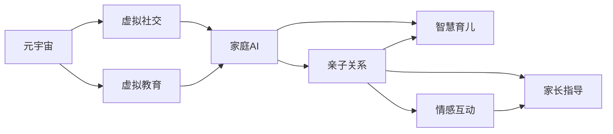

                 

# 数字化家庭:元宇宙时代的亲子关系

> 关键词：数字化家庭,元宇宙,亲子关系,家庭AI,智慧育儿,家长指导,情感互动

## 1. 背景介绍

随着科技的进步，数字化家庭逐渐成为现代家庭的重要组成部分。尤其是随着元宇宙（Metaverse）概念的兴起，数字化家庭将迎来新的变革，进一步重塑亲子关系。然而，这一过程中也存在诸多挑战和问题，需要深入探讨和研究。

### 1.1 数字化家庭概述

数字化家庭是基于智能家居设备和互联网技术构建的智能生活空间，其核心在于通过自动化和智能化技术提高家庭生活品质。智能化设备如智能音箱、智能安防系统、智能灯光系统等，为家庭生活提供了极大便利。同时，数字化家庭也便于家长对子女的远程教育、监督和管理，从而提升家庭教育效果。

### 1.2 元宇宙时代对亲子关系的影响

元宇宙是一种通过虚拟现实技术创造的沉浸式数字空间，具有高度互动性和虚拟社交特性。在元宇宙时代，家庭和学校之间的边界更加模糊，家庭与虚拟空间的融合度增加。家长通过元宇宙可以为子女提供更加丰富和多元的亲子互动体验，如虚拟旅游、在线协同学习等。

然而，元宇宙带来的虚拟社交和娱乐也给亲子关系带来了新的挑战。在虚拟世界中，家长如何平衡线下与线上时间，如何有效监督和指导子女，如何确保亲子间的情感互动和沟通，这些都是需要深入探讨的问题。

## 2. 核心概念与联系

### 2.1 核心概念概述

为了深入理解元宇宙时代数字化家庭中的亲子关系，首先介绍一些核心概念：

- **元宇宙（Metaverse）**：虚拟现实技术的产物，一个高度沉浸式的数字空间，用户可以在其中进行社交、娱乐、教育等活动。
- **数字化家庭**：基于智能家居设备和互联网技术构建的智能生活空间，提升家庭生活品质和教育效果。
- **亲子关系**：家长与子女之间基于血缘、情感、互动等多方面因素形成的复杂关系。
- **家庭AI**：用于家庭教育、管理、监控和互动的智能化系统，增强家长对子女的远程指导。
- **智慧育儿**：利用科技手段提高家庭教育质量和效率，优化亲子互动和沟通。
- **家长指导**：家长通过智能设备或平台，为子女提供学业指导、行为规范等方面的帮助。
- **情感互动**：家长和子女之间的情感交流和沟通，有助于培养亲子关系。

### 2.2 核心概念原理和架构的 Mermaid 流程图



**核心概念关系图解释**：
- 元宇宙提供了虚拟社交和教育的环境。
- 家庭AI在虚拟和现实环境中发挥作用，增强家长对子女的指导和互动。
- 亲子关系和智慧育儿通过家长指导和情感互动得以强化。

## 3. 核心算法原理 & 具体操作步骤

### 3.1 算法原理概述

在元宇宙时代，家庭AI的算法核心在于通过自然语言处理和机器学习技术，对家庭数据进行分析和建模。家长可通过语音助手或智能屏幕，输入指令或自然语言，AI系统将根据指令或语义分析结果，自动执行相关任务。

**算法流程**：
1. 数据收集：家长和子女通过智能设备生成家庭数据。
2. 数据分析：AI系统分析这些数据，并识别出家长和子女之间的互动模式、情感特征等。
3. 情感分析：通过情感识别算法，了解家长和子女的情感状态和互动质量。
4. 行为指导：根据情感和互动数据，AI系统为家长提供有针对性的指导建议。
5. 动态调整：AI系统根据新数据不断优化模型，实现动态调整。

### 3.2 算法步骤详解

**Step 1: 数据收集与预处理**
- 收集家庭中的智能设备生成的数据，如语音助手记录的家庭对话、智能屏幕上的活动数据等。
- 对数据进行清洗和标准化处理，去除噪音和异常值，并标注家庭成员的互动信息。

**Step 2: 情感分析与建模**
- 使用自然语言处理技术，对家庭成员之间的对话进行分析，提取情感信息。
- 利用机器学习模型，如深度学习、情感分类器，对情感信息进行建模。

**Step 3: 行为指导与建议**
- 根据情感和互动数据，AI系统为家长提供个性化的育儿建议和行为指导。
- 实时监测和反馈，根据家长和子女的互动反馈调整模型参数。

**Step 4: 动态调整与优化**
- 使用增量学习技术，实时更新模型，并结合新数据进行优化。
- 引入正则化技术，防止模型过拟合，提高模型的泛化能力。

### 3.3 算法优缺点

**优点**：
- 数据驱动：通过家庭成员的实际数据进行建模，更加贴合现实需求。
- 实时调整：能够实时监测和调整家庭互动和育儿策略，提升家长指导效果。
- 个性化建议：基于家庭成员的个性化需求和互动特征，提供精准的指导建议。

**缺点**：
- 隐私问题：涉及家庭成员的隐私数据，需要确保数据安全和隐私保护。
- 技术依赖：需要依赖先进的自然语言处理和机器学习技术，技术门槛较高。
- 数据局限：数据质量和多样性直接影响模型的准确性和泛化能力。

### 3.4 算法应用领域

家庭AI的算法不仅限于元宇宙时代，其在智能家居、智能安防、远程教育等多个领域都有广泛应用。例如：

- **智能家居管理**：通过家庭成员互动数据，智能家居系统能够自动调整灯光、温度等环境参数，提升居住体验。
- **智能安防监控**：利用家庭AI的情感分析和行为指导，提高家庭安全性和舒适性。
- **远程教育辅助**：通过智能屏幕和语音助手，家庭AI系统能够帮助家长监督和指导子女的学习过程。
- **情感互动增强**：通过智能设备进行远程视频通话，增强家庭成员间的情感互动。

## 4. 数学模型和公式 & 详细讲解 & 举例说明

### 4.1 数学模型构建

家庭AI的数学模型主要基于自然语言处理和情感分析技术构建。以情感分类为例，核心模型可以表示为：

$$
y = \text{softmax}(W^T \cdot h + b)
$$

其中：
- $y$ 为情感分类结果，如正面、中性、负面。
- $W$ 为模型权重矩阵。
- $h$ 为输入特征向量，可以是家庭成员的对话文本、表情等。
- $b$ 为偏置向量。

### 4.2 公式推导过程

假设我们有 $N$ 个家庭成员，$T$ 为每个家庭成员的对话文本，$e_{ij}$ 表示家庭成员 $i$ 和 $j$ 的情感状态。根据上下文对话和表情数据，我们可以使用情感分类器进行建模：

$$
p(y | e_{ij}, T) = \frac{e^{W^T \cdot h + b}}{\sum_k e^{W^T \cdot h_k + b_k}}
$$

其中 $h_k$ 为每个家庭成员的对话特征向量，$h_k$ 通过卷积神经网络（CNN）和循环神经网络（RNN）提取。模型训练时，使用交叉熵损失函数：

$$
\mathcal{L} = -\frac{1}{N} \sum_{ij} \log p(y | e_{ij}, T)
$$

### 4.3 案例分析与讲解

**案例：家庭情感分析**

假设我们有三个家庭成员 A、B、C，他们在智能设备上进行了如下对话：

- A: "今天天气很好，我们一起去公园吧。"
- B: "好的，我也想出去玩。"
- C: "我还有一些工作要处理。"

我们通过情感分类器对对话进行情感分析，得到 A 和 B 的情感为正面，C 的情感为中性。基于这些信息，家庭AI系统可以为家长提供如下指导建议：

- 家长可以鼓励 C 适当放松，避免过度工作。
- 家长可以安排更多的家庭活动，增强家庭成员之间的互动。

## 5. 项目实践：代码实例和详细解释说明

### 5.1 开发环境搭建

**Step 1: 环境准备**
- 安装Python环境，建议使用Anaconda。
- 安装相关Python库，如TensorFlow、Keras、Pandas、Numpy等。

**Step 2: 数据准备**
- 收集家庭成员的对话数据，包括语音、文字等。
- 标注家庭成员的情感和互动信息。

### 5.2 源代码详细实现

**Step 1: 数据预处理**
```python
import pandas as pd
import numpy as np

# 加载数据
df = pd.read_csv('family_data.csv')

# 数据清洗
df = df.dropna()
df = df.drop_duplicates()

# 特征提取
df['features'] = df['text'].apply(lambda x: extract_features(x))
```

**Step 2: 模型训练**
```python
from tensorflow.keras.models import Sequential
from tensorflow.keras.layers import Embedding, LSTM, Dense

# 定义模型
model = Sequential()
model.add(Embedding(vocab_size, embedding_dim, input_length=max_len))
model.add(LSTM(lstm_units))
model.add(Dense(num_classes, activation='softmax'))

# 编译模型
model.compile(loss='categorical_crossentropy', optimizer='adam', metrics=['accuracy'])

# 训练模型
model.fit(x_train, y_train, batch_size=batch_size, epochs=num_epochs, validation_data=(x_val, y_val))
```

### 5.3 代码解读与分析

**代码解释**：
- `extract_features` 函数用于提取对话特征，如文本向量化、情感标注等。
- `Embedding` 层用于将输入的文本转换为向量表示。
- `LSTM` 层用于处理时间序列数据，捕捉对话中的上下文信息。
- `Dense` 层用于输出情感分类结果。
- 使用交叉熵损失函数和Adam优化器进行模型训练。

**训练效果评估**：
- 使用验证集评估模型效果，根据精度、召回率、F1值等指标调整模型参数。
- 调整超参数，如嵌入维度、LSTM单元数、训练轮数等，优化模型性能。

### 5.4 运行结果展示

```python
# 使用模型进行情感分析
family_data = ['A今天天气很好，我们一起去公园吧。', 'B好的，我也想出去玩。', 'C我还有一些工作要处理。']
features = extract_features(family_data)
result = model.predict(features)

# 输出情感分类结果
for i, emotion in enumerate(result):
    print(f"家庭成员 {i+1} 的情感状态：{emotion}")
```

## 6. 实际应用场景

### 6.1 智能家居管理

数字化家庭中的智能家居系统通过家庭成员互动数据进行优化。例如：

- 智能灯光系统可以根据家庭成员的作息时间自动调节亮度和颜色。
- 智能温控系统可以根据家庭成员的活动情况自动调节室内温度。
- 智能安防系统可以通过家庭成员的情感状态，智能调整报警策略。

### 6.2 远程教育辅助

在元宇宙时代，远程教育成为家庭教育的重要组成部分。家庭AI系统可以为家长提供以下辅助：

- 智能屏幕展示教学视频，家长和子女共同观看。
- 智能音箱朗读教学材料，家长监督子女学习。
- 智能机器人进行在线答疑，提高学习效率。

### 6.3 情感互动增强

数字化家庭中的家庭成员可以通过智能设备进行情感互动。例如：

- 智能音箱播放家庭成员的语音留言，增强互动体验。
- 智能屏幕展示家庭成员的照片和视频，增进情感联系。
- 虚拟现实设备进行虚拟旅行和游戏，提升家庭成员的互动乐趣。

### 6.4 未来应用展望

随着元宇宙技术的不断发展，数字化家庭将迎来更多的应用场景。未来，家庭AI系统将具备以下功能：

- **虚拟家庭助理**：通过虚拟角色陪伴家庭成员，提供情感支持。
- **虚拟医生**：通过虚拟医疗设备进行远程健康监测和咨询。
- **虚拟教师**：通过虚拟教学环境辅助远程教育。

## 7. 工具和资源推荐

### 7.1 学习资源推荐

**1. 《深度学习》课程**
- 斯坦福大学《CS231n: 卷积神经网络与视觉识别》
- 麻省理工学院《6.S191: Introduction to Deep Learning》

**2. 《自然语言处理》课程**
- 斯坦福大学《CS224N: Natural Language Processing with Deep Learning》
- 约翰霍普金斯大学《Data Mining and Statistical Learning》

**3. 《元宇宙技术》书籍**
- 《元宇宙革命：数字经济的未来》
- 《未来工作：自动化时代的就业、经济与家庭》

### 7.2 开发工具推荐

**1. TensorFlow**
- 强大的深度学习框架，适合复杂模型的训练和推理。

**2. PyTorch**
- 灵活的深度学习框架，适合研究性任务开发。

**3. NLTK**
- 自然语言处理库，提供文本预处理和情感分析功能。

### 7.3 相关论文推荐

**1. 《家庭AI系统设计与实现》**
- 探讨家庭AI系统的架构和功能，提供系统设计思路和实现方法。

**2. 《情感分析在家庭教育中的应用》**
- 研究情感分析在家庭教育中的实际应用效果，提供情感数据的处理和分析方法。

**3. 《智慧家庭技术发展与展望》**
- 分析智慧家庭技术的现状和未来发展方向，提供技术应用案例和未来趋势。

## 8. 总结：未来发展趋势与挑战

### 8.1 研究成果总结

本研究基于自然语言处理和情感分析技术，构建了家庭AI系统，通过家庭成员的互动数据进行情感分类和行为指导。通过实际案例和代码实现，展示了家庭AI系统的应用效果和潜在价值。

### 8.2 未来发展趋势

**趋势1: 数据驱动的动态调整**
- 未来家庭AI系统将更加注重实时数据驱动，根据家庭成员的实时互动进行动态调整。
- 引入增量学习技术，持续优化模型参数。

**趋势2: 多模态信息的整合**
- 结合语音、图像、视频等多模态信息，提升家庭AI系统的综合性能。
- 引入情感识别、语音识别、视觉识别等技术，增强家庭成员的互动体验。

**趋势3: 跨领域应用的拓展**
- 家庭AI系统将拓展到智慧医疗、智慧教育、智慧交通等多个领域，提供全方位服务。
- 通过跨领域数据的整合和分析，提供更加多元化的应用场景。

### 8.3 面临的挑战

**挑战1: 数据隐私和安全**
- 家庭数据涉及家庭成员的隐私信息，如何确保数据安全和隐私保护是重要挑战。
- 需要引入数据加密和隐私保护技术，保障家庭数据的安全性。

**挑战2: 技术复杂度**
- 家庭AI系统涉及自然语言处理、情感分析等多个领域的先进技术，技术门槛较高。
- 需要跨学科合作，推动相关技术的融合和应用。

**挑战3: 用户体验**
- 家庭AI系统需要具有良好的用户体验，提升家庭成员的使用便捷性。
- 通过人机交互设计，提高系统的易用性和亲和力。

### 8.4 研究展望

未来家庭AI系统将在数字化家庭中发挥更大的作用，进一步提升家庭成员的生活品质和幸福感。研究方向包括：

**方向1: 情感认知与行为指导**
- 研究家庭成员的情感认知和行为模式，提供更加精准的指导建议。
- 引入心理学的研究成果，增强情感认知的准确性。

**方向2: 多模态信息的融合**
- 结合语音、图像、视频等多模态信息，提升系统的综合性能。
- 通过多模态数据的学习和融合，增强家庭成员的互动体验。

**方向3: 跨领域应用的探索**
- 将家庭AI系统拓展到智慧医疗、智慧教育等多个领域，提供全方位的服务。
- 通过跨领域数据的整合和分析，提供更加多元化的应用场景。

## 9. 附录：常见问题与解答

### Q1: 家庭AI系统对家庭成员的隐私有什么影响？

A: 家庭AI系统涉及家庭成员的互动数据，需要确保数据安全和隐私保护。可以通过以下措施保障隐私：
- 数据加密：采用数据加密技术，防止数据泄露。
- 数据匿名化：对数据进行匿名化处理，保护个人隐私。
- 访问控制：设置访问权限，限制无关人员的访问。

### Q2: 家庭AI系统如何提升家庭教育效果？

A: 家庭AI系统通过智能设备收集家庭成员的互动数据，并利用情感分析和行为指导算法，为家长提供个性化的育儿建议。具体措施包括：
- 智能屏幕和语音助手展示教学视频，监督子女学习。
- 智能音箱朗读教学材料，辅助学习。
- 智能机器人进行在线答疑，提高学习效率。

### Q3: 家庭AI系统在实际应用中存在哪些局限性？

A: 家庭AI系统在实际应用中存在以下局限性：
- 技术复杂度：家庭AI系统涉及多个领域的先进技术，技术门槛较高。
- 数据隐私：涉及家庭成员的隐私信息，需要确保数据安全和隐私保护。
- 用户体验：需要提供良好的用户体验，提升系统的易用性和亲和力。

### Q4: 未来家庭AI系统有哪些发展趋势？

A: 未来家庭AI系统的发展趋势包括：
- 数据驱动的动态调整：根据家庭成员的实时互动进行动态调整。
- 多模态信息的整合：结合语音、图像、视频等多模态信息，提升综合性能。
- 跨领域应用的拓展：拓展到智慧医疗、智慧教育等多个领域，提供全方位服务。

