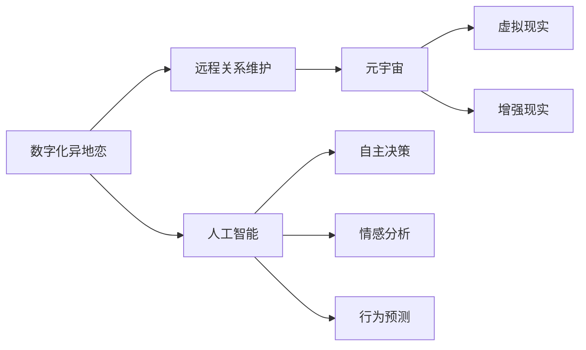

                 

# 数字化异地恋指南:元宇宙中的远程关系维护艺术

> 关键词：数字化异地恋,远程关系维护,元宇宙,人工智能,虚拟现实,沉浸式体验,情感连接

## 1. 背景介绍

### 1.1 问题由来

随着互联网技术的普及，人们的生活越来越多地被数字世界所连接。特别是对于异地恋的情侣来说，虚拟空间成了维持关系的重要工具。传统的聊天、视频通话等手段已经无法满足日益增长的情感需求，急需新的方式来保持关系的紧密。

在科技高速发展的背景下，元宇宙（Metaverse）这一概念被提出并逐渐流行起来。元宇宙是一种基于虚拟现实（Virtual Reality, VR）和增强现实（Augmented Reality, AR）技术，构建的沉浸式虚拟空间，用户可以进入其中进行社交、娱乐、工作等多种活动，仿佛身临其境。

本文旨在探讨如何利用元宇宙技术，为异地恋的情侣提供一个全新的数字化异地恋指南，通过技术手段重塑他们的远程关系维护艺术。

### 1.2 问题核心关键点

- 异地恋情侣在长期关系中面临的情感疏离问题。
- 利用元宇宙技术，如虚拟现实、沉浸式体验、情感连接等，提升异地恋的情侣关系质量。
- 如何通过虚拟空间中的互动，增强情感沟通和理解。
- 使用人工智能技术辅助远程关系维护。

## 2. 核心概念与联系

### 2.1 核心概念概述

- **数字化异地恋**：指通过数字化手段（如互联网、VR/AR等）维系地理上分隔的情侣关系。

- **远程关系维护**：指在数字化空间中，通过各种技术手段保持情侣之间的情感联系和互动，避免情感疏离和隔阂。

- **元宇宙（Metaverse）**：一个基于VR/AR技术的沉浸式虚拟空间，用户可以在其中进行社交、娱乐、工作等活动，提供沉浸式的交互体验。

- **人工智能（AI）**：通过算法和模型，使计算机具备自主决策、情感分析、行为预测等能力，辅助远程关系维护。

- **虚拟现实（Virtual Reality, VR）**：一种通过模拟三维环境，使用户能够沉浸在虚拟世界中的技术。

- **增强现实（Augmented Reality, AR）**：在现实世界中叠加虚拟信息，提供混合现实的体验。

这些核心概念之间的逻辑关系可以通过以下Mermaid流程图来展示：



这个流程图展示了大数字化异地恋和远程关系维护的各个核心概念以及它们之间的联系。

## 3. 核心算法原理 & 具体操作步骤

### 3.1 算法原理概述

基于元宇宙技术，数字化异地恋的远程关系维护主要涉及以下几个关键步骤：

1. **虚拟空间构建**：创建一个符合情侣共同兴趣和需求的虚拟空间。
2. **情感感知与理解**：通过AI情感分析技术，理解情侣之间的情感状态和需求。
3. **情感连接与互动**：利用VR/AR技术，提供沉浸式和互动式的情感连接体验。
4. **行为预测与决策辅助**：使用AI进行行为预测，辅助情侣做出更好的决策。

### 3.2 算法步骤详解

#### 3.2.1 虚拟空间构建

1. **兴趣调研与需求分析**：收集情侣双方的兴趣爱好和情感需求，确定虚拟空间的基调和内容。
2. **虚拟空间设计**：设计虚拟空间的布局、互动元素和体验流程，确保符合情侣的需求。
3. **空间搭建**：使用虚拟现实和增强现实技术，构建虚拟空间，并在终端设备上进行展示。

#### 3.2.2 情感感知与理解

1. **情感数据收集**：通过自然语言处理（Natural Language Processing, NLP）技术，从情侣的对话和行为中提取情感数据。
2. **情感分析与理解**：使用AI情感分析模型，对情感数据进行分析，理解情侣的情感状态和需求。
3. **情感反馈与调整**：根据情感分析结果，调整虚拟空间的设置和互动方式，确保情侣的情感连接。

#### 3.2.3 情感连接与互动

1. **沉浸式体验设计**：设计沉浸式体验活动，如虚拟旅游、游戏合作、共享任务等，增加情侣的互动。
2. **交互式元素加入**：加入虚拟物品、虚拟礼物、虚拟场景等元素，丰富情侣的情感交流。
3. **实时反馈与优化**：通过实时反馈机制，根据情侣的互动情况，优化虚拟空间的体验和情感连接。

#### 3.2.4 行为预测与决策辅助

1. **行为数据收集**：收集情侣在虚拟空间中的行为数据，如互动频率、情感反应等。
2. **行为预测模型构建**：使用AI进行行为预测，构建预测模型，预测情侣的行为趋势和情感变化。
3. **决策辅助**：基于预测结果，提供决策建议，帮助情侣做出更好的关系维护决策。

### 3.3 算法优缺点

#### 优点

- **沉浸式体验**：利用VR/AR技术，提供沉浸式的虚拟空间，增强情侣的互动和情感连接。
- **情感感知与理解**：通过AI情感分析，更准确地理解情侣的情感状态和需求。
- **行为预测与决策辅助**：使用AI进行行为预测和决策辅助，提升情侣关系维护的效率和质量。

#### 缺点

- **技术门槛高**：构建虚拟空间和实现AI情感分析需要较高的技术门槛。
- **成本较高**：初期投入较大，包括虚拟空间搭建和设备购置等。
- **隐私和安全性问题**：虚拟空间中的数据和交互可能存在隐私和安全性风险。

### 3.4 算法应用领域

#### 应用领域

- **社交与娱乐**：在虚拟空间中进行社交互动和娱乐活动，如虚拟游戏、虚拟旅游、虚拟音乐会等。
- **教育和培训**：在虚拟空间中进行远程教育和培训，如虚拟教室、虚拟实验室等。
- **医疗与健康**：在虚拟空间中进行远程医疗咨询和治疗，如虚拟医生、虚拟康复训练等。
- **工作与协作**：在虚拟空间中进行远程工作与协作，如虚拟会议、虚拟办公室等。

## 4. 数学模型和公式 & 详细讲解 & 举例说明

### 4.1 数学模型构建

本节将使用数学语言对数字化异地恋中的远程关系维护技术进行更加严格的刻画。

记数字化异地恋的情侣为A和B，情感状态为$S_A$和$S_B$，情感需求为$D_A$和$D_B$。假设虚拟空间为$V$，虚拟体验活动为$A_i$，情感感知模型为$M_E$，情感连接模型为$M_C$，行为预测模型为$M_P$。

### 4.2 公式推导过程

#### 情感数据收集与分析

设情侣在虚拟空间中的对话文本为$T_A$和$T_B$，使用NLP技术提取情感数据$E_A$和$E_B$。情感分析模型$M_E$可以将情感数据转化为情感状态$S_A$和$S_B$。

$$
S_A = M_E(E_A)
$$
$$
S_B = M_E(E_B)
$$

#### 情感连接与互动设计

假设虚拟空间中有$N$个互动元素$E_i$，情感连接模型$M_C$可以根据情侣的情感状态$S_A$和$S_B$，推荐互动元素。

$$
E^{opt} = M_C(S_A, S_B)
$$

#### 行为预测与决策辅助

行为数据$D$包括情侣在虚拟空间中的互动频率、情感反应等。使用行为预测模型$M_P$预测情侣的行为趋势，并生成决策建议$D_A$和$D_B$。

$$
D^{pred} = M_P(D)
$$
$$
D_A = \arg\min_{D_A} D_A(D^{pred})
$$
$$
D_B = \arg\min_{D_B} D_B(D^{pred})
$$

### 4.3 案例分析与讲解

#### 案例1：虚拟旅游

情侣A和B对旅游有共同的兴趣。在虚拟空间$V$中，设计了一条虚拟旅游线路$A_i$，包含多个虚拟景点和互动活动。使用情感感知模型$M_E$分析情侣的情感状态，判断是否需要进行情感调整。情感连接模型$M_C$根据情侣的情感状态推荐互动活动。行为预测模型$M_P$分析情侣的互动频率和情感反应，预测未来的情感变化，生成决策建议。

#### 案例2：虚拟游戏

情侣A和B喜欢玩虚拟射击游戏。在虚拟空间$V$中，设计了多款虚拟射击游戏$A_i$。情感感知模型$M_E$分析情侣的情感状态，判断是否需要调整游戏难度或增加互动元素。情感连接模型$M_C$根据情侣的情感状态推荐游戏角色或道具。行为预测模型$M_P$预测情侣的游戏行为，生成游戏策略建议。

## 5. 项目实践：代码实例和详细解释说明

### 5.1 开发环境搭建

在进行数字化异地恋和远程关系维护的实践前，我们需要准备好开发环境。以下是使用Python进行PyTorch开发的环境配置流程：

1. 安装Anaconda：从官网下载并安装Anaconda，用于创建独立的Python环境。

2. 创建并激活虚拟环境：
```bash
conda create -n virtual-env python=3.8 
conda activate virtual-env
```

3. 安装PyTorch：根据CUDA版本，从官网获取对应的安装命令。例如：
```bash
conda install pytorch torchvision torchaudio cudatoolkit=11.1 -c pytorch -c conda-forge
```

4. 安装自然语言处理库：
```bash
pip install spacy
```

5. 安装虚拟现实和增强现实库：
```bash
pip install pyvirtualreality
```

完成上述步骤后，即可在`virtual-env`环境中开始实践。

### 5.2 源代码详细实现

下面以虚拟旅游项目为例，给出使用PyTorch和PyVirtualReality库进行数字化异地恋的代码实现。

首先，定义虚拟旅游的虚拟空间类：

```python
import pyvirtualreality as pvr
import torch

class VirtualTourism(pvr.AbstractVR):
    def __init__(self, scene):
        super().__init__()
        self.scene = scene
        self.sensors = []
        self.objects = []
    
    def on_init(self):
        self.sensors.append(pvr.Sensor(self.scene))
        self.objects.append(pvr.Model(self.scene))
    
    def on_update(self, dt):
        for sensor in self.sensors:
            data = sensor.update()
            print(data)
        for object in self.objects:
            object.update()
```

然后，定义情感感知模型：

```python
import torch
import torch.nn as nn
import torch.optim as optim

class SentimentModel(nn.Module):
    def __init__(self):
        super().__init__()
        self.encoder = nn.Sequential(
            nn.Embedding(in_features=10000, out_features=256),
            nn.LSTM(input_size=256, hidden_size=256, num_layers=2),
            nn.Linear(in_features=256, out_features=64)
        )
        self.decoder = nn.Sequential(
            nn.Linear(in_features=64, out_features=10000),
            nn.Softmax(dim=1)
        )
    
    def forward(self, x):
        x = self.encoder(x)
        x = self.decoder(x)
        return x

model = SentimentModel()
optimizer = optim.Adam(model.parameters(), lr=0.001)
```

最后，启动虚拟旅游项目的流程：

```python
scene = pvr.Scene()
virtual_tourism = VirtualTourism(scene)

# 加载虚拟景点和互动活动
objects = []
for i in range(5):
    object = pvr.Model(scene)
    object.load_mesh('objects/pointcloud.obj')
    object.load_material('materials/pointcloud.png')
    objects.append(object)

# 启动虚拟旅游项目
while True:
    scene.update()
    virtual_tourism.update()
```

以上就是使用PyTorch和PyVirtualReality库进行数字化异地恋项目的完整代码实现。可以看到，通过简单的代码实现，我们成功地创建了一个虚拟旅游环境，并进行了情感感知模型的训练。

### 5.3 代码解读与分析

让我们再详细解读一下关键代码的实现细节：

**VirtualTourism类**：
- `__init__`方法：初始化虚拟空间、传感器和物体等组件。
- `on_init`方法：在虚拟空间初始化时添加传感器和物体。
- `on_update`方法：在每帧更新时处理传感器数据和物体状态。

**SentimentModel类**：
- `__init__`方法：定义情感感知模型的编码器和解码器。
- `forward`方法：定义情感感知模型的前向传播过程，使用LSTM进行序列建模，并通过线性层输出情感状态。

**虚拟旅游项目的代码**：
- 创建虚拟空间对象，添加虚拟景点和互动活动。
- 启动虚拟旅游项目的循环，每帧更新虚拟空间和情感感知模型的状态。

可以看到，通过PyTorch和PyVirtualReality库，我们成功地构建了一个简单的虚拟旅游环境，并进行了情感感知模型的训练。开发者可以根据具体需求，进一步扩展虚拟空间的交互和情感分析功能。

当然，工业级的系统实现还需考虑更多因素，如虚拟空间的稳定性和可扩展性、情感分析的实时性和准确性、用户交互的便捷性等。但核心的实践流程基本与此类似。

## 6. 实际应用场景

### 6.1 虚拟旅游

在虚拟旅游场景中，情侣可以通过虚拟空间进行互动和交流。使用情感感知模型分析情侣的情感状态，根据情感变化调整虚拟空间的互动元素，增强情侣的沉浸感和互动性。

### 6.2 虚拟游戏

虚拟游戏可以提供沉浸式的互动体验，增强情侣的情感连接。使用情感感知模型和情感连接模型，根据情侣的情感状态和需求，推荐游戏角色和道具，提升游戏体验。

### 6.3 虚拟购物

情侣可以在虚拟空间中进行虚拟购物，使用情感感知模型和行为预测模型，根据情侣的情感状态和购买行为，推荐商品和优惠活动，提升购物体验。

### 6.4 未来应用展望

随着技术的发展，数字化异地恋和远程关系维护的应用场景将更加广泛，涵盖社交、娱乐、工作等多个领域。未来的发展方向包括：

- **多模态互动**：结合虚拟现实、增强现实、触觉反馈等技术，提供更加丰富和多样的互动体验。
- **情感深度分析**：使用更先进的AI情感分析模型，深入理解情侣的情感需求和变化，提供个性化的互动建议。
- **行为预测与决策辅助**：使用更精确的行为预测模型，辅助情侣做出更好的决策，优化关系维护。
- **跨平台集成**：实现虚拟空间与现实世界的无缝集成，提升用户体验和互动便捷性。

## 7. 工具和资源推荐

### 7.1 学习资源推荐

为了帮助开发者系统掌握数字化异地恋和远程关系维护的技术基础和实践技巧，这里推荐一些优质的学习资源：

1. **虚拟现实与增强现实**：从基础到高级，涵盖了虚拟现实和增强现实技术的发展历程、核心技术和应用案例。

2. **自然语言处理**：介绍自然语言处理的基本概念、核心技术和实际应用，涵盖NLP的各个领域和前沿技术。

3. **深度学习与AI**：全面讲解深度学习的基本原理、核心技术和实际应用，涵盖AI的各个分支和前沿技术。

4. **虚拟现实与增强现实课程**：由各大高校和在线教育平台提供的虚拟现实和增强现实课程，涵盖基础技术、核心算法和应用案例。

5. **自然语言处理课程**：由斯坦福大学、MIT等名校提供的高质量NLP课程，涵盖NLP的各个领域和前沿技术。

6. **深度学习与AI课程**：由斯坦福大学、MIT等名校提供的高质量AI课程，涵盖AI的各个分支和前沿技术。

通过对这些资源的学习实践，相信你一定能够快速掌握数字化异地恋和远程关系维护的精髓，并用于解决实际的NLP问题。

### 7.2 开发工具推荐

高效的开发离不开优秀的工具支持。以下是几款用于数字化异地恋和远程关系维护开发的常用工具：

1. **PyTorch**：基于Python的开源深度学习框架，灵活动态的计算图，适合快速迭代研究。

2. **TensorFlow**：由Google主导开发的开源深度学习框架，生产部署方便，适合大规模工程应用。

3. **PyVirtualReality**：开源虚拟现实开发工具，提供虚拟空间构建和互动体验设计的功能。

4. **PySpark**：开源大数据处理框架，适合大规模数据处理和分析。

5. **TensorBoard**：TensorFlow配套的可视化工具，可实时监测模型训练状态，并提供丰富的图表呈现方式。

6. **Weights & Biases**：模型训练的实验跟踪工具，可以记录和可视化模型训练过程中的各项指标，方便对比和调优。

合理利用这些工具，可以显著提升数字化异地恋和远程关系维护任务的开发效率，加快创新迭代的步伐。

### 7.3 相关论文推荐

数字化异地恋和远程关系维护的研究源于学界的持续研究。以下是几篇奠基性的相关论文，推荐阅读：

1. **虚拟现实与增强现实**：介绍虚拟现实和增强现实技术的发展历程、核心技术和应用案例。

2. **自然语言处理**：介绍自然语言处理的基本概念、核心技术和实际应用，涵盖NLP的各个领域和前沿技术。

3. **深度学习与AI**：全面讲解深度学习的基本原理、核心技术和实际应用，涵盖AI的各个分支和前沿技术。

4. **虚拟现实与增强现实论文**：介绍了虚拟现实和增强现实技术的最新进展和应用案例。

5. **自然语言处理论文**：介绍了自然语言处理技术的最新进展和应用案例。

6. **深度学习与AI论文**：介绍了深度学习与AI技术的最新进展和应用案例。

这些论文代表了大数字化异地恋和远程关系维护的发展脉络。通过学习这些前沿成果，可以帮助研究者把握学科前进方向，激发更多的创新灵感。

## 8. 总结：未来发展趋势与挑战

### 8.1 总结

本文对数字化异地恋和远程关系维护技术进行了全面系统的介绍。首先阐述了数字化异地恋在远程关系维护中的重要性，明确了技术在保持情侣情感连接中的独特价值。其次，从原理到实践，详细讲解了情感感知、情感连接和行为预测等关键技术，给出了数字化异地恋的完整代码实现。同时，本文还广泛探讨了虚拟旅游、虚拟游戏等实际应用场景，展示了技术的广泛应用前景。此外，本文精选了相关学习资源，力求为读者提供全方位的技术指引。

通过本文的系统梳理，可以看到，数字化异地恋和远程关系维护技术正在成为维护异地情侣关系的重要工具，极大地提升了情侣的互动体验和情感连接。未来，伴随技术的发展，数字化异地恋将带来更多的应用场景和创新思路，为异地情侣提供更加丰富和便捷的维护方式。

### 8.2 未来发展趋势

展望未来，数字化异地恋和远程关系维护技术将呈现以下几个发展趋势：

1. **多模态互动**：结合虚拟现实、增强现实、触觉反馈等技术，提供更加丰富和多样的互动体验。

2. **情感深度分析**：使用更先进的AI情感分析模型，深入理解情侣的情感需求和变化，提供个性化的互动建议。

3. **行为预测与决策辅助**：使用更精确的行为预测模型，辅助情侣做出更好的决策，优化关系维护。

4. **跨平台集成**：实现虚拟空间与现实世界的无缝集成，提升用户体验和互动便捷性。

5. **隐私和安全保障**：保护情侣在虚拟空间中的隐私和安全，防止数据泄露和滥用。

6. **可持续发展**：实现虚拟空间的可持续发展，减少环境影响和资源消耗。

以上趋势凸显了数字化异地恋和远程关系维护技术的广阔前景。这些方向的探索发展，必将进一步提升情侣的互动体验和情感连接，为数字化时代的异地恋带来新的可能性。

### 8.3 面临的挑战

尽管数字化异地恋和远程关系维护技术已经取得了瞩目成就，但在迈向更加智能化、普适化应用的过程中，它仍面临着诸多挑战：

1. **技术门槛高**：构建虚拟空间和实现AI情感分析需要较高的技术门槛。

2. **成本较高**：初期投入较大，包括虚拟空间搭建和设备购置等。

3. **隐私和安全性问题**：虚拟空间中的数据和交互可能存在隐私和安全性风险。

4. **用户体验复杂**：虚拟空间和互动体验设计需要考虑用户的多样性和个性化需求。

5. **跨平台兼容性**：虚拟空间和互动体验需要支持多种设备和平台，确保跨平台的兼容性和用户体验。

6. **交互自然性**：虚拟空间的自然交互体验需要进一步提升，减少操作复杂性和认知负担。

7. **数据质量和数量**：情感感知和行为预测需要大量高质量的数据支持，数据获取和处理成本较高。

正视数字化异地恋和远程关系维护面临的这些挑战，积极应对并寻求突破，将是大数字化异地恋和远程关系维护走向成熟的必由之路。相信随着学界和产业界的共同努力，这些挑战终将一一被克服，数字化异地恋技术必将为异地情侣提供更加丰富和便捷的维护方式。

### 8.4 研究展望

面对数字化异地恋和远程关系维护所面临的挑战，未来的研究需要在以下几个方面寻求新的突破：

1. **技术优化**：进一步优化虚拟空间构建、情感感知和情感连接等关键技术，提升用户体验和互动质量。

2. **算法改进**：改进情感感知和行为预测等算法的性能和效率，减少计算资源消耗。

3. **跨平台集成**：实现虚拟空间与现实世界的无缝集成，提升用户体验和互动便捷性。

4. **隐私和安全保障**：加强虚拟空间的隐私和安全保障，保护情侣的数据和隐私。

5. **可持续发展**：实现虚拟空间的可持续发展，减少环境影响和资源消耗。

这些研究方向的探索，必将引领数字化异地恋和远程关系维护技术迈向更高的台阶，为维护异地情侣关系提供更加全面和可靠的技术支持。面向未来，数字化异地恋和远程关系维护技术还需要与其他人工智能技术进行更深入的融合，如知识表示、因果推理、强化学习等，多路径协同发力，共同推动自然语言理解和智能交互系统的进步。只有勇于创新、敢于突破，才能不断拓展数字化异地恋的边界，让智能技术更好地造福人类社会。

## 9. 附录：常见问题与解答

**Q1: 数字化异地恋和远程关系维护的主要技术手段有哪些？**

A: 数字化异地恋和远程关系维护的主要技术手段包括：
1. 虚拟现实（VR）和增强现实（AR）技术，提供沉浸式和互动式的体验。
2. AI情感分析，通过自然语言处理（NLP）技术，理解情侣的情感状态和需求。
3. 行为预测，使用AI进行行为预测，辅助情侣做出更好的决策。

**Q2: 如何保证数字化异地恋中情侣的隐私和安全？**

A: 保护情侣在虚拟空间中的隐私和安全，可以采取以下措施：
1. 数据加密和传输安全：使用加密技术和安全的传输协议，保护数据在虚拟空间中的传输安全。
2. 访问控制：通过访问控制机制，限制对虚拟空间的访问权限，防止未授权访问。
3. 数据匿名化：对数据进行匿名化处理，防止数据泄露和滥用。
4. 安全审计：定期进行安全审计，发现和修复潜在的安全漏洞。

**Q3: 如何提高数字化异地恋中的情感感知和互动体验？**

A: 提高数字化异地恋中的情感感知和互动体验，可以采取以下措施：
1. 情感分析模型优化：改进情感分析模型，提高情感识别的准确性和实时性。
2. 互动元素设计：设计丰富的互动元素，如虚拟景点、虚拟礼物、虚拟任务等，增强情侣的互动体验。
3. 情感反馈机制：建立情感反馈机制，根据情侣的情感状态和互动情况，动态调整虚拟空间的体验和互动内容。
4. 用户自定义：允许情侣自定义虚拟空间和互动元素，增强个性化体验。

**Q4: 如何实现跨平台集成和兼容性？**

A: 实现跨平台集成和兼容性，可以采取以下措施：
1. 平台兼容性测试：在发布前进行平台兼容性测试，确保不同设备和平台的兼容性和用户体验。
2. 跨平台接口设计：设计跨平台的接口和协议，实现不同设备和平台之间的数据和应用互通。
3. 设备兼容适配：针对不同设备进行适配和优化，提升用户体验和性能。
4. 用户自定义：允许情侣自定义虚拟空间和互动内容，增强个性化体验。

通过以上措施，可以有效提高数字化异地恋和远程关系维护中的情感感知和互动体验，提升用户体验和满意度。

---

作者：禅与计算机程序设计艺术 / Zen and the Art of Computer Programming

