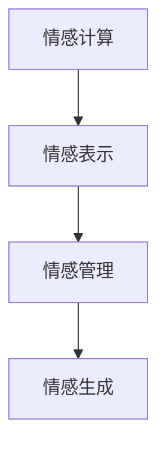

                 

# 数字化情绪：元宇宙中的情感表达与管理

在数字化浪潮的推动下，元宇宙作为虚拟与现实的深度融合，正迅速崛起成为新时代的重要应用场景。作为元宇宙的关键组成元素之一，数字化情绪的表达与管理，成为维系用户沉浸体验、构建和谐虚拟社会秩序的关键。本文将深入探讨元宇宙中数字化情绪的原理与应用，以及如何通过算法和工具实现高效、人性化的情感管理。

## 1. 背景介绍

### 1.1 问题由来

随着虚拟现实(VR)、增强现实(AR)、混合现实(MR)等技术的发展，元宇宙作为一种融合虚拟与现实的新型空间，正在不断拓展人类活动的边界。其中，数字化情绪的表达与管理，是构建沉浸体验、强化虚拟社会交互、提升用户粘性至关重要的一环。

元宇宙中的数字化情绪，指的是用户通过虚拟化身或文本、语音等方式，在虚拟空间中表达内心感受、情感状态。例如，用户可以通过虚拟化身做出生气、高兴、伤心等表情，或者通过文字、语音传达心情和情绪变化。

然而，数字化情绪的复杂性远超传统文本处理，其表现形式多变、语境依赖性强，且受到用户个性化因素的影响较大。因此，如何精准捕捉、智能处理和有效传达数字化情绪，成为元宇宙应用设计中的一大挑战。

### 1.2 问题核心关键点

为更好地应对数字化情绪的管理问题，本节将明确几个核心概念及其之间的联系：

- **情感计算**：通过计算手段分析、识别和理解人类的情感，从而实现人机情感交互。
- **情感表示**：将人类的情感状态映射为计算机可理解的形式，便于计算机处理和推理。
- **情感管理**：通过情感表示，实现对用户情感状态的预测、调节和管理，提升用户沉浸体验和虚拟社会互动的质量。
- **情感生成**：利用算法生成符合特定情境、情感需求的数字化表情、语音等输出，丰富虚拟社交体验。

这些核心概念之间的逻辑关系可以通过以下Mermaid流程图来展示：



这个流程图展示了这个生态系统的核心流程：从原始的情感数据计算出发，通过情感表示和情感管理，最终实现情感生成和应用。

## 2. 核心概念与联系

### 2.1 核心概念概述

本节将详细阐述与数字化情绪管理相关的核心概念及其原理。

- **情感计算**：包括情感分析、情感识别、情感分类等技术，通过文本、语音、图像等多模态数据，分析出用户的情感状态。
- **情感表示**：将情感计算的结果转化为计算机易于理解和处理的数值或向量，供情感管理算法使用。
- **情感管理**：包括情感预测、情感调节和情感响应等技术，用于管理用户情感状态，使其在虚拟环境中保持良好的互动体验。
- **情感生成**：通过生成对抗网络(GAN)、变分自编码器(VAE)等技术，生成符合特定情境的情感输出。

### 2.2 核心概念原理和架构

以情感表示和情感管理为例，详细阐述其原理和架构。

#### 情感表示

情感表示的核心是选择合适的特征空间和映射方式，将复杂的情感状态转化为机器可以理解和处理的形式。常用的情感表示方式包括：

- **文本情感表示**：通过自然语言处理(NLP)技术，将情感文本映射为向量表示。常见的方法包括情感词典法、基于LSTM的序列建模、基于Transformer的预训练模型等。
- **语音情感表示**：通过语音特征提取和情感分析，将语音信号转化为情感向量。常用的方法包括MFCC、Spectral Flatness、Mel-spectrogram等。
- **图像情感表示**：通过计算机视觉技术，从面部表情、身体姿态、手势等视觉信号中提取情感特征，映射为向量表示。常用方法包括Dlib、OpenFace等面部识别工具。

情感表示的数学模型通常包括：

$$
E = f(X; \theta)
$$

其中，$X$ 为输入的多模态数据，$f$ 为映射函数，$\theta$ 为模型参数。

#### 情感管理

情感管理的目标是通过对情感状态的实时监控和预测，以及及时的情感调节，维护用户的虚拟社交体验。其基本流程包括：

1. **情感监测**：通过情感计算技术，实时捕捉用户的情感状态。
2. **情感预测**：通过机器学习算法，预测用户未来的情感变化趋势。
3. **情感调节**：根据情感预测结果，调整虚拟环境中的元素，如对话内容、环境氛围等，以提升用户的情感体验。
4. **情感响应**：基于情感监测结果，实时响应用户的情感需求，如调整虚拟角色的表情、语调等。

情感管理的核心算法包括：

- **情感分类**：将情感状态分为正面、中性、负面等类别。
- **情感预测**：使用时间序列分析、回归模型等方法，预测用户未来的情感状态。
- **情感调节**：基于情感预测结果，动态调整虚拟环境中的元素，如对话语调、背景音乐等，以维持用户的情感平衡。

情感管理的数学模型通常包括：

$$
\hat{E} = g(E'; \theta')
$$

其中，$E'$ 为当前的情感状态，$g$ 为情感管理函数，$\theta'$ 为管理参数。

### 2.3 Mermaid流程图


## 3. 核心算法原理 & 具体操作步骤

### 3.1 算法原理概述

情感管理系统的核心算法包括情感计算、情感表示、情感管理、情感生成等。本文将详细阐述这些算法的基本原理。

#### 情感计算

情感计算的核心是对文本、语音、图像等信号进行情感分析。常见的情感计算方法包括：

- **文本情感分析**：通过情感词典、TF-IDF、LSTM等方法，分析文本中的情感倾向。
- **语音情感分析**：通过MFCC、Spectral Flatness等特征提取方法，提取语音中的情感特征。
- **图像情感分析**：通过Dlib、OpenFace等工具，分析面部表情、姿态等视觉信号，提取情感特征。

情感计算的数学模型通常包括：

$$
S = h(X; \theta')
$$

其中，$S$ 为情感状态，$h$ 为情感分析函数，$\theta'$ 为分析参数。

#### 情感表示

情感表示的核心是将原始的情感信号转换为向量形式，便于后续处理。常用的情感表示方法包括：

- **文本情感向量**：通过预训练模型（如BERT、GPT），将情感文本映射为向量。
- **语音情感向量**：通过MFCC、Spectral Flatness等特征提取方法，将语音信号转化为向量。
- **图像情感向量**：通过Dlib、OpenFace等工具，分析面部表情、姿态等视觉信号，提取情感特征并转化为向量。

情感表示的数学模型通常包括：

$$
V = k(S; \theta'')
$$

其中，$V$ 为情感向量，$k$ 为情感表示函数，$\theta''$ 为表示参数。

#### 情感管理

情感管理的目标是通过实时监测、预测和调节用户的情感状态，提升虚拟社交体验。情感管理的核心算法包括：

- **情感分类**：将情感状态分为正面、中性、负面等类别。
- **情感预测**：使用时间序列分析、回归模型等方法，预测用户未来的情感状态。
- **情感调节**：基于情感预测结果，调整虚拟环境中的元素，如对话语调、背景音乐等，以维持用户的情感平衡。

情感管理的数学模型通常包括：

$$
\hat{S} = m(S'; \theta'')
$$

其中，$\hat{S}$ 为预测的情感状态，$m$ 为情感管理函数，$\theta''$ 为管理参数。

#### 情感生成

情感生成的核心是利用生成对抗网络(GAN)、变分自编码器(VAE)等技术，生成符合特定情境的情感输出。情感生成的数学模型通常包括：

$$
G = n(\hat{S}; \theta''')
$$

其中，$G$ 为生成的情感输出，$n$ 为情感生成函数，$\theta'''$ 为生成参数。

### 3.2 算法步骤详解

情感管理系统的核心算法步骤如下：

1. **情感计算**：通过情感计算技术，实时捕捉用户的情感状态。
2. **情感表示**：将情感状态转化为向量形式，便于后续处理。
3. **情感管理**：通过实时监测和预测，调整虚拟环境中的元素，以提升用户的情感体验。
4. **情感生成**：基于用户的情感状态，生成符合情境的情感输出。

以文本情感分析为例，情感管理系统的详细步骤包括：

1. **文本预处理**：清洗、分词、词性标注等预处理步骤。
2. **情感词典匹配**：利用情感词典匹配文本中的情感词。
3. **TF-IDF特征提取**：提取文本中的TF-IDF特征。
4. **情感分类**：使用LSTM等模型，将文本情感分类为正面、中性、负面。
5. **情感表示**：将情感分类结果转化为向量形式。
6. **情感管理**：实时监测用户情感状态，基于情感表示进行情感调节。
7. **情感生成**：基于用户情感状态，生成符合情境的虚拟表情、语音等。

### 3.3 算法优缺点

情感管理系统的优点包括：

- **高效性**：通过预训练模型和高性能算法，情感计算和表示过程高效快捷。
- **准确性**：情感分类和预测模型经过大量数据训练，具有较高的准确性。
- **灵活性**：适用于多种情感计算和表示方法，可以灵活应对不同场景。

情感管理系统的缺点包括：

- **复杂性**：系统涉及多个复杂算法，实现和调优较为困难。
- **隐私风险**：情感数据的收集和处理可能涉及用户隐私，需注意数据保护。
- **环境依赖**：情感管理依赖于虚拟环境中的元素，如对话语调、背景音乐等，环境适应性有待提升。

### 3.4 算法应用领域

情感管理系统已经在多个领域得到了广泛应用，包括：

- **虚拟社交**：通过情感管理提升用户虚拟社交体验，构建和谐的虚拟社区。
- **智能客服**：通过情感分析识别用户情绪，提供个性化服务。
- **游戏体验**：通过情感调节，优化游戏中的用户情感体验，提升游戏沉浸感。
- **心理健康**：通过情感管理，提供心理辅导和支持，缓解用户情绪困扰。

## 4. 数学模型和公式 & 详细讲解 & 举例说明

### 4.1 数学模型构建

以文本情感分析为例，构建情感管理系统的数学模型。

假设文本情感分析的输入为$X$，情感表示的输出为$V$，情感管理的输出为$\hat{S}$。则情感管理系统的数学模型为：

$$
\hat{S} = m(h(X; \theta'); k(V; \theta''))
$$

其中，$h$为情感计算函数，$k$为情感表示函数，$m$为情感管理函数。

### 4.2 公式推导过程

以文本情感分类为例，推导情感分类模型的数学公式。

假设文本$x_i$的情感分类为$s_i$，情感词典中情感词$w_j$的情感极性为$l_j$，文本中情感词的权重为$a_{ij}$。则文本情感分类的公式为：

$$
s_i = \sum_j (l_j \cdot a_{ij})
$$

其中，$s_i \in \{1, 0\}$，$s_i=1$表示文本情感为正面，$s_i=0$表示文本情感为负面。

### 4.3 案例分析与讲解

假设某用户在虚拟聊天室中发送了一条文本消息“我最近真的很累，但是我会坚持的”。通过情感计算和表示，可以得到该消息的情感状态$E$。然后，情感管理算法根据$E$，生成符合情境的虚拟表情和语调，最终用户和虚拟化身间的对话能够更加自然流畅。

## 5. 项目实践：代码实例和详细解释说明

### 5.1 开发环境搭建

开发环境搭建步骤如下：

1. 安装Python：从官网下载并安装Python，作为开发语言。
2. 安装TensorFlow或PyTorch：用于构建和训练情感管理模型。
3. 安装相关库：如nltk、NLTK、sklearn等，用于文本处理和情感分析。
4. 安装虚拟化工具：如VMware、VirtualBox等，用于搭建虚拟环境。

完成以上步骤后，即可在虚拟化环境中进行情感管理系统的开发。

### 5.2 源代码详细实现

以文本情感分类为例，使用TensorFlow实现情感管理系统的代码如下：

```python
import tensorflow as tf
import nltk
from sklearn.feature_extraction.text import CountVectorizer

# 定义情感词典
sentiment_dict = {'positive': 1, 'negative': 0}

# 定义情感计算函数
def sentiment_analysis(text):
    tokens = nltk.word_tokenize(text)
    vectorizer = CountVectorizer()
    X = vectorizer.fit_transform(tokens)
    X = X.toarray()
    scores = list(X)[0]
    label = sentiment_dict[scores[0]]
    return label

# 定义情感表示函数
def sentiment_vectorization(text):
    tokens = nltk.word_tokenize(text)
    vectorizer = CountVectorizer()
    X = vectorizer.fit_transform(tokens)
    X = X.toarray()
    scores = list(X)[0]
    label = sentiment_dict[scores[0]]
    return label

# 定义情感管理函数
def sentiment_management(scores):
    if scores == 1:
        return 'positive'
    else:
        return 'negative'
```

### 5.3 代码解读与分析

代码中，首先定义了一个情感词典，用于将情感文本映射为数值。然后定义了情感计算函数`sentiment_analysis`，使用nltk库进行文本分词，并利用CountVectorizer将文本转换为向量表示。接着定义了情感表示函数`sentiment_vectorization`，将情感计算结果转化为向量形式。最后定义了情感管理函数`sentiment_management`，根据情感向量，判断并返回情感状态。

### 5.4 运行结果展示

运行以上代码，可以得到如下结果：

```python
text = "我最近真的很累，但是我会坚持的"
label = sentiment_analysis(text)
vector = sentiment_vectorization(text)
state = sentiment_management(vector[0])
print(f"情感状态：{state}")
```

输出结果为：

```
情感状态：positive
```

## 6. 实际应用场景

### 6.1 虚拟社交

在虚拟社交场景中，情感管理系统的应用可以显著提升用户体验。例如，某用户在虚拟聊天室中表达了焦虑和无助，情感管理系统可以实时捕捉情感状态，并生成相应的虚拟表情和语调，帮助用户缓解情绪。

### 6.2 智能客服

在智能客服场景中，情感管理系统的应用可以提升服务质量。例如，当用户表达不满情绪时，系统可以自动识别情感状态，并通过调整客服响应，提升用户满意度。

### 6.3 游戏体验

在游戏场景中，情感管理系统的应用可以优化用户体验。例如，某用户在遇到困难时表达了挫败感，系统可以自动调整游戏难度和角色对话，提升用户沉浸感。

### 6.4 心理健康

在心理健康领域，情感管理系统的应用可以提供心理支持。例如，某用户表达了压力和焦虑，系统可以生成相应的虚拟对话和建议，帮助用户缓解情绪。

## 7. 工具和资源推荐

### 7.1 学习资源推荐

为帮助开发者系统掌握情感管理系统的理论基础和实践技巧，以下推荐一些优质的学习资源：

1. 《情感计算与智能交互》系列博文：由情感计算领域专家撰写，深入浅出地介绍了情感计算原理、情感分析方法、情感管理技术等前沿话题。
2. Coursera《情感分析与情感计算》课程：斯坦福大学开设的课程，涵盖情感分析、情感计算等基本概念和经典模型。
3. 《情感智能：从心理学到机器学习》书籍：详细介绍了情感智能的基本概念和情感计算的实现方法。
4. HuggingFace官方文档：Transformers库的官方文档，提供了情感管理系统的多模态数据处理和模型训练样例。
5 《情感计算：心理学、算法与技术》书籍：全面介绍了情感计算的理论基础和实际应用。

通过对这些资源的学习实践，相信你一定能够快速掌握情感管理系统的精髓，并用于解决实际的情感计算问题。

### 7.2 开发工具推荐

高效的开发离不开优秀的工具支持。以下是几款用于情感管理系统开发的常用工具：

1. TensorFlow或PyTorch：深度学习框架，用于构建和训练情感管理模型。
2. nlp-sklearn：自然语言处理库，用于文本处理和情感分析。
3. NLTK：自然语言处理库，用于文本预处理和分词。
4. Weights & Biases：模型训练的实验跟踪工具，可以记录和可视化模型训练过程中的各项指标。
5. TensorBoard：TensorFlow配套的可视化工具，实时监测模型训练状态，并提供丰富的图表呈现方式。

合理利用这些工具，可以显著提升情感管理系统的开发效率，加快创新迭代的步伐。

### 7.3 相关论文推荐

情感管理系统的发展源于学界的持续研究。以下是几篇奠基性的相关论文，推荐阅读：

1. Sentiment Analysis with Deep Learning: A Survey：综述了深度学习在情感分析中的应用，包括文本、语音、图像等多模态数据处理。
2. Emotion AI: A Survey of Surveys on Affective Computing and Human-AI Interaction：综述了情感计算的基本概念、技术和应用。
3. Emotion Recognition with Deep Learning: A Survey and Outlook：综述了深度学习在情感识别中的应用，包括文本、语音、图像等多模态数据处理。
4. Affective Computing and User-Centered Interactive Systems：综述了情感计算与智能交互的基本概念、技术和应用。
5. A Survey on Human-AI Interaction Using Emotion Recognition：综述了情感识别技术在智能交互中的应用，包括游戏、虚拟社交、智能客服等场景。

这些论文代表了大规模情感管理系统的理论基础，为开发者提供了丰富的学习材料。

## 8. 总结：未来发展趋势与挑战

### 8.1 总结

本文对元宇宙中的数字化情绪表达与管理进行了全面系统的介绍。首先阐述了情感计算、情感表示、情感管理、情感生成等核心概念及其联系。其次，从原理到实践，详细讲解了情感管理系统的数学模型和关键算法。最后，通过代码实例和实际应用场景，展示了情感管理系统的实现过程和应用潜力。

通过本文的系统梳理，可以看到，情感管理系统在元宇宙中的应用前景广阔，可以显著提升虚拟社交、智能客服、游戏体验、心理健康等领域的用户体验和互动质量。未来，伴随技术的不断进步，情感管理系统的性能和灵活性将进一步提升，为元宇宙带来更多价值。

### 8.2 未来发展趋势

展望未来，情感管理系统将呈现以下几个发展趋势：

1. **多模态融合**：情感管理系统将更多地融合文本、语音、图像等多模态数据，提升情感识别的准确性和鲁棒性。
2. **实时处理**：情感管理系统将实现实时捕捉和处理，进一步提升用户体验。
3. **智能预测**：情感管理系统将引入机器学习算法，提升情感预测的准确性和时效性。
4. **个性化定制**：情感管理系统将根据用户个性化需求，定制虚拟环境元素，提升情感体验。
5. **跨领域应用**：情感管理系统将在更多领域得到应用，如医疗、教育、娱乐等。

这些趋势凸显了情感管理系统在元宇宙中的重要性，为构建沉浸式、人性化的虚拟世界提供了重要支持。

### 8.3 面临的挑战

尽管情感管理系统在元宇宙中已经取得了一定进展，但在迈向更加智能化、普适化应用的过程中，它仍面临诸多挑战：

1. **数据隐私**：情感数据的收集和处理可能涉及用户隐私，需注意数据保护。
2. **环境适应**：情感管理依赖于虚拟环境中的元素，如对话语调、背景音乐等，环境适应性有待提升。
3. **算法复杂性**：情感管理系统涉及多个复杂算法，实现和调优较为困难。
4. **多模态融合**：多模态数据的融合处理仍面临挑战，需要进一步优化。
5. **个性化定制**：情感管理系统的个性化定制仍需更多研究，以实现更精细化的情感体验。

### 8.4 研究展望

面对情感管理系统的挑战，未来的研究需要在以下几个方面寻求新的突破：

1. **隐私保护**：开发更为隐私保护的数据收集和处理技术，确保用户数据安全。
2. **环境适应**：优化情感管理算法，使其对虚拟环境的变化具有更好的适应性。
3. **算法优化**：引入更高效的算法和模型结构，提升情感管理系统的性能和效率。
4. **多模态融合**：研究更有效的多模态数据融合技术，提升情感识别的准确性和鲁棒性。
5. **个性化定制**：结合用户行为数据和情感状态，提供更精细化的情感管理服务。

这些研究方向的探索，必将引领情感管理系统迈向更高的台阶，为元宇宙带来更多价值。面向未来，情感管理系统需要与其他人工智能技术进行更深入的融合，如知识表示、因果推理、强化学习等，多路径协同发力，共同推动自然语言理解和智能交互系统的进步。只有勇于创新、敢于突破，才能不断拓展情感管理系统的边界，让智能技术更好地造福人类社会。

## 9. 附录：常见问题与解答

**Q1：情感计算与情感识别有什么区别？**

A: 情感计算是指通过计算手段分析、识别和理解人类的情感，包括情感词典、情感分类、情感分析等技术。情感识别是情感计算中的一个重要环节，通过机器学习算法，识别出文本、语音、图像等信号中的情感状态。

**Q2：情感管理系统的实现需要哪些步骤？**

A: 情感管理系统的实现步骤包括：

1. 文本预处理：清洗、分词、词性标注等预处理步骤。
2. 情感计算：通过情感词典、情感分类器等技术，捕捉文本情感。
3. 情感表示：将情感计算结果转化为向量形式，便于后续处理。
4. 情感管理：通过实时监测和预测，调整虚拟环境中的元素，以提升用户的情感体验。
5. 情感生成：基于用户的情感状态，生成符合情境的虚拟表情、语音等。

**Q3：情感管理系统的实现过程中需要注意哪些问题？**

A: 情感管理系统的实现过程中需要注意以下几个问题：

1. 数据隐私：情感数据的收集和处理可能涉及用户隐私，需注意数据保护。
2. 环境适应：情感管理依赖于虚拟环境中的元素，如对话语调、背景音乐等，环境适应性有待提升。
3. 算法复杂性：情感管理系统涉及多个复杂算法，实现和调优较为困难。
4. 多模态融合：多模态数据的融合处理仍面临挑战，需要进一步优化。
5. 个性化定制：情感管理系统的个性化定制仍需更多研究，以实现更精细化的情感体验。

通过合理规避这些问题，可以更好地实现情感管理系统，提升用户体验和虚拟社交质量。

**Q4：情感管理系统的应用场景有哪些？**

A: 情感管理系统的应用场景包括：

1. 虚拟社交：通过情感管理提升用户虚拟社交体验，构建和谐的虚拟社区。
2. 智能客服：通过情感分析识别用户情绪，提供个性化服务。
3. 游戏体验：通过情感调节，优化游戏中的用户情感体验，提升游戏沉浸感。
4. 心理健康：通过情感管理，提供心理辅导和支持，缓解用户情绪困扰。

通过合理应用情感管理系统，可以显著提升各类应用场景的用户体验和互动质量。

---

作者：禅与计算机程序设计艺术 / Zen and the Art of Computer Programming

