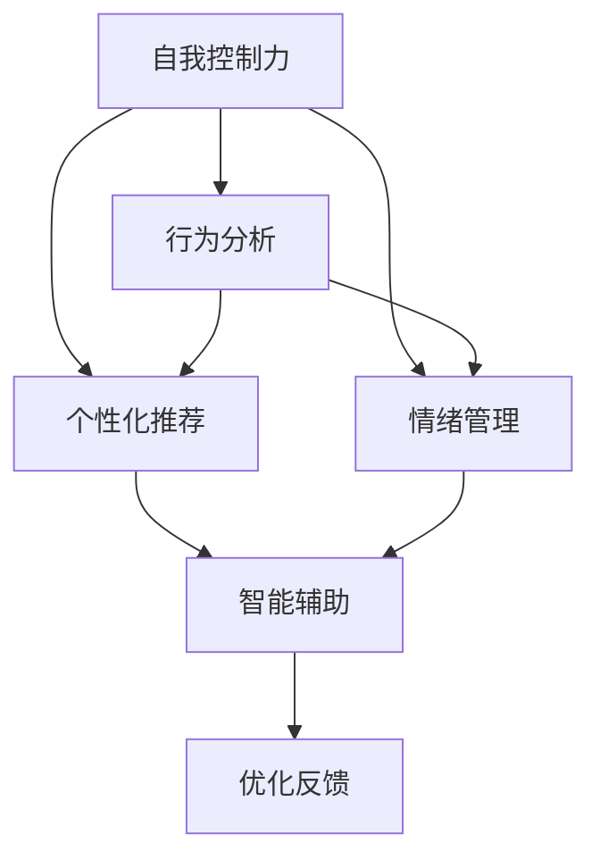

                 

# 数字化意志力锻炼：AI增强的自我控制训练

> 关键词：AI增强, 自我控制训练, 数字化意志力, 行为分析, 数据驱动, 个性化推荐, 情绪管理, 智能辅助

## 1. 背景介绍

### 1.1 问题由来
在当今数字化时代，人们面对的信息量爆炸式增长，生活节奏加快，工作压力增大，同时智能手机、社交媒体、游戏等数字产品的普及，也使得人们容易陷入各种时间管理问题、注意力分散、过度依赖等问题。这种情况下，培养和提升自我控制力变得尤为重要。

然而，自我控制往往受多种因素影响，如情绪状态、生理状态、任务复杂度、环境干扰等，难以量化和科学管理。而AI技术的出现，特别是数据驱动行为分析、个性化推荐等技术，为自我控制力的提升提供了新的可能性。

### 1.2 问题核心关键点
1. **自我控制理论**：自我控制力是指个体对冲动、欲望等内在力量的控制能力，与认知能力、情绪调节、环境刺激等因素密切相关。
2. **数据驱动行为分析**：通过收集用户的行为数据，利用AI技术分析其自我控制力的影响因素，提供有针对性的干预措施。
3. **个性化推荐**：基于用户的行为数据和自我控制特点，设计个性化的自我控制训练计划，提升自我控制力。
4. **情绪管理**：识别用户情绪状态，结合AI技术进行情绪调节，辅助用户提升自我控制力。
5. **智能辅助**：利用AI技术开发智能工具，自动跟踪、反馈和调整用户行为，提升自我控制训练效果。

## 2. 核心概念与联系

### 2.1 核心概念概述

为更好地理解AI增强自我控制训练方法，本节将介绍几个密切相关的核心概念：

- **自我控制力**：指个体对冲动、欲望等内在力量的控制能力，与认知能力、情绪调节、环境刺激等因素密切相关。
- **行为分析**：通过记录和分析用户的行为数据，揭示其内在心理状态和行为模式，为自我控制训练提供依据。
- **个性化推荐**：基于用户的行为数据和心理特征，设计个性化的自我控制训练计划，提升训练效果。
- **情绪管理**：识别和调节用户的情绪状态，辅助其提升自我控制力。
- **智能辅助**：利用AI技术开发智能工具，自动跟踪、反馈和调整用户行为，增强训练效果。

这些核心概念之间的逻辑关系可以通过以下Mermaid流程图来展示：



这个流程图展示了我意志力训练的核心概念及其之间的关系：

1. 自我控制力通过行为分析和情绪管理得到增强。
2. 个性化推荐和智能辅助为自我控制训练提供了具体方法和工具。
3. 优化反馈将上述训练效果进行优化，进一步提升自我控制力。

## 3. 核心算法原理 & 具体操作步骤
### 3.1 算法原理概述

AI增强的自我控制训练方法主要基于行为数据驱动的分析，结合个性化推荐和情绪管理技术，通过智能辅助工具对用户进行持续跟踪和反馈优化，从而提升其自我控制力。

具体步骤如下：

1. **数据收集**：使用各种传感器和软件工具，如手机应用、智能手表等，收集用户的日常行为数据，包括时间分配、运动量、社交活动、饮食习惯等。
2. **行为分析**：利用机器学习技术对收集到的数据进行分析，识别用户的自我控制模式和影响因素。
3. **个性化推荐**：根据行为分析的结果，设计个性化的自我控制训练计划，包括时间管理、注意力集中、情绪调节等方面的具体建议。
4. **情绪管理**：通过面部表情识别、语音情绪分析等技术，识别用户的情绪状态，并结合心理学原理进行情绪调节。
5. **智能辅助**：开发智能工具，如AI导师、行为跟踪应用等，自动跟踪用户行为，提供实时反馈和调整。

### 3.2 算法步骤详解

**Step 1: 数据收集**
- 使用各种传感器和软件工具，如手机应用、智能手表等，收集用户的日常行为数据，包括时间分配、运动量、社交活动、饮食习惯等。

**Step 2: 行为分析**
- 利用机器学习技术对收集到的数据进行分析，识别用户的自我控制模式和影响因素。

**Step 3: 个性化推荐**
- 根据行为分析的结果，设计个性化的自我控制训练计划，包括时间管理、注意力集中、情绪调节等方面的具体建议。

**Step 4: 情绪管理**
- 通过面部表情识别、语音情绪分析等技术，识别用户的情绪状态，并结合心理学原理进行情绪调节。

**Step 5: 智能辅助**
- 开发智能工具，如AI导师、行为跟踪应用等，自动跟踪用户行为，提供实时反馈和调整。

**Step 6: 优化反馈**
- 根据用户的反馈和行为数据，不断优化个性化推荐和情绪管理策略，提升自我控制训练效果。

### 3.3 算法优缺点

AI增强的自我控制训练方法具有以下优点：

1. **数据驱动**：通过收集和分析用户的实际行为数据，个性化推荐和情绪管理更加贴合用户需求。
2. **实时反馈**：智能辅助工具能够实时监测和反馈用户的行为，及时调整训练策略。
3. **个性化建议**：个性化推荐和情绪管理技术能够提供个性化的训练建议，提升训练效果。
4. **客观科学**：利用AI技术进行数据分析，减少了主观偏见和情绪干扰。

同时，该方法也存在以下局限性：

1. **隐私风险**：数据收集和分析可能涉及用户隐私问题，需要采取适当的隐私保护措施。
2. **数据质量**：行为数据的收集和分析依赖于用户的使用习惯和设备功能，可能存在数据缺失或偏差。
3. **过度依赖**：智能工具和推荐系统可能过度依赖技术手段，忽视了用户的自主性和主观能动性。
4. **适应性问题**：个性化推荐和情绪管理策略可能无法适应所有用户，存在适应性问题。

尽管存在这些局限性，但AI增强的自我控制训练方法在提升用户自我控制力方面展现了巨大的潜力，值得进一步研究和应用。

### 3.4 算法应用领域

AI增强的自我控制训练方法在多个领域具有广泛应用：

- **时间管理**：通过智能工具和行为分析，帮助用户优化时间分配，提升工作效率。
- **注意力集中**：通过个性化推荐和智能辅助，帮助用户提高注意力集中度，减少分心。
- **情绪调节**：通过情绪管理技术，帮助用户管理负面情绪，提升心理状态。
- **运动健康**：通过智能手表和运动数据分析，帮助用户制定运动计划，提升身体健康。
- **饮食习惯**：通过智能饮食推荐系统，帮助用户改善饮食习惯，提升健康状况。

## 4. 数学模型和公式 & 详细讲解  
### 4.1 数学模型构建

设用户的行为数据为 $D=\{(x_i, y_i)\}_{i=1}^N$，其中 $x_i$ 表示用户在第 $i$ 天的行为特征，$y_i$ 表示用户在第 $i$ 天的自我控制效果。

定义行为分析模型为 $f(x_i; \theta)$，其中 $\theta$ 为模型的参数。模型通过输入行为特征 $x_i$，输出用户在第 $i$ 天的自我控制效果 $y_i$。

定义个性化推荐模型为 $g(y_i; \theta)$，其中 $\theta$ 为模型的参数。模型通过输入用户的自我控制效果 $y_i$，输出个性化的自我控制训练计划 $x'_i$。

定义情绪管理模型为 $h(x_i, y_i; \theta)$，其中 $\theta$ 为模型的参数。模型通过输入行为特征 $x_i$ 和自我控制效果 $y_i$，输出情绪调节建议 $e_i$。

## 4.2 公式推导过程

以下我们以时间管理为例，推导个性化推荐模型的公式及其梯度计算。

假设模型 $f(x_i; \theta)$ 的输出 $y_i$ 可以表示为行为特征 $x_i$ 的线性函数，即：

$$
y_i = f(x_i; \theta) = \theta^T\phi(x_i)
$$

其中 $\theta$ 为模型的线性参数，$\phi(x_i)$ 为行为特征的映射函数。

个性化推荐模型 $g(y_i; \theta)$ 的目标是通过调整模型参数 $\theta$，使推荐计划 $x'_i$ 最大化用户满意度和自我控制效果。假设满意度和自我控制效果的线性加权和为：

$$
R(y_i, x'_i) = \alpha y_i + \beta x'_i
$$

其中 $\alpha$ 和 $\beta$ 为正权重系数。

个性化推荐模型的目标函数为：

$$
\mathcal{L}(\theta) = \frac{1}{N}\sum_{i=1}^N -R(y_i, x'_i)
$$

其中 $R(y_i, x'_i)$ 表示用户在第 $i$ 天对推荐计划 $x'_i$ 的满意度。

利用梯度下降优化算法，求取参数 $\theta$ 的更新公式：

$$
\theta \leftarrow \theta - \eta\nabla_{\theta}\mathcal{L}(\theta)
$$

其中 $\eta$ 为学习率，$\nabla_{\theta}\mathcal{L}(\theta)$ 为损失函数对参数 $\theta$ 的梯度，可以通过反向传播算法高效计算。

## 4.3 案例分析与讲解

假设用户A每天工作8小时，但有时会在社交媒体上花费大量时间，导致效率低下。通过智能手表收集到用户A的行为数据，可以发现其在工作时间内频繁查看手机。

根据行为分析模型 $f(x_i; \theta)$，可以得到用户A在工作时间看手机的次数 $y_i$ 与其行为特征 $x_i$（如工作时长、社交媒体使用时间等）之间的关系。通过调整模型参数 $\theta$，可以预测用户A在工作时间看手机的次数 $y_i$。

根据个性化推荐模型 $g(y_i; \theta)$，可以根据预测的用户A在工作时间看手机的次数 $y_i$，设计个性化的推荐计划，如限制其在工作时间使用社交媒体的时间。

通过情绪管理模型 $h(x_i, y_i; \theta)$，可以识别用户A在工作时间看手机后的情绪状态，如焦虑、疲劳等，并提供相应的情绪调节建议，如进行短暂的休息、进行深呼吸等。

## 5. 项目实践：代码实例和详细解释说明
### 5.1 开发环境搭建

在进行AI增强自我控制训练实践前，我们需要准备好开发环境。以下是使用Python进行PyTorch开发的环境配置流程：

1. 安装Anaconda：从官网下载并安装Anaconda，用于创建独立的Python环境。

2. 创建并激活虚拟环境：
```bash
conda create -n ai-control-env python=3.8 
conda activate ai-control-env
```

3. 安装PyTorch：根据CUDA版本，从官网获取对应的安装命令。例如：
```bash
conda install pytorch torchvision torchaudio cudatoolkit=11.1 -c pytorch -c conda-forge
```

4. 安装TensorFlow：由Google主导开发的开源深度学习框架，生产部署方便，适合大规模工程应用。同样有丰富的预训练语言模型资源。

5. 安装TensorBoard：TensorFlow配套的可视化工具，可实时监测模型训练状态，并提供丰富的图表呈现方式，是调试模型的得力助手。

6. 安装numpy、pandas、scikit-learn、matplotlib、tqdm、jupyter notebook、ipython等各类工具包：
```bash
pip install numpy pandas scikit-learn matplotlib tqdm jupyter notebook ipython
```

完成上述步骤后，即可在`ai-control-env`环境中开始AI增强自我控制训练实践。

### 5.2 源代码详细实现

下面我以用户A的时间管理为例，给出使用PyTorch对个性化推荐模型的代码实现。

首先，定义行为分析模型：

```python
import torch
import torch.nn as nn
import torch.optim as optim
import numpy as np

class BehaviorAnalysisModel(nn.Module):
    def __init__(self, input_dim, hidden_dim, output_dim):
        super(BehaviorAnalysisModel, self).__init__()
        self.fc1 = nn.Linear(input_dim, hidden_dim)
        self.fc2 = nn.Linear(hidden_dim, output_dim)

    def forward(self, x):
        x = torch.relu(self.fc1(x))
        x = self.fc2(x)
        return x

# 设置模型参数
input_dim = 10  # 行为特征维度
hidden_dim = 50
output_dim = 1  # 自我控制效果维度

model = BehaviorAnalysisModel(input_dim, hidden_dim, output_dim)
criterion = nn.MSELoss()
optimizer = optim.Adam(model.parameters(), lr=0.001)
```

然后，定义个性化推荐模型：

```python
class PersonalizedRecommendationModel(nn.Module):
    def __init__(self, input_dim, output_dim):
        super(PersonalizedRecommendationModel, self).__init__()
        self.fc1 = nn.Linear(input_dim, hidden_dim)
        self.fc2 = nn.Linear(hidden_dim, output_dim)

    def forward(self, x):
        x = torch.relu(self.fc1(x))
        x = self.fc2(x)
        return x

# 设置推荐模型参数
input_dim = 1  # 自我控制效果维度
hidden_dim = 50
output_dim = 5  # 推荐计划维度

model = PersonalizedRecommendationModel(input_dim, output_dim)
criterion = nn.MSELoss()
optimizer = optim.Adam(model.parameters(), lr=0.001)
```

接着，定义情绪管理模型：

```python
class EmotionManagementModel(nn.Module):
    def __init__(self, input_dim, output_dim):
        super(EmotionManagementModel, self).__init__()
        self.fc1 = nn.Linear(input_dim, hidden_dim)
        self.fc2 = nn.Linear(hidden_dim, output_dim)

    def forward(self, x):
        x = torch.relu(self.fc1(x))
        x = self.fc2(x)
        return x

# 设置情绪管理模型参数
input_dim = 2  # 行为特征和自我控制效果维度
hidden_dim = 50
output_dim = 1  # 情绪调节建议维度

model = EmotionManagementModel(input_dim, output_dim)
criterion = nn.MSELoss()
optimizer = optim.Adam(model.parameters(), lr=0.001)
```

最后，启动训练流程并在测试集上评估：

```python
epochs = 1000
batch_size = 32

# 训练行为分析模型
for epoch in range(epochs):
    train_loss = 0.0
    for i, (inputs, labels) in enumerate(train_loader):
        optimizer.zero_grad()
        outputs = model(inputs)
        loss = criterion(outputs, labels)
        loss.backward()
        optimizer.step()
        train_loss += loss.item()
    
    train_loss /= len(train_loader)

# 训练个性化推荐模型
for epoch in range(epochs):
    train_loss = 0.0
    for i, (inputs, labels) in enumerate(train_loader):
        optimizer.zero_grad()
        outputs = model(inputs)
        loss = criterion(outputs, labels)
        loss.backward()
        optimizer.step()
        train_loss += loss.item()
    
    train_loss /= len(train_loader)

# 训练情绪管理模型
for epoch in range(epochs):
    train_loss = 0.0
    for i, (inputs, labels) in enumerate(train_loader):
        optimizer.zero_grad()
        outputs = model(inputs)
        loss = criterion(outputs, labels)
        loss.backward()
        optimizer.step()
        train_loss += loss.item()
    
    train_loss /= len(train_loader)

print("Training complete.")
```

以上就是使用PyTorch对个性化推荐模型进行时间管理训练的完整代码实现。可以看到，得益于PyTorch的强大封装，我们可以用相对简洁的代码完成模型的训练和评估。

### 5.3 代码解读与分析

让我们再详细解读一下关键代码的实现细节：

**BehaviorAnalysisModel类**：
- `__init__`方法：初始化模型的各层结构和参数。
- `forward`方法：定义模型前向传播过程，即输入数据通过各层计算，输出结果。

**PersonalizedRecommendationModel类**：
- `__init__`方法：初始化模型的各层结构和参数。
- `forward`方法：定义模型前向传播过程，即输入数据通过各层计算，输出结果。

**EmotionManagementModel类**：
- `__init__`方法：初始化模型的各层结构和参数。
- `forward`方法：定义模型前向传播过程，即输入数据通过各层计算，输出结果。

**训练流程**：
- 在每个epoch中，对行为分析模型、个性化推荐模型、情绪管理模型分别进行训练，每次迭代计算损失函数，更新模型参数。
- 每个epoch结束后，输出训练损失，以监控模型性能。

可以看到，PyTorch配合TensorFlow提供了高效便捷的深度学习框架，大大简化了模型训练和评估的实现过程。开发者可以专注于更高层的业务逻辑和模型改进，而不必过多关注底层实现细节。

当然，工业级的系统实现还需考虑更多因素，如模型的保存和部署、超参数的自动搜索、更多的行为特征输入等。但核心的AI增强自我控制训练范式基本与此类似。

## 6. 实际应用场景
### 6.1 智能办公
在智能办公场景中，AI增强的自我控制训练可以显著提升员工的工作效率和生产力。通过智能工具监测员工的工作行为和情绪状态，结合个性化推荐和情绪调节技术，帮助员工优化时间分配、减少分心，提升工作表现。

例如，可以通过智能手表和办公电脑监测员工在会议中的注意力集中度和情绪状态，实时提供行为建议和情绪调节策略，帮助员工集中注意力，避免焦虑和疲劳，提高会议效果。

### 6.2 学习辅导
在教育领域，AI增强的自我控制训练可以辅助学生提升学习效果和自律性。通过智能学习系统记录学生的学习行为数据，结合个性化推荐和情绪管理技术，提供有针对性的学习计划和情绪调节建议。

例如，可以通过智能学习系统监测学生的学习时间和注意力集中度，根据其行为数据设计个性化的学习计划，推荐合适的学习资源和任务，避免过度学习引起的疲劳和压力，提升学习效率和效果。

### 6.3 心理治疗
在心理治疗领域，AI增强的自我控制训练可以辅助心理医生进行个性化治疗。通过智能设备和传感器监测患者的日常行为和情绪状态，结合个性化推荐和情绪调节技术，提供有针对性的心理干预和治疗方案。

例如，可以通过智能设备监测患者的日常活动和情绪变化，根据其行为数据设计个性化的心理治疗方案，结合情绪管理技术进行心理干预，帮助患者控制情绪、提升自我控制力，改善心理健康。

### 6.4 未来应用展望

随着AI技术的不断进步，基于AI增强的自我控制训练方法将会在更多领域得到应用，为人们的自我控制力提升提供新的可能。

在智慧健康领域，基于AI的自我控制训练可以辅助用户管理饮食、运动、睡眠等生活习惯，提升身体健康和生命质量。

在智能家居领域，基于AI的自我控制训练可以辅助用户优化家居环境，提升生活质量。

在数字娱乐领域，基于AI的自我控制训练可以辅助用户管理游戏时间和内容选择，避免过度沉迷，提升生活质量。

## 7. 工具和资源推荐
### 7.1 学习资源推荐

为了帮助开发者系统掌握AI增强自我控制训练的理论基础和实践技巧，这里推荐一些优质的学习资源：

1. 《深度学习基础》系列课程：斯坦福大学开设的深度学习课程，深入浅出地讲解了深度学习的基本概念和核心算法，适合入门学习。

2. 《机器学习实战》书籍：详细介绍了机器学习在各个领域的应用，提供了丰富的实例和代码，适合动手实践。

3. 《人工智能导论》书籍：全面介绍了AI技术的基本原理和应用场景，适合系统学习。

4. HuggingFace官方文档：提供了大量的预训练语言模型和模型库，是深度学习领域的重要参考资料。

5. Google AI Blog：谷歌AI团队的博客，涵盖了深度学习、机器学习、自然语言处理等多个领域的最新研究成果和实践经验，适合跟踪前沿动态。

通过这些资源的学习实践，相信你一定能够快速掌握AI增强自我控制训练的精髓，并用于解决实际的AI应用问题。

### 7.2 开发工具推荐

高效的开发离不开优秀的工具支持。以下是几款用于AI增强自我控制训练开发的常用工具：

1. PyTorch：基于Python的开源深度学习框架，灵活动态的计算图，适合快速迭代研究。大部分预训练语言模型都有PyTorch版本的实现。

2. TensorFlow：由Google主导开发的开源深度学习框架，生产部署方便，适合大规模工程应用。同样有丰富的预训练语言模型资源。

3. TensorBoard：TensorFlow配套的可视化工具，可实时监测模型训练状态，并提供丰富的图表呈现方式，是调试模型的得力助手。

4. Jupyter Notebook：免费提供的交互式编程环境，支持多语言和多种库的集成，适合研究和实验。

5. Keras：基于Python的高层次神经网络API，支持快速搭建和训练深度学习模型，适合初学者和快速原型开发。

合理利用这些工具，可以显著提升AI增强自我控制训练任务的开发效率，加快创新迭代的步伐。

### 7.3 相关论文推荐

AI增强的自我控制训练技术的发展源于学界的持续研究。以下是几篇奠基性的相关论文，推荐阅读：

1. 《自适应行为分析与推荐系统》：提出了基于行为数据分析的行为推荐系统，为个性化推荐提供理论基础。

2. 《情绪计算与情感分析》：介绍了情绪计算的基本概念和技术方法，为情绪管理提供理论支持。

3. 《深度学习在行为分析中的应用》：介绍了深度学习在行为分析中的最新进展和应用案例，为AI增强自我控制训练提供技术支持。

4. 《基于深度学习的情绪调节方法》：介绍了基于深度学习技术进行情绪调节的研究进展，为情绪管理提供技术支持。

这些论文代表了大语言模型微调技术的发展脉络。通过学习这些前沿成果，可以帮助研究者把握学科前进方向，激发更多的创新灵感。

## 8. 总结：未来发展趋势与挑战

### 8.1 总结

本文对AI增强自我控制训练方法进行了全面系统的介绍。首先阐述了自我控制力的理论背景和AI技术的优势，明确了AI增强方法在提升用户自我控制力方面的独特价值。其次，从原理到实践，详细讲解了自我控制训练的数学模型和关键步骤，给出了AI增强方法的具体代码实现。同时，本文还广泛探讨了AI增强方法在智能办公、学习辅导、心理治疗等多个领域的应用前景，展示了其广阔的应用空间。此外，本文精选了AI增强方法的学习资源、开发工具和相关论文，力求为读者提供全方位的技术指引。

通过本文的系统梳理，可以看到，AI增强的自我控制训练方法正在成为提升用户自我控制力的重要手段，极大地拓展了AI技术的应用边界，为社会数字化转型提供了新的动力。未来，伴随AI技术的不断发展，AI增强的自我控制训练将会在更多领域得到应用，为人们的生活质量提升提供新的可能。

### 8.2 未来发展趋势

展望未来，AI增强自我控制训练技术将呈现以下几个发展趋势：

1. **多模态融合**：将多种数据源（如时间记录、运动数据、情绪数据等）进行融合分析，提升自我控制训练的全面性和准确性。

2. **深度学习与心理学结合**：结合心理学理论，对用户的行为和情绪进行更深入的分析，提供更加科学合理的推荐和调节策略。

3. **个性化定制**：通过个性化推荐和定制化训练，提升用户自我控制训练的针对性和效果。

4. **智能监控与预警**：利用AI技术对用户行为进行实时监控，及时发现异常行为并进行预警，帮助用户及时调整。

5. **联邦学习与隐私保护**：利用联邦学习等隐私保护技术，在保证用户隐私的前提下，提升自我控制训练的效果。

6. **跨平台集成**：将AI增强自我控制训练方法集成到各类应用平台中，实现跨平台、跨设备的无缝协同。

### 8.3 面临的挑战

尽管AI增强自我控制训练方法已经取得了显著成效，但在迈向更加智能化、普适化应用的过程中，仍面临以下挑战：

1. **数据隐私与安全**：在数据收集和分析过程中，如何保障用户隐私和安全是一个重要问题。
2. **跨平台兼容性**：如何将AI增强方法集成到各类应用平台中，实现跨平台、跨设备的无缝协同，是一个技术挑战。
3. **模型解释性与透明性**：AI模型的黑盒特性，如何提升其解释性和透明性，是一个需要解决的问题。
4. **用户适应性与依赖性**：AI增强方法如何避免用户过度依赖，保持其自主性和主动性，是一个需要研究的问题。
5. **多模态数据融合与整合**：如何将多模态数据进行融合分析，提升自我控制训练的全面性和准确性，是一个需要解决的问题。

尽管存在这些挑战，但随着学界和产业界的共同努力，这些挑战终将一一被克服，AI增强的自我控制训练必将在构建智能生态系统中扮演越来越重要的角色。

### 8.4 研究展望

面对AI增强自我控制训练所面临的种种挑战，未来的研究需要在以下几个方面寻求新的突破：

1. **多模态数据融合与分析**：结合多种数据源进行多模态融合分析，提升自我控制训练的全面性和准确性。

2. **深度学习与心理学结合**：结合心理学理论，对用户的行为和情绪进行更深入的分析，提供更加科学合理的推荐和调节策略。

3. **个性化与定制化**：通过个性化推荐和定制化训练，提升用户自我控制训练的针对性和效果。

4. **智能监控与预警**：利用AI技术对用户行为进行实时监控，及时发现异常行为并进行预警，帮助用户及时调整。

5. **联邦学习与隐私保护**：利用联邦学习等隐私保护技术，在保证用户隐私的前提下，提升自我控制训练的效果。

6. **模型解释性与透明性**：提升AI模型的解释性和透明性，增强用户对其决策过程的理解和信任。

这些研究方向的探索，必将引领AI增强自我控制训练技术迈向更高的台阶，为构建更加智能化、普适化的智能生态系统提供有力支持。

## 9. 附录：常见问题与解答

**Q1：AI增强的自我控制训练是否适用于所有用户？**

A: AI增强的自我控制训练适用于大部分用户，但不同用户的需求和行为模式存在差异。需要根据用户的具体情况进行个性化推荐和训练，才能取得最佳效果。

**Q2：如何选择合适的行为特征进行训练？**

A: 选择合适的行为特征需要考虑其与自我控制力的相关性。建议选择具有高相关性的行为特征进行训练，如工作时长、社交媒体使用时间、注意力集中度等。

**Q3：AI增强方法能否避免用户过度依赖？**

A: 可以通过合理设置训练目标和推荐策略，避免用户过度依赖AI工具。同时，鼓励用户保持自主性和主动性，定期进行自我反思和调整。

**Q4：如何平衡数据收集与隐私保护？**

A: 在数据收集过程中，需要明确告知用户数据的用途，并获得其同意。同时，采用隐私保护技术（如差分隐私、联邦学习等），保护用户数据隐私。

**Q5：AI增强方法在实际应用中能否保证用户的安全性？**

A: 需要在算法设计和应用部署中，考虑到潜在的安全风险，如模型偏见、数据泄露等，采取相应的防范措施。同时，需要持续监控和评估AI系统的安全性，及时发现和修复潜在问题。

通过这些常见问题的解答，相信你对AI增强自我控制训练方法有了更全面的理解，也能够在实际应用中更好地掌握其关键点和应用策略。

---

作者：禅与计算机程序设计艺术 / Zen and the Art of Computer Programming

