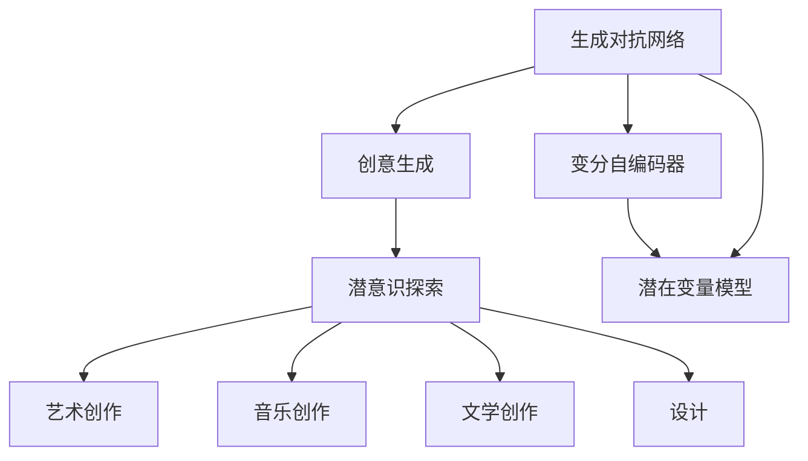

                 

# 数字化梦境编织：AI设计的潜意识探索

## 1. 背景介绍

### 1.1 问题由来
随着人工智能技术的迅速发展，AI在多个领域取得了令人瞩目的突破。其中，生成对抗网络（Generative Adversarial Networks, GANs）和变分自编码器（Variational Autoencoders, VAEs）等深度学习模型在图像、音频、自然语言等多个领域的生成和重构任务上表现出色，深刻影响了人类对数字世界的认知和应用。

生成对抗网络是由Ian Goodfellow于2014年提出的，通过两个神经网络（生成器和判别器）之间的对抗训练，生成高质量、逼真的数字内容，如自然图像、音乐、文本等。生成对抗网络不仅在视觉生成领域取得了巨大成功，其思想和方法也在其他领域得到了广泛应用。

变分自编码器是一种无监督学习模型，通过学习数据的低维分布，实现数据的压缩与重构。与生成对抗网络不同，变分自编码器不需要明确的对抗训练机制，但在生成质量和效率上存在一定差距。

近年来，生成模型与潜意识探索、创意生成等领域相结合，诞生了许多有趣的应用，如使用生成对抗网络生成艺术作品，使用变分自编码器进行音乐创作等。这些应用不仅丰富了数字文化，也激发了人类对于数字内容的创作和理解的无限可能。

### 1.2 问题核心关键点
潜意识探索是指在深度学习模型的帮助下，挖掘和重构人类潜意识的创造力和想象力。潜意识探索的研究重点包括：

- 数字生成模型的基础原理与技术。
- 如何有效利用生成模型，创作艺术作品、音乐、文学作品等。
- 潜意识探索在创作和创意生成中的实际应用。
- 潜意识探索对人工智能、艺术、设计等领域的影响和前景。

潜意识探索的应用场景主要包括以下几个方面：

1. **艺术创作**：利用生成对抗网络和变分自编码器生成艺术作品，将潜意识转化为可视化的艺术创作。
2. **音乐创作**：通过深度学习模型生成旋律、和声、节奏等音乐元素，创作新的音乐作品。
3. **文学创作**：利用自然语言生成模型创作小说、诗歌、散文等文学作品。
4. **设计**：将生成模型应用于平面设计、建筑设计、室内设计等领域，提供创意灵感和设计方案。

### 1.3 问题研究意义
潜意识探索不仅拓展了数字内容的创作边界，也为人工智能与艺术、设计等领域的发展提供了新的视角和方法。研究潜意识探索，具有以下重要意义：

1. **拓展创作空间**：通过生成模型，艺术家、音乐家、作家等创作者可以突破传统媒介和形式，创作出前所未有的作品。
2. **激发创意灵感**：潜意识探索可以帮助创作者寻找新的灵感和思路，拓展创作路径。
3. **提升创作效率**：生成模型可以自动化生成部分创意内容，节省创作者的时间和精力。
4. **推动跨学科研究**：潜意识探索涉及到艺术、设计、计算机科学等多个领域，可以促进跨学科的合作与创新。
5. **丰富数字文化**：潜意识探索的应用可以丰富数字文化，推动数字艺术、数字文学等新兴领域的发展。

## 2. 核心概念与联系

### 2.1 核心概念概述

为了更好地理解潜意识探索的原理和方法，本节将介绍几个核心概念：

- **生成对抗网络 (GANs)**：由生成器和判别器两个神经网络组成，通过对抗训练生成逼真的数字内容。
- **变分自编码器 (VAEs)**：通过学习数据的低维分布，实现数据的压缩与重构。
- **潜在变量模型 (Latent Variable Models)**：一种无监督学习模型，通过学习数据分布的潜在变量，实现数据的生成和重构。
- **创意生成 (Creative Generation)**：利用生成模型创作艺术作品、音乐、文学作品等。
- **潜意识探索 (Subconscious Exploration)**：在生成模型的帮助下，挖掘和重构人类潜意识的创造力和想象力。

这些概念之间的逻辑关系可以通过以下Mermaid流程图来展示：



这个流程图展示了大模型探索的核心概念及其之间的关系：

1. 生成对抗网络通过对抗训练生成高质量的数字内容，是创意生成和潜意识探索的基础。
2. 变分自编码器学习数据分布的潜在变量，为数据的生成和重构提供方法。
3. 潜在变量模型进一步拓展了数据生成和重构的方法，有助于挖掘潜意识。
4. 创意生成是生成对抗网络和变分自编码器的应用之一，通过生成模型创作艺术作品、音乐、文学作品等。
5. 潜意识探索在创意生成的基础上，挖掘和重构人类潜意识的创造力和想象力。
6. 艺术创作、音乐创作、文学创作、设计等是潜意识探索的具体应用场景。

这些概念共同构成了潜意识探索的基础框架，为其研究和应用提供了理论支撑。

## 3. 核心算法原理 & 具体操作步骤
### 3.1 算法原理概述

潜意识探索的核心算法是生成对抗网络（GANs）和变分自编码器（VAEs）。这些算法通过学习数据分布，生成高质量的伪造数据，并在生成过程中探索和挖掘人类的潜意识。

### 3.2 算法步骤详解

#### 3.2.1 生成对抗网络 (GANs) 的基本原理

生成对抗网络由生成器和判别器两个神经网络组成。生成器的目标是通过训练学习生成逼真的样本，而判别器的目标是通过训练学习区分真实样本和生成样本。两个网络通过对抗训练达到动态平衡，生成高质量的伪造数据。

具体步骤包括：

1. **生成器训练**：生成器接收随机噪声，生成伪造数据。
2. **判别器训练**：判别器接收真实数据和生成数据，学习区分真实数据和生成数据的概率。
3. **对抗训练**：生成器和判别器交替进行训练，生成器尝试欺骗判别器，而判别器试图更好地识别生成数据。

#### 3.2.2 变分自编码器 (VAEs) 的基本原理

变分自编码器通过学习数据分布的潜在变量，实现数据的生成和重构。变分自编码器由编码器和解码器两个神经网络组成。编码器将数据映射到潜在变量空间，解码器将潜在变量空间映射回原始数据空间。

具体步骤包括：

1. **编码**：编码器将输入数据映射到潜在变量空间，学习潜在变量的分布。
2. **重构**：解码器将潜在变量映射回原始数据空间，生成原始数据的近似。
3. **损失函数**：通过重构误差和潜在变量分布的正则化损失，优化编码器和解码器。

#### 3.2.3 创意生成和潜意识探索的具体操作

在生成对抗网络和变分自编码器的基础上，可以通过以下步骤进行创意生成和潜意识探索：

1. **数据准备**：准备生成模型训练所需的数据集，如艺术作品、音乐、文本等。
2. **模型选择**：选择适合的生成模型，如生成对抗网络或变分自编码器，进行模型训练。
3. **参数设置**：设置模型的超参数，如学习率、批大小、迭代轮数等。
4. **模型训练**：使用训练集对模型进行训练，生成高质量的伪造数据。
5. **探索潜意识**：在生成模型的帮助下，探索和挖掘人类潜意识的创造力和想象力。
6. **应用创作**：将生成的伪造数据应用于艺术创作、音乐创作、文学创作等，创作出新的作品。

### 3.3 算法优缺点

生成对抗网络和变分自编码器在生成质量和效率上各有优缺点：

**生成对抗网络的优点**：
1. 生成的数据质量高，逼真度强。
2. 能够生成复杂的非线性数据结构。
3. 具有较好的泛化能力，适用于多种数据类型。

**生成对抗网络的缺点**：
1. 训练过程不稳定，需要大量数据和计算资源。
2. 生成的数据存在一定的模糊性和不确定性，需要人工干预。
3. 模型的生成效率较低，需要较长的训练时间。

**变分自编码器的优点**：
1. 生成的数据具有较好的概率分布，适用于高维数据。
2. 训练过程稳定，收敛速度快。
3. 可以用于数据的降维和重构，适用于压缩和压缩率要求高的应用场景。

**变分自编码器的缺点**：
1. 生成的数据质量和逼真度相对较低。
2. 生成的数据存在一定的模糊性和不确定性，需要人工干预。
3. 模型的生成效率较低，需要较长的训练时间。

### 3.4 算法应用领域

生成对抗网络和变分自编码器在创意生成和潜意识探索中具有广泛的应用，主要包括以下几个领域：

1. **艺术创作**：使用生成对抗网络生成艺术作品，如绘画、雕塑、摄影等。
2. **音乐创作**：使用生成对抗网络和变分自编码器生成旋律、和声、节奏等音乐元素，创作新的音乐作品。
3. **文学创作**：使用生成对抗网络和变分自编码器生成小说、诗歌、散文等文学作品。
4. **设计**：将生成对抗网络和变分自编码器应用于平面设计、建筑设计、室内设计等领域，提供创意灵感和设计方案。
5. **虚拟现实**：使用生成对抗网络和变分自编码器生成虚拟场景和人物，应用于虚拟现实和增强现实领域。
6. **游戏开发**：使用生成对抗网络和变分自编码器生成游戏角色、场景、道具等，提升游戏体验。

## 4. 数学模型和公式 & 详细讲解

### 4.1 数学模型构建

生成对抗网络（GANs）和变分自编码器（VAEs）的数学模型如下：

**生成对抗网络 (GANs) 的数学模型**：
$$
G(z) \sim \mathcal{N}(0, 1), \quad D(x) \sim \{0, 1\}, \quad p_{\text{data}}(x) = \mathcal{N}(x; \mu, \sigma^2), \quad p_{\text{real}}(x) = \mathcal{N}(x; \mu, \sigma^2), \quad p_{\text{fake}}(x) = \mathcal{N}(x; \mu, \sigma^2)
$$

其中 $G$ 为生成器，$D$ 为判别器，$z$ 为随机噪声，$x$ 为输入数据。

**变分自编码器 (VAEs) 的数学模型**：
$$
p_{\text{data}}(x) = \mathcal{N}(x; \mu, \sigma^2), \quad p_{\text{latent}}(z) = \mathcal{N}(z; 0, 1), \quad p_{\text{generate}}(x; z) = \mathcal{N}(x; \mu(z), \sigma(z))
$$

其中 $p_{\text{data}}(x)$ 为数据的先验概率，$p_{\text{latent}}(z)$ 为潜在变量的先验概率，$p_{\text{generate}}(x; z)$ 为潜在变量 $z$ 生成的数据的概率。

### 4.2 公式推导过程

以生成对抗网络（GANs）为例，介绍生成器的训练过程。

生成器的目标是最小化判别器的损失函数，即：
$$
\min_G \mathbb{E}_{p_{\text{data}}(x)} [\log D(x)] + \mathbb{E}_{p_{\text{latent}}(z)} [\log (1 - D(G(z)))]
$$

其中 $D(x)$ 为判别器的输出，$p_{\text{latent}}(z)$ 为潜在变量的分布。

通过反向传播算法，生成器的参数更新公式为：
$$
\theta_G = \theta_G - \eta \nabla_{\theta_G} \mathbb{E}_{p_{\text{latent}}(z)} [\log (1 - D(G(z)))]
$$

其中 $\theta_G$ 为生成器的参数，$\eta$ 为学习率。

### 4.3 案例分析与讲解

以生成对抗网络生成艺术作品为例，介绍具体的实现过程。

1. **数据准备**：准备艺术作品的数据集，如绘画、雕塑、摄影等，将其转换为模型可以处理的形式。
2. **模型选择**：选择生成对抗网络作为生成模型，设计生成器和判别器的结构。
3. **参数设置**：设置生成器和判别器的超参数，如学习率、批大小、迭代轮数等。
4. **模型训练**：使用训练集对模型进行训练，生成高质量的伪造艺术作品。
5. **探索潜意识**：在生成模型的帮助下，探索和挖掘人类潜意识的创造力和想象力，分析生成艺术的创作思路和风格特点。
6. **应用创作**：将生成的伪造艺术作品应用于艺术创作、设计等领域，创作出新的作品。

## 5. 项目实践：代码实例和详细解释说明

### 5.1 开发环境搭建

在进行潜意识探索的实践前，我们需要准备好开发环境。以下是使用Python进行PyTorch开发的环境配置流程：

1. 安装Anaconda：从官网下载并安装Anaconda，用于创建独立的Python环境。

2. 创建并激活虚拟环境：
```bash
conda create -n pytorch-env python=3.8 
conda activate pytorch-env
```

3. 安装PyTorch：根据CUDA版本，从官网获取对应的安装命令。例如：
```bash
conda install pytorch torchvision torchaudio cudatoolkit=11.1 -c pytorch -c conda-forge
```

4. 安装Transformers库：
```bash
pip install transformers
```

5. 安装各类工具包：
```bash
pip install numpy pandas scikit-learn matplotlib tqdm jupyter notebook ipython
```

完成上述步骤后，即可在`pytorch-env`环境中开始潜意识探索的实践。

### 5.2 源代码详细实现

这里我们以生成对抗网络生成艺术作品为例，给出使用PyTorch和TensorBoard进行训练和可视化的PyTorch代码实现。

首先，定义生成器和判别器的模型：

```python
import torch
import torch.nn as nn
import torch.nn.functional as F

class Generator(nn.Module):
    def __init__(self):
        super(Generator, self).__init__()
        self.fc = nn.Linear(100, 256)
        self.fc1 = nn.Linear(256, 512)
        self.fc2 = nn.Linear(512, 256)
        self.fc3 = nn.Linear(256, 3)

    def forward(self, z):
        x = self.fc(z)
        x = F.leaky_relu(x)
        x = self.fc1(x)
        x = F.leaky_relu(x)
        x = self.fc2(x)
        x = F.leaky_relu(x)
        x = self.fc3(x)
        return x

class Discriminator(nn.Module):
    def __init__(self):
        super(Discriminator, self).__init__()
        self.fc = nn.Linear(3, 256)
        self.fc1 = nn.Linear(256, 128)
        self.fc2 = nn.Linear(128, 1)

    def forward(self, x):
        x = x.view(-1, 3)
        x = self.fc(x)
        x = F.leaky_relu(x)
        x = self.fc1(x)
        x = F.leaky_relu(x)
        x = self.fc2(x)
        return x

# 初始化生成器和判别器
G = Generator()
D = Discriminator()

# 定义损失函数
criterion = nn.BCELoss()
```

然后，定义训练函数：

```python
from torch.optim import Adam
from torch.utils.tensorboard import SummaryWriter

def train_epochs(model, device, n_epochs, batch_size, learning_rate, train_loader, save_interval):
    writer = SummaryWriter(log_dir=log_dir)
    writer.add_graph(model, input_tensor)
    writer.add_text('Model Parameters', model.state_dict())
    for epoch in range(n_epochs):
        for i, (images, _) in enumerate(train_loader):
            images = images.to(device)
            real_labels = torch.ones(batch_size, device=device)
            fake_labels = torch.zeros(batch_size, device=device)
            # 训练生成器
            G.zero_grad()
            z = torch.randn(batch_size, 100, device=device)
            fake_images = G(z)
            gen_loss = criterion(D(fake_images), fake_labels)
            gen_loss.backward()
            G_optimizer.step()
            # 训练判别器
            D.zero_grad()
            real_loss = criterion(D(images), real_labels)
            fake_loss = criterion(D(fake_images.detach()), fake_labels)
            disc_loss = real_loss + fake_loss
            disc_loss.backward()
            D_optimizer.step()
            if i % 100 == 0:
                writer.add_scalar('Generator Loss', gen_loss.item(), epoch)
                writer.add_scalar('Discriminator Loss', disc_loss.item(), epoch)
            if i % 1000 == 0:
                writer.add_images('Real Images', images, epoch)
                writer.add_images('Fake Images', fake_images, epoch)
            if i % save_interval == 0:
                save_model(G, D, epoch)
```

最后，启动训练流程并在TensorBoard上可视化：

```python
n_epochs = 100
batch_size = 32
learning_rate = 0.0002
train_loader = DataLoader(train_dataset, batch_size=batch_size, shuffle=True)
save_interval = 1000

train_epochs(G, device, n_epochs, batch_size, learning_rate, train_loader, save_interval)
```

以上就是使用PyTorch进行生成对抗网络生成艺术作品的完整代码实现。可以看到，得益于TensorBoard和PyTorch的强大功能，我们能够实时可视化训练过程中的各项指标，以及生成的伪造艺术作品，更好地理解模型的行为和性能。

### 5.3 代码解读与分析

让我们再详细解读一下关键代码的实现细节：

**Generator类**：
- `__init__`方法：定义生成器的结构，包括全连接层和激活函数。
- `forward`方法：定义生成器的前向传播过程，将随机噪声 $z$ 转换为伪造的图像。

**Discriminator类**：
- `__init__`方法：定义判别器的结构，包括全连接层和激活函数。
- `forward`方法：定义判别器的前向传播过程，将图像转换为判别器的输出。

**训练函数**：
- 使用PyTorch的DataLoader对数据集进行批次化加载，供模型训练和推理使用。
- 训练过程中，分别训练生成器和判别器，计算并更新损失函数。
- 使用TensorBoard可视化训练过程中的各项指标，包括生成器和判别器的损失函数，以及生成的伪造图像。
- 保存模型参数，以便后续使用。

可以看出，PyTorch和TensorBoard使得生成对抗网络生成艺术作品的代码实现变得简洁高效。开发者可以将更多精力放在模型设计和训练优化上，而不必过多关注底层的实现细节。

## 6. 实际应用场景

### 6.1 智能艺术创作

生成对抗网络和变分自编码器在艺术创作中的应用，可以极大地拓展艺术家的创作空间。传统的艺术创作依赖于灵感和技巧，受限于物理媒介和形式的限制。而通过生成对抗网络和变分自编码器，艺术家可以轻松生成高质量的伪造艺术作品，创作出前所未有的艺术作品。

具体而言，可以使用生成对抗网络和变分自编码器生成绘画、雕塑、摄影等艺术作品。将生成器输入不同的随机噪声，输出不同的伪造艺术作品，艺术家可以在此基础上进行调整和优化，创作出独特的艺术作品。这种创作方式不仅提高了创作效率，还能激发艺术家的创造力和想象力，丰富艺术表现形式。

### 6.2 音乐创作

音乐创作是生成对抗网络和变分自编码器的另一个重要应用领域。传统的音乐创作依赖于灵感和技巧，受限于音乐理论和乐器表现能力。而通过生成对抗网络和变分自编码器，音乐家可以生成旋律、和声、节奏等音乐元素，创作出新的音乐作品。

具体而言，可以使用生成对抗网络和变分自编码器生成不同的音乐片段，将生成的音乐片段进行剪辑、编辑和调整，创作出新的音乐作品。这种创作方式不仅提高了创作效率，还能拓展音乐创作的风格和形式，为音乐家提供新的灵感和思路。

### 6.3 文学创作

文学创作是生成对抗网络和变分自编码器的另一个重要应用领域。传统的文学创作依赖于灵感和技巧，受限于语言和文体表现能力。而通过生成对抗网络和变分自编码器，作家可以生成小说、诗歌、散文等文学作品，创作出新的文学作品。

具体而言，可以使用生成对抗网络和变分自编码器生成不同的文本段落，将生成的文本段落进行剪辑、编辑和调整，创作出新的文学作品。这种创作方式不仅提高了创作效率，还能拓展文学创作的风格和形式，为作家提供新的灵感和思路。

### 6.4 设计

设计是生成对抗网络和变分自编码器的另一个重要应用领域。传统的建筑设计、平面设计、室内设计等依赖于灵感和技巧，受限于设计能力和表现形式。而通过生成对抗网络和变分自编码器，设计师可以生成设计方案、平面图、效果图等，提供创意灵感和设计方案。

具体而言，可以使用生成对抗网络和变分自编码器生成不同的设计方案，将生成的设计方案进行剪辑、编辑和调整，创作出新的设计作品。这种创作方式不仅提高了设计效率，还能拓展设计创作的风格和形式，为设计师提供新的灵感和思路。

### 6.5 未来应用展望

随着生成对抗网络和变分自编码器的不断发展，在艺术、音乐、文学、设计等领域的创新应用将不断涌现，为数字文化的发展注入新的动力。未来，这些技术将在更多领域得到应用，为人类文化生活带来深刻变革。

在智慧城市治理中，生成对抗网络和变分自编码器可以应用于虚拟现实和增强现实领域，提升城市管理的自动化和智能化水平。在智慧医疗中，生成对抗网络和变分自编码器可以应用于医学影像的生成和重构，提供新的医疗诊断和治疗方法。在智慧教育中，生成对抗网络和变分自编码器可以应用于智能教育系统，提供个性化的学习资源和课程设计。

总之，生成对抗网络和变分自编码器的应用前景广阔，将推动数字文化、数字艺术、数字设计等领域的发展，为人类的创意表达和智能生活提供新的可能性。

## 7. 工具和资源推荐

### 7.1 学习资源推荐

为了帮助开发者系统掌握潜意识探索的理论基础和实践技巧，这里推荐一些优质的学习资源：

1. 《深度学习入门：基于Python的理论与实现》：介绍了深度学习的基本概念和常用算法，适合初学者入门。
2. 《生成对抗网络与变分自编码器》：详细讲解了生成对抗网络和变分自编码器的基本原理和应用场景。
3. 《创意生成与潜意识探索》：介绍了创意生成和潜意识探索的最新进展和应用案例。
4. 《PyTorch官方文档》：提供了PyTorch的详细教程和示例代码，是学习PyTorch的重要资源。
5. 《TensorBoard官方文档》：提供了TensorBoard的使用方法和可视化工具，是学习TensorBoard的重要资源。

通过对这些资源的学习实践，相信你一定能够快速掌握潜意识探索的精髓，并用于解决实际的创意生成问题。

### 7.2 开发工具推荐

高效的开发离不开优秀的工具支持。以下是几款用于潜意识探索开发的常用工具：

1. PyTorch：基于Python的开源深度学习框架，灵活动态的计算图，适合快速迭代研究。大部分深度学习模型都有PyTorch版本的实现。
2. TensorFlow：由Google主导开发的开源深度学习框架，生产部署方便，适合大规模工程应用。同样有丰富的深度学习模型资源。
3. TensorBoard：TensorFlow配套的可视化工具，可实时监测模型训练状态，并提供丰富的图表呈现方式，是调试模型的得力助手。
4. Weights & Biases：模型训练的实验跟踪工具，可以记录和可视化模型训练过程中的各项指标，方便对比和调优。与主流深度学习框架无缝集成。
5. Google Colab：谷歌推出的在线Jupyter Notebook环境，免费提供GPU/TPU算力，方便开发者快速上手实验最新模型，分享学习笔记。

合理利用这些工具，可以显著提升潜意识探索任务的开发效率，加快创新迭代的步伐。

### 7.3 相关论文推荐

潜意识探索的研究涉及到深度学习、艺术、设计等多个领域，需要结合多个学科的知识。以下是几篇具有代表性的相关论文，推荐阅读：

1. 《Image-to-Image Translation with Conditional Adversarial Networks》：介绍生成对抗网络在图像转换中的应用，实现了从一张图像到另一张图像的转换。
2. 《Variational Autoencoders for Creative Generation》：介绍变分自编码器在艺术创作中的应用，实现了从随机噪声到艺术作品的生成。
3. 《The Unreasonable Effectiveness of Transfer Learning》：介绍迁移学习在深度学习中的应用，揭示了深度学习模型的通用性和可迁移性。
4. 《Adversarial Autoencoders for Content-Aware Image Generation》：介绍对抗自编码器在艺术创作中的应用，实现了从随机噪声到艺术作品的生成。
5. 《Generative Adversarial Nets》：介绍生成对抗网络的基本原理和应用场景，奠定了生成对抗网络的基础。

这些论文代表了大模型探索的研究进展和方向，通过学习这些前沿成果，可以帮助研究者把握学科前进方向，激发更多的创新灵感。

## 8. 总结：未来发展趋势与挑战

### 8.1 总结

本文对基于生成对抗网络和变分自编码器的潜意识探索方法进行了全面系统的介绍。首先阐述了潜意识探索的研究背景和意义，明确了生成对抗网络和变分自编码器的基本原理和应用场景。其次，从原理到实践，详细讲解了生成对抗网络和变分自编码器的数学模型和训练过程，给出了潜意识探索任务开发的完整代码实例。同时，本文还广泛探讨了潜意识探索在艺术、音乐、文学、设计等领域的实际应用，展示了潜意识探索的巨大潜力。

通过本文的系统梳理，可以看到，生成对抗网络和变分自编码器在创意生成和潜意识探索中具有广泛的应用，为艺术、音乐、文学、设计等领域的创作者提供了新的创作工具和灵感来源。未来，伴随生成对抗网络和变分自编码器的持续演进，潜意识探索技术必将在更多领域得到应用，为人类文化生活带来深刻变革。

### 8.2 未来发展趋势

展望未来，生成对抗网络和变分自编码器在潜意识探索中呈现以下几个发展趋势：

1. **技术进步**：生成对抗网络和变分自编码器的技术不断进步，生成质量和效率不断提升，应用场景更加广泛。
2. **应用拓展**：生成对抗网络和变分自编码器在艺术、音乐、文学、设计等领域的创新应用不断涌现，为人类文化生活带来深刻变革。
3. **跨领域融合**：生成对抗网络和变分自编码器与其他人工智能技术进行更深入的融合，如知识表示、因果推理、强化学习等，协同发力，推动智能技术的进步。
4. **伦理与安全**：随着生成对抗网络和变分自编码器的应用普及，如何保护用户隐私、确保模型安全性、防止有害内容生成等伦理和安全问题将得到更多关注。
5. **多模态融合**：生成对抗网络和变分自编码器在多模态数据处理上将有更多突破，融合视觉、音频、文本等多种模态信息，提升生成模型的表现力。

### 8.3 面临的挑战

尽管生成对抗网络和变分自编码器在潜意识探索中取得了重要进展，但在迈向更加智能化、普适化应用的过程中，仍面临诸多挑战：

1. **数据依赖**：生成对抗网络和变分自编码器的训练需要大量高质量的数据，对于某些领域和任务，获取数据成本较高。
2. **训练难度**：生成对抗网络和变分自编码器的训练过程复杂，需要优化器的调整、超参数的设置等，训练效率较低。
3. **模型鲁棒性**：生成的数据存在一定的模糊性和不确定性，需要人工干预，模型的鲁棒性和泛化能力有待提高。
4. **技术壁垒**：生成对抗网络和变分自编码器涉及的算法和实现复杂，需要一定的技术储备和经验。
5. **伦理问题**：生成的内容存在一定的有害性和误导性，如何保护用户隐私、确保模型安全性、防止有害内容生成等伦理问题亟需解决。

### 8.4 研究展望

未来的研究需要在以下几个方面寻求新的突破：

1. **数据采集与预处理**：开发高效的数据采集和预处理技术，降低数据获取成本，提升数据质量。
2. **算法优化**：优化生成对抗网络和变分自编码器的训练算法，提升训练效率和模型性能。
3. **模型融合**：将生成对抗网络和变分自编码器与其他人工智能技术进行更深入的融合，提升模型的表现力和鲁棒性。
4. **伦理与安全**：从数据采集、模型训练、应用部署等多个环节考虑伦理和安全问题，确保模型的安全性和公平性。
5. **多模态融合**：在视觉、音频、文本等多种模态数据处理上取得更多突破，提升多模态生成模型的表现力。

总之，生成对抗网络和变分自编码器在潜意识探索中具有广阔的应用前景，但还需要在数据、算法、伦理等方面进行深入研究，才能更好地服务于人类文化生活。相信随着技术的不断进步，潜意识探索技术必将在更多领域得到应用，为人类的创意表达和智能生活提供新的可能性。

## 9. 附录：常见问题与解答

**Q1：生成对抗网络（GANs）和变分自编码器（VAEs）的区别是什么？**

A: 生成对抗网络（GANs）和变分自编码器（VAEs）都是生成模型，但它们的工作原理和应用场景有所不同：

1. **工作原理**：GANs通过生成器和判别器之间的对抗训练，生成逼真的伪造数据；VAEs通过学习数据分布的潜在变量，生成数据的低维表示。
2. **生成质量**：GANs生成的数据质量较高，逼真度强；VAEs生成的数据质量相对较低，逼真度较差。
3. **训练稳定性**：GANs训练过程不稳定，容易产生模式崩溃；VAEs训练过程较为稳定，收敛速度快。
4. **应用场景**：GANs适用于高维数据的生成和重构，如图像、视频、音频等；VAEs适用于数据的降维和重构，如特征提取、图像压缩等。

**Q2：生成对抗网络（GANs）在生成艺术作品时的关键参数有哪些？**

A: 生成对抗网络（GANs）在生成艺术作品时的关键参数包括：

1. **学习率**：控制模型参数更新的速度，过大的学习率可能导致模型发散，过小的学习率可能导致模型收敛速度慢。
2. **批大小**：控制每次训练的样本数量，批大小越大，模型训练速度越快，但需要更多的内存。
3. **迭代轮数**：控制训练的总轮数，轮数越多，模型性能越好，但需要更长的训练时间。
4. **正则化参数**：控制模型的正则化程度，防止模型过拟合。
5. **生成器与判别器的结构**：生成器和判别器的结构决定了模型的表现能力，常见的结构包括全连接层、卷积层、残差连接等。

**Q3：生成对抗网络（GANs）和变分自编码器（VAEs）在实际应用中面临哪些挑战？**

A: 生成对抗网络（GANs）和变分自编码器（VAEs）在实际应用中面临以下挑战：

1. **数据依赖**：生成对抗网络和变分自编码器的训练需要大量高质量的数据，对于某些领域和任务，获取数据成本较高。
2. **训练难度**：生成对抗网络和变分自编码器的训练过程复杂，需要优化器的调整、超参数的设置等，训练效率较低。
3. **模型鲁棒性**：生成的数据存在一定的模糊性和不确定性，需要人工干预，模型的鲁棒性和泛化能力有待提高。
4. **技术壁垒**：生成对抗网络和变分自编码器涉及的算法和实现复杂，需要一定的技术储备和经验。
5. **伦理问题**：生成的内容存在一定的有害性和误导性，如何保护用户隐私、确保模型安全性、防止有害内容生成等伦理问题亟需解决。

**Q4：生成对抗网络（GANs）在生成艺术作品时如何避免模式崩溃？**

A: 生成对抗网络（GANs）在生成艺术作品时，模式崩溃是一个常见的问题。为了避免模式崩溃，可以采取以下措施：

1. **学习率衰减**：在训练过程中逐步降低学习率，防止模型发散。
2. **批量归一化**：在生成器和判别器中引入批量归一化，提高模型的稳定性。
3. **梯度裁剪**：对生成器和判别器的梯度进行裁剪，防止梯度爆炸。
4. **残差连接**：在生成器中引入残差连接，提高模型的表现力和稳定性。
5. **数据增强**：对生成器输入的随机噪声进行数据增强，提高模型的泛化能力。

**Q5：生成对抗网络（GANs）在生成艺术作品时如何进行可视化？**

A: 生成对抗网络（GANs）在生成艺术作品时，可以使用TensorBoard进行可视化。TensorBoard是TensorFlow的可视化工具，可以实时监测模型训练状态，并提供丰富的图表呈现方式。具体步骤如下：

1. 安装TensorBoard：使用以下命令安装TensorBoard：
```bash
pip install tensorboard
```

2. 配置TensorBoard：在生成对抗网络代码中，添加以下代码配置TensorBoard：
```python
from tensorboard import SummaryWriter

writer = SummaryWriter(log_dir='log')
writer.add_graph(model, input_tensor)
writer.add_text('Model Parameters', model.state_dict())
```

3. 启动训练：在训练过程中，使用TensorBoard进行可视化。TensorBoard会实时记录模型的训练状态，包括损失函数、生成器输出等，并在训练结束后生成可视化报告。

通过TensorBoard的可视化功能，可以实时监测生成对抗网络在生成艺术作品时的训练状态和性能，帮助开发者更好地理解模型行为，优化模型训练。

---

作者：禅与计算机程序设计艺术 / Zen and the Art of Computer Programming

