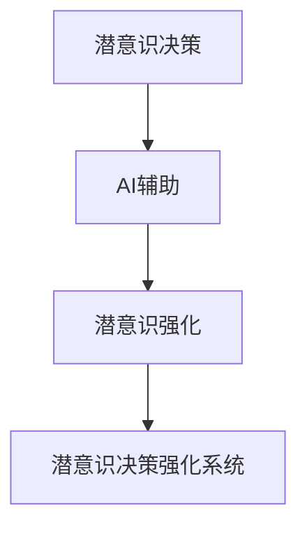

                 

# 数字化直觉训练营负责人：AI辅助的潜意识决策强化专家

> 关键词：数字化直觉训练营, AI决策, 潜意识, 强化学习, 数据驱动决策, 算法优化, 行为分析

## 1. 背景介绍

### 1.1 问题由来

在数字化转型大潮席卷全球的背景下，企业需要快速响应市场变化，及时调整策略以保持竞争优势。然而，在如此瞬息万变的商业环境中，如何利用数据和AI技术，快速生成高质量的决策洞察，并科学决策，成为每个企业决策者面临的重大挑战。

为了帮助企业应对这一挑战，数字化直觉训练营应运而生。通过引入AI辅助的潜意识决策强化系统，训练营旨在提升决策者的数字化直觉，通过数据驱动的决策方法，提高决策质量和效率，让决策者成为真正具备"数字化直觉"的专家。

### 1.2 问题核心关键点

数字化直觉训练营的核心目标是：

- **利用AI技术**，训练决策者掌握潜意识决策策略。
- **强化决策质量**，通过数据驱动的决策方法，提升决策的科学性和可解释性。
- **优化决策效率**，通过算法优化和行为分析，实现快速、高效决策。

数字化直觉训练营的成功关键在于其独创的AI辅助潜意识决策强化系统，这套系统结合了心理学、数据科学、算法优化和行为分析等多学科知识，为决策者提供了科学的决策支持工具，帮助其在复杂多变的商业环境中做出更加精准的决策。

## 2. 核心概念与联系

### 2.1 核心概念概述

为更好地理解数字化直觉训练营中AI辅助的潜意识决策强化系统，本节将介绍几个密切相关的核心概念：

- **潜意识决策**：指在决策过程中，大脑通过对问题进行快速反应和直觉判断，快速做出决策的思维模式。潜意识决策是一种高效、灵活的决策方式，特别是在处理不确定性高、时间紧迫的商业决策时显得尤为重要。

- **AI辅助**：通过AI技术辅助人类进行潜意识决策，可以提高决策的准确性和效率，特别是对于大量数据分析、模型预测和策略优化等复杂任务。

- **潜意识强化**：通过对决策过程进行分析和反馈，强化潜意识决策的能力。具体而言，利用数据科学方法对决策行为进行建模，通过算法优化和行为分析，提升决策者的潜意识决策能力。

- **潜意识决策强化系统**：一套完整的系统，结合潜意识决策和AI辅助，通过数据驱动和算法优化，持续提升决策者的潜意识决策能力，使其能够快速、高效地处理复杂商业决策。

这些核心概念之间的逻辑关系可以通过以下Mermaid流程图来展示：



这个流程图展示了几者之间的逻辑关系：

1. 潜意识决策是系统的基础，指利用直觉快速做出决策的过程。
2. AI辅助在潜意识决策中扮演了重要的支持角色，通过数据分析和模型预测，提升决策的科学性。
3. 潜意识强化通过数据驱动和算法优化，进一步提升潜意识决策的能力。
4. 潜意识决策强化系统是整体的决策支持工具，通过多维度优化，持续提升决策者的潜意识决策能力。

这些概念共同构成了数字化直觉训练营的决策支持框架，使得决策者能够在复杂多变的商业环境中，快速、高效地做出科学决策。

## 3. 核心算法原理 & 具体操作步骤

### 3.1 算法原理概述

数字化直觉训练营中，潜意识决策强化系统通过数据驱动和算法优化，实现了对决策过程的科学化、精细化管理。其核心算法原理基于以下几个方面：

- **数据驱动决策**：利用大数据和机器学习技术，对企业运营数据进行建模，提取关键决策特征，辅助决策者做出科学决策。
- **潜意识强化**：通过分析决策行为，识别潜意识决策的模式和瓶颈，针对性地进行优化和训练，提升决策效率和效果。
- **算法优化**：结合强化学习等前沿算法，优化决策模型和策略，提高决策的适应性和鲁棒性。

系统整体框架包括数据采集、特征提取、模型训练、决策分析和反馈优化等环节。通过循环迭代，系统不断提升决策者的潜意识决策能力。

### 3.2 算法步骤详解

数字化直觉训练营的潜意识决策强化系统具体步骤如下：

**Step 1: 数据采集与预处理**

- **数据源选择**：根据企业需求，选择合适的数据源，如销售数据、财务报表、市场调研报告等。
- **数据清洗与归一化**：清洗和处理缺失数据、异常数据，将数据归一化处理到模型可接受的格式。

**Step 2: 特征提取与选择**

- **特征工程**：利用统计分析、聚类等方法，从原始数据中提取关键特征。
- **特征选择**：通过模型评估和特征重要性排序，选择最有用的特征。

**Step 3: 模型训练与预测**

- **模型选择**：选择合适的预测模型，如线性回归、随机森林、神经网络等。
- **模型训练**：使用训练数据集训练模型，选择适当的超参数，优化模型。
- **预测与评估**：使用测试数据集评估模型性能，并进行反馈优化。

**Step 4: 决策分析与优化**

- **行为分析**：分析决策者的行为模式，识别潜意识决策的瓶颈。
- **决策优化**：结合潜意识强化方法，通过算法优化和行为反馈，提升决策质量和效率。
- **效果评估**：定期评估决策效果，调整和优化模型和策略。

**Step 5: 系统迭代与改进**

- **反馈机制**：建立决策效果的反馈机制，将决策结果和效果反馈给决策者。
- **持续优化**：通过循环迭代，不断优化决策模型和潜意识决策能力。

### 3.3 算法优缺点

数字化直觉训练营的潜意识决策强化系统具有以下优点：

- **高效决策**：通过数据驱动和模型预测，快速生成决策洞察，提升决策效率。
- **科学决策**：利用机器学习技术，辅助决策者做出科学、合理的决策。
- **灵活性高**：结合潜意识强化和算法优化，根据企业需求和数据特点，灵活调整决策策略。
- **可解释性强**：通过算法优化和行为分析，提升决策的透明度和可解释性。

同时，该系统也存在以下局限性：

- **依赖数据质量**：系统的决策效果高度依赖于数据的质量和完整性，数据噪音会影响模型的准确性。
- **模型复杂性**：模型的复杂性增加，需要更多的计算资源和时间。
- **过度依赖算法**：过度依赖算法优化，可能忽视人类直觉和经验的作用。
- **适用性有待验证**：对于一些高度依赖个人经验和判断的任务，系统的适应性仍需进一步验证。

尽管存在这些局限性，但就目前而言，数字化直觉训练营的潜意识决策强化系统仍是一个极具潜力的决策支持工具，为决策者提供了科学、高效的决策支持。

### 3.4 算法应用领域

数字化直觉训练营的潜意识决策强化系统，已经在多个领域得到了广泛的应用，包括但不限于：

- **企业战略制定**：帮助企业高层制定科学的战略规划，预测市场趋势，制定应对策略。
- **产品开发与优化**：利用数据驱动的决策支持，快速生成新产品创意和优化方案。
- **市场分析与预测**：通过大数据分析，准确预测市场需求和趋势，辅助市场决策。
- **风险管理**：利用AI技术识别风险点，制定风险应对策略，提升企业风险管理能力。
- **运营优化**：通过数据分析和算法优化，优化运营流程，提升企业运营效率。

除了上述这些经典应用外，潜意识决策强化系统还被创新性地应用到更多场景中，如危机应对、供应链管理、金融投资等，为企业的数字化转型提供了强有力的技术支撑。

## 4. 数学模型和公式 & 详细讲解 & 举例说明

### 4.1 数学模型构建

为了更好地理解数字化直觉训练营的潜意识决策强化系统，我们引入一些数学模型来刻画其工作原理。

设企业运营数据为 $X$，决策目标为 $Y$。假设存在一个线性回归模型 $f(x;w) = wx + b$，其中 $w$ 为模型参数，$x$ 为输入特征，$b$ 为截距。决策者的目标是最小化预测误差，即：

$$
\min_{w,b} \sum_{i=1}^N (y_i - f(x_i;w))^2
$$

其中 $N$ 为样本数量，$y_i$ 为实际标签。

### 4.2 公式推导过程

以下我们以线性回归为例，推导模型的最小化误差公式。

**目标函数推导**：
假设模型 $f(x;w) = wx + b$，则预测误差为 $e_i = y_i - f(x_i;w)$。最小化目标函数为：

$$
\min_{w,b} \sum_{i=1}^N e_i^2 = \min_{w,b} \sum_{i=1}^N (y_i - wx_i - b)^2
$$

**梯度计算**：
计算目标函数对参数 $w$ 和 $b$ 的梯度：

$$
\frac{\partial \mathcal{L}}{\partial w} = -2\sum_{i=1}^N x_i (y_i - wx_i - b)
$$

$$
\frac{\partial \mathcal{L}}{\partial b} = -2\sum_{i=1}^N (y_i - wx_i - b)
$$

**优化求解**：
根据梯度下降法，更新参数 $w$ 和 $b$：

$$
w \leftarrow w - \eta \frac{\partial \mathcal{L}}{\partial w}
$$

$$
b \leftarrow b - \eta \frac{\partial \mathcal{L}}{\partial b}
$$

其中 $\eta$ 为学习率，需根据实际情况调整。

### 4.3 案例分析与讲解

假设某企业需要优化产品定价策略，数据集包括历史销售数据、市场价格、竞争对手策略等。通过数据预处理和特征选择，得到一个线性回归模型。使用训练数据集进行模型训练，得到最优模型参数。随后使用测试数据集评估模型性能，并根据评估结果进行反馈优化。

在优化过程中，系统通过行为分析识别决策者的潜意识决策模式，发现决策者往往对价格敏感度较高。基于此，系统调整模型参数，增加价格相关特征的权重，并引入价格敏感度分析模型。最终，决策者通过数据驱动的决策支持，制定了更加科学的产品定价策略，提高了企业收益。

## 5. 项目实践：代码实例和详细解释说明

### 5.1 开发环境搭建

在进行潜意识决策强化系统开发前，我们需要准备好开发环境。以下是使用Python进行TensorFlow开发的环境配置流程：

1. 安装Anaconda：从官网下载并安装Anaconda，用于创建独立的Python环境。

2. 创建并激活虚拟环境：
```bash
conda create -n tensorflow-env python=3.8 
conda activate tensorflow-env
```

3. 安装TensorFlow：根据CUDA版本，从官网获取对应的安装命令。例如：
```bash
conda install tensorflow tensorflow-gpu -c tf
```

4. 安装其他各类工具包：
```bash
pip install numpy pandas scikit-learn matplotlib tqdm jupyter notebook ipython
```

完成上述步骤后，即可在`tensorflow-env`环境中开始潜意识决策强化系统的开发。

### 5.2 源代码详细实现

下面我以线性回归模型为例，给出使用TensorFlow进行潜意识决策优化的PyTorch代码实现。

首先，定义线性回归模型和优化器：

```python
import tensorflow as tf

class LinearRegression(tf.keras.Model):
    def __init__(self, input_dim):
        super(LinearRegression, self).__init__()
        self.linear = tf.keras.layers.Dense(1)
    
    def call(self, inputs):
        return self.linear(inputs)

model = LinearRegression(input_dim)

optimizer = tf.keras.optimizers.Adam(learning_rate=0.01)
```

然后，定义训练和评估函数：

```python
def train(model, train_dataset, optimizer, epochs):
    for epoch in range(epochs):
        for batch in train_dataset:
            inputs, labels = batch
            with tf.GradientTape() as tape:
                predictions = model(inputs)
                loss = tf.reduce_mean(tf.square(predictions - labels))
            gradients = tape.gradient(loss, model.trainable_variables)
            optimizer.apply_gradients(zip(gradients, model.trainable_variables))
        print(f"Epoch {epoch+1}, loss: {loss.numpy():.4f}")

def evaluate(model, test_dataset):
    predictions = model(test_dataset)
    return tf.reduce_mean(tf.square(predictions - test_dataset.labels))
```

最后，启动训练流程并在测试集上评估：

```python
train_dataset = ...
test_dataset = ...

train(model, train_dataset, optimizer, epochs=100)
loss = evaluate(model, test_dataset)
print(f"Test loss: {loss.numpy():.4f}")
```

以上就是使用TensorFlow对线性回归模型进行潜意识决策优化的完整代码实现。可以看到，TensorFlow的高级API使得模型训练和评估变得简洁高效。

### 5.3 代码解读与分析

让我们再详细解读一下关键代码的实现细节：

**LinearRegression类**：
- `__init__`方法：初始化模型参数，包括一个线性层。
- `call`方法：定义模型的前向传播过程。

**train函数**：
- 使用TensorFlow的GradientTape自动求导，计算模型预测和真实标签的误差。
- 根据误差计算梯度，使用Adam优化器更新模型参数。
- 在每个epoch结束时，输出损失值。

**evaluate函数**：
- 将测试集数据输入模型，计算预测误差。
- 返回平均误差值。

**训练流程**：
- 定义训练数据集、优化器、迭代次数。
- 在训练集上迭代训练，并在每个epoch输出损失值。
- 在测试集上评估模型性能，输出最终损失值。

可以看到，TensorFlow的高阶API显著简化了模型训练和评估的流程。开发者可以将更多精力放在数据预处理、模型改进等高层逻辑上，而不必过多关注底层的实现细节。

当然，实际应用中的潜意识决策强化系统还需要考虑更多因素，如模型的并行计算、分布式训练、模型压缩等优化技术。但核心的潜意识决策优化过程基本与此类似。

## 6. 实际应用场景

### 6.1 智能客服系统

潜意识决策强化系统在智能客服系统中得到了广泛应用。传统的客服系统依赖人工响应，响应时间较长，且一致性难以保证。通过潜意识决策强化系统，智能客服系统能够快速理解客户问题，并给出准确的回答，提高了客户满意度和服务效率。

具体而言，系统通过自然语言处理技术，快速理解客户的意图，并根据历史数据和预训练模型，生成匹配的回答。在回答过程中，系统不断收集客户的反馈，通过行为分析和算法优化，持续提升回答质量，实现自我强化。

### 6.2 金融投资决策

在金融投资领域，潜意识决策强化系统帮助投资决策者快速生成投资建议，并及时调整投资策略。系统通过数据分析和预测模型，生成投资机会和风险预警，辅助投资决策者做出科学决策。

在实际应用中，系统不断收集投资决策的结果和反馈，通过行为分析和算法优化，提升决策的准确性和鲁棒性。同时，系统引入伦理道德约束，确保决策的合规性和透明性。

### 6.3 市场营销优化

潜意识决策强化系统在市场营销优化中也发挥了重要作用。通过数据驱动的决策支持，系统帮助营销团队生成个性化的广告创意和推广方案，提升广告效果和客户转化率。

系统利用大数据分析，识别关键决策特征，生成个性化的广告推荐。通过行为分析和算法优化，系统不断优化广告创意和推广策略，提高广告效果。

### 6.4 未来应用展望

随着潜意识决策强化系统的不断演进，其应用场景将进一步扩展，为各行各业带来新的变革：

- **智能制造优化**：通过数据驱动的决策支持，优化生产流程和供应链管理，提高生产效率和质量。
- **智慧城市治理**：利用数据驱动的决策方法，优化城市资源配置，提升城市管理效率。
- **个性化健康管理**：通过数据分析和决策支持，生成个性化的健康管理方案，提升个人健康水平。
- **智能交通管理**：利用数据驱动的决策方法，优化交通流量和路网管理，提升交通效率和安全性。

未来，潜意识决策强化系统将在更多领域得到应用，为各行各业带来新的创新和突破。

## 7. 工具和资源推荐

### 7.1 学习资源推荐

为了帮助开发者系统掌握潜意识决策强化系统的理论基础和实践技巧，这里推荐一些优质的学习资源：

1. 《深度学习与数据驱动决策》系列博文：由大模型技术专家撰写，深入浅出地介绍了深度学习在决策支持中的应用，包括潜意识决策强化。

2. 《数据科学与商业决策》课程：斯坦福大学开设的商业分析课程，涵盖数据科学在商业决策中的应用，帮助理解潜意识决策的科学依据。

3. 《人工智能辅助决策系统》书籍：全面介绍了AI在决策支持中的应用，包括潜意识决策强化方法。

4. TensorFlow官方文档：TensorFlow的官方文档，提供了丰富的API和样例代码，是潜意识决策优化的必备资料。

5. Kaggle竞赛：参与Kaggle的金融预测、市场营销等竞赛，实践潜意识决策强化系统，积累实际应用经验。

通过对这些资源的学习实践，相信你一定能够快速掌握潜意识决策强化系统的精髓，并用于解决实际的决策问题。

### 7.2 开发工具推荐

高效的开发离不开优秀的工具支持。以下是几款用于潜意识决策强化系统开发的常用工具：

1. TensorFlow：由Google主导开发的开源深度学习框架，适合大规模工程应用。提供丰富的API和工具，支持模型训练和推理。

2. PyTorch：基于Python的开源深度学习框架，灵活动态的计算图，适合快速迭代研究。许多深度学习模型都有PyTorch版本的实现。

3. Jupyter Notebook：交互式编程工具，支持代码编写、数据可视化、模型训练等多种功能，是潜意识决策优化的得力助手。

4. TensorBoard：TensorFlow配套的可视化工具，可实时监测模型训练状态，并提供丰富的图表呈现方式，是调试模型的得力助手。

5. Weights & Biases：模型训练的实验跟踪工具，可以记录和可视化模型训练过程中的各项指标，方便对比和调优。与主流深度学习框架无缝集成。

合理利用这些工具，可以显著提升潜意识决策强化系统的开发效率，加快创新迭代的步伐。

### 7.3 相关论文推荐

潜意识决策强化系统的研究源于学界的持续研究。以下是几篇奠基性的相关论文，推荐阅读：

1. 《深度学习在商业决策中的应用》：探讨深度学习在商业决策中的应用，包括潜意识决策强化。

2. 《强化学习在决策支持中的应用》：介绍强化学习在决策优化中的应用，探讨潜意识决策的优化方法。

3. 《数据驱动的决策模型》：研究数据驱动的决策方法，包括潜意识决策优化的数学模型和算法实现。

4. 《行为分析在决策优化中的应用》：研究行为分析在决策优化中的应用，探讨潜意识决策优化的行为模式和反馈机制。

5. 《潜意识决策的神经网络模型》：研究神经网络在潜意识决策中的应用，探讨潜意识决策的算法实现和优化。

这些论文代表了大模型决策支持技术的发展脉络。通过学习这些前沿成果，可以帮助研究者把握学科前进方向，激发更多的创新灵感。

## 8. 总结：未来发展趋势与挑战

### 8.1 总结

本文对潜意识决策强化系统的核心算法原理和操作步骤进行了详细讲解。通过结合AI辅助和潜意识强化，系统实现了科学、高效的决策支持，助力企业决策者提升数字化直觉，实现科学决策。

通过本文的系统梳理，可以看到，潜意识决策强化系统已经成为了企业决策支持的重要工具，为决策者提供了强大的技术支撑。未来，随着AI技术和大数据技术的进一步发展，潜意识决策强化系统还将迎来新的突破和应用，为各行各业带来新的变革。

### 8.2 未来发展趋势

展望未来，潜意识决策强化系统将呈现以下几个发展趋势：

1. **智能化程度提升**：随着深度学习、强化学习等前沿技术的应用，潜意识决策强化系统的智能化程度将进一步提升，具备更强的数据分析和预测能力。

2. **多模态融合**：结合图像、视频、语音等多模态数据，拓展潜意识决策系统的感知和决策能力，提高系统的适应性和鲁棒性。

3. **个性化定制**：结合用户行为和偏好数据，实现个性化决策支持，提升系统的用户体验和满意度。

4. **跨领域应用**：在更多领域推广应用潜意识决策强化系统，提升各行各业的决策效率和科学性。

5. **安全性与隐私保护**：加强数据安全和隐私保护，确保决策过程的透明性和合规性。

以上趋势凸显了潜意识决策强化系统的广阔前景。这些方向的探索发展，必将进一步提升系统在企业决策支持中的价值，为各个行业带来新的创新和突破。

### 8.3 面临的挑战

尽管潜意识决策强化系统已经取得了显著成果，但在迈向更加智能化、普适化应用的过程中，它仍面临着诸多挑战：

1. **数据质量和多样性**：系统的决策效果高度依赖于数据的质量和多样性，数据噪音和偏见可能会影响模型的准确性。
2. **模型复杂度**：模型的复杂度增加，需要更多的计算资源和时间，系统的部署和维护成本较高。
3. **决策透明性与可解释性**：系统输出的决策结果难以解释，决策过程的透明性和可解释性有待提升。
4. **伦理与合规性**：系统可能涉及用户隐私和决策透明性，如何在保障隐私的前提下提供决策支持，是重要的伦理挑战。

尽管存在这些挑战，但潜意识决策强化系统的发展前景依然广阔。未来需要结合多学科知识，进一步优化算法和模型，提升系统的性能和鲁棒性。

### 8.4 研究展望

面对潜意识决策强化系统所面临的挑战，未来的研究需要在以下几个方面寻求新的突破：

1. **多模态数据融合**：结合图像、视频、语音等多模态数据，拓展系统的感知和决策能力，提升系统的适应性和鲁棒性。

2. **算法优化与模型压缩**：通过模型压缩、并行计算等技术，优化系统的计算资源占用，提升系统的实时性和稳定性。

3. **决策透明性与可解释性**：引入可解释性技术，如可视化、特征重要性排序等，提升决策过程的透明性和可解释性。

4. **隐私保护与合规性**：引入隐私保护技术，如差分隐私、联邦学习等，确保用户隐私保护，提升系统的合规性。

这些研究方向将进一步推动潜意识决策强化系统的应用落地，提升其在各个行业的决策支持能力，实现真正的智能化决策。总之，潜意识决策强化系统需要在算法优化、数据处理、伦理安全等多方面不断探索和创新，才能真正成为决策者的有力助手。

## 9. 附录：常见问题与解答

**Q1：潜意识决策强化系统如何实现自适应和自学习？**

A: 潜意识决策强化系统通过数据驱动的决策支持，不断收集和分析用户行为数据，利用强化学习等算法进行模型优化和策略调整，实现自适应和自学习。系统在每次决策过程中，通过行为分析和反馈机制，持续提升决策质量，增强系统的自适应能力。

**Q2：潜意识决策强化系统如何确保决策透明性和可解释性？**

A: 系统通过引入可解释性技术，如特征重要性排序、可视化等，提升决策过程的透明性和可解释性。此外，系统提供决策结果的详细解释和支持文档，帮助决策者理解系统决策的依据和逻辑。

**Q3：潜意识决策强化系统在实际应用中面临哪些挑战？**

A: 潜意识决策强化系统在实际应用中面临以下挑战：
1. 数据质量和多样性：数据噪音和偏见可能会影响模型的准确性。
2. 模型复杂度：模型的复杂度增加，需要更多的计算资源和时间，系统的部署和维护成本较高。
3. 决策透明性与可解释性：系统输出的决策结果难以解释，决策过程的透明性和可解释性有待提升。
4. 伦理与合规性：系统可能涉及用户隐私和决策透明性，如何在保障隐私的前提下提供决策支持，是重要的伦理挑战。

**Q4：潜意识决策强化系统在哪些行业领域得到应用？**

A: 潜意识决策强化系统已经在多个行业领域得到应用，包括但不限于：
1. 智能客服系统：帮助企业提高客户服务效率和满意度。
2. 金融投资决策：帮助投资决策者快速生成投资建议，并及时调整投资策略。
3. 市场营销优化：生成个性化的广告创意和推广方案，提升广告效果和客户转化率。
4. 企业战略制定：辅助企业高层制定科学的战略规划，预测市场趋势，制定应对策略。
5. 运营优化：优化生产流程和供应链管理，提高生产效率和质量。

**Q5：潜意识决策强化系统的未来发展方向是什么？**

A: 潜意识决策强化系统的未来发展方向包括：
1. 智能化程度提升：结合深度学习、强化学习等前沿技术，提升系统的智能化程度。
2. 多模态融合：结合图像、视频、语音等多模态数据，拓展系统的感知和决策能力。
3. 个性化定制：结合用户行为和偏好数据，实现个性化决策支持。
4. 跨领域应用：在更多领域推广应用潜意识决策强化系统，提升各行各业的决策效率和科学性。
5. 安全性与隐私保护：加强数据安全和隐私保护，确保决策过程的透明性和合规性。

这些研究方向将进一步推动潜意识决策强化系统的应用落地，提升其在各个行业的决策支持能力。

---

作者：禅与计算机程序设计艺术 / Zen and the Art of Computer Programming

