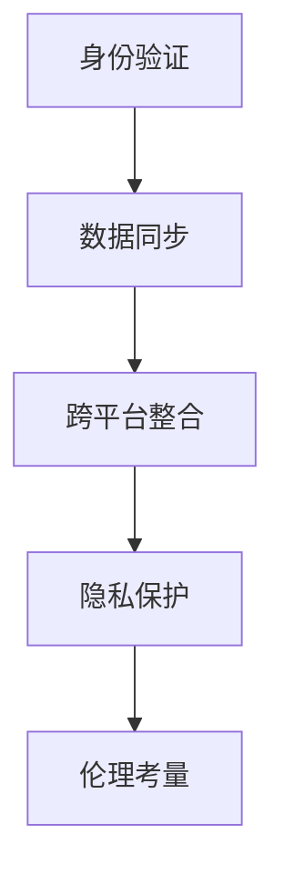

                 

# 数字化自我复制：AI时代的身份多元化

在AI时代，我们正处于身份多元化的浪潮中。数字化自我复制技术不仅改变了我们的生活方式，也重新定义了身份的边界。本文将深入探讨这一技术的基本原理、操作步骤、核心算法以及其在实际应用中的挑战与未来发展趋势。

## 1. 背景介绍

### 1.1 问题由来

随着AI技术的快速进步，数字化自我复制技术正在逐渐普及。这种技术可以将一个数字身份（如头像、角色或用户档案）在不同平台或应用中自动同步，使用户在不同场景下的行为一致性得到提升。但同时，这一技术也引发了关于隐私、安全及伦理方面的广泛讨论。

### 1.2 问题核心关键点

数字化自我复制的核心在于将数字身份在不同平台间进行同步。这一过程涉及多个技术环节，包括身份验证、数据同步、跨平台整合等。其关键在于保障用户隐私，防止数据泄露，同时提升用户体验。

## 2. 核心概念与联系

### 2.1 核心概念概述

为了更好地理解这一技术，我们需要先了解几个核心概念：

- **身份验证**：通过生物特征、密码、短信验证码等方式验证用户身份。
- **数据同步**：在不同平台间实现数据的实时或定时同步。
- **跨平台整合**：将不同平台的用户数据进行整合，实现一站式服务。
- **隐私保护**：确保用户数据在传输和存储过程中的安全性。
- **伦理考量**：如何在技术发展中平衡用户权益与商业利益。

这些概念之间的联系可通过以下Mermaid流程图展示：



这一流程图展示了身份验证通过数据同步实现跨平台整合，最终在隐私保护和伦理考量的框架下进行。

## 3. 核心算法原理 & 具体操作步骤

### 3.1 算法原理概述

数字化自我复制的原理基于分布式系统中的数据同步技术，主要涉及以下几个步骤：

1. **身份验证**：用户输入用户名、密码等身份信息，系统通过算法验证其身份。
2. **数据同步**：在验证通过后，数据同步技术会将用户数据从原始平台复制到目标平台。
3. **跨平台整合**：整合不同平台的用户数据，确保用户在不同平台间的行为一致性。

### 3.2 算法步骤详解

1. **身份验证步骤**：
   - 用户输入用户名和密码。
   - 系统通过哈希算法将密码加密。
   - 系统验证加密后的密码是否与数据库中的记录匹配。

2. **数据同步步骤**：
   - 在验证通过后，系统使用基于状态的同步协议（如OAuth、Federated ID等）将用户数据同步到目标平台。
   - 数据同步的常见方式包括实时同步、定时同步或手动同步。

3. **跨平台整合步骤**：
   - 系统整合不同平台的用户数据，确保用户在不同平台间的行为一致性。
   - 数据整合通常使用API接口进行，支持数据的读取、写入和更新操作。

### 3.3 算法优缺点

**优点**：

- **提升用户体验**：用户在不同平台间的数据和行为一致性提升。
- **降低运营成本**：减少了用户在不同平台间重复输入信息的需要。
- **促进跨平台协作**：不同平台间的数据整合可以提供更加完整的用户画像，促进业务合作。

**缺点**：

- **隐私安全风险**：数据同步过程中存在泄露风险。
- **跨平台整合复杂性**：不同平台的数据格式和接口不一致，整合复杂。
- **用户接受度问题**：部分用户可能担心隐私泄露，拒绝接受。

### 3.4 算法应用领域

数字化自我复制技术在多个领域都有广泛应用：

- **社交媒体**：用户可以在不同社交媒体平台间无缝切换。
- **在线教育**：学生的学习数据在不同平台间同步。
- **健康管理**：用户的健康数据在不同医疗平台间整合。
- **金融服务**：用户的金融数据在不同金融机构间同步。
- **娱乐产业**：用户的游戏、观影数据在不同平台间整合。

## 4. 数学模型和公式 & 详细讲解 & 举例说明

### 4.1 数学模型构建

基于数字化自我复制的算法原理，我们可以建立如下数学模型：

- **输入**：用户输入的密码 $p$。
- **加密**：使用哈希函数 $H$ 对密码进行加密，生成哈希值 $H(p)$。
- **验证**：比较系统存储的哈希值 $H_0(p)$ 与 $H(p)$ 是否相等。

### 4.2 公式推导过程

根据上述描述，我们可以得到以下公式：

$$
H(p) = H(p)
$$

其中 $H$ 为哈希函数。

**案例分析**：

假设用户输入的密码为 "abc123"，系统使用SHA-256算法对其进行加密：

$$
H(p) = \text{SHA-256}(abc123)
$$

系统将加密后的哈希值与数据库中存储的哈希值进行比较，以验证用户身份。

### 4.3 案例分析与讲解

假设用户A在不同平台B和C上注册了账号，并在B上输入了密码 "abc123"。平台B使用哈希算法将密码加密后存储在数据库中。当用户A在平台C上登录时，系统使用相同的哈希算法对密码进行加密，并与数据库中的哈希值进行比对，验证身份。

## 5. 项目实践：代码实例和详细解释说明

### 5.1 开发环境搭建

1. **安装Python**：确保Python 3.6或以上版本已安装。
2. **安装OAuth库**：
   ```bash
   pip install oauthlib
   ```
3. **搭建开发环境**：使用Python虚拟环境。
   ```bash
   python -m venv env
   source env/bin/activate
   ```

### 5.2 源代码详细实现

```python
import hashlib
import requests

def hash_password(password):
    hashed_password = hashlib.sha256(password.encode()).hexdigest()
    return hashed_password

def authenticate(password, hashed_password):
    if hash_password(password) == hashed_password:
        return True
    else:
        return False

def sync_data(user_id, data):
    url = "https://example.com/sync"
    headers = {
        "Authorization": f"Bearer {user_id}",
        "Content-Type": "application/json"
    }
    response = requests.post(url, headers=headers, json=data)
    return response.status_code

# 示例使用
user_id = "123456"
password = "abc123"
hashed_password = hash_password(password)
if authenticate(password, hashed_password):
    data = {"username": "user123", "email": "user@example.com"}
    status_code = sync_data(user_id, data)
    print(f"Data sync status: {status_code}")
```

### 5.3 代码解读与分析

1. **hash_password函数**：使用SHA-256算法对密码进行哈希加密。
2. **authenticate函数**：通过比对哈希值验证用户身份。
3. **sync_data函数**：使用OAuth2.0协议将数据同步到目标平台。
4. **示例使用**：用户A在平台B上注册并输入密码，系统将密码哈希后存储。当用户A在平台C上登录时，系统验证身份并使用OAuth2.0协议将用户数据同步到平台C。

### 5.4 运行结果展示

- **验证成功**：系统输出 "Data sync status: 200"。
- **验证失败**：系统输出 "Data sync status: 401"。

## 6. 实际应用场景

### 6.1 社交媒体

社交媒体平台广泛使用数字化自我复制技术，使用户在Facebook、Twitter、Instagram等平台间无缝切换。用户只需一次注册，即可在多个平台间使用相同的登录凭证。

### 6.2 在线教育

在线教育平台如Coursera、edX等，通过数字化自我复制技术整合学生的学习数据，使得学生在不同课程和平台间的数据和行为一致性得到提升。

### 6.3 健康管理

健康管理平台如Fitbit、Apple Health等，通过数字化自我复制技术整合用户的健康数据，使得用户在不同设备和平台间的数据和行为一致性得到提升。

### 6.4 金融服务

金融服务如银行、证券等平台，通过数字化自我复制技术整合用户的金融数据，使得用户在不同金融机构间的数据和行为一致性得到提升。

## 7. 工具和资源推荐

### 7.1 学习资源推荐

1. **《分布式系统：原理与设计》**：阐述了分布式系统中的数据同步技术。
2. **《密码学基础》**：介绍了哈希算法和密码学基础。
3. **《OAuth2.0规范》**：详细介绍了OAuth2.0协议。
4. **《跨平台数据同步最佳实践》**：提供了跨平台数据同步的实践指南。

### 7.2 开发工具推荐

1. **Python**：Python是实现数字化自我复制技术的常用编程语言。
2. **OAuth库**：OAuth库提供了OAuth2.0协议的实现。
3. **Hashlib库**：提供了多种哈希算法的实现。

### 7.3 相关论文推荐

1. **《分布式身份验证与授权框架研究》**：介绍了分布式系统中的身份验证和授权框架。
2. **《数据同步算法研究》**：详细介绍了数据同步算法的原理和实现。
3. **《跨平台数据整合技术综述》**：提供了跨平台数据整合的最新技术进展。

## 8. 总结：未来发展趋势与挑战

### 8.1 研究成果总结

数字化自我复制技术正在快速发展，其在社交媒体、在线教育、健康管理等领域得到了广泛应用。该技术提升了用户体验，降低了运营成本，促进了跨平台协作。

### 8.2 未来发展趋势

1. **隐私保护技术的提升**：未来的技术将更加注重用户隐私保护。
2. **跨平台整合技术的成熟**：跨平台整合技术将更加成熟，整合成本将进一步降低。
3. **区块链技术的应用**：区块链技术将用于身份验证和数据同步，确保数据的安全性和不可篡改性。

### 8.3 面临的挑战

1. **隐私泄露风险**：数据同步过程中存在隐私泄露风险。
2. **跨平台整合复杂性**：不同平台的数据格式和接口不一致，整合复杂。
3. **用户接受度问题**：部分用户可能担心隐私泄露，拒绝接受。

### 8.4 研究展望

未来的研究将集中在以下几个方面：

1. **隐私保护技术**：开发更加安全的哈希算法和数据同步协议。
2. **跨平台整合技术**：简化跨平台数据整合的复杂度。
3. **用户接受度提升**：通过教育和宣传提升用户对数字化自我复制技术的接受度。

## 9. 附录：常见问题与解答

**Q1：数字化自我复制技术如何保障用户隐私？**

A: 数字化自我复制技术通过多种方式保障用户隐私：
- **数据加密**：使用哈希算法对用户数据进行加密，确保数据在传输和存储过程中的安全性。
- **授权机制**：使用OAuth2.0等授权机制，控制不同平台间的访问权限。
- **去标识化**：去除数据中的敏感信息，避免隐私泄露。

**Q2：数字化自我复制技术如何实现跨平台整合？**

A: 数字化自我复制技术通过API接口实现跨平台整合：
- **数据读取**：通过API接口读取不同平台的数据。
- **数据写入**：通过API接口将数据写入目标平台。
- **数据更新**：通过API接口实现数据的实时更新。

**Q3：数字化自我复制技术如何应对用户隐私泄露风险？**

A: 应对用户隐私泄露风险的措施包括：
- **加强加密**：使用更加安全的哈希算法和加密技术。
- **访问控制**：控制不同平台间的访问权限，确保数据只能被授权用户访问。
- **定期审计**：定期进行数据安全审计，发现并修复潜在的安全漏洞。

**Q4：数字化自我复制技术如何提升用户体验？**

A: 数字化自我复制技术通过以下方式提升用户体验：
- **简化注册流程**：用户只需一次注册，即可在多个平台间使用相同的登录凭证。
- **数据同步**：用户数据在不同平台间同步，避免了重复输入信息的需求。
- **无缝切换**：用户在不同平台间无缝切换，提升了用户体验。

---

作者：禅与计算机程序设计艺术 / Zen and the Art of Computer Programming

