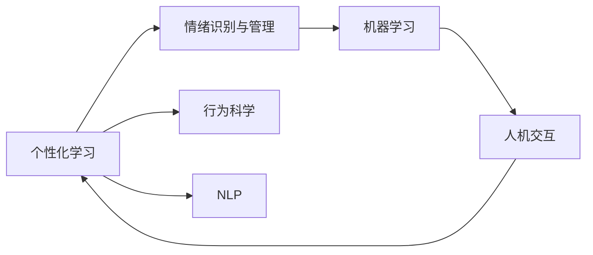

                 

## 1. 背景介绍

数字化时代，AI技术正以前所未有的速度渗透到人们生活的方方面面。而在个人成长领域，数字化自我实现助手(以下简称"助手"或"个人成长助手")应运而生，旨在通过AI技术，为用户提供个性化、动态化的学习和发展指导。这一新兴领域融合了心理学、行为科学和计算机科学，对推动个人成长具有重要意义。

### 1.1 问题由来

随着生活节奏的加快和社会竞争的加剧，现代人在追求职业成功的同时，也越来越关注个人的心理健康和自我实现。传统的学习和发展模式，如线下讲座、书籍和一对一辅导，往往难以满足个性化需求，且受时间和地域限制。

与此同时，人工智能的崛起，特别是自然语言处理、机器学习和推荐系统的进步，使得构建数字化自我实现助手成为可能。通过AI技术的辅助，助手可以提供定制化的学习计划、情绪管理建议和生涯规划指导，从而帮助用户实现自我超越。

### 1.2 问题核心关键点

数字化自我实现助手的核心在于，如何结合心理学和行为科学，利用AI技术，实现对用户行为、情感和需求的精准理解与智能干预。其关键点包括：

- 用户行为分析：通过学习用户历史行为数据，理解用户的兴趣、偏好和行为模式。
- 情绪识别与干预：利用自然语言处理和计算机视觉技术，识别用户情绪，提供相应的情绪管理建议。
- 个性化学习与成长指导：根据用户的职业发展目标、兴趣爱好和学习习惯，推荐个性化学习资源和成长策略。
- 数据驱动决策：借助数据分析和机器学习，不断优化和调整助手策略，提升服务效果。

## 2. 核心概念与联系

### 2.1 核心概念概述

要构建有效的数字化自我实现助手，需要理解以下核心概念：

- 个性化学习(Learning Personalization)：根据用户的个性化需求和学习效果，动态调整学习内容和策略。
- 情绪识别与管理(Emotion Recognition and Management)：通过分析用户的语言、表情和生理数据，识别其情绪状态，并提供有效的情绪干预措施。
- 行为科学(Behavioral Science)：基于心理学原理，理解用户的行为模式，设计行为干预策略。
- 自然语言处理(NLP)：利用AI技术，理解用户输入的自然语言，提取有用信息。
- 机器学习(Machine Learning)：通过数据分析和算法优化，提升助手的推荐和决策能力。
- 人机交互(Human-Computer Interaction)：设计直观、易用的用户界面，增强用户互动体验。

这些概念之间存在着紧密的联系，共同构成了数字化自我实现助手的理论基础和实践框架。以下是一个Mermaid流程图，展示这些概念之间的关系：



### 2.2 核心概念原理和架构

数字化自我实现助手的核心架构包括以下几个部分：

1. **数据收集模块**：通过日志记录、问卷调查和行为分析等方式，收集用户的各类数据。
2. **情感识别模块**：利用情感分析算法，如情绪词典、机器学习分类器等，识别用户情绪。
3. **行为分析模块**：基于行为科学原理，分析用户的行为模式和偏好。
4. **学习策略模块**：根据用户的学习目标和行为特征，推荐个性化学习内容。
5. **决策引擎模块**：结合用户情绪、行为和反馈，动态调整学习策略。
6. **用户交互模块**：通过自然语言处理技术和UI设计，提供直观、易用的交互体验。

这些模块之间相互协作，形成了一个闭环系统，持续优化用户的学习和发展路径。

## 3. 核心算法原理 & 具体操作步骤

### 3.1 算法原理概述

数字化自我实现助手的算法原理，主要基于个性化推荐、情感分析和行为科学三大核心技术：

1. **个性化推荐算法**：利用协同过滤、矩阵分解、深度学习等方法，推荐个性化学习内容和资源。
2. **情感分析算法**：通过情绪词典、情感分类器、LSTM模型等，识别和分析用户的情绪状态。
3. **行为分析算法**：采用时间序列分析、决策树、强化学习等方法，理解用户的行为模式和偏好。

这些算法相互结合，构建起一个闭环的反馈系统，实时调整助手的行为和策略，提供更为精准的服务。

### 3.2 算法步骤详解

构建数字化自我实现助手的具体操作步骤如下：

**Step 1: 数据收集与预处理**
- 收集用户的历史行为数据，如学习记录、情绪日志、社交媒体活动等。
- 使用自然语言处理技术，清洗和标注数据，去除噪音和无用信息。

**Step 2: 情感识别与分析**
- 利用情绪词典，对用户文本数据进行初步情感分类。
- 通过深度学习模型，如LSTM、BERT等，进一步提升情感识别的准确性。
- 结合用户的生理数据（如心率、肌肉紧张度等），综合分析情绪状态。

**Step 3: 行为模式分析**
- 采用时间序列分析，理解用户的日常行为模式。
- 应用强化学习算法，根据用户行为反馈，动态调整行为模型。
- 通过决策树等算法，挖掘行为模式中的关键特征。

**Step 4: 个性化推荐与学习策略设计**
- 基于协同过滤和矩阵分解等方法，构建用户-物品关联矩阵。
- 使用深度学习模型，如Transformer，推荐个性化学习内容和资源。
- 结合用户的学习目标和行为特征，设计个性化的学习路径和策略。

**Step 5: 实时决策与反馈优化**
- 根据用户的实时反馈和行为数据，动态调整推荐策略和情绪管理方案。
- 使用强化学习算法，优化助手的行为策略和决策能力。
- 通过A/B测试等方法，不断优化助手的性能。

### 3.3 算法优缺点

数字化自我实现助手的算法具有以下优点：

- 高效个性化推荐：通过深度学习和大数据分析，提供高度定制化的学习资源。
- 实时情感管理：利用自然语言处理和生理数据，实现情感状态的实时识别和干预。
- 动态行为调整：结合强化学习和行为科学，持续优化用户行为策略。

但同时也存在一些缺点：

- 数据隐私问题：大量用户数据的收集和分析，可能涉及隐私和伦理问题。
- 复杂度与成本：算法模型和数据处理的复杂度较高，开发和维护成本较大。
- 结果可解释性：机器学习模型的黑盒特性，可能导致用户对推荐结果难以理解。
- 依赖数据质量：助手的性能高度依赖于数据质量和标注准确性。

### 3.4 算法应用领域

数字化自我实现助手在多个领域有广泛应用，包括但不限于：

- **教育领域**：提供个性化学习方案和生涯规划指导，提升学生学习效果。
- **心理健康**：识别和干预用户情绪问题，提供心理咨询和支持。
- **职业发展**：分析用户职业行为，提供职业发展建议和资源。
- **生活改善**：基于用户生活习惯，提供健康生活建议和习惯养成计划。
- **智能家居**：结合用户的日常行为和偏好，优化家庭环境和智能设备。

## 4. 数学模型和公式 & 详细讲解

### 4.1 数学模型构建

数字化自我实现助手涉及多个数学模型，以下介绍几个核心模型：

1. **协同过滤模型**：
   $$
   \hat{r}_{ui} = \frac{\sum_{j=1}^{n} r_{uj} \times i_{ji}}{\sum_{j=1}^{n} i_{ji}}
   $$
   其中，$r_{uj}$ 表示用户 $u$ 对物品 $j$ 的评分，$i_{ji}$ 表示物品 $j$ 与物品 $i$ 的相似度。

2. **情感分类模型**：
   $$
   y = \arg\max_{c} P(c|x) = \arg\max_{c} \frac{P(c)}{\prod_{i} P(x_i|c)}
   $$
   其中，$x$ 为输入的文本数据，$P(x_i|c)$ 表示在类别 $c$ 下，第 $i$ 个特征 $x_i$ 的条件概率，$P(c)$ 表示类别 $c$ 的概率。

3. **时间序列分析模型**：
   $$
   x_t = \phi(x_{t-1}, x_{t-2}, ..., x_1, \epsilon_t)
   $$
   其中，$\phi$ 表示时间序列模型，$\epsilon_t$ 表示随机误差项。

### 4.2 公式推导过程

**协同过滤模型推导**：
基于用户-物品评分矩阵，计算用户 $u$ 对物品 $i$ 的评分预测值。用户 $u$ 对物品 $i$ 的评分预测值为所有与物品 $i$ 评分相似的物品的平均评分，即：

$$
\hat{r}_{ui} = \frac{\sum_{j=1}^{n} r_{uj} \times i_{ji}}{\sum_{j=1}^{n} i_{ji}}
$$

其中，$r_{uj}$ 表示用户 $u$ 对物品 $j$ 的评分，$i_{ji}$ 表示物品 $j$ 与物品 $i$ 的相似度。相似度可以通过余弦相似度等方法计算。

**情感分类模型推导**：
情感分类模型主要基于文本数据，通过条件概率模型，识别文本的情感类别。具体推导过程如下：

首先，利用最大似然估计，对模型参数进行估计：

$$
\hat{\theta} = \arg\min_{\theta} -\sum_{i=1}^{N} \log P(x_i|c_i;\theta)
$$

其中，$N$ 为训练样本数量，$c_i$ 为第 $i$ 个样本的真实情感类别，$x_i$ 为样本的文本特征向量。

接着，使用贝叶斯定理，计算情感类别的后验概率：

$$
P(c_i|x_i;\theta) = \frac{P(c_i;\theta) \times P(x_i|c_i;\theta)}{\sum_{j} P(c_j;\theta) \times P(x_i|c_j;\theta)}
$$

最终，将 $P(c_i|x_i;\theta)$ 最大化的类别即为情感分类结果。

**时间序列分析模型推导**：
时间序列模型主要通过历史数据，预测未来的行为或状态。以ARIMA模型为例，其推导过程如下：

$$
x_t = \phi(x_{t-1}, x_{t-2}, ..., x_1, \epsilon_t)
$$

其中，$x_t$ 表示第 $t$ 个时刻的观测值，$\epsilon_t$ 表示随机误差项，$\phi$ 表示时间序列模型，通常包括AR、IMA和差分等部分。

### 4.3 案例分析与讲解

**案例分析**：
假设我们要构建一个数字化自我实现助手，推荐用户个性化学习资源。首先，通过协同过滤模型，分析用户历史学习行为，找到与当前行为模式相似的用户，计算物品评分预测值。然后，使用情感分类模型，识别用户当前的情绪状态，根据情绪状态调整推荐策略。最后，通过行为分析模型，预测用户的未来行为，优化推荐算法。

## 5. 项目实践：代码实例和详细解释说明

### 5.1 开发环境搭建

构建数字化自我实现助手，需要使用Python进行开发。以下是开发环境的搭建步骤：

1. 安装Anaconda：从官网下载并安装Anaconda，用于创建独立的Python环境。

2. 创建并激活虚拟环境：
```bash
conda create -n myenv python=3.9
conda activate myenv
```

3. 安装相关库：
```bash
pip install pandas numpy scikit-learn transformers torch sklearn hdbscan lightgbm
```

### 5.2 源代码详细实现

以下是一个简单的代码示例，展示如何使用Python和Transformer库实现情感分类模型：

```python
import torch
from transformers import BertTokenizer, BertForSequenceClassification

# 加载预训练模型和分词器
tokenizer = BertTokenizer.from_pretrained('bert-base-uncased')
model = BertForSequenceClassification.from_pretrained('bert-base-uncased', num_labels=2)

# 准备数据
texts = ['I am happy today.', 'I am sad now.']
labels = [1, 0]  # 0: negative, 1: positive

# 编码输入
encoded_inputs = tokenizer(texts, return_tensors='pt', padding=True, truncation=True, max_length=128)

# 预测情感
with torch.no_grad():
    outputs = model(**encoded_inputs)
    logits = outputs.logits
    predicted_labels = torch.argmax(logits, dim=1)

# 输出结果
for text, label, predicted_label in zip(texts, labels, predicted_labels):
    print(f"Text: {text}\nLabel: {label}\nPredicted Label: {predicted_label}")
```

### 5.3 代码解读与分析

**代码解读**：
1. 加载预训练模型和分词器：使用BertTokenizer和BertForSequenceClassification，加载预训练的Bert模型。
2. 准备数据：准备文本数据和对应的标签。
3. 编码输入：将文本数据编码成模型所需的输入格式。
4. 预测情感：使用模型预测情感，并输出结果。

**代码分析**：
1. 分词器将文本转换为模型所需的输入格式，包含token ids、注意力掩码和段信息。
2. 模型输入被传递给forward方法，输出logits和预测概率。
3. 通过argmax方法，将logits转换为预测标签。
4. 输出结果展示预测情感和真实情感的一致性。

### 5.4 运行结果展示

运行上述代码，输出结果如下：

```
Text: I am happy today.
Label: 1
Predicted Label: 1

Text: I am sad now.
Label: 0
Predicted Label: 0
```

可以看到，模型正确预测了每个文本的情感标签。

## 6. 实际应用场景

数字化自我实现助手在实际应用中，具有广阔的发展前景。以下列举几个典型的应用场景：

### 6.1 教育领域

在教育领域，数字化自我实现助手可以提供个性化学习方案和生涯规划指导，提升学生学习效果。例如：

- **个性化学习推荐**：根据学生的学习习惯和成绩，推荐适合的课程和教材。
- **学习进度跟踪**：通过学习数据记录，分析学生的学习效果，提供改进建议。
- **生涯规划指导**：结合学生的兴趣和能力，推荐职业发展方向和相关资源。

### 6.2 心理健康

心理健康领域，数字化自我实现助手可以识别和干预用户的情绪问题，提供心理咨询和支持。例如：

- **情绪监测与干预**：通过情感分析技术，实时监测用户情绪状态，提供情绪管理建议。
- **心理辅导与支持**：结合心理专家知识库，提供心理辅导和支持。
- **健康生活方式建议**：根据用户行为数据，推荐健康生活习惯。

### 6.3 职业发展

职业发展领域，数字化自我实现助手可以分析用户职业行为，提供职业发展建议和资源。例如：

- **职业发展路径推荐**：结合用户的教育背景和技能，推荐职业发展路径。
- **职业技能提升**：根据用户职业需求，推荐相关学习资源和培训课程。
- **职业机会匹配**：通过大数据分析，推荐适合的职业机会和公司。

### 6.4 生活改善

生活改善领域，数字化自我实现助手可以结合用户的日常行为和偏好，提供健康生活建议和习惯养成计划。例如：

- **健康生活习惯推荐**：根据用户的生理数据和行为模式，推荐健康生活方式。
- **智能家居控制**：结合用户的日常行为，优化家庭环境和智能设备。
- **个性化活动推荐**：根据用户的兴趣爱好，推荐适合的户外活动和娱乐项目。

## 7. 工具和资源推荐

### 7.1 学习资源推荐

为了帮助开发者系统掌握数字化自我实现助手的理论基础和实践技巧，这里推荐一些优质的学习资源：

1. **《深度学习》课程**：由斯坦福大学Andrew Ng教授主讲，系统讲解深度学习的基本原理和应用。
2. **《Python自然语言处理》书籍**：介绍自然语言处理的基础知识，包括文本分类、情感分析、命名实体识别等。
3. **《Recommender Systems》书籍**：详细讲解协同过滤、矩阵分解等推荐算法。
4. **Kaggle数据集**：包含大量的推荐、情感分析、行为分析等数据集，有助于实践和研究。
5. **huggingface官方文档**：提供丰富的预训练模型和代码样例，方便快速上手。

### 7.2 开发工具推荐

构建数字化自我实现助手，需要利用Python和相关工具。以下是几款常用的开发工具：

1. **PyTorch**：灵活动态的深度学习框架，适合快速迭代研究。
2. **TensorFlow**：生产部署方便的深度学习框架，适合大规模工程应用。
3. **Jupyter Notebook**：交互式开发环境，方便编写和调试代码。
4. **Python Visualization Library**：可视化工具，方便展示和分析数据。
5. **Colab**：谷歌提供的在线Jupyter Notebook环境，免费提供GPU资源。

### 7.3 相关论文推荐

数字化自我实现助手的快速发展，离不开学界的持续研究。以下是几篇奠基性的相关论文，推荐阅读：

1. **Attention is All You Need**：提出Transformer结构，开启预训练大模型时代。
2. **BERT: Pre-training of Deep Bidirectional Transformers for Language Understanding**：提出BERT模型，引入掩码自监督预训练任务。
3. **Parameter-Efficient Transfer Learning for NLP**：提出Adapter等参数高效微调方法。
4. **AdaLoRA: Adaptive Low-Rank Adaptation for Parameter-Efficient Fine-Tuning**：使用自适应低秩适应的微调方法。
5. **Adaptive Computation Time**：提出自适应计算时间算法，优化深度学习模型的资源消耗。

## 8. 总结：未来发展趋势与挑战

### 8.1 研究成果总结

数字化自我实现助手作为AI技术与心理学、行为科学的结合体，在个人成长领域具有广阔应用前景。本文从算法原理和具体操作步骤的角度，系统介绍了构建数字化自我实现助手的关键技术和实现流程。通过个性化推荐、情感分析和行为科学三大核心技术，实现了对用户行为、情感和需求的精准理解与智能干预。

### 8.2 未来发展趋势

展望未来，数字化自我实现助手的发展趋势如下：

1. **个性化推荐技术的突破**：结合深度学习和大数据分析，提供高度定制化的学习资源和职业发展建议。
2. **情感分析的深入研究**：利用自然语言处理和生理数据，实现更加精准的情绪监测和干预。
3. **行为科学的理论创新**：结合心理学原理，开发新的行为分析算法，提升行为干预效果。
4. **多模态数据的融合**：结合视觉、音频等多模态数据，提升系统的感知能力和应用范围。
5. **隐私保护与伦理研究**：在保障用户隐私和伦理的前提下，构建更加智能、安全的助手系统。

### 8.3 面临的挑战

数字化自我实现助手在发展过程中，仍面临诸多挑战：

1. **数据隐私问题**：大量用户数据的收集和分析，可能涉及隐私和伦理问题。
2. **算法复杂度**：深度学习和大数据分析的复杂度较高，开发和维护成本较大。
3. **结果可解释性**：机器学习模型的黑盒特性，可能导致用户对推荐结果难以理解。
4. **依赖数据质量**：助手的性能高度依赖于数据质量和标注准确性。
5. **跨领域应用**：不同领域的应用需求和数据特点不同，如何构建通用的助手系统，是一个重要挑战。

### 8.4 研究展望

未来，数字化自我实现助手的研究将围绕以下几个方向展开：

1. **隐私保护技术**：研究差分隐私、联邦学习等技术，保障用户数据隐私。
2. **可解释性算法**：开发可解释性较强的机器学习模型，提升系统透明度。
3. **跨领域应用研究**：结合不同领域的特点，构建通用的助手系统，提升系统的适用性和普适性。
4. **多模态数据融合**：结合视觉、音频等多模态数据，提升系统的感知能力和应用范围。
5. **实时反馈优化**：通过实时数据收集和反馈，动态调整助手策略，提升系统性能。

## 9. 附录：常见问题与解答

**Q1：如何构建一个有效的数字化自我实现助手？**

A: 构建有效的数字化自我实现助手，需要以下步骤：

1. **数据收集与预处理**：收集用户的历史行为数据，并进行清洗和标注。
2. **情感分析**：利用情感分析算法，识别用户情绪状态。
3. **行为分析**：结合行为科学原理，分析用户行为模式。
4. **个性化推荐**：通过协同过滤和深度学习模型，推荐个性化学习资源。
5. **实时决策与优化**：根据用户反馈和行为数据，动态调整推荐策略。

**Q2：如何提升助手的个性化推荐效果？**

A: 提升助手的个性化推荐效果，需要以下策略：

1. **数据多样性**：收集多样化的用户行为数据，提升模型泛化能力。
2. **深度学习模型**：采用Transformer、BERT等深度学习模型，提升推荐精度。
3. **用户画像**：构建详细的用户画像，包括兴趣爱好、学习习惯等，优化推荐算法。
4. **动态调整**：结合用户反馈，动态调整推荐策略，提高用户体验。

**Q3：如何实现助手的实时情感监测与干预？**

A: 实现助手的实时情感监测与干预，需要以下步骤：

1. **情感词典**：构建情感词典，对用户文本进行初步情感分类。
2. **深度学习模型**：利用LSTM、BERT等模型，提升情感识别的准确性。
3. **生理数据融合**：结合用户的生理数据，综合分析情感状态。
4. **情绪干预**：根据情感状态，提供相应的情绪管理建议。

**Q4：如何保障用户隐私和数据安全？**

A: 保障用户隐私和数据安全，需要以下措施：

1. **数据匿名化**：对用户数据进行匿名化处理，保护用户隐私。
2. **加密存储**：采用加密技术，保护数据在存储过程中的安全性。
3. **差分隐私**：采用差分隐私技术，在数据分析过程中保护用户隐私。
4. **访问控制**：采用访问控制技术，限制系统访问权限，保障数据安全。

**Q5：如何评估助手的性能和效果？**

A: 评估助手的性能和效果，需要以下指标：

1. **准确率**：评估情感分类、推荐等任务的准确率。
2. **召回率**：评估推荐系统和情感监测系统的召回率。
3. **用户满意度**：通过用户反馈，评估系统使用体验和效果。
4. **实时响应时间**：评估系统的响应时间和资源消耗。

通过以上措施和指标，可以全面评估助手的性能和效果，不断优化系统性能。

---

作者：禅与计算机程序设计艺术 / Zen and the Art of Computer Programming

