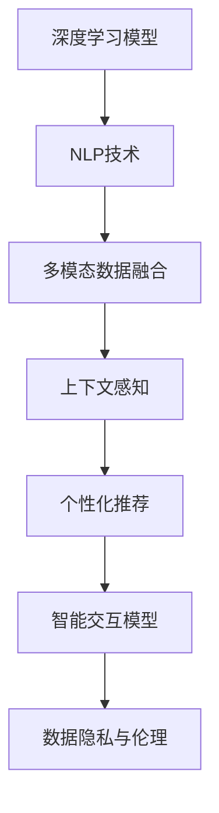

                 

# 数字化虚拟助理创业：个性化AI服务

> 关键词：虚拟助理,个性化AI服务,自然语言处理(NLP),人工智能(AI),机器学习(ML),数据科学,数字化转型

## 1. 背景介绍

### 1.1 问题由来

在数字化转型的大潮下，企业纷纷寻求智能化升级，以应对复杂多变的市场环境。然而，构建一套高效、可扩展的数字化虚拟助理系统，需要整合多种技术资源，统筹协调大量业务数据，是一项系统性工程。传统的智能助手基于规则或模板实现，难以提供真正个性化的交互体验，用户体验和应用价值往往大打折扣。

为了解决上述问题，个性化AI服务应运而生。基于自然语言处理(NLP)和人工智能(AI)技术，个性化AI服务能够通过深度学习等算法，理解用户的语义需求，提供符合个人偏好和情境的动态反馈。这种服务不仅能够提升用户体验，还能为业务带来全方位的优化。

### 1.2 问题核心关键点

个性化AI服务的核心关键点包括：
- 深度学习模型的训练和微调
- 多模态数据的融合与表示
- 上下文感知与个性化推荐
- 智能交互模型的设计和部署
- 数据隐私与用户行为的道德约束

本文将系统介绍深度学习模型的训练和微调方法，多模态数据融合与表示，上下文感知与个性化推荐技术，以及智能交互模型的设计和部署方法，并展望未来应用场景及面临的挑战。

## 2. 核心概念与联系

### 2.1 核心概念概述

为了更好地理解个性化AI服务，我们需要先掌握一些核心概念：

- **深度学习模型**：如卷积神经网络(CNN)、循环神经网络(RNN)、变压器(Transformer)等，通过大量标注数据进行训练，具备强大的数据拟合能力。
- **自然语言处理(NLP)**：涉及语言模型、文本分类、命名实体识别、语义理解等技术，通过分析文本内容，提取有价值的信息。
- **多模态数据融合**：将文本、图像、语音等多模态数据进行整合，提升模型的信息利用率，增强系统的鲁棒性。
- **上下文感知**：理解用户输入的上下文信息，提供更精准的个性化推荐和服务。
- **个性化推荐**：根据用户的历史行为和兴趣，推荐最适合的内容，提升用户满意度。
- **智能交互模型**：基于深度学习、知识图谱等技术，构建能够与用户进行自然交流的系统。
- **数据隐私与伦理**：在数据采集、存储、处理和应用过程中，遵守隐私保护和道德约束，保障用户数据的安全性。

这些概念通过以下Mermaid流程图进行了联系和串联：



这个流程图展示了个性化AI服务的技术栈和功能链条：深度学习模型和NLP技术提供基础能力，多模态数据融合与上下文感知增强系统的鲁棒性和智能性，个性化推荐和智能交互模型则为用户提供了精准的个性化服务，数据隐私与伦理保障了系统的安全合规。

## 3. 核心算法原理 & 具体操作步骤
### 3.1 算法原理概述

个性化AI服务主要通过深度学习模型和NLP技术实现。其中，深度学习模型用于文本分类、情感分析、命名实体识别等基础任务，而NLP技术则用于构建更复杂的语义理解模型。以下详细介绍深度学习模型的训练和微调方法，以及NLP技术的关键算法和具体操作步骤。

### 3.2 算法步骤详解

#### 3.2.1 深度学习模型训练

深度学习模型的训练主要涉及以下步骤：
1. **数据准备**：收集和标注相关领域的数据集，如新闻、评论、社交媒体帖子等。
2. **模型选择**：根据任务类型选择合适的深度学习模型，如CNN、RNN、Transformer等。
3. **损失函数和优化器**：选择合适的损失函数和优化器，如交叉熵损失、Adam优化器等。
4. **训练和验证**：使用训练集进行模型训练，并在验证集上不断调整模型超参数，最终获得最优模型。

以下以分类任务为例，给出TensorFlow的代码实现：

```python
import tensorflow as tf
from tensorflow.keras import layers

# 定义模型架构
model = tf.keras.Sequential([
    layers.Embedding(input_dim=vocab_size, output_dim=embedding_dim),
    layers.Bidirectional(layers.LSTM(units=64)),
    layers.Dense(units=num_classes, activation='softmax')
])

# 定义损失函数和优化器
loss_fn = tf.keras.losses.SparseCategoricalCrossentropy()
optimizer = tf.keras.optimizers.Adam()

# 编译模型
model.compile(optimizer=optimizer, loss=loss_fn, metrics=['accuracy'])

# 训练模型
model.fit(train_dataset, epochs=num_epochs, validation_data=val_dataset)
```

#### 3.2.2 NLP模型微调

NLP模型的微调主要涉及以下步骤：
1. **预训练模型选择**：选择适合任务的预训练模型，如BERT、GPT等。
2. **任务适配层设计**：根据任务类型，设计合适的任务适配层，如分类头、解码器等。
3. **微调优化**：选择合适的优化器和学习率，避免过拟合。
4. **评估与部署**：在测试集上评估微调后的模型性能，并将模型部署到实际应用中。

以下以BERT模型为例，给出PyTorch的代码实现：

```python
from transformers import BertForSequenceClassification, BertTokenizer
import torch

# 定义模型架构
model = BertForSequenceClassification.from_pretrained('bert-base-uncased', num_labels=num_classes)
tokenizer = BertTokenizer.from_pretrained('bert-base-uncased')

# 加载数据集
train_dataset = ...
val_dataset = ...
test_dataset = ...

# 定义优化器和损失函数
optimizer = torch.optim.Adam(model.parameters(), lr=2e-5)
loss_fn = torch.nn.CrossEntropyLoss()

# 训练模型
model.train()
for batch in train_loader:
    inputs = batch['input_ids'].to(device)
    labels = batch['labels'].to(device)
    outputs = model(inputs)
    loss = loss_fn(outputs, labels)
    optimizer.zero_grad()
    loss.backward()
    optimizer.step()

# 评估模型
model.eval()
with torch.no_grad():
    for batch in test_loader:
        inputs = batch['input_ids'].to(device)
        labels = batch['labels'].to(device)
        outputs = model(inputs)
        loss = loss_fn(outputs, labels)

# 部署模型
...
```

### 3.3 算法优缺点

#### 3.3.1 优点

- **高效准确**：深度学习模型和NLP技术能够高效处理大量文本数据，提供准确的语义理解和推荐。
- **可扩展性强**：通过微调和更新训练数据，可以适应不同场景和任务，提升系统的灵活性。
- **用户体验佳**：通过上下文感知和个性化推荐，能够提供符合用户偏好的服务。

#### 3.3.2 缺点

- **数据依赖性强**：模型的性能依赖于数据质量，标注成本高，数据收集难度大。
- **计算资源消耗大**：深度学习模型的训练和推理需要大量计算资源，部署成本高。
- **模型复杂度大**：模型结构复杂，维护和优化难度大。
- **可解释性差**：模型决策过程不透明，难以解释和调试。

### 3.4 算法应用领域

个性化AI服务在多个领域有广泛的应用：
- **企业客服**：智能客服机器人可以解答常见问题，减轻人工客服压力，提升用户体验。
- **医疗健康**：智能问诊系统可以通过自然语言理解患者的病情描述，推荐相应的诊疗方案。
- **金融服务**：智能理财顾问可以根据用户的历史交易和偏好，提供个性化的理财建议。
- **教育培训**：智能学习助手可以根据学生的学习记录，推荐适合的课程和资料。
- **市场营销**：智能推荐引擎可以根据用户的浏览记录，推荐感兴趣的产品或服务。

## 4. 数学模型和公式 & 详细讲解 & 举例说明

### 4.1 数学模型构建

个性化AI服务涉及多个数学模型，以下分别介绍深度学习模型和NLP模型的构建方法：

#### 4.1.1 深度学习模型

以卷积神经网络(CNN)为例，其数学模型可以表示为：

$$
y = W \cdot x + b
$$

其中 $W$ 为权重矩阵，$b$ 为偏置项，$x$ 为输入特征，$y$ 为输出结果。模型的训练过程即为求解 $W$ 和 $b$，使得损失函数最小化。

#### 4.1.2 NLP模型

以BERT模型为例，其数学模型可以表示为：

$$
H = \text{BERT}(X)
$$

其中 $X$ 为输入的文本序列，$H$ 为BERT模型输出的语义向量表示。模型的训练过程涉及掩码语言模型和下一句预测任务，以最小化损失函数：

$$
\mathcal{L}(H) = \mathcal{L}_{masked}(H) + \mathcal{L}_{next}(H)
$$

其中 $\mathcal{L}_{masked}$ 和 $\mathcal{L}_{next}$ 分别为掩码语言模型和下一句预测任务的损失函数。

### 4.2 公式推导过程

#### 4.2.1 深度学习模型

深度学习模型的训练过程涉及反向传播算法，其公式推导如下：

1. **前向传播**：

$$
y = f(z)
$$

其中 $z = Wx + b$，$f$ 为激活函数。

2. **损失函数**：

$$
\mathcal{L} = \frac{1}{N} \sum_{i=1}^N \ell(y_i, \hat{y_i})
$$

3. **反向传播**：

$$
\frac{\partial \mathcal{L}}{\partial W} = \frac{\partial \mathcal{L}}{\partial y} \cdot \frac{\partial y}{\partial z} \cdot \frac{\partial z}{\partial W}
$$

$$
\frac{\partial \mathcal{L}}{\partial b} = \frac{\partial \mathcal{L}}{\partial y}
$$

通过反向传播算法，可以求出模型的梯度，从而更新权重 $W$ 和偏置 $b$，优化模型参数。

#### 4.2.2 NLP模型

BERT模型的训练过程涉及掩码语言模型和下一句预测任务的联合训练，其公式推导如下：

1. **掩码语言模型**：

$$
\mathcal{L}_{masked}(H) = -\frac{1}{N} \sum_{i=1}^N \sum_{j=1}^{m} \log\left(\frac{e^{z_{ij}^M}}{\sum_k e^{z_{ik}^M}}\right)
$$

其中 $z_{ij}^M$ 为第 $i$ 个样本中第 $j$ 个位置的掩码标记的输出，$M$ 为标记数，$\log$ 为自然对数。

2. **下一句预测任务**：

$$
\mathcal{L}_{next}(H) = -\frac{1}{N} \sum_{i=1}^N \sum_{j=1}^n \log\left(\frac{e^{z_{ij}^N}}{\sum_k e^{z_{ik}^N}}\right)
$$

其中 $z_{ij}^N$ 为第 $i$ 个样本中第 $j$ 个位置的下一句标记的输出，$n$ 为标记数。

通过联合训练，BERT模型可以更好地理解文本的语义，提供准确的语义表示。

### 4.3 案例分析与讲解

#### 4.3.1 深度学习模型

以文本分类任务为例，可以使用CNN模型进行训练。以下给出TensorFlow的代码实现：

```python
import tensorflow as tf
from tensorflow.keras import layers

# 定义模型架构
model = tf.keras.Sequential([
    layers.Embedding(input_dim=vocab_size, output_dim=embedding_dim),
    layers.Conv1D(filters=128, kernel_size=3, activation='relu'),
    layers.MaxPooling1D(pool_size=2),
    layers.Flatten(),
    layers.Dense(units=num_classes, activation='softmax')
])

# 定义损失函数和优化器
loss_fn = tf.keras.losses.SparseCategoricalCrossentropy()
optimizer = tf.keras.optimizers.Adam()

# 编译模型
model.compile(optimizer=optimizer, loss=loss_fn, metrics=['accuracy'])

# 训练模型
model.fit(train_dataset, epochs=num_epochs, validation_data=val_dataset)
```

#### 4.3.2 NLP模型

以BERT模型为例，可以使用PyTorch进行训练。以下给出PyTorch的代码实现：

```python
from transformers import BertForSequenceClassification, BertTokenizer
import torch

# 定义模型架构
model = BertForSequenceClassification.from_pretrained('bert-base-uncased', num_labels=num_classes)
tokenizer = BertTokenizer.from_pretrained('bert-base-uncased')

# 加载数据集
train_dataset = ...
val_dataset = ...
test_dataset = ...

# 定义优化器和损失函数
optimizer = torch.optim.Adam(model.parameters(), lr=2e-5)
loss_fn = torch.nn.CrossEntropyLoss()

# 训练模型
model.train()
for batch in train_loader:
    inputs = batch['input_ids'].to(device)
    labels = batch['labels'].to(device)
    outputs = model(inputs)
    loss = loss_fn(outputs, labels)
    optimizer.zero_grad()
    loss.backward()
    optimizer.step()

# 评估模型
model.eval()
with torch.no_grad():
    for batch in test_loader:
        inputs = batch['input_ids'].to(device)
        labels = batch['labels'].to(device)
        outputs = model(inputs)
        loss = loss_fn(outputs, labels)

# 部署模型
...
```

## 5. 项目实践：代码实例和详细解释说明

### 5.1 开发环境搭建

在开始实践前，需要搭建好开发环境。以下是在Python中使用TensorFlow和PyTorch搭建环境的步骤：

#### 5.1.1 TensorFlow

1. 安装Anaconda：从官网下载并安装Anaconda，用于创建独立的Python环境。

2. 创建并激活虚拟环境：
```bash
conda create -n tf-env python=3.8 
conda activate tf-env
```

3. 安装TensorFlow：
```bash
pip install tensorflow
```

4. 安装TensorBoard：
```bash
pip install tensorboard
```

5. 启动TensorBoard：
```bash
tensorboard --logdir=logs
```

#### 5.1.2 PyTorch

1. 安装Anaconda：从官网下载并安装Anaconda，用于创建独立的Python环境。

2. 创建并激活虚拟环境：
```bash
conda create -n pytorch-env python=3.8 
conda activate pytorch-env
```

3. 安装PyTorch：
```bash
pip install torch torchvision torchaudio
```

4. 安装Transformers库：
```bash
pip install transformers
```

5. 安装各类工具包：
```bash
pip install numpy pandas scikit-learn matplotlib tqdm jupyter notebook ipython
```

完成上述步骤后，即可在`tf-env`和`pytorch-env`环境中开始实践。

### 5.2 源代码详细实现

#### 5.2.1 深度学习模型

以文本分类任务为例，可以使用CNN模型进行训练。以下给出TensorFlow的代码实现：

```python
import tensorflow as tf
from tensorflow.keras import layers

# 定义模型架构
model = tf.keras.Sequential([
    layers.Embedding(input_dim=vocab_size, output_dim=embedding_dim),
    layers.Conv1D(filters=128, kernel_size=3, activation='relu'),
    layers.MaxPooling1D(pool_size=2),
    layers.Flatten(),
    layers.Dense(units=num_classes, activation='softmax')
])

# 定义损失函数和优化器
loss_fn = tf.keras.losses.SparseCategoricalCrossentropy()
optimizer = tf.keras.optimizers.Adam()

# 编译模型
model.compile(optimizer=optimizer, loss=loss_fn, metrics=['accuracy'])

# 训练模型
model.fit(train_dataset, epochs=num_epochs, validation_data=val_dataset)
```

#### 5.2.2 NLP模型

以BERT模型为例，可以使用PyTorch进行训练。以下给出PyTorch的代码实现：

```python
from transformers import BertForSequenceClassification, BertTokenizer
import torch

# 定义模型架构
model = BertForSequenceClassification.from_pretrained('bert-base-uncased', num_labels=num_classes)
tokenizer = BertTokenizer.from_pretrained('bert-base-uncased')

# 加载数据集
train_dataset = ...
val_dataset = ...
test_dataset = ...

# 定义优化器和损失函数
optimizer = torch.optim.Adam(model.parameters(), lr=2e-5)
loss_fn = torch.nn.CrossEntropyLoss()

# 训练模型
model.train()
for batch in train_loader:
    inputs = batch['input_ids'].to(device)
    labels = batch['labels'].to(device)
    outputs = model(inputs)
    loss = loss_fn(outputs, labels)
    optimizer.zero_grad()
    loss.backward()
    optimizer.step()

# 评估模型
model.eval()
with torch.no_grad():
    for batch in test_loader:
        inputs = batch['input_ids'].to(device)
        labels = batch['labels'].to(device)
        outputs = model(inputs)
        loss = loss_fn(outputs, labels)

# 部署模型
...
```

### 5.3 代码解读与分析

#### 5.3.1 深度学习模型

```python
import tensorflow as tf
from tensorflow.keras import layers

# 定义模型架构
model = tf.keras.Sequential([
    layers.Embedding(input_dim=vocab_size, output_dim=embedding_dim),
    layers.Conv1D(filters=128, kernel_size=3, activation='relu'),
    layers.MaxPooling1D(pool_size=2),
    layers.Flatten(),
    layers.Dense(units=num_classes, activation='softmax')
])

# 定义损失函数和优化器
loss_fn = tf.keras.losses.SparseCategoricalCrossentropy()
optimizer = tf.keras.optimizers.Adam()

# 编译模型
model.compile(optimizer=optimizer, loss=loss_fn, metrics=['accuracy'])

# 训练模型
model.fit(train_dataset, epochs=num_epochs, validation_data=val_dataset)
```

**代码解读**：
1. `layers.Embedding`：定义Embedding层，将输入的整数编码转换为稠密向量表示。
2. `layers.Conv1D`：定义卷积层，用于提取输入特征的局部结构信息。
3. `layers.MaxPooling1D`：定义池化层，用于对卷积层的输出进行下采样，减小特征维度。
4. `layers.Flatten`：定义Flatten层，将池化层的输出展开成一维向量。
5. `layers.Dense`：定义全连接层，用于将特征向量映射到输出类别。
6. `loss_fn`：定义交叉熵损失函数。
7. `optimizer`：定义Adam优化器。
8. `model.compile`：编译模型，指定损失函数、优化器和评价指标。
9. `model.fit`：训练模型，指定训练集、验证集和迭代轮数。

#### 5.3.2 NLP模型

```python
from transformers import BertForSequenceClassification, BertTokenizer
import torch

# 定义模型架构
model = BertForSequenceClassification.from_pretrained('bert-base-uncased', num_labels=num_classes)
tokenizer = BertTokenizer.from_pretrained('bert-base-uncased')

# 加载数据集
train_dataset = ...
val_dataset = ...
test_dataset = ...

# 定义优化器和损失函数
optimizer = torch.optim.Adam(model.parameters(), lr=2e-5)
loss_fn = torch.nn.CrossEntropyLoss()

# 训练模型
model.train()
for batch in train_loader:
    inputs = batch['input_ids'].to(device)
    labels = batch['labels'].to(device)
    outputs = model(inputs)
    loss = loss_fn(outputs, labels)
    optimizer.zero_grad()
    loss.backward()
    optimizer.step()

# 评估模型
model.eval()
with torch.no_grad():
    for batch in test_loader:
        inputs = batch['input_ids'].to(device)
        labels = batch['labels'].to(device)
        outputs = model(inputs)
        loss = loss_fn(outputs, labels)

# 部署模型
...
```

**代码解读**：
1. `BertForSequenceClassification.from_pretrained`：加载预训练的BERT模型，并指定输出类别的数量。
2. `BertTokenizer.from_pretrained`：加载BERT分词器。
3. `train_dataset`、`val_dataset`、`test_dataset`：定义训练集、验证集和测试集。
4. `optimizer`：定义Adam优化器。
5. `loss_fn`：定义交叉熵损失函数。
6. `model.train`：将模型设置为训练模式。
7. `model(inputs)`：将输入特征输入模型，得到预测结果。
8. `loss_fn(outputs, labels)`：计算预测结果和真实标签的交叉熵损失。
9. `optimizer.zero_grad()`：清零优化器的梯度。
10. `loss.backward()`：反向传播计算梯度。
11. `optimizer.step()`：更新模型参数。
12. `model.eval`：将模型设置为评估模式。
13. `torch.no_grad()`：禁用梯度计算，减少内存占用。
14. `outputs`：模型的预测结果。
15. `loss_fn(outputs, labels)`：计算预测结果和真实标签的交叉熵损失。

### 5.4 运行结果展示

#### 5.4.1 深度学习模型

在训练完成后，可以通过以下代码查看模型的精度和损失：

```python
model.evaluate(val_dataset)
```

#### 5.4.2 NLP模型

在训练完成后，可以通过以下代码查看模型的精度和损失：

```python
model.eval()
with torch.no_grad():
    for batch in test_loader:
        inputs = batch['input_ids'].to(device)
        labels = batch['labels'].to(device)
        outputs = model(inputs)
        loss = loss_fn(outputs, labels)
print(loss.item())
```

## 6. 实际应用场景

### 6.1 企业客服

在企业客服场景中，个性化AI服务可以显著提升用户体验和业务效率。以下是一个使用BERT模型进行情感分析的案例：

1. **数据准备**：收集客户服务聊天记录，标注客户的情感类别（如满意、不满意）。
2. **模型训练**：使用BERT模型进行情感分类任务训练。
3. **模型部署**：将训练好的模型部署到企业客服系统中，实时分析客户情感，并给出反馈。

### 6.2 医疗健康

在医疗健康场景中，个性化AI服务可以帮助医生快速诊断疾病。以下是一个使用BERT模型进行病历分类的案例：

1. **数据准备**：收集医生病历文本，标注疾病类别（如感冒、高血压）。
2. **模型训练**：使用BERT模型进行病历分类任务训练。
3. **模型部署**：将训练好的模型部署到医疗系统中，辅助医生进行疾病诊断。

### 6.3 金融服务

在金融服务场景中，个性化AI服务可以提供个性化的理财建议。以下是一个使用CNN模型进行理财建议的案例：

1. **数据准备**：收集用户的理财行为数据，标注用户的理财偏好（如保守、激进）。
2. **模型训练**：使用CNN模型进行理财建议任务训练。
3. **模型部署**：将训练好的模型部署到金融系统中，根据用户行为生成理财建议。

### 6.4 未来应用展望

未来，个性化AI服务将在更多领域得到应用，为各行各业带来变革性影响。例如：

- **智慧医疗**：智能问诊系统可以根据患者症状，推荐最合适的诊疗方案。
- **智能教育**：个性化学习助手可以根据学生的学习情况，推荐适合的课程和资料。
- **智能推荐**：推荐系统可以根据用户的历史行为，推荐感兴趣的产品或服务。

## 7. 工具和资源推荐

### 7.1 学习资源推荐

为了帮助开发者系统掌握个性化AI服务的技术基础和实践技巧，这里推荐一些优质的学习资源：

1. **TensorFlow官方文档**：提供了深度学习模型的详细使用指南和API参考，适合初学者和进阶开发者。

2. **PyTorch官方文档**：提供了PyTorch深度学习框架的使用指南和API参考，适合深度学习开发者。

3. **Transformers官方文档**：提供了预训练语言模型的加载和微调指南，适合NLP开发者。

4. **自然语言处理教程**：包括NLP基础、深度学习模型训练、多模态数据融合等内容，适合NLP初学者。

5. **机器学习公开课**：包括深度学习、强化学习、数据挖掘等内容，适合机器学习初学者。

6. **数据科学公开课**：包括数据预处理、模型评估、数据可视化等内容，适合数据科学家。

通过对这些资源的学习实践，相信你一定能够快速掌握个性化AI服务的技术精髓，并用于解决实际的业务问题。

### 7.2 开发工具推荐

为了提高个性化AI服务开发的效率，以下是几款常用的开发工具：

1. **Anaconda**：提供了虚拟环境管理工具，方便开发者搭建和管理开发环境。

2. **TensorFlow**：提供了高效便捷的深度学习框架，适合构建复杂的神经网络模型。

3. **PyTorch**：提供了灵活高效的深度学习框架，适合构建动态图和静态图模型。

4. **Jupyter Notebook**：提供了交互式编程环境，方便开发者快速迭代和测试代码。

5. **TensorBoard**：提供了模型训练的可视化工具，方便开发者监控和调试模型。

6. **PyTorch Lightning**：提供了快速构建和部署深度学习模型的框架，适合快速原型开发。

合理利用这些工具，可以显著提升个性化AI服务开发的效率，加快创新迭代的步伐。

### 7.3 相关论文推荐

为了深入理解个性化AI服务的理论和实践，以下是几篇经典的相关论文，推荐阅读：

1. **Attention is All You Need**：Transformer模型的原论文，开创了NLP领域预训练大模型时代。

2. **BERT: Pre-training of Deep Bidirectional Transformers for Language Understanding**：提出BERT模型，引入掩码语言模型任务，刷新了多项NLP任务SOTA。

3. **Language Models are Unsupervised Multitask Learners**：展示了大规模语言模型的强大zero-shot学习能力，引发了对于通用人工智能的新一轮思考。

4. **Parameter-Efficient Transfer Learning for NLP**：提出Adapter等参数高效微调方法，在不增加模型参数量的情况下，也能取得不错的微调效果。

5. **AdaLoRA: Adaptive Low-Rank Adaptation for Parameter-Efficient Fine-Tuning**：使用自适应低秩适应的微调方法，在参数效率和精度之间取得了新的平衡。

6. **Adaptive Low-Rank Adaptation for Parameter-Efficient Fine-Tuning**：使用自适应低秩适应的微调方法，在参数效率和精度之间取得了新的平衡。

这些论文代表了个性化AI服务的研究进展，为今后的研究提供了重要的理论基础和实践指导。

## 8. 总结：未来发展趋势与挑战

### 8.1 研究成果总结

本文系统介绍了深度学习模型和NLP模型的训练和微调方法，多模态数据融合与上下文感知技术，以及智能交互模型的设计和部署方法。通过这些技术的结合，可以构建高性能、高可扩展性的个性化AI服务，提升用户体验和业务效率。

### 8.2 未来发展趋势

展望未来，个性化AI服务将呈现以下几个发展趋势：

1. **多模态融合**：结合文本、图像、语音等多模态数据，提升系统的鲁棒性和智能化水平。
2. **上下文感知**：利用上下文信息，提供更加精准和个性化的服务。
3. **知识图谱应用**：将知识图谱引入NLP模型，提升模型的解释力和推理能力。
4. **联邦学习**：在分布式环境中，通过联邦学习技术，训练模型，保护数据隐私。
5. **零样本学习**：通过零样本学习技术，提升模型的泛化能力，降低对标注数据的依赖。

### 8.3 面临的挑战

尽管个性化AI服务取得了显著进展，但还面临一些挑战：

1. **数据隐私和安全**：在数据采集、存储和处理过程中，保障用户隐私和安全。
2. **模型鲁棒性**：提升模型的泛化能力，应对多种异常情况。
3. **可解释性**：增强模型的可解释性，方便调试和优化。
4. **计算资源消耗**：优化模型的计算资源消耗，提高部署效率。
5. **知识整合**：将知识图谱、规则库等专家知识与模型进行有机融合，提升系统的智能水平。

### 8.4 研究展望

面对这些挑战，未来的研究可以从以下几个方向进行：

1. **隐私保护技术**：研究差分隐私、联邦学习等技术，保障数据隐私和安全。
2. **鲁棒性提升**：引入对抗训练、模型蒸馏等技术，提升模型的鲁棒性和泛化能力。
3. **可解释性增强**：研究模型的可解释性评估方法，提升模型的可解释性和可解释性。
4. **计算资源优化**：研究模型压缩、模型剪枝等技术，优化计算资源消耗。
5. **知识融合技术**：研究知识图谱嵌入、规则库集成等技术，提升模型的智能水平。

通过这些研究，相信未来个性化AI服务能够更好地应对实际应用中的各种挑战，实现更高的性能和更广泛的应用价值。

## 9. 附录：常见问题与解答

**Q1：什么是深度学习模型？**

A: 深度学习模型是指包含多层神经网络结构的模型，通过反向传播算法训练，可以自动学习数据的特征表示。

**Q2：什么是自然语言处理（NLP）？**

A: 自然语言处理（NLP）是指使用计算机技术处理和理解人类语言的技术，包括语言模型、文本分类、命名实体识别等任务。

**Q3：什么是多模态数据融合？**

A: 多模态数据融合是指将文本、图像、语音等多模态数据进行整合，提取其中的有用信息，提升系统的鲁棒性和智能化水平。

**Q4：什么是上下文感知？**

A: 上下文感知是指理解用户输入的上下文信息，提供符合用户偏好和情境的动态反馈。

**Q5：什么是个性化推荐？**

A: 个性化推荐是指根据用户的历史行为和兴趣，推荐最适合的内容，提升用户满意度。

**Q6：什么是智能交互模型？**

A: 智能交互模型是指基于深度学习、知识图谱等技术，构建能够与用户进行自然交流的系统。

**Q7：什么是数据隐私与伦理？**

A: 数据隐私与伦理是指在数据采集、存储、处理和应用过程中，遵守隐私保护和道德约束，保障用户数据的安全性和合规性。

---

作者：禅与计算机程序设计艺术 / Zen and the Art of Computer Programming

