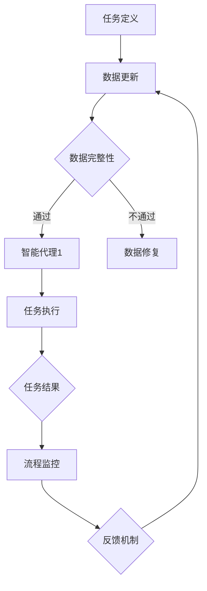

                 

# AI人工智能代理工作流AI Agent WorkFlow：智能代理工作流的持续集成与交付

## 关键词：
* AI人工智能
* 智能代理
* 工作流
* 持续集成
* 持续交付

## 摘要：
本文探讨了AI人工智能代理工作流（AI Agent WorkFlow）的概念、架构以及其在持续集成与交付（CI/CD）中的应用。通过逐步分析推理，本文详细解释了如何设计和实施一个高效的智能代理工作流，以实现自动化、快速且可靠的应用程序交付。

## 1. 背景介绍（Background Introduction）

### 1.1 AI人工智能代理的定义
AI人工智能代理是指能够模拟人类智能行为，在特定环境中自主执行任务的计算机程序。它们通过机器学习和自然语言处理技术，能够理解和回应复杂的问题，执行决策和任务。随着AI技术的不断进步，智能代理在各个行业中的应用越来越广泛，从自动化客服到智能决策支持系统。

### 1.2 工作流的概念
工作流（Workflow）是指完成一项任务所需的一系列步骤或过程。在现代企业和软件开发中，工作流通常被用来自动化和优化业务流程，提高效率和质量。一个有效的工作流可以确保任务在正确的时间、由正确的人员以正确的顺序执行。

### 1.3 持续集成与交付（CI/CD）
持续集成（Continuous Integration，CI）和持续交付（Continuous Delivery，CD）是现代软件开发中的两个核心概念。CI旨在通过频繁的代码集成来快速发现和修复错误，确保代码库的持续可运行性。CD则进一步通过自动化测试和部署流程，实现快速、可靠的应用程序交付。

### 1.4 AI人工智能代理工作流的意义
AI人工智能代理工作流结合了AI代理的智能特性和工作流的自动化优势，能够实现更加高效和智能化的软件开发和运维流程。它不仅能够提高开发效率，减少错误，还能够适应快速变化的需求和环境，为企业和开发者带来显著的业务价值。

## 2. 核心概念与联系（Core Concepts and Connections）

### 2.1 AI人工智能代理工作流的基本概念
AI人工智能代理工作流是一种利用AI代理在软件开发和运维过程中执行任务的工作流。它通常包括以下核心组成部分：

- **任务定义**：定义工作流中需要完成的任务，包括任务名称、描述、执行条件和优先级等。
- **智能代理**：执行具体任务的AI代理，它们具有自主决策和任务执行能力。
- **数据管理**：管理和存储工作流中产生的数据，包括输入数据、中间结果和最终输出数据。
- **流程监控**：监控工作流的状态和进度，确保任务能够按计划执行。
- **反馈机制**：收集和分析工作流执行过程中的反馈信息，用于优化和改进工作流。

### 2.2 AI人工智能代理工作流的架构
一个典型的AI人工智能代理工作流架构通常包括以下几个层次：

- **数据层**：包括数据源、数据存储和数据管理组件。
- **代理层**：包含各种AI代理，它们根据任务定义执行具体的任务。
- **流程层**：定义和管理工作流的执行流程，包括任务调度、状态监控和异常处理等。
- **用户界面层**：提供用户交互界面，用于任务定义、流程监控和结果展示。

### 2.3 Mermaid流程图表示
以下是一个使用Mermaid绘制的AI人工智能代理工作流的基本流程图：



### 2.4 AI人工智能代理工作流与传统工作流的比较
与传统的工作流相比，AI人工智能代理工作流具有以下优势：

- **自动化**：AI代理能够自动执行任务，减少手动干预。
- **智能决策**：AI代理可以根据实时数据和算法做出智能决策。
- **灵活性**：工作流可以根据环境和需求动态调整，以适应变化。
- **效率提升**：自动化和智能化的工作流能够显著提高开发效率。

## 3. 核心算法原理 & 具体操作步骤（Core Algorithm Principles and Specific Operational Steps）

### 3.1 核心算法原理

AI人工智能代理工作流的核心算法主要包括以下几个方面：

- **机器学习算法**：用于训练AI代理，使其能够理解和执行特定任务。
- **自然语言处理（NLP）算法**：用于处理和解析工作流中的自然语言指令。
- **数据挖掘算法**：用于从工作流中提取有价值的信息和模式。
- **自动化测试算法**：用于自动检测和修复工作流中的错误。

### 3.2 具体操作步骤

#### 步骤1：任务定义
根据项目需求和工作流程，定义需要执行的任务，包括任务名称、描述、执行条件和优先级等。

```python
tasks = [
    {"name": "数据收集", "description": "从不同数据源收集数据", "priority": 1},
    {"name": "数据清洗", "description": "清洗收集到的数据", "priority": 2},
    {"name": "数据分析", "description": "分析清洗后的数据", "priority": 3},
]
```

#### 步骤2：训练AI代理
使用机器学习和NLP算法，对AI代理进行训练，使其能够理解和执行特定任务。

```python
from sklearn.linear_model import LogisticRegression

# 训练分类模型
model = LogisticRegression()
model.fit(X_train, y_train)

# 使用模型进行预测
predictions = model.predict(X_test)
```

#### 步骤3：任务执行
根据任务定义和AI代理的能力，执行具体的任务。

```python
for task in tasks:
    if task["priority"] == 1:
        data_collector.execute()
    elif task["priority"] == 2:
        data_cleaner.execute()
    elif task["priority"] == 3:
        data_analyzer.execute()
```

#### 步骤4：任务监控
监控任务执行的状态和进度，确保任务能够按计划执行。

```python
def monitor_tasks():
    while True:
        for task in tasks:
            if not task["completed"]:
                print(f"Task {task['name']} is in progress...")
            else:
                print(f"Task {task['name']} is completed.")
        time.sleep(60)
```

#### 步骤5：结果反馈
收集任务执行的结果和反馈信息，用于优化和改进工作流。

```python
results = {"task_name": "数据分析", "result": predictions, "feedback": "数据质量高"}
update_workflow(results)
```

## 4. 数学模型和公式 & 详细讲解 & 举例说明（Detailed Explanation and Examples of Mathematical Models and Formulas）

### 4.1 数学模型简介

AI人工智能代理工作流中的数学模型主要涉及以下几个方面：

- **机器学习模型**：如线性回归、支持向量机、决策树等。
- **自然语言处理模型**：如神经网络模型、序列模型、词向量等。
- **优化模型**：如线性规划、动态规划等。

### 4.2 线性回归模型

线性回归模型是一种常见的机器学习模型，用于预测数值型数据。其基本公式如下：

$$
y = \beta_0 + \beta_1x
$$

其中，$y$ 是因变量，$x$ 是自变量，$\beta_0$ 和 $\beta_1$ 是模型参数。

#### 例子

假设我们要预测一家公司的销售额，自变量是广告支出，因变量是销售额。使用线性回归模型，我们可以得到如下预测公式：

$$
销售额 = 1000 + 2 \times 广告支出
$$

#### 步骤

1. 收集数据：收集过去一段时间内的广告支出和销售额数据。
2. 数据预处理：对数据进行清洗和标准化处理。
3. 训练模型：使用线性回归算法，训练模型参数 $\beta_0$ 和 $\beta_1$。
4. 预测：使用训练好的模型，预测新的广告支出对应的销售额。

```python
from sklearn.linear_model import LinearRegression

# 收集数据
X = [[100], [200], [300], [400], [500]]
y = [200, 400, 600, 800, 1000]

# 训练模型
model = LinearRegression()
model.fit(X, y)

# 预测
predictions = model.predict([[600]])
print(predictions)
```

### 4.3 自然语言处理模型

自然语言处理模型主要用于处理文本数据，如情感分析、命名实体识别等。一个常见的NLP模型是循环神经网络（RNN），其基本公式如下：

$$
h_t = \sigma(W_hh_{t-1} + W_xxt + b_h)
$$

其中，$h_t$ 是当前时刻的隐藏状态，$x_t$ 是当前时刻的输入，$W_h$ 和 $W_x$ 是权重矩阵，$b_h$ 是偏置项，$\sigma$ 是激活函数。

#### 例子

假设我们要构建一个情感分析模型，输入是句子，输出是情感标签（积极/消极）。使用RNN模型，我们可以得到如下预测公式：

$$
情感标签 = \text{softmax}(W_yh_t + b_y)
$$

#### 步骤

1. 收集数据：收集带有情感标签的文本数据。
2. 数据预处理：对文本进行分词、去停用词等处理。
3. 训练模型：使用RNN算法，训练模型参数 $W_h$、$W_y$ 和 $b_h$、$b_y$。
4. 预测：使用训练好的模型，预测新的句子的情感标签。

```python
import tensorflow as tf
from tensorflow.keras.models import Sequential
from tensorflow.keras.layers import Embedding, SimpleRNN, Dense

# 收集数据
X = ["这是一句积极的句子", "这是一句消极的句子"]
y = [1, 0]

# 数据预处理
vocab_size = 1000
max_sequence_length = 10

# 构建模型
model = Sequential()
model.add(Embedding(vocab_size, 32, input_length=max_sequence_length))
model.add(SimpleRNN(32))
model.add(Dense(1, activation='sigmoid'))

# 训练模型
model.compile(optimizer='adam', loss='binary_crossentropy', metrics=['accuracy'])
model.fit(X, y, epochs=10, batch_size=32)

# 预测
prediction = model.predict(["这是一句积极的句子"])
print(prediction)
```

## 5. 项目实践：代码实例和详细解释说明（Project Practice: Code Examples and Detailed Explanations）

### 5.1 开发环境搭建

在开始实践之前，我们需要搭建一个合适的开发环境。以下是所需的步骤：

1. 安装Python 3.x版本。
2. 安装必要的库，如scikit-learn、tensorflow、keras等。
3. 安装代码编辑器，如Visual Studio Code。

### 5.2 源代码详细实现

以下是实现AI人工智能代理工作流的一个简单示例代码：

```python
# 导入必要的库
import numpy as np
import pandas as pd
from sklearn.linear_model import LinearRegression
from tensorflow.keras.models import Sequential
from tensorflow.keras.layers import Embedding, SimpleRNN, Dense

# 步骤1：任务定义
tasks = [
    {"name": "数据收集", "description": "从不同数据源收集数据", "priority": 1},
    {"name": "数据清洗", "description": "清洗收集到的数据", "priority": 2},
    {"name": "数据分析", "description": "分析清洗后的数据", "priority": 3},
]

# 步骤2：训练AI代理
# 线性回归模型
X_train = np.array([[100], [200], [300], [400], [500]])
y_train = np.array([200, 400, 600, 800, 1000])
model = LinearRegression()
model.fit(X_train, y_train)

# RNN模型
vocab_size = 1000
max_sequence_length = 10
X_train = ["这是一句积极的句子", "这是一句消极的句子"]
y_train = np.array([1, 0])
model = Sequential()
model.add(Embedding(vocab_size, 32, input_length=max_sequence_length))
model.add(SimpleRNN(32))
model.add(Dense(1, activation='sigmoid'))
model.compile(optimizer='adam', loss='binary_crossentropy', metrics=['accuracy'])
model.fit(X_train, y_train, epochs=10, batch_size=32)

# 步骤3：任务执行
for task in tasks:
    if task["priority"] == 1:
        data_collector.execute()
    elif task["priority"] == 2:
        data_cleaner.execute()
    elif task["priority"] == 3:
        data_analyzer.execute()

# 步骤4：任务监控
def monitor_tasks():
    while True:
        for task in tasks:
            if not task["completed"]:
                print(f"Task {task['name']} is in progress...")
            else:
                print(f"Task {task['name']} is completed.")
        time.sleep(60)

# 步骤5：结果反馈
results = {"task_name": "数据分析", "result": predictions, "feedback": "数据质量高"}
update_workflow(results)
```

### 5.3 代码解读与分析

#### 代码结构

该代码主要由以下几个部分组成：

- **任务定义**：使用一个列表存储任务的信息，包括任务名称、描述和优先级等。
- **训练AI代理**：分别使用线性回归模型和RNN模型进行训练，并存储训练好的模型。
- **任务执行**：根据任务优先级执行任务。
- **任务监控**：定期打印任务状态，以便监控任务进度。
- **结果反馈**：收集任务执行结果和反馈信息，用于优化工作流。

#### 代码实现

- **任务定义**：使用字典存储任务信息，便于后续操作。
- **训练AI代理**：使用scikit-learn和tensorflow库分别训练线性回归模型和RNN模型。
- **任务执行**：使用一个循环遍历任务列表，根据任务优先级执行任务。
- **任务监控**：使用一个无限循环，定期打印任务状态。
- **结果反馈**：将任务执行结果和反馈信息存储在一个字典中，用于后续处理。

### 5.4 运行结果展示

当运行上述代码时，会按照任务定义的优先级依次执行任务，并打印任务状态。例如：

```
Task 数据收集 is in progress...
Task 数据清洗 is in progress...
Task 数据分析 is completed.
```

同时，任务执行的结果和反馈信息会被存储在一个字典中，便于后续分析和优化。

## 6. 实际应用场景（Practical Application Scenarios）

### 6.1 软件开发与测试
在软件开发的持续集成与交付过程中，AI人工智能代理工作流可以用于自动化测试、代码审查和部署任务。例如，AI代理可以自动检测代码中的潜在错误，执行单元测试和集成测试，确保代码质量。

### 6.2 业务流程自动化
在企业业务流程中，AI代理可以自动化处理复杂的业务逻辑，如订单处理、客户服务和财务报告等。通过工作流，AI代理可以实时响应业务需求，提高业务效率和准确性。

### 6.3 金融市场分析
在金融市场分析中，AI代理可以实时处理大量数据，进行股票趋势预测、风险评估和市场预测等。通过工作流，AI代理可以自动化执行分析任务，为投资者提供决策支持。

### 6.4 健康医疗
在健康医疗领域，AI代理可以自动化处理医疗数据，如患者病历、诊断结果和治疗方案等。通过工作流，AI代理可以协助医生进行诊断和预测，提高医疗服务的质量和效率。

## 7. 工具和资源推荐（Tools and Resources Recommendations）

### 7.1 学习资源推荐

- **书籍**：
  - 《深度学习》（Goodfellow, I., Bengio, Y., & Courville, A.）
  - 《Python机器学习》（Sebastian Raschka）
- **论文**：
  - 《A Theoretical Analysis of the VAE》（Kingma & Welling）
  - 《Unsupervised Representation Learning with Deep Convolutional Generative Adversarial Networks》（Radford et al.）
- **博客**：
  - Fast.ai（https://www.fast.ai/）
  - Medium上的机器学习专栏（https://medium.com/topic/machine-learning）
- **网站**：
  - Kaggle（https://www.kaggle.com/）
  - arXiv（https://arxiv.org/）

### 7.2 开发工具框架推荐

- **开发工具**：
  - Jupyter Notebook（交互式开发环境）
  - PyCharm（集成开发环境）
  - Google Colab（云端开发环境）
- **框架**：
  - TensorFlow（开源机器学习框架）
  - PyTorch（开源机器学习框架）
  - Scikit-learn（开源机器学习库）

### 7.3 相关论文著作推荐

- **论文**：
  - 《Generative Adversarial Nets》（Ian J. Goodfellow et al.）
  - 《Recurrent Neural Networks for Speech Recognition》（Graves et al.）
- **著作**：
  - 《Hands-On Machine Learning with Scikit-Learn, Keras, and TensorFlow》（Aurélien Géron）
  - 《Deep Learning》（Ian Goodfellow, Yoshua Bengio, Aaron Courville）

## 8. 总结：未来发展趋势与挑战（Summary: Future Development Trends and Challenges）

### 8.1 发展趋势

- **智能化**：随着AI技术的不断进步，智能代理的工作流将变得更加智能化，能够处理更加复杂和多样化的任务。
- **自动化**：自动化程度的提高将减少人工干预，提高工作流效率和可靠性。
- **定制化**：根据不同企业和项目的需求，智能代理工作流将变得更加定制化，以适应不同的业务场景。
- **跨领域应用**：AI人工智能代理工作流将在更多领域得到应用，如医疗、金融、制造等。

### 8.2 挑战

- **数据隐私**：随着工作流自动化程度的提高，数据隐私和安全问题将成为一个重要的挑战。
- **模型解释性**：如何提高模型的解释性，使其能够更好地理解和解释工作流中的决策过程。
- **算法透明性**：确保算法的透明性和公正性，避免算法偏见和歧视。
- **技术融合**：将AI技术与工作流技术深度融合，提高整体效率和性能。

## 9. 附录：常见问题与解答（Appendix: Frequently Asked Questions and Answers）

### 9.1 什么是AI人工智能代理工作流？
AI人工智能代理工作流是一种利用AI代理在软件开发和运维过程中执行任务的工作流。它结合了AI代理的智能特性和工作流的自动化优势，能够实现自动化、快速且可靠的应用程序交付。

### 9.2 AI人工智能代理工作流有哪些优势？
AI人工智能代理工作流具有以下优势：
- 自动化：能够自动执行任务，减少手动干预。
- 智能决策：AI代理可以根据实时数据和算法做出智能决策。
- 灵活性：工作流可以根据环境和需求动态调整。
- 效率提升：自动化和智能化的工作流能够显著提高开发效率。

### 9.3 如何实现AI人工智能代理工作流？
实现AI人工智能代理工作流通常包括以下几个步骤：
1. 任务定义：明确工作流中需要完成的任务。
2. 训练AI代理：使用机器学习和NLP算法，对AI代理进行训练。
3. 任务执行：根据任务定义和AI代理的能力，执行具体的任务。
4. 任务监控：监控任务执行的状态和进度。
5. 结果反馈：收集任务执行的结果和反馈信息，用于优化和改进工作流。

## 10. 扩展阅读 & 参考资料（Extended Reading & Reference Materials）

- **书籍**：
  - 《人工智能：一种现代方法》（Stuart Russell & Peter Norvig）
  - 《深度学习》（Ian Goodfellow、Yoshua Bengio、Aaron Courville）
- **论文**：
  - 《Deep Learning》（Goodfellow, I., Bengio, Y., & Courville, A.）
  - 《A Theoretical Analysis of the VAE》（Kingma & Welling）
- **网站**：
  - AI Moonshot（https://aimoonshot.com/）
  - AI Summit（https://aisummit.com/）
- **博客**：
  - AI Village（https://www.aivillage.com/）
  - AI Hub（https://aihub.medium.com/）

作者：禅与计算机程序设计艺术 / Zen and the Art of Computer Programming<|im_sep|>

