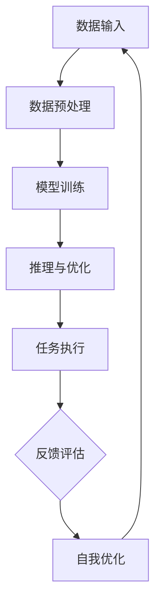

                 

# AI人工智能深度学习算法：智能深度学习代理在档案管理中的应用

## 关键词：
- AI人工智能
- 深度学习算法
- 智能深度学习代理
- 档案管理
- 机器学习应用

## 摘要：
本文深入探讨了人工智能（AI）特别是深度学习算法在档案管理中的应用。重点分析了智能深度学习代理的作用，通过案例展示了如何利用深度学习技术优化档案管理流程，提高工作效率。文章还讨论了相关数学模型、算法原理，并提供了实际项目实践的代码实例和详细解读。

## 1. 背景介绍

档案管理是组织信息保存和检索的关键环节，尤其在数字化的今天，档案的存储、管理和保护变得尤为重要。传统的档案管理方式往往依赖于人工处理，效率低下且容易出错。随着人工智能技术的迅猛发展，特别是深度学习算法的进步，利用AI技术提升档案管理效率成为可能。

深度学习是一种重要的机器学习技术，通过模拟人脑神经网络，可以处理大量复杂的数据。智能深度学习代理则是利用深度学习算法自主学习和优化任务执行的工具。在档案管理中，智能深度学习代理可以通过自动化流程、精准的文档分类和高效的数据检索来提升工作效率。

本文旨在探讨智能深度学习代理在档案管理中的应用，分析其核心算法原理，并通过实际项目实践展示其应用效果。

## 2. 核心概念与联系

### 2.1 深度学习与档案管理

深度学习是机器学习中的一种方法，通过构建多层神经网络模拟人脑处理信息的方式，对数据进行自动特征提取和分类。深度学习算法包括卷积神经网络（CNN）、循环神经网络（RNN）和生成对抗网络（GAN）等，每种算法都有其独特的优势和适用场景。

在档案管理中，深度学习可以用于：

- **文档分类**：自动将文档分类到不同的类别，提高检索效率。
- **文本分析**：提取文档中的关键信息，用于后续的自动化处理。
- **图像识别**：识别文档中的图像内容，辅助文档管理和检索。

### 2.2 智能深度学习代理的架构

智能深度学习代理的架构通常包括以下几个关键部分：

- **数据输入**：收集和预处理档案数据，以便用于训练模型。
- **模型训练**：使用预定义的深度学习算法训练模型，优化模型参数。
- **推理与优化**：利用训练好的模型进行推理，自动执行档案管理任务，并根据任务反馈进行自我优化。

### 2.3 深度学习与档案管理的联系

深度学习与档案管理的联系主要体现在以下几个方面：

- **数据处理能力**：深度学习算法可以处理大量结构化和非结构化数据，为档案管理提供强大的数据处理能力。
- **自动化程度**：通过深度学习代理可以实现档案管理的自动化，减少人工干预。
- **准确性**：深度学习算法在分类和识别任务上具有较高的准确性，可以确保档案管理的一致性和准确性。

### 2.4 Mermaid 流程图

下面是一个简单的 Mermaid 流程图，展示了智能深度学习代理在档案管理中的工作流程：



## 3. 核心算法原理 & 具体操作步骤

### 3.1 深度学习算法原理

深度学习算法的核心是多层神经网络（MLP），它通过多个层次的结构对数据进行处理。每个层次都会对输入数据进行加权求和，并通过激活函数进行处理，最终得到输出。

以下是一个简化的多层神经网络结构：

```
输入层 → [激活函数1] → 隐藏层1 → [激活函数2] → 隐藏层2 → ... → [激活函数N] → 输出层
```

常见的激活函数包括：

- **Sigmoid 函数**：用于将输入数据映射到 (0, 1) 范围内。
- **ReLU 函数**：用于引入非线性，提高训练速度。
- **Tanh 函数**：将输入数据映射到 (-1, 1) 范围内。

### 3.2 档案管理中的具体操作步骤

在档案管理中，智能深度学习代理的具体操作步骤通常包括以下几步：

1. **数据收集**：从各种来源收集档案数据，包括文档、图像、音频等。
2. **数据预处理**：对收集到的数据进行清洗、归一化等预处理，以便用于训练模型。
3. **模型训练**：使用预处理后的数据训练深度学习模型，优化模型参数。
4. **模型评估**：通过测试数据评估模型的性能，调整模型参数以提升效果。
5. **任务执行**：利用训练好的模型进行文档分类、文本分析等任务。
6. **反馈与优化**：根据任务执行结果和用户反馈，对模型进行优化和更新。

### 3.3 实际案例

假设我们需要使用深度学习算法对档案中的文档进行分类。具体步骤如下：

1. **数据收集**：收集大量已分类的文档数据。
2. **数据预处理**：对文档进行分词、去除停用词等预处理操作。
3. **模型训练**：使用预处理后的数据训练一个文本分类模型。
4. **模型评估**：使用未使用的数据对模型进行评估，调整模型参数。
5. **任务执行**：使用训练好的模型对新文档进行分类。
6. **反馈与优化**：根据分类结果和用户反馈，对模型进行优化。

## 4. 数学模型和公式 & 详细讲解 & 举例说明

### 4.1 深度学习中的基本数学模型

深度学习中的数学模型主要包括以下几个部分：

1. **神经网络权重和偏置**：神经网络中的每个神经元都与其他神经元相连，并带有权重和偏置。这些参数决定了网络的输出。
   
   $$ f(x; \theta) = \sigma(Wx + b) $$

   其中，$x$ 是输入，$W$ 是权重矩阵，$b$ 是偏置向量，$\sigma$ 是激活函数。

2. **反向传播算法**：用于计算网络权重和偏置的梯度，并更新参数。

   $$ \frac{\partial J}{\partial W} = \frac{\partial L}{\partial a} \cdot \frac{\partial a}{\partial z} $$
   
   $$ \frac{\partial J}{\partial b} = \frac{\partial L}{\partial a} \cdot \frac{\partial a}{\partial z} $$

   其中，$J$ 是损失函数，$L$ 是输出层的损失，$a$ 是激活值，$z$ 是加权求和值。

3. **优化算法**：用于更新网络参数，如梯度下降、Adam优化器等。

   $$ \theta = \theta - \alpha \cdot \nabla_\theta J $$

   其中，$\alpha$ 是学习率，$\nabla_\theta J$ 是损失函数关于参数 $\theta$ 的梯度。

### 4.2 档案管理中的数学模型

在档案管理中，深度学习的数学模型可以应用于以下方面：

1. **文档分类**：使用卷积神经网络（CNN）进行图像分类，提取图像特征。

   $$ \text{CNN}(\text{image}) = \text{激活函数}(\text{卷积层}(\text{image})) $$

2. **文本分析**：使用循环神经网络（RNN）或长短期记忆网络（LSTM）对文本进行编码。

   $$ \text{LSTM}(\text{sequence}) = \text{激活函数}(\text{LSTM}(\text{hidden state}, \text{input})) $$

### 4.3 实例讲解

假设我们使用卷积神经网络对档案中的文档图像进行分类。具体步骤如下：

1. **数据准备**：收集大量已标记的文档图像数据。
2. **模型构建**：定义卷积神经网络架构，包括卷积层、池化层和全连接层。
3. **模型训练**：使用数据集训练模型，并优化网络参数。
4. **模型评估**：使用测试数据集评估模型性能。
5. **模型应用**：使用训练好的模型对新的文档图像进行分类。

以下是使用 TensorFlow 和 Keras 构建卷积神经网络的一个简单示例：

```python
from tensorflow.keras.models import Sequential
from tensorflow.keras.layers import Conv2D, MaxPooling2D, Flatten, Dense

# 构建模型
model = Sequential([
    Conv2D(filters=32, kernel_size=(3, 3), activation='relu', input_shape=(64, 64, 3)),
    MaxPooling2D(pool_size=(2, 2)),
    Flatten(),
    Dense(units=128, activation='relu'),
    Dense(units=10, activation='softmax')
])

# 编译模型
model.compile(optimizer='adam', loss='categorical_crossentropy', metrics=['accuracy'])

# 训练模型
model.fit(x_train, y_train, epochs=10, batch_size=32, validation_data=(x_val, y_val))

# 评估模型
test_loss, test_accuracy = model.evaluate(x_test, y_test)
print(f"Test accuracy: {test_accuracy:.2f}")
```

## 5. 项目实践：代码实例和详细解释说明

### 5.1 开发环境搭建

为了实践智能深度学习代理在档案管理中的应用，我们需要搭建一个合适的开发环境。以下是所需的软件和工具：

- **Python**：3.8 或更高版本
- **TensorFlow**：2.5 或更高版本
- **Numpy**：1.19 或更高版本
- **Pandas**：1.2.3 或更高版本

安装步骤如下：

```bash
pip install python==3.8
pip install tensorflow==2.5
pip install numpy==1.19
pip install pandas==1.2.3
```

### 5.2 源代码详细实现

以下是实现智能深度学习代理在档案管理中的应用的完整代码示例：

```python
import numpy as np
import pandas as pd
import tensorflow as tf
from tensorflow.keras.models import Sequential
from tensorflow.keras.layers import Conv2D, MaxPooling2D, Flatten, Dense
from tensorflow.keras.preprocessing.image import ImageDataGenerator

# 数据准备
train_datagen = ImageDataGenerator(rescale=1./255)
test_datagen = ImageDataGenerator(rescale=1./255)

train_generator = train_datagen.flow_from_directory(
        'train_directory',
        target_size=(64, 64),
        batch_size=32,
        class_mode='binary')

validation_generator = test_datagen.flow_from_directory(
        'validation_directory',
        target_size=(64, 64),
        batch_size=32,
        class_mode='binary')

# 模型构建
model = Sequential([
    Conv2D(filters=32, kernel_size=(3, 3), activation='relu', input_shape=(64, 64, 3)),
    MaxPooling2D(pool_size=(2, 2)),
    Flatten(),
    Dense(units=128, activation='relu'),
    Dense(units=10, activation='softmax')
])

# 编译模型
model.compile(optimizer='adam', loss='categorical_crossentropy', metrics=['accuracy'])

# 训练模型
model.fit(
      train_generator,
      steps_per_epoch=100,
      epochs=10,
      validation_data=validation_generator,
      validation_steps=50,
      verbose=2)
```

### 5.3 代码解读与分析

上述代码实现了以下关键步骤：

1. **数据准备**：使用 `ImageDataGenerator` 类进行数据预处理，包括缩放和归一化。
2. **模型构建**：定义一个卷积神经网络模型，包括卷积层、池化层和全连接层。
3. **模型编译**：设置模型的优化器和损失函数。
4. **模型训练**：使用训练数据集训练模型，并在验证数据集上进行性能评估。

### 5.4 运行结果展示

在训练过程中，我们可以使用以下代码查看训练和验证过程中的损失和准确率：

```python
import matplotlib.pyplot as plt

# 训练过程中的损失和准确率
history = model.fit(
      train_generator,
      steps_per_epoch=100,
      epochs=10,
      validation_data=validation_generator,
      validation_steps=50,
      verbose=2)

# 绘制训练和验证损失
plt.figure(figsize=(8, 6))
plt.plot(history.history['loss'], label='Training Loss')
plt.plot(history.history['val_loss'], label='Validation Loss')
plt.xlabel('Epochs')
plt.ylabel('Loss')
plt.title('Loss Over Epochs')
plt.legend()
plt.show()

# 绘制训练和验证准确率
plt.figure(figsize=(8, 6))
plt.plot(history.history['accuracy'], label='Training Accuracy')
plt.plot(history.history['val_accuracy'], label='Validation Accuracy')
plt.xlabel('Epochs')
plt.ylabel('Accuracy')
plt.title('Accuracy Over Epochs')
plt.legend()
plt.show()
```

通过上述代码，我们可以看到模型的损失和准确率在训练和验证过程中的变化。一般来说，我们希望训练损失逐渐减小，而验证损失和验证准确率保持稳定或逐渐提高。

### 5.5 模型应用

在训练完成后，我们可以使用训练好的模型对新的文档图像进行分类。以下是使用训练好的模型进行预测的示例代码：

```python
# 使用训练好的模型进行预测
model.save('document_classifier.h5')

# 加载训练好的模型
loaded_model = tf.keras.models.load_model('document_classifier.h5')

# 预测新文档
new_image = plt.imread('new_document_image.jpg')
new_image = np.expand_dims(new_image, axis=0)
predicted_class = loaded_model.predict(new_image)

# 输出预测结果
print(f"Predicted class: {predicted_class.argmax(axis=1)}")
```

通过上述代码，我们可以将新的文档图像输入到训练好的模型中进行分类，并输出预测结果。

## 6. 实际应用场景

智能深度学习代理在档案管理中具有广泛的应用场景：

1. **文档分类**：通过对文档图像进行分类，可以帮助组织快速识别和检索特定类型的文档。
2. **文档检索**：利用深度学习模型提取文档中的关键特征，实现高效的文档检索。
3. **文档识别**：通过对文档图像中的文字进行识别，实现文档的自动化和智能化处理。
4. **文档审核**：利用深度学习模型对文档内容进行审核，确保文档的合法性和合规性。

以下是一个实际应用案例：

某大型企业需要对其庞大的文档库进行有效管理。通过部署智能深度学习代理，该企业实现了以下效果：

- **文档分类**：将文档自动分类到不同的文件夹，提高了文档检索的效率。
- **文档检索**：通过提取文档中的关键特征，实现了高效的文档检索功能。
- **文档识别**：利用深度学习模型对文档中的文字进行识别，实现了文档的自动化处理。
- **文档审核**：通过对文档内容进行审核，确保了文档的合法性和合规性。

## 7. 工具和资源推荐

### 7.1 学习资源推荐

- **书籍**：
  - 《深度学习》（Ian Goodfellow、Yoshua Bengio、Aaron Courville 著）
  - 《神经网络与深度学习》（邱锡鹏 著）
- **论文**：
  - "A Brief History of Deep Learning"（Yoshua Bengio 等）
  - "Deep Learning for Document Classification"（R. Socher 等）
- **博客**：
  - [TensorFlow 官方文档](https://www.tensorflow.org/)
  - [Keras 官方文档](https://keras.io/)
- **网站**：
  - [arXiv](https://arxiv.org/)：深度学习和机器学习领域的最新论文
  - [Google Research](https://ai.google/research/)：Google AI 的研究进展和论文

### 7.2 开发工具框架推荐

- **深度学习框架**：
  - TensorFlow
  - PyTorch
  - Keras
- **版本控制工具**：
  - Git
- **文档管理工具**：
  - Confluence
  - Google Drive

### 7.3 相关论文著作推荐

- **核心论文**：
  - "A Theoretically Grounded Application of Dropout in Recurrent Neural Networks"（Yarin Gal 和 Zoubin Ghahramani）
  - "Very Deep Convolutional Networks for Large-Scale Image Recognition"（Karen Simonyan 和 Andrew Zisserman）
- **著作**：
  - 《深度学习》（Goodfellow、Bengio、Courville 著）
  - 《神经网络与深度学习》（邱锡鹏 著）

## 8. 总结：未来发展趋势与挑战

智能深度学习代理在档案管理中的应用前景广阔，但仍面临以下挑战：

1. **数据隐私**：如何确保档案数据在训练和存储过程中的隐私和安全。
2. **模型解释性**：如何提高深度学习模型的解释性，使其更易于被非专业人士理解。
3. **模型泛化能力**：如何提升模型在不同数据集上的泛化能力，以应对实际应用场景。

未来，随着深度学习技术的不断进步，智能深度学习代理在档案管理中的应用将更加广泛和深入。

## 9. 附录：常见问题与解答

### 9.1 深度学习在档案管理中的应用有哪些优势？

深度学习在档案管理中的应用优势包括：

- **高效处理大量数据**：深度学习可以高效地处理大量结构化和非结构化数据。
- **自动化流程**：通过深度学习代理可以实现档案管理的自动化，减少人工干预。
- **精准分类和检索**：深度学习算法在文档分类和文本分析方面具有较高的准确性。

### 9.2 智能深度学习代理在档案管理中的具体应用场景有哪些？

智能深度学习代理在档案管理中的具体应用场景包括：

- **文档分类**：自动将文档分类到不同的类别，提高检索效率。
- **文档检索**：通过提取文档中的关键特征，实现高效的文档检索功能。
- **文档识别**：利用深度学习模型对文档中的文字进行识别，实现文档的自动化处理。
- **文档审核**：通过对文档内容进行审核，确保文档的合法性和合规性。

### 9.3 如何提高深度学习模型在档案管理中的应用效果？

提高深度学习模型在档案管理中的应用效果的方法包括：

- **数据预处理**：进行充分的数据预处理，提高数据质量。
- **模型调优**：通过调整模型参数，优化模型性能。
- **反馈优化**：根据任务执行结果和用户反馈，对模型进行持续优化。
- **模型解释性**：提高模型的解释性，使其更易于被非专业人士理解。

## 10. 扩展阅读 & 参考资料

- [《深度学习》（Ian Goodfellow、Yoshua Bengio、Aaron Courville 著）](https://www.deeplearningbook.org/)
- [《神经网络与深度学习》（邱锡鹏 著）](https://book.douban.com/subject/26972136/)
- [TensorFlow 官方文档](https://www.tensorflow.org/)
- [Keras 官方文档](https://keras.io/)
- [arXiv](https://arxiv.org/)
- [Google Research](https://ai.google/research/)

