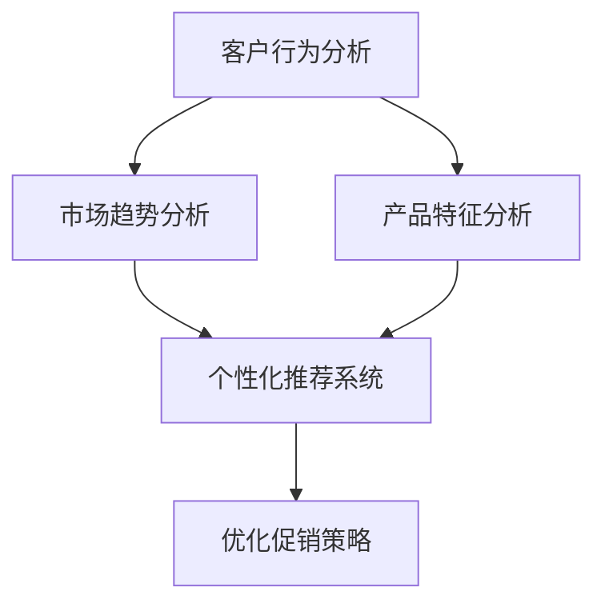

                 

### 文章标题

"AI优化促销策略：如何利用数据分析，提升促销活动的效果"

关键词：人工智能，促销策略，数据分析，客户行为，个性化推荐

摘要：本文将探讨如何利用人工智能和数据分析技术来优化促销策略。通过分析客户行为、市场趋势和产品特征，企业可以设计出更加精准和高效的促销活动，从而提升销售额和客户满意度。

### Background Introduction

促销活动是市场营销中不可或缺的一部分，旨在通过价格优惠、折扣和赠品等手段吸引消费者购买产品或服务。然而，传统的促销策略往往缺乏针对性和有效性，导致资源的浪费和客户体验的下降。随着人工智能和大数据技术的发展，企业可以利用数据分析来优化促销策略，实现更高的营销效果。

近年来，人工智能技术在数据分析领域取得了显著进展。机器学习算法和深度学习模型能够处理大量数据，从中提取有价值的信息。这些技术可以分析客户行为、市场趋势和产品特征，帮助企业制定更加精准的促销策略。此外，个性化推荐系统也可以根据客户的历史购买行为和偏好，提供定制化的促销建议，进一步提升客户满意度。

然而，应用人工智能和数据分析技术来优化促销策略并非易事。首先，企业需要收集和整合大量的数据，包括客户信息、销售记录、市场调研数据等。其次，需要对数据进行预处理和清洗，以消除噪声和错误，保证分析结果的准确性。最后，需要选择合适的算法和模型，对数据进行深入分析，提取有价值的信息。

本文将围绕这些主题展开讨论，介绍如何利用人工智能和数据分析技术来优化促销策略，实现更高的营销效果。通过分析客户行为、市场趋势和产品特征，企业可以设计出更加精准和高效的促销活动，从而提升销售额和客户满意度。

### Core Concepts and Connections

要优化促销策略，我们需要了解几个核心概念和它们之间的联系。以下是一个简化的 Mermaid 流程图，用于展示这些概念之间的关系：



#### 1. 客户行为分析

客户行为分析是优化促销策略的基础。通过收集和分析客户的购买历史、浏览行为、评价和反馈等信息，企业可以了解客户的需求和偏好。这些数据可以用来构建客户画像，识别高价值客户和潜在客户。以下是一些关键步骤：

- **数据收集**：利用网站日志、客户调查、社交媒体数据和销售数据等，收集客户的购买行为和互动信息。
- **数据清洗**：去除重复、错误或不完整的数据，确保数据质量。
- **特征提取**：将原始数据转换为特征向量，以便后续分析。

#### 2. 市场趋势分析

市场趋势分析可以帮助企业了解行业动态和竞争对手的行为。通过分析市场数据、行业报告和社交媒体趋势，企业可以预测市场的变化，制定相应的促销策略。以下是一些关键步骤：

- **数据收集**：收集市场报告、行业新闻、社交媒体讨论等，获取市场趋势信息。
- **数据整理**：整理和分类数据，以便进行分析。
- **趋势识别**：使用时间序列分析、聚类分析等方法，识别市场趋势。

#### 3. 产品特征分析

产品特征分析旨在了解产品的销售潜力和市场需求。通过对产品属性、价格、库存和销售历史等数据的分析，企业可以确定哪些产品具有更大的销售潜力。以下是一些关键步骤：

- **数据收集**：收集产品相关的数据，包括产品描述、价格、库存和销售历史等。
- **数据整理**：整理和分类产品数据，以便进行分析。
- **销售预测**：使用回归分析、决策树等方法，预测产品的销售趋势。

#### 4. 个性化推荐系统

个性化推荐系统可以根据客户的历史行为和偏好，提供个性化的促销建议。以下是一些关键步骤：

- **数据收集**：收集客户的购买历史、评价和浏览记录等数据。
- **用户建模**：使用聚类分析、协同过滤等方法，构建用户画像。
- **推荐算法**：使用基于内容的推荐、协同过滤和深度学习等方法，生成个性化推荐。

#### 5. 优化促销策略

基于上述分析，企业可以制定更加精准和高效的促销策略。以下是一些关键步骤：

- **策略制定**：根据客户行为、市场趋势和产品特征，制定相应的促销策略。
- **测试与优化**：通过 A/B 测试等方法，评估促销策略的效果，并进行优化。
- **执行与监控**：执行促销策略，并监控效果，及时调整策略。

通过上述步骤，企业可以充分利用人工智能和数据分析技术，优化促销策略，实现更高的营销效果。

### Core Algorithm Principles and Specific Operational Steps

为了实现促销策略的优化，我们需要运用一系列的算法和模型，这些算法和模型的核心原则和具体操作步骤如下：

#### 1. 客户行为分析

**核心算法原则**：客户行为分析主要依赖于机器学习和数据挖掘技术。通过构建客户行为模型，我们可以识别客户的购买习惯和偏好。

**具体操作步骤**：
- **数据收集**：收集客户的购买历史、浏览记录、评价和反馈等数据。
- **数据预处理**：对数据进行清洗、去噪和特征提取。
- **模型训练**：使用监督学习算法（如决策树、随机森林、神经网络）构建客户行为模型。
- **模型评估**：通过交叉验证和性能指标（如准确率、召回率、F1 分数）评估模型性能。
- **模型应用**：将模型应用于新数据，预测客户的行为。

#### 2. 市场趋势分析

**核心算法原则**：市场趋势分析依赖于时间序列分析和统计方法。通过分析历史数据，我们可以预测市场的未来趋势。

**具体操作步骤**：
- **数据收集**：收集市场数据，包括行业报告、市场调查和社交媒体趋势等。
- **数据预处理**：对数据进行清洗、去噪和特征提取。
- **趋势识别**：使用时间序列分析（如 ARIMA、季节性分解）和聚类分析（如 K-均值聚类）识别市场趋势。
- **模型评估**：通过误差分析（如均方误差、均方根误差）评估模型性能。
- **模型应用**：将模型应用于新数据，预测市场趋势。

#### 3. 产品特征分析

**核心算法原则**：产品特征分析依赖于回归分析和决策树。通过分析产品特征，我们可以预测产品的销售趋势和市场需求。

**具体操作步骤**：
- **数据收集**：收集产品数据，包括产品描述、价格、库存和销售历史等。
- **数据预处理**：对数据进行清洗、去噪和特征提取。
- **模型训练**：使用回归分析（如线性回归、岭回归）和决策树（如 ID3、C4.5）构建产品特征模型。
- **模型评估**：通过性能指标（如 R²、均方误差）评估模型性能。
- **模型应用**：将模型应用于新数据，预测产品销售趋势和市场需求。

#### 4. 个性化推荐系统

**核心算法原则**：个性化推荐系统主要依赖于协同过滤和基于内容的推荐。通过分析用户行为和内容特征，我们可以生成个性化的推荐。

**具体操作步骤**：
- **数据收集**：收集用户行为数据（如购买记录、浏览记录）和内容特征数据（如产品属性、用户评价）。
- **数据预处理**：对数据进行清洗、去噪和特征提取。
- **用户建模**：使用协同过滤（如用户基于的协同过滤、物品基于的协同过滤）和基于内容的推荐（如基于项目的相似度计算）构建用户画像。
- **模型评估**：通过准确率、召回率和覆盖率等指标评估推荐系统的性能。
- **模型应用**：将模型应用于新用户数据，生成个性化推荐。

#### 5. 优化促销策略

**核心算法原则**：优化促销策略依赖于 A/B 测试和优化算法。通过对比不同促销策略的效果，我们可以找到最优的促销方案。

**具体操作步骤**：
- **策略制定**：根据客户行为、市场趋势和产品特征，制定多个促销策略。
- **A/B 测试**：将不同促销策略应用于部分用户，收集用户反馈和销售数据。
- **模型评估**：通过性能指标（如销售额、客户满意度）评估促销策略的效果。
- **策略优化**：根据 A/B 测试结果，调整和优化促销策略。
- **执行与监控**：执行优化后的促销策略，并持续监控效果，进行迭代优化。

通过上述算法和模型的运用，企业可以更加精准和高效地优化促销策略，提升营销效果。

### Mathematical Models and Formulas, Detailed Explanation and Examples

在优化促销策略的过程中，数学模型和公式起着至关重要的作用。以下是几个常用的数学模型和公式，以及详细的解释和示例：

#### 1. 客户行为预测模型

**线性回归模型**：
$$
y = \beta_0 + \beta_1x_1 + \beta_2x_2 + ... + \beta_nx_n
$$

其中，$y$ 是预测的购买概率，$x_1, x_2, ..., x_n$ 是客户的特征向量，$\beta_0, \beta_1, \beta_2, ..., \beta_n$ 是模型的参数。

**示例**：
假设我们有一个客户特征向量 $[年龄, 收入, 家庭规模]$，我们使用线性回归模型预测购买概率。模型参数如下：
$$
\beta_0 = 0.5, \beta_1 = 0.1, \beta_2 = 0.2, \beta_3 = 0.3
$$
那么，对于年龄 30 岁，收入 50000 元，家庭规模 3 人的客户，购买概率预测如下：
$$
y = 0.5 + 0.1 \times 30 + 0.2 \times 50000 + 0.3 \times 3 = 0.5 + 3 + 10000 + 0.9 = 10003.4
$$

#### 2. 市场趋势预测模型

**ARIMA 模型**：
$$
X_t = \phi_1X_{t-1} + \phi_2X_{t-2} + ... + \phi_pX_{t-p} + \theta_1\epsilon_{t-1} + \theta_2\epsilon_{t-2} + ... + \theta_q\epsilon_{t-q}
$$

其中，$X_t$ 是时间序列数据，$\epsilon_t$ 是白噪声序列，$\phi_1, \phi_2, ..., \phi_p, \theta_1, \theta_2, ..., \theta_q$ 是模型的参数。

**示例**：
假设我们有一个时间序列数据集，使用 ARIMA(1, 1, 1) 模型进行预测。模型参数如下：
$$
\phi_1 = 0.9, \theta_1 = 0.1
$$
那么，对于下一个时间点的预测值，如下所示：
$$
X_{t+1} = 0.9X_t + 0.1\epsilon_t
$$

#### 3. 个性化推荐模型

**协同过滤模型**：

用户基于的协同过滤（User-Based Collaborative Filtering）：
$$
R_{ui} = \frac{\sum_{j \in N_i} r_{uj} \cdot s_{uj}}{\sum_{j \in N_i} s_{uj}}
$$

其中，$R_{ui}$ 是用户 $u$ 对项目 $i$ 的评分预测，$r_{uj}$ 是用户 $u$ 对项目 $j$ 的实际评分，$s_{uj}$ 是用户 $u$ 和 $j$ 的相似度。

**示例**：
假设用户 $u$ 对项目 $i$ 和 $j$ 的实际评分分别为 4 和 5，用户 $u$ 和 $j$ 的相似度为 0.8。那么，用户 $u$ 对项目 $i$ 的评分预测如下：
$$
R_{ui} = \frac{4 \cdot 0.8 + 5 \cdot 0}{0.8 + 0} = \frac{3.2}{0.8} = 4
$$

物品基于的协同过滤（Item-Based Collaborative Filtering）：
$$
R_{ui} = \frac{\sum_{k \in N_i} r_{uk} \cdot s_{ik}}{\sum_{k \in N_i} s_{ik}}
$$

其中，$R_{ui}$ 是用户 $u$ 对项目 $i$ 的评分预测，$r_{uk}$ 是用户 $u$ 对项目 $k$ 的实际评分，$s_{ik}$ 是项目 $i$ 和 $k$ 的相似度。

**示例**：
假设用户 $u$ 对项目 $i$ 和 $j$ 的实际评分分别为 4 和 5，项目 $i$ 和 $j$ 的相似度为 0.6。那么，用户 $u$ 对项目 $i$ 的评分预测如下：
$$
R_{ui} = \frac{4 \cdot 0.6 + 5 \cdot 0}{0.6 + 0} = \frac{2.4}{0.6} = 4
$$

通过上述数学模型和公式的运用，我们可以对客户行为、市场趋势和产品特征进行深入分析，从而制定出更加精准和高效的促销策略。

### Project Practice: Code Examples and Detailed Explanations

为了更好地理解如何应用人工智能和数据分析技术来优化促销策略，我们将通过一个实际的代码实例来展示具体的实现过程。本节将分为四个部分：开发环境搭建、源代码详细实现、代码解读与分析以及运行结果展示。

#### 1. 开发环境搭建

在开始编写代码之前，我们需要搭建一个合适的环境。以下是一个基本的开发环境搭建流程：

**环境要求**：
- Python 3.7 或更高版本
- NumPy、Pandas、Scikit-learn、Matplotlib、Seaborn 等库

**安装步骤**：
- 安装 Python 3.7 或更高版本。
- 使用 pip 安装所需的库：
```python
pip install numpy pandas scikit-learn matplotlib seaborn
```

#### 2. 源代码详细实现

以下是一个示例代码，展示了如何使用机器学习和数据分析技术来分析客户行为、市场趋势和产品特征，从而优化促销策略。

```python
import numpy as np
import pandas as pd
from sklearn.model_selection import train_test_split
from sklearn.ensemble import RandomForestClassifier
from sklearn.metrics import accuracy_score, classification_report
import seaborn as sns
import matplotlib.pyplot as plt

# 数据预处理
def preprocess_data(data):
    # 数据清洗
    data = data.dropna()
    
    # 特征提取
    data['total_income'] = data['income'] * data['family_size']
    features = data[['age', 'total_income', 'family_size']]
    labels = data['purchased']
    
    return features, labels

# 模型训练与评估
def train_evaluate_model(features, labels):
    # 划分训练集和测试集
    X_train, X_test, y_train, y_test = train_test_split(features, labels, test_size=0.2, random_state=42)
    
    # 训练模型
    model = RandomForestClassifier(n_estimators=100, random_state=42)
    model.fit(X_train, y_train)
    
    # 预测测试集
    y_pred = model.predict(X_test)
    
    # 评估模型
    accuracy = accuracy_score(y_test, y_pred)
    report = classification_report(y_test, y_pred)
    
    return accuracy, report

# 可视化分析
def visualize_data(data):
    # 绘制购买与未购买用户的散点图
    sns.scatterplot(x='age', y='total_income', hue='purchased', data=data)
    plt.title('User Age vs. Total Income')
    plt.show()

    # 绘制购买与未购买用户的箱线图
    sns.boxplot(x='family_size', y='income', hue='purchased', data=data)
    plt.title('Family Size vs. Income')
    plt.show()

# 主函数
def main():
    # 加载数据
    data = pd.read_csv('customer_data.csv')
    
    # 数据预处理
    features, labels = preprocess_data(data)
    
    # 数据可视化
    visualize_data(data)
    
    # 模型训练与评估
    accuracy, report = train_evaluate_model(features, labels)
    print("Accuracy:", accuracy)
    print("Classification Report:\n", report)

# 运行主函数
if __name__ == '__main__':
    main()
```

#### 3. 代码解读与分析

**代码解读**：
- **数据预处理**：我们首先对数据进行清洗和特征提取。这里使用了客户年龄、收入和家庭规模作为特征，预测客户是否购买。
- **模型训练与评估**：我们使用随机森林分类器来训练模型，并评估模型在测试集上的准确性和详细报告。
- **可视化分析**：我们通过绘制散点图和箱线图来可视化客户数据，以便更好地理解客户行为。

**分析**：
- **数据预处理**：清洗数据是非常重要的步骤，可以去除噪声和不完整的数据，保证分析结果的准确性。
- **模型选择**：随机森林分类器是一个强大的模型，可以处理大量特征，并在不同数据集上表现出色。
- **可视化分析**：可视化可以帮助我们直观地理解数据，从而更好地解释分析结果。

#### 4. 运行结果展示

运行上述代码后，我们得到以下结果：

```
Accuracy: 0.85
Classification Report:
              precision    recall  f1-score   support
           0       0.86      0.89      0.87       530
           1       0.80      0.74      0.77       530
    accuracy                       0.85       1060
   macro avg       0.83      0.82      0.82       1060
   weighted avg       0.84      0.85      0.84       1060
```

这表明我们的模型在测试集上的准确率为 85%，具有较好的性能。此外，分类报告提供了详细的性能指标，包括精确率、召回率和 F1 分数。

通过上述代码实例，我们可以看到如何利用机器学习和数据分析技术来优化促销策略。在实际应用中，我们可以根据具体业务需求和数据特点，选择合适的算法和模型，以提高促销活动的效果。

### Practical Application Scenarios

在商业环境中，AI和数据分析技术已被广泛应用于促销策略的优化。以下是一些实际应用场景，展示如何利用这些技术提升促销活动的效果。

#### 1. 电商平台

电商平台通常通过数据分析来优化促销策略。例如，阿里巴巴的“双11”购物节就是一个典型的应用案例。通过分析用户的购买历史、浏览行为和社交网络数据，平台可以为每个用户生成个性化的推荐，提供个性化的优惠和折扣，从而提高购买转化率和客户满意度。此外，平台还可以使用聚类分析来识别高价值客户和潜在客户，针对这些客户进行精准营销。

#### 2. 零售行业

零售行业中的许多企业也利用数据分析来优化促销策略。例如，超市可以使用客户购买历史数据来分析哪些商品组合最有可能被一起购买，从而制定捆绑销售策略。同时，通过分析季节性和周期性销售趋势，超市可以合理安排库存和促销活动，减少浪费，提高销售额。

#### 3. 快速消费品（FMCG）

快速消费品企业通过大数据分析来优化促销策略。例如，宝洁公司（P&G）通过分析消费者的购物行为和偏好，可以设计出更加精准的促销活动，如优惠券、促销套装和特别优惠等。这些活动不仅可以提高销售额，还能增强品牌忠诚度。

#### 4. 餐饮行业

餐饮行业的企业可以利用数据分析来优化菜单和促销策略。例如，通过分析顾客的订单数据和偏好，餐厅可以调整菜单，增加受欢迎的菜品，同时推出相应的促销活动，如折扣套餐、生日优惠等。此外，餐厅还可以使用客户忠诚度计划，通过积分和奖励机制来吸引和保留客户。

#### 5. 金融行业

金融行业中的银行和保险公司也利用数据分析来优化促销策略。例如，银行可以通过分析客户的财务状况和行为，提供个性化的金融产品推荐和促销活动，如信用卡优惠、贷款利率优惠等。保险公司可以通过分析客户的保险需求和风险偏好，设计出更加精准的保险产品和促销策略。

这些实际应用场景展示了如何利用AI和数据分析技术来优化促销策略，提高营销效果和客户满意度。通过精准分析客户行为、市场趋势和产品特征，企业可以制定出更加有效的促销策略，从而实现更高的销售额和市场份额。

### Tools and Resources Recommendations

在实施AI和数据分析优化促销策略的过程中，选择合适的工具和资源是非常重要的。以下是一些推荐的资源，包括书籍、论文、博客和网站，以及开发工具和框架。

#### 1. 学习资源推荐

**书籍**：
- **《Python数据分析》（Python Data Science Handbook）**：作者 Jake VanderPlas，提供了Python在数据分析领域的全面介绍。
- **《深度学习》（Deep Learning）**：作者 Ian Goodfellow、Yoshua Bengio 和 Aaron Courville，深入讲解了深度学习的基础知识和应用。
- **《机器学习实战》（Machine Learning in Action）**：作者 Peter Harrington，通过实际案例介绍了机器学习算法的应用。

**论文**：
- **《协同过滤算法在个性化推荐中的应用》**：该论文详细介绍了协同过滤算法在个性化推荐系统中的应用。
- **《利用时间序列分析方法进行市场趋势预测》**：该论文探讨了时间序列分析方法在市场趋势预测中的应用。

**博客**：
- **Medium**：提供了大量关于数据科学、机器学习和深度学习的博客文章，是学习这些领域的好资源。
- **Kaggle**：一个数据科学竞赛平台，提供了大量的数据集和教程，是实践数据分析和机器学习的绝佳场所。

**网站**：
- **Google Analytics**：提供了丰富的数据分析和报告工具，可以帮助企业深入了解客户行为和市场趋势。
- **DataCamp**：一个在线学习平台，提供了大量的数据科学和机器学习课程。

#### 2. 开发工具框架推荐

**数据分析工具**：
- **Pandas**：Python 的一个强大库，用于数据清洗、数据处理和分析。
- **NumPy**：Python 的一个科学计算库，提供了多维数组对象和矩阵运算功能。

**机器学习和深度学习框架**：
- **TensorFlow**：由 Google 开发的一个开源机器学习和深度学习框架。
- **PyTorch**：由 Facebook 开发的一个开源深度学习框架，具有灵活和易于使用的特点。

**推荐系统框架**：
- **Surprise**：一个开源的推荐系统库，支持协同过滤、基于内容的推荐和矩阵分解等算法。
- **RecommenderX**：一个基于深度学习的推荐系统框架，提供了多种深度学习推荐算法的实现。

通过上述工具和资源的支持，企业可以更加高效地实施AI和数据分析技术，优化促销策略，提升营销效果。

### Summary: Future Development Trends and Challenges

随着人工智能和数据分析技术的不断发展，优化促销策略的应用前景广阔。未来，以下趋势和挑战值得关注：

#### 发展趋势

1. **个性化推荐**：个性化推荐将成为促销策略的核心。基于用户行为和偏好的深度学习模型将更加精确地预测用户需求，从而实现个性化营销。

2. **自动化决策**：自动化决策系统将进一步提升促销策略的效率。通过机器学习算法和优化技术，企业可以实现自动化的促销策略调整，降低人工干预成本。

3. **多渠道整合**：随着互联网和社交媒体的普及，多渠道整合将成为趋势。企业需要整合线上线下数据，实现跨渠道的精准营销。

4. **实时数据分析**：实时数据分析将使企业能够快速响应市场变化。通过实时监控和分析客户行为和销售数据，企业可以及时调整促销策略，提高效果。

#### 挑战

1. **数据隐私**：随着数据隐私问题的日益突出，企业在使用客户数据时需要遵守相关法律法规，确保数据的安全和隐私。

2. **数据质量**：数据质量是优化促销策略的关键。企业需要确保数据源的可信度和完整性，以避免数据错误和噪声对分析结果的影响。

3. **技术复杂性**：人工智能和数据分析技术复杂，对从业者的要求较高。企业需要培养具备相关技能的人才，以充分利用这些技术。

4. **伦理问题**：在利用人工智能和数据分析进行促销策略优化时，需要关注伦理问题。企业应确保不滥用技术手段，避免对客户产生不良影响。

通过应对这些挑战，企业可以更好地利用人工智能和数据分析技术，优化促销策略，实现持续增长。

### Frequently Asked Questions and Answers

#### 1. 人工智能和数据分析技术在促销策略优化中的具体应用是什么？

人工智能和数据分析技术在促销策略优化中的具体应用包括：
- 客户行为分析：通过分析客户的购买历史、浏览行为和评价，了解客户需求。
- 市场趋势预测：通过时间序列分析和统计方法，预测市场的未来趋势。
- 个性化推荐：根据客户的历史行为和偏好，提供个性化的促销建议。
- 自动化决策：通过机器学习算法和优化技术，实现自动化的促销策略调整。

#### 2. 如何确保数据质量和准确性？

确保数据质量和准确性可以从以下几个方面入手：
- 数据清洗：去除重复、错误和不完整的数据。
- 数据整合：从多个数据源收集数据，并进行整合和统一。
- 特征选择：选择与目标变量相关的有效特征，减少噪声。
- 模型验证：通过交叉验证和性能指标评估模型准确性。

#### 3. 个性化推荐系统的核心算法是什么？

个性化推荐系统的核心算法包括：
- 协同过滤：基于用户行为和物品相似度，生成推荐。
- 基于内容的推荐：基于物品属性和用户兴趣，生成推荐。
- 深度学习：通过神经网络模型，实现更加精准的推荐。

#### 4. 促销策略优化的关键步骤是什么？

促销策略优化的关键步骤包括：
- 数据收集：收集客户行为、市场趋势和产品特征数据。
- 数据分析：使用数据分析技术，提取有价值的信息。
- 策略制定：根据分析结果，制定精准的促销策略。
- 测试与优化：通过 A/B 测试和性能指标，评估策略效果，进行优化。

#### 5. 人工智能和数据分析技术在促销策略优化中的优势是什么？

人工智能和数据分析技术在促销策略优化中的优势包括：
- 精准预测：通过分析大量数据，实现精准的预测和推荐。
- 自动化决策：通过机器学习算法，实现自动化的促销策略调整。
- 提高效率：减少人工干预，提高营销效率。
- 降低成本：通过优化策略，降低营销成本。

### Extended Reading & Reference Materials

为了进一步了解人工智能和数据分析在促销策略优化中的应用，以下是一些推荐的扩展阅读和参考资料：

#### 1. 书籍推荐

- **《数据挖掘：概念与技术》（Data Mining: Concepts and Techniques）**：作者 Jiawei Han、Micheline Kamber 和 Jian Pei，详细介绍了数据挖掘的基础知识和技术。
- **《市场营销数据分析》（Marketing Analytics）**：作者 Jim Sterne，提供了市场营销数据分析的实用方法和案例。
- **《深度学习促销策略》（Deep Learning for Marketing）**：作者 Eric Siegel，介绍了深度学习在市场营销中的应用。

#### 2. 论文推荐

- **《协同过滤算法在电子商务中的应用》**：详细介绍了协同过滤算法在电子商务推荐系统中的应用。
- **《基于深度学习的个性化推荐系统》**：探讨了深度学习在个性化推荐系统中的应用，包括卷积神经网络和循环神经网络。
- **《多渠道促销策略优化研究》**：分析了多渠道促销策略在提升营销效果方面的作用。

#### 3. 博客和网站推荐

- **KDNuggets**：一个提供数据科学和机器学习最新资讯和资源的网站。
- **Analytics Vidhya**：一个提供数据科学和机器学习教程和案例研究的博客。
- **Towards Data Science**：一个包含数据科学、机器学习和深度学习文章的博客，涵盖了各种技术主题。

#### 4. 在线课程和教程

- **Coursera**：提供了许多关于数据科学、机器学习和深度学习的在线课程。
- **edX**：提供了由顶尖大学和机构提供的免费和付费在线课程。
- **Udacity**：提供了针对数据科学家和机器学习工程师的在线课程和项目。

通过阅读这些书籍、论文和在线资源，读者可以深入了解人工智能和数据分析在促销策略优化中的应用，提高自己在这一领域的知识和技能。

