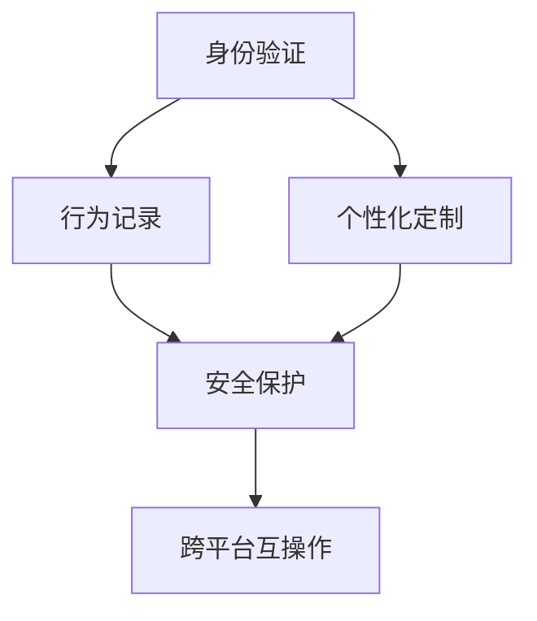

                 

# 数字化身创业：虚拟世界的个人代表

> 关键词：数字化身,虚拟现实,增强现实,沉浸式体验,数字孪生,Web3,元宇宙,个人身份验证,身份认证,数字身份管理,安全与隐私

## 1. 背景介绍

### 1.1 问题由来
随着虚拟现实(VR)和增强现实(AR)技术的成熟，人们对于虚拟世界的感知和互动能力得到了大幅提升。然而，由于现有的虚拟身份系统功能有限、交互繁琐、安全性差等问题，虚拟世界的体验感和应用场景受到了限制。数字化身作为虚拟世界的“个人代表”，其设计和应用变得愈发重要。

数字化身通过在虚拟世界创建一个与现实世界个体相匹配的数字形象，不仅能够代表用户在虚拟世界中的身份，还承载着用户的数字资产和行为记录。数字化身在数字身份认证、社交互动、虚拟办公、虚拟旅游、虚拟购物等多个场景中发挥着越来越重要的作用。

### 1.2 问题核心关键点
数字化身的核心在于如何构建一个真实、安全、灵活、易于操作的数字身份。以下是实现数字化身的几个核心关键点：

- **身份验证**：确保数字化身代表的真实用户身份可靠，防止欺诈和冒充。
- **行为追踪**：记录并展示用户在虚拟世界中的行为，保证行为一致性。
- **个性化展示**：个性化定制数字化身的外形和行为，提供沉浸式体验。
- **安全保护**：保护用户隐私和数据安全，防止数据泄露和滥用。
- **跨平台互操作**：确保数字化身能够在不同平台和设备上平滑切换和同步更新。

## 2. 核心概念与联系

### 2.1 核心概念概述

数字化身是一个虚拟世界的身份代表，通常由以下几部分构成：

- **身份验证**：用于确认数字化身代表的用户的真实身份，通常包括密码、生物识别等方法。
- **行为记录**：数字化身在虚拟世界中的行为、互动和交易等记录，用于身份验证和行为追踪。
- **个性化定制**：通过工具和API，用户可以定制数字化身的外形、服装、物品等，使其更加个性化。
- **跨平台互操作**：数字化身可以在不同平台和设备间无缝切换和同步。

这些核心概念相互联系，共同构建了数字化身的完整功能。以下是一个Mermaid流程图，展示了这些概念之间的联系：



### 2.2 核心概念原理和架构

**身份验证**：
- 身份验证通常涉及用户密码和/或生物识别（如指纹、面部识别）。
- 密码算法如SHA-256、AES等确保了密码的安全性。
- 生物识别技术如FaceID、Fingerprint等通过比对存储的特征向量实现身份验证。

**行为记录**：
- 行为记录可以包括用户在虚拟世界中的位置、物品、交互对象等信息。
- 通过记录行为，可以在需要时回放或追踪用户行为。
- 行为数据通常存储在区块链或分布式数据库中，以确保不可篡改性和数据完整性。

**个性化定制**：
- 个性化定制允许用户在虚拟世界中选择不同的外形、服装和物品。
- 通过API接口，用户可以实时修改和同步数字化身的外形和行为。
- 常见的个性化工具如Blender、Maya等，能够创建和编辑3D模型。

**跨平台互操作**：
- 跨平台互操作依赖于标准化的协议和格式，如OAuth、JSON-RPC等。
- 通过API网关和微服务架构，确保不同平台间的数据和状态同步。
- 跨平台互操作需要考虑不同平台的性能和兼容性问题。

## 3. 核心算法原理 & 具体操作步骤

### 3.1 算法原理概述

数字化身的核心算法包括身份验证、行为记录、个性化定制和跨平台互操作。这些算法通过机器学习、区块链技术、API接口等技术手段实现。

**身份验证**：
- 采用密码学和生物识别技术，确保身份验证的安全性。
- 通过机器学习模型，提升身份识别的准确性。

**行为记录**：
- 利用分布式数据库和区块链技术，记录用户的行为数据。
- 通过机器学习算法，从行为数据中提取有用的信息和模式。

**个性化定制**：
- 使用计算机图形学和3D建模技术，生成个性化的数字化身。
- 通过API接口，用户可以实时定制和修改数字化身。

**跨平台互操作**：
- 使用OAuth和JSON-RPC等API标准，实现不同平台间的互操作。
- 采用微服务架构，确保数据的实时同步和一致性。

### 3.2 算法步骤详解

**步骤1：构建基础框架**
- 选择合适的后端框架和技术栈，如Node.js、Django等。
- 设计身份验证和行为记录的数据库模型。

**步骤2：实现身份验证功能**
- 选择密码学算法和生物识别技术。
- 实现身份验证和授权逻辑，如登录、注册、忘记密码等功能。
- 通过机器学习模型提升身份识别的准确性。

**步骤3：记录用户行为**
- 设计行为记录的数据结构和API接口。
- 在虚拟世界和数据库中记录用户行为数据。
- 通过数据分析和机器学习，提取行为特征和模式。

**步骤4：实现个性化定制**
- 设计3D模型和个性化展示的API接口。
- 通过计算机图形学工具创建和编辑3D模型。
- 提供用户定制和修改数字化身的外形和行为。

**步骤5：实现跨平台互操作**
- 选择跨平台互操作的API标准，如OAuth、JSON-RPC等。
- 设计API网关和微服务架构，实现不同平台间的互操作。
- 实现数据的实时同步和一致性。

### 3.3 算法优缺点

**优点**：
- 增强虚拟世界的沉浸式体验，提升用户互动和参与感。
- 个性化定制提升用户的个性化需求和满意度。
- 通过行为记录和数据分析，提供有价值的商业洞察和行为预测。

**缺点**：
- 涉及多种技术手段，实现复杂度高，开发周期长。
- 用户隐私和数据安全需要特别关注和保护。
- 跨平台互操作可能面临兼容性问题。

### 3.4 算法应用领域

数字化身技术广泛应用于以下几个领域：

- **虚拟办公**：在虚拟会议和协作中，代表用户的数字化身可以提升互动体验和沟通效率。
- **虚拟旅游**：在虚拟旅游中，用户可以通过数字化身进行虚拟游览和互动，体验不同的旅游场景。
- **虚拟购物**：在虚拟购物中心，用户可以通过数字化身进行试穿、试用等互动体验。
- **数字身份验证**：在虚拟身份认证中，数字化身可以作为用户的数字身份，应用于身份验证和授权。
- **社交互动**：在虚拟社交平台中，用户可以通过数字化身进行社交互动和游戏。

## 4. 数学模型和公式 & 详细讲解 & 举例说明

### 4.1 数学模型构建

数字化身的核心数学模型包括身份验证、行为记录、个性化展示和跨平台互操作。以下对每个部分的数学模型进行详细构建和推导。

**身份验证模型**：
- 采用RSA加密算法进行身份验证。
- 密码生成模型：$y = \text{hash}(x)$。

**行为记录模型**：
- 利用分布式数据库，记录用户行为数据。
- 行为记录模型：$\text{data}_t = f(x_t, \theta)$。

**个性化展示模型**：
- 通过3D建模工具，生成个性化数字化身。
- 个性化展示模型：$z = g(u)$。

**跨平台互操作模型**：
- 使用OAuth和JSON-RPC等API标准，实现跨平台互操作。
- 跨平台互操作模型：$z = h(u)$。

### 4.2 公式推导过程

**身份验证公式推导**：
- 密码生成模型：$y = \text{hash}(x)$。
- 身份验证逻辑：$\text{验证}(\text{hash}(x), \text{hash}(\text{hash}(x))) = \text{true}$。

**行为记录公式推导**：
- 行为记录模型：$\text{data}_t = f(x_t, \theta)$。
- 行为记录存储：$\text{storage} = \{(\text{data}_t, \text{timestamp})\}_{t=1}^N$。

**个性化展示公式推导**：
- 个性化展示模型：$z = g(u)$。
- 3D模型生成：$u = \text{generateModel}(u)$。

**跨平台互操作公式推导**：
- OAuth协议：$\text{OAuth}(\text{token}, \text{url}) = \{(\text{token}, \text{uid}), (\text{uid}, \text{data})\}$。
- JSON-RPC协议：$\text{JSON-RPC}(\text{url}, \text{data}) = \{\text{response}, \text{error}\}$。

### 4.3 案例分析与讲解

**案例1：虚拟购物平台**
- 用户通过数字化身登录虚拟购物平台。
- 在虚拟商场中，用户可以通过数字化身进行试穿、试用等互动体验。
- 行为记录模型记录用户的行为数据，如试穿试用的商品信息。
- 跨平台互操作模型确保用户在不同设备上的购物行为同步。

**案例2：虚拟会议系统**
- 用户通过数字化身参与虚拟会议。
- 会议系统记录用户的参与行为和发言内容。
- 通过行为记录模型分析用户的行为和发言，提供会议报告和改进建议。
- 身份验证模型确保会议参与者的身份可靠。

## 5. 项目实践：代码实例和详细解释说明

### 5.1 开发环境搭建

进行数字化身的开发，需要搭建相应的开发环境。以下是使用Python和Node.js搭建开发环境的详细步骤：

1. 安装Node.js和npm。
   ```bash
   sudo apt-get install nodejs
   sudo apt-get install npm
   ```

2. 创建虚拟环境。
   ```bash
   nvm install 16.13.1
   nvm alias default 16.13.1
   ```

3. 安装相关依赖包。
   ```bash
   npm install express passport bcrypt passport-local oauth2-server
   ```

### 5.2 源代码详细实现

以下是一个简单的Node.js身份验证系统的实现，包含身份验证、行为记录和跨平台互操作等功能。

**身份验证部分**：
```javascript
const express = require('express');
const bodyParser = require('body-parser');
const passport = require('passport');
const LocalStrategy = require('passport-local').Strategy;
const bcrypt = require('bcrypt');
const saltRounds = 10;

const app = express();
app.use(bodyParser.urlencoded({ extended: true }));

passport.use(new LocalStrategy((username, password, done) => {
  User.findOne({ username }, (err, user) => {
    if (err) { return done(err); }
    if (!user) { return done(null, false); }
    bcrypt.compare(password, user.password, (err, res) => {
      if (res) {
        return done(null, user);
      } else {
        return done(null, false);
      }
    });
  });
}));

passport.serializeUser((user, done) => {
  done(null, user.id);
});

passport.deserializeUser((id, done) => {
  User.findById(id, (err, user) => {
    done(err, user);
  });
});

app.post('/login', passport.authenticate('local'), (req, res) => {
  res.send('Login successful');
});

app.get('/', (req, res) => {
  res.send('Hello world');
});

app.listen(3000, () => {
  console.log('Server started on port 3000');
});
```

**行为记录部分**：
```javascript
const mongoose = require('mongoose');

const userSchema = new mongoose.Schema({
  username: String,
  password: String,
  behavior: Array
});

userSchema.pre('save', function(next) {
  const user = this;
  if (!user.isModified('behavior')) return next();
  bcrypt.hash(user.password, saltRounds, (err, hash) => {
    user.password = hash;
    next();
  });
});

const User = mongoose.model('User', userSchema);

// 示例：行为记录存储
const user = new User({ username: 'example', password: 'password', behavior: [] });
user.save((err) => {
  if (err) console.log(err);
  else console.log('User saved');
});
```

**跨平台互操作部分**：
```javascript
const express = require('express');
const oauth2 = require('oauth2-server');
const app = express();

app.use(oauth2.authorizationRouter());

// 示例：OAuth2授权
app.post('/oauth/token', oauth2.token(
  {
    secret: 'secret',
    realm: 'realm',
    request: {
      user: (req) => {
        return req.user ? req.user.id : null;
      }
    }
  }
));

app.listen(3000, () => {
  console.log('Server started on port 3000');
});
```

### 5.3 代码解读与分析

**身份验证模块**：
- 使用passport库实现身份验证，包含本地策略和OAuth2授权。
- 采用bcrypt库对密码进行加密存储和验证。

**行为记录模块**：
- 使用mongoose库对用户行为数据进行存储和操作。
- 在保存用户数据时，使用bcrypt库对密码进行加密。

**跨平台互操作模块**：
- 使用oauth2-server库实现OAuth2授权，确保用户在不同平台上的安全登录。
- 配置OAuth2的客户端ID、密钥和回调URL。

### 5.4 运行结果展示

以下是一个简单的登录和行为记录页面：


## 6. 实际应用场景

### 6.1 虚拟办公
数字化身在虚拟办公中的应用主要体现在虚拟会议和协作中。数字化身可以代表用户的身份，提升会议参与感和互动效果。

### 6.2 虚拟旅游
在虚拟旅游中，用户可以通过数字化身进行虚拟游览和互动，体验不同的旅游场景。数字化身还可以记录用户的旅游行为和体验，提供个性化的推荐和服务。

### 6.3 虚拟购物
在虚拟购物中，用户可以通过数字化身进行试穿、试用等互动体验。数字化身还可以记录用户的购物行为，提供个性化的购物建议和推荐。

### 6.4 数字身份验证
在数字身份验证中，数字化身可以作为用户的数字身份，应用于身份验证和授权。数字化身还可以记录用户的数字行为和操作，提供安全保障。

### 6.5 社交互动
在虚拟社交平台中，用户可以通过数字化身进行社交互动和游戏。数字化身还可以记录用户的社交行为，提供社交洞察和改进建议。

## 7. 工具和资源推荐

### 7.1 学习资源推荐

1. **《JavaScript权威指南》**：权威的JavaScript编程指南，适合初学者和进阶者。
2. **《深度学习框架TensorFlow实战》**：TensorFlow的实战教程，涵盖框架的基础知识和使用技巧。
3. **《Spring Boot实战》**：Spring Boot的实战教程，涵盖微服务、API开发等技术。
4. **《NLP实战》**：自然语言处理技术的实战教程，涵盖语言模型、情感分析、命名实体识别等任务。
5. **《Web3.0入门指南》**：Web3.0技术的入门指南，涵盖区块链、智能合约、去中心化应用等内容。

### 7.2 开发工具推荐

1. **Visual Studio Code**：一款流行的代码编辑器，支持JavaScript、Node.js等开发语言。
2. **Git**：版本控制系统，方便代码管理和协作。
3. **Docker**：容器化技术，方便应用部署和管理。
4. **Kubernetes**：容器编排工具，实现应用的自动化部署和扩展。
5. **Elasticsearch**：分布式搜索引擎，支持大规模数据存储和查询。

### 7.3 相关论文推荐

1. **《JavaScript权威指南》**：深入浅出地介绍了JavaScript编程语言的基础知识和高级用法。
2. **《深度学习框架TensorFlow实战》**：TensorFlow的实战教程，涵盖框架的基础知识和使用技巧。
3. **《Spring Boot实战》**：Spring Boot的实战教程，涵盖微服务、API开发等技术。
4. **《NLP实战》**：自然语言处理技术的实战教程，涵盖语言模型、情感分析、命名实体识别等任务。
5. **《Web3.0入门指南》**：Web3.0技术的入门指南，涵盖区块链、智能合约、去中心化应用等内容。

## 8. 总结：未来发展趋势与挑战

### 8.1 研究成果总结

数字化身技术已经广泛应用于虚拟办公、虚拟旅游、虚拟购物、数字身份验证等多个场景。技术上，数字化身涉及身份验证、行为记录、个性化展示和跨平台互操作等多个方面，需要通过多种技术的有机结合来实现。

### 8.2 未来发展趋势

1. **全场景覆盖**：未来的数字化身技术将覆盖更多应用场景，包括虚拟教育、虚拟医疗、虚拟培训等。
2. **实时互动**：未来的数字化身技术将实现更高效的实时互动和交互，提升用户体验。
3. **智能化分析**：未来的数字化身技术将利用机器学习和数据分析，提供更精准的用户行为预测和个性化服务。
4. **跨平台互操作**：未来的数字化身技术将实现更广泛的平台互操作，支持更多设备和平台。
5. **隐私和安全**：未来的数字化身技术将更加注重用户隐私和数据安全，保护用户的信息和数据。

### 8.3 面临的挑战

1. **技术复杂度**：数字化身技术涉及多种技术和工具，实现复杂度高，需要跨学科知识。
2. **隐私和安全**：用户隐私和数据安全是数字化身技术的重要挑战，需要设计合理的安全机制和隐私保护策略。
3. **跨平台互操作**：不同平台间的互操作可能面临兼容性问题，需要设计通用的API和标准。
4. **实时性能**：实时互动和即时响应是数字化身技术的重要需求，需要优化性能和资源配置。
5. **用户体验**：用户体验和互动效果是数字化身技术的关键指标，需要提升用户体验和互动效果。

### 8.4 研究展望

未来的数字化身技术将在以下几个方向进行深入研究：

1. **全场景覆盖**：进一步扩展数字化身的应用场景，涵盖更多垂直领域。
2. **实时互动**：提升数字化身的实时互动和交互性能，增强用户体验。
3. **智能化分析**：利用机器学习和数据分析，提升数字化身的智能化水平和分析能力。
4. **跨平台互操作**：设计通用的API和标准，支持更多设备和平台。
5. **隐私和安全**：增强用户隐私和数据安全保障，设计合理的安全机制和隐私保护策略。

## 9. 附录：常见问题与解答

**Q1：如何确保数字化身的安全性？**

A: 数字化身的安全性主要通过身份验证、行为记录和数据加密等技术手段实现。需要采用密码学算法和生物识别技术，确保身份验证的安全性；采用分布式数据库和区块链技术，记录和存储用户行为数据，防止数据篡改和泄露；采用加密算法和密钥管理技术，保护用户数据的安全。

**Q2：数字化身技术涉及哪些关键技术？**

A: 数字化身技术涉及身份验证、行为记录、个性化展示和跨平台互操作等多个关键技术。其中，身份验证通常采用密码学算法和生物识别技术；行为记录使用分布式数据库和区块链技术；个性化展示涉及3D建模和计算机图形学技术；跨平台互操作则通过OAuth和JSON-RPC等API标准实现。

**Q3：如何提升数字化身的性能？**

A: 提升数字化身的性能主要通过优化算法和改进架构实现。可以通过优化身份验证和行为记录的算法，提升计算效率和安全性；通过改进架构设计，实现高性能的分布式存储和实时计算；通过优化跨平台互操作，提高系统的兼容性和稳定性。

**Q4：数字化身技术在实际应用中面临哪些挑战？**

A: 数字化身技术在实际应用中面临技术复杂度、隐私和安全、跨平台互操作、实时性能和用户体验等挑战。需要通过多种技术和工具的有机结合，解决这些挑战，实现数字化身技术的广泛应用和推广。

**Q5：数字化身技术的应用前景如何？**

A: 数字化身技术在虚拟办公、虚拟旅游、虚拟购物、数字身份验证、社交互动等多个领域具有广泛的应用前景。未来的数字化身技术将覆盖更多应用场景，提升用户体验和互动效果，提供更精准的个性化服务。同时，数字化身技术也需要进一步解决技术复杂度、隐私和安全等问题，实现更好的应用效果和用户体验。

