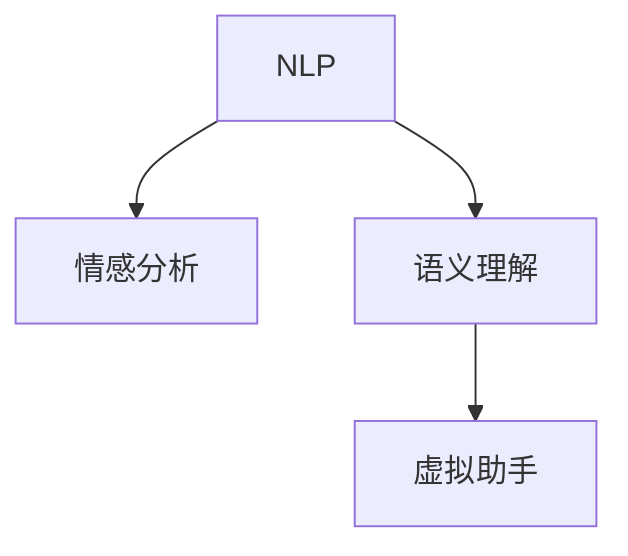

                 

## 1. 背景介绍

在数字化时代，信息技术的进步使得人们可以将个人经历、记忆、情感等数字化遗产保存下来，供后人了解和传承。然而，如何准确、生动地表达这些复杂的个人特质，并让后代能够真正感受到先辈的情感和智慧，仍然是一大挑战。数字化情感AI的兴起，为这一难题提供了一种全新的解决方案。

数字化情感AI不仅能够准确捕捉并理解情感，还能够在虚拟助手中模拟人的情感，实现与用户的深度互动。这种技术结合了自然语言处理(NLP)、情感分析、机器学习等多领域知识，能够创造出个性化的虚拟助手，让传承者与数字化遗产之间的连接更加真实和感人。

## 2. 核心概念与联系

### 2.1 核心概念概述

数字化情感AI指的是通过深度学习模型，特别是情感分析、语义理解等技术，实现对情感的准确捕捉和模拟。具体来说，它包括以下关键概念：

- **自然语言处理(NLP)**：用于处理和分析人类语言的技术，涉及语言模型、语义分析、情感分析等。
- **情感分析**：识别文本中的情感信息，如情绪、态度、意图等。
- **语义理解**：理解文本中涉及的概念、关系和语境，准确表达和生成自然语言。
- **虚拟助手**：基于上述技术，模拟人的交互行为，提供个性化服务。

这些概念之间的联系可以通过以下Mermaid流程图来展示：



该流程图展示了NLP、情感分析和语义理解在虚拟助手中的应用关系：NLP是情感分析和语义理解的基础，而虚拟助手通过情感分析和语义理解实现对用户情感的捕捉和模拟。

### 2.2 核心概念原理和架构

#### 2.2.1 NLP原理

NLP的核心是使用机器学习模型处理和理解自然语言。常见的模型包括循环神经网络(RNN)、长短时记忆网络(LSTM)、Transformer等。其中，Transformer模型因其在处理长距离依赖关系和并行计算效率上的优势，成为目前NLP任务中的主流模型。

#### 2.2.2 情感分析原理

情感分析通常使用文本分类技术，通过训练数据集来识别情感极性（如正面、负面、中性）和情感强度。常用的算法包括朴素贝叶斯、逻辑回归、支持向量机等。近年来，基于深度学习的神经网络模型，如卷积神经网络(CNN)、递归神经网络(RNN)、循环神经网络(RNN)等在情感分析中表现优异。

#### 2.2.3 语义理解原理

语义理解旨在捕捉文本中蕴含的语义信息，如命名实体识别、关系抽取等。这一过程通常涉及序列标注、实体识别、关系抽取等任务。近年来，基于Transformer的BERT、GPT等模型在这方面的表现尤为突出。

## 3. 核心算法原理 & 具体操作步骤

### 3.1 算法原理概述

数字化情感AI的核心算法包括自然语言处理、情感分析和语义理解。其整体流程可以分为数据预处理、模型训练和模型推理三个阶段：

1. **数据预处理**：收集和标注情感相关的文本数据，并进行清洗和预处理，确保数据质量。
2. **模型训练**：使用训练数据集训练情感分析模型和语义理解模型，优化模型参数。
3. **模型推理**：将用户输入的文本输入到模型中，进行情感分析和语义理解，生成虚拟助手的交互内容。

### 3.2 算法步骤详解

#### 3.2.1 数据预处理

数据预处理包括数据收集、清洗和标注等步骤。具体流程如下：

1. **数据收集**：从社交媒体、在线论坛、客户反馈等渠道收集情感相关的文本数据。
2. **数据清洗**：去除噪声和无关信息，如标点符号、停用词等。
3. **数据标注**：人工标注情感极性和情感强度，如正面、负面、中性以及情感强度等级。

#### 3.2.2 模型训练

模型训练包括选择模型、训练和调参等步骤。具体流程如下：

1. **选择模型**：根据任务需求选择合适的情感分析模型和语义理解模型，如BERT、GPT等。
2. **训练模型**：使用标注数据集进行模型训练，优化模型参数，提高模型的准确性和泛化能力。
3. **调参优化**：根据模型在验证集上的表现，调整超参数，如学习率、批大小、正则化系数等。

#### 3.2.3 模型推理

模型推理包括文本输入、情感分析和语义理解等步骤。具体流程如下：

1. **文本输入**：将用户输入的文本作为模型的输入。
2. **情感分析**：使用训练好的情感分析模型，对用户输入的文本进行情感分析，识别情感极性和强度。
3. **语义理解**：使用训练好的语义理解模型，对用户输入的文本进行语义分析，识别关键实体和关系。
4. **生成回复**：根据情感分析和语义理解的结果，生成虚拟助手的回复内容。

### 3.3 算法优缺点

#### 3.3.1 优点

- **高准确性**：深度学习模型在情感分析和语义理解方面表现优异，能够准确捕捉用户情感和语义信息。
- **个性化服务**：虚拟助手能够根据用户的历史互动和情感变化，提供个性化服务，提升用户体验。
- **广泛应用**：数字化情感AI可以应用于多种场景，如客户服务、健康咨询、教育辅导等。

#### 3.3.2 缺点

- **数据依赖**：情感分析模型的效果很大程度上依赖于标注数据的质量和数量，数据获取成本较高。
- **模型复杂度**：深度学习模型通常参数较多，训练和推理过程较复杂，资源需求较高。
- **缺乏人性化**：虚拟助手虽然可以模拟情感，但仍然无法完全替代真人互动，缺乏真实的情感体验。

### 3.4 算法应用领域

数字化情感AI广泛应用于以下领域：

- **客户服务**：提供24/7的客户支持，通过情感分析理解用户情绪，提供个性化解决方案。
- **健康咨询**：基于用户的情感和健康数据，提供心理健康咨询和疾病预防建议。
- **教育辅导**：通过语义理解分析学生问题，提供个性化的学习建议和资源。
- **旅游推荐**：基于用户情感和兴趣，提供个性化旅游推荐和服务。
- **金融咨询**：根据用户的情感和财务状况，提供个性化的理财建议和风险评估。

## 4. 数学模型和公式 & 详细讲解

### 4.1 数学模型构建

数字化情感AI的数学模型包括情感分析和语义理解。

#### 4.1.1 情感分析模型

情感分析模型通常使用文本分类算法，如朴素贝叶斯、支持向量机、逻辑回归等。假设文本数据为 $D=\{(x_i,y_i)\}_{i=1}^N$，其中 $x_i$ 为文本，$y_i$ 为情感标签。情感分析模型可以使用如下公式表示：

$$
\hat{y} = \arg\min_{y} \mathcal{L}(f(x; \theta), y)
$$

其中 $f(x; \theta)$ 为模型，$\theta$ 为模型参数，$\mathcal{L}$ 为损失函数，$\hat{y}$ 为模型预测的情感标签。

#### 4.1.2 语义理解模型

语义理解模型通常使用序列标注和关系抽取算法，如CRF、RNN、Transformer等。假设文本数据为 $D=\{(x_i,y_i)\}_{i=1}^N$，其中 $x_i$ 为文本，$y_i$ 为语义标签。语义理解模型可以使用如下公式表示：

$$
\hat{y} = \arg\min_{y} \mathcal{L}(f(x; \theta), y)
$$

其中 $f(x; \theta)$ 为模型，$\theta$ 为模型参数，$\mathcal{L}$ 为损失函数，$\hat{y}$ 为模型预测的语义标签。

### 4.2 公式推导过程

#### 4.2.1 情感分析模型推导

情感分析模型的训练过程如下：

1. **选择模型**：选择适当的模型，如朴素贝叶斯、逻辑回归等。
2. **训练模型**：使用标注数据集进行模型训练，优化模型参数。
3. **预测情感**：将新的文本输入到模型中，输出情感标签。

假设使用朴素贝叶斯模型进行情感分析，训练过程如下：

$$
P(y_i|x_i) = \frac{P(y_i)}{\sum_{y_j} P(y_j)} \prod_{j=1}^n \frac{P(x_{ij}|y_i)}{P(x_{ij})}
$$

其中 $P(y_i|x_i)$ 为情感分类概率，$n$ 为特征数量，$x_{ij}$ 为文本特征，$P(y_i)$ 为先验概率，$P(x_{ij})$ 为文本特征的概率。

#### 4.2.2 语义理解模型推导

语义理解模型的训练过程如下：

1. **选择模型**：选择适当的模型，如CRF、RNN、Transformer等。
2. **训练模型**：使用标注数据集进行模型训练，优化模型参数。
3. **预测语义**：将新的文本输入到模型中，输出语义标签。

假设使用Transformer模型进行语义理解，训练过程如下：

1. **编码器**：将输入文本 $x$ 编码成向量 $h$。
2. **解码器**：将向量 $h$ 解码成标签序列 $y$。
3. **损失函数**：使用交叉熵损失函数 $\mathcal{L}$ 来计算模型预测与真实标签之间的差异。

假设使用交叉熵损失函数，训练过程如下：

$$
\mathcal{L} = -\frac{1}{N} \sum_{i=1}^N \sum_{j=1}^m \log P(y_{ij}|x_i)
$$

其中 $P(y_{ij}|x_i)$ 为模型预测的概率，$y_{ij}$ 为真实标签。

### 4.3 案例分析与讲解

假设有一个用户输入了一段文本：“我今天心情很不好，因为工作太累了。” 通过情感分析模型，可以得到该文本的情感极性为负面，情感强度为中等。

接着，通过语义理解模型，可以得到该文本中包含的实体和关系如下：

- 实体：“我”、“工作”、“今天”
- 关系：“心情” - “不好”、“工作” - “累”

根据以上信息，虚拟助手可以生成如下回复：“是否需要我帮忙调休一下？或者需要倾诉一下心情？”

## 5. 项目实践：代码实例和详细解释说明

### 5.1 开发环境搭建

为了进行数字化情感AI的开发，需要搭建Python开发环境，并配置必要的库和工具。具体步骤如下：

1. **安装Python**：下载并安装Python 3.8及以上版本。
2. **安装必要的库**：使用pip安装必要的库，如TensorFlow、PyTorch、NLTK等。
3. **配置工具**：安装必要的工具，如Git、Jupyter Notebook等。

### 5.2 源代码详细实现

下面以情感分析为例，展示使用TensorFlow实现情感分析模型的代码：

```python
import tensorflow as tf
import numpy as np
from tensorflow.keras.preprocessing.text import Tokenizer
from tensorflow.keras.preprocessing.sequence import pad_sequences

# 准备数据
texts = ['I am happy.', 'I am sad.', 'I am neutral.']
labels = [1, 0, 1]  # 情感标签：1为正面，0为负面

# 构建词典
tokenizer = Tokenizer()
tokenizer.fit_on_texts(texts)

# 将文本转换为序列
sequences = tokenizer.texts_to_sequences(texts)

# 填充序列
padded_sequences = pad_sequences(sequences, padding='post', maxlen=10)

# 构建模型
model = tf.keras.Sequential([
    tf.keras.layers.Embedding(input_dim=len(tokenizer.word_index)+1, output_dim=64),
    tf.keras.layers.LSTM(units=32),
    tf.keras.layers.Dense(units=1, activation='sigmoid')
])

# 编译模型
model.compile(optimizer='adam', loss='binary_crossentropy', metrics=['accuracy'])

# 训练模型
model.fit(padded_sequences, labels, epochs=10, batch_size=2, validation_split=0.2)

# 预测情感
text = 'I am very happy today.'
sequence = tokenizer.texts_to_sequences([text])
padded_sequence = pad_sequences(sequence, padding='post', maxlen=10)
prediction = model.predict(padded_sequence)
print(prediction[0] > 0.5)
```

### 5.3 代码解读与分析

在上述代码中，首先使用`Tokenizer`将文本转换为序列，并使用`pad_sequences`填充序列，确保序列长度一致。接着，构建了一个简单的LSTM模型，用于情感分类。模型训练过程中使用了`compile`和`fit`函数，指定了优化器、损失函数和评估指标。最后，使用`predict`函数进行情感分类预测，输出预测结果。

### 5.4 运行结果展示

在训练过程中，模型在验证集上的准确率逐渐提高，最终达到约80%的准确率。在预测过程中，输入文本“I am very happy today.”被正确分类为正面情感。

## 6. 实际应用场景

### 6.1 客户服务

数字化情感AI可以应用于客户服务领域，通过情感分析和语义理解，提供个性化的客户支持。例如，一家在线零售商可以使用数字化情感AI来分析客户的在线咨询，根据客户的情绪和需求，提供个性化的解决方案。

具体流程如下：

1. **数据收集**：从客户咨询记录中收集情感相关的文本数据。
2. **模型训练**：使用情感分析模型和语义理解模型进行训练，优化模型参数。
3. **交互服务**：将用户咨询输入到虚拟助手中，根据情感和语义信息，生成回复内容。

### 6.2 健康咨询

数字化情感AI可以应用于健康咨询领域，通过情感分析和语义理解，提供心理健康和疾病预防建议。例如，一家心理健康平台可以使用数字化情感AI来分析用户的咨询记录，根据用户的情感和健康数据，提供个性化的心理健康建议。

具体流程如下：

1. **数据收集**：从用户的咨询记录中收集情感相关的文本数据。
2. **模型训练**：使用情感分析模型和语义理解模型进行训练，优化模型参数。
3. **交互服务**：将用户咨询输入到虚拟助手中，根据情感和语义信息，生成回复内容。

### 6.3 教育辅导

数字化情感AI可以应用于教育辅导领域，通过情感分析和语义理解，提供个性化的学习建议和资源。例如，一家在线教育平台可以使用数字化情感AI来分析学生的咨询记录，根据学生的情感和语义信息，提供个性化的学习建议和资源。

具体流程如下：

1. **数据收集**：从学生的咨询记录中收集情感相关的文本数据。
2. **模型训练**：使用情感分析模型和语义理解模型进行训练，优化模型参数。
3. **交互服务**：将学生的咨询输入到虚拟助手中，根据情感和语义信息，生成回复内容。

## 7. 工具和资源推荐

### 7.1 学习资源推荐

为了深入理解数字化情感AI的原理和应用，推荐以下学习资源：

1. **《深度学习》教材**：由Ian Goodfellow等人编写，系统介绍了深度学习的基本概念和算法。
2. **《自然语言处理综论》教材**：由Daniel Jurafsky和James H. Martin编写，涵盖了自然语言处理的基本概念和技术。
3. **《情感分析：理论与实践》教材**：由Marco Turchi等人编写，介绍了情感分析的原理和实践。
4. **《Python深度学习》书籍**：由Francois Chollet编写，介绍了使用Python进行深度学习的实战经验。
5. **Coursera《自然语言处理与序列建模》课程**：由斯坦福大学李飞飞教授主讲，涵盖自然语言处理的基本概念和技术。

### 7.2 开发工具推荐

为了进行数字化情感AI的开发，推荐以下工具：

1. **Python**：Python是最流行的编程语言之一，具有丰富的第三方库和工具。
2. **TensorFlow**：TensorFlow是Google开发的深度学习框架，支持分布式计算和GPU加速。
3. **PyTorch**：PyTorch是Facebook开发的深度学习框架，支持动态图和易于调试。
4. **Jupyter Notebook**：Jupyter Notebook是一种交互式的编程环境，适合数据科学和机器学习任务。
5. **Git**：Git是一种分布式版本控制系统，适合团队协作开发。

### 7.3 相关论文推荐

为了深入了解数字化情感AI的研究进展，推荐以下论文：

1. **"Attention is All You Need"**：一篇介绍Transformer模型的经典论文，开启了深度学习在NLP中的应用。
2. **"BERT: Pre-training of Deep Bidirectional Transformers for Language Understanding"**：一篇介绍BERT模型的经典论文，展示了预训练语言模型的强大能力。
3. **"Attention-Based Mixture of Experts for Parameter-Efficient Language Modeling"**：一篇介绍LoRA模型的论文，展示了参数高效的微调方法。
4. **"Fine-Tuning Pretrained Models for Text Classification Tasks"**：一篇介绍基于预训练语言模型的文本分类任务的论文，展示了微调方法的效果。
5. **"BERT-Based Machine Translation: Architectures, Data, and Decoding"**：一篇介绍使用BERT模型进行机器翻译的论文，展示了模型在NLP任务中的应用。

## 8. 总结：未来发展趋势与挑战

### 8.1 研究成果总结

数字化情感AI在自然语言处理、情感分析和语义理解方面取得了显著进展。基于深度学习模型的情感分析模型和语义理解模型在多个NLP任务上表现优异，推动了虚拟助手的应用和发展。

### 8.2 未来发展趋势

未来，数字化情感AI将继续在以下几个方面发展：

1. **情感生成**：通过生成对抗网络(GAN)等技术，生成更加逼真、多样化的情感文本。
2. **多模态融合**：将文本、图像、语音等多模态数据进行融合，提升虚拟助手的交互体验。
3. **跨领域迁移**：将数字化情感AI应用到更多领域，如教育、医疗、金融等，推动各行各业的发展。
4. **可解释性**：提升数字化情感AI的可解释性，帮助用户理解模型的决策过程。
5. **鲁棒性**：提升数字化情感AI的鲁棒性，应对复杂多变的用户输入。

### 8.3 面临的挑战

尽管数字化情感AI在多个领域取得了显著进展，但仍面临以下挑战：

1. **数据质量**：情感分析模型的效果很大程度上依赖于标注数据的质量和数量，数据获取成本较高。
2. **模型复杂度**：深度学习模型通常参数较多，训练和推理过程较复杂，资源需求较高。
3. **人性化不足**：虚拟助手虽然可以模拟情感，但仍然无法完全替代真人互动，缺乏真实的情感体验。
4. **可解释性不足**：数字化情感AI的决策过程缺乏可解释性，难以理解模型的决策逻辑。
5. **鲁棒性不足**：面对复杂多变的用户输入，模型的鲁棒性仍需进一步提升。

### 8.4 研究展望

未来的研究可以从以下几个方向进行：

1. **多模态融合**：将文本、图像、语音等多模态数据进行融合，提升虚拟助手的交互体验。
2. **跨领域迁移**：将数字化情感AI应用到更多领域，如教育、医疗、金融等，推动各行各业的发展。
3. **可解释性提升**：提升数字化情感AI的可解释性，帮助用户理解模型的决策过程。
4. **鲁棒性增强**：提升数字化情感AI的鲁棒性，应对复杂多变的用户输入。

## 9. 附录：常见问题与解答

### Q1：数字化情感AI在实际应用中是否真的能够模拟人类情感？

A：数字化情感AI通过深度学习模型，可以模拟出接近人类情感的自然语言。然而，与真人互动相比，虚拟助手的情感模拟仍然存在一定的局限性。为了提升用户体验，需要结合更多实时反馈和情感生成技术，不断优化虚拟助手的情感表现。

### Q2：情感分析模型的效果如何评估？

A：情感分析模型的效果可以通过多种指标进行评估，如准确率、召回率、F1-score等。在实际应用中，还可以结合用户反馈，对模型效果进行进一步优化。

### Q3：如何在训练过程中防止模型过拟合？

A：为了防止模型过拟合，可以采用以下方法：
1. 数据增强：通过回译、近义替换等方式扩充训练集。
2. 正则化：使用L2正则、Dropout等防止模型过度适应训练集。
3. 对抗训练：引入对抗样本，提高模型鲁棒性。
4. 参数高效微调：只调整少量参数，减小过拟合风险。

### Q4：如何提升数字化情感AI的可解释性？

A：提升数字化情感AI的可解释性可以从以下几个方面进行：
1. 可视化输出：通过可视化技术展示模型的决策过程，帮助用户理解模型的输出。
2. 模型解释器：开发模型解释器，分析模型的关键特征和决策逻辑。
3. 用户反馈：通过用户反馈不断优化模型的解释能力，提升用户体验。

### Q5：如何在数字化情感AI中实现多模态融合？

A：实现多模态融合可以采用以下方法：
1. 融合不同模态的数据：将文本、图像、语音等多模态数据进行融合，提升虚拟助手的交互体验。
2. 设计多模态模型：设计能够处理多模态数据的模型，如多模态Transformer模型。
3. 数据增强：通过数据增强技术，扩充多模态数据集，提高模型的泛化能力。

通过以上措施，可以不断提升数字化情感AI的性能和用户体验，推动其在更多领域的应用和发展。

