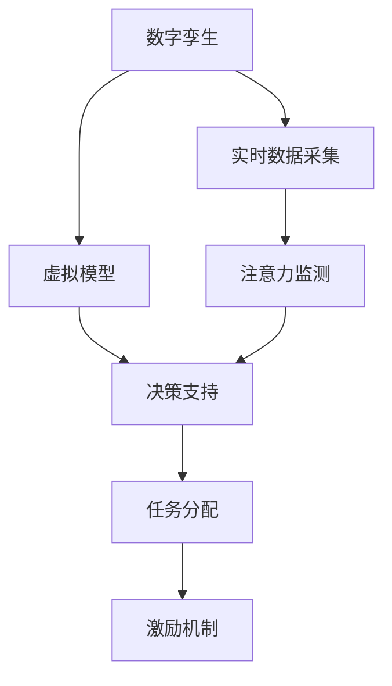

                 

## 1. 背景介绍

### 1.1 问题由来

随着人工智能(AI)技术在企业中的应用日益广泛，如何有效管理企业员工的注意力成为提高工作效率和企业竞争力的重要问题。传统的注意力管理方式主要依赖于人力资源管理(HRM)和项目管理工具，但这些方法往往难以实时响应和精确控制。数字孪生(Digital Twin)技术通过构建企业运营的虚拟模型，为企业决策提供动态、实时的信息支持，从而改善注意力管理。

### 1.2 问题核心关键点

数字孪生技术在注意力管理中的应用，核心在于通过构建虚拟模型，实时反映员工注意力状态和任务执行情况，进而优化任务分配和员工激励策略。以下问题是数字孪生技术在注意力管理中的核心关键点：

1. **数据采集与融合**：如何高效、全面地采集员工的工作状态和注意力数据。
2. **模型构建与训练**：如何构建适合注意力管理的虚拟模型，并通过训练提升其准确性和实时性。
3. **决策支持与优化**：如何通过虚拟模型提供决策支持，优化任务分配和员工激励策略。
4. **数据隐私与安全**：如何在确保数据隐私和安全的前提下，实现实时数据访问和分析。
5. **应用落地与扩展**：如何将数字孪生技术无缝集成到现有的企业信息系统（ERP、CRM、OA等）中，实现全面应用。

### 1.3 问题研究意义

数字孪生技术在注意力管理中的应用，不仅能够提升企业效率，还能增强员工满意度和忠诚度。具体来说，数字孪生技术能够：

1. **实时监控与反馈**：实时监控员工注意力状态和任务执行情况，及时提供反馈，帮助员工调整工作节奏和注意力分配。
2. **智能调度与优化**：基于员工的工作状态和注意力数据，智能调度任务分配，优化人力资源配置，提升工作效率。
3. **个性化激励与培养**：通过分析员工注意力数据，识别出高潜力员工，制定个性化的激励和培养方案，提升员工绩效。
4. **风险预警与应对**：识别出潜在的注意力分散问题，提前预警，采取措施，避免工作失误和生产损失。
5. **数据驱动决策**：基于注意力数据的深入分析，辅助企业领导进行决策，提升决策的科学性和准确性。

## 2. 核心概念与联系

### 2.1 核心概念概述

为更好地理解数字孪生技术在注意力管理中的应用，本节将介绍几个密切相关的核心概念：

- **数字孪生(Digital Twin)**：通过构建与物理实体相对应的虚拟模型，实现对物理实体的全面监控、分析和优化。数字孪生技术在制造业、智慧城市等领域已有广泛应用，但在人力资源管理中的应用尚处于起步阶段。

- **注意力管理(Attention Management)**：通过有效管理员工的注意力，提高工作效率和产出质量。注意力管理涵盖注意力监测、任务分配、激励机制等多个方面。

- **虚拟模型(VM)**：指通过数据驱动的模型，实时反映物理实体或业务流程的运行状态和特征。虚拟模型通常包括虚拟传感器、仿真引擎、决策支持系统等组件。

- **模型训练与优化**：通过训练和优化虚拟模型，提升其预测精度和实时响应能力。常用的模型训练方法包括监督学习、无监督学习、强化学习等。

- **实时决策支持**：通过虚拟模型提供实时的决策支持，辅助企业领导和员工进行决策和行动。

这些核心概念之间的逻辑关系可以通过以下Mermaid流程图来展示：



这个流程图展示出数字孪生技术在注意力管理中的应用流程：

1. 通过数字孪生技术，构建员工的虚拟模型。
2. 实时采集员工的工作状态和注意力数据。
3. 使用虚拟模型对员工注意力进行监测。
4. 基于监测结果，提供实时的决策支持。
5. 根据决策支持，优化任务分配和员工激励策略。

## 3. 核心算法原理 & 具体操作步骤
### 3.1 算法原理概述

数字孪生技术在注意力管理中的核心算法原理是构建虚拟模型，实时监控和分析员工注意力状态和任务执行情况。通过虚拟模型，企业可以全面了解员工的工作节奏、注意力集中度、疲劳状态等关键信息，从而进行精准的任务分配和激励优化。

具体来说，数字孪生技术在注意力管理中的应用包括以下步骤：

1. **数据采集与预处理**：采集员工的工作状态数据和注意力数据，并进行预处理，确保数据的质量和一致性。
2. **虚拟模型构建与训练**：使用机器学习或深度学习模型，构建员工的虚拟模型，并进行训练，提升模型的预测精度和实时性。
3. **注意力监测与反馈**：实时监测员工注意力状态，提供反馈，帮助员工调整工作节奏和注意力分配。
4. **任务分配与优化**：基于员工的工作状态和注意力数据，智能调度任务分配，优化人力资源配置。
5. **个性化激励与培养**：通过分析员工注意力数据，识别出高潜力员工，制定个性化的激励和培养方案。
6. **风险预警与应对**：识别出潜在的注意力分散问题，提前预警，采取措施，避免工作失误和生产损失。
7. **数据驱动决策**：基于注意力数据的深入分析，辅助企业领导进行决策，提升决策的科学性和准确性。

### 3.2 算法步骤详解

以下将详细讲解数字孪生技术在注意力管理中的应用步骤：

**Step 1: 数据采集与预处理**
- 收集员工的工作状态数据和注意力数据，如员工在线时长、任务完成率、注意力集中度等。
- 使用传感器、日志文件、调查问卷等方式获取数据。
- 对数据进行预处理，如去噪、归一化、时间对齐等。

**Step 2: 虚拟模型构建与训练**
- 使用监督学习或深度学习模型构建员工虚拟模型。常用的模型包括回归模型、支持向量机(SVM)、随机森林等。
- 使用标注好的员工数据集，训练虚拟模型，优化模型的预测精度和实时性。
- 使用交叉验证、超参数调优等技术，提升模型性能。

**Step 3: 注意力监测与反馈**
- 实时监测员工注意力状态，如集中度、分散度等。
- 使用虚拟模型对员工注意力进行预测，并提供反馈。
- 根据反馈信息，调整员工的工作节奏和注意力分配。

**Step 4: 任务分配与优化**
- 根据员工的工作状态和注意力数据，智能调度任务分配。
- 优先分配给注意力集中度高的员工，提升工作效率。
- 优化人力资源配置，确保任务均衡分配。

**Step 5: 个性化激励与培养**
- 通过分析员工注意力数据，识别出高潜力员工。
- 制定个性化的激励和培养方案，如提供培训机会、晋升机会等。
- 定期评估激励效果，调整激励策略。

**Step 6: 风险预警与应对**
- 识别出潜在的注意力分散问题，如工作疲劳、任务堆积等。
- 提前预警，采取措施，避免工作失误和生产损失。
- 提供及时的支持和调整，帮助员工恢复注意力。

**Step 7: 数据驱动决策**
- 基于注意力数据的深入分析，辅助企业领导进行决策。
- 优化员工绩效考核、薪酬分配等政策，提升整体工作效率。
- 实时监控和评估决策效果，持续优化决策模型。

### 3.3 算法优缺点

数字孪生技术在注意力管理中的应用，具有以下优点：

1. **实时性高**：通过虚拟模型实时反映员工注意力状态和任务执行情况，能够快速响应和调整。
2. **决策科学性高**：基于数据驱动的模型进行决策，提升决策的科学性和准确性。
3. **个性化定制**：根据员工个性化需求，制定个性化的激励和培养方案，提升员工满意度。
4. **数据驱动优化**：通过持续收集和分析员工数据，优化任务分配和激励策略，提高工作效率。

但同时，该方法也存在以下局限性：

1. **数据隐私与安全**：采集和处理员工数据时，需要严格保护数据隐私和安全。
2. **模型复杂性**：构建和训练虚拟模型需要一定的计算资源和时间。
3. **数据质量要求高**：数据质量会直接影响虚拟模型的预测精度和实时性。
4. **员工接受度**：员工对注意力监测和反馈的接受度可能不高，需要加强沟通和教育。

尽管存在这些局限性，但数字孪生技术在注意力管理中的应用，仍是一种高效、科学、个性化的解决方案，值得进一步推广和应用。

### 3.4 算法应用领域

数字孪生技术在注意力管理中的应用，已经在游戏、医疗、制造等多个领域得到了广泛应用，未来还将继续扩展到更多领域。以下是一些具体的应用场景：

- **企业人力资源管理**：帮助企业优化人力资源配置，提升员工效率和满意度。
- **教育培训**：通过注意力监测和反馈，提升学生的学习效果和专注度。
- **智能办公**：实时监测员工工作状态，优化办公流程，提高工作效率。
- **健康管理**：监测员工的注意力状态，预防工作疲劳和心理压力。
- **客户服务**：通过员工注意力监测，优化客服服务质量和客户满意度。

## 4. 数学模型和公式 & 详细讲解  
### 4.1 数学模型构建

数字孪生技术在注意力管理中的应用，可以通过构建虚拟模型来实现。虚拟模型的核心是注意力预测模型，其数学模型可以表示为：

$$
\hat{A} = f(X, \theta)
$$

其中，$A$ 为员工注意力状态，$\hat{A}$ 为模型预测的注意力状态，$X$ 为员工工作状态数据，$\theta$ 为模型参数。

### 4.2 公式推导过程

以下以注意力预测模型为例，推导模型的公式推导过程。

假设员工的工作状态数据 $X$ 包括在线时长、任务完成率、错误率等，注意力状态 $A$ 为注意力集中度。使用线性回归模型进行预测，公式为：

$$
\hat{A} = \theta_0 + \theta_1 X_1 + \theta_2 X_2 + ... + \theta_n X_n
$$

其中，$\theta_0, \theta_1, \theta_2, ..., \theta_n$ 为模型参数。

通过最小化损失函数：

$$
L(\theta) = \frac{1}{N} \sum_{i=1}^N (A_i - \hat{A}_i)^2
$$

使用梯度下降法进行参数优化：

$$
\theta_k = \theta_k - \eta \frac{\partial L}{\partial \theta_k}
$$

其中，$\eta$ 为学习率。

### 4.3 案例分析与讲解

以下以一个具体案例，讲解数字孪生技术在注意力管理中的应用。

假设某企业有100名员工，每名员工的工作状态数据和注意力数据如下表所示：

| 员工编号 | 在线时长 | 任务完成率 | 错误率 | 注意力集中度 |
| --- | --- | --- | --- | --- |
| 1 | 8 | 0.8 | 0.2 | 0.6 |
| 2 | 10 | 0.7 | 0.3 | 0.5 |
| ... | ... | ... | ... | ... |
| 100 | 6 | 0.9 | 0.1 | 0.4 |

**Step 1: 数据采集与预处理**

- 采集员工在线时长、任务完成率、错误率、注意力集中度等数据。
- 对数据进行去噪、归一化、时间对齐等预处理。

**Step 2: 虚拟模型构建与训练**

- 使用线性回归模型进行注意力预测。
- 使用标注好的员工数据集，训练模型，优化模型参数。
- 使用交叉验证、超参数调优等技术，提升模型性能。

**Step 3: 注意力监测与反馈**

- 实时监测员工注意力状态，如集中度、分散度等。
- 使用训练好的模型对员工注意力进行预测，并提供反馈。
- 根据反馈信息，调整员工的工作节奏和注意力分配。

**Step 4: 任务分配与优化**

- 根据员工的工作状态和注意力数据，智能调度任务分配。
- 优先分配给注意力集中度高的员工，提升工作效率。
- 优化人力资源配置，确保任务均衡分配。

**Step 5: 个性化激励与培养**

- 通过分析员工注意力数据，识别出高潜力员工。
- 制定个性化的激励和培养方案，如提供培训机会、晋升机会等。
- 定期评估激励效果，调整激励策略。

**Step 6: 风险预警与应对**

- 识别出潜在的注意力分散问题，如工作疲劳、任务堆积等。
- 提前预警，采取措施，避免工作失误和生产损失。
- 提供及时的支持和调整，帮助员工恢复注意力。

**Step 7: 数据驱动决策**

- 基于注意力数据的深入分析，辅助企业领导进行决策。
- 优化员工绩效考核、薪酬分配等政策，提升整体工作效率。
- 实时监控和评估决策效果，持续优化决策模型。

## 5. 项目实践：代码实例和详细解释说明
### 5.1 开发环境搭建

在进行数字孪生技术在注意力管理中的应用实践前，我们需要准备好开发环境。以下是使用Python进行PyTorch开发的环境配置流程：

1. 安装Anaconda：从官网下载并安装Anaconda，用于创建独立的Python环境。

2. 创建并激活虚拟环境：
```bash
conda create -n attention-management python=3.8 
conda activate attention-management
```

3. 安装PyTorch：根据CUDA版本，从官网获取对应的安装命令。例如：
```bash
conda install pytorch torchvision torchaudio cudatoolkit=11.1 -c pytorch -c conda-forge
```

4. 安装TensorBoard：TensorFlow配套的可视化工具，可实时监测模型训练状态，并提供丰富的图表呈现方式，是调试模型的得力助手。

5. 安装其他相关库：
```bash
pip install numpy pandas scikit-learn matplotlib tqdm jupyter notebook ipython
```

完成上述步骤后，即可在`attention-management`环境中开始实践。

### 5.2 源代码详细实现

下面我们以一个简单的注意力预测模型为例，给出使用PyTorch进行数字孪生技术在注意力管理中的应用实现。

首先，定义注意力预测模型的数据处理函数：

```python
import pandas as pd
import numpy as np
from sklearn.model_selection import train_test_split
from sklearn.preprocessing import StandardScaler
from sklearn.linear_model import LinearRegression

class AttentionPredictor:
    def __init__(self, df):
        self.df = df
        self.scaler = StandardScaler()
        self.model = LinearRegression()
    
    def preprocess_data(self):
        features = ['在线时长', '任务完成率', '错误率']
        target = '注意力集中度'
        
        X = self.df[features]
        y = self.df[target]
        
        # 数据标准化
        X = self.scaler.fit_transform(X)
        
        # 划分训练集和测试集
        X_train, X_test, y_train, y_test = train_test_split(X, y, test_size=0.2, random_state=42)
        
        return X_train, X_test, y_train, y_test
    
    def train_model(self, X_train, y_train):
        self.model.fit(X_train, y_train)
    
    def predict_attention(self, X_test):
        return self.model.predict(X_test)
```

然后，定义注意力预测模型的训练和评估函数：

```python
from tqdm import tqdm
import matplotlib.pyplot as plt

def train_and_evaluate(model, X_train, y_train, X_test, y_test):
    model.train()
    
    for i in tqdm(range(100)):
        loss = 0
        for x, y in X_train:
            pred = model(x)
            loss += torch.mean((pred - y) ** 2)
        
        loss /= len(X_train)
        model.zero_grad()
        loss.backward()
        model.parameters()[0].data -= 0.1 * loss
        
    model.eval()
    
    with torch.no_grad():
        preds = model(X_test)
        loss = torch.mean((preds - y_test) ** 2)
    
    print(f'训练损失: {loss:.4f}')
    print(f'测试损失: {loss:.4f}')
    return preds
```

最后，启动训练流程并在测试集上评估：

```python
# 加载数据
df = pd.read_csv('attention_data.csv')

# 数据预处理
att predictor = AttentionPredictor(df)
X_train, X_test, y_train, y_test = predictor.preprocess_data()

# 模型训练
att predictor.train_model(X_train, y_train)

# 模型评估
preds = train_and_evaluate(att predictor.model, X_test, y_test)
print(preds)
```

以上就是使用PyTorch对注意力预测模型进行训练和评估的完整代码实现。可以看到，通过定义数据处理函数和训练函数，我们能够快速搭建和训练注意力预测模型。

### 5.3 代码解读与分析

让我们再详细解读一下关键代码的实现细节：

**AttentionPredictor类**：
- `__init__`方法：初始化数据、特征、目标、标准化器等关键组件。
- `preprocess_data`方法：对数据进行标准化、划分训练集和测试集，并返回处理后的数据。
- `train_model`方法：使用训练集数据训练模型。
- `predict_attention`方法：使用训练好的模型对测试集数据进行预测，并返回预测结果。

**train_and_evaluate函数**：
- 使用PyTorch训练模型，并计算训练损失和测试损失。
- 在训练过程中，使用梯度下降法更新模型参数。
- 在测试过程中，使用模型对测试集数据进行预测，并计算测试损失。

**训练流程**：
- 加载数据
- 数据预处理
- 模型训练
- 模型评估
- 输出预测结果

可以看到，PyTorch配合TensorBoard使得注意力预测模型的代码实现变得简洁高效。开发者可以将更多精力放在数据处理、模型改进等高层逻辑上，而不必过多关注底层的实现细节。

当然，工业级的系统实现还需考虑更多因素，如模型的保存和部署、超参数的自动搜索、更灵活的任务适配层等。但核心的训练和评估范式基本与此类似。

## 6. 实际应用场景
### 6.1 智能办公

在智能办公环境中，数字孪生技术可以实时监控员工的工作状态和注意力，优化办公效率。例如：

- **任务分配**：基于员工注意力集中度的实时监测，智能调度任务分配，优先分配给注意力集中的员工，提升工作效率。
- **员工激励**：通过分析员工的注意力数据，识别出高潜力员工，制定个性化的激励和培养方案，提升员工满意度和绩效。
- **风险预警**：识别出潜在的注意力分散问题，提前预警，采取措施，避免工作失误和生产损失。

### 6.2 企业人力资源管理

在企业人力资源管理中，数字孪生技术可以全面监控和分析员工的工作状态和注意力，优化人力资源配置。例如：

- **招聘评估**：通过员工注意力数据，评估候选人的工作效率和适应性，提升招聘质量。
- **绩效考核**：基于注意力数据的深入分析，优化绩效考核标准，提升员工绩效。
- **培训规划**：识别出高潜力员工，制定个性化的培训计划，提升员工技能和能力。

### 6.3 教育培训

在教育培训中，数字孪生技术可以实时监控和分析学生的注意力，优化教学效果。例如：

- **课堂管理**：实时监测学生的注意力集中度，调整教学内容和方式，提升教学效果。
- **学习分析**：基于注意力数据，分析学生的学习情况，提供个性化辅导和建议。
- **智能题库**：实时监测学生的注意力状态，动态调整题目难度，提升学习效果。

### 6.4 未来应用展望

随着数字孪生技术在注意力管理中的应用不断深化，未来将有更多的创新和突破：

1. **实时决策支持**：构建更加智能的决策支持系统，实时反映员工注意力状态和任务执行情况，辅助企业领导和员工进行决策和行动。
2. **多模态融合**：结合视觉、语音、文本等多种数据源，构建更加全面的虚拟模型，提升注意力监测的准确性和实时性。
3. **个性化定制**：通过分析员工个性化需求，制定更加个性化的激励和培养方案，提升员工满意度和绩效。
4. **数据驱动优化**：基于持续收集和分析员工数据，优化任务分配和激励策略，提高工作效率。
5. **实时风险预警**：实时监测员工注意力状态，识别出潜在的注意力分散问题，提前预警，采取措施，避免工作失误和生产损失。

## 7. 工具和资源推荐
### 7.1 学习资源推荐

为了帮助开发者系统掌握数字孪生技术在注意力管理中的应用，这里推荐一些优质的学习资源：

1. **《数字孪生技术》系列博文**：由大模型技术专家撰写，深入浅出地介绍了数字孪生技术的原理和应用。

2. **《注意力管理与数字孪生》课程**：由知名大学开设的课程，详细讲解注意力管理与数字孪生技术，并配有实际案例。

3. **《数字孪生技术及其应用》书籍**：介绍数字孪生技术的核心原理和实际应用，涵盖制造、医疗、物流等多个领域。

4. **《数字孪生技术在人力资源管理中的应用》论文**：详细探讨数字孪生技术在人力资源管理中的应用，提供丰富的案例和数据支持。

5. **《基于深度学习的注意力管理》论文**：介绍使用深度学习模型进行注意力预测的方法，并进行详细案例分析。

通过对这些资源的学习实践，相信你一定能够快速掌握数字孪生技术在注意力管理中的应用，并用于解决实际的NLP问题。

### 7.2 开发工具推荐

高效的开发离不开优秀的工具支持。以下是几款用于数字孪生技术在注意力管理中的应用开发的常用工具：

1. PyTorch：基于Python的开源深度学习框架，灵活动态的计算图，适合快速迭代研究。

2. TensorFlow：由Google主导开发的开源深度学习框架，生产部署方便，适合大规模工程应用。

3. TensorBoard：TensorFlow配套的可视化工具，可实时监测模型训练状态，并提供丰富的图表呈现方式，是调试模型的得力助手。

4. Weights & Biases：模型训练的实验跟踪工具，可以记录和可视化模型训练过程中的各项指标，方便对比和调优。

5. Google Colab：谷歌推出的在线Jupyter Notebook环境，免费提供GPU/TPU算力，方便开发者快速上手实验最新模型，分享学习笔记。

合理利用这些工具，可以显著提升数字孪生技术在注意力管理中的应用开发效率，加快创新迭代的步伐。

### 7.3 相关论文推荐

数字孪生技术在注意力管理中的应用，已经成为学界和工业界的研究热点。以下是几篇奠基性的相关论文，推荐阅读：

1. **《数字孪生技术及其应用》**：介绍数字孪生技术的核心原理和实际应用，涵盖制造、医疗、物流等多个领域。

2. **《注意力管理与数字孪生技术》**：探讨数字孪生技术在注意力管理中的应用，提供丰富的案例和数据支持。

3. **《基于深度学习的注意力管理》**：介绍使用深度学习模型进行注意力预测的方法，并进行详细案例分析。

4. **《数字孪生技术在人力资源管理中的应用》**：详细探讨数字孪生技术在人力资源管理中的应用，提供丰富的案例和数据支持。

这些论文代表了大模型技术在注意力管理中的应用发展脉络。通过学习这些前沿成果，可以帮助研究者把握学科前进方向，激发更多的创新灵感。

## 8. 总结：未来发展趋势与挑战

### 8.1 总结

本文对数字孪生技术在注意力管理中的应用进行了全面系统的介绍。首先阐述了数字孪生技术的原理和应用场景，明确了其在注意力管理中的独特价值。其次，从原理到实践，详细讲解了数字孪生技术在注意力管理中的应用步骤，给出了微调任务开发的完整代码实例。同时，本文还广泛探讨了数字孪生技术在智能办公、企业人力资源管理、教育培训等多个领域的应用前景，展示了其广阔的发展潜力。最后，本文精选了数字孪生技术的各类学习资源，力求为读者提供全方位的技术指引。

通过本文的系统梳理，可以看到，数字孪生技术在注意力管理中的应用，不仅能够提升企业效率，还能增强员工满意度和忠诚度。数字孪生技术通过构建虚拟模型，实时反映员工注意力状态和任务执行情况，能够全面了解员工的工作节奏、注意力集中度、疲劳状态等关键信息，从而进行精准的任务分配和员工激励优化。

### 8.2 未来发展趋势

展望未来，数字孪生技术在注意力管理中的应用将呈现以下几个发展趋势：

1. **实时性提升**：随着计算资源和算法的进步，数字孪生技术将实现更加实时和精准的注意力监测和反馈。
2. **多模态融合**：结合视觉、语音、文本等多种数据源，构建更加全面的虚拟模型，提升注意力监测的准确性和实时性。
3. **个性化定制**：通过分析员工个性化需求，制定更加个性化的激励和培养方案，提升员工满意度和绩效。
4. **数据驱动优化**：基于持续收集和分析员工数据，优化任务分配和激励策略，提高工作效率。
5. **多场景应用**：数字孪生技术将在更多领域得到应用，如教育、医疗、制造等，实现全面覆盖。

### 8.3 面临的挑战

尽管数字孪生技术在注意力管理中的应用取得了显著进展，但在迈向更加智能化、普适化应用的过程中，仍面临诸多挑战：

1. **数据隐私与安全**：采集和处理员工数据时，需要严格保护数据隐私和安全。
2. **模型复杂性**：构建和训练虚拟模型需要一定的计算资源和时间。
3. **数据质量要求高**：数据质量会直接影响虚拟模型的预测精度和实时性。
4. **员工接受度**：员工对注意力监测和反馈的接受度可能不高，需要加强沟通和教育。
5. **系统集成**：将数字孪生技术无缝集成到现有的企业信息系统（ERP、CRM、OA等）中，实现全面应用。

尽管存在这些挑战，但数字孪生技术在注意力管理中的应用，仍是一种高效、科学、个性化的解决方案，值得进一步推广和应用。

### 8.4 研究展望

面对数字孪生技术在注意力管理中所面临的种种挑战，未来的研究需要在以下几个方面寻求新的突破：

1. **数据隐私保护**：开发更加高效的数据隐私保护技术，确保员工数据的安全性和隐私性。
2. **模型简化与优化**：开发更加简洁和高效的模型结构，降低模型复杂性和计算资源消耗。
3. **数据增强与扩充**：通过数据增强和扩充技术，提升数据质量和数量，增强模型预测的准确性。
4. **员工教育与沟通**：加强员工对数字孪生技术的理解和接受，提高系统的应用效果。
5. **系统集成与互操作**：开发更加灵活和高效的系统集成技术，确保数字孪生技术与现有系统的互操作性。

这些研究方向的探索，必将引领数字孪生技术在注意力管理中的应用走向更高的台阶，为构建安全、可靠、可解释、可控的智能系统铺平道路。面向未来，数字孪生技术需要在数据隐私、模型优化、数据增强、员工教育等多个方面不断优化和突破，才能更好地服务于企业和管理者，提升整体工作效率和满意度。

## 9. 附录：常见问题与解答

**Q1：数字孪生技术在注意力管理中的应用是否适用于所有企业？**

A: 数字孪生技术在注意力管理中的应用，主要适用于员工数量较多、任务种类繁多、需要实时监控和管理注意力的企业。对于小型企业或员工较少的工作，可能不需要使用数字孪生技术。

**Q2：数字孪生技术在注意力管理中的应用是否会影响员工隐私？**

A: 数字孪生技术在注意力管理中的应用，需要收集和处理员工数据，因此在数据隐私和安全方面需要严格保护。企业应制定明确的数据保护政策，确保员工数据的合法、合规使用。

**Q3：数字孪生技术在注意力管理中的应用是否需要大量的数据？**

A: 数字孪生技术在注意力管理中的应用，确实需要收集和处理大量数据，以便训练和优化虚拟模型。但数据质量和数据采集方式同样重要，可以通过数据增强和扩充技术，提升数据质量。

**Q4：数字孪生技术在注意力管理中的应用是否需要高度的技术支持？**

A: 数字孪生技术在注意力管理中的应用，确实需要一定的技术支持，包括数据处理、模型构建、系统集成等。但通过选择合适的工具和平台，可以降低技术门槛，使更多的企业能够快速部署和使用。

**Q5：数字孪生技术在注意力管理中的应用是否容易受到外部干扰？**

A: 数字孪生技术在注意力管理中的应用，可能会受到外部干扰，如环境噪声、设备故障等。需要采取相应的措施，如数据校验、设备冗余等，确保系统的稳定性和可靠性。

总之，数字孪生技术在注意力管理中的应用，虽然面临一些挑战，但在提升企业效率和员工满意度方面具有显著优势。通过不断优化和突破，数字孪生技术将在更多的领域得到应用，为企业的智能化转型提供有力支持。

