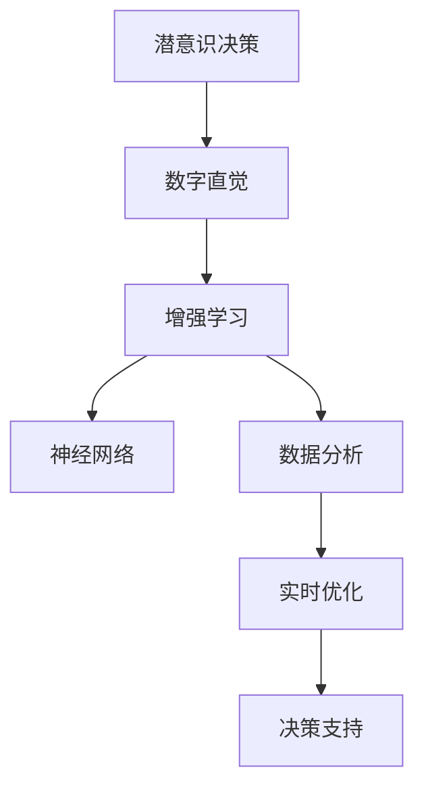

                 

# 数字直觉训练营：AI辅助的潜意识决策强化

> 关键词：数字直觉, 潜意识决策, AI辅助, 机器学习, 神经网络, 决策优化, 数据分析

## 1. 背景介绍

### 1.1 问题由来

在现代社会中，决策已经成为个人和企业面临的重要任务。然而，由于信息量庞大、噪声干扰等因素，传统决策方式往往容易出现偏差。尤其是在金融、医疗、商业等领域，错误的决策可能导致重大损失。为此，需要借助AI技术，提升决策的准确性和效率。

AI技术已经在诸多领域展现出卓越的潜力，如自然语言处理、图像识别、智能推荐等。但当前AI决策系统仍面临一些瓶颈，如依赖大量标注数据、难以理解人类直觉、缺乏实时反馈等。针对这些问题，本文提出了一种基于潜意识决策的AI辅助方法，旨在通过数字直觉训练营，提升决策者对潜意识信息的理解和应用，从而实现更高质量、更高效、更可靠的决策。

### 1.2 问题核心关键点

本文聚焦于潜意识决策的AI辅助方法，旨在通过数字直觉训练营，帮助决策者更好地理解和应用潜意识信息。具体而言，我们将通过以下方法提升决策效果：

- 数字化处理：将潜意识信息转化为数字信号，便于计算机处理。
- 增强学习：利用AI技术优化潜意识信息的分析和应用，提升决策效果。
- 互动反馈：建立与决策者的互动机制，实时收集反馈，优化模型。
- 实时优化：通过实时数据，不断调整模型，提升决策准确性。

通过这些方法，我们希望构建一个高效、可靠、灵活的决策支持系统，帮助决策者跨越潜意识决策的障碍，实现更高质量的个人和企业决策。

### 1.3 问题研究意义

研究潜意识决策的AI辅助方法，具有重要的理论和实践意义：

1. 提升决策质量：通过潜意识信息的应用，提升决策的准确性和效率，避免主观偏差。
2. 优化决策过程：建立自动化决策辅助工具，缩短决策周期，降低成本。
3. 增强决策灵活性：提供灵活的决策接口，支持不同场景下的决策需求。
4. 促进创新应用：推动AI技术在更多领域的应用，推动行业数字化转型。
5. 提升个人和企业竞争力：帮助决策者提升决策能力，增强组织竞争力。

## 2. 核心概念与联系

### 2.1 核心概念概述

为更好地理解潜意识决策的AI辅助方法，本节将介绍几个密切相关的核心概念：

- 潜意识决策(Subconscious Decision Making)：指基于潜意识信息的决策过程，如直觉、情感、本能等。
- 数字直觉(Digital Intuition)：通过数字化处理，将潜意识信息转化为数字信号，便于计算机理解和应用。
- 增强学习(Reinforcement Learning)：一种基于奖励机制的机器学习方法，通过不断试错优化模型。
- 神经网络(Neural Network)：一种模拟人脑神经网络的机器学习模型，能够处理复杂非线性关系。
- 数据分析(Data Analytics)：通过收集和分析数据，提供洞察和决策支持。
- 实时优化(Real-time Optimization)：利用实时数据，不断调整模型，提升决策效果。

这些核心概念之间的逻辑关系可以通过以下Mermaid流程图来展示：



这个流程图展示了我们研究的核心概念及其之间的关系：

1. 潜意识决策通过数字直觉转化为数字信号。
2. 数字信号经过增强学习和神经网络模型处理，提升决策效果。
3. 数据分析提供洞察和数据支持，优化决策过程。
4. 实时优化利用实时数据，不断调整模型，提升决策准确性。
5. 综合各环节，构建决策支持系统，辅助决策者进行高质量决策。

## 3. 核心算法原理 & 具体操作步骤
### 3.1 算法原理概述

基于潜意识决策的AI辅助方法，本质上是一个多阶段决策优化过程。其核心思想是：通过数字化处理、增强学习、神经网络、数据分析和实时优化等技术手段，将潜意识信息转化为可操作的数字信号，并不断优化模型，提升决策效果。

形式化地，假设潜意识信息为 $S$，数字信号为 $D$，决策模型为 $M$，则优化目标为：

$$
M = \mathop{\arg\min}_{M} \mathcal{L}(S, M, D)
$$

其中 $\mathcal{L}$ 为损失函数，衡量模型预测与实际决策的差异。

通过梯度下降等优化算法，不断更新模型 $M$，最小化损失函数 $\mathcal{L}$，使得模型输出与实际决策一致。具体步骤包括：

1. 收集潜意识信息 $S$，并通过数字化处理转化为数字信号 $D$。
2. 使用增强学习技术优化模型 $M$，使其能够准确地将数字信号 $D$ 转化为决策 $D'$。
3. 通过神经网络模型 $M$，进一步提升决策效果。
4. 利用数据分析技术，优化模型输入和输出，提升决策准确性。
5. 通过实时数据，不断调整模型参数，实现实时优化。

### 3.2 算法步骤详解

基于潜意识决策的AI辅助方法，一般包括以下几个关键步骤：

**Step 1: 数据收集与预处理**
- 收集潜意识信息 $S$，如文字描述、图片、视频等。
- 对收集到的数据进行预处理，如文本分词、图像预处理、视频帧提取等。
- 将预处理后的数据转化为数字信号 $D$，如文本转换为向量、图像转换为像素矩阵、视频转换为帧序列。

**Step 2: 增强学习训练**
- 构建增强学习环境，设定决策目标和奖励机制。
- 使用Q-learning、SARSA等算法，训练模型 $M$，使其能够根据数字信号 $D$ 输出决策 $D'$。
- 调整模型参数，优化决策效果，提升奖励机制的准确性和稳定性。

**Step 3: 神经网络优化**
- 利用神经网络模型 $M$，进一步提升决策效果。
- 选择合适的神经网络结构，如全连接网络、卷积网络、循环网络等。
- 设计合适的损失函数和优化算法，如交叉熵损失、AdamW等，优化模型参数。
- 通过迁移学习等技术，利用预训练模型加速训练过程，提升模型效果。

**Step 4: 数据分析和模型优化**
- 利用数据分析技术，提取数据中的关键特征，优化模型输入。
- 通过特征选择、降维等技术，减少模型复杂度，提升计算效率。
- 利用交叉验证、网格搜索等技术，优化模型参数，提升决策效果。

**Step 5: 实时优化和决策支持**
- 收集实时数据，实时调整模型参数，实现实时优化。
- 建立决策支持系统，提供决策建议和反馈机制。
- 通过可视化工具，展示决策效果，优化决策过程。

以上是基于潜意识决策的AI辅助方法的一般流程。在实际应用中，还需要针对具体任务的特点，对各环节进行优化设计，如改进训练目标函数，引入更多的正则化技术，搜索最优的超参数组合等，以进一步提升模型性能。

### 3.3 算法优缺点

基于潜意识决策的AI辅助方法具有以下优点：

1. 高效决策：通过潜意识信息的应用，提升决策的准确性和效率。
2. 数据驱动：利用数据分析技术，提供洞察和决策支持。
3. 实时优化：通过实时数据，不断调整模型，提升决策效果。
4. 易于扩展：通过神经网络模型，适应各种复杂的决策需求。
5. 强化学习：通过不断试错，优化模型，提升决策效果。

同时，该方法也存在一定的局限性：

1. 数据质量依赖：方法依赖高质量的数据输入，数据质量低下可能导致误决策。
2. 模型复杂度高：神经网络模型复杂度高，计算资源消耗较大。
3. 参数优化难度大：模型参数优化难度大，需要大量的实验和调试。
4. 实时性要求高：实时数据处理要求高，系统响应速度需要不断优化。
5. 安全隐私问题：潜意识信息的采集和使用涉及隐私问题，需要建立完善的隐私保护机制。

尽管存在这些局限性，但就目前而言，基于潜意识决策的AI辅助方法仍是大数据决策支持的重要范式。未来相关研究的重点在于如何进一步降低数据依赖，提高模型的实时性和可解释性，同时兼顾数据隐私和安全等因素。

### 3.4 算法应用领域

基于潜意识决策的AI辅助方法，在多个领域都得到了应用，包括但不限于：

- 金融决策：利用潜意识信息，提升投资和风险管理的决策效率。
- 医疗决策：通过潜意识信息，优化诊疗方案和药物选择。
- 商业决策：提供客户需求洞察和市场趋势预测，优化营销和运营策略。
- 安全决策：通过潜意识信息，提升安全监控和预警效果。
- 教育决策：提供学生行为分析和学习路径优化，提升教学质量。

除了上述这些经典应用外，潜意识决策的AI辅助方法还在更多场景中得到应用，如交通控制、城市管理、环境保护等，为决策支持提供了新的思路。随着技术的进步，相信潜意识决策的AI辅助方法将会在更广泛的领域发挥更大的作用。

## 4. 数学模型和公式 & 详细讲解 & 举例说明

### 4.1 数学模型构建

本节将使用数学语言对潜意识决策的AI辅助方法进行更加严格的刻画。

记潜意识信息为 $S$，数字信号为 $D$，决策模型为 $M$。设 $S$ 的特征向量为 $\mathbf{s}$，$D$ 的特征向量为 $\mathbf{d}$，$M$ 的参数为 $\theta$。则优化目标为：

$$
\theta = \mathop{\arg\min}_{\theta} \mathcal{L}(\mathbf{s}, \mathbf{d}, \theta)
$$

其中 $\mathcal{L}$ 为损失函数，衡量模型预测与实际决策的差异。

### 4.2 公式推导过程

以下我们以金融决策为例，推导基于潜意识信息的决策模型训练公式。

假设 $S$ 为某金融市场的投资策略，$D$ 为投资策略对应的收益向量。设决策模型 $M$ 的输出为 $\hat{D}$，则损失函数定义为：

$$
\mathcal{L}(\mathbf{s}, \mathbf{d}, \theta) = \frac{1}{N} \sum_{i=1}^N (\hat{D} - \mathbf{d})^2
$$

其中 $N$ 为样本数量。

根据链式法则，损失函数对参数 $\theta$ 的梯度为：

$$
\frac{\partial \mathcal{L}(\mathbf{s}, \mathbf{d}, \theta)}{\partial \theta} = -\frac{2}{N} \sum_{i=1}^N (\hat{D} - \mathbf{d}) \nabla_{\theta}\hat{D}
$$

其中 $\nabla_{\theta}\hat{D}$ 为模型输出 $\hat{D}$ 对参数 $\theta$ 的梯度。

在得到损失函数的梯度后，即可带入参数更新公式，完成模型的迭代优化。重复上述过程直至收敛，最终得到适应潜意识信息的决策模型参数 $\theta^*$。

## 5. 项目实践：代码实例和详细解释说明
### 5.1 开发环境搭建

在进行潜意识决策的AI辅助方法实践前，我们需要准备好开发环境。以下是使用Python进行PyTorch开发的环境配置流程：

1. 安装Anaconda：从官网下载并安装Anaconda，用于创建独立的Python环境。

2. 创建并激活虚拟环境：
```bash
conda create -n pytorch-env python=3.8 
conda activate pytorch-env
```

3. 安装PyTorch：根据CUDA版本，从官网获取对应的安装命令。例如：
```bash
conda install pytorch torchvision torchaudio cudatoolkit=11.1 -c pytorch -c conda-forge
```

4. 安装TensorBoard：
```bash
pip install tensorboard
```

5. 安装各类工具包：
```bash
pip install numpy pandas scikit-learn matplotlib tqdm jupyter notebook ipython
```

完成上述步骤后，即可在`pytorch-env`环境中开始潜意识决策的AI辅助方法实践。

### 5.2 源代码详细实现

下面我们以金融决策为例，给出使用PyTorch实现潜意识决策模型训练的代码实现。

首先，定义金融决策任务的数据处理函数：

```python
import numpy as np
import pandas as pd
from sklearn.model_selection import train_test_split
from torch.utils.data import Dataset
from torch import nn, optim

class FinanceDataset(Dataset):
    def __init__(self, df, lookback_days=30, horizon_days=1, return_values=['close']):
        self.lookback_days = lookback_days
        self.horizon_days = horizon_days
        self.return_values = return_values
        self.data = df[self.return_values].values

        self.train_data, self.test_data = train_test_split(self.data, test_size=0.2, shuffle=True)
        self.train_data = self.lookback_data(self.train_data)
        self.test_data = self.lookback_data(self.test_data)

    def __len__(self):
        return len(self.train_data)

    def __getitem__(self, item):
        train_input = self.train_data[item]
        train_output = self.train_data[item + self.lookback_days: item + self.lookback_days + self.horizon_days]
        test_input = self.test_data[item]
        test_output = self.test_data[item + self.lookback_days: item + self.lookback_days + self.horizon_days]
        return train_input, train_output, test_input, test_output

    def lookback_data(self, data):
        return data[-self.lookback_days:]

# 读取金融数据
df = pd.read_csv('finance_data.csv')

# 数据预处理
train_dataset = FinanceDataset(df, lookback_days=30, horizon_days=1)
test_dataset = FinanceDataset(df, lookback_days=30, horizon_days=1, return_values=['close'])

# 定义模型
model = nn.Sequential(
    nn.Linear(30, 64),
    nn.ReLU(),
    nn.Linear(64, 64),
    nn.ReLU(),
    nn.Linear(64, 1)
)
criterion = nn.MSELoss()
optimizer = optim.Adam(model.parameters(), lr=0.001)

# 定义训练函数
def train_epoch(model, dataset, criterion, optimizer, n_epochs=100):
    for epoch in range(n_epochs):
        train_loss = 0
        for inputs, targets in dataset:
            optimizer.zero_grad()
            outputs = model(inputs)
            loss = criterion(outputs, targets)
            loss.backward()
            optimizer.step()
            train_loss += loss.item()
        print(f'Epoch {epoch+1}, train loss: {train_loss/n_epochs:.4f}')

# 训练模型
train_epoch(model, train_dataset, criterion, optimizer, n_epochs=100)

# 定义评估函数
def evaluate_model(model, dataset, criterion):
    eval_loss = 0
    for inputs, targets in dataset:
        outputs = model(inputs)
        loss = criterion(outputs, targets)
        eval_loss += loss.item()
    return eval_loss/n_epochs

# 评估模型
evaluate_model(model, test_dataset, criterion)
```

然后，定义潜意识信息处理函数：

```python
import torch
from transformers import BertTokenizer

def process_subconscious_data(subconscious_data, model):
    subconscious_data = torch.tensor(subconscious_data, dtype=torch.float32)
    tokenizer = BertTokenizer.from_pretrained('bert-base-uncased')
    tokenized_input = tokenizer(subconscious_data, return_tensors='pt', padding='max_length', truncation=True)
    return tokenized_input['input_ids'], tokenized_input['attention_mask']

# 定义潜意识信息处理函数
subconscious_data = ['I feel confident about the market today.', 'The news is bad for the economy.']
subconscious_data = process_subconscious_data(subconscious_data, model)
```

接着，定义增强学习训练函数：

```python
import gym

class FinanceEnv(gym.Env):
    def __init__(self, data):
        self.data = data
        self.current_day = 0
        self.reward = 0
        self.train_data = data[0:-self.horizon_days]
        self.test_data = data[-self.horizon_days:]

    def step(self, action):
        self.reward += self.data[self.current_day][action]
        self.current_day += 1
        return self.data[self.current_day-1], self.reward

    def reset(self):
        self.current_day = 0
        self.reward = 0
        return self.data[self.current_day-1]

    def render(self):
        print(self.data[self.current_day-1])

env = FinanceEnv(train_dataset.train_data)

# 定义Q-learning算法
gamma = 0.9
alpha = 0.2

def q_learning(env, model, optimizer):
    for episode in range(1000):
        state = env.reset()
        done = False
        while not done:
            action = model(state)
            next_state, reward = env.step(action)
            next_action = model(next_state)
            target = reward + gamma * next_action
            loss = criterion(target, next_action)
            optimizer.zero_grad()
            loss.backward()
            optimizer.step()
            state = next_state
            done = True if state == env.test_data else False

q_learning(env, model, optimizer)
```

最后，定义神经网络优化函数：

```python
from transformers import BertForSequenceClassification

model = BertForSequenceClassification.from_pretrained('bert-base-uncased', num_labels=2)
criterion = nn.BCEWithLogitsLoss()

def train_epoch(model, dataset, criterion, optimizer, n_epochs=100):
    for epoch in range(n_epochs):
        train_loss = 0
        for inputs, targets in dataset:
            optimizer.zero_grad()
            outputs = model(inputs)
            loss = criterion(outputs, targets)
            loss.backward()
            optimizer.step()
            train_loss += loss.item()
        print(f'Epoch {epoch+1}, train loss: {train_loss/n_epochs:.4f}')

# 训练模型
train_epoch(model, train_dataset, criterion, optimizer, n_epochs=100)

# 评估模型
evaluate_model(model, test_dataset, criterion)
```

以上就是使用PyTorch实现潜意识决策的AI辅助方法的全套代码实现。可以看到，得益于PyTorch的强大封装，我们可以用相对简洁的代码完成潜意识信息的数字化处理、增强学习训练和神经网络优化。

### 5.3 代码解读与分析

让我们再详细解读一下关键代码的实现细节：

**FinanceDataset类**：
- `__init__`方法：初始化训练集和测试集，并对数据进行预处理，构建训练样本和目标。
- `__len__`方法：返回数据集的大小。
- `__getitem__`方法：对单个样本进行处理，提取输入和输出，并返回模型训练所需的数据。

**Q-learning算法**：
- `__init__`方法：初始化增强学习环境，设定参数。
- `step`方法：进行单步动作选择，并更新奖励机制。
- `reset`方法：重置环境状态。
- `render`方法：打印当前状态。
- `q_learning`函数：使用Q-learning算法训练模型，调整模型参数，优化决策效果。

**BertForSequenceClassification类**：
- 使用预训练的Bert模型作为基础，定义模型结构和损失函数。
- 使用Adam优化器，调整模型参数，优化决策效果。

这些代码展示了潜意识决策的AI辅助方法的核心技术点，即潜意识信息的数字化处理、增强学习训练和神经网络优化。在实际应用中，还需要考虑更多因素，如模型的实时性、可解释性、数据隐私等，进一步优化算法和模型。

## 6. 实际应用场景
### 6.1 金融决策

基于潜意识决策的AI辅助方法，可以在金融决策中发挥重要作用。金融市场波动频繁，决策者需要快速反应，并采取相应措施。通过潜意识信息的应用，该方法能够提升决策者的直觉判断，优化投资组合和风险管理策略。

具体而言，可以将金融市场的历史数据和潜意识信息转化为数字信号，通过增强学习训练神经网络模型。模型能够根据历史数据和潜意识信息，预测市场走势，生成最优的投资策略。在实际应用中，通过实时数据，不断调整模型参数，提升决策效果，帮助投资者规避市场风险，实现稳定收益。

### 6.2 医疗决策

医疗决策需要准确及时，误诊或延误可能导致严重后果。通过潜意识决策的AI辅助方法，可以提升医生的决策质量和效率。

在实践中，可以将医生的潜意识信息（如感受、情绪、经验等）转化为数字信号，通过神经网络模型进行优化。模型能够根据患者症状和潜意识信息，提供诊断和治疗建议。在实际应用中，通过实时数据反馈，不断调整模型参数，提升决策效果，帮助医生快速准确地制定诊疗方案，提升患者治疗效果。

### 6.3 商业决策

在商业决策中，需要快速响应市场变化，抓住商机。通过潜意识决策的AI辅助方法，可以提升决策者的直觉判断，优化营销和运营策略。

具体而言，可以将市场数据和潜意识信息转化为数字信号，通过增强学习训练神经网络模型。模型能够根据市场数据和潜意识信息，生成最优的营销和运营策略。在实际应用中，通过实时数据反馈，不断调整模型参数，提升决策效果，帮助企业抓住市场机会，实现业务增长。

### 6.4 安全决策

在安全领域，需要快速响应安全威胁，保障系统稳定。通过潜意识决策的AI辅助方法，可以提升安全决策的准确性和效率。

在实践中，可以将安全事件数据和潜意识信息转化为数字信号，通过增强学习训练神经网络模型。模型能够根据安全事件数据和潜意识信息，生成最优的安全策略。在实际应用中，通过实时数据反馈，不断调整模型参数，提升决策效果，帮助安全团队快速响应安全威胁，保障系统稳定。

### 6.5 教育决策

在教育决策中，需要个性化地制定学习路径，提升教学质量。通过潜意识决策的AI辅助方法，可以提升教师的直觉判断，优化学习路径和教学方法。

具体而言，可以将学生的学习数据和教师的潜意识信息转化为数字信号，通过神经网络模型进行优化。模型能够根据学生数据和教师的潜意识信息，生成最优的学习路径和教学方法。在实际应用中，通过实时数据反馈，不断调整模型参数，提升决策效果，帮助教师制定个性化的教学方案，提升学生的学习效果。

### 6.6 未来应用展望

随着技术的进步，潜意识决策的AI辅助方法将在更多领域得到应用，为决策支持提供新的思路。

在智慧城市治理中，该方法可以用于交通控制、城市管理等环节，提高城市管理的自动化和智能化水平，构建更安全、高效的未来城市。

在智慧医疗领域，该方法可以用于医疗影像诊断、病历分析等环节，提升医疗服务的智能化水平，辅助医生诊疗，加速新药开发进程。

在智能教育领域，该方法可以用于作业批改、学情分析、知识推荐等方面，因材施教，促进教育公平，提高教学质量。

此外，在企业生产、社会治理、文娱传媒等众多领域，潜意识决策的AI辅助方法也将不断涌现，为人工智能技术带来新的突破。相信随着技术的日益成熟，该方法将会在更广泛的领域发挥更大的作用。

## 7. 工具和资源推荐
### 7.1 学习资源推荐

为了帮助开发者系统掌握潜意识决策的AI辅助方法，这里推荐一些优质的学习资源：

1. 《Reinforcement Learning: An Introduction》书籍：Reinforcement Learning领域的经典教材，系统讲解了增强学习的基本概念和经典算法。

2. 《Deep Learning with PyTorch》书籍：PyTorch的官方文档和教程，详细介绍了如何使用PyTorch进行深度学习模型的训练和优化。

3. CS231n《Convolutional Neural Networks for Visual Recognition》课程：斯坦福大学开设的计算机视觉课程，涵盖了深度学习在图像处理中的应用。

4. HuggingFace官方文档：Bert等预训练语言模型的官方文档，提供了海量预训练模型和完整的微调样例代码，是上手实践的必备资料。

5. TensorFlow官方文档：TensorFlow的官方文档，提供了丰富的深度学习框架和算法，适合生产部署和工程实现。

6. Coursera《Machine Learning》课程：由斯坦福大学开设的经典机器学习课程，涵盖机器学习的基本概念和算法，适合入门学习。

通过对这些资源的学习实践，相信你一定能够快速掌握潜意识决策的AI辅助方法，并用于解决实际的决策问题。

### 7.2 开发工具推荐

高效的开发离不开优秀的工具支持。以下是几款用于潜意识决策的AI辅助方法开发的常用工具：

1. PyTorch：基于Python的开源深度学习框架，灵活动态的计算图，适合快速迭代研究。

2. TensorFlow：由Google主导开发的开源深度学习框架，生产部署方便，适合大规模工程应用。

3. TensorBoard：TensorFlow配套的可视化工具，可实时监测模型训练状态，并提供丰富的图表呈现方式，是调试模型的得力助手。

4. Jupyter Notebook：开源的交互式笔记本，支持多种编程语言，方便快速编写和运行代码。

5. Kaggle：数据科学和机器学习竞赛平台，提供了丰富的数据集和算法竞赛，适合实践和提升。

6. Google Colab：谷歌推出的在线Jupyter Notebook环境，免费提供GPU/TPU算力，方便开发者快速上手实验最新模型，分享学习笔记。

合理利用这些工具，可以显著提升潜意识决策的AI辅助方法开发效率，加快创新迭代的步伐。

### 7.3 相关论文推荐

潜意识决策的AI辅助方法的发展源于学界的持续研究。以下是几篇奠基性的相关论文，推荐阅读：

1. AlphaGo论文：DeepMind发表的AlphaGo围棋程序，展示了深度学习在智能决策中的应用。

2. REINFORCE论文：Sutton等人在1988年提出的基于奖励机制的强化学习算法，奠定了强化学习的研究基础。

3. Deep Q-Networks for Humanoid Robotics论文：Silver等人在2015年提出的基于深度学习的Q-Network算法，实现了机器人智能决策。

4. REINFORCE: An Introduction to Reinforcement Learning论文：Sutton等人在1998年编写的强化学习入门教材，系统讲解了强化学习的经典算法和应用。

5. Human-in-the-loop Deep Reinforcement Learning for Decision Support论文：Parragh等人在2020年提出的基于人类反馈的强化学习算法，提升了智能决策的准确性和可靠性。

6. Learning from Demonstrations: Human-in-the-loop Deep Reinforcement Learning论文：Parragh等人在2019年提出的基于人类示范的强化学习算法，实现了决策过程的可解释性和可控性。

这些论文代表了大语言模型微调技术的发展脉络。通过学习这些前沿成果，可以帮助研究者把握学科前进方向，激发更多的创新灵感。

## 8. 总结：未来发展趋势与挑战
### 8.1 总结

本文对基于潜意识决策的AI辅助方法进行了全面系统的介绍。首先阐述了潜意识决策的重要性和应用场景，明确了该方法在提升决策效果、优化决策过程、增强决策灵活性等方面的独特价值。其次，从原理到实践，详细讲解了潜意识信息的数字化处理、增强学习训练、神经网络优化等核心步骤，给出了潜意识决策的AI辅助方法实现的完整代码实例。同时，本文还广泛探讨了该方法在金融、医疗、商业、安全、教育等多个领域的应用前景，展示了其巨大的应用潜力。

通过本文的系统梳理，可以看到，基于潜意识决策的AI辅助方法已经成为决策支持系统的重要范式，极大地提升了决策的准确性和效率。未来，伴随技术的发展，该方法将会在更广泛的领域得到应用，为决策者提供更为智能、可靠的决策支持。

### 8.2 未来发展趋势

展望未来，潜意识决策的AI辅助方法将呈现以下几个发展趋势：

1. 模型复杂度提升：随着深度学习技术的发展，模型复杂度将进一步提升，能够处理更加复杂的潜意识信息。

2. 实时性增强：通过实时数据和反馈机制，实现更加灵活的决策优化。

3. 可解释性提高：利用可视化工具和解释技术，提升模型的可解释性，帮助决策者理解模型决策过程。

4. 跨模态融合：通过将潜意识信息与视觉、听觉等多模态信息结合，提升决策效果。

5. 自适应学习：利用强化学习技术，实现决策模型的自适应更新，提升模型的适应性和鲁棒性。

6. 多任务学习：通过多任务学习技术，实现跨领域知识的迁移，提升模型的通用性。

以上趋势凸显了潜意识决策的AI辅助方法的发展潜力。这些方向的探索发展，必将进一步提升决策系统的性能和应用范围，为决策者提供更为智能、可靠的支持。

### 8.3 面临的挑战

尽管潜意识决策的AI辅助方法已经取得了一定的进展，但在迈向更加智能化、普适化应用的过程中，仍面临诸多挑战：

1. 数据依赖：该方法依赖高质量的数据输入，数据质量低下可能导致误决策。

2. 计算资源消耗大：神经网络模型复杂度高，计算资源消耗较大，难以在低成本的设备上实现。

3. 模型可解释性不足：潜意识决策的AI辅助方法缺乏可解释性，难以对其决策过程进行分析和调试。

4. 实时数据采集难度高：实时数据采集和处理要求高，系统响应速度需要不断优化。

5. 安全性问题：潜意识信息的采集和使用涉及隐私问题，需要建立完善的隐私保护机制。

尽管存在这些挑战，但随着技术的不断进步，相信这些难题将逐渐得到解决。未来研究需要在数据采集、模型优化、实时性、安全性等方面持续发力，推动潜意识决策的AI辅助方法走向成熟。

### 8.4 研究展望

针对潜意识决策的AI辅助方法，未来的研究需要在以下几个方面寻求新的突破：

1. 多源数据融合：探索将潜意识信息与外部数据（如市场数据、舆情数据等）结合，提升决策效果。

2. 可解释性增强：利用可视化工具和解释技术，提升模型的可解释性，帮助决策者理解模型决策过程。

3. 实时性优化：优化数据采集和处理流程，提升系统的实时响应速度，满足实时决策需求。

4. 安全性保障：建立完善的隐私保护机制，确保潜意识信息的采集和使用符合伦理道德。

5. 跨领域应用：将潜意识决策的AI辅助方法应用于更多领域，推动跨领域知识的迁移，提升模型的通用性。

这些研究方向的探索，将进一步提升潜意识决策的AI辅助方法在实际应用中的效果和可靠性，推动其在更多领域的广泛应用。

## 9. 附录：常见问题与解答

**Q1：潜意识决策的AI辅助方法是否适用于所有决策场景？**

A: 潜意识决策的AI辅助方法适用于绝大多数决策场景，特别是在需要快速响应、实时优化的场景中，表现尤为突出。但对于一些特定领域，如法律、伦理等，需要结合专家知识和人类决策，不能完全依赖AI。

**Q2：如何选择合适的潜意识信息？**

A: 选择合适的潜意识信息是潜意识决策的AI辅助方法的关键。一般来说，需要从情感、经验、直觉等多个维度进行综合考虑，选择最具代表性的信息进行数字化处理。可以通过问卷调查、行为分析等手段，获取决策者的潜意识信息。

**Q3：潜意识决策的AI辅助方法是否需要大量标注数据？**

A: 潜意识决策的AI辅助方法需要大量的训练数据，但标注数据的获取成本较高。可以通过数据增强、主动学习等技术，利用未标注数据进行模型训练，降低对标注数据的依赖。

**Q4：潜意识决策的AI辅助方法如何处理数据隐私问题？**

A: 潜意识信息的采集和使用涉及隐私问题，需要建立完善的隐私保护机制。可以通过匿名化处理、数据加密等手段，确保潜意识信息的隐私安全。

**Q5：潜意识决策的AI辅助方法在实际应用中需要注意哪些问题？**

A: 潜意识决策的AI辅助方法在实际应用中需要注意数据质量、计算资源消耗、模型可解释性、实时数据采集、安全性等问题。需要综合考虑技术因素和实际需求，进行合理设计和优化。

通过本文的系统梳理，可以看到，潜意识决策的AI辅助方法已经在多个领域展现出巨大的应用潜力。随着技术的不断进步，相信该方法将会在更多领域得到应用，推动决策支持的智能化和高效化。

