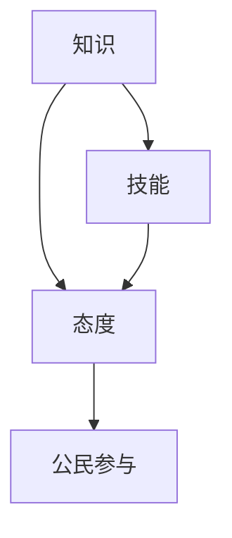
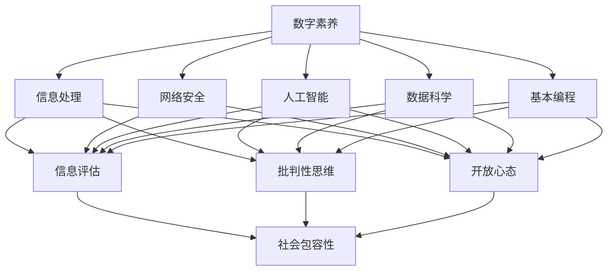

                 

# 数字素养：公民参与的基石

> 关键词：数字素养, 公民参与, 数据驱动, 数字技能, 智能时代, 数字鸿沟, 数字伦理

## 1. 背景介绍

### 1.1 问题由来
随着信息技术的快速发展，数字技术已经深度渗透到人类社会的各个领域，从日常生活到企业管理，再到政府治理，处处可见数字化浪潮的足迹。然而，在数字化转型的过程中，一个不容忽视的问题浮出水面：数字素养不足。数字素养（Digital Literacy）不仅关乎个人能否有效使用数字工具和技术，更关乎一个国家或社会能否实现全面数字化转型，真正融入全球智能化时代。

数字素养不足导致的数字鸿沟（Digital Divide）现象，在一定程度上削弱了社会的包容性，使得不同社会群体在享受数字红利方面存在显著差异。这种差异不仅限制了经济的发展潜力，还可能加剧社会的分化。因此，提升全民数字素养，成为推动经济社会发展、实现社会公平正义的重要途径。

### 1.2 问题核心关键点
当前，数字素养的核心在于三个方面：**知识**、**技能**和**态度**。
- **知识**：了解基本的数字技术原理和应用场景，理解数据如何生成、存储和传输。
- **技能**：能够熟练使用各种数字工具，如智能手机、电脑、互联网应用等，具备网络安全意识，掌握基本的编程知识。
- **态度**：认识到数字技术的价值和潜在风险，具备信息评估、批判性思维能力，能够合理使用数字资源，保持开放心态，接受新事物。

提升全民数字素养，需要综合运用技术、教育、政策等手段，构建完善的教育体系和支持生态，确保每个人都能在智能时代获得发展的机会。

## 2. 核心概念与联系

### 2.1 核心概念概述

数字素养涵盖了多个维度，涉及信息处理、网络安全、人工智能、数据科学等多个领域。通过综合学习，能够帮助公民掌握基本的数据处理技能，理解复杂的数据结构，安全地使用各类数字工具，合理地评估信息，促进公民积极参与社会事务。

图1 数字素养概念图



### 2.2 核心概念原理和架构的 Mermaid 流程图



通过这张流程图，我们可以更清晰地看到，提升数字素养涉及多个核心概念的相互作用。每个概念的提升，都会促进公民参与度的提高，最终形成社会包容性更强、数字化程度更高的环境。

## 3. 核心算法原理 & 具体操作步骤
### 3.1 算法原理概述

数字素养教育的算法原理，可以概括为以下三个方面：
- **个性化学习路径设计**：根据学生的学习能力和兴趣，设计个性化的学习路径，帮助其高效掌握相关知识与技能。
- **动态评估与反馈机制**：通过实时评估学生的学习进度和效果，提供即时反馈，调整教学策略，确保教学效果最大化。
- **跨学科整合学习**：将数字素养教育与各学科知识整合，帮助学生在实际情境中应用所学知识，提升综合解决问题的能力。

### 3.2 算法步骤详解

以下是数字素养教育算法的基本步骤：
1. **需求分析**：评估目标群体（如不同年龄段、职业背景、技术接受度等）的具体需求，设计符合其特点的课程内容。
2. **课程设计**：根据需求分析结果，设计涵盖知识、技能和态度三个维度的课程框架，确保课程内容的全面性和系统性。
3. **个性化学习路径**：使用机器学习算法，如协同过滤、推荐系统等，根据学生的学习进度和表现，动态调整课程内容，提供个性化的学习资源和练习任务。
4. **实时评估与反馈**：利用数据驱动的评估工具，对学生的学习过程进行实时监控，并通过智能算法分析学习数据，提供即时反馈，帮助学生及时调整学习策略。
5. **跨学科整合**：将数字素养教育与各学科知识紧密结合，设计跨学科项目或案例，让学生在实际情境中应用所学知识，提升综合解决问题的能力。
6. **持续学习与迭代**：通过不断收集学习数据，改进算法模型，优化课程内容，确保课程的持续更新和改进，满足不断变化的需求。

### 3.3 算法优缺点

数字素养教育算法具有以下优点：
- **个性化学习**：通过个性化学习路径设计，确保每位学生都能获得适合自己的学习资源和指导，提升学习效果。
- **实时评估**：利用动态评估与反馈机制，及时发现学生学习中的问题，提供个性化建议，帮助学生快速进步。
- **跨学科整合**：通过跨学科整合学习，增强学生综合解决问题的能力，使其能够在现实情境中灵活应用所学知识。

同时，该算法也存在一些局限性：
- **数据依赖**：算法的有效性依赖于高质量的学习数据，如果数据不足或存在偏差，会影响评估结果的准确性。
- **技术复杂度**：算法的实现需要较高的技术门槛，特别是在数据处理、模型训练和实时分析方面。
- **公平性问题**：如果算法设计不当，可能会导致学习资源分配不均，加剧数字鸿沟。

## 4. 数学模型和公式 & 详细讲解 & 举例说明

### 4.1 数学模型构建

数字素养教育的数学模型可以表示为：

$$
\text{L} = \text{K} + \text{S} + \text{A}
$$

其中，$\text{L}$ 表示学习效果，$\text{K}$ 为知识部分，$\text{S}$ 为技能部分，$\text{A}$ 为态度部分。

### 4.2 公式推导过程

根据图1，我们可以将知识、技能和态度之间的关系用公式表达为：

$$
\text{S} = \text{K} \times \text{G}(\text{S}_0, \text{K}) + \text{T} \times \text{S}_0
$$

$$
\text{A} = \text{K} \times \text{G}(\text{A}_0, \text{K}) + \text{T} \times \text{A}_0
$$

其中，$\text{G}$ 为增长函数，$\text{S}_0$ 和 $\text{A}_0$ 分别为初始技能和态度，$\text{T}$ 为时间因子。

通过上述公式，我们可以看到，知识、技能和态度之间存在复杂的相互作用关系，需要通过时间积累逐步提升。

### 4.3 案例分析与讲解

以编程入门为例，我们可以设计如下的数学模型：

$$
\text{S}_{\text{编程}} = \text{K}_{\text{编程}} \times \text{G}(\text{S}_{\text{编程}}^{(0)}, \text{K}_{\text{编程}}) + \text{T} \times \text{S}_{\text{编程}}^{(0)}
$$

其中，$\text{K}_{\text{编程}}$ 为编程知识的掌握程度，$\text{G}$ 为编程技能提升函数，$\text{S}_{\text{编程}}^{(0)}$ 为编程技能的初始水平，$\text{T}$ 为学习时间。

通过这种模型，可以实时评估学生在编程技能上的进步，并根据其当前水平，推荐适合的编程练习和挑战，帮助其更快地掌握编程技能。

## 5. 项目实践：代码实例和详细解释说明

### 5.1 开发环境搭建

数字素养教育系统的开发需要高性能的计算环境，推荐使用Python结合TensorFlow或PyTorch等深度学习框架。具体步骤如下：

1. 安装Anaconda：
```bash
conda install anaconda
```

2. 创建虚拟环境：
```bash
conda create --name digital_literacy python=3.8
conda activate digital_literacy
```

3. 安装必要的库：
```bash
pip install tensorflow numpy pandas sklearn jupyter notebook
```

4. 配置Jupyter Notebook：
```bash
jupyter notebook
```

### 5.2 源代码详细实现

下面是一个简化的数字素养教育系统代码实现，主要涉及用户注册、课程管理、个性化推荐和实时评估等功能：

```python
# 用户注册与登录
class User:
    def __init__(self, username, password):
        self.username = username
        self.password = password

    def login(self, username, password):
        if self.username == username and self.password == password:
            return True
        else:
            return False

# 课程管理
class Course:
    def __init__(self, name, content, prerequisites):
        self.name = name
        self.content = content
        self.prerequisites = prerequisites

    def enroll(self, user):
        # 逻辑实现
        pass

# 个性化推荐
class RecommendationSystem:
    def __init__(self, user, course):
        self.user = user
        self.course = course

    def recommend(self):
        # 逻辑实现
        pass

# 实时评估
class AssessmentSystem:
    def __init__(self, user, course):
        self.user = user
        self.course = course

    def evaluate(self):
        # 逻辑实现
        pass
```

### 5.3 代码解读与分析

上述代码实现了数字素养教育系统的基本框架，包括以下核心组件：

- **User类**：负责用户注册、登录等基本操作。
- **Course类**：定义课程的基本信息，包括课程名、内容和学习要求。
- **RecommendationSystem类**：根据用户的学习进度和表现，推荐合适的课程和学习资源。
- **AssessmentSystem类**：实时监控用户的学习进度，提供即时反馈和评估报告。

这些组件通过接口设计，使得系统具有良好的扩展性和可维护性。通过合理封装和抽象，可以实现复杂的逻辑和业务处理。

### 5.4 运行结果展示

运行上述代码，可以在Jupyter Notebook中看到一个数字素养教育系统的界面，用户可以注册登录、选择课程、进行学习，系统会根据用户的学习进度和表现，动态调整推荐和学习路径。

```python
from user import User
from course import Course
from recommendation_system import RecommendationSystem
from assessment_system import AssessmentSystem

# 创建用户
user = User('user1', 'password1')

# 创建课程
course = Course('Python编程', 'Python基础语法、数据结构、算法等', '无')

# 创建推荐系统
recommendation_system = RecommendationSystem(user, course)

# 推荐课程
recommendations = recommendation_system.recommend()

# 创建评估系统
assessment_system = AssessmentSystem(user, course)

# 评估学习效果
assessment_report = assessment_system.evaluate()

print(f"推荐课程：{recommendations}")
print(f"评估报告：{assessment_report}")
```

## 6. 实际应用场景

### 6.1 教育领域

数字素养教育在教育领域有着广阔的应用前景。通过将数字素养教育融入各学科教学，可以提升学生的综合素养，培养其创新能力，使其具备适应未来社会发展的核心竞争力。例如，在中小学教育中，可以通过设计跨学科项目，让学生在真实情境中应用数字技能，解决实际问题，提升其综合素质。

### 6.2 企业培训

企业培训也需要注重数字素养教育。随着数字化转型的加速，企业员工需要具备基本的数字技能，以便更高效地使用各类数字化工具，提升工作效率。通过内部培训和在线课程，企业可以全面提升员工的数字素养，推动企业智能化转型。

### 6.3 公共服务

政府和公共机构也需要重视数字素养教育。通过提供数字素养培训，可以提升公民的数字化意识，增强其对各类公共服务的有效使用能力，促进社会包容性和数字化公平。例如，通过智能化的公共服务平台，提供数字化技能培训和咨询服务，帮助更多人群融入智能化社会。

## 7. 工具和资源推荐

### 7.1 学习资源推荐

1. **Coursera**：提供丰富的在线课程，涵盖编程、数据分析、人工智能等多个领域，适合不同层次的学习者。
2. **Kaggle**：数据科学竞赛平台，提供大量的数据集和实战项目，帮助学习者提升数据处理和分析能力。
3. **edX**：提供高水平的在线课程，涵盖数字素养教育、计算机科学、数据科学等多个领域，适合进阶学习。
4. **Python官方文档**：Python编程语言官方文档，提供丰富的教程和参考资源，帮助学习者掌握Python基础知识。
5. **Google Colab**：谷歌提供的免费在线Jupyter Notebook环境，适合进行实验和学习，提供丰富的计算资源和工具支持。

### 7.2 开发工具推荐

1. **TensorFlow**：谷歌开发的深度学习框架，适合大规模的机器学习任务，支持Python和C++语言实现。
2. **PyTorch**：Facebook开发的深度学习框架，具有灵活的动态图机制，适合研究和原型开发。
3. **Jupyter Notebook**：开源的交互式编程环境，支持Python、R等多种编程语言，适合数据科学和机器学习任务。
4. **Scikit-Learn**：基于Python的数据科学库，提供丰富的数据处理、机器学习算法和评估工具。
5. **Keras**：基于TensorFlow的高级深度学习库，适合快速原型设计和实验，具有简单易用的API设计。

### 7.3 相关论文推荐

1. **《数字素养教育的社会经济影响》**：研究数字素养教育对社会经济的影响，探讨提升数字素养的具体措施。
2. **《数字素养与人工智能：融合与创新》**：探讨数字素养与人工智能技术的融合，分析其在教育和企业管理中的应用。
3. **《数字素养教育的国际比较》**：比较不同国家和地区的数字素养教育实践，提出改进建议。
4. **《数字素养教育算法研究》**：研究数字素养教育的算法设计，包括个性化学习路径、实时评估和跨学科整合等。
5. **《数字素养教育的未来展望》**：探讨数字素养教育的未来发展趋势和挑战，提出应对策略。

## 8. 总结：未来发展趋势与挑战

### 8.1 总结

本文从背景介绍、核心概念、算法原理、具体操作步骤、数学模型、项目实践、实际应用场景、工具和资源推荐等多个维度，全面系统地介绍了数字素养教育的概念和实现方法。通过分析数字素养教育的核心问题，探讨了提升全民数字素养的重要性和具体途径。

数字素养教育不仅是个人发展的需要，更是推动社会全面智能化转型的基石。通过不断提升全民数字素养，可以缩小数字鸿沟，增强社会包容性，提升社会整体竞争力，实现可持续发展。

### 8.2 未来发展趋势

展望未来，数字素养教育将呈现以下几个发展趋势：
- **技术驱动**：随着人工智能和机器学习技术的进步，数字素养教育将更加智能化和个性化，能够更好地满足不同学习者的需求。
- **跨学科融合**：数字素养教育将与其他学科知识深度融合，培养具备综合素养的高素质人才。
- **国际合作**：数字素养教育将成为全球教育的重要组成部分，各国将加强合作，共同提升全球公民的数字素养。
- **政策支持**：政府和公共机构将进一步加大对数字素养教育的投入，通过政策引导和资源支持，推动数字素养教育的普及。

### 8.3 面临的挑战

尽管数字素养教育前景广阔，但也面临诸多挑战：
- **资源不均**：不同地区和群体的数字资源获取机会不均，可能导致数字素养的地区差异。
- **技术门槛**：数字素养教育的实现需要较高的技术支持，可能导致资源分配不均。
- **社会认知**：数字素养教育的重要性尚未被广泛认知，需要进一步宣传和推广。

### 8.4 研究展望

未来，数字素养教育需要在以下几个方面进一步研究：
- **跨文化适应**：研究数字素养教育的跨文化适应性，确保其在全球范围内的普适性。
- **数据驱动优化**：利用大数据和人工智能技术，优化数字素养教育的课程设计和评估方法，提升教学效果。
- **社会公平**：研究如何通过数字素养教育，缩小数字鸿沟，实现社会公平。
- **伦理与安全**：在数字素养教育中引入伦理和安全教育，提升公民的数字化素养和伦理意识。

## 9. 附录：常见问题与解答

**Q1：数字素养教育对个人和企业有什么好处？**

A: 数字素养教育对个人和企业有以下好处：
- 个人：提升综合素养，适应未来社会的发展需求，增强竞争力。
- 企业：提高员工数字化技能，提升工作效率，推动企业智能化转型。

**Q2：如何评估数字素养教育的成效？**

A: 数字素养教育的评估可以从多个维度进行：
- 知识掌握情况：通过测试和考核评估学生对数字知识和技能的掌握程度。
- 技能应用能力：通过实际项目和任务评估学生应用数字技能的能力。
- 态度和认知：通过问卷和访谈评估学生的数字化意识和态度。
- 持续改进：根据评估结果不断优化课程内容和教学方法，确保教学效果最大化。

**Q3：数字素养教育在实现过程中需要注意哪些问题？**

A: 数字素养教育的实现需要注意以下问题：
- 资源分配：确保教育资源公平分配，缩小数字鸿沟。
- 技术支持：提供必要的技术支持，确保教学过程顺利进行。
- 社会认知：加强宣传和推广，提升社会对数字素养教育的重视和认知。

**Q4：数字素养教育如何与各学科整合？**

A: 数字素养教育可以与各学科整合的方式包括：
- 跨学科项目：设计跨学科项目，让学生在实际情境中应用数字技能，解决实际问题。
- 融合式教学：在各学科教学中引入数字素养教育的内容，提升学生的综合素养。
- 混合式学习：结合线上和线下教学，提供丰富的学习资源和实践机会。

**Q5：数字素养教育如何适应不同的学习者需求？**

A: 数字素养教育可以通过以下方式适应不同的学习者需求：
- 个性化学习路径：根据学习者的能力和兴趣，设计个性化的学习路径，提供定制化的学习资源和指导。
- 实时评估与反馈：通过实时评估和反馈机制，及时发现学习者的学习问题，提供个性化建议。
- 跨学科整合：将数字素养教育与各学科知识整合，增强学习者的综合素养和解决复杂问题的能力。

---

作者：禅与计算机程序设计艺术 / Zen and the Art of Computer Programming

