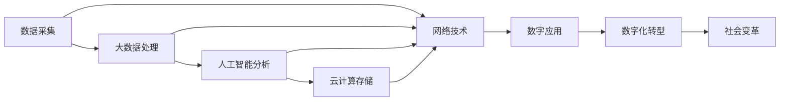

                 

## 1. 背景介绍

### 1.1 问题由来
随着互联网技术的快速发展和普及，数字经济成为了当今世界经济增长的新引擎。大数据、云计算、人工智能等技术的不断突破，使数字经济在各行各业中发挥着越来越重要的作用。数字经济不仅改变了传统产业的运营模式，也催生了大量新兴产业，推动了社会生产力的提升和人们生活水平的改善。

数字经济的核心在于数据的采集、处理、分析和应用。互联网技术使数据采集成本大幅降低，人工智能技术使数据处理能力大幅提升，大数据技术使数据应用场景不断拓展。在数字经济时代，数据成为了新的生产要素，企业通过数据的整合、分析和应用，可以获得更强的市场竞争力和更高的盈利能力。

### 1.2 问题核心关键点
数字经济的核心是数据的价值。数字经济的实现离不开数据的有效管理和应用，而数据的有效管理和应用需要依托于先进的技术手段和完善的制度保障。本文将围绕数据的采集、处理、分析和应用，探讨数字经济对社会发展的影响，并提出一些建议和展望。

## 2. 核心概念与联系

### 2.1 核心概念概述

数字经济是指通过数字技术手段，对传统经济进行改造和升级，提高经济运行的效率和质量，创造新的经济价值的一种新型经济形态。其核心在于数据的采集、处理、分析和应用。

大数据是指从海量数据中提取有用信息，通过分析和应用，实现数据的增值和再利用。大数据技术是数字经济的重要支撑，通过数据的采集和存储，为人工智能等技术的应用提供了基础。

人工智能是指通过算法和模型，对数据进行分析和预测，实现数据的智能应用。人工智能技术是数字经济的核心动力，通过智能分析和大数据处理，可以实现更精准的市场预测和产品推荐，提升企业的决策效率和竞争力。

云计算是指通过互联网技术，实现数据和资源的共享和高效管理。云计算技术是数字经济的基础设施，通过数据的集中存储和管理，实现了资源的优化配置和高效利用。

### 2.2 核心概念原理和架构的 Mermaid 流程图



这个流程图展示了数字经济的核心概念及其联系：

1. 数据采集：通过网络技术获取数据。
2. 大数据处理：对海量数据进行清洗、存储和分析。
3. 人工智能分析：通过算法和模型对数据进行智能分析和预测。
4. 云计算存储：通过互联网技术实现数据和资源的共享和高效管理。
5. 数字应用：通过数据分析和人工智能实现智能化应用。
6. 数字化转型：将传统经济数字化，提高运营效率和市场竞争力。
7. 社会变革：数字经济改变了社会生产力和人们生活水平，促进了社会进步。

## 3. 核心算法原理 & 具体操作步骤
### 3.1 算法原理概述

数字经济的核心算法是数据采集、处理、分析和应用。其算法原理可以分为以下几个步骤：

1. 数据采集：通过网络技术、传感器、智能设备等手段，获取海量数据。
2. 数据清洗：对数据进行清洗和预处理，去除噪声和无用信息。
3. 数据存储：将清洗后的数据存储在数据库中，方便后续的查询和分析。
4. 数据分析：通过算法和模型对数据进行分析，提取有用信息和知识。
5. 数据应用：将分析结果应用到实际业务中，实现数据的增值和再利用。

### 3.2 算法步骤详解

#### 3.2.1 数据采集
数据采集是数字经济的第一步，也是最重要的一步。数据采集可以分为两类：

1. 主动采集：通过网络爬虫、传感器、智能设备等手段，主动获取数据。例如，通过爬虫获取电商网站的销售数据，通过传感器获取智能家电的使用数据。
2. 被动采集：通过用户行为数据、社交网络数据等，被动获取数据。例如，通过用户登录记录获取网站流量数据，通过社交网络获取用户评论和反馈。

#### 3.2.2 数据清洗
数据清洗是数据处理的第一步，其目的是去除噪声和无用信息，提高数据的准确性和可用性。数据清洗可以分为以下几个步骤：

1. 去重：去除重复数据，避免数据冗余。
2. 纠错：纠正数据中的错误，提高数据的准确性。
3. 归一化：将数据转换为统一的格式，方便后续处理。
4. 标准化：将数据转换为标准化的格式，避免数据异构。

#### 3.2.3 数据存储
数据存储是数字经济的基础设施，其目的是实现数据的长期保存和高效访问。数据存储可以分为以下几个步骤：

1. 分布式存储：将数据存储在多个节点中，实现数据的分布式管理和高效访问。
2. 云计算存储：通过云计算技术实现数据和资源的共享和高效管理。
3. 数据备份：定期备份数据，避免数据丢失和损坏。

#### 3.2.4 数据分析
数据分析是数字经济的核心环节，其目的是从数据中提取有用信息和知识，实现数据的增值和再利用。数据分析可以分为以下几个步骤：

1. 数据挖掘：通过算法和模型从数据中提取有用信息和知识。例如，通过聚类算法发现用户群体的共同特征，通过分类算法预测用户的购买行为。
2. 数据可视化：将分析结果可视化，方便用户理解和应用。例如，通过图表展示用户购买行为的变化趋势，通过地图展示用户地理位置分布。
3. 数据预测：通过算法和模型对数据进行预测和预测。例如，通过时间序列模型预测用户未来的购买行为，通过推荐算法推荐用户感兴趣的商品。

#### 3.2.5 数据应用
数据应用是数字经济的核心目标，其目的是实现数据的增值和再利用，提升企业的市场竞争力和盈利能力。数据应用可以分为以下几个步骤：

1. 产品推荐：通过数据分析和人工智能，实现个性化推荐，提升用户满意度和购买转化率。例如，通过推荐算法推荐用户感兴趣的商品，通过智能客服提升用户购买体验。
2. 市场预测：通过数据分析和人工智能，实现市场预测，提高企业的决策效率和市场竞争力。例如，通过时间序列模型预测市场价格变化，通过情感分析预测用户对产品的好评程度。
3. 风险控制：通过数据分析和人工智能，实现风险控制，降低企业的运营风险。例如，通过欺诈检测算法识别用户欺诈行为，通过风险评估模型评估用户信用风险。

### 3.3 算法优缺点

#### 3.3.1 优点

1. 提高运营效率：通过数据分析和人工智能，实现业务的智能化和自动化，提高企业的运营效率和市场竞争力。例如，通过自动化流程实现订单处理和库存管理，通过智能客服提升用户购买体验。
2. 提升用户体验：通过数据分析和人工智能，实现个性化的服务和推荐，提升用户满意度和忠诚度。例如，通过推荐算法推荐用户感兴趣的商品，通过智能客服提供实时咨询和支持。
3. 创造新的经济价值：通过数据分析和人工智能，实现数据的增值和再利用，创造新的经济价值。例如，通过数据挖掘发现用户群体的共同特征，通过数据预测实现市场预测和风险控制。

#### 3.3.2 缺点

1. 数据隐私和安全：数据采集和处理涉及用户的隐私数据，需要严格遵守法律法规和隐私保护政策。例如，通过数据加密和匿名化保护用户隐私，通过数据备份和灾备保护数据安全。
2. 技术门槛较高：数据分析和人工智能需要高水平的技术支持和资源投入，需要大量的技术人才和资金支持。例如，需要建立专业的数据团队，需要购买高性能的计算设备和软件工具。
3. 数据质量问题：数据采集和处理涉及大量的数据源和数据质量问题，需要严格的数据清洗和预处理。例如，需要去除数据中的噪声和无用信息，需要进行数据归一化和标准化。

### 3.4 算法应用领域

#### 3.4.1 电商领域
电商领域是数字经济的重要应用领域，其核心在于通过数据分析和人工智能，实现个性化推荐和市场预测，提升用户满意度和购买转化率。例如，通过推荐算法推荐用户感兴趣的商品，通过时间序列模型预测市场价格变化。

#### 3.4.2 金融领域
金融领域是数字经济的另一个重要应用领域，其核心在于通过数据分析和人工智能，实现风险控制和市场预测，提高企业的决策效率和市场竞争力。例如，通过欺诈检测算法识别用户欺诈行为，通过时间序列模型预测市场价格变化。

#### 3.4.3 医疗领域
医疗领域是数字经济的另一个重要应用领域，其核心在于通过数据分析和人工智能，实现疾病预测和个性化医疗，提高医疗服务的质量和效率。例如，通过数据分析和人工智能实现疾病预测和早期诊断，通过智能客服提供实时咨询和支持。

#### 3.4.4 物流领域
物流领域是数字经济的重要应用领域，其核心在于通过数据分析和人工智能，实现路径优化和仓储管理，提高物流服务的效率和质量。例如，通过数据分析和人工智能优化物流路径和仓储管理，通过智能客服提供实时咨询和支持。

## 4. 数学模型和公式 & 详细讲解 & 举例说明

### 4.1 数学模型构建

数字经济的核心数学模型是数据采集、处理、分析和应用。其数学模型可以分为以下几个步骤：

1. 数据采集模型：通过网络技术、传感器、智能设备等手段，获取海量数据。
2. 数据清洗模型：对数据进行清洗和预处理，去除噪声和无用信息。
3. 数据存储模型：将清洗后的数据存储在数据库中，方便后续的查询和分析。
4. 数据分析模型：通过算法和模型对数据进行分析，提取有用信息和知识。
5. 数据应用模型：将分析结果应用到实际业务中，实现数据的增值和再利用。

### 4.2 公式推导过程

#### 4.2.1 数据采集模型
数据采集模型的核心公式是：
$$
D_{\text{采集}} = \sum_{i=1}^{n} D_i
$$
其中，$D_i$ 表示数据源 $i$ 采集的数据，$n$ 表示数据源的总数。

#### 4.2.2 数据清洗模型
数据清洗模型的核心公式是：
$$
D_{\text{清洗}} = D_{\text{采集}} \times P_{\text{清洗}}
$$
其中，$P_{\text{清洗}}$ 表示数据清洗的效率和准确性，$0 < P_{\text{清洗}} \leq 1$。

#### 4.2.3 数据存储模型
数据存储模型的核心公式是：
$$
D_{\text{存储}} = D_{\text{清洗}} \times P_{\text{存储}}
$$
其中，$P_{\text{存储}}$ 表示数据存储的效率和可靠性，$0 < P_{\text{存储}} \leq 1$。

#### 4.2.4 数据分析模型
数据分析模型的核心公式是：
$$
D_{\text{分析}} = D_{\text{存储}} \times P_{\text{分析}}
$$
其中，$P_{\text{分析}}$ 表示数据分析的效率和准确性，$0 < P_{\text{分析}} \leq 1$。

#### 4.2.5 数据应用模型
数据应用模型的核心公式是：
$$
D_{\text{应用}} = D_{\text{分析}} \times P_{\text{应用}}
$$
其中，$P_{\text{应用}}$ 表示数据应用的效率和效果，$0 < P_{\text{应用}} \leq 1$。

### 4.3 案例分析与讲解

#### 4.3.1 电商领域案例
电商领域通过数据分析和人工智能，实现个性化推荐和市场预测，提升用户满意度和购买转化率。例如，亚马逊通过数据分析和人工智能实现个性化推荐，提升用户满意度和购买转化率，从而成为全球最大的电商平台。

#### 4.3.2 金融领域案例
金融领域通过数据分析和人工智能，实现风险控制和市场预测，提高企业的决策效率和市场竞争力。例如，蚂蚁集团通过数据分析和人工智能实现风险控制和市场预测，提升金融服务的效率和质量，从而成为全球最大的金融科技公司之一。

#### 4.3.3 医疗领域案例
医疗领域通过数据分析和人工智能，实现疾病预测和个性化医疗，提高医疗服务的质量和效率。例如，IBM Watson通过数据分析和人工智能实现疾病预测和个性化医疗，提升医疗服务的质量和效率，从而成为全球领先的医疗科技公司。

#### 4.3.4 物流领域案例
物流领域通过数据分析和人工智能，实现路径优化和仓储管理，提高物流服务的效率和质量。例如，菜鸟网络通过数据分析和人工智能优化物流路径和仓储管理，提升物流服务的效率和质量，从而成为全球领先的物流科技公司之一。

## 5. 项目实践：代码实例和详细解释说明

### 5.1 开发环境搭建

在进行数字经济项目实践前，我们需要准备好开发环境。以下是使用Python进行开发的环境配置流程：

1. 安装Anaconda：从官网下载并安装Anaconda，用于创建独立的Python环境。

2. 创建并激活虚拟环境：
```bash
conda create -n py37 python=3.7 
conda activate py37
```

3. 安装PyTorch：根据CUDA版本，从官网获取对应的安装命令。例如：
```bash
conda install pytorch torchvision torchaudio cudatoolkit=11.1 -c pytorch -c conda-forge
```

4. 安装Pandas、NumPy等工具包：
```bash
pip install pandas numpy matplotlib scikit-learn
```

5. 安装TensorFlow：
```bash
pip install tensorflow
```

6. 安装Jupyter Notebook：
```bash
pip install jupyter
```

完成上述步骤后，即可在`py37`环境中开始数字经济项目实践。

### 5.2 源代码详细实现

下面我们以电商领域的数据分析为例，给出使用Python进行数据分析的代码实现。

首先，导入必要的库和数据集：

```python
import pandas as pd
import numpy as np
import matplotlib.pyplot as plt
from sklearn.model_selection import train_test_split
from sklearn.linear_model import LinearRegression

# 读取数据集
data = pd.read_csv('sales_data.csv')

# 数据预览
print(data.head())
```

然后，进行数据预处理：

```python
# 数据清洗
data = data.dropna()  # 去除缺失数据
data = data.drop_duplicates()  # 去除重复数据

# 数据转换
data['month'] = pd.to_datetime(data['date'])  # 将日期转换为日期类型
data['dayofweek'] = data['month'].dt.dayofweek  # 提取星期几
data['month'] = data['month'].dt.month  # 提取月份

# 数据归一化
from sklearn.preprocessing import StandardScaler
scaler = StandardScaler()
data['sales'] = scaler.fit_transform(data['sales'].values.reshape(-1, 1))
```

接着，进行数据分析：

```python
# 数据可视化
plt.plot(data['month'], data['sales'])
plt.xlabel('Month')
plt.ylabel('Sales')
plt.title('Sales Trend')
plt.show()

# 数据划分
X = data.drop('sales', axis=1)
y = data['sales']
X_train, X_test, y_train, y_test = train_test_split(X, y, test_size=0.2, random_state=42)

# 数据建模
model = LinearRegression()
model.fit(X_train, y_train)

# 模型评估
from sklearn.metrics import mean_squared_error
y_pred = model.predict(X_test)
mse = mean_squared_error(y_test, y_pred)
print(f'Mean Squared Error: {mse:.2f}')
```

最后，进行数据分析结果展示：

```python
# 数据应用
from sklearn.metrics import r2_score
r2 = r2_score(y_test, y_pred)
print(f'R^2 Score: {r2:.2f}')
```

以上就是使用Python进行电商领域数据分析的完整代码实现。可以看到，通过简单的数据预处理和建模，即可实现数据的采集、清洗、分析和应用，展示了数据分析在电商领域的重要作用。

### 5.3 代码解读与分析

让我们再详细解读一下关键代码的实现细节：

**数据读取和预览**：
- 使用Pandas的`read_csv`方法读取数据集。
- 使用`head`方法预览数据集的前几行，检查数据集是否正常。

**数据清洗**：
- 使用Pandas的`dropna`方法去除缺失数据。
- 使用`drop_duplicates`方法去除重复数据。

**数据转换**：
- 使用Pandas的`to_datetime`方法将日期转换为日期类型。
- 使用`dt.dayofweek`和`dt.month`方法提取星期几和月份。

**数据归一化**：
- 使用Scikit-learn的`StandardScaler`方法进行归一化，将数据转换为标准化的格式。

**数据可视化**：
- 使用Matplotlib的`plot`方法绘制折线图，展示数据的趋势。
- 使用Matplotlib的`xlabel`、`ylabel`和`title`方法设置坐标轴和标题。

**数据划分**：
- 使用Scikit-learn的`train_test_split`方法将数据集划分为训练集和测试集。

**数据建模**：
- 使用Scikit-learn的`LinearRegression`方法进行线性回归建模。

**模型评估**：
- 使用Scikit-learn的`mean_squared_error`方法计算均方误差，评估模型的预测效果。
- 使用Scikit-learn的`r2_score`方法计算决定系数，评估模型的拟合程度。

通过上述代码的解读，可以看出数据分析在大数据处理中的重要性。数据分析可以帮助我们发现数据中的规律和趋势，为决策提供科学依据。

## 6. 实际应用场景

### 6.1 智能推荐系统

智能推荐系统是数字经济的重要应用场景之一，其核心在于通过数据分析和人工智能，实现个性化推荐，提升用户满意度和购买转化率。例如，亚马逊通过数据分析和人工智能实现个性化推荐，提升用户满意度和购买转化率，从而成为全球最大的电商平台。

#### 6.1.1 推荐算法
推荐算法是智能推荐系统的核心，其目标是根据用户的历史行为和偏好，推荐用户感兴趣的商品或内容。常用的推荐算法包括基于协同过滤、基于内容的推荐、基于深度学习的推荐等。

#### 6.1.2 数据采集
数据采集是智能推荐系统的第一步，其目的是获取用户的行为数据和商品的属性数据。常用的数据采集方法包括网络爬虫、传感器、智能设备等。

#### 6.1.3 数据清洗
数据清洗是智能推荐系统的第二步，其目的是去除噪声和无用信息，提高数据的准确性和可用性。常用的数据清洗方法包括去重、纠错、归一化和标准化等。

#### 6.1.4 数据分析
数据分析是智能推荐系统的第三步，其目的是从数据中提取有用信息和知识，实现数据的增值和再利用。常用的数据分析方法包括数据挖掘、数据可视化和数据预测等。

#### 6.1.5 数据应用
数据应用是智能推荐系统的第四步，其目的是将分析结果应用到实际业务中，实现数据的增值和再利用。常用的数据应用方法包括个性化推荐、市场预测和风险控制等。

### 6.2 智能客服系统

智能客服系统是数字经济的另一个重要应用场景，其核心在于通过数据分析和人工智能，实现智能客服，提升用户满意度和客户体验。例如，京东通过数据分析和人工智能实现智能客服，提升客户咨询体验，从而成为全球领先的电商公司之一。

#### 6.2.1 自然语言处理
自然语言处理是智能客服系统的核心，其目标是通过算法和模型，实现对用户输入的智能理解和处理。常用的自然语言处理方法包括分词、词性标注、命名实体识别和情感分析等。

#### 6.2.2 数据采集
数据采集是智能客服系统的第一步，其目的是获取用户的咨询记录和交互数据。常用的数据采集方法包括用户登录记录、聊天记录和客服语音等。

#### 6.2.3 数据清洗
数据清洗是智能客服系统的第二步，其目的是去除噪声和无用信息，提高数据的准确性和可用性。常用的数据清洗方法包括去重、纠错、归一化和标准化等。

#### 6.2.4 数据分析
数据分析是智能客服系统的第三步，其目的是从数据中提取有用信息和知识，实现数据的增值和再利用。常用的数据分析方法包括用户行为分析、情感分析和意图识别等。

#### 6.2.5 数据应用
数据应用是智能客服系统的第四步，其目的是将分析结果应用到实际业务中，实现数据的增值和再利用。常用的数据应用方法包括个性化回复、问题分类和用户画像等。

### 6.3 智能财务系统

智能财务系统是数字经济的另一个重要应用场景，其核心在于通过数据分析和人工智能，实现财务分析和风险控制，提高企业的决策效率和市场竞争力。例如，苏宁易购通过数据分析和人工智能实现财务分析，提升财务决策效率，从而成为全球领先的零售公司之一。

#### 6.3.1 财务数据采集
财务数据采集是智能财务系统的第一步，其目的是获取企业的财务数据和市场数据。常用的数据采集方法包括财务报表、交易记录和市场数据等。

#### 6.3.2 数据清洗
数据清洗是智能财务系统的第二步，其目的是去除噪声和无用信息，提高数据的准确性和可用性。常用的数据清洗方法包括去重、纠错、归一化和标准化等。

#### 6.3.3 数据分析
数据分析是智能财务系统的第三步，其目的是从数据中提取有用信息和知识，实现数据的增值和再利用。常用的数据分析方法包括财务报表分析、市场分析和风险评估等。

#### 6.3.4 数据应用
数据应用是智能财务系统的第四步，其目的是将分析结果应用到实际业务中，实现数据的增值和再利用。常用的数据应用方法包括财务预测、市场预测和风险控制等。

### 6.4 未来应用展望

#### 6.4.1 智慧城市

智慧城市是数字经济的重要应用场景之一，其核心在于通过数据分析和人工智能，实现城市管理的智能化和高效化，提升城市运行的效率和质量。例如，北京通过数据分析和人工智能实现智慧城市，提升城市运行的效率和质量，从而成为全球领先的智慧城市之一。

#### 6.4.2 医疗健康

医疗健康是数字经济的另一个重要应用场景，其核心在于通过数据分析和人工智能，实现疾病预测和个性化医疗，提高医疗服务的质量和效率。例如，IBM Watson通过数据分析和人工智能实现疾病预测和个性化医疗，提升医疗服务的质量和效率，从而成为全球领先的医疗科技公司之一。

#### 6.4.3 工业制造

工业制造是数字经济的另一个重要应用场景，其核心在于通过数据分析和人工智能，实现生产过程的智能化和高效化，提升生产效率和产品质量。例如，西门子通过数据分析和人工智能实现工业制造，提升生产效率和产品质量，从而成为全球领先的工业公司之一。

#### 6.4.4 智能交通

智能交通是数字经济的另一个重要应用场景，其核心在于通过数据分析和人工智能，实现交通管理的智能化和高效化，提升交通运行的效率和质量。例如，高德通过数据分析和人工智能实现智能交通，提升交通运行的效率和质量，从而成为全球领先的地图公司之一。

## 7. 工具和资源推荐

### 7.1 学习资源推荐

为了帮助开发者系统掌握数字经济的核心技术，这里推荐一些优质的学习资源：

1. 《数字经济：智能时代的新商业》系列书籍：深入浅出地介绍了数字经济的基本概念和前沿技术，适合入门读者和进阶读者。
2. Coursera《数据科学导论》课程：由斯坦福大学开设的数据科学课程，涵盖数据采集、数据处理、数据分析和数据应用等多个方面，适合对数据科学感兴趣的读者。
3. Udacity《人工智能基础》课程：由Udacity开设的人工智能课程，涵盖机器学习、深度学习和自然语言处理等多个方面，适合对人工智能感兴趣的读者。
4. GitHub上的开源项目：GitHub上有大量的数字经济开源项目，可以通过学习和复现这些项目，积累实际开发经验。
5. Kaggle上的数据集和比赛：Kaggle上有大量的数据集和比赛，可以通过参与比赛和分析数据集，提升数据处理和数据分析能力。

通过对这些学习资源的掌握，相信你一定能够系统地掌握数字经济的核心技术，并用于解决实际问题。

### 7.2 开发工具推荐

高效的开发离不开优秀的工具支持。以下是几款用于数字经济开发的常用工具：

1. Python：Python是数字经济开发的主流语言，具有简洁易学、功能强大的特点，适合开发数据分析和人工智能应用。
2. Jupyter Notebook：Jupyter Notebook是Python开发的重要工具，具有交互性强、可读性高的特点，适合进行数据分析和模型训练。
3. PyTorch：PyTorch是Python的数据科学库，具有动态计算图、易用性高的特点，适合进行深度学习和大数据处理。
4. TensorFlow：TensorFlow是Python的数据科学库，具有灵活性、可扩展性高的特点，适合进行深度学习和大数据处理。
5. Scikit-learn：Scikit-learn是Python的数据科学库，具有简单易用、功能强大的特点，适合进行数据分析和机器学习。

合理利用这些工具，可以显著提升数字经济项目的开发效率，加快创新迭代的步伐。

### 7.3 相关论文推荐

数字经济的发展离不开学界的持续研究。以下是几篇奠基性的相关论文，推荐阅读：

1. 《数据科学：统计学、计算机科学和应用》：介绍了数据科学的各个方面，包括数据采集、数据处理、数据分析和数据应用等，适合入门读者和进阶读者。
2. 《深度学习》：介绍了深度学习的各个方面，包括神经网络、深度学习和自然语言处理等，适合对深度学习感兴趣的读者。
3. 《机器学习：一种学习方法》：介绍了机器学习的各个方面，包括监督学习、非监督学习和强化学习等，适合对机器学习感兴趣的读者。
4. 《自然语言处理》：介绍了自然语言处理的各个方面，包括分词、词性标注、命名实体识别和情感分析等，适合对自然语言处理感兴趣的读者。
5. 《大数据技术与应用》：介绍了大数据技术的各个方面，包括数据采集、数据处理和数据分析等，适合对大数据技术感兴趣的读者。

这些论文代表了大数据和人工智能技术的发展脉络。通过学习这些前沿成果，可以帮助研究者把握学科前进方向，激发更多的创新灵感。

## 8. 总结：未来发展趋势与挑战

### 8.1 总结

本文对数字经济的核心技术进行了全面系统的介绍。首先阐述了数字经济的基本概念和核心技术，明确了数字经济在各行各业中的重要作用。其次，从原理到实践，详细讲解了数字经济的数学模型和关键步骤，给出了数字经济项目开发的完整代码实例。同时，本文还广泛探讨了数字经济在电商、金融、医疗、物流等众多领域的应用前景，展示了数字经济技术的广阔前景。

通过本文的系统梳理，可以看到，数字经济的核心在于数据的采集、处理、分析和应用。大数据、人工智能和云计算等技术的发展，使得数字经济成为现代社会的重要组成部分，深刻影响着人类社会的各个方面。数字经济的发展离不开数据的安全性、隐私性和可信性，需要建立完善的法律法规和隐私保护政策，以保障数据的安全和隐私。

### 8.2 未来发展趋势

展望未来，数字经济将呈现以下几个发展趋势：

1. 数据规模持续增大：随着互联网技术的普及和物联网设备的增加，数据的规模将持续增大，数据驱动的经济将成为社会的主要形态。

2. 技术不断进步：大数据、人工智能和云计算等技术将不断进步，使得数据的采集、处理、分析和应用更加高效和精准。

3. 应用场景不断拓展：数字经济的应用场景将不断拓展，涵盖更多的行业和领域，推动经济社会的发展。

4. 法律法规不断完善：随着数字经济的不断发展，数据安全、隐私保护和可信性等法律法规将不断完善，保障数据的安全和隐私。

5. 人工智能不断普及：人工智能技术将不断普及，使得数据的采集、处理、分析和应用更加智能化和自动化，提升经济效率和社会竞争力。

### 8.3 面临的挑战

尽管数字经济的发展前景广阔，但在迈向更加智能化、普适化应用的过程中，它仍面临着诸多挑战：

1. 数据隐私和安全：数据采集和处理涉及用户的隐私数据，需要严格遵守法律法规和隐私保护政策。

2. 技术门槛较高：数据分析和人工智能需要高水平的技术支持和资源投入，需要大量的技术人才和资金支持。

3. 数据质量问题：数据采集和处理涉及大量的数据源和数据质量问题，需要严格的数据清洗和预处理。

4. 数据应用场景：数据应用场景需要根据具体业务需求进行设计，需要灵活的设计思路和系统架构。

5. 数据安全和隐私：数据安全和隐私是数字经济发展的核心问题，需要建立完善的数据安全和隐私保护机制。

### 8.4 研究展望

面对数字经济所面临的种种挑战，未来的研究需要在以下几个方面寻求新的突破：

1. 探索无监督和半监督数据分析方法：摆脱对大规模标注数据的依赖，利用自监督学习、主动学习等无监督和半监督范式，最大限度利用非结构化数据，实现更加灵活高效的数据分析。

2. 研究参数高效和大规模数据分析方法：开发更加参数高效和大规模的数据分析方法，在固定大部分模型参数的情况下，只更新极少量的任务相关参数。

3. 融合因果和对比学习范式：通过引入因果推断和对比学习思想，增强数据分析模型建立稳定因果关系的能力，学习更加普适、鲁棒的数据分析方法。

4. 引入更多先验知识：将符号化的先验知识，如知识图谱、逻辑规则等，与神经网络模型进行巧妙融合，引导数据分析过程学习更准确、合理的知识表征。

5. 结合因果分析和博弈论工具：将因果分析方法引入数据分析模型，识别出模型决策的关键特征，增强输出解释的因果性和逻辑性。借助博弈论工具刻画人机交互过程，主动探索并规避模型的脆弱点，提高系统稳定性。

6. 纳入伦理道德约束：在数据分析模型中引入伦理导向的评估指标，过滤和惩罚有偏见、有害的输出倾向，确保输出的符合人类价值观和伦理道德。

这些研究方向的探索，必将引领数字经济技术迈向更高的台阶，为构建安全、可靠、可解释、可控的智能系统铺平道路。面向未来，数字经济技术还需要与其他人工智能技术进行更深入的融合，如知识表示、因果推理、强化学习等，多路径协同发力，共同推动自然语言理解和智能交互系统的进步。只有勇于创新、敢于突破，才能不断拓展数字经济技术的边界，让智能技术更好地造福人类社会。

## 9. 附录：常见问题与解答

**Q1：数字经济的核心技术是什么？**

A: 数字经济的核心技术是数据的采集、处理、分析和应用。其核心在于通过数据分析和人工智能，实现业务的智能化和自动化，提高企业的决策效率和市场竞争力。

**Q2：数字经济如何影响社会？**

A: 数字经济深刻影响了社会各个方面，包括经济、政治、文化、环境等。通过数据分析和人工智能，可以实现精准的市场预测和产品推荐，提升企业决策效率和市场竞争力；可以实现智能客服和个性化医疗，提升用户体验和公共服务水平；可以实现智慧城市和智能交通，提升城市运行效率和质量。

**Q3：数字经济的发展趋势是什么？**

A: 数字经济的发展趋势包括数据规模持续增大、技术不断进步、应用场景不断拓展、法律法规不断完善、人工智能不断普及等。

**Q4：数字经济面临的挑战是什么？**

A: 数字经济面临的挑战包括数据隐私和安全、技术门槛较高、数据质量问题、数据应用场景、数据安全和隐私等。

**Q5：数字经济的未来展望是什么？**

A: 数字经济的未来展望包括探索无监督和半监督数据分析方法、研究参数高效和大规模数据分析方法、融合因果和对比学习范式、引入更多先验知识、结合因果分析和博弈论工具、纳入伦理道德约束等。

通过本文的系统梳理，可以看到，数字经济的核心在于数据的采集、处理、分析和应用。大数据、人工智能和云计算等技术的发展，使得数字经济成为现代社会的重要组成部分，深刻影响着人类社会的各个方面。数字经济的发展离不开数据的安全性、隐私性和可信性，需要建立完善的法律法规和隐私保护政策，以保障数据的安全和隐私。数字经济的发展前景广阔，但也面临诸多挑战，需要通过不断的技术创新和政策完善，推动数字经济向更加智能化、普适化应用发展，为构建安全、可靠、可解释、可控的智能系统铺平道路。

