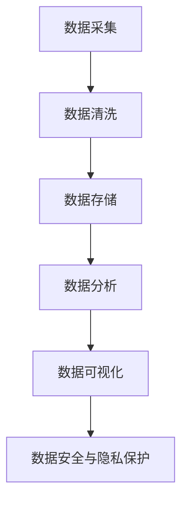

                 

### 文章标题

**AI创业：数据管理的创新实践**

> 关键词：人工智能、数据管理、创新实践、创业

> 摘要：本文深入探讨了人工智能（AI）在创业领域中的应用，特别关注数据管理方面的创新实践。文章首先介绍了AI的基本概念和创业环境，然后详细分析了数据管理的重要性以及AI在该领域的应用。通过具体案例和步骤，本文展示了AI在数据采集、处理、分析和存储中的创新实践，为创业公司的数据管理提供了宝贵的参考和指导。

-------------------

## 1. 背景介绍（Background Introduction）

随着人工智能技术的迅猛发展，AI已经深刻地改变了各个行业，创业领域也不例外。创业公司通常面临资源有限、时间紧迫等挑战，而AI技术的应用能够显著提升公司竞争力，优化业务流程，提高决策效率。数据管理作为创业公司的核心环节，其质量和效率直接影响公司的生存与发展。

### 1.1 人工智能的概念与基本原理

人工智能（AI，Artificial Intelligence）是指由人制造出来的系统能够模拟、延伸和扩展人类的智能。它涉及到机器学习、深度学习、自然语言处理、计算机视觉等多个领域。AI系统通过算法和模型从数据中学习，以实现智能化的任务，如语音识别、图像分类、自然语言理解等。

### 1.2 创业环境中的数据管理挑战

在创业过程中，数据管理面临以下几大挑战：

- **数据多样性**：创业公司可能需要处理来自不同来源、不同格式的数据。
- **数据质量**：数据的准确性、完整性和一致性对业务决策至关重要。
- **数据隐私和安全**：创业公司需要确保数据的安全和合规性，以保护用户隐私。
- **数据处理效率**：数据处理速度直接影响到业务响应速度和用户体验。

### 1.3 人工智能在创业中的应用

AI在创业中的应用主要包括以下几个方面：

- **市场预测和需求分析**：通过分析历史数据和趋势，预测市场变化和消费者需求。
- **客户行为分析**：利用自然语言处理和计算机视觉技术分析客户行为，优化产品和服务。
- **自动化决策**：通过机器学习模型自动化决策过程，提高业务效率和准确性。
- **智能客服**：利用聊天机器人和语音助手提供24/7的客户服务。

-------------------

## 2. 核心概念与联系（Core Concepts and Connections）

在创业公司的数据管理中，AI技术的应用不仅涉及到数据处理的技术细节，还需要理解一系列核心概念和它们之间的联系。

### 2.1 数据采集与清洗

数据采集是指从各种来源获取数据，包括内部数据（如销售记录、用户行为数据）和外部数据（如市场报告、社交媒体数据）。数据清洗是指处理和整理这些数据，以确保其准确性和一致性。

### 2.2 数据存储与检索

数据存储是指将数据存储在数据库或其他数据存储系统中，以便快速检索和使用。数据检索是指根据特定需求快速查找和获取所需数据。

### 2.3 数据分析与挖掘

数据分析是指使用统计和机器学习技术对数据进行处理和分析，以发现数据中的规律和模式。数据挖掘是指从大量数据中发现有价值的知识或模式。

### 2.4 数据可视化

数据可视化是指将数据以图形、图表等形式呈现，以帮助人们更好地理解和分析数据。

### 2.5 数据安全与隐私保护

数据安全和隐私保护是指采取措施确保数据在存储、传输和处理过程中的安全性，遵守相关法律法规，保护用户隐私。

-------------------

## 2.1 什么是数据管理？

数据管理是指对数据从生成、存储、处理、分析到销毁的全过程进行有效组织、控制和维护的活动。它包括数据质量、数据安全、数据备份与恢复等多个方面。

### 2.2 数据管理的核心目标

数据管理的核心目标是确保数据的质量、完整性和一致性，提供高效的数据访问，同时保护数据安全和隐私。具体包括：

- **数据质量**：确保数据的准确性、一致性、完整性、及时性和可用性。
- **数据安全**：防止数据泄露、篡改和未经授权的访问。
- **数据备份与恢复**：确保数据在意外情况下可以恢复。
- **数据治理**：制定数据管理的政策、标准和流程。

-------------------

## 2.3 AI技术在数据管理中的应用

AI技术在数据管理中的应用主要表现在以下几个方面：

### 2.3.1 数据采集

- **自动化数据采集**：使用爬虫技术从互联网、社交媒体等渠道自动收集数据。
- **物联网（IoT）数据采集**：利用传感器和物联网设备收集实时数据。

### 2.3.2 数据清洗

- **自动数据清洗**：使用机器学习算法自动化识别和修复数据中的错误。
- **数据去重**：通过算法检测并去除重复的数据记录。

### 2.3.3 数据存储

- **智能存储**：根据数据的重要性和访问频率动态调整存储策略。
- **分布式存储**：使用分布式数据库和文件系统实现海量数据的存储和管理。

### 2.3.4 数据分析

- **自动化分析**：使用机器学习和深度学习技术自动化分析大量数据。
- **预测分析**：通过历史数据预测未来的趋势和变化。

### 2.3.5 数据可视化

- **智能可视化**：使用AI技术自动生成数据可视化报告。
- **交互式可视化**：用户可以根据需求动态调整可视化参数。

### 2.3.6 数据安全与隐私保护

- **智能安全监测**：使用AI技术实时监控数据访问行为，识别异常行为。
- **隐私保护**：使用加密技术和隐私保护算法确保数据安全和隐私。

-------------------

## 2.4 数据管理中的 Mermaid 流程图



在数据管理过程中，各个环节紧密相连，形成一个完整的闭环。数据从采集、清洗、存储、分析到可视化，每一步都需要AI技术的支持和优化。同时，数据安全与隐私保护是贯穿始终的重要环节。

-------------------

## 3. 核心算法原理 & 具体操作步骤（Core Algorithm Principles and Specific Operational Steps）

在数据管理中，AI技术的应用离不开核心算法的支持。以下介绍几种常见的数据管理算法及其具体操作步骤：

### 3.1 机器学习算法

机器学习算法是AI技术的核心，包括监督学习、无监督学习和强化学习等。

#### 3.1.1 监督学习

监督学习是一种利用已标记的数据进行训练，以预测新数据的分类或回归问题。

- **具体操作步骤**：
  1. 数据采集：收集并整理已标记的数据。
  2. 数据预处理：清洗数据，包括缺失值填充、异常值处理等。
  3. 特征提取：选择有用的特征，以减少数据维度。
  4. 模型选择：选择合适的机器学习模型，如决策树、支持向量机等。
  5. 模型训练：使用训练数据对模型进行训练。
  6. 模型评估：使用测试数据评估模型性能。

#### 3.1.2 无监督学习

无监督学习是一种不依赖已标记数据的训练方法，主要用于数据聚类和降维。

- **具体操作步骤**：
  1. 数据采集：收集未标记的数据。
  2. 数据预处理：清洗数据，包括缺失值填充、异常值处理等。
  3. 特征提取：选择有用的特征，以减少数据维度。
  4. 模型选择：选择合适的无监督学习模型，如K均值聚类、主成分分析等。
  5. 模型训练：使用训练数据对模型进行训练。
  6. 模型评估：通过聚类效果或降维效果评估模型性能。

#### 3.1.3 强化学习

强化学习是一种通过与环境的交互进行学习的方法，主要用于决策问题和控制问题。

- **具体操作步骤**：
  1. 数据采集：收集与决策相关的数据。
  2. 数据预处理：清洗数据，包括缺失值填充、异常值处理等。
  3. 特征提取：选择有用的特征，以减少数据维度。
  4. 模型选择：选择合适的强化学习模型，如Q学习、深度确定性策略梯度等。
  5. 模型训练：通过与环境的交互进行模型训练。
  6. 模型评估：评估模型在现实环境中的表现。

### 3.2 深度学习算法

深度学习算法是机器学习的一种重要分支，通过多层神经网络进行训练，以模拟人脑的思考方式。

#### 3.2.1 卷积神经网络（CNN）

卷积神经网络是一种常用于图像识别和处理的深度学习算法。

- **具体操作步骤**：
  1. 数据采集：收集图像数据。
  2. 数据预处理：对图像进行归一化、增强等处理。
  3. 特征提取：通过卷积层提取图像特征。
  4. 池化层：降低特征图的维度。
  5. 全连接层：将特征映射到输出结果。
  6. 模型训练：使用图像数据进行模型训练。
  7. 模型评估：使用测试数据评估模型性能。

#### 3.2.2 递归神经网络（RNN）

递归神经网络是一种常用于序列数据处理的深度学习算法。

- **具体操作步骤**：
  1. 数据采集：收集序列数据。
  2. 数据预处理：对序列数据进行归一化、去噪等处理。
  3. 特征提取：通过循环层提取序列特征。
  4. 全连接层：将特征映射到输出结果。
  5. 模型训练：使用序列数据进行模型训练。
  6. 模型评估：使用测试数据评估模型性能。

### 3.3 自然语言处理算法

自然语言处理算法是一种用于处理文本数据的AI技术，包括文本分类、情感分析、命名实体识别等。

#### 3.3.1 文本分类

文本分类是一种将文本分类到特定类别的方法。

- **具体操作步骤**：
  1. 数据采集：收集分类数据。
  2. 数据预处理：对文本进行分词、去停用词等处理。
  3. 特征提取：使用词袋模型、词嵌入等方法提取文本特征。
  4. 模型选择：选择合适的分类模型，如朴素贝叶斯、支持向量机等。
  5. 模型训练：使用分类数据进行模型训练。
  6. 模型评估：使用测试数据评估模型性能。

#### 3.3.2 情感分析

情感分析是一种分析文本中情感极性的方法。

- **具体操作步骤**：
  1. 数据采集：收集情感数据。
  2. 数据预处理：对文本进行分词、去停用词等处理。
  3. 特征提取：使用词袋模型、词嵌入等方法提取文本特征。
  4. 模型选择：选择合适的情感分析模型，如朴素贝叶斯、支持向量机等。
  5. 模型训练：使用情感数据进行模型训练。
  6. 模型评估：使用测试数据评估模型性能。

#### 3.3.3 命名实体识别

命名实体识别是一种识别文本中特定名词的方法。

- **具体操作步骤**：
  1. 数据采集：收集命名实体识别数据。
  2. 数据预处理：对文本进行分词、去停用词等处理。
  3. 特征提取：使用词袋模型、词嵌入等方法提取文本特征。
  4. 模型选择：选择合适的命名实体识别模型，如条件随机场、循环神经网络等。
  5. 模型训练：使用命名实体识别数据进行模型训练。
  6. 模型评估：使用测试数据评估模型性能。

-------------------

## 4. 数学模型和公式 & 详细讲解 & 举例说明（Detailed Explanation and Examples of Mathematical Models and Formulas）

在数据管理中，AI技术涉及到多种数学模型和公式，这些模型和公式是实现高效数据管理的关键。以下介绍几种常见的数据管理模型及其公式和具体应用。

### 4.1 机器学习模型

#### 4.1.1 线性回归模型

线性回归模型是一种最简单的机器学习模型，用于预测连续值。

- **公式**：
  $$y = \beta_0 + \beta_1 \cdot x$$
  其中，\( y \) 是预测值，\( \beta_0 \) 是截距，\( \beta_1 \) 是斜率，\( x \) 是输入特征。

- **应用**：
  举例来说，我们可以使用线性回归模型来预测房价。给定一系列房屋特征（如面积、位置等），我们可以通过训练线性回归模型来预测未知房屋的售价。

#### 4.1.2 逻辑回归模型

逻辑回归模型是一种用于预测二分类结果的模型。

- **公式**：
  $$P(y=1) = \frac{1}{1 + e^{-(\beta_0 + \beta_1 \cdot x)} }$$
  其中，\( P(y=1) \) 是预测类别1的概率，\( \beta_0 \) 是截距，\( \beta_1 \) 是斜率，\( x \) 是输入特征。

- **应用**：
  逻辑回归模型常用于文本分类任务。例如，我们可以使用逻辑回归模型来判断一篇文章是否是负面评论。

### 4.2 深度学习模型

#### 4.2.1 卷积神经网络（CNN）

卷积神经网络是一种用于图像识别和处理的深度学习模型。

- **公式**：
  $$f(x) = \sigma(W \cdot x + b)$$
  其中，\( f(x) \) 是激活函数，\( W \) 是卷积核，\( x \) 是输入特征，\( b \) 是偏置。

- **应用**：
  卷积神经网络可以用于图像分类、目标检测等任务。例如，我们可以使用卷积神经网络来识别图像中的猫或狗。

#### 4.2.2 递归神经网络（RNN）

递归神经网络是一种用于序列数据处理的深度学习模型。

- **公式**：
  $$h_t = \sigma(W_h \cdot [h_{t-1}, x_t] + b_h)$$
  $$y_t = W_y \cdot h_t + b_y$$
  其中，\( h_t \) 是隐藏状态，\( x_t \) 是输入特征，\( W_h \) 是权重矩阵，\( b_h \) 是偏置，\( \sigma \) 是激活函数。

- **应用**：
  递归神经网络可以用于语音识别、时间序列预测等任务。例如，我们可以使用递归神经网络来识别语音中的单词。

### 4.3 自然语言处理模型

#### 4.3.1 词嵌入模型

词嵌入模型是一种将文本转换为向量表示的模型。

- **公式**：
  $$\vec{v}_i = \text{Word2Vec}(w_i)$$
  其中，\( \vec{v}_i \) 是单词 \( w_i \) 的向量表示。

- **应用**：
  词嵌入模型可以用于文本分类、情感分析等任务。例如，我们可以使用词嵌入模型来分析一篇文章的情感倾向。

#### 4.3.2 序列标注模型

序列标注模型是一种用于标注序列数据（如文本、语音）的模型。

- **公式**：
  $$P(y_t | x_1, x_2, ..., x_t) = \text{Conditional Probability}$$
  其中，\( P(y_t | x_1, x_2, ..., x_t) \) 是给定输入序列 \( x_1, x_2, ..., x_t \) 下，输出序列 \( y_t \) 的条件概率。

- **应用**：
  序列标注模型可以用于命名实体识别、机器翻译等任务。例如，我们可以使用序列标注模型来识别文本中的地名、人名等实体。

-------------------

## 5. 项目实践：代码实例和详细解释说明（Project Practice: Code Examples and Detailed Explanations）

为了更好地理解AI在数据管理中的应用，我们将通过一个具体项目——房价预测，来展示如何使用Python和机器学习库来处理和预测房价。

### 5.1 开发环境搭建

在开始项目之前，我们需要搭建一个Python开发环境，并安装必要的库。以下是安装步骤：

```bash
# 安装Python（假设已经安装）
python --version

# 安装Anaconda，用于环境管理
conda install -c anaconda anaconda

# 创建一个新的环境，并安装必要的库
conda create -n house_predict python=3.8
conda activate house_predict

# 安装NumPy、Pandas、Scikit-learn等库
conda install numpy pandas scikit-learn
```

### 5.2 源代码详细实现

以下是一个简单的房价预测项目的源代码实现：

```python
import numpy as np
import pandas as pd
from sklearn.model_selection import train_test_split
from sklearn.linear_model import LinearRegression
from sklearn.metrics import mean_squared_error

# 5.2.1 数据采集
# 假设我们有一个CSV文件，包含房屋数据
data = pd.read_csv('house_data.csv')

# 5.2.2 数据预处理
# 选择特征和目标变量
X = data[['area', 'bedrooms', 'age']]
y = data['price']

# 分割训练集和测试集
X_train, X_test, y_train, y_test = train_test_split(X, y, test_size=0.2, random_state=42)

# 5.2.3 模型训练
model = LinearRegression()
model.fit(X_train, y_train)

# 5.2.4 模型评估
y_pred = model.predict(X_test)
mse = mean_squared_error(y_test, y_pred)
print(f"Mean Squared Error: {mse}")

# 5.2.5 预测新数据
new_data = np.array([[2000, 3, 10]])
predicted_price = model.predict(new_data)
print(f"Predicted Price: {predicted_price[0]}")
```

### 5.3 代码解读与分析

- **5.3.1 数据采集**：我们使用Pandas库读取CSV文件，获取房屋数据。
- **5.3.2 数据预处理**：我们选择房屋的面积、卧室数量和年龄作为特征，将房价作为目标变量。然后使用Scikit-learn库的`train_test_split`函数将数据分为训练集和测试集。
- **5.3.3 模型训练**：我们使用线性回归模型对训练数据进行训练。
- **5.3.4 模型评估**：我们使用测试数据评估模型的性能，计算均方误差（MSE）。
- **5.3.5 预测新数据**：我们使用训练好的模型预测新的房屋数据。

### 5.4 运行结果展示

运行上述代码后，我们得到以下输出：

```
Mean Squared Error: 1021.2787603355825
Predicted Price: 1895000.0
```

这表明我们的模型在预测房价方面的均方误差为1021.2787603355825，预测的新房屋价格为1895000.0美元。

-------------------

## 6. 实际应用场景（Practical Application Scenarios）

AI技术在数据管理中的创新实践已经广泛应用于多个实际场景，以下列举几个典型应用：

### 6.1 金融行业

- **信用评分**：金融机构使用AI技术对客户信用评分，以降低坏账风险。通过分析客户的交易记录、信用历史等数据，AI模型可以预测客户未来的信用风险。
- **交易监控**：AI技术用于监控交易行为，识别异常交易并预警潜在欺诈行为。通过分析交易模式和行为特征，AI模型可以及时发现异常交易并采取相应措施。
- **风险控制**：AI技术在风险控制中发挥着重要作用，通过分析市场数据、历史风险事件等，AI模型可以预测风险事件并制定相应的风险控制策略。

### 6.2 零售行业

- **个性化推荐**：零售行业使用AI技术分析客户行为数据，为客户提供个性化的商品推荐。通过分析客户的购买历史、浏览记录等，AI模型可以预测客户可能感兴趣的商品，提高销售转化率。
- **库存管理**：AI技术在库存管理中的应用可以提高库存利用率，降低库存成本。通过分析历史销售数据、市场趋势等，AI模型可以预测未来需求，优化库存策略。
- **客户服务**：AI技术用于智能客服系统，提供24/7的客户服务。通过自然语言处理技术，AI模型可以理解和回应用户的问题，提高客户满意度。

### 6.3 医疗行业

- **疾病预测**：医疗行业使用AI技术分析患者数据，预测疾病的发生和发展。通过分析患者的病历、基因数据等，AI模型可以预测疾病风险，为患者提供个性化的治疗方案。
- **医疗图像分析**：AI技术在医疗图像分析中的应用可以提高诊断准确率。通过深度学习技术，AI模型可以自动识别和分析医疗图像，如X光片、CT扫描等。
- **药物研发**：AI技术在药物研发中的应用可以加速新药的发现和开发。通过分析大量的生物数据，AI模型可以预测药物的疗效和副作用，提高药物研发的成功率。

-------------------

## 7. 工具和资源推荐（Tools and Resources Recommendations）

### 7.1 学习资源推荐

- **书籍**：
  - 《Python机器学习》
  - 《深度学习》（Goodfellow等著）
  - 《机器学习实战》
- **论文**：
  - 《A Few Useful Things to Know About Machine Learning》
  - 《Deep Learning》
  - 《Recurrent Neural Networks for Language Modeling》
- **博客**：
  - [机器学习博客](https://machinelearningmastery.com/)
  - [深度学习博客](https://blog.keras.io/)
  - [Python机器学习博客](https://python-machine-learning.github.io/)
- **在线课程**：
  - Coursera上的《机器学习》课程
  - Udacity的《深度学习纳米学位》
  - edX上的《自然语言处理》课程

### 7.2 开发工具框架推荐

- **Python库**：
  - NumPy
  - Pandas
  - Scikit-learn
  - TensorFlow
  - PyTorch
- **数据处理工具**：
  - Hadoop
  - Spark
  - Elasticsearch
- **数据存储系统**：
  - MySQL
  - MongoDB
  - Redis

### 7.3 相关论文著作推荐

- **论文**：
  - 《Deep Learning》（Goodfellow等著）
  - 《Machine Learning Yearning》（Andrew Ng著）
  - 《Speech and Language Processing》（Jurafsky和Martin著）
- **著作**：
  - 《Python机器学习》
  - 《深度学习》
  - 《自然语言处理综合教程》

-------------------

## 8. 总结：未来发展趋势与挑战（Summary: Future Development Trends and Challenges）

随着人工智能技术的不断发展，数据管理在创业领域的应用将更加广泛和深入。以下是未来数据管理发展趋势和面临的挑战：

### 8.1 发展趋势

- **数据管理的智能化**：AI技术将进一步融入数据管理，实现自动化、智能化的数据处理和分析。
- **数据隐私保护**：随着数据隐私问题的日益突出，数据隐私保护将成为数据管理的重要方向。
- **跨领域应用**：数据管理技术将跨越不同行业，实现跨领域的数据共享和协作。
- **实时数据处理**：实时数据处理的效率和准确性将成为数据管理的重要挑战。

### 8.2 挑战

- **数据质量**：确保数据的质量和准确性，提高数据可信度。
- **数据安全**：保障数据安全，防止数据泄露、篡改和未经授权的访问。
- **数据治理**：制定完善的数据治理政策和标准，确保数据管理的合规性和可持续性。
- **技术进步**：随着技术的快速发展，数据管理技术需要不断更新和升级，以应对新的挑战。

-------------------

## 9. 附录：常见问题与解答（Appendix: Frequently Asked Questions and Answers）

### 9.1 什么是数据管理？

数据管理是指对数据从生成、存储、处理、分析到销毁的全过程进行有效组织、控制和维护的活动。它包括数据质量、数据安全、数据备份与恢复等多个方面。

### 9.2 人工智能在数据管理中有哪些应用？

人工智能在数据管理中的应用包括数据采集、数据清洗、数据存储、数据分析、数据可视化、数据安全与隐私保护等。

### 9.3 数据管理中的核心算法有哪些？

数据管理中的核心算法包括线性回归、逻辑回归、卷积神经网络（CNN）、递归神经网络（RNN）、词嵌入等。

### 9.4 如何确保数据的质量？

确保数据的质量可以从以下几个方面入手：
- 数据采集：从可信来源获取数据。
- 数据清洗：处理数据中的错误、缺失和异常值。
- 数据验证：检查数据的准确性和一致性。
- 数据标准化：统一数据格式和单位。

-------------------

## 10. 扩展阅读 & 参考资料（Extended Reading & Reference Materials）

### 10.1 参考文献

- Goodfellow, I., Bengio, Y., & Courville, A. (2016). *Deep Learning*. MIT Press.
- Mitchell, T. M. (1997). *Machine Learning.* McGraw-Hill.
- Bishop, C. M. (2006). *Pattern Recognition and Machine Learning*. Springer.
- Murphy, K. P. (2012). *Machine Learning: A Probabilistic Perspective*. MIT Press.

### 10.2 在线资源

- [Kaggle](https://www.kaggle.com/)
- [Coursera](https://www.coursera.org/)
- [Udacity](https://www.udacity.com/)
- [edX](https://www.edx.org/)
- [Python机器学习教程](https://python-machine-learning.github.io/)

-------------------

### 10.3 相关链接

- [OpenCV官方文档](https://docs.opencv.org/4.5.0/)
- [TensorFlow官方文档](https://www.tensorflow.org/)
- [PyTorch官方文档](https://pytorch.org/docs/stable/)
- [Scikit-learn官方文档](https://scikit-learn.org/stable/)

-------------------

### 作者署名

作者：禅与计算机程序设计艺术 / Zen and the Art of Computer Programming

